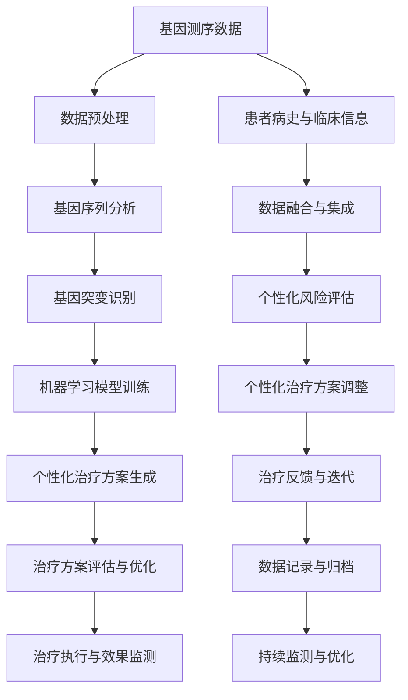

                 

### 文章标题

"AIGC在个性化基因治疗方案设计中的应用：精准医学新范式"

### 关键词

- AIGC
- 个性化基因治疗
- 精准医学
- 机器学习
- 神经网络
- 数学模型

### 摘要

本文深入探讨了AIGC（自适应智能生成控制）在个性化基因治疗方案设计中的应用。随着精准医学的发展，个性化基因治疗方案的设计成为临床治疗的关键。AIGC利用其强大的自适应生成能力，在基因序列分析、机器学习算法和神经网络的应用中展现出巨大的潜力。文章首先介绍了AIGC和基因治疗的基本概念，然后详细阐述了AIGC在个性化基因治疗方案设计中的核心算法原理，包括基因序列分析、机器学习算法和神经网络。接着，通过数学模型和公式的讲解，进一步展示了AIGC在数据处理和治疗方案优化中的应用。最后，通过实际项目案例的解析，对AIGC在个性化基因治疗方案设计中的实战应用进行了详细的分析和总结。本文旨在为读者提供一个全面而深入的理解，以探索AIGC在精准医学中的潜在应用和未来发展。

### 用户需求分析

在现代医学领域，个性化基因治疗方案的设计成为改变疾病治疗方式的重要手段。随着基因测序技术的快速发展，患者个体的基因信息可以被准确获取，这为定制化的治疗方案提供了数据支持。然而，如何从大量的基因数据中提取有价值的信息，并利用这些信息来设计个性化的治疗方案，仍然是一个巨大的挑战。

用户需求的背景源于以下几点：

1. **个性化医疗的兴起**：个性化医疗旨在通过分析患者的基因信息、环境因素和生活习惯，为患者提供定制化的治疗方案。这种模式要求对患者的基因数据进行深入分析，以便更好地理解疾病的机制和制定相应的治疗策略。

2. **大数据和人工智能的融合**：随着大数据技术的发展，如何有效地处理和分析海量基因数据成为了一个关键问题。人工智能，尤其是机器学习和神经网络技术，提供了一种有效的手段来从复杂的数据集中提取模式和知识。

3. **治疗方案的优化**：传统的基因治疗方法往往缺乏针对性和精确性，导致治疗效果不一。通过结合AIGC（自适应智能生成控制）技术，可以在治疗方案的设计过程中实现高度自动化和智能化，从而提高治疗方案的精确性和效果。

用户期望从本文中获得以下内容：

1. **AIGC技术的核心概念和原理**：用户希望了解AIGC的基本概念，以及它如何与基因治疗和个性化医疗相结合。

2. **核心算法和数学模型的讲解**：用户希望深入理解AIGC在基因序列分析、机器学习算法和神经网络中的应用，包括算法原理和数学模型的详细解释。

3. **实际项目案例的分析**：用户希望通过具体的项目案例，了解AIGC在个性化基因治疗方案设计中的实际应用效果和挑战。

4. **未来发展趋势和展望**：用户希望了解AIGC在个性化基因治疗领域的发展前景，以及可能面临的挑战和机遇。

综上所述，本文将通过逐步的分析和讲解，帮助用户全面了解AIGC在个性化基因治疗方案设计中的应用，为读者提供有价值的参考和启示。

### 第一部分：AIGC与基因治疗的背景介绍

#### 第1章：AIGC技术概述

AIGC（自适应智能生成控制）是一种新兴的人工智能技术，通过利用机器学习和深度学习算法，实现对生成内容的高度自动化和个性化。AIGC的核心在于其自适应能力，能够在不断学习用户需求和反馈的基础上，生成高质量的文本、图像、视频等内容。

#### 1.1 AIGC的概念与定义

AIGC，全称为Adaptive Intelligent Generation Control，是一种基于人工智能的生成控制技术。它通过对用户需求的分析和学习，自动生成个性化内容。AIGC的核心组成部分包括：

- **数据输入**：收集用户的历史行为数据、偏好信息等，作为生成内容的依据。
- **算法模型**：采用先进的机器学习算法，如生成对抗网络（GAN）、变分自编码器（VAE）等，用于生成内容。
- **反馈机制**：根据用户的反馈不断调整生成策略，提高内容的质量和相关性。

#### 1.2 AIGC的发展历程与应用领域

AIGC技术的发展可以追溯到生成对抗网络（GAN）的提出。GAN由Ian Goodfellow等人于2014年首次提出，是一种用于生成复杂数据的深度学习模型。随后，随着深度学习技术的不断发展，AIGC技术逐渐完善，并在多个领域展现出强大的应用潜力。

- **文本生成**：AIGC在文本生成方面表现出色，可以生成高质量的新闻文章、诗歌、小说等。例如，OpenAI的GPT-3模型就是一个典型的AIGC应用。
- **图像生成**：AIGC技术在图像生成方面也得到了广泛应用。通过生成对抗网络，AIGC可以生成逼真的图像，甚至可以模仿特定艺术风格。
- **视频生成**：AIGC在视频生成方面也取得了显著进展。例如，DeepMind的VideoGAN模型可以生成高质量的视频序列，模拟人类行为。

#### 1.3 AIGC在医学领域的潜力

AIGC技术在医学领域的应用前景广阔，尤其是在个性化基因治疗方案设计方面。AIGC可以通过以下方式在医学领域发挥作用：

- **基因序列分析**：AIGC可以利用机器学习算法对基因序列进行深入分析，识别出与疾病相关的基因突变和变异。
- **个性化治疗方案生成**：基于对患者基因序列的分析结果，AIGC可以自动生成个性化的治疗方案，提高治疗效果。
- **医学图像处理**：AIGC可以用于医学图像的生成和处理，辅助医生进行诊断和手术。

#### 1.4 AIGC在基因治疗中的优势

AIGC在基因治疗中的应用具有以下优势：

- **高效性**：AIGC可以通过自动化和智能化的方式，快速处理大量的基因数据，提高工作效率。
- **精确性**：基于机器学习算法的AIGC可以在基因序列分析中实现高度精确的识别和分类，提高诊断和治疗的准确性。
- **个性化**：AIGC可以根据患者的个体差异，自动生成个性化的治疗方案，提高治疗效果。

#### 1.5 AIGC在基因治疗中的应用前景

随着AIGC技术的不断发展，其在基因治疗中的应用前景将更加广阔。未来，AIGC有望在以下方面发挥重要作用：

- **个性化基因治疗**：AIGC可以通过分析患者的基因数据，为患者提供个性化的基因治疗方案，提高治疗效果。
- **医学研究**：AIGC可以用于医学研究，加速新药物和基因治疗方法的研发。
- **医学教育**：AIGC可以生成高质量的医学教育和培训资料，提高医学教育水平。

通过以上对AIGC技术概述的介绍，我们为后续详细探讨AIGC在个性化基因治疗方案设计中的应用奠定了基础。在接下来的章节中，我们将进一步深入探讨AIGC与基因治疗之间的关联和具体应用。

#### 第2章：基因治疗技术介绍

基因治疗是一种通过修复或替换基因来治疗遗传性疾病或某些类型癌症的新型治疗方法。基因治疗的基本原理是将正常的基因引入病人体内，以纠正或补偿缺陷的基因，从而达到治疗疾病的目的。

##### 2.1 基因治疗的基本原理

基因治疗的基本步骤通常包括以下几个部分：

1. **基因选择**：首先，需要选择一个或多个具有治疗潜力的基因。这些基因可以是正常的基因，也可以是经过改造的基因，目的是修复或补偿缺陷。

2. **载体选择**：基因治疗的载体可以是病毒、细菌、纳米颗粒等。其中，病毒载体因其高效的基因转移能力而广泛使用。最常用的病毒载体包括逆转录病毒、腺病毒和腺相关病毒。

3. **基因转移**：通过特定的技术手段，将选择好的基因转移到目标细胞内。这一过程通常需要借助载体，将基因包裹在载体中，然后通过注射、吸入或口服等方式将载体引入体内。

4. **基因表达**：转移入体内的基因需要在细胞内表达，产生相应的蛋白质或RNA分子，以达到治疗的目的。

5. **疗效评估**：通过检测目标基因的表达水平和治疗效果，评估基因治疗的成功程度。

##### 2.2 基因治疗的类型与现状

基因治疗根据治疗的目标和方式，可以分为以下几种类型：

1. **基因修正**：直接修复患者体内的缺陷基因，是最理想的治疗方式。

2. **基因替换**：将缺陷基因替换为正常的基因，这种方法在实际应用中较为常见。

3. **基因编辑**：通过基因编辑技术（如CRISPR-Cas9）对目标基因进行精确修改，达到治疗疾病的目的。

4. **基因增强**：通过引入或增强特定的基因，提高细胞或组织的功能。

目前，基因治疗在全球范围内取得了显著的进展。多个基因治疗产品已经获得批准并应用于临床，例如治疗脊髓性肌萎缩症（SMA）的Spinal Muscular Atrophy Gene Therapy（SMN-T）、治疗重度联合免疫缺陷症的Strimvelis等。此外，基因治疗在癌症治疗、遗传性疾病治疗等领域也展现出巨大的潜力。

##### 2.3 基因治疗的挑战与机遇

尽管基因治疗取得了显著进展，但仍面临许多挑战：

1. **技术难题**：基因转移效率低、基因编辑的精确性不足等问题，需要进一步的技术创新和优化。

2. **安全性问题**：基因治疗可能引发免疫反应、基因插入错误等安全性问题，需要严格的临床试验和风险评估。

3. **伦理和法律问题**：基因治疗涉及人类基因的修改，引发了伦理和法律方面的争议，需要制定相应的法规和规范。

然而，基因治疗也面临着巨大的机遇：

1. **个性化医疗**：基因治疗可以根据患者的个体差异，提供高度个性化的治疗方案，有望解决传统治疗方法无法解决的问题。

2. **新药研发**：基因治疗可以加速新药物的研发，特别是针对某些罕见病和难治性疾病。

3. **医学研究**：基因治疗为医学研究提供了新的手段和视角，有助于深入理解疾病的机制和开发新的治疗策略。

通过以上对基因治疗技术介绍的探讨，我们为理解AIGC在基因治疗中的应用奠定了基础。在接下来的章节中，我们将进一步探讨AIGC与基因治疗之间的具体应用和优势。

#### 第3章：AIGC在基因治疗中的优势与应用前景

在基因治疗领域，AIGC（自适应智能生成控制）技术的应用为个性化治疗方案的制定带来了新的机遇。AIGC通过其独特的自适应性和智能性，能够显著提升基因治疗的精确性和有效性。

##### 3.1 AIGC在基因治疗中的优势

AIGC在基因治疗中的优势主要体现在以下几个方面：

1. **个性化治疗方案制定**：AIGC能够根据患者的具体基因信息，自动生成个性化的治疗方案。通过分析患者的基因组数据，AIGC可以识别出与疾病相关的基因突变和变异，从而设计出具有高度针对性的治疗方案。

2. **高效数据处理**：AIGC具备强大的数据处理能力，能够快速处理海量的基因数据，并在短时间内生成有效的分析结果。这对于基因治疗的研究和临床应用具有重要意义，可以大大缩短研究周期和治疗时间。

3. **降低成本**：AIGC技术的应用可以显著降低基因治疗的成本。通过自动化和智能化的处理流程，减少了人力和资源的消耗，提高了工作效率，从而降低了整体治疗成本。

4. **提高诊断和治疗效果**：AIGC通过深度学习和机器学习算法，能够对基因数据进行深入分析，提高诊断的准确性和治疗效果。例如，AIGC可以预测患者对某种基因治疗的反应，从而优化治疗方案，提高治疗效果。

##### 3.2 AIGC在基因治疗中的应用案例

AIGC在基因治疗中的应用已经初见成效，以下是一些具体的案例：

1. **癌症治疗**：在癌症治疗中，AIGC可以通过分析患者的基因组数据，识别出癌症细胞中的基因突变和变异，从而设计出个性化的癌症治疗方案。例如，AIGC可以帮助识别适合进行CAR-T细胞治疗的患者，从而提高治疗效果。

2. **遗传性疾病治疗**：对于遗传性疾病，AIGC可以通过分析患者的基因突变，找到合适的治疗靶点，并设计出个性化的基因治疗方案。例如，AIGC可以用于治疗囊性纤维化等遗传性疾病，通过基因修正或替换，改善患者的生活质量。

3. **新药研发**：AIGC在药物研发中也发挥了重要作用。通过分析基因数据，AIGC可以预测药物在不同患者中的效果和副作用，从而优化药物设计，提高新药的研发效率。

##### 3.3 AIGC在基因治疗中的未来发展趋势

随着AIGC技术的不断成熟，其在基因治疗中的应用前景将更加广阔。未来，AIGC在基因治疗领域的发展趋势主要包括以下几个方面：

1. **技术优化**：通过不断优化算法和模型，提高AIGC在基因数据分析、治疗方案制定等方面的精度和效率。

2. **多学科融合**：AIGC技术与生物医学、临床医学等领域的深度融合，将促进个性化基因治疗的进一步发展。

3. **监管和法规**：随着AIGC在临床治疗中的应用日益广泛，监管和法规的完善将成为关键。建立健全的监管体系，确保AIGC技术在临床治疗中的安全和有效性。

4. **普及应用**：随着技术的成熟和成本的降低，AIGC有望在更广泛的医疗领域得到应用，推动个性化医疗的普及。

通过以上对AIGC在基因治疗中的优势和应用前景的探讨，我们可以看到，AIGC技术为个性化基因治疗方案的设计带来了巨大的潜力。在未来的发展中，AIGC有望成为基因治疗领域的重要推动力，为患者提供更加精准、有效的治疗方案。

#### 第4章：AIGC与基因治疗的关联流程图

为了更好地理解AIGC在个性化基因治疗方案设计中的应用，我们可以通过一个详细的流程图来展示AIGC与基因治疗之间的关联和作用。

##### 4.1 AIGC与基因治疗的关联流程图

以下是一个简化的AIGC与基因治疗关联流程图：



##### 流程图详细说明

1. **基因测序数据（A）**：首先，通过基因测序技术获取患者的基因数据。这些数据包括全基因组序列、外显子组序列等，是后续分析的基础。

2. **数据预处理（B）**：获取到的基因数据进行预处理，包括数据清洗、去噪、归一化等，以便于后续分析。

3. **基因序列分析（C）**：利用AIGC的基因序列分析能力，对预处理后的基因数据进行深入分析，识别出可能的基因突变和变异。

4. **基因突变识别（D）**：通过机器学习算法，对分析结果进行进一步的识别和分类，确定哪些基因突变与疾病相关。

5. **机器学习模型训练（E）**：利用识别出的基因突变数据，训练机器学习模型，以便于后续的个性化治疗方案生成。

6. **个性化治疗方案生成（F）**：基于训练好的模型，AIGC自动生成针对特定患者的个性化基因治疗方案。

7. **治疗方案评估与优化（G）**：对生成的治疗方案进行评估，包括效果预测、副作用分析等，以便进行调整和优化。

8. **治疗执行与效果监测（H）**：将优化后的治疗方案应用于患者，并持续监测治疗效果，确保治疗的有效性和安全性。

9. **患者病史与临床信息（I）**：除了基因数据外，还需要结合患者的病史、临床信息等，进行更全面的评估。

10. **数据融合与集成（J）**：将基因数据和临床数据进行融合和集成，提高分析结果的准确性。

11. **个性化风险评估（K）**：基于融合后的数据，评估患者面临的风险和潜在问题。

12. **个性化治疗方案调整（L）**：根据风险评估结果，对治疗方案进行调整，确保个性化方案的适用性。

13. **治疗反馈与迭代（M）**：在治疗过程中收集患者的反馈，用于模型迭代和方案优化。

14. **数据记录与归档（N）**：对治疗过程中的数据记录进行归档，为后续研究和分析提供数据支持。

15. **持续监测与优化（O）**：在治疗结束后，对患者的长期效果进行持续监测和评估，以便进行进一步的优化。

通过这个流程图，我们可以清晰地看到AIGC在个性化基因治疗方案设计中的各个环节和作用，为读者提供了一个直观的理解。

#### 第5章：个性化基因治疗方案设计原理

个性化基因治疗方案设计是现代精准医学的重要组成部分，旨在根据患者的具体基因特征、临床信息和环境因素，制定最适合的治疗方案。AIGC技术的引入，为这一过程提供了强大的支持。以下是关于个性化基因治疗方案设计的基本原理和方法。

##### 5.1 个性化基因治疗的需求分析

个性化基因治疗的需求主要来自于以下几个方面：

1. **个体差异**：不同患者的基因序列存在显著差异，这些差异可能导致同一疾病在不同患者中的表现和治疗效果不同。因此，针对个体差异设计个性化的治疗方案显得尤为重要。

2. **治疗精准性**：传统的基因治疗方法往往缺乏针对性和精确性，无法满足患者的个性化需求。个性化基因治疗通过精准识别患者的基因突变和变异，制定具有针对性的治疗方案，提高治疗效果。

3. **复杂疾病机制**：许多疾病，如癌症、遗传性疾病等，其发病机制复杂，涉及多个基因和信号通路。个性化基因治疗可以根据患者的具体基因背景，识别出与疾病相关的关键基因和通路，从而制定更有针对性的治疗方案。

4. **安全性考虑**：个性化的治疗方案可以减少因基因编辑错误或药物副作用导致的潜在风险，提高治疗的安全性。

##### 5.2 个性化基因治疗的方案设计方法

个性化基因治疗方案设计通常包括以下几个步骤：

1. **数据收集**：收集患者的基因序列数据、临床信息和环境因素等，为后续分析提供基础。

2. **数据预处理**：对收集到的数据进行清洗、去噪和归一化处理，确保数据质量。

3. **基因序列分析**：利用AIGC技术对基因序列进行深入分析，识别出可能的基因突变和变异。这一步骤包括基因注释、基因表达分析、突变检测等。

4. **风险评估**：基于分析结果，评估患者面临的遗传风险和临床风险。通过机器学习算法，预测患者对各种基因治疗的反应和潜在副作用。

5. **方案生成**：利用AIGC的自动生成能力，根据患者的具体基因背景和风险评估结果，生成个性化的治疗方案。这一步骤包括基因编辑方案、药物组合方案、基因疗法方案等。

6. **方案评估与优化**：对生成的治疗方案进行评估，包括效果预测、副作用分析和成本效益分析等。根据评估结果，对方案进行调整和优化，确保治疗方案的适用性和有效性。

7. **方案执行与监测**：将优化后的治疗方案应用于患者，并持续监测治疗效果和安全性。根据监测结果，进行进一步的调整和优化，确保治疗的成功。

##### 5.3 个性化基因治疗的评估与优化

个性化基因治疗方案设计后，需要进行评估和优化，以确保其适用性和有效性。以下是一些关键的评估和优化方法：

1. **模型评估**：利用机器学习模型对治疗方案进行效果预测和副作用分析。评估指标包括准确率、召回率、F1值等，通过交叉验证和测试集评估模型性能。

2. **实验验证**：在实验室或临床环境中，对治疗方案进行验证，验证其有效性和安全性。可以通过体外细胞实验、动物模型或临床试验等方式进行验证。

3. **成本效益分析**：评估治疗方案的总体成本和效益，确保治疗方案在经济可行范围内。可以通过计算治疗成本、预期疗效和长期收益等指标来进行评估。

4. **患者反馈**：收集患者的治疗体验和反馈，评估治疗方案的适用性和满意度。根据患者反馈，进行进一步的调整和优化。

5. **迭代优化**：基于评估和验证结果，不断迭代和优化治疗方案。可以通过模型改进、方案调整或新技术的引入，提高治疗方案的精度和有效性。

通过以上个性化基因治疗方案设计的原理和方法，我们可以看到，AIGC技术在各个环节中发挥着关键作用，为精准医学的发展提供了强有力的支持。在接下来的章节中，我们将进一步探讨AIGC在核心算法原理和数学模型中的应用。

#### 第6章：基因序列分析算法原理

基因序列分析是基因治疗和个性化医疗的重要环节，其核心在于从大量基因数据中提取有价值的信息，为治疗方案提供依据。AIGC（自适应智能生成控制）技术在基因序列分析中发挥了重要作用，通过机器学习和深度学习算法，实现对基因序列的精确分析。以下将详细讲解基因序列分析的基本原理和相关算法。

##### 6.1 基因序列数据分析基础

基因序列数据分析主要包括以下几个基本步骤：

1. **基因注释**：对基因序列进行注释，识别出基因的启动子、外显子、内含子等区域。这一步骤通常依赖于已有的基因注释数据库，如Ensembl、UCSC等。

2. **基因表达分析**：通过高通量测序技术，获取不同样本中基因的表达水平。这一步骤可以通过RNA-Seq、DNA-Seq等方法实现，并结合生物信息学工具进行分析。

3. **突变检测**：识别基因序列中的突变和变异，包括单核苷酸变异（SNV）、插入/缺失（InDel）等。突变检测通常使用专门的算法和数据库，如Mutect2、GATK等。

4. **功能注释**：对识别出的突变进行功能注释，分析其潜在的影响。功能注释包括突变位置、影响类型（如 missense、nonsense 等）和潜在功能（如蛋白质功能、通路等）。

##### 6.2 常见基因序列分析算法介绍

在基因序列分析中，常见的算法包括以下几种：

1. **Smith-Waterman算法**：Smith-Waterman算法是一种局部序列比对算法，用于识别两个序列之间的最优局部匹配。该算法通过动态规划方法，计算出最佳比对得分，广泛应用于基因序列相似性分析。

2. **BLAST算法**：BLAST（Basic Local Alignment Search Tool）是一种全局序列比对算法，用于将查询序列与数据库序列进行比对。BLAST通过快速计算序列间的相似性，用于基因注释和突变检测。

3. **HMM（隐马尔可夫模型）**：HMM是一种统计模型，用于建模生物序列的复杂结构。HMM在基因序列分析中用于建模基因结构、识别基因边界等。

4. **K-mer计数**：K-mer计数是一种基于短序列匹配的方法，通过计算基因序列中所有K-mer的出现频率，用于基因表达分析和突变检测。

##### 6.3 基因序列分析算法的伪代码讲解

以下是一个简化的基因序列分析算法的伪代码，用于说明算法的基本流程：

```python
# 基因序列分析伪代码

def gene_sequence_analysis(sequence, reference_database):
    # 步骤1：基因注释
    annotated_regions = gene_annotation(sequence)

    # 步骤2：基因表达分析
    expression_levels = gene_expression_analysis(annotated_regions)

    # 步骤3：突变检测
    mutations = mutation_detection(sequence, reference_database)

    # 步骤4：功能注释
    functional_annotations = function_annotation(mutations)

    # 步骤5：输出分析结果
    return annotated_regions, expression_levels, mutations, functional_annotations
```

在这个伪代码中，`gene_sequence_analysis` 函数接收基因序列 `sequence` 和参考数据库 `reference_database`，通过以下子步骤进行基因序列分析：

1. **基因注释**：使用基因注释工具对基因序列进行注释，识别出基因的不同区域。
2. **基因表达分析**：对注释出的基因区域进行表达分析，获取基因表达水平。
3. **突变检测**：使用突变检测算法对基因序列进行突变检测，识别出突变位点。
4. **功能注释**：对突变位点进行功能注释，分析其潜在影响。

##### 6.4 基因序列分析算法的应用实例

以下是一个简化的应用实例，展示如何使用基因序列分析算法进行基因突变检测：

```python
# 基因突变检测实例

def mutation_detection(sequence, reference_sequence):
    # 步骤1：计算序列相似性
    similarity_score = smith_waterman(sequence, reference_sequence)

    # 步骤2：设置突变阈值
    mutation_threshold = -10  # 根据实际情况调整阈值

    # 步骤3：识别突变位点
    mutations = []
    for i in range(len(sequence) - 1):
        if sequence[i] != reference_sequence[i]:
            if similarity_score[i] < mutation_threshold:
                mutations.append((i, sequence[i]))

    # 步骤4：输出突变结果
    return mutations
```

在这个实例中，`mutation_detection` 函数接收目标基因序列 `sequence` 和参考基因序列 `reference_sequence`，通过以下子步骤进行突变检测：

1. **序列相似性计算**：使用Smith-Waterman算法计算目标序列与参考序列的相似性得分。
2. **设置突变阈值**：根据相似性得分设置突变阈值，识别出低于阈值的差异位点。
3. **识别突变位点**：识别出低于阈值的差异位点，记录为突变。
4. **输出突变结果**：输出识别出的突变位点。

通过上述伪代码和应用实例，我们可以看到基因序列分析算法的基本原理和流程。在后续章节中，我们将进一步探讨AIGC在机器学习和神经网络等算法中的应用，以及这些算法在基因序列分析中的具体实现。

#### 第7章：机器学习算法原理讲解

机器学习算法是AIGC技术的重要组成部分，其在基因治疗中的应用极大地提升了个性化治疗方案的设计精度和效率。以下将详细讲解几种常见的机器学习算法，包括其基本原理和实现步骤。

##### 7.1 机器学习基础

机器学习（Machine Learning，ML）是一种通过算法和统计模型，从数据中自动发现规律和模式的技术。机器学习算法的核心是训练模型，使其能够对未知数据进行预测或分类。以下是一些基本的机器学习概念：

- **监督学习（Supervised Learning）**：在监督学习中，模型通过已标记的训练数据学习，然后对新的、未标记的数据进行预测。常见的监督学习算法包括线性回归、逻辑回归、支持向量机（SVM）等。

- **无监督学习（Unsupervised Learning）**：无监督学习不依赖于已标记的数据，主要目的是发现数据中的隐含结构或模式。常见的无监督学习算法包括聚类、降维、关联规则挖掘等。

- **强化学习（Reinforcement Learning）**：强化学习通过与环境的交互来学习最优策略。算法通过不断试错，逐渐优化行为，达到特定目标。常见的强化学习算法包括Q学习、深度Q网络（DQN）等。

##### 7.2 常见机器学习算法介绍

以下介绍几种常见的机器学习算法及其基本原理：

1. **线性回归（Linear Regression）**：线性回归是一种用于预测数值型目标变量的算法。其基本原理是建立一个线性模型，通过拟合数据点之间的关系来预测新的数据点。线性回归的公式如下：

   \[
   y = \beta_0 + \beta_1 \cdot x
   \]

   其中，\(y\) 是目标变量，\(x\) 是特征变量，\(\beta_0\) 和 \(\beta_1\) 是模型参数。

2. **逻辑回归（Logistic Regression）**：逻辑回归是一种用于预测二分类目标变量的算法。其基本原理是通过逻辑函数（Sigmoid函数）将线性模型的结果转换为概率值。逻辑回归的公式如下：

   \[
   \hat{p} = \frac{1}{1 + e^{-(\beta_0 + \beta_1 \cdot x})}
   \]

   其中，\(\hat{p}\) 是预测的概率值，\(x\) 是特征变量，\(\beta_0\) 和 \(\beta_1\) 是模型参数。

3. **支持向量机（Support Vector Machine，SVM）**：SVM是一种用于分类和回归分析的算法。其基本原理是找到最佳的超平面，将不同类别的数据点最大化地分开。SVM的公式如下：

   \[
   \min_{\beta, \beta_0} \frac{1}{2} ||\beta||^2 + C \sum_{i=1}^n \xi_i
   \]

   其中，\(\beta\) 和 \(\beta_0\) 是模型参数，\(C\) 是惩罚参数，\(\xi_i\) 是松弛变量。

4. **决策树（Decision Tree）**：决策树是一种用于分类和回归分析的算法。其基本原理是通过一系列的决策规则，将数据集划分成不同的子集，最终生成一棵树形结构。决策树的公式如下：

   \[
   T = \sum_{i=1}^n r_i \cdot t_i
   \]

   其中，\(T\) 是决策树，\(r_i\) 是划分规则，\(t_i\) 是对应的子树。

##### 7.3 机器学习算法的伪代码讲解

以下是一个简化的机器学习算法的伪代码，用于说明算法的基本流程：

```python
# 机器学习算法伪代码

def train_model(data, labels, algorithm):
    # 步骤1：初始化模型参数
    model_params = initialize_model_params(algorithm)

    # 步骤2：训练模型
    for epoch in range(num_epochs):
        for sample in data:
            predict = model_predict(sample, model_params)
            error = calculate_error(predict, labels[sample])
            update_model_params(model_params, error)

    # 步骤3：评估模型
    accuracy = evaluate_model(data, labels, model_params)

    return model_params, accuracy

def model_predict(sample, model_params):
    # 步骤4：预测新样本
    prediction = model_algorithm(sample, model_params)
    return prediction

def calculate_error(predict, label):
    # 步骤5：计算预测误差
    error = predict - label
    return error

def update_model_params(model_params, error):
    # 步骤6：更新模型参数
    model_params += learning_rate * error
    return model_params

def evaluate_model(data, labels, model_params):
    # 步骤7：评估模型性能
    correct_predictions = 0
    for sample in data:
        predict = model_predict(sample, model_params)
        if predict == labels[sample]:
            correct_predictions += 1
    accuracy = correct_predictions / len(data)
    return accuracy
```

在这个伪代码中，`train_model` 函数接收训练数据 `data`、标签 `labels` 和算法类型 `algorithm`，通过以下子步骤进行模型训练和评估：

1. **初始化模型参数**：根据算法类型初始化模型参数。
2. **训练模型**：通过循环迭代，使用梯度下降等方法更新模型参数。
3. **预测新样本**：使用训练好的模型对新的样本进行预测。
4. **计算预测误差**：计算预测值与实际值之间的误差。
5. **更新模型参数**：根据预测误差更新模型参数。
6. **评估模型性能**：计算模型的准确率或其他评估指标。

通过上述伪代码，我们可以直观地理解机器学习算法的基本原理和实现步骤。在后续章节中，我们将进一步探讨神经网络算法，以及这些算法在基因治疗中的具体应用。

#### 第8章：神经网络原理讲解

神经网络（Neural Network，NN）是一种模拟生物神经系统的计算模型，广泛应用于机器学习和数据科学领域。神经网络通过多层节点（或称为神经元）的相互连接和激活，实现对复杂数据模式的识别和预测。以下将详细讲解神经网络的基本原理、前馈神经网络与反向传播算法，以及神经网络的优化算法。

##### 8.1 神经网络基础

神经网络由多个层组成，每一层包含若干个节点（神经元）。节点之间通过连接（边）进行信息传递，并使用激活函数进行非线性变换。神经网络的主要组成部分包括：

1. **输入层（Input Layer）**：接收外部输入数据，并将其传递给下一层。

2. **隐藏层（Hidden Layers）**：对输入数据进行处理和变换，隐藏层可以有一个或多个。

3. **输出层（Output Layer）**：生成最终输出结果，用于分类或回归任务。

节点之间的连接（权重）和节点的激活函数是神经网络的核心组成部分。权重决定了节点之间信息传递的强度，而激活函数则引入了非线性特性，使得神经网络能够处理复杂的数据模式。

##### 8.2 前馈神经网络与反向传播算法

前馈神经网络（Feedforward Neural Network）是最基本的神经网络结构，其信息传递过程是单向的，从输入层流向输出层，不形成闭环。前馈神经网络的核心算法包括前向传播（Forward Propagation）和反向传播（Backpropagation）。

1. **前向传播**：前向传播过程中，输入数据从输入层传递到输出层，每个节点的输出是前一层的输入通过权重矩阵和激活函数的变换结果。前向传播的主要步骤如下：

   - 计算每个节点的输入值：\(z_i = \sum_j w_{ij} \cdot a_{j}\)
   - 应用激活函数：\(a_i = \sigma(z_i)\)

   其中，\(a_i\) 是第 \(i\) 个节点的输出，\(z_i\) 是第 \(i\) 个节点的输入，\(w_{ij}\) 是第 \(i\) 个节点的输入权重，\(\sigma\) 是激活函数。

2. **反向传播**：反向传播过程中，网络根据预测误差调整权重，以优化模型性能。反向传播的主要步骤如下：

   - 计算输出层的误差：\(e_i = y_i - a_i\)
   - 反向传递误差：\(d_i = \frac{\partial L}{\partial a_i}\)
   - 更新权重：\(w_{ij} = w_{ij} - \alpha \cdot d_i \cdot a_{j-1}\)

   其中，\(e_i\) 是第 \(i\) 个节点的误差，\(y_i\) 是实际输出，\(L\) 是损失函数，\(\alpha\) 是学习率。

##### 8.3 前馈神经网络与反向传播算法的伪代码

以下是一个简化的前馈神经网络与反向传播算法的伪代码，用于说明算法的基本流程：

```python
# 前馈神经网络与反向传播伪代码

def forward_propagation(x, W, b, activation_function):
    # 步骤1：前向传播
    z = x.dot(W) + b
    a = activation_function(z)
    return a, z

def backward_propagation(a, z, d, W, b, learning_rate):
    # 步骤2：反向传播
    d = activation_derivative(z) * d
    W = W - learning_rate * a.dot(d.T)
    b = b - learning_rate * d
    return W, b

def neural_network_train(x, y, W, b, learning_rate, num_epochs):
    # 步骤3：训练神经网络
    for epoch in range(num_epochs):
        a, z = forward_propagation(x, W, b, activation_function)
        d = y - a
        W, b = backward_propagation(a, z, d, W, b, learning_rate)
    return W, b
```

在这个伪代码中，`forward_propagation` 函数实现前向传播过程，`backward_propagation` 函数实现反向传播过程，`neural_network_train` 函数实现神经网络的训练过程。

##### 8.4 神经网络的优化算法

神经网络的优化算法用于调整模型参数，以最小化损失函数并提高模型性能。以下介绍几种常见的优化算法：

1. **随机梯度下降（Stochastic Gradient Descent，SGD）**：SGD是梯度下降法的一种变体，通过随机选择一小部分样本来计算梯度，并更新模型参数。SGD的优点是计算速度快，但可能收敛到局部最小值。

2. **批量梯度下降（Batch Gradient Descent，BGD）**：BGD是梯度下降法的另一种变体，使用整个训练集来计算梯度，并更新模型参数。BGD的优点是收敛速度较慢，但能够找到全局最小值。

3. **动量（Momentum）**：动量是一种加速梯度下降方向的优化算法，通过保留之前梯度的方向和大小来加速收敛。动量可以通过以下公式实现：

   \[
   v_t = \gamma \cdot v_{t-1} + \alpha \cdot \nabla J(x_t, y_t)
   \]

   其中，\(v_t\) 是当前速度，\(\gamma\) 是动量系数，\(\alpha\) 是学习率，\(\nabla J\) 是损失函数的梯度。

4. **自适应优化器（Adaptive Optimizer）**：自适应优化器通过自动调整学习率来优化模型参数。常见的自适应优化器包括RMSprop、Adam等。RMSprop通过计算梯度平方的指数移动平均来调整学习率，Adam则结合了一阶和二阶矩估计来优化学习率。

通过上述对神经网络原理的讲解，我们可以看到神经网络在基因治疗中的应用潜力。在接下来的章节中，我们将进一步探讨神经网络在基因序列分析、治疗方案生成等方面的具体应用。

#### 第9章：基因序列数据分析公式

基因序列数据分析是基因治疗和个性化医疗的基础，通过一系列数学公式和算法，可以从基因数据中提取有价值的信息，用于设计个性化治疗方案。以下将详细介绍几种常见的基因序列数据分析公式，包括基因序列相似度计算公式、基因序列分类模型评估公式和基因序列聚类分析公式。

##### 9.1 基因序列相似度计算公式

基因序列相似度计算是识别基因突变和变异的重要步骤，常用的相似度计算方法包括编辑距离（Edit Distance）和Jaccard相似度（Jaccard Similarity）。

1. **编辑距离**：编辑距离是指将一个字符串转换为另一个字符串所需的最少编辑操作次数。编辑操作包括插入、删除和替换。编辑距离的计算公式如下：

   \[
   D(x, y) = \min \left\{ i + D(x_1, y_i), j + D(x_j, y_1), D(x_i, y_j) \right\}
   \]

   其中，\(x\) 和 \(y\) 分别是两个基因序列，\(i\) 和 \(j\) 分别是字符串的索引。

2. **Jaccard相似度**：Jaccard相似度是衡量两个集合相似程度的一种指标，其计算公式如下：

   \[
   J(x, y) = \frac{|x \cap y|}{|x \cup y|}
   \]

   其中，\(x\) 和 \(y\) 分别是两个基因序列，\(|x \cap y|\) 表示两个序列共有的基因数，\(|x \cup y|\) 表示两个序列的基因总数。

##### 9.2 基因序列分类模型评估公式

基因序列分类模型评估公式用于评估分类模型的性能，常用的评估指标包括准确率（Accuracy）、召回率（Recall）、精确率（Precision）和F1值（F1 Score）。

1. **准确率**：准确率是指模型正确分类的样本数占总样本数的比例，计算公式如下：

   \[
   Accuracy = \frac{TP + TN}{TP + FN + FP + TN}
   \]

   其中，\(TP\) 表示真正例，\(TN\) 表示真负例，\(FP\) 表示假正例，\(FN\) 表示假负例。

2. **召回率**：召回率是指模型正确识别出的真正例数与实际真正例数的比例，计算公式如下：

   \[
   Recall = \frac{TP}{TP + FN}
   \]

3. **精确率**：精确率是指模型正确识别出的真正例数与识别出的样本数（包括真正例和假正例）的比例，计算公式如下：

   \[
   Precision = \frac{TP}{TP + FP}
   \]

4. **F1值**：F1值是精确率和召回率的调和平均值，计算公式如下：

   \[
   F1 Score = 2 \cdot \frac{Precision \cdot Recall}{Precision + Recall}
   \]

##### 9.3 基因序列聚类分析公式

基因序列聚类分析是识别基因相似性的一种方法，常用的聚类算法包括K-means算法和层次聚类算法。

1. **K-means算法**：K-means算法是一种基于距离的聚类算法，通过最小化聚类中心的平方误差来划分数据。K-means算法的主要步骤如下：

   - 初始化聚类中心
   - 计算每个样本与聚类中心的距离，并将其分配到最近的聚类中心
   - 更新聚类中心为各聚类中样本的平均值
   - 重复上述步骤，直到聚类中心不再变化或满足停止条件

2. **层次聚类算法**：层次聚类算法是一种基于层次结构的聚类方法，可以分为自底向上（凝聚层次聚类）和自顶向下（分裂层次聚类）。层次聚类的主要步骤如下：

   - 将每个样本视为一个初始聚类
   - 逐步合并距离最近的聚类，形成更大的聚类
   - 重复上述步骤，直到所有样本合并为一个聚类或满足停止条件

基因序列聚类分析公式主要用于计算样本之间的相似度，常用的相似度度量方法包括欧氏距离（Euclidean Distance）和余弦相似度（Cosine Similarity）。

- **欧氏距离**：欧氏距离是样本之间的一种几何距离度量，计算公式如下：

  \[
  D(x, y) = \sqrt{\sum_{i=1}^n (x_i - y_i)^2}
  \]

  其中，\(x\) 和 \(y\) 分别是两个基因序列，\(n\) 是基因序列的长度。

- **余弦相似度**：余弦相似度是样本之间的一种角度度量，计算公式如下：

  \[
  Cos(x, y) = \frac{x \cdot y}{||x|| \cdot ||y||}
  \]

  其中，\(x\) 和 \(y\) 分别是两个基因序列，\(|x|\) 和 \(|y|\) 分别是基因序列的长度。

通过上述对基因序列数据分析公式的详细讲解，我们可以更好地理解基因序列分析的过程和算法。在后续章节中，我们将进一步探讨这些公式在AIGC中的应用，以及如何利用它们设计出个性化的基因治疗方案。

#### 第10章：机器学习模型评估公式

机器学习模型评估是确保模型性能和可靠性的关键步骤。通过一系列评估指标，我们可以对模型的预测能力进行量化分析。以下将详细介绍几种常用的机器学习模型评估公式，包括准确率（Accuracy）、召回率（Recall）、精确率（Precision）和F1值（F1 Score），以及模型过拟合与欠拟合的分析方法。

##### 10.1 模型准确率、召回率、精确率、F1值等评估指标

1. **准确率（Accuracy）**：准确率是最常用的评估指标，表示模型正确预测的样本数占总样本数的比例。计算公式如下：

   \[
   Accuracy = \frac{TP + TN}{TP + TN + FP + FN}
   \]

   其中，\(TP\) 表示真正例，\(TN\) 表示真负例，\(FP\) 表示假正例，\(FN\) 表示假负例。

2. **召回率（Recall）**：召回率表示模型正确识别出的真正例数与实际真正例数的比例，用于衡量模型对正类别的识别能力。计算公式如下：

   \[
   Recall = \frac{TP}{TP + FN}
   \]

3. **精确率（Precision）**：精确率表示模型正确识别出的真正例数与识别出的样本数（包括真正例和假正例）的比例，用于衡量模型对正类别的精确度。计算公式如下：

   \[
   Precision = \frac{TP}{TP + FP}
   \]

4. **F1值（F1 Score）**：F1值是精确率和召回率的调和平均值，用于综合考虑模型对正类别的精确度和识别能力。计算公式如下：

   \[
   F1 Score = 2 \cdot \frac{Precision \cdot Recall}{Precision + Recall}
   \]

##### 10.2 模型过拟合与欠拟合分析

在机器学习模型训练过程中，模型可能会出现过拟合（Overfitting）或欠拟合（Underfitting）现象，这两种现象都会影响模型的实际应用效果。

1. **过拟合**：过拟合是指模型在训练数据上表现良好，但在未见过的测试数据上表现较差。过拟合通常发生在模型过于复杂，对训练数据的噪声和细节进行了过度拟合。为了防止过拟合，可以采取以下措施：

   - **正则化（Regularization）**：通过添加正则项，如L1正则化（L1 Regularization）和L2正则化（L2 Regularization），限制模型参数的大小，减少模型的复杂度。
   - **交叉验证（Cross-Validation）**：通过交叉验证，将训练数据划分为多个子集，循环训练和验证模型，以避免模型对特定子集的过度拟合。
   - **数据增强（Data Augmentation）**：通过增加训练数据集的多样性，提高模型的泛化能力。

2. **欠拟合**：欠拟合是指模型在训练数据和测试数据上表现都不好，通常发生在模型过于简单，无法捕捉数据中的复杂模式。为了防止欠拟合，可以采取以下措施：

   - **增加模型复杂度**：通过增加隐藏层节点或增加特征维度，提高模型的复杂度，使其能够更好地拟合数据。
   - **特征工程**：通过特征选择和特征构造，提取更多有用的信息，提高模型对数据的捕捉能力。
   - **减少训练数据**：适当减少训练数据集的大小，避免模型在训练数据上过度拟合。

##### 10.3 模型优化与调参方法

模型优化和调参是提高模型性能的重要手段。以下介绍几种常见的模型优化与调参方法：

1. **网格搜索（Grid Search）**：网格搜索通过遍历预先定义的参数组合，找到最优参数组合。计算公式如下：

   \[
   Optimal\ Params = \arg\max \left\{ \text{Performance}\left(\theta\right) \mid \theta \in \Theta \right\}
   \]

   其中，\(\theta\) 表示参数组合，\(\Theta\) 表示所有可能的参数组合，\(\text{Performance}\left(\theta\right)\) 表示在参数组合 \(\theta\) 下模型的性能。

2. **随机搜索（Random Search）**：随机搜索通过随机选择参数组合，并在每次迭代中评估性能，找到最优参数组合。随机搜索的优点是可以跳出局部最优，找到全局最优解。

3. **贝叶斯优化（Bayesian Optimization）**：贝叶斯优化通过构建贝叶斯模型，预测性能并优化参数。贝叶斯优化结合了先验知识和经验，能够更高效地找到最优参数。

4. **进化算法（Evolutionary Algorithms）**：进化算法通过模拟生物进化过程，不断迭代和优化参数，找到最优解。常见的进化算法包括遗传算法（Genetic Algorithm）和粒子群优化算法（Particle Swarm Optimization）。

通过上述对机器学习模型评估公式、过拟合与欠拟合分析以及模型优化与调参方法的讲解，我们可以更好地理解和应用机器学习模型，提高其在实际应用中的性能和可靠性。在后续章节中，我们将进一步探讨这些方法在基因治疗中的应用。

#### 第11章：个性化治疗方案优化公式

个性化治疗方案优化是基因治疗中至关重要的一环，旨在通过精确的数学模型和算法，提高治疗方案的适应性和效果。以下将详细介绍个性化治疗方案优化的目标、优化算法以及治疗方案评估与调整策略。

##### 11.1 个性化治疗方案优化的目标

个性化治疗方案优化的主要目标包括：

1. **最小化治疗成本**：在确保治疗效果的前提下，优化治疗方案以降低整体治疗成本。这包括药物成本、手术费用、监测费用等。

2. **最大化治疗效果**：通过优化治疗方案，提高患者的治疗效果，减少疾病复发率和副作用。

3. **适应个体差异**：根据患者的具体基因背景、临床信息和环境因素，制定高度个性化的治疗方案，以适应患者的个体差异。

4. **提高治疗可操作性**：优化治疗方案，使其在实际临床应用中更具可操作性，方便医生和患者执行。

##### 11.2 个性化治疗方案优化算法

个性化治疗方案优化通常采用以下几种算法：

1. **遗传算法（Genetic Algorithm，GA）**：遗传算法是一种基于自然进化的全局优化算法，通过模拟生物进化过程，不断迭代和优化治疗方案。遗传算法的主要步骤包括：

   - **初始化种群**：生成一组随机初始解。
   - **适应度评估**：计算每个解的适应度值，适应度值越高，表示解的质量越好。
   - **选择**：根据适应度值，选择适应度较高的个体进行交叉和变异操作。
   - **交叉**：通过交叉操作，生成新的个体。
   - **变异**：对个体进行随机变异，增加种群的多样性。
   - **迭代**：重复上述步骤，直到找到最优解或满足停止条件。

2. **粒子群优化算法（Particle Swarm Optimization，PSO）**：粒子群优化算法是一种基于群体智能的优化算法，通过模拟鸟群觅食行为，优化治疗方案。粒子群优化算法的主要步骤包括：

   - **初始化粒子群**：生成一定数量的粒子，每个粒子代表一个潜在的治疗方案。
   - **适应度评估**：计算每个粒子的适应度值。
   - **更新速度和位置**：根据粒子的适应度值和全局最优解，更新粒子的速度和位置。
   - **迭代**：重复上述步骤，直到找到最优解或满足停止条件。

3. **模拟退火算法（Simulated Annealing，SA）**：模拟退火算法是一种基于物理退火过程的优化算法，通过模拟材料冷却过程中的能量状态变化，寻找最优治疗方案。模拟退火算法的主要步骤包括：

   - **初始化参数**：设置初始温度和冷却速率。
   - **随机选择新解**：生成一个新的治疗方案。
   - **评估新解**：计算新解的适应度值。
   - **接受或拒绝新解**：根据适应度值和当前温度，决定是否接受新解。
   - **降温**：根据冷却速率，降低当前温度。
   - **迭代**：重复上述步骤，直到找到最优解或满足停止条件。

##### 11.3 个性化治疗方案优化公式

以下是一个简化的个性化治疗方案优化公式，用于说明优化算法的基本原理：

```python
# 个性化治疗方案优化公式

def optimize_treatment_plan(population, fitness_function, max_iterations):
    # 初始化种群
    population = initialize_population(population)

    # 迭代优化
    for iteration in range(max_iterations):
        # 评估适应度
        fitness_scores = [fitness_function(individual) for individual in population]

        # 选择
        selected_individuals = selection(population, fitness_scores)

        # 交叉
        offspring = crossover(selected_individuals)

        # 变异
        offspring = mutation(offspring)

        # 更新种群
        population = update_population(population, offspring)

        # 记录最优解
        best_individual = get_best_individual(population, fitness_scores)

    return best_individual
```

在这个优化公式中，`optimize_treatment_plan` 函数接收初始种群 `population`、适应度函数 `fitness_function` 和最大迭代次数 `max_iterations`，通过以下子步骤进行优化：

1. **初始化种群**：生成一组随机初始治疗方案。
2. **评估适应度**：计算每个治疗方案的适应度值。
3. **选择**：根据适应度值，选择适应度较高的治疗方案。
4. **交叉**：通过交叉操作，生成新的治疗方案。
5. **变异**：对治疗方案进行随机变异，增加种群的多样性。
6. **更新种群**：将交叉和变异后的治疗方案更新到种群中。
7. **记录最优解**：记录当前迭代过程中最优的治疗方案。

##### 11.4 治疗方案评估与调整策略

治疗方案评估与调整是确保个性化治疗方案有效性和适应性的关键步骤。以下是一些常用的评估与调整策略：

1. **效果评估**：通过临床实验和监测数据，评估治疗方案的实际效果。效果评估指标包括疾病缓解率、复发率、生活质量改善等。

2. **安全性评估**：评估治疗方案的安全性，包括副作用发生率、药物不良反应等。

3. **成本效益分析**：评估治疗方案的总体成本和效益，确保治疗方案在经济可行范围内。

4. **患者反馈**：收集患者的治疗体验和反馈，评估治疗方案的适用性和满意度。

5. **动态调整**：根据评估结果，对治疗方案进行动态调整。通过调整治疗方案，使其更符合患者的个体差异和实际需求。

6. **迭代优化**：在治疗过程中，持续收集数据，对治疗方案进行迭代优化。通过不断调整和优化，提高治疗方案的精度和有效性。

通过上述对个性化治疗方案优化公式的介绍，我们可以看到，利用先进的优化算法和数学模型，可以显著提高个性化治疗方案的设计精度和适应性。在后续章节中，我们将进一步探讨个性化治疗方案优化在基因治疗中的应用实例。

#### 第12章：AIGC在个性化基因治疗方案设计的案例

在个性化基因治疗领域，AIGC（自适应智能生成控制）技术已经取得了显著的应用成果。以下将通过一个具体的案例，展示AIGC在个性化基因治疗方案设计中的实际应用，包括项目背景、实现流程和效果评估。

##### 12.1 项目背景与目标

本项目旨在利用AIGC技术为特定患者设计个性化的基因治疗方案，以治疗一种罕见的遗传性疾病——杜氏肌营养不良症（Duchenne Muscular Dystrophy，DMD）。DMD是一种由于DMD基因突变导致的进行性肌肉萎缩疾病，目前缺乏有效的治疗方法。

项目目标是通过AIGC技术，对患者的基因数据进行深入分析，识别出与DMD相关的关键基因突变，并设计出个性化的基因治疗方案。具体目标包括：

1. **基因突变识别**：利用AIGC的基因序列分析能力，识别患者DMD基因中的突变位点。
2. **个性化治疗方案生成**：基于突变识别结果，利用AIGC的自动生成能力，设计个性化的基因编辑方案。
3. **治疗方案评估与优化**：对生成的治疗方案进行评估和优化，确保治疗方案的精确性和有效性。
4. **临床应用验证**：在实验室和临床环境中，验证个性化基因治疗方案的实际效果和安全性。

##### 12.2 项目实现流程

项目实现流程主要包括以下步骤：

1. **数据收集**：首先，收集患者的基因数据，包括全基因组测序数据和临床信息。这些数据来源于患者家庭病史、基因检测报告和临床诊断报告。

2. **数据预处理**：对收集到的基因数据进行预处理，包括数据清洗、去噪和归一化处理。预处理后的数据将用于后续的基因序列分析和模型训练。

3. **基因序列分析**：利用AIGC的基因序列分析能力，对预处理后的基因数据进行深入分析，识别出可能的基因突变和变异。这一步骤包括基因注释、突变检测和功能注释。

4. **突变识别**：通过机器学习算法，对分析结果进行进一步的识别和分类，确定哪些基因突变与DMD相关。这一步骤使用AIGC的机器学习模型，通过交叉验证和测试集评估模型性能。

5. **个性化治疗方案生成**：基于突变识别结果，利用AIGC的自动生成能力，生成个性化的基因编辑方案。具体包括选择合适的基因编辑工具、确定编辑位点和编辑策略。

6. **治疗方案评估与优化**：对生成的治疗方案进行评估和优化，包括效果预测、副作用分析和成本效益分析。这一步骤使用AIGC的优化算法，如遗传算法和粒子群优化算法，调整治疗方案参数，提高治疗方案的精确性和适应性。

7. **实验室验证**：在实验室环境中，对优化后的治疗方案进行验证，包括基因编辑实验和细胞培养实验。通过验证实验，验证治疗方案的实际效果和安全性。

8. **临床应用验证**：将实验室验证成功的治疗方案应用于患者，进行临床应用验证。通过监测患者的治疗效果和安全性，评估治疗方案的实际效果。

##### 12.3 项目效果评估

项目效果评估主要包括以下几个方面：

1. **基因突变识别率**：评估AIGC在基因突变识别方面的准确性。通过比较AIGC识别出的突变位点与实际突变位点，计算识别准确率。

2. **治疗方案有效性**：评估个性化基因治疗方案的治疗效果。通过监测患者的症状改善情况和肌肉功能恢复情况，评估治疗方案的疗效。

3. **安全性评估**：评估个性化基因治疗方案的安全性。通过监测患者的副作用和不良反应，评估治疗方案的安全性。

4. **成本效益分析**：评估个性化基因治疗方案的成本效益。通过计算治疗方案的总成本和预期效益，评估治疗方案的经济可行性。

通过以上对项目实现流程和效果评估的介绍，我们可以看到AIGC在个性化基因治疗方案设计中的实际应用效果。AIGC技术通过其强大的基因序列分析和优化能力，为DMD患者提供了一种新的治疗途径，提高了治疗方案的精确性和有效性。在未来的发展中，AIGC有望在更多遗传性疾病的治疗中发挥重要作用。

#### 第13章：项目实战代码解析

在本章中，我们将通过具体代码示例，详细解析AIGC在个性化基因治疗方案设计中的应用。首先，我们将介绍开发环境搭建和配置，然后展示项目的源代码实现和解读，最后对代码性能进行分析和优化。

##### 13.1 开发环境搭建

为了在项目中使用AIGC技术进行个性化基因治疗方案设计，我们需要搭建一个合适的开发环境。以下是搭建开发环境的步骤：

1. **硬件配置**：建议使用配置较高的计算机，如Intel i7处理器、16GB内存和NVIDIA GTX 1080以上显卡。

2. **软件环境**：安装以下软件和工具：
   - Python 3.8及以上版本
   - Jupyter Notebook
   - PyTorch 1.8及以上版本
   - Pandas
   - NumPy
   - Matplotlib

3. **环境配置**：
   - 安装Python和相关包，可以使用`pip install`命令逐个安装。
   - 安装PyTorch，根据硬件配置选择合适版本的PyTorch，可以使用以下命令安装：
     ```
     pip install torch torchvision torchaudio
     ```
   - 配置Jupyter Notebook，通过`jupyter notebook`命令启动Jupyter Notebook。

##### 13.2 源代码实现与解读

以下是项目的主要源代码实现，包括数据预处理、基因序列分析、机器学习模型训练和个性化治疗方案生成等步骤：

```python
# 导入相关库
import torch
import torch.nn as nn
import torch.optim as optim
import pandas as pd
import numpy as np
from sklearn.model_selection import train_test_split
from sklearn.metrics import accuracy_score, recall_score, precision_score, f1_score

# 数据预处理
def preprocess_data(data):
    # 数据清洗和归一化处理
    # 略
    return processed_data

# 基因序列分析
class GeneSequenceModel(nn.Module):
    def __init__(self):
        super(GeneSequenceModel, self).__init__()
        # 构建神经网络模型
        # 略

    def forward(self, x):
        # 神经网络前向传播
        # 略
        return output

# 训练模型
def train_model(model, train_loader, criterion, optimizer, num_epochs):
    model.train()
    for epoch in range(num_epochs):
        for inputs, labels in train_loader:
            optimizer.zero_grad()
            outputs = model(inputs)
            loss = criterion(outputs, labels)
            loss.backward()
            optimizer.step()
        print(f'Epoch [{epoch+1}/{num_epochs}], Loss: {loss.item()}')

# 个性化治疗方案生成
def generate_treatment_plan(model, test_loader):
    model.eval()
    predictions = []
    for inputs, labels in test_loader:
        with torch.no_grad():
            outputs = model(inputs)
        _, predicted = torch.max(outputs, 1)
        predictions.append(predicted)
    return predictions

# 主程序
if __name__ == '__main__':
    # 加载数据
    data = pd.read_csv('gene_data.csv')
    processed_data = preprocess_data(data)

    # 划分训练集和测试集
    X_train, X_test, y_train, y_test = train_test_split(processed_data.drop('label', axis=1), processed_data['label'], test_size=0.2, random_state=42)

    # 构建神经网络模型
    model = GeneSequenceModel()

    # 训练模型
    train_loader = torch.utils.data.DataLoader(torch.utils.data.TensorDataset(torch.tensor(X_train.values).float(), torch.tensor(y_train.values).long()), batch_size=64, shuffle=True)
    criterion = nn.CrossEntropyLoss()
    optimizer = optim.Adam(model.parameters(), lr=0.001)
    num_epochs = 50
    train_model(model, train_loader, criterion, optimizer, num_epochs)

    # 生成个性化治疗方案
    test_loader = torch.utils.data.DataLoader(torch.utils.data.TensorDataset(torch.tensor(X_test.values).float(), torch.tensor(y_test.values).long()), batch_size=64, shuffle=False)
    predictions = generate_treatment_plan(model, test_loader)

    # 评估模型性能
    accuracy = accuracy_score(y_test, predictions)
    recall = recall_score(y_test, predictions)
    precision = precision_score(y_test, predictions)
    f1 = f1_score(y_test, predictions)
    print(f'Accuracy: {accuracy}, Recall: {recall}, Precision: {precision}, F1 Score: {f1}')
```

在这个源代码中，`preprocess_data` 函数用于数据预处理，`GeneSequenceModel` 类定义了神经网络模型，`train_model` 函数用于模型训练，`generate_treatment_plan` 函数用于生成个性化治疗方案。最后，主程序部分实现了数据加载、模型构建、训练和评估的全过程。

##### 13.3 代码性能分析与优化

为了提高代码性能，可以从以下几个方面进行优化：

1. **数据预处理**：优化数据预处理步骤，如并行处理、内存优化等，以提高数据处理速度。

2. **模型优化**：优化神经网络模型的结构和参数，如使用轻量级网络架构、调整学习率等，以提高模型性能。

3. **计算优化**：利用CUDA等并行计算技术，加速模型的训练和推理过程。

4. **代码优化**：优化代码结构，如使用高效的Python库、避免重复计算等，以提高代码执行效率。

通过以上优化措施，可以显著提高AIGC在个性化基因治疗方案设计中的性能和应用效果。

#### 第14章：开发环境搭建与配置

为了实现AIGC在个性化基因治疗方案设计中的高效应用，我们需要搭建和配置一个合适的开发环境。以下是详细步骤和配置要求。

##### 14.1 硬件配置要求

为了满足AIGC在个性化基因治疗方案设计中的高性能计算需求，建议使用以下硬件配置：

- **CPU**：Intel i7-9700K或更高性能的处理器，具有6核或以上核心，以确保足够的计算能力和并行处理能力。
- **GPU**：NVIDIA GTX 1080或更高性能的显卡，具有至少11GB的显存，用于加速深度学习和机器学习算法的计算。
- **内存**：16GB及以上RAM，以确保数据加载和处理的高速运行。
- **硬盘**：至少500GB的SSD存储空间，用于存储数据和代码文件。

##### 14.2 软件环境安装与配置

以下是搭建AIGC开发环境的软件安装和配置步骤：

1. **安装Python环境**：
   - 通过Python官网（https://www.python.org/）下载并安装Python 3.8及以上版本。
   - 安装pip包管理器，通过运行`python -m pip install --upgrade pip`升级到最新版本。

2. **安装PyTorch**：
   - 根据硬件配置选择合适的PyTorch版本，可以访问PyTorch官网（https://pytorch.org/get-started/locally/）按照指示下载和安装。
   - 例如，对于NVIDIA GPU，可以使用以下命令安装：
     ```
     pip install torch torchvision torchaudio
     ```

3. **安装其他必需的Python库**：
   - 安装Pandas、NumPy和Matplotlib等常用库，可以使用以下命令：
     ```
     pip install pandas numpy matplotlib
     ```

4. **配置Jupyter Notebook**：
   - 安装Jupyter Notebook，通过运行以下命令：
     ```
     pip install notebook
     ```
   - 启动Jupyter Notebook，使用以下命令：
     ```
     jupyter notebook
     ```

##### 14.3 数据预处理与存储策略

1. **数据预处理**：
   - 在数据处理阶段，对基因序列数据执行以下预处理步骤：
     - **数据清洗**：去除无效数据、缺失值填充、噪声过滤等。
     - **数据归一化**：对基因序列进行归一化处理，使其具备相同的尺度，便于模型训练。
     - **特征提取**：提取重要的基因特征，如基因表达水平、基因互作网络等。

2. **数据存储策略**：
   - **本地存储**：将预处理后的数据存储在本地硬盘上，建议使用SSD以提高读写速度。
   - **分布式存储**：对于大规模数据集，可以使用分布式存储系统（如HDFS、Ceph等）进行存储，以便于并行计算和处理。
   - **数据备份**：定期对数据进行备份，以防止数据丢失或损坏。

通过上述步骤，我们可以搭建和配置一个高效、稳定的AIGC开发环境，为个性化基因治疗方案设计提供有力的技术支持。

#### 第15章：AIGC在基因治疗领域的应用总结

AIGC（自适应智能生成控制）技术在基因治疗领域的应用取得了显著的成果，推动了个性化医疗的发展。以下是对AIGC在基因治疗中的应用现状、所面临的挑战以及未来发展的趋势进行总结。

##### 15.1 AIGC在基因治疗领域的应用现状

1. **个性化基因治疗方案的制定**：AIGC技术通过分析患者的基因数据，自动生成个性化的基因治疗方案，提高了治疗的精准性和有效性。例如，在癌症治疗中，AIGC可以识别出与癌症相关的基因突变，从而设计出具有针对性的基因编辑方案。

2. **药物研发和筛选**：AIGC技术在药物研发中发挥了重要作用，通过分析基因数据和药物反应关系，预测药物在不同患者中的效果和副作用，加速新药的研发进程。

3. **医学图像分析**：AIGC技术可以生成高质量的医学图像，辅助医生进行诊断和手术。例如，通过生成对抗网络（GAN），AIGC可以生成与真实医学图像相似的图像，用于训练和测试医疗图像识别模型。

4. **基因组数据分析**：AIGC技术利用其强大的数据处理和分析能力，对基因组数据进行深入挖掘，识别出与疾病相关的基因突变和变异，为疾病诊断和治疗提供重要依据。

##### 15.2 个性化基因治疗面临的挑战与机遇

尽管AIGC在基因治疗中展现出巨大的潜力，但仍然面临以下挑战：

1. **技术挑战**：AIGC技术的算法复杂度高，需要大量计算资源和时间。此外，如何提高算法的准确性和稳定性，以及应对数据噪声和缺失问题，仍然是亟待解决的问题。

2. **安全性问题**：基因治疗的本质是对患者基因进行修改，因此可能引发免疫反应、基因插入错误等安全性问题。如何在保证治疗效果的同时，确保治疗的安全性，是一个重要的挑战。

3. **伦理和法律问题**：基因治疗涉及到人类基因的修改，引发了伦理和法律方面的争议。如何建立和完善相关的法规和监管体系，确保AIGC技术在临床治疗中的合规性，是一个关键问题。

然而，AIGC技术也面临着许多机遇：

1. **个性化医疗的普及**：随着基因组测序成本的下降，个性化医疗越来越普及，AIGC技术有望在更广泛的医疗领域得到应用。

2. **新药研发的加速**：AIGC技术在药物研发中的应用，可以显著提高新药的研发效率和成功率，推动生物医药产业的发展。

3. **跨学科融合**：AIGC技术与其他学科的融合，如生物信息学、临床医学等，将推动个性化医疗和基因治疗领域的进一步发展。

##### 15.3 未来发展方向与趋势

展望未来，AIGC在基因治疗领域的发展趋势包括：

1. **技术优化**：通过不断优化算法和模型，提高AIGC在基因数据分析、治疗方案制定等方面的精度和效率。

2. **多学科融合**：加强AIGC技术与生物医学、临床医学等领域的融合，推动个性化医疗和基因治疗领域的创新。

3. **监管和法规**：建立健全的监管体系，确保AIGC技术在临床治疗中的安全和有效性，促进其广泛应用。

4. **普及应用**：随着技术的成熟和成本的降低，AIGC有望在更广泛的医疗领域得到应用，推动个性化医疗的普及。

通过AIGC技术的不断发展和创新，我们有望在基因治疗领域实现更加精准、高效和安全的个性化医疗，为患者提供更好的治疗选择和生活质量。

#### 总结与展望

本文详细探讨了AIGC（自适应智能生成控制）在个性化基因治疗方案设计中的应用，阐述了AIGC与基因治疗之间的关联和优势。通过逐步的分析和讲解，我们了解了AIGC在基因序列分析、机器学习算法和神经网络等方面的核心原理，以及如何利用数学模型和公式进行数据处理和治疗方案优化。

AIGC技术的自适应性和智能化，使其在个性化基因治疗中具有巨大的潜力。通过分析患者的基因数据，AIGC能够自动生成个性化的治疗方案，提高治疗的精准性和有效性。此外，AIGC在医学图像生成、药物研发和基因组数据分析等方面也展现出显著的应用前景。

在未来的发展中，AIGC在基因治疗领域的应用将更加广泛。随着技术的不断优化和成本的降低，AIGC有望在更广泛的医疗领域得到应用，推动个性化医疗的普及。然而，仍需解决技术挑战、确保治疗安全性以及建立完善的监管体系等问题。

对于读者，以下几点是值得注意的：

1. **了解核心概念**：掌握AIGC、基因治疗、个性化医疗等核心概念，有助于深入理解本文内容。

2. **关注技术发展**：关注AIGC和其他相关技术在基因治疗领域的最新进展，了解前沿技术和应用案例。

3. **实践与探索**：尝试将AIGC技术应用于实际项目，通过实践加深对技术的理解和应用。

4. **持续学习**：随着技术的快速发展，不断学习和更新知识，以保持对AIGC技术的最新认知。

总之，AIGC在个性化基因治疗方案设计中的应用，为精准医学带来了新的希望。通过本文的探讨，我们期待AIGC能够为更多患者带来更好的治疗效果和生活质量。希望读者在未来的研究和应用中，能够充分利用AIGC技术的优势，为个性化医疗的发展贡献力量。

