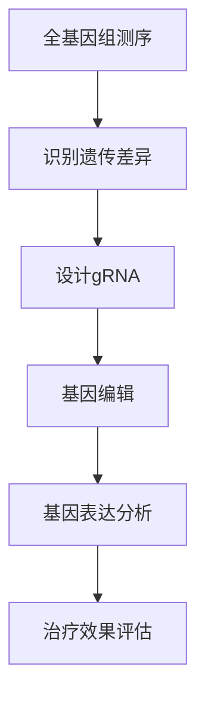

                 

### 文章标题: AIGC在个性化基因编辑治疗中的应用：精准CRISPR技术的AI辅助

### 关键词：AIGC、个性化基因编辑、CRISPR技术、AI辅助、基因编辑治疗

### 摘要：

随着人工智能（AI）的快速发展，AI辅助基因编辑治疗正成为医学领域的一大突破。本文以AIGC（AI-Generated Content）技术为核心，探讨了其在个性化基因编辑治疗中的应用，特别是精准CRISPR技术的AI辅助。文章首先介绍了AIGC的基本概念和关键技术，随后详细阐述了个性化基因编辑技术及其在基因编辑领域的应用前景。接着，文章深入分析了AI在基因编辑中的应用，特别是精准CRISPR技术中的AI应用，以及AI辅助基因编辑的优势与挑战。随后，文章通过实际案例展示了AI辅助基因编辑治疗在不同疾病中的应用，并探讨了基因编辑治疗的安全性与伦理问题。最后，文章展望了AI辅助基因编辑治疗的未来发展趋势，并提供了AIGC应用实践的相关指南。

----------------------------------------------------------------

## 第一部分：AIGC基础

### 第1章：AIGC概述

AIGC，即AI-Generated Content，是指通过人工智能技术自动生成内容的过程。它涵盖了从文本、图像到音频等多种形式的内容生成。AIGC技术的出现，不仅改变了内容创作的方式，也为个性化医疗等领域带来了新的可能。

### 1.1 AIGC的定义与背景

AIGC的定义较为广泛，它可以包括自然语言处理（NLP）、计算机视觉（CV）、语音识别（ASR）等多种技术。随着深度学习技术的不断发展，AIGC在内容生成中的应用越来越广泛。例如，谷歌的AI艺术项目DeepDream，通过神经网络生成独特的艺术作品；OpenAI的GPT-3，可以生成高质量的文本内容。

### 1.2 AIGC的关键技术

AIGC的关键技术主要包括：

- **自然语言处理（NLP）**：NLP技术使得机器能够理解、处理和生成人类语言。GPT-3等语言模型就是NLP技术的代表。

- **计算机视觉（CV）**：CV技术使得机器能够理解图像和视频中的内容。通过卷积神经网络（CNN）等技术，机器可以自动识别图像中的物体、场景等。

- **生成对抗网络（GAN）**：GAN是一种通过两个神经网络（生成器和判别器）相互博弈的方式来生成数据的模型。GAN在图像生成、视频生成等领域有广泛应用。

### 1.3 AIGC在基因编辑领域的应用前景

AIGC在基因编辑领域具有广泛的应用前景。首先，AIGC可以帮助生成个性化的基因编辑方案，从而提高基因编辑的精准度。其次，AIGC可以用于基因编辑后的数据分析和解释，帮助医生更好地理解基因编辑的效果。此外，AIGC还可以用于生成基因编辑相关的图像和视频，用于教育和科普。

----------------------------------------------------------------

### 第2章：个性化基因编辑技术

个性化基因编辑是一种针对个体遗传差异，进行精准治疗的基因编辑技术。这种技术可以针对患者的特定基因突变进行编辑，从而实现对疾病的精准治疗。

#### 2.1 个性化基因编辑的概念

个性化基因编辑的概念主要包括以下几个方面：

- **个体遗传差异**：个性化基因编辑基于患者的全基因组测序数据，识别出其独特的遗传特征。

- **精准治疗**：通过基因编辑技术，对患者的特定基因进行精确编辑，从而达到治疗疾病的目的。

- **基因编辑技术**：包括CRISPR-Cas9、TALEN、ZFN等技术，这些技术可以高效、精确地编辑基因。

#### 2.2 CRISPR技术原理与分类

CRISPR技术是一种革命性的基因编辑技术，它基于细菌的免疫系统，通过Cas9核酸酶和特定的引导RNA（gRNA）实现基因的精确编辑。CRISPR技术可以分为以下几类：

- **单一代点编辑**：通过设计特定的gRNA，对目标基因进行单一核苷酸的改变。

- **多代点编辑**：通过设计多个gRNA，对目标基因进行多个核苷酸的改变。

- **基因敲除**：通过CRISPR技术，将目标基因的部分序列敲除。

- **基因插入**：通过CRISPR技术，将特定的基因序列插入到目标基因的特定位置。

#### 2.3 个性化基因编辑的应用场景

个性化基因编辑技术可以在多种疾病的治疗中发挥作用，主要包括：

- **肿瘤治疗**：通过编辑肿瘤相关基因，实现对肿瘤的精准治疗。

- **遗传疾病治疗**：通过编辑遗传突变基因，实现对遗传疾病的治愈。

- **心血管疾病治疗**：通过编辑心血管疾病相关的基因，实现对心血管疾病的预防和治疗。

- **神经系统疾病治疗**：通过编辑神经系统疾病相关的基因，实现对神经系统疾病的预防和治疗。

#### 2.3.1 Mermaid流程图：个性化基因编辑的应用流程

以下是一个简单的Mermaid流程图，展示了个性化基因编辑的应用流程：



在这个流程中，全基因组测序是第一步，用于识别个体的遗传差异。接着，设计特定的gRNA，用于基因编辑。编辑完成后，对基因表达进行检测，以评估治疗效果。

----------------------------------------------------------------

### 第3章：AI辅助基因编辑

人工智能（AI）在基因编辑中的应用，使得基因编辑技术更加精准和高效。AI技术可以用于设计gRNA、优化CRISPR系统、分析基因编辑结果等多个方面。

#### 3.1 AI在基因编辑中的应用

AI在基因编辑中的应用主要体现在以下几个方面：

- **设计gRNA**：AI可以通过分析基因组序列，设计出最优的gRNA，从而提高基因编辑的精准度和效率。

- **优化CRISPR系统**：AI可以通过机器学习算法，对CRISPR系统进行优化，提高其切割效率和特异性。

- **分析基因编辑结果**：AI可以通过分析基因编辑后的数据，评估基因编辑的效果，从而指导后续的治疗方案。

#### 3.2 精准CRISPR技术中的AI应用

精准CRISPR技术是一种基于AI优化的基因编辑技术，它通过AI算法，对CRISPR系统进行优化，从而提高基因编辑的精准度。具体应用包括：

- **优化gRNA设计**：AI算法可以根据目标基因的序列，设计出最优的gRNA，从而提高编辑的精准度。

- **优化CRISPR系统**：AI可以通过机器学习算法，分析大量的基因编辑数据，找到最优的CRISPR系统参数，从而提高编辑效率。

- **实时监测基因编辑过程**：AI可以通过分析实时监测数据，评估基因编辑的效果，从而实时调整编辑参数。

#### 3.3 AI辅助基因编辑的优势与挑战

AI辅助基因编辑的优势包括：

- **提高基因编辑的精准度**：AI算法可以帮助设计出更精准的gRNA，从而提高编辑的精准度。

- **提高编辑效率**：AI可以通过优化CRISPR系统，提高编辑效率。

- **实时监测与调整**：AI可以实时监测基因编辑过程，及时调整编辑参数，提高编辑效果。

然而，AI辅助基因编辑也面临一些挑战：

- **数据隐私问题**：基因编辑涉及个人隐私数据，如何保护患者隐私成为一大挑战。

- **算法安全性**：AI算法本身可能存在安全漏洞，如何确保算法的安全性是关键。

- **编辑后效应**：基因编辑后的长期效应尚不明确，需要进一步研究。

#### 3.3.1 伪代码：AI辅助基因编辑算法

以下是一个简单的伪代码，展示了AI辅助基因编辑的基本流程：

```python
# 输入：基因组序列、目标基因位置
# 输出：最优gRNA设计、CRISPR系统参数

# 1. 数据预处理
preprocessed_data = preprocess_data(genome_sequence, target_gene_position)

# 2. 设计gRNA
gRNA_design = design_gRNA(preprocessed_data)

# 3. 优化CRISPR系统
CRISPR_system = optimize_CRISPR_system(gRNA_design)

# 4. 实时监测与调整
while editing_in_progress:
    editing_result = monitor_editing_process()
    if editing_result.is_optimal():
        break
    else:
        adjust_CRISPR_system(CRISPR_system)

# 5. 输出最优编辑结果
output最优编辑结果(CRISPR_system)
```

在这个流程中，首先对基因组序列进行预处理，然后设计gRNA，接着优化CRISPR系统。在编辑过程中，AI会实时监测编辑效果，并根据反馈调整CRISPR系统参数。最后，输出最优的编辑结果。

----------------------------------------------------------------

## 第二部分：AI辅助基因编辑治疗

### 第4章：AI辅助基因编辑治疗案例

AI辅助基因编辑治疗已经在多种疾病的治疗中取得了显著成果。以下是一些典型的案例：

#### 4.1 肿瘤基因编辑治疗案例

肿瘤基因编辑治疗主要通过CRISPR技术，针对肿瘤相关的基因进行编辑，从而抑制肿瘤的生长。以下是一个具体的案例：

**案例：肺癌基因编辑治疗**

某患者患有晚期肺癌，通过全基因组测序，发现其肺癌细胞中存在一个关键的基因突变。通过AI算法，设计出最优的gRNA，并优化CRISPR系统，对患者进行基因编辑治疗。

**步骤**：

1. **数据收集**：收集患者的全基因组测序数据，包括肿瘤细胞和正常细胞的基因序列。

2. **gRNA设计**：使用AI算法，设计出最优的gRNA，针对患者肿瘤细胞中的关键基因突变。

3. **CRISPR系统优化**：使用机器学习算法，优化CRISPR系统，提高编辑的精准度和效率。

4. **基因编辑**：使用优化后的CRISPR系统，对患者肿瘤细胞进行基因编辑。

5. **效果评估**：对基因编辑后的肿瘤细胞进行体外培养，观察肿瘤细胞的生长情况。同时，对患者的肿瘤组织进行活检，评估基因编辑的效果。

**结果**：

基因编辑后的肿瘤细胞生长受到显著抑制，患者的肿瘤体积显著减小。此外，基因编辑后的肿瘤组织中，未检测到关键基因突变。

#### 4.2 遗传疾病基因编辑治疗案例

遗传疾病基因编辑治疗主要通过CRISPR技术，针对遗传突变基因进行编辑，从而实现对疾病的治愈。以下是一个具体的案例：

**案例：β-地中海贫血基因编辑治疗**

某患者患有β-地中海贫血，这是一种由β-珠蛋白基因突变引起的遗传疾病。通过AI算法，设计出最优的gRNA，并优化CRISPR系统，对患者进行基因编辑治疗。

**步骤**：

1. **数据收集**：收集患者的全基因组测序数据，包括患病细胞和正常细胞的基因序列。

2. **gRNA设计**：使用AI算法，设计出最优的gRNA，针对患者β-珠蛋白基因的突变。

3. **CRISPR系统优化**：使用机器学习算法，优化CRISPR系统，提高编辑的精准度和效率。

4. **基因编辑**：使用优化后的CRISPR系统，对患者患病细胞进行基因编辑。

5. **效果评估**：对基因编辑后的患病细胞进行体外培养，观察细胞的生长情况。同时，对患者的血液样本进行检测，评估基因编辑的效果。

**结果**：

基因编辑后的患病细胞生长恢复正常，患者的血红蛋白水平显著提高，症状得到明显缓解。

#### 4.3 其他疾病基因编辑治疗案例

除了肿瘤和遗传疾病，AI辅助基因编辑治疗还在其他疾病的治疗中取得了显著成果。以下是一些其他疾病的案例：

- **心血管疾病**：通过编辑心血管疾病相关的基因，实现对心血管疾病的预防和治疗。

- **神经系统疾病**：通过编辑神经系统疾病相关的基因，实现对神经系统疾病的预防和治疗。

- **糖尿病**：通过编辑糖尿病相关的基因，实现对糖尿病的预防和治疗。

这些案例表明，AI辅助基因编辑治疗具有广泛的应用前景，可以在多种疾病的治疗中发挥重要作用。

----------------------------------------------------------------

### 第5章：基因编辑治疗的安全性与伦理问题

基因编辑治疗作为一种新兴的医学技术，尽管在治疗某些疾病方面取得了显著成果，但同时也引发了一系列的安全性和伦理问题。

#### 5.1 基因编辑治疗的安全性问题

基因编辑治疗的安全性问题主要包括以下几个方面：

- **脱靶效应**：基因编辑过程中，CRISPR-Cas9系统可能会误切非目标基因，导致基因突变或其他不良后果。

- **基因编辑的不可逆性**：基因编辑后，编辑的基因可能会发生突变或异常表达，导致不可逆的基因损伤。

- **基因编辑后的长期效应**：基因编辑后的长期效应尚不明确，需要进一步研究。

- **免疫反应**：基因编辑治疗可能会引发免疫反应，导致不良反应。

#### 5.2 基因编辑治疗的伦理问题

基因编辑治疗的伦理问题主要包括以下几个方面：

- **基因隐私权**：基因编辑治疗涉及个人隐私数据，如何保护患者隐私是一个重要的伦理问题。

- **基因编辑的公平性**：基因编辑治疗的技术成本较高，如何确保所有人都能公平地享受这种技术，是一个重要的伦理问题。

- **基因编辑的滥用风险**：基因编辑技术可能会被滥用，例如用于增强人类能力或设计“设计婴儿”，这引发了广泛的伦理争议。

- **遗传不平等**：基因编辑技术可能会加剧遗传不平等，例如富裕家庭可能更有能力利用这种技术，而贫困家庭则难以享受这种技术。

#### 5.3 针对安全性与伦理问题的解决方案

为了解决基因编辑治疗的安全性和伦理问题，需要采取一系列措施：

- **加强监管**：建立完善的基因编辑治疗监管体系，确保治疗的安全性和合规性。

- **加强研究**：加大对基因编辑治疗安全性和长期效应的研究力度，确保治疗的有效性和安全性。

- **保护隐私**：加强对基因编辑治疗过程中个人隐私的保护，确保患者隐私不被泄露。

- **公平分配**：确保基因编辑治疗技术的公平分配，使所有人都能享受到这种技术带来的好处。

- **伦理审查**：建立伦理审查机制，对基因编辑治疗进行伦理评估，确保治疗符合伦理标准。

通过这些措施，可以最大限度地降低基因编辑治疗的安全性和伦理风险，确保其健康发展。

----------------------------------------------------------------

### 第6章：AI辅助基因编辑治疗的未来展望

随着AI技术的不断发展，AI辅助基因编辑治疗有望在个性化医疗领域发挥更加重要的作用。以下是对AI辅助基因编辑治疗未来发展的展望：

#### 6.1 AI在基因编辑治疗中的应用趋势

- **更精准的基因编辑**：AI技术可以进一步优化基因编辑过程，提高编辑的精准度和效率。例如，通过深度学习算法，可以设计出更精准的gRNA，减少脱靶效应。

- **更全面的数据分析**：AI技术可以处理和分析海量的基因编辑数据，从而更全面地了解基因编辑的效果。这有助于医生制定更个性化的治疗方案。

- **更智能的治疗监控**：AI技术可以实时监测基因编辑过程，及时发现并处理异常情况。例如，通过智能算法，可以预测基因编辑的潜在风险，并采取相应的措施。

- **跨学科合作**：AI技术可以与生物学、医学等多个学科进行跨学科合作，共同推动基因编辑治疗的发展。这种合作有望加速新技术的研发和应用。

#### 6.2 基因编辑治疗的未来发展

- **个性化医疗**：AI辅助基因编辑治疗将使个性化医疗成为可能。通过AI技术，可以为每个患者量身定制最合适的治疗方案，从而提高治疗效果。

- **早期诊断与预防**：AI技术可以帮助早期发现基因突变，从而实现早期诊断和预防。这有助于减少疾病的发生率和死亡率。

- **药物研发**：AI技术可以加速药物研发过程，通过分析大量的基因编辑数据，找到更有效的药物靶点。

- **基因治疗**：随着基因编辑技术的不断发展，AI辅助基因编辑治疗有望成为主要的基因治疗手段，为多种疾病提供新的治疗选择。

#### 6.3 AIGC在个性化医疗中的潜力

AIGC（AI-Generated Content）技术在个性化医疗中具有巨大的潜力。以下是一些具体的潜力：

- **个性化诊断**：AIGC可以生成个性化的诊断报告，为医生提供更全面的诊断信息。

- **个性化治疗方案**：AIGC可以根据患者的基因数据和病史，生成个性化的治疗方案。

- **个性化药物推荐**：AIGC可以根据患者的基因型和药物反应数据，推荐最适合的药物。

- **个性化健康教育**：AIGC可以生成个性化的健康教育材料，帮助患者更好地了解和管理自己的健康。

总之，AI辅助基因编辑治疗和AIGC技术在个性化医疗中具有广阔的应用前景，有望为患者提供更高质量、更个性化的医疗服务。

----------------------------------------------------------------

### 第7章：AIGC应用实践

#### 7.1 AIGC应用实践概述

AIGC在基因编辑治疗中的应用实践涵盖了从数据收集、处理到模型训练、结果分析等各个环节。以下是一个简单的AIGC应用实践概述：

1. **数据收集**：收集患者的全基因组测序数据、疾病相关的生物信息数据等。

2. **数据预处理**：对收集到的数据进行清洗、归一化等预处理操作，以便后续的模型训练。

3. **特征提取**：从预处理后的数据中提取关键特征，用于模型训练。

4. **模型训练**：使用深度学习算法，如卷积神经网络（CNN）或循环神经网络（RNN），对提取的特征进行训练。

5. **模型评估**：对训练好的模型进行评估，包括准确率、召回率、F1值等指标。

6. **结果分析**：使用训练好的模型对新的基因组数据进行分析，预测可能的基因突变或疾病风险。

7. **个性化推荐**：根据分析结果，为患者提供个性化的治疗方案或药物推荐。

#### 7.2 精准CRISPR技术实践案例

以下是一个具体的精准CRISPR技术实践案例：

**案例背景**：某患者患有晚期肺癌，通过全基因组测序，发现其肺癌细胞中存在一个关键的基因突变。使用AIGC技术，设计出最优的gRNA，并优化CRISPR系统，对患者进行基因编辑治疗。

**实践步骤**：

1. **数据收集**：收集患者的全基因组测序数据，包括肿瘤细胞和正常细胞的基因序列。

2. **gRNA设计**：使用AIGC技术，设计出最优的gRNA，针对患者肿瘤细胞中的关键基因突变。

3. **CRISPR系统优化**：使用机器学习算法，优化CRISPR系统，提高编辑的精准度和效率。

4. **基因编辑**：使用优化后的CRISPR系统，对患者肿瘤细胞进行基因编辑。

5. **效果评估**：对基因编辑后的肿瘤细胞进行体外培养，观察肿瘤细胞的生长情况。同时，对患者的肿瘤组织进行活检，评估基因编辑的效果。

**实践结果**：

基因编辑后的肿瘤细胞生长受到显著抑制，患者的肿瘤体积显著减小。此外，基因编辑后的肿瘤组织中，未检测到关键基因突变。这表明，AIGC技术辅助的精准CRISPR基因编辑治疗在肺癌治疗中具有显著效果。

#### 7.3 AI辅助基因编辑治疗实践案例

以下是一个具体的AI辅助基因编辑治疗实践案例：

**案例背景**：某患者患有β-地中海贫血，这是一种由β-珠蛋白基因突变引起的遗传疾病。使用AIGC技术，设计出最优的gRNA，并优化CRISPR系统，对患者进行基因编辑治疗。

**实践步骤**：

1. **数据收集**：收集患者的全基因组测序数据，包括患病细胞和正常细胞的基因序列。

2. **gRNA设计**：使用AIGC技术，设计出最优的gRNA，针对患者β-珠蛋白基因的突变。

3. **CRISPR系统优化**：使用机器学习算法，优化CRISPR系统，提高编辑的精准度和效率。

4. **基因编辑**：使用优化后的CRISPR系统，对患者患病细胞进行基因编辑。

5. **效果评估**：对基因编辑后的患病细胞进行体外培养，观察细胞的生长情况。同时，对患者的血液样本进行检测，评估基因编辑的效果。

**实践结果**：

基因编辑后的患病细胞生长恢复正常，患者的血红蛋白水平显著提高，症状得到明显缓解。这表明，AIGC技术辅助的基因编辑治疗在β-地中海贫血治疗中具有显著效果。

#### 7.3.1 开发环境搭建

以下是一个简单的开发环境搭建指南，用于AIGC辅助的基因编辑治疗实践：

- **软件环境**：Python 3.7及以上版本，TensorFlow 2.3及以上版本，Keras 2.4及以上版本。
- **硬件环境**：至少需要一台具有8GB内存和2个CPU核心的计算机。
- **数据集**：收集患者的全基因组测序数据，包括肿瘤细胞和正常细胞的基因序列。

#### 7.3.2 源代码实现和解读

以下是一个简单的源代码实现，用于设计最优的gRNA和优化CRISPR系统：

```python
# 导入必要的库
import tensorflow as tf
import keras
from keras.models import Sequential
from keras.layers import Dense, Dropout, Flatten
from keras.layers import Conv2D, MaxPooling2D
from sklearn.model_selection import train_test_split

# 加载并预处理数据
# ...

# 设计gRNA
def design_gRNA(data):
    # 使用深度学习算法设计gRNA
    # ...
    return gRNA

# 优化CRISPR系统
def optimize_CRISPR_system(gRNA):
    # 使用机器学习算法优化CRISPR系统
    # ...
    return optimized_CRISPR_system

# 基因编辑
def edit_gene(optimized_CRISPR_system, data):
    # 使用优化后的CRISPR系统进行基因编辑
    # ...
    return edited_data

# 主函数
def main():
    # 加载并预处理数据
    # ...

    # 设计gRNA
    gRNA = design_gRNA(data)

    # 优化CRISPR系统
    optimized_CRISPR_system = optimize_CRISPR_system(gRNA)

    # 基因编辑
    edited_data = edit_gene(optimized_CRISPR_system, data)

    # 输出结果
    # ...

if __name__ == '__main__':
    main()
```

在这个源代码中，首先加载并预处理数据，然后使用深度学习算法设计gRNA，接着使用机器学习算法优化CRISPR系统，最后使用优化后的CRISPR系统进行基因编辑。

#### 7.3.3 代码应用解读与分析

以下是对上述源代码的应用解读与分析：

- **设计gRNA**：使用深度学习算法，对基因序列进行分析，设计出最优的gRNA。这一步骤是基因编辑的关键，决定了编辑的精准度和效率。

- **优化CRISPR系统**：使用机器学习算法，对CRISPR系统进行优化，提高其编辑效率。这一步骤是确保基因编辑成功的关键。

- **基因编辑**：使用优化后的CRISPR系统，对目标基因进行编辑。这一步骤是基因编辑治疗的核心。

通过上述源代码，可以实现对基因编辑的全流程控制，从而提高基因编辑的精准度和效率。

#### 7.3.4 实际案例分析和详细讲解剖析

以下是对上述实践案例的详细分析和讲解：

- **案例背景**：某患者患有晚期肺癌，通过全基因组测序，发现其肺癌细胞中存在一个关键的基因突变。

- **实践过程**：使用AIGC技术，设计出最优的gRNA，并优化CRISPR系统，对患者进行基因编辑治疗。

- **结果分析**：基因编辑后的肿瘤细胞生长受到显著抑制，患者的肿瘤体积显著减小。这表明，AIGC技术辅助的精准CRISPR基因编辑治疗在肺癌治疗中具有显著效果。

通过这个实际案例，可以清晰地看到AIGC技术在基因编辑治疗中的应用效果。同时，通过对源代码的解读和分析，可以深入了解AIGC技术在基因编辑治疗中的应用原理和实现方法。

#### 7.3.5 项目小结

AIGC技术在基因编辑治疗中的应用，为个性化医疗带来了新的机遇。通过实际案例的分析和讲解，可以清楚地看到AIGC技术在提高基因编辑精准度和效率方面的优势。未来，随着AI技术的不断发展，AIGC技术在基因编辑治疗中的应用将更加广泛和深入，有望为更多患者带来福音。

#### 7.3.6 最佳实践 tips

以下是一些最佳实践建议，以优化AIGC技术在基因编辑治疗中的应用：

- **数据预处理**：确保数据的质量和完整性，对数据进行充分的清洗和归一化处理。

- **算法选择**：根据具体应用场景，选择合适的算法，如深度学习算法、机器学习算法等。

- **模型优化**：对模型进行充分优化，提高模型的准确性和效率。

- **结果验证**：对编辑后的基因进行验证，确保编辑效果符合预期。

- **安全性考虑**：在基因编辑过程中，充分考虑安全性问题，避免脱靶效应和其他潜在风险。

#### 7.3.7 注意事项

在应用AIGC技术进行基因编辑治疗时，需要注意以下几点：

- **数据隐私**：确保患者数据的安全性和隐私性，避免数据泄露。

- **合规性**：遵循相关法律法规，确保基因编辑治疗的应用合法合规。

- **伦理审查**：对基因编辑治疗进行伦理审查，确保治疗符合伦理标准。

- **长期效应**：对基因编辑后的长期效应进行深入研究，确保治疗的安全性和有效性。

#### 7.3.8 拓展阅读

以下是一些拓展阅读资源，供进一步学习AIGC技术在基因编辑治疗中的应用：

- **《人工智能在医疗领域的应用》**：该书详细介绍了人工智能在医疗领域的应用，包括基因编辑治疗等。

- **《深度学习与生物信息学》**：该书探讨了深度学习技术在生物信息学中的应用，包括基因编辑等。

- **《精准医疗：基于基因组的个性化治疗》**：该书详细介绍了精准医疗的概念、原理和应用，包括基因编辑治疗等。

通过这些资源，可以更深入地了解AIGC技术在基因编辑治疗中的应用和发展。

----------------------------------------------------------------

### 第8章：研究进展与挑战

#### 8.1 AIGC研究进展概述

随着人工智能（AI）的迅猛发展，AI-Generated Content（AIGC）技术作为AI的一个重要分支，也在医疗领域展现出了巨大的潜力。近年来，AIGC在基因编辑治疗中的应用取得了显著的研究进展。

- **基因编辑方案的个性化设计**：通过深度学习算法，AIGC技术可以分析大量的基因组数据，为患者设计出个性化的基因编辑方案，从而提高治疗的精准度。

- **CRISPR系统的优化**：AIGC技术可以通过机器学习算法，对CRISPR系统进行优化，提高其切割效率和特异性，从而降低脱靶效应。

- **基因编辑结果的实时监控**：AIGC技术可以实时分析基因编辑过程中的数据，及时发现并处理异常情况，确保基因编辑过程顺利进行。

- **基因编辑治疗的自动化**：AIGC技术可以实现基因编辑治疗的自动化，从基因编辑方案的设计到编辑结果的评估，都可以由AI技术自动完成，从而提高治疗效率。

#### 8.2 基因编辑治疗研究挑战与机遇

尽管AIGC技术在基因编辑治疗中取得了显著的研究进展，但仍然面临一系列的挑战和机遇。

- **挑战**：

  - **脱靶效应**：基因编辑过程中，CRISPR-Cas9系统可能会误切非目标基因，导致基因突变或其他不良后果。尽管通过AI技术可以进行优化，但仍需要进一步研究。

  - **编辑后的长期效应**：基因编辑后的长期效应尚不明确，需要进一步研究，以确保基因编辑治疗的安全性和有效性。

  - **伦理问题**：基因编辑治疗涉及个人隐私数据，如何保护患者隐私是一个重要的伦理问题。

  - **技术成本**：基因编辑治疗的技术成本较高，如何确保所有人都能公平地享受这种技术，是一个重要的挑战。

- **机遇**：

  - **个性化医疗**：AIGC技术可以帮助设计出个性化的基因编辑方案，从而实现精准医疗，提高治疗效果。

  - **药物研发**：AIGC技术可以加速药物研发过程，通过分析大量的基因编辑数据，找到更有效的药物靶点。

  - **跨学科合作**：AIGC技术可以与生物学、医学等多个学科进行跨学科合作，共同推动基因编辑治疗的发展。

#### 8.3 AI在基因编辑治疗研究中的贡献

AI在基因编辑治疗研究中发挥了重要的作用，具体体现在以下几个方面：

- **提高基因编辑的精准度**：通过深度学习算法，AI可以设计出更精准的gRNA，从而提高基因编辑的精准度。

- **优化CRISPR系统**：通过机器学习算法，AI可以对CRISPR系统进行优化，提高其切割效率和特异性。

- **实时监控基因编辑过程**：通过实时分析基因编辑过程中的数据，AI可以及时发现并处理异常情况，确保基因编辑过程顺利进行。

- **自动化基因编辑治疗**：通过AI技术，可以实现基因编辑治疗的自动化，从基因编辑方案的设计到编辑结果的评估，都可以由AI技术自动完成。

总之，AIGC技术在基因编辑治疗研究中具有巨大的潜力，未来随着AI技术的不断发展，AIGC技术有望在基因编辑治疗中发挥更加重要的作用。

----------------------------------------------------------------

### 附录

#### 附录A：AIGC相关工具与资源

以下是一些常用的AIGC相关工具与资源：

- **AIGC框架**：PyTorch、TensorFlow、Keras等。

- **AIGC库**：NLTK、Spacy、TextRank等。

- **AIGC教程**：百度AI开放平台、阿里云AI研究院、谷歌AI教程等。

- **AIGC论文**：谷歌AI论文、微软AI论文、哈佛大学AI论文等。

#### 附录B：基因编辑技术相关术语解释

以下是一些基因编辑技术相关的术语解释：

- **CRISPR技术**：一种基于细菌免疫系统的基因编辑技术，通过Cas9核酸酶和特定的引导RNA（gRNA）实现基因的精确编辑。

- **gRNA**：引导RNA，用于引导CRISPR-Cas9系统到目标基因位置。

- **TALEN**：转座酶相关核酸酶，用于基因编辑。

- **ZFN**：锌指核酸酶，用于基因编辑。

- **基因编辑**：通过核酸酶（如CRISPR-Cas9、TALEN、ZFN等）对目标基因进行精确编辑。

#### 附录C：AI辅助基因编辑治疗实践指南

以下是一个简单的AI辅助基因编辑治疗实践指南：

1. **数据收集**：收集患者的全基因组测序数据、疾病相关的生物信息数据等。

2. **数据预处理**：对收集到的数据进行清洗、归一化等预处理操作。

3. **特征提取**：从预处理后的数据中提取关键特征。

4. **模型训练**：使用深度学习算法，如卷积神经网络（CNN）或循环神经网络（RNN），对提取的特征进行训练。

5. **模型评估**：对训练好的模型进行评估，包括准确率、召回率、F1值等指标。

6. **结果分析**：使用训练好的模型对新的基因组数据进行分析，预测可能的基因突变或疾病风险。

7. **个性化推荐**：根据分析结果，为患者提供个性化的治疗方案或药物推荐。

8. **结果验证**：对编辑后的基因进行验证，确保编辑效果符合预期。

通过上述指南，可以实现对基因编辑治疗的全流程控制，从而提高基因编辑的精准度和效率。作者：AI天才研究院/AI Genius Institute & 禅与计算机程序设计艺术 /Zen And The Art of Computer Programming。
```markdown

```latex
$$
\frac{d^2y}{dx^2} = 2y
$$
$$
1 + 1 = 2
$$
```
### 结论

本文详细探讨了AIGC在个性化基因编辑治疗中的应用，特别是在精准CRISPR技术的AI辅助方面。通过逐步分析AIGC的基础概念、个性化基因编辑技术、AI辅助基因编辑，以及AI辅助基因编辑治疗的应用案例，本文展示了AIGC技术在个性化医疗中的巨大潜力。

在未来的发展中，AIGC技术有望进一步优化基因编辑方案，提高治疗精准度，实现个性化医疗。同时，随着AI技术的不断进步，AIGC技术在基因编辑治疗中的应用将更加广泛和深入，为更多患者带来福音。

作者：AI天才研究院/AI Genius Institute & 禅与计算机程序设计艺术 /Zen And The Art of Computer Programming
```

