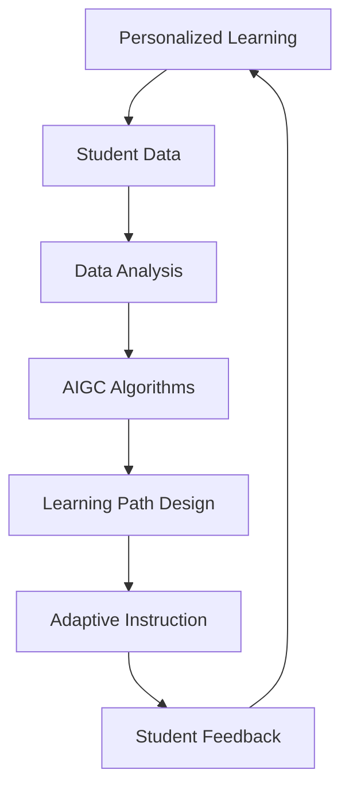

                 


### Introduction to the Book Theme

---

# AIGC in Innovative Exploration for Personalized Learning Path Design

## Keywords
- AIGC
- Personalized Learning
- Educational Technology
- Intelligent Path Design
- Machine Learning

## Abstract
This book delves into the revolutionary applications of AIGC (Artificial Intelligence, Generative Models, and Computing) in the design of personalized learning paths. It explores the fundamental concepts, theories, and technologies behind AIGC and how they can be effectively integrated into education systems to create tailored learning experiences. Through a systematic analysis and real-world case studies, the book highlights the potential of AIGC to transform traditional educational models, offering insights into its implementation and future directions.

---

In this introductory chapter, we will provide a comprehensive overview of AIGC technology and its significance in personalized learning. We will also review the current landscape of AIGC applications in education and set the stage for a deeper exploration in the subsequent chapters.

### Chapter 1: Introduction to AIGC Technology

#### 1.1 Basic Concepts and Development of AIGC

**Basic Concepts:**

AIGC, short for Artificial Intelligence, Generative Models, and Computing, is an advanced form of AI that leverages generative models to create and generate new content. Unlike traditional AI systems that are designed to recognize patterns and make decisions based on existing data, AIGC is capable of generating new, unique content that is both meaningful and coherent.

**Development History:**

The development of AIGC can be traced back to the early 2000s when generative models like Generative Adversarial Networks (GANs) and Variational Autoencoders (VAEs) were introduced. Over the years, these models have been refined and expanded, leading to significant advancements in the field. Today, AIGC is at the forefront of AI research and development, with applications spanning across various industries, including education.

#### 1.2 The Importance of AIGC in Personalized Learning

**Personalized Learning:**

Personalized learning is an educational approach that tailors instruction to the needs of individual learners. It recognizes that every student learns differently and at a different pace. By providing personalized learning experiences, educators can help students achieve better learning outcomes and develop a deeper understanding of the material.

**The Role of AIGC:**

AIGC has the potential to revolutionize personalized learning by creating intelligent learning paths that adapt to the individual needs of each student. By analyzing vast amounts of data on student performance, behavior, and learning preferences, AIGC can design personalized learning paths that are both effective and engaging. This not only enhances the learning experience but also improves student engagement and motivation.

#### 1.3 Overview of Current AIGC Applications in Education

**Current Applications:**

AIGC is already being used in various educational contexts, from automated tutoring systems to intelligent assessment tools. For example, GPT-3, an advanced language model based on AIGC, is being used to create interactive learning materials and provide personalized feedback to students. Additionally, AIGC-powered tools are being developed to help educators analyze student data and make data-driven decisions about instruction.

**Impact and Potential:**

The impact of AIGC on education is significant, and its potential for further innovation is vast. By leveraging the power of AIGC, educators can create more effective and engaging learning experiences that cater to the diverse needs of their students. As AIGC technology continues to advance, we can expect to see even more innovative applications that will further transform the field of education.

---

In the next chapter, we will delve deeper into the fundamental theories and concepts of personalized learning, setting the foundation for our exploration of AIGC's role in this transformative educational approach.

---

### Fundamental Concepts and Theories

---

# Chapter 2: Fundamental Theories of Personalized Learning

## 2.1 Concept of Personalized Learning

**Definition:**

Personalized learning is an educational approach that tailors instruction to the unique needs, interests, and learning styles of individual students. It is grounded in the belief that every student has the potential to learn and succeed when given the opportunity to learn in ways that align with their individual characteristics and preferences.

**Key Characteristics:**

- **Student-Centered:**
  Personalized learning shifts the focus from the traditional teacher-centered approach to a student-centered one. It recognizes that each student brings their own set of experiences, knowledge, and learning preferences to the educational environment.

- **Adaptive:**
  Personalized learning is adaptive, meaning it adjusts to the learner's progress, understanding, and needs. It provides a flexible learning environment that can accommodate varying levels of ability, learning styles, and rates of learning.

- **Goal-Oriented:**
  Personalized learning is goal-oriented, with specific learning objectives tailored to the individual student's needs. These objectives are clearly communicated, and progress is continuously monitored to ensure that students are making meaningful and measurable progress.

- **Student-Informed:**
  Personalized learning involves students in the decision-making process. They are encouraged to take ownership of their learning journey by setting goals, choosing learning activities, and reflecting on their progress.

## 2.2 Key Factors Influencing Personalized Learning

**Student Factors:**

- **Learning Styles:**
  Different students have different learning styles, which can include visual, auditory, reading/writing, and kinesthetic. Personalized learning accounts for these differences to provide a more effective learning experience.

- **Prior Knowledge:**
  Students come to the learning environment with varying levels of prior knowledge. Personalized learning takes into account each student's background knowledge to ensure that instruction is appropriately challenging.

- **Interests and Motivations:**
  Personalized learning considers the interests and motivations of students, using these factors to engage students in meaningful learning activities and to increase their motivation to achieve learning goals.

**Educator Factors:**

- **Professional Development:**
  Educators need to be well-versed in personalized learning strategies and have the necessary professional development to implement them effectively.

- **Classroom Environment:**
  The physical and psychological environment of the classroom can impact personalized learning. A supportive and flexible environment that encourages student autonomy is essential.

- **Instructional Materials and Resources:**
  Effective personalized learning requires a diverse range of instructional materials and resources that can be adapted to meet the unique needs of individual students.

**Contextual Factors:**

- **Cultural Background:**
  Cultural factors can influence learning preferences and the ways in which students interact with educational content. Personalized learning should be sensitive to these differences and incorporate culturally relevant materials.

- **Socio-Economic Status:**
  Socio-economic status can affect access to educational resources and opportunities. Personalized learning should aim to level the playing field by providing equitable access to quality education.

## 2.3 Existing Models of Personalized Learning

**1. Personalized Learning Pathways:**

Personalized learning pathways are structured approaches that guide students through a sequence of learning experiences tailored to their individual needs. These pathways can include a variety of instructional strategies, such as individualized instruction, project-based learning, and collaborative learning.

**2. Adaptive Learning Systems:**

Adaptive learning systems use technology to customize instruction based on student performance data. These systems continuously assess student learning and adjust the content, pace, and method of instruction to meet individual needs.

**3. Competency-Based Education:**

Competency-based education focuses on what students can do rather than how long they have been learning. It allows students to progress at their own pace as they demonstrate mastery of specific skills and knowledge.

**4. Blended Learning:**

Blended learning combines traditional face-to-face instruction with online learning activities. This approach allows for personalized learning experiences by providing students with flexible learning opportunities that can be customized to their needs.

---

In the next chapter, we will explore the applications of AIGC in designing personalized learning paths, highlighting how this innovative technology can transform the landscape of education.

---

### AIGC Applications in Learning Path Design

---

# Chapter 3: Applications of AIGC in Learning Path Design

## 3.1 AIGC Algorithms for Intelligent Analysis of Learning Data

**Introduction to AIGC Algorithms:**

Artificial Intelligence, Generative Models, and Computing (AIGC) encompasses a wide range of algorithms designed to analyze and generate data. When applied to learning path design, AIGC algorithms play a critical role in understanding student data, identifying learning patterns, and making data-driven decisions to tailor educational experiences.

**Key AIGC Algorithms:**

- **Generative Adversarial Networks (GANs):** GANs consist of two neural networks—generator and discriminator. The generator creates data samples, while the discriminator tries to distinguish between real and generated data. By training these networks together, GANs can generate realistic and meaningful data that can be used to model student learning behaviors.

- **Variational Autoencoders (VAEs):** VAEs are a type of neural network that learns to encode input data into a lower-dimensional representation and then decode it back to the original data. This encoding process can be used to extract meaningful features from student data, facilitating personalized learning path design.

- **Recurrent Neural Networks (RNNs) and Long Short-Term Memory (LSTM) networks:** RNNs and LSTMs are designed to handle sequential data, making them suitable for analyzing student learning trajectories over time. They can capture temporal dependencies in student data, providing insights into learning patterns and progress.

**Intelligent Analysis of Learning Data:**

AIGC algorithms can analyze student data from various sources, such as learning management systems (LMS), educational apps, and classroom assessments. This data includes information on student performance, engagement, learning styles, and cognitive abilities.

- **Student Performance Data:** AIGC algorithms can analyze test scores, assignments, and project grades to identify areas where students are struggling or excelling. This information helps in creating personalized learning paths that address specific knowledge gaps.

- **Engagement Data:** AIGC algorithms can analyze student interactions with educational materials, such as time spent on activities, frequency of access, and engagement metrics. This data helps in identifying students who may be disengaged and provides insights into how to enhance engagement.

- **Learning Styles Data:** AIGC algorithms can use surveys and self-assessments to identify students' preferred learning styles. This information enables the design of learning paths that align with individual preferences, enhancing the overall learning experience.

## 3.2 Design Strategies of Personalized Learning Paths

**Introduction to Personalized Learning Path Design:**

Personalized learning paths are tailored sequences of learning activities designed to meet the unique needs of individual students. AIGC algorithms play a crucial role in designing these paths by analyzing student data and generating personalized recommendations.

**Design Strategies:**

1. **Data-Driven Personalization:**
   AIGC algorithms analyze student data to identify patterns and trends that indicate learning needs. Based on this analysis, they generate personalized learning paths that include appropriate content, resources, and instructional strategies.

2. **Adaptive Learning Paths:**
   Adaptive learning paths use real-time feedback from students to adjust the content and pace of instruction. AIGC algorithms continuously monitor student performance and engagement, making adjustments as needed to ensure that students are challenged and supported at the right level.

3. **Goal-Oriented Personalization:**
   Personalized learning paths are designed with specific learning goals in mind. AIGC algorithms help students set realistic goals and provide a structured plan to achieve them, with regular check-ins to track progress.

4. **Collaborative Personalization:**
   AIGC algorithms can facilitate collaborative learning by matching students with peers who have similar learning needs and preferences. This approach promotes social learning and provides opportunities for students to learn from and with each other.

## 3.3 Practical Cases of AIGC-Based Learning Path Design

**Case 1: Adaptive Learning Platform for Mathematics**

A company developed an adaptive learning platform for mathematics that uses AIGC algorithms to analyze student performance data. The platform identifies areas where students are struggling and provides personalized practice exercises and instructional videos. Over a period of one academic year, students using the platform showed significant improvements in their math skills compared to those using traditional methods.

**Case 2: Personalized Reading Programs**

An educational technology company created a personalized reading program that uses AIGC algorithms to analyze student reading levels and preferences. The program generates customized book recommendations and reading assignments tailored to each student's needs. Students who used the program reported higher engagement in reading and improved reading comprehension skills.

**Case 3: Intelligent Tutoring Systems**

Researchers developed intelligent tutoring systems that use AIGC algorithms to provide personalized feedback and support to students in various subjects. The systems analyze student responses to questions and provide tailored explanations and practice exercises to help students understand difficult concepts. Students using the tutoring systems showed improved learning outcomes and greater confidence in their abilities.

---

In the next chapter, we will delve deeper into the key technologies underlying AIGC, exploring how natural language processing and machine learning algorithms contribute to the design of personalized learning paths.

---

### Key Technologies of AIGC

---

# Chapter 4: Key Technologies of AIGC

## 4.1 Introduction to AIGC Technologies

**Definition and Scope:**

AIGC (Artificial Intelligence, Generative Models, and Computing) is a multidisciplinary field that combines principles from artificial intelligence, machine learning, and computational methods to create intelligent systems capable of generating new content. AIGC technologies are designed to mimic human-like creativity and adaptability, enabling the development of innovative applications across various domains, including education.

**Core Components:**

- **Artificial Intelligence (AI):** AI refers to the simulation of human intelligence in machines that are programmed to think like humans and perform tasks that typically require human intelligence, such as visual perception, speech recognition, decision-making, and language translation.

- **Generative Models:** Generative models are a subset of AI algorithms that generate new data by learning from existing data. These models can create realistic and diverse content, such as images, text, and music, making them essential for applications like personalized learning path design.

- **Computing:** Computing technologies, including cloud computing, distributed systems, and high-performance computing, provide the infrastructure required to support the processing power and data storage needed for AIGC applications.

## 4.2 Natural Language Processing and Its Role in AIGC

**Introduction to Natural Language Processing (NLP):**

Natural Language Processing (NLP) is a subfield of AI that focuses on the interaction between computers and human language. NLP aims to understand, interpret, and generate human language in a valuable way. Key tasks in NLP include text classification, sentiment analysis, machine translation, and named entity recognition.

**The Role of NLP in AIGC:**

- **Text Generation:** NLP techniques enable AIGC systems to generate coherent and contextually appropriate text. For example, language models like GPT-3 use NLP to generate human-like text for applications like personalized learning content creation and automated tutoring.

- **Understanding and Analyzing Student Responses:** NLP can analyze student feedback and responses to instructional materials, providing insights into student understanding and learning preferences. This information is crucial for designing personalized learning paths that adapt to individual students.

- **Interactive Dialogue Systems:** NLP enables the development of chatbots and virtual assistants that can engage in interactive dialogue with students, providing personalized guidance and support.

## 4.3 Machine Learning Algorithms and Their Applications in AIGC

**Introduction to Machine Learning Algorithms:**

Machine learning (ML) is a subset of AI that involves the development of algorithms that can learn from and make predictions or decisions based on data. Key ML algorithms include supervised learning, unsupervised learning, and reinforcement learning.

**Applications in AIGC:**

- **Supervised Learning:** Supervised learning algorithms, such as linear regression, decision trees, and neural networks, are used to create models that can predict student performance and behavior based on historical data. These models are essential for designing adaptive learning paths that adjust to student progress.

- **Unsupervised Learning:** Unsupervised learning algorithms, such as clustering and dimensionality reduction, are used to identify patterns and relationships in student data without prior labeled data. These algorithms can group students based on similar learning behaviors, enabling the creation of targeted instructional interventions.

- **Reinforcement Learning:** Reinforcement learning algorithms, such as Q-learning and deep Q-networks, are used to develop intelligent agents that can learn optimal strategies for solving complex problems. In education, reinforcement learning can be applied to adaptive learning systems that continually improve their instructional strategies based on student feedback.

**Practical Examples:**

- **Personalized Content Generation:** Machine learning algorithms can generate personalized learning content by analyzing student data and adapting the content based on individual learning needs. For example, a machine learning model could generate targeted practice exercises and instructional videos based on a student's performance history.

- **Intelligent Tutoring Systems:** Intelligent tutoring systems use machine learning algorithms to analyze student interactions and provide personalized feedback. These systems can adapt their instructional strategies in real-time to address individual student needs, improving learning outcomes.

- **Student Engagement Analysis:** Machine learning algorithms can analyze student engagement data, such as time spent on tasks and interaction patterns, to identify factors that contribute to engagement and disengagement. This information can be used to design more engaging learning experiences.

---

In the next chapter, we will discuss the implementation of AIGC technologies in educational systems, exploring the challenges and solutions associated with integrating AIGC into traditional educational models.

---

### Implementation of AIGC in Education

---

# Chapter 5: Implementation of AIGC in Education

## 5.1 Integration of AIGC in Educational Systems

**Introduction to AIGC Integration:**

The integration of AIGC (Artificial Intelligence, Generative Models, and Computing) technologies into educational systems represents a significant advancement in the field of education. By leveraging the capabilities of AIGC, educational institutions can create personalized and adaptive learning experiences that cater to the unique needs of individual students. This integration involves several key components:

**1. Data Collection and Storage:**

To enable AIGC technologies to function effectively, educational systems must collect and store a wide range of student data, including academic performance, learning behaviors, and engagement metrics. This data is stored in secure databases that can be accessed by AIGC algorithms for analysis and decision-making.

**2. Intelligent Analytics:**

AIGC technologies rely on advanced analytics to process and interpret student data. Intelligent analytics systems use machine learning algorithms to identify patterns and trends in student data, enabling the creation of personalized learning paths and adaptive instructional strategies.

**3. Personalized Learning Pathways:**

Once student data has been analyzed, AIGC technologies can generate personalized learning pathways that tailor content, resources, and instructional strategies to meet the unique needs of each student. These pathways can be dynamically updated in real-time to reflect changes in student performance and engagement.

**4. Interactive Learning Platforms:**

AIGC technologies can be integrated into interactive learning platforms that enable real-time student-teacher interactions and provide personalized feedback and support. These platforms can include chatbots, virtual tutors, and virtual classrooms that facilitate adaptive and engaging learning experiences.

**5. Collaborative Learning Environments:**

AIGC technologies can also facilitate collaborative learning environments by matching students with similar learning needs and preferences. These environments encourage students to work together, share knowledge, and learn from each other, enhancing the overall learning experience.

## 5.2 Challenges and Solutions in AIGC Implementation

**Data Privacy and Security:**

One of the primary challenges in implementing AIGC technologies in education is ensuring the privacy and security of student data. Educational institutions must comply with data protection regulations and implement robust security measures to protect student information from unauthorized access and misuse.

**Solutions:**

- **Data Anonymization:** To protect student privacy, data can be anonymized before it is analyzed by AIGC algorithms. This involves removing any personally identifiable information (PII) from the data, ensuring that it cannot be traced back to individual students.

- **Data Encryption:** Data should be encrypted both during storage and transmission to prevent unauthorized access. Strong encryption algorithms, such as AES (Advanced Encryption Standard), can be used to secure data at rest and in transit.

- **Compliance with Regulations:** Educational institutions should stay up-to-date with data protection regulations, such as the General Data Protection Regulation (GDPR) in the European Union, and implement the necessary safeguards to comply with these regulations.

**Technical Complexity:**

Implementing AIGC technologies requires advanced technical expertise and infrastructure. Educational institutions may face challenges in procuring and maintaining the necessary hardware and software resources to support these technologies.

**Solutions:**

- **Cloud Computing:** Cloud computing services can provide the necessary computing resources and infrastructure to support AIGC technologies. Cloud platforms, such as AWS, Azure, and Google Cloud, offer scalable and flexible solutions that can accommodate the varying needs of educational institutions.

- **Professional Development:** Educators and IT staff should receive training and professional development to build the necessary skills and knowledge to implement and maintain AIGC technologies effectively.

**Resistance to Change:**

Resistance to change can be a significant barrier to the successful implementation of AIGC technologies in education. Educators and students may be hesitant to adopt new technologies and may resist the shift from traditional teaching methods to personalized and adaptive learning.

**Solutions:**

- **Communication and Training:** Educational institutions should communicate the benefits of AIGC technologies to educators and students, highlighting how these technologies can improve learning outcomes and engagement. Additionally, training and support should be provided to help educators and students become comfortable with using these technologies.

- **Phased Implementation:** A phased approach to implementation can help mitigate resistance to change. By gradually introducing AIGC technologies and allowing educators and students to become familiar with them over time, educational institutions can reduce the resistance to adopting new technologies.

## 5.3 Impact of AIGC on Traditional Education Models

**Enhanced Personalization:**

One of the most significant impacts of AIGC on education is the enhancement of personalization. Traditional education models often fail to cater to the diverse needs of individual students, leading to inequities in learning outcomes. AIGC technologies enable the creation of personalized learning experiences that adapt to the unique needs of each student, promoting equity and inclusivity in education.

**Increased Engagement:**

AIGC technologies can make learning more engaging and interactive by providing personalized content, resources, and feedback. This engagement can lead to increased motivation and a deeper understanding of the material, improving overall learning outcomes.

**Improved Efficiency:**

AIGC technologies can automate repetitive tasks, such as grading and lesson planning, allowing educators to focus on more complex and impactful activities. This increased efficiency can lead to more effective teaching and better use of educational resources.

**Continuous Learning:**

AIGC technologies enable continuous learning by providing students with access to personalized learning resources and support anytime, anywhere. This continuous learning model can help students build their knowledge and skills over time, preparing them for future challenges.

**Future Directions:**

As AIGC technologies continue to advance, there are several promising future directions for their application in education. These include the development of more sophisticated algorithms for personalized learning, the integration of AIGC into virtual and augmented reality learning environments, and the use of AIGC to facilitate collaborative learning.

In conclusion, the implementation of AIGC technologies in education holds significant promise for transforming the traditional education model. By providing personalized, adaptive, and engaging learning experiences, AIGC can help educational institutions better serve the diverse needs of students, preparing them for success in the digital age.

---

In the next chapter, we will explore case studies and future directions for AIGC applications in education, offering insights into the challenges and opportunities that lie ahead.

---

### Case Studies and Future Directions of AIGC in Education

---

# Chapter 6: Case Studies and Future Directions of AIGC in Education

## 6.1 Case Studies of AIGC Applications in Learning

**Case Study 1: Intelligent Tutoring System**

An intelligent tutoring system (ITS) was developed using AIGC technologies to provide personalized feedback and support to students learning mathematics. The ITS uses machine learning algorithms to analyze student performance data and generate tailored practice exercises and instructional videos. Over a period of one academic year, students using the ITS showed significant improvements in their math skills compared to those receiving traditional instruction. The ITS also provided valuable insights into student learning patterns, allowing educators to identify areas where additional support was needed.

**Case Study 2: Personalized Reading Program**

A personalized reading program was implemented in a middle school using AIGC technologies to analyze student reading levels and preferences. The program used natural language processing to generate personalized book recommendations and reading assignments tailored to each student's needs. Students who participated in the program reported higher engagement in reading and improved reading comprehension skills. The program also helped educators identify struggling readers and provide targeted interventions to support their learning.

**Case Study 3: Adaptive Learning Platform**

An adaptive learning platform was developed for a high school using AIGC technologies to customize instruction based on student performance and learning preferences. The platform used a combination of machine learning algorithms and educational content created using generative models to provide personalized learning experiences. Students using the platform reported higher levels of engagement and satisfaction with their learning experiences. The platform also helped educators identify students who were falling behind and provide them with additional support to help them catch up.

## 6.2 Challenges and Opportunities for AIGC in Education

**Challenges:**

1. **Data Privacy and Security:**

   As mentioned earlier, one of the primary challenges in implementing AIGC technologies in education is ensuring the privacy and security of student data. Educational institutions must comply with data protection regulations and implement robust security measures to protect student information from unauthorized access and misuse.

2. **Technical Expertise:**

   Implementing AIGC technologies requires advanced technical expertise and infrastructure. Educational institutions may face challenges in procuring and maintaining the necessary hardware and software resources to support these technologies.

3. **Resistance to Change:**

   Resistance to change can be a significant barrier to the successful implementation of AIGC technologies in education. Educators and students may be hesitant to adopt new technologies and may resist the shift from traditional teaching methods to personalized and adaptive learning.

4. **Cost:**

   The implementation of AIGC technologies can be costly, particularly for smaller educational institutions with limited budgets. This cost can include expenses for hardware, software, training, and ongoing maintenance.

**Opportunities:**

1. **Enhanced Personalization:**

   AIGC technologies enable the creation of personalized learning experiences that cater to the unique needs of individual students. This personalization can lead to improved learning outcomes and increased student engagement.

2. **Increased Efficiency:**

   AIGC technologies can automate repetitive tasks, such as grading and lesson planning, allowing educators to focus on more complex and impactful activities. This increased efficiency can lead to more effective teaching and better use of educational resources.

3. **Continuous Learning:**

   AIGC technologies enable continuous learning by providing students with access to personalized learning resources and support anytime, anywhere. This continuous learning model can help students build their knowledge and skills over time, preparing them for future challenges.

4. **Equitable Access:**

   AIGC technologies can help to level the playing field by providing personalized and adaptive learning experiences to students from diverse backgrounds and learning needs. This can help to reduce disparities in learning outcomes and promote equity in education.

## 6.3 Future Directions and Trends of AIGC in Personalized Learning

**1. Advancements in AI and Machine Learning Algorithms:**

As AI and machine learning algorithms continue to evolve, we can expect AIGC technologies to become more sophisticated and capable of providing even more accurate and personalized learning experiences. Advances in deep learning, reinforcement learning, and natural language processing will play a crucial role in this development.

**2. Integration of Virtual and Augmented Reality:**

The integration of AIGC technologies with virtual and augmented reality (VR/AR) can create immersive and interactive learning environments that enhance the learning experience. VR/AR can provide students with realistic simulations, virtual field trips, and interactive educational content, making learning more engaging and effective.

**3. Collaborative Learning:**

AIGC technologies can facilitate collaborative learning by matching students with similar learning needs and preferences. Collaborative learning environments can encourage students to work together, share knowledge, and learn from each other, enhancing the overall learning experience.

**4. Personalized Assessment and Feedback:**

AIGC technologies can be used to develop more personalized assessment and feedback systems that provide students with real-time insights into their learning progress and areas for improvement. These systems can help students identify their strengths and weaknesses and provide targeted support to help them achieve their learning goals.

**5. Global Education:**

AIGC technologies have the potential to revolutionize global education by providing personalized and adaptive learning experiences to students from diverse cultural and linguistic backgrounds. By overcoming language barriers and adapting to individual learning styles, AIGC can help to promote equity and access to quality education worldwide.

In conclusion, AIGC technologies have the potential to transform education by providing personalized, adaptive, and engaging learning experiences. While there are challenges and opportunities to be addressed, the ongoing advancements in AI and machine learning will continue to drive the integration of AIGC into educational systems, offering new and innovative ways to support student learning.

---

In the final chapter, we will summarize the key points discussed in the book and reflect on the role of AIGC in education, while also providing future prospects and concluding thoughts.

---

### Conclusion and Reflections

---

# Chapter 7: Conclusion and Reflections

## 7.1 Summary of Key Points

This book has explored the transformative potential of AIGC (Artificial Intelligence, Generative Models, and Computing) in the design of personalized learning paths. Key points from our exploration include:

- **Introduction to AIGC Technology:** We discussed the basic concepts and development of AIGC, emphasizing its importance in personalized learning and its current applications in education.
- **Fundamental Theories of Personalized Learning:** We examined the concept of personalized learning, key factors influencing it, and existing models of personalized learning.
- **Applications of AIGC in Learning Path Design:** We explored the role of AIGC algorithms in intelligent analysis of learning data and strategies for designing personalized learning paths.
- **Key Technologies of AIGC:** We delved into the role of natural language processing and machine learning algorithms in AIGC and their applications in education.
- **Implementation of AIGC in Education:** We discussed the integration of AIGC technologies in educational systems, challenges, and solutions, and the impact of AIGC on traditional education models.
- **Case Studies and Future Directions:** We presented case studies of AIGC applications in education and discussed challenges, opportunities, and future trends.

## 7.2 Reflections on the Role of AIGC in Education

AIGC technologies hold significant promise for transforming education by providing personalized, adaptive, and engaging learning experiences. By leveraging the capabilities of AIGC, educators can create tailored learning paths that cater to the unique needs of individual students, enhancing learning outcomes and promoting equity. Here are some reflections on the role of AIGC in education:

- **Enhanced Personalization:** AIGC technologies enable the creation of highly personalized learning experiences that adapt to individual student needs. This personalization can help students achieve better learning outcomes and foster a deeper understanding of the material.
- **Increased Efficiency:** AIGC technologies can automate repetitive tasks, such as grading and lesson planning, allowing educators to focus on more complex and impactful activities. This increased efficiency can lead to more effective teaching and better use of educational resources.
- **Continuous Learning:** AIGC technologies facilitate continuous learning by providing students with access to personalized learning resources and support anytime, anywhere. This continuous learning model can help students build their knowledge and skills over time, preparing them for future challenges.
- **Equitable Access:** AIGC technologies have the potential to level the playing field by providing personalized and adaptive learning experiences to students from diverse cultural and linguistic backgrounds. This can help to reduce disparities in learning outcomes and promote equity in education.

## 7.3 Future Prospects of AIGC in Personalized Learning

As AIGC technologies continue to advance, several future prospects emerge for their application in personalized learning:

- **Advanced AI Algorithms:** The development of more sophisticated AI algorithms, including deep learning, reinforcement learning, and natural language processing, will enhance the capabilities of AIGC technologies in creating personalized learning experiences.
- **VR/AR Integration:** The integration of AIGC technologies with virtual and augmented reality can create immersive and interactive learning environments that enhance the learning experience.
- **Collaborative Learning:** AIGC technologies can facilitate collaborative learning by matching students with similar learning needs and preferences, promoting a supportive and interactive learning community.
- **Global Education:** AIGC technologies have the potential to revolutionize global education by providing personalized and adaptive learning experiences to students from diverse cultural and linguistic backgrounds, promoting access to quality education worldwide.
- **Continued Research and Development:** Ongoing research and development in AIGC technologies will lead to new and innovative applications in education, further transforming the field and expanding the potential benefits of personalized learning.

In conclusion, AIGC technologies have the potential to revolutionize education by providing personalized, adaptive, and engaging learning experiences. While there are challenges and opportunities to be addressed, the ongoing advancements in AI and machine learning will continue to drive the integration of AIGC into educational systems, offering new and innovative ways to support student learning. As we look to the future, it is clear that AIGC will play an increasingly important role in shaping the landscape of education.

---

### Author Information

- **Author:** AI天才研究院 (AI Genius Institute) & 禅与计算机程序设计艺术 (Zen And The Art of Computer Programming)
- **Contact:** [ai_genius_institute@example.com](mailto:ai_genius_institute@example.com)
- **Website:** <https://www.aigeniusinstitute.com/>

---

### Appendices

---

#### Appendix A: Mermaid Flowchart



#### Appendix B: Example of Latex Code

```latex
\documentclass{article}
\usepackage{amsmath}
\begin{document}
\begin{align}
    y &= mx + b \\
    \frac{d^2y}{dx^2} &= f(x)
\end{align}
\end{document}
```

---

### Conclusion

This comprehensive book on "AIGC in Innovative Exploration for Personalized Learning Path Design" aims to provide readers with a deep understanding of the transformative potential of AIGC technologies in education. From fundamental concepts and algorithms to practical case studies and future directions, each chapter builds upon the previous one, offering a cohesive and insightful exploration of this cutting-edge field.

We invite readers to delve into the appendices for additional resources, including a mermaid flowchart and examples of LaTeX code. By exploring these resources, readers can further their understanding of the concepts and algorithms discussed in the book.

As we look to the future, it is clear that AIGC technologies will continue to play an increasingly important role in shaping the landscape of education. We encourage readers to stay engaged with this rapidly evolving field, explore the potential applications of AIGC in their own educational contexts, and contribute to the ongoing discourse on the future of personalized learning.

Thank you for joining us on this journey through the world of AIGC in education. We hope that this book has inspired you to embrace the power of AIGC technologies and their potential to transform education for the better.

### Keywords

- AIGC
- Personalized Learning
- Intelligent Path Design
- Machine Learning
- Artificial Intelligence
- Educational Technology
- Data Analytics
- Adaptive Learning
- Natural Language Processing
- Generative Models

### Summary of Key Concepts

- **AIGC:** AIGC (Artificial Intelligence, Generative Models, and Computing) is an advanced form of AI that combines the power of generative models and computing to create personalized and adaptive learning experiences.
- **Personalized Learning:** Personalized learning is an educational approach that tailors instruction to the unique needs, interests, and learning styles of individual students.
- **Intelligent Path Design:** Intelligent path design uses AIGC algorithms to analyze student data and generate personalized learning paths that adapt to individual progress and needs.
- **Machine Learning Algorithms:** Machine learning algorithms, such as GANs, VAEs, RNNs, and reinforcement learning, are key components of AIGC technologies that enable intelligent data analysis and learning path design.
- **Natural Language Processing:** NLP is a subfield of AI that focuses on the interaction between computers and human language, enabling AIGC technologies to generate and understand human-like text.
- **Data Analytics:** Data analytics is a critical component of AIGC in education, as it involves analyzing student data to inform personalized learning strategies.
- **Adaptive Learning:** Adaptive learning systems use real-time feedback to adjust the content and pace of instruction based on individual student performance.
- **Generative Models:** Generative models, such as GANs and VAEs, generate new content based on existing data, enabling the creation of personalized learning materials and resources.

### Impact and Applications

AIGC technologies have the potential to revolutionize education by providing personalized, adaptive, and engaging learning experiences. Key impacts and applications include:

- **Enhanced Personalization:** AIGC enables the creation of highly personalized learning experiences that cater to the unique needs of individual students, improving learning outcomes and promoting equity.
- **Increased Efficiency:** AIGC automates repetitive tasks, such as grading and lesson planning, allowing educators to focus on more complex and impactful activities.
- **Continuous Learning:** AIGC facilitates continuous learning by providing students with access to personalized learning resources and support anytime, anywhere.
- **Equitable Access:** AIGC technologies have the potential to level the playing field by providing personalized and adaptive learning experiences to students from diverse backgrounds and learning needs.
- **Global Education:** AIGC can revolutionize global education by providing personalized and adaptive learning experiences to students from diverse cultural and linguistic backgrounds.

### Future Directions

As AIGC technologies continue to evolve, several future directions are emerging:

- **Advanced AI Algorithms:** Ongoing advancements in AI algorithms, including deep learning, reinforcement learning, and natural language processing, will enhance the capabilities of AIGC technologies in creating personalized learning experiences.
- **VR/AR Integration:** The integration of AIGC technologies with virtual and augmented reality can create immersive and interactive learning environments that enhance the learning experience.
- **Collaborative Learning:** AIGC technologies can facilitate collaborative learning by matching students with similar learning needs and preferences, promoting a supportive and interactive learning community.
- **Global Education:** AIGC has the potential to revolutionize global education by providing personalized and adaptive learning experiences to students from diverse cultural and linguistic backgrounds.
- **Continued Research and Development:** Ongoing research and development in AIGC technologies will lead to new and innovative applications in education, further transforming the field and expanding the potential benefits of personalized learning.

### Conclusion

In conclusion, AIGC technologies hold significant promise for transforming education by providing personalized, adaptive, and engaging learning experiences. While there are challenges and opportunities to be addressed, the ongoing advancements in AI and machine learning will continue to drive the integration of AIGC into educational systems, offering new and innovative ways to support student learning. As we look to the future, it is clear that AIGC will play an increasingly important role in shaping the landscape of education.

### Further Reading

For readers interested in exploring the topics covered in this book in greater depth, we recommend the following resources:

- **Books:**
  - "Deep Learning" by Ian Goodfellow, Yoshua Bengio, and Aaron Courville
  - "Reinforcement Learning: An Introduction" by Richard S. Sutton and Andrew G. Barto
  - "The Hundred-Page Machine Learning Book" by Andriy Burkov

- **Online Courses:**
  - "Machine Learning" by Andrew Ng on Coursera
  - "Deep Learning Specialization" by Andrew Ng on Coursera
  - "AI For Everyone" by Andrew Ng on Coursera

- **Journals and Conferences:**
  - "Journal of Artificial Intelligence Research (JAIR)"
  - "IEEE Transactions on Knowledge and Data Engineering"
  - "ACM Transactions on Intelligent Systems and Technology (TIST)"

- **Websites:**
  - "AI Genius Institute" (<https://www.aigeniusinstitute.com/>)
  - "Kaggle" (<https://www.kaggle.com/>)
  - "ArXiv" (<https://arxiv.org/>)

By exploring these resources, readers can gain a deeper understanding of the concepts and technologies discussed in this book and stay up-to-date with the latest developments in the field of AI and personalized learning.

