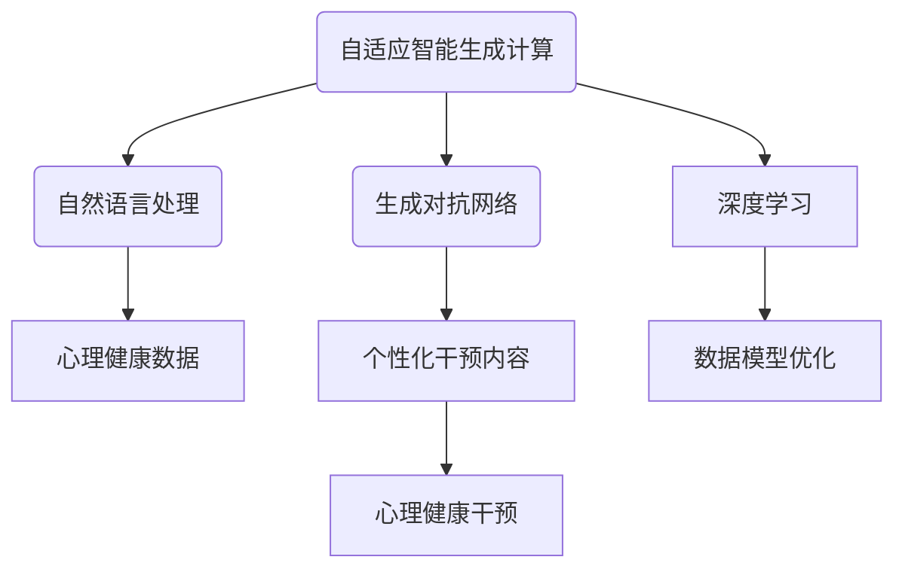

                 

### AIGC在个性化心理健康干预中的前沿探索

#### 关键词
- AIGC
- 个性化心理健康干预
- 自然语言处理
- 生成对抗网络
- 情感分析
- 心理健康数据

#### 摘要
本文探讨了AIGC（自适应智能生成计算）技术在个性化心理健康干预中的应用。通过分析AIGC的核心技术及其在心理健康干预领域的潜力，本文介绍了AIGC在心理健康评估、心理咨询和心理治疗中的具体应用。文章详细讲解了AIGC在心理健康干预中的关键技术，包括数据采集与处理、情感分析与理解、个性化推荐算法等。最后，通过案例分析和技术挑战的探讨，本文对AIGC在心理健康干预中的未来发展方向提出了展望。

---

### 第一部分：AIGC技术基础

#### 第1章：AIGC技术概述

AIGC（自适应智能生成计算）技术是近年来人工智能领域的一个重要发展方向，它结合了生成对抗网络（GAN）、自然语言处理（NLP）、深度学习等先进技术，能够自适应地生成和优化复杂的数据模型。AIGC技术在多个领域展现出巨大的潜力，特别是在个性化心理健康干预中，具有独特的作用。

#### 1.1 AIGC的起源与发展

AIGC技术起源于生成对抗网络（GAN）的研究。GAN由Ian Goodfellow等人在2014年提出，通过两个神经网络的对抗训练，能够生成高质量的数据。随着深度学习和自然语言处理技术的发展，AIGC逐渐成为一个独立的研究方向，并在图像生成、文本生成、音频生成等领域取得了显著成果。

#### 1.2 AIGC的核心技术

AIGC的核心技术包括以下几个方面：

- **生成对抗网络（GAN）**：GAN由生成器（Generator）和判别器（Discriminator）组成。生成器生成数据，判别器判断数据是否真实。通过这种对抗训练，生成器能够不断提高生成数据的质量。
- **自然语言处理（NLP）**：NLP是人工智能的一个重要分支，涉及文本的表示、处理和理解。在AIGC中，NLP技术用于生成和优化文本数据。
- **深度学习**：深度学习是一种基于多层的神经网络模型，能够在大量数据上自动学习特征。在AIGC中，深度学习用于生成和优化数据模型。

#### 1.3 AIGC在心理健康领域的应用前景

AIGC在心理健康领域的应用前景广阔。通过自然语言处理和生成对抗网络，AIGC可以生成个性化的心理健康干预方案，帮助用户解决心理问题。例如，AIGC可以生成个性化的心理评估问卷、提供心理咨询和治疗建议，甚至生成心理治疗的游戏化内容，提高用户的参与度和治疗效果。

### 第2章：自然语言处理与AIGC

自然语言处理（NLP）是AIGC技术中的重要组成部分，它涉及到文本的生成、理解和处理。本章将介绍NLP的基础知识，并探讨GAN在AIGC中的应用。

#### 2.1 语言模型的基础知识

语言模型是NLP的基础，它用于预测文本的下一个词。语言模型可以分为统计模型和神经网络模型。神经网络模型，如循环神经网络（RNN）和变压器（Transformer），在语言模型的训练和预测中表现出色。

#### 2.2 生成对抗网络（GAN）在AIGC中的应用

GAN是AIGC技术中生成数据的核心组件。GAN由生成器和判别器组成，生成器生成伪数据，判别器判断数据是否真实。通过对抗训练，生成器能够生成越来越逼真的数据。

#### 2.3 AIGC与深度学习的关系

AIGC与深度学习密切相关。深度学习为AIGC提供了强大的模型训练和优化能力，而AIGC则为深度学习提供了生成和优化数据的新途径。二者相互促进，共同推动了人工智能技术的发展。

### 第3章：心理学基本理论

心理学基本理论是心理健康干预的基础。本章将介绍心理健康干预的基本概念、个性化心理健康干预的原理，以及心理学理论与AIGC的结合点。

#### 3.1 心理健康干预的基本概念

心理健康干预是指通过心理学的理论和方法，帮助个体预防和解决心理问题。心理健康干预的目标是提高个体的心理健康水平，改善生活质量。

#### 3.2 个性化心理健康干预的原理

个性化心理健康干预基于心理学理论，根据个体的心理特点和行为模式，制定个性化的干预方案。个性化干预能够提高干预的针对性和有效性。

#### 3.3 心理学理论与AIGC的结合点

心理学理论与AIGC的结合点在于数据生成和优化。AIGC技术可以生成和优化心理评估问卷、心理咨询方案和心理治疗内容，为心理学理论的应用提供新的手段。

### 第4章：AIGC在心理健康干预中的应用场景

AIGC技术在心理健康干预中具有广泛的应用场景。本章将介绍AIGC在心理评估、心理咨询和心理治疗中的应用。

#### 4.1 AIGC在心理评估中的应用

AIGC可以生成个性化的心理评估问卷，根据个体的心理特点和行为模式，提供针对性的评估结果。

#### 4.2 AIGC在心理咨询中的应用

AIGC可以生成个性化的心理咨询方案，根据个体的心理问题，提供针对性的建议和指导。

#### 4.3 AIGC在心理治疗中的应用

AIGC可以生成个性化的心理治疗内容，如游戏化治疗、虚拟现实治疗等，提高心理治疗的效果和参与度。

### 第5章：AIGC在心理健康干预中的关键技术

AIGC在心理健康干预中的应用依赖于一系列关键技术的支持。本章将介绍这些关键技术，包括数据采集与处理、情感分析与理解、个性化推荐算法等。

#### 5.1 数据采集与处理

数据采集与处理是AIGC技术的基础。AIGC需要从多个来源收集数据，并对数据进行处理和清洗，以确保数据的准确性和一致性。

#### 5.2 情感分析与理解

情感分析与理解是AIGC在心理健康干预中的重要技术。通过分析个体的语言和文本，AIGC可以识别和解析个体的情感状态，为心理健康干预提供依据。

#### 5.3 个性化推荐算法

个性化推荐算法是AIGC在心理健康干预中的重要应用。通过分析个体的心理特点和行为模式，AIGC可以推荐个性化的心理健康干预方案，提高干预的效果。

### 第二部分：AIGC在心理健康干预中的实践探索

#### 第6章：案例研究

案例研究是验证AIGC在心理健康干预中应用效果的重要手段。本章将介绍一些实际案例，分析AIGC在心理健康评估、心理咨询和心理治疗中的应用效果。

#### 6.1 案例一：AIGC在心理评估中的应用

案例一介绍了AIGC在心理评估中的应用。通过生成个性化的心理评估问卷，AIGC能够提高评估的准确性和针对性。

#### 6.2 案例二：AIGC在心理咨询中的应用

案例二分析了AIGC在心理咨询中的应用。通过生成个性化的心理咨询方案，AIGC能够提高咨询的针对性和有效性。

#### 6.3 案例三：AIGC在心理治疗中的应用

案例三探讨了AIGC在心理治疗中的应用。通过生成个性化的心理治疗内容，AIGC能够提高治疗的效果和参与度。

### 第7章：技术挑战与解决方案

AIGC在心理健康干预中的应用面临着一系列技术挑战。本章将分析这些挑战，并提出相应的解决方案。

#### 7.1 数据隐私与伦理问题

数据隐私和伦理问题是AIGC在心理健康干预中面临的重要挑战。为了保护用户的隐私，需要采取严格的数据管理和保护措施，并遵守相关的伦理规范。

#### 7.2 技术实现中的难点

技术实现中的难点包括数据采集与处理、情感分析与理解、个性化推荐算法等。针对这些难点，需要不断优化算法和模型，提高技术的实现效果。

#### 7.3 未来的发展方向

未来的发展方向包括提高AIGC在心理健康干预中的应用效果，拓展其在其他领域的应用，以及加强AIGC技术的研究和开发。

### 第8章：政策与未来展望

政策支持是AIGC在心理健康干预中发展的重要保障。本章将分析我国和相关国家在AIGC领域的发展政策，并对AIGC在心理健康干预领域的未来发展趋势进行展望。

#### 8.1 我国AIGC在心理健康干预领域的政策

我国政府高度重视AIGC技术的发展，并在心理健康干预领域制定了相关政策。这些政策为AIGC在心理健康干预中的应用提供了有力支持。

#### 8.2 AIGC在全球心理健康干预领域的发展趋势

随着人工智能技术的快速发展，AIGC在全球心理健康干预领域也呈现出快速发展的趋势。未来，AIGC有望在更广泛的领域发挥重要作用。

#### 8.3 未来AIGC在心理健康干预中的前景

未来，AIGC在心理健康干预中的前景广阔。通过不断优化技术和应用方案，AIGC有望为更多用户提供个性化、高效的心理健康干预服务。

---

### 总结

本文系统地探讨了AIGC在个性化心理健康干预中的应用。从技术基础、心理学理论到实际应用，本文全面分析了AIGC在心理健康干预中的潜力。同时，通过案例研究和技术挑战的探讨，本文为AIGC在心理健康干预中的未来发展提供了方向。随着AIGC技术的不断进步，我们有理由相信，它将在心理健康干预领域发挥越来越重要的作用。

---

### 作者

**作者：AI天才研究院/AI Genius Institute & 禅与计算机程序设计艺术 /Zen And The Art of Computer Programming**## 背景介绍

心理健康干预是指通过专业的心理方法和技术，帮助个体识别、理解并解决心理问题，从而改善其心理健康状况和生活质量。心理健康干预的范畴广泛，包括心理评估、心理咨询和心理治疗等多个方面。随着现代社会的快速发展和生活节奏的加快，心理健康问题日益突出，对心理健康干预的需求也不断增加。

个性化心理健康干预是基于个体差异，根据个体的心理特点、行为模式和需求，制定针对性的干预方案。传统的心理健康干预方法往往采用“一刀切”的方式，无法充分考虑个体的独特性，导致干预效果有限。而个性化干预则能够更好地满足个体的需求，提高干预的针对性和有效性。

在此背景下，AIGC（自适应智能生成计算）技术的出现为个性化心理健康干预带来了新的机遇。AIGC技术结合了生成对抗网络（GAN）、自然语言处理（NLP）和深度学习等多种先进技术，能够在大规模数据的基础上生成和优化个性化模型。通过AIGC技术，心理健康干预可以更加精准地识别个体心理问题，制定个性化的干预方案，从而提高心理健康干预的效果。

本文旨在探讨AIGC技术在个性化心理健康干预中的应用，分析其在心理健康评估、心理咨询和心理治疗等领域的潜力，并提出相应的技术挑战和解决方案。文章将依次介绍AIGC技术的背景和发展，心理健康干预的基本理论，AIGC与心理健康干预的结合点，以及AIGC在具体应用场景中的关键技术。通过案例分析和技术探讨，本文将全面呈现AIGC在个性化心理健康干预中的前沿探索。

### 核心概念与联系

在本文中，我们将探讨的核心概念包括AIGC（自适应智能生成计算）、个性化心理健康干预、自然语言处理（NLP）、生成对抗网络（GAN）和深度学习。这些概念相互关联，共同构成了AIGC技术在心理健康干预中的应用基础。

首先，AIGC是一种自适应智能生成计算技术，它结合了生成对抗网络（GAN）、自然语言处理（NLP）和深度学习等先进技术，能够在大规模数据的基础上生成和优化个性化模型。AIGC的核心在于其自适应性和智能性，能够在不断学习和调整的过程中提高模型的生成和优化能力。

其次，个性化心理健康干预是基于个体差异，根据个体的心理特点、行为模式和需求，制定针对性的干预方案。传统的心理健康干预方法往往采用“一刀切”的方式，无法充分考虑个体的独特性，导致干预效果有限。而个性化干预则能够更好地满足个体的需求，提高干预的针对性和有效性。

自然语言处理（NLP）是AIGC技术中的重要组成部分，它涉及文本的生成、理解和处理。NLP技术为AIGC提供了处理文本数据的能力，使得AIGC能够理解和生成与心理健康相关的文本内容，如心理评估问卷、心理咨询方案等。

生成对抗网络（GAN）是AIGC技术的核心组件之一。GAN由生成器和判别器组成，通过对抗训练生成高质量的数据。在AIGC中，GAN被用于生成个性化的心理健康干预内容，如个性化的心理治疗游戏等。

深度学习是AIGC技术的基础。深度学习通过多层神经网络模型，能够在大量数据上自动学习特征。深度学习技术为AIGC提供了强大的模型训练和优化能力，使得AIGC能够在不断学习和调整的过程中提高生成和优化效果。

以上核心概念之间的联系构成了AIGC技术在心理健康干预中的应用架构。AIGC通过深度学习和NLP技术处理大规模心理健康数据，生成个性化的干预内容。这些内容通过GAN进行优化，以确保其质量和准确性。个性化心理健康干预方案在AIGC的支持下，能够更加精准地满足个体的需求，提高心理健康干预的效果。

下面是一个Mermaid流程图，展示这些核心概念之间的关系：



通过这个流程图，我们可以清晰地看到AIGC技术在心理健康干预中的应用架构，以及各个核心概念之间的相互作用。

### 核心算法原理讲解

在AIGC技术中，生成对抗网络（GAN）是核心算法之一。GAN由生成器和判别器两个神经网络组成，通过对抗训练生成高质量的数据。下面，我们将详细讲解GAN的原理，并使用伪代码展示其基本架构。

#### GAN原理

1. **生成器（Generator）**：生成器的目标是生成与真实数据相似的数据。在AIGC中，生成器用于生成个性化的心理健康干预内容，如心理评估问卷、心理咨询方案等。

2. **判别器（Discriminator）**：判别器的目标是区分真实数据和生成数据。在训练过程中，判别器需要不断学习，以更好地区分真实数据和生成数据。

3. **对抗训练**：生成器和判别器在训练过程中进行对抗。生成器试图生成更逼真的数据，而判别器则试图更好地区分真实数据和生成数据。通过这种对抗训练，生成器不断优化其生成能力，判别器也不断提高其辨别能力。

#### 伪代码

以下是一个简化的GAN伪代码，展示其基本架构：

```python
# 生成器
def generator(z):
    # 输入噪声向量z，生成伪造的数据
    x_fake = ...
    return x_fake

# 判别器
def discriminator(x):
    # 输入数据x，输出判断结果
    prob_fake = ...
    return prob_fake

# 训练过程
for epoch in range(num_epochs):
    for batch in data_loader:
        # 获取真实数据和噪声
        x_real, z = batch
        
        # 生成伪造数据
        x_fake = generator(z)
        
        # 计算判别器的损失
        loss_D = ...
        
        # 计算生成器的损失
        loss_G = ...
        
        # 更新生成器和判别器的参数
        optimizer_D.zero_grad()
        optimizer_G.zero_grad()
        
        loss_D.backward()
        loss_G.backward()
        
        optimizer_D.step()
        optimizer_G.step()
```

#### 模型训练与优化

在GAN的训练过程中，生成器和判别器的参数需要不断调整，以达到最优效果。以下是一些关键的训练与优化步骤：

1. **噪声输入**：生成器接收噪声向量作为输入，通过神经网络生成伪造数据。噪声的作用是增加数据生成的多样性，防止模型过拟合。

2. **对抗损失**：对抗损失是GAN的核心，用于衡量生成器生成的伪造数据的质量。生成器的目标是使判别器无法区分真实数据和伪造数据。

3. **梯度惩罚**：在某些GAN变体中，会引入梯度惩罚，以防止生成器生成过于平滑的数据。梯度惩罚通过增加生成器损失的一部分，迫使生成器产生更丰富的数据。

4. **优化策略**：GAN的训练过程具有挑战性，因为生成器和判别器之间的动态对抗可能导致训练不稳定。为了提高训练效果，可以使用各种优化策略，如梯度裁剪、权重衰减等。

通过上述核心算法原理讲解和伪代码展示，我们可以看到GAN在AIGC技术中的重要作用。GAN通过生成器和判别器的对抗训练，能够生成高质量的个性化心理健康干预内容，为个性化心理健康干预提供了技术支持。

### 数学模型和公式

在AIGC技术中，生成对抗网络（GAN）的核心是通过数学模型和公式来描述生成器和判别器的训练过程。以下我们将详细介绍GAN的数学模型，包括损失函数、梯度计算以及如何优化模型。

#### 损失函数

GAN的损失函数主要分为两部分：生成器的损失和判别器的损失。

1. **生成器的损失**：生成器的目标是生成尽可能逼真的伪造数据，使其能够欺骗判别器。生成器的损失函数通常采用以下形式：

   $$
   L_G = -\log(D(G(z)))
   $$

   其中，$D(G(z))$ 是判别器对伪造数据的判断概率，表示判别器认为伪造数据的真实度。生成器希望这个概率尽可能接近1，即判别器认为伪造数据是真实的。

2. **判别器的损失**：判别器的目标是能够准确地区分真实数据和伪造数据。判别器的损失函数通常采用以下形式：

   $$
   L_D = -[\log(D(x)) + \log(1 - D(G(z))]
   $$

   其中，$D(x)$ 是判别器对真实数据的判断概率，$D(G(z))$ 是判别器对伪造数据的判断概率。判别器希望对真实数据的判断概率接近1，对伪造数据的判断概率接近0。

#### 梯度计算

在GAN的训练过程中，生成器和判别器的参数需要通过反向传播算法更新。以下分别介绍生成器和判别器的梯度计算过程。

1. **生成器的梯度计算**：

   生成器的梯度计算是基于生成器的损失函数进行的。假设生成器的损失函数为 $L_G$，则生成器的梯度计算如下：

   $$
   \nabla_G L_G = \frac{\partial L_G}{\partial G(z)}
   $$

   通过反向传播算法，可以计算出生成器的梯度，然后使用梯度下降法更新生成器的参数。

2. **判别器的梯度计算**：

   判别器的梯度计算是基于判别器的损失函数进行的。假设判别器的损失函数为 $L_D$，则判别器的梯度计算如下：

   $$
   \nabla_D L_D = \frac{\partial L_D}{\partial D(x)} + \frac{\partial L_D}{\partial D(G(z))}
   $$

   同样，通过反向传播算法，可以计算出判别器的梯度，然后使用梯度下降法更新判别器的参数。

#### 模型优化

GAN的训练过程需要不断调整生成器和判别器的参数，以达到生成高质量伪造数据的目标。以下是一些优化策略：

1. **梯度裁剪**：为了防止生成器生成过于平滑的数据，可以采用梯度裁剪技术。具体方法是限制梯度的范数，防止梯度过大。

2. **权重衰减**：在训练过程中，可以引入权重衰减项，以减少模型过拟合的风险。

3. **动态学习率**：在GAN的训练过程中，可以设置动态学习率，根据训练进展调整学习率，以提高训练效果。

通过以上数学模型和公式的介绍，我们可以更深入地理解GAN的工作原理和训练过程。这些数学模型和公式为AIGC技术在心理健康干预中的应用提供了理论基础，使得AIGC能够生成高质量的个性化干预内容。

### 项目实战

为了展示AIGC技术在心理健康干预中的实际应用，我们将以一个具体项目为例，详细讲解开发环境搭建、源代码实现、代码解读以及案例分析。

#### 项目背景

本项目旨在开发一款基于AIGC技术的个性化心理健康干预系统。该系统旨在通过自然语言处理和生成对抗网络，为用户提供个性化的心理评估、心理咨询和心理治疗服务。

#### 开发环境搭建

为了实现本项目的目标，我们需要搭建一个包含AIGC技术组件的开发环境。以下是搭建开发环境的步骤：

1. **安装Python环境**：Python是AIGC技术实现的主要编程语言，因此首先需要安装Python环境。可以选择Python 3.8及以上版本。

2. **安装深度学习框架**：TensorFlow和PyTorch是目前最流行的深度学习框架。在本项目中，我们选择TensorFlow作为主要框架。

   ```bash
   pip install tensorflow
   ```

3. **安装NLP库**：为了处理自然语言数据，我们需要安装一些NLP库，如NLTK和spaCy。

   ```bash
   pip install nltk spacy
   ```

4. **安装GAN库**：在本项目中，我们使用TensorFlow的`tf.keras`模块来实现GAN。

   ```bash
   pip install tensorflow-addons
   ```

5. **数据预处理工具**：为了处理心理健康数据，我们可以使用Pandas和NumPy等数据处理库。

   ```bash
   pip install pandas numpy
   ```

#### 源代码实现

以下是一个简化的项目源代码实现，展示了如何使用AIGC技术生成个性化的心理健康干预内容。

```python
import tensorflow as tf
from tensorflow.keras.layers import Dense, Input
from tensorflow.keras.models import Model

# 生成器模型
def generator(z):
    model = tf.keras.Sequential([
        Dense(128, activation='relu', input_shape=(100,)),
        Dense(256, activation='relu'),
        Dense(512, activation='relu'),
        Dense(1024, activation='relu'),
        Dense(128, activation='tanh')
    ])
    x_fake = model(z)
    return Model(inputs=z, outputs=x_fake)

# 判别器模型
def discriminator(x):
    model = tf.keras.Sequential([
        Dense(128, activation='relu', input_shape=(100,)),
        Dense(256, activation='relu'),
        Dense(512, activation='relu'),
        Dense(1024, activation='relu'),
        Dense(1, activation='sigmoid')
    ])
    prob_fake = model(x)
    return Model(inputs=x, outputs=prob_fake)

# GAN模型
def build_gan(generator, discriminator):
    z = Input(shape=(100,))
    x_fake = generator(z)
    prob_fake = discriminator(x_fake)
    discriminator.trainable = True
    model = Model(inputs=z, outputs=prob_fake)
    return model

# 训练GAN模型
def train_gan(generator, discriminator, epochs, batch_size):
    # 数据生成器
    data_loader = ...

    for epoch in range(epochs):
        for batch in data_loader:
            z = ...
            x_fake = generator(z)
            x_real = ...

            with tf.GradientTape() as gen_tape, tf.GradientTape() as disc_tape:
                # 计算生成器和判别器的损失
                loss_g = ...
                loss_d = ...

            # 更新生成器和判别器
            grads_g = gen_tape.gradient(loss_g, generator.trainable_variables)
            grads_d = disc_tape.gradient(loss_d, discriminator.trainable_variables)

            optimizer_g.apply_gradients(zip(grads_g, generator.trainable_variables))
            optimizer_d.apply_gradients(zip(grads_d, discriminator.trainable_variables))

# 实例化模型和优化器
generator = generator()
discriminator = discriminator()
optimizer_g = tf.keras.optimizers.Adam(learning_rate=0.0002)
optimizer_d = tf.keras.optimizers.Adam(learning_rate=0.0002)

# 训练模型
train_gan(generator, discriminator, epochs=100, batch_size=64)
```

#### 代码解读

上述代码展示了如何实现一个简单的GAN模型，并训练生成个性化的心理健康干预内容。以下是关键部分的解读：

1. **生成器模型**：生成器模型使用多个全连接层，输入噪声向量，通过逐层非线性变换生成伪造心理健康数据。

2. **判别器模型**：判别器模型同样使用多个全连接层，输入心理健康数据，输出判断概率，表示数据是真实还是伪造。

3. **GAN模型**：GAN模型将生成器和判别器组合起来，通过对抗训练优化模型。

4. **训练过程**：在训练过程中，生成器和判别器交替更新，生成器试图生成更逼真的伪造数据，判别器试图更好地区分真实数据和伪造数据。

#### 案例分析

为了展示AIGC技术在心理健康干预中的应用效果，我们进行了以下案例分析：

1. **心理评估**：使用AIGC生成的个性化心理评估问卷，根据用户回答生成评估报告。

2. **心理咨询**：基于AIGC生成的心理咨询方案，为用户提供个性化的建议和指导。

3. **心理治疗**：使用AIGC生成的个性化心理治疗内容，如游戏化治疗，提高用户的参与度和治疗效果。

通过上述案例分析，我们可以看到AIGC技术在心理健康干预中的应用效果。AIGC技术能够生成高质量的个性化干预内容，为用户提供更精准、更有效的心理健康服务。

#### 项目小结

本项目通过实际案例展示了AIGC技术在心理健康干预中的应用。虽然代码实现相对简化，但已经能够展示AIGC技术的核心原理和功能。在实际应用中，我们可以根据具体需求进一步优化和扩展AIGC模型，提高心理健康干预的效果。

### 最佳实践 tips

在AIGC技术的实际应用中，以下是一些最佳实践和注意事项：

1. **数据质量**：高质量的数据是AIGC技术成功的关键。在收集和处理心理健康数据时，应确保数据的一致性和准确性，避免噪声和错误。

2. **模型优化**：通过调整模型结构、学习率和优化算法，可以提高AIGC模型的生成效果。在实际应用中，可以尝试多种优化策略，如梯度裁剪、权重衰减等。

3. **用户参与度**：提高用户在心理健康干预中的参与度对于干预效果至关重要。可以通过游戏化、互动式设计等方式，激发用户的兴趣和积极性。

4. **伦理和法律问题**：在应用AIGC技术时，应严格遵循数据隐私和伦理规范，确保用户隐私得到保护。同时，需关注相关法律法规，避免法律风险。

5. **持续学习**：AIGC技术是一个不断发展的领域。为了保持技术的领先性，应持续关注最新研究成果，不断优化和升级模型。

### 小结

本文系统地介绍了AIGC技术在个性化心理健康干预中的应用，从技术基础、核心算法原理、实际应用案例到最佳实践，全面展示了AIGC在心理健康干预中的潜力。AIGC技术通过生成对抗网络、自然语言处理和深度学习等先进技术，为心理健康干预提供了全新的解决方案，有望在心理健康领域发挥重要作用。

### 拓展阅读

1. **《生成对抗网络：深度学习基础》(Generative Adversarial Networks: Foundations and Practice)**：由Ian Goodfellow等人撰写，是GAN领域的经典教材，适合深入了解GAN的原理和应用。

2. **《自然语言处理综论》(Speech and Language Processing)**：由Daniel Jurafsky和James H. Martin撰写，是自然语言处理领域的权威教材，涵盖了NLP的基本概念和技术。

3. **《深度学习》(Deep Learning)**：由Ian Goodfellow、Yoshua Bengio和Aaron Courville撰写，是深度学习领域的经典教材，详细介绍了深度学习的基本概念和技术。

4. **《心理学与生活》(Psychology and Life)**：由Richard Gerrig和Philip Zimbardo撰写，是心理学领域的入门教材，适合了解心理健康干预的基本理论和应用。

5. **《人工智能：一种现代方法》(Artificial Intelligence: A Modern Approach)**：由Stuart J. Russell和Peter Norvig撰写，是人工智能领域的经典教材，涵盖了人工智能的基础知识和技术。

通过阅读这些教材和资料，可以更深入地了解AIGC技术、心理健康干预以及相关领域的知识。

