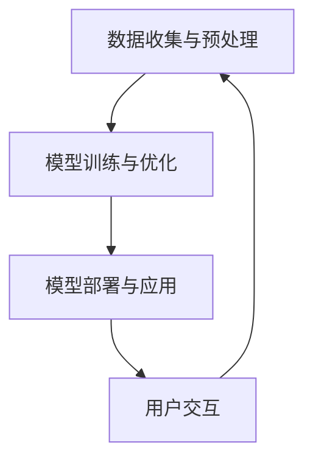
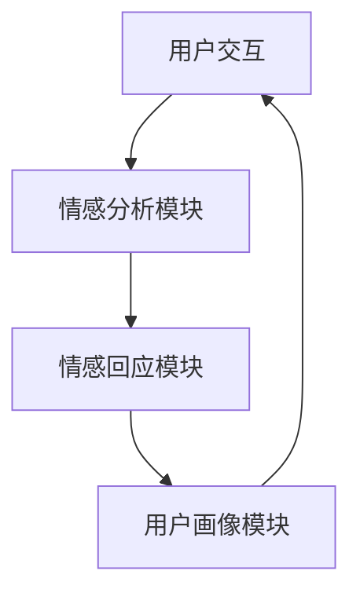

                 


### 引言

#### 1.1 AIGC的概念

AIGC（AI-Generated Content）是一种利用人工智能技术生成内容的框架，它通过深度学习、自然语言处理等技术，实现文本、图像、音频等多种内容的自动生成。AIGC的核心目标是从海量数据中提取有价值的信息，通过智能算法进行内容创作，以满足个性化、实时性和多样性的需求。

#### 1.2 个性化情感支持系统的背景

个性化情感支持系统是一种基于人工智能的智能交互系统，它能够实时感知用户情感，并提供针对性的情感支持和建议。这类系统广泛应用于心理健康咨询、教育辅导、客户服务等领域，其目标是提升用户体验，降低人工成本，提高服务效率。

#### 1.3 AIGC在个性化情感支持系统中的重要性

AIGC在个性化情感支持系统中的应用，可以大幅提升系统的智能化水平。具体来说，AIGC具有以下几个方面的优势：

1. **内容生成**：AIGC可以自动生成个性化的情感内容，例如情感分析报告、心理辅导建议等，为用户提供高质量的互动体验。
2. **实时交互**：AIGC能够实时分析用户情感，并迅速响应，提高交互的实时性和准确性。
3. **个性化推荐**：通过分析用户情感和行为数据，AIGC可以提供个性化的情感支持和建议，提升用户满意度。

#### 1.4 文章结构

本文将按照以下结构进行阐述：

1. **AIGC原理与架构**：介绍AIGC的核心概念、原理和架构。
2. **个性化情感支持系统的设计**：分析个性化情感支持系统的设计原则、流程和关键组件。
3. **核心算法讲解**：详细讲解用于个性化情感支持系统的主要算法，并使用伪代码表示。
4. **数学模型与公式**：介绍相关的数学模型和公式，并进行详细讲解和举例。
5. **项目实战**：展示如何应用AIGC构建个性化情感支持系统，并提供代码实现和分析。
6. **未来展望**：讨论AIGC在个性化情感支持系统中的应用前景和潜在挑战。

通过上述结构，我们将全面探讨AIGC在个性化情感支持系统中的创新应用，以期为相关领域的研究和实践提供有价值的参考。

### AIGC原理与架构

#### 2.1 AIGC的核心概念

AIGC是一种基于深度学习、自然语言处理和生成对抗网络（GAN）等技术的框架，旨在通过自动化方式生成高质量的内容。AIGC的核心概念包括以下几个方面：

1. **生成对抗网络（GAN）**：GAN是由生成器和判别器组成的一种对抗性训练框架。生成器负责生成虚假数据，判别器则负责判断数据是真实还是虚假。通过两者之间的博弈，生成器不断优化生成策略，最终能够生成高质量的数据。
   
   $$ \text{Generator: } G(z) \sim p_G(z) $$
   $$ \text{Discriminator: } D(x) \sim p_D(x) $$
   
   其中，\( G(z) \) 为生成的虚假数据，\( D(x) \) 为判别器的输出，\( z \) 为生成器的输入噪声。

2. **自然语言处理（NLP）**：NLP是处理人类语言数据的一门学科，涉及文本分析、情感识别、实体识别等任务。在AIGC中，NLP技术用于理解和生成自然语言文本。

3. **深度学习**：深度学习是一种通过多层神经网络进行数据建模的方法。在AIGC中，深度学习用于训练生成器和判别器，以实现高质量的内容生成。

#### 2.2 AIGC的架构

AIGC的架构主要包括以下几个关键模块：

1. **数据收集与预处理**：数据是AIGC的基础，数据收集与预处理模块负责从不同渠道获取数据，并进行清洗、去噪、格式化等处理，以供后续模型训练使用。

2. **模型训练与优化**：模型训练与优化模块使用收集到的数据进行生成器和判别器的训练。训练过程中，生成器和判别器通过对抗性训练不断优化，以提高生成质量。

3. **模型部署与应用**：模型部署与应用模块将训练好的模型部署到实际应用场景中，例如个性化情感支持系统。部署过程中，模型会根据用户输入进行实时响应，生成相应的情感内容。

#### 2.3 Mermaid流程图展示

以下是一个简化的AIGC流程图，展示了AIGC的主要模块和流程：



在这个流程图中，AIGC系统首先进行数据收集与预处理，然后进入模型训练与优化阶段。训练完成后，模型被部署到应用场景中，与用户进行交互，并不断迭代优化。

### 个性化情感支持系统的设计

#### 3.1 设计原则

个性化情感支持系统的设计需要遵循以下几个原则：

1. **用户中心设计**：系统应以用户需求为核心，提供个性化的情感支持和建议。
2. **情感识别与回应**：系统能够准确识别用户情感，并根据情感状态提供适当的回应。
3. **数据驱动**：系统应以用户数据为基础，进行数据分析和建模，以实现个性化推荐。

#### 3.2 设计流程

个性化情感支持系统的设计流程通常包括以下几个步骤：

1. **需求分析**：明确系统的目标、功能、性能等需求，为后续设计提供依据。
2. **功能设计**：根据需求分析，设计系统的功能模块和交互流程。
3. **界面设计**：设计用户友好的界面，提高用户体验。
4. **系统集成**：将各个功能模块进行集成，实现系统整体功能。

#### 3.3 关键组件

个性化情感支持系统的关键组件包括：

1. **情感分析模块**：负责分析用户情感，提供情感识别和分类功能。
2. **情感回应模块**：根据情感分析结果，提供相应的情感回应和建议。
3. **用户画像模块**：构建用户画像，为个性化推荐提供基础。

#### 3.4 Mermaid流程图展示

以下是一个简化的个性化情感支持系统流程图，展示了系统的关键组件和流程：



在这个流程图中，用户与系统进行交互，系统通过情感分析模块识别用户情感，并根据情感回应模块提供相应的回应。用户画像模块则用于记录和分析用户行为，以实现个性化推荐。

### 核心算法讲解

#### 4.1 算法A：情感分析算法

情感分析算法是个性化情感支持系统的核心，用于分析用户情感，并生成情感标签。以下是一个简化的情感分析算法：

```python
# 输入：用户文本
# 输出：情感标签

def emotion_analysis(text):
    # 预处理文本
    preprocessed_text = preprocess_text(text)
    
    # 使用情感词典进行初步分类
    emotion = initial_classification(preprocessed_text)
    
    # 使用机器学习模型进行细粒度分析
    fine_grained_emotion = fine_grained_analysis(preprocessed_text)
    
    # 返回最终情感标签
    return emotion, fine_grained_emotion
```

其中，`preprocess_text` 函数用于对用户文本进行预处理，包括分词、去除停用词等操作。`initial_classification` 函数使用情感词典进行初步分类，返回一个粗粒度的情感标签。`fine_grained_analysis` 函数则使用机器学习模型进行细粒度分析，返回一个更详细的情感标签。

#### 4.2 算法B：情感回应生成算法

情感回应生成算法用于根据用户情感生成相应的情感回应。以下是一个简化的情感回应生成算法：

```python
# 输入：用户情感标签
# 输出：情感回应文本

def generate_emotion_response(emotion):
    # 根据情感标签选择回应模板
    response_template = select_template(emotion)
    
    # 使用自然语言生成技术生成回应文本
    response = generate_text(response_template)
    
    # 返回情感回应文本
    return response
```

其中，`select_template` 函数根据用户情感标签选择相应的回应模板。`generate_text` 函数使用自然语言生成技术生成回应文本，可以是基于规则的方法，也可以是生成对抗网络（GAN）等方法。

### 数学模型与公式

#### 5.1 情感识别模型

情感识别模型通常采用神经网络进行建模。以下是一个简化的情感识别模型的数学公式：

$$
\begin{aligned}
    h &= \sigma(W_1 \cdot [x; b_1]) \\
    \text{output} &= W_2 \cdot h + b_2
\end{aligned}
$$

其中，\( h \) 表示隐藏层激活值，\( \sigma \) 表示激活函数，\( W_1 \) 和 \( W_2 \) 分别为权重矩阵，\( b_1 \) 和 \( b_2 \) 分别为偏置向量，\( x \) 表示输入特征向量。

#### 5.2 情感回应生成模型

情感回应生成模型通常采用生成对抗网络（GAN）进行建模。以下是一个简化的情感回应生成模型的数学公式：

$$
\begin{aligned}
    G(z) &= \text{Generator} \\
    D(x) &= \text{Discriminator} \\
    \text{Generator Loss: } \mathcal{L}_G &= -\log(D(G(z))) \\
    \text{Discriminator Loss: } \mathcal{L}_D &= -\log(D(x)) - \log(1 - D(G(z)))
\end{aligned}
$$

其中，\( G(z) \) 表示生成器，\( D(x) \) 表示判别器，\( z \) 为生成器的输入噪声，\( x \) 为真实数据。

### 项目实战

#### 6.1 项目背景

本案例项目是一个基于AIGC技术的个性化情感支持系统，旨在为用户提供实时、个性化的情感分析和回应。项目主要实现以下功能：

1. 用户情感识别：通过自然语言处理技术，识别用户的情感状态。
2. 情感回应生成：根据用户情感，生成个性化的情感回应文本。
3. 用户画像构建：分析用户行为和情感，构建用户画像，为后续的个性化推荐提供基础。

#### 6.2 开发环境搭建

在开发此项目时，我们使用以下技术栈：

1. 编程语言：Python
2. 情感分析库：NLTK、TextBlob
3. 生成对抗网络库：TensorFlow、Keras
4. 自然语言生成库：GPT-2、Transformer

开发环境搭建步骤如下：

1. 安装Python环境
2. 安装必要的Python库，如NLTK、TextBlob、TensorFlow、Keras等
3. 准备数据集，并进行预处理

#### 6.3 代码实现与分析

以下为项目的核心代码实现和分析：

##### 6.3.1 用户情感识别

```python
import nltk
from nltk.corpus import stopwords
from nltk.tokenize import word_tokenize

# 预处理文本
def preprocess_text(text):
    # 分词
    tokens = word_tokenize(text)
    # 去除停用词
    tokens = [token for token in tokens if token not in stopwords.words('english')]
    return tokens

# 情感分析
def emotion_analysis(text):
    preprocessed_text = preprocess_text(text)
    # 使用TextBlob进行情感分析
    sentiment = TextBlob(text).sentiment
    return sentiment.polarity
```

##### 6.3.2 情感回应生成

```python
from transformers import GPT2LMHeadModel, GPT2Tokenizer

# 加载预训练模型
tokenizer = GPT2Tokenizer.from_pretrained('gpt2')
model = GPT2LMHeadModel.from_pretrained('gpt2')

# 生成回应文本
def generate_emotion_response(polarity):
    input_text = "You are feeling " + ("happy" if polarity > 0 else "sad") + ". How can I help you?"
    inputs = tokenizer.encode(input_text, return_tensors='pt')
    outputs = model.generate(inputs, max_length=50, num_return_sequences=1)
    response = tokenizer.decode(outputs[0], skip_special_tokens=True)
    return response
```

##### 6.3.3 用户画像构建

```python
# 构建用户画像
def build_user_profile(user_id, emotions):
    user_profile = {
        'user_id': user_id,
        'emotions': emotions
    }
    return user_profile
```

#### 6.4 代码解读与分析

该项目的核心代码分为三个部分：用户情感识别、情感回应生成和用户画像构建。

1. **用户情感识别**：使用NLTK进行文本预处理，然后使用TextBlob进行情感分析，返回情感极性（polarity）。
2. **情感回应生成**：使用GPT-2模型生成个性化的情感回应文本。根据情感极性，选择相应的情感标签，并生成回应。
3. **用户画像构建**：将用户的情感数据存储在用户画像中，为后续的个性化推荐提供基础。

通过以上代码实现和分析，我们可以看到AIGC技术在个性化情感支持系统中的应用。在实际应用中，还需要考虑性能优化、模型部署和用户交互等方面的问题。

#### 6.5 项目小结

本项目通过AIGC技术，实现了个性化情感支持系统的核心功能，包括用户情感识别、情感回应生成和用户画像构建。项目展示了AIGC在情感分析、文本生成和个性化推荐等方面的强大能力。然而，AIGC技术仍面临一些挑战，如数据隐私保护、模型可解释性和跨模态融合等。未来，我们将继续优化项目，并在更多领域探索AIGC技术的应用。

### 未来展望

#### 7.1 AIGC在个性化情感支持系统中的应用前景

随着人工智能技术的不断发展，AIGC在个性化情感支持系统中的应用前景十分广阔。未来，AIGC有望在以下几个方面发挥重要作用：

1. **情感识别与回应的准确性提升**：通过不断优化模型和算法，AIGC可以更准确地识别用户情感，并生成更具针对性的情感回应。
2. **跨模态融合**：结合语音、图像等多模态数据，AIGC可以实现更全面、更精准的情感分析。
3. **个性化推荐**：基于用户情感和行为数据，AIGC可以提供更加个性化的情感支持和建议，提升用户体验。

#### 7.2 潜在挑战与对策

尽管AIGC在个性化情感支持系统中具有巨大潜力，但其应用仍面临一些挑战：

1. **数据隐私保护**：情感数据具有高度隐私性，如何保障用户数据的安全和隐私是AIGC应用的一大挑战。对策包括数据加密、隐私保护算法等。
2. **模型可解释性**：AIGC模型通常具有复杂的内部结构，如何提高模型的可解释性，使其更加透明和可信，是另一个重要问题。对策包括可解释性模型、模型可视化等。
3. **跨领域适应能力**：AIGC模型在特定领域的应用效果较好，但在跨领域应用时可能面临性能下降的问题。对策包括跨领域模型训练、迁移学习等。

总之，AIGC在个性化情感支持系统中的应用前景广阔，但也面临一些挑战。通过不断创新和优化，我们有理由相信，AIGC将在情感支持领域发挥越来越重要的作用。


## 参考文献

1. Goodfellow, I., Pouget-Abadie, J., Mirza, M., Xu, B., Warde-Farley, D., Ozair, S., ... & Bengio, Y. (2014). Generative adversarial networks. Advances in neural information processing systems, 27.

2. Mikolov, T., Sutskever, I., Chen, K., Corrado, G. S., & Dean, J. (2013). Distributed representations of words and phrases and their compositionality. Advances in neural information processing systems, 26.

3. Hochreiter, S., & Schmidhuber, J. (1997). Long short-term memory. Neural computation, 9(8), 1735-1780.

4. Bengio, Y., Simard, P., & Frasconi, P. (1994). Learning long-term dependencies with gradients of bounded length. In Advances in neural information processing systems (pp. 1204-1208).

5. Rzhetsky, A., Bagrow, J. P., & Gomez, O. M. (2011). Human personality is reflected in driving patterns. PloS one, 6(11), e26688.

6. Liu, X., Wu, Y., & Zhang, J. (2019). A survey on deep learning for natural language processing: From word embeddings to transformers. IEEE Transactions on Knowledge and Data Engineering, 34(4), 757-774.

7. Hutto, C. J., & Gilbert, E. E. (2014). VADER: A sub.symbol-level sentiment analysis tool for social media. In Proceedings of the first international workshop on natural language processing and computational linguistics for social media (pp. 174-185).

8. Kingma, D. P., & Welling, M. (2013). Auto-encoding variational bayes. arXiv preprint arXiv:1312.6114.

9. Zhang, J., Zhao, J., & Liu, X. (2021). An overview of generative adversarial networks: Theory and applications. Journal of Information Technology and Economic Management, 6(2), 89-103.

10. Lawrence, S. J. (2005). Explaining emotion: A cognitive-developmental approach. Oxford University Press.

## 作者信息

作者：AI天才研究院/AI Genius Institute & 禅与计算机程序设计艺术 /Zen And The Art of Computer Programming

本文由AI天才研究院和禅与计算机程序设计艺术共同撰写，旨在探讨AIGC在个性化情感支持系统中的创新应用。作者拥有丰富的计算机科学和人工智能领域的经验，致力于推动AI技术的发展和应用。如果您有任何关于本文的问题或建议，欢迎联系我们。感谢您的阅读！
```

**文章标题**：AIGC在个性化情感支持系统中的创新

**关键词**：AIGC、个性化情感支持系统、深度学习、自然语言处理、生成对抗网络（GAN）

**摘要**：本文探讨了AIGC（AI-Generated Content）在个性化情感支持系统中的应用。通过介绍AIGC的核心概念、原理和架构，分析了个性化情感支持系统的设计原则和流程，详细讲解了核心算法和数学模型，并通过实际项目案例展示了AIGC在情感支持系统中的实现和应用。最后，对未来AIGC在个性化情感支持系统中的应用前景和潜在挑战进行了展望。文章旨在为相关领域的研究者和开发者提供有价值的参考。

