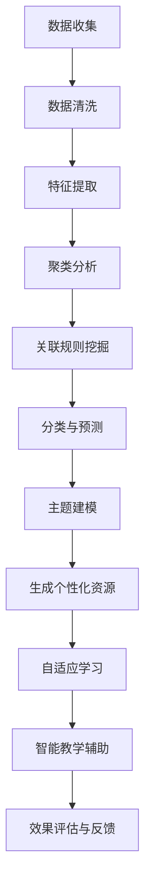

                 

### 文章标题：AIGC在个性化教育中的应用：定制学习路径

#### 关键词：AIGC、个性化教育、定制学习路径、教育数据挖掘、自适应学习系统

> **摘要：** 本文深入探讨了AIGC（自适应智能生成计算）在个性化教育中的应用，特别是如何通过定制学习路径实现教育资源的个性化分配和学习效果的优化。文章从AIGC的基础理论出发，逐步分析其在个性化教育中的应用方法和技术实现，结合具体案例，为教育行业提供了创新思路和实践指导。

---

## 引言

随着人工智能技术的迅猛发展，自适应智能生成计算（Adaptive Intelligent Generative Computing，简称AIGC）成为研究热点。AIGC结合了人工智能、机器学习和自然语言处理等多领域技术，能够在大量数据中自动生成和优化信息。在个性化教育领域，AIGC的应用具有巨大的潜力，可以为学生提供定制化的学习资源，提升学习效果和兴趣。

本文旨在探讨AIGC在个性化教育中的应用，特别是如何通过定制学习路径实现教育资源的个性化分配和学习效果的优化。文章将首先介绍AIGC的基本概念和核心理论，然后分析其在教育领域中的应用现状和发展趋势，接着详细探讨AIGC在个性化教育中的关键应用技术，最后通过具体案例展示AIGC在实际教学中的应用效果和未来发展方向。

本文的结构如下：

1. **AIGC基础理论**：介绍AIGC的定义、核心技术和应用场景。
2. **个性化教育的理论基础**：阐述个性化教育的概念、方法和AIGC的结合点。
3. **AIGC在个性化教育中的应用**：分析AIGC在教育数据挖掘、自适应学习系统和智能教学中的应用技术。
4. **定制学习路径的实践**：介绍定制学习路径的设计原则和实践方法。
5. **具体案例分析**：展示AIGC在个性化教育中的应用案例，并进行详细解析。
6. **结论**：总结AIGC在个性化教育中的应用现状和未来发展趋势。

## AIGC基础理论

### AIGC的定义与历史背景

自适应智能生成计算（AIGC）是一种基于人工智能和数据驱动的计算方法，旨在通过自动生成和优化信息，提高系统的适应性和智能化水平。AIGC的核心在于“自适应”和“生成”，即系统能够根据环境和用户需求动态调整自身的行为和功能，同时能够自动生成新的数据和内容。

AIGC的发展历史可以追溯到20世纪90年代，当时人工智能领域开始关注如何使计算机能够更好地理解人类行为和需求，从而提供更个性化的服务。随着大数据和云计算技术的成熟，AIGC的研究和应用得到了快速发展。近年来，深度学习、生成对抗网络（GAN）和强化学习等新兴技术的引入，进一步推动了AIGC的理论研究和实际应用。

### AIGC的核心技术与组件

AIGC的核心技术包括以下几个方面：

1. **人工智能技术**：包括机器学习、深度学习和自然语言处理等。这些技术使得AIGC系统能够从大量数据中学习和提取有用的信息。
   
2. **生成对抗网络（GAN）**：GAN是一种深度学习模型，通过两个对抗网络（生成器和判别器）的博弈，能够生成高质量的数据和图像。

3. **强化学习**：强化学习是一种通过试错和反馈来优化行为和策略的方法。在AIGC中，强化学习可以用于自动调整系统的参数和决策过程，以实现更好的效果。

4. **自适应算法**：自适应算法是指系统能够根据环境和用户需求动态调整其行为和功能。在AIGC中，自适应算法用于优化学习路径、推荐系统和个性化服务。

### AIGC在教育领域的应用前景

AIGC在教育领域的应用前景十分广阔，主要体现在以下几个方面：

1. **个性化教育**：AIGC可以根据学生的特点和需求，自动生成和优化学习资源，实现真正的个性化教育。

2. **自适应学习系统**：AIGC可以构建自适应学习系统，根据学生的学习状态和进度，动态调整教学内容和节奏，提高学习效果。

3. **智能教学辅助**：AIGC可以用于智能教学辅助，如自动批改作业、提供学习建议和生成教学课件等。

4. **教育资源优化**：AIGC可以优化教育资源的分配和使用，提高教育资源的利用效率。

总的来说，AIGC在个性化教育中的应用具有巨大的潜力，能够为教育行业带来革命性的变革。在接下来的章节中，我们将进一步探讨AIGC在个性化教育中的具体应用方法和技术实现。

### 个性化教育的理论基础

#### 个性化教育的概念与意义

个性化教育是指根据每个学生的特点和需求，采用个性化的教学方法和学习资源，以实现最佳的学习效果。与传统的统一化教育模式相比，个性化教育更加注重学生的个体差异，强调因材施教，旨在让每个学生都能在适合自己的学习环境中获得最好的发展。

个性化教育的意义主要体现在以下几个方面：

1. **提高学习效果**：个性化教育能够根据学生的认知水平、兴趣和需求，提供合适的学习内容和方式，从而提高学习效果。

2. **增强学习兴趣**：个性化教育可以激发学生的学习兴趣，使他们在自主学习中获得成就感和满足感。

3. **促进全面发展**：个性化教育不仅关注学生的学术成绩，还注重学生的兴趣爱好、情感态度和社会能力等方面的全面发展。

4. **培养学生的自主学习能力**：个性化教育鼓励学生主动参与学习过程，培养他们的自主学习能力和创新思维。

#### 个性化教育的主要方法

个性化教育的主要方法包括以下几种：

1. **因材施教**：根据学生的个体差异，制定个性化的教学计划和教学方法。例如，对于成绩优秀的学生，可以提供更多具有挑战性的学习任务；对于成绩较差的学生，可以提供更多的辅导和帮助。

2. **分层教学**：将学生按照不同的层次进行分组，提供不同的学习资源和教学支持。这样，每个学生都能在自己的层次上得到充分的学习机会。

3. **个性化学习资源**：利用信息技术，如AIGC技术，为学生提供个性化的学习资源，如定制化的电子教材、在线课程和虚拟实验等。

4. **学习支持服务**：提供个性化的学习支持服务，如学业辅导、心理咨询和生涯规划等，帮助学生解决学习和生活中的问题。

#### 个性化教育与AIGC的结合点

AIGC与个性化教育的结合点主要体现在以下几个方面：

1. **教育数据挖掘**：AIGC可以通过教育数据挖掘技术，分析学生的行为数据、学习记录和成绩数据，为学生提供个性化的学习建议和资源。

2. **自适应学习系统**：AIGC可以构建自适应学习系统，根据学生的学习状态和进度，动态调整教学内容和节奏，实现个性化教育。

3. **智能教学辅助**：AIGC可以用于智能教学辅助，如自动批改作业、提供学习建议和生成教学课件等，提高教师的教学效率和学生的学习效果。

4. **教育资源优化**：AIGC可以优化教育资源的分配和使用，提高教育资源的利用效率，从而实现个性化教育。

总之，AIGC为个性化教育提供了强大的技术支持，使得个性化教育变得更加可行和高效。在接下来的章节中，我们将进一步探讨AIGC在个性化教育中的应用方法和技术实现。

### AIGC在教育数据挖掘中的应用

#### 教育数据的来源与预处理

教育数据的来源广泛，包括学生的学习记录、考试成绩、课堂行为、作业提交、教师反馈等多个方面。这些数据通常存储在学校的教务系统、学习平台和教学管理系统中。为了充分利用这些数据，首先需要进行数据的收集和预处理。

教育数据的预处理包括以下几个步骤：

1. **数据收集**：从不同的数据源收集数据，如学生信息、课程信息、考试成绩和作业提交记录等。

2. **数据清洗**：清洗数据中的噪声和错误，如缺失值、异常值和重复记录等。通过数据清洗，提高数据的质量和可靠性。

3. **数据整合**：将来自不同数据源的数据进行整合，形成一个统一的数据集。整合过程中需要处理数据格式不一致、命名规范不一致等问题。

4. **数据转换**：将原始数据转换为适合分析和挖掘的格式，如结构化数据表格或数据仓库。

#### 数据挖掘技术在个性化教育中的应用

数据挖掘技术在个性化教育中具有重要作用，可以通过分析学生数据，为学生提供个性化的学习建议和资源。以下是一些主要的数据挖掘技术及其应用：

1. **聚类分析**：通过聚类分析，将具有相似特征的学生分组，以便提供个性化的学习资源和教学策略。例如，可以将成绩优秀的学生分为一组，提供更具挑战性的学习任务；将成绩较差的学生分为另一组，提供更多的辅导和帮助。

2. **关联规则挖掘**：通过关联规则挖掘，发现学生数据中的潜在关联关系，如“成绩好的学生通常喜欢参加课外活动”。这些关联关系可以帮助教师制定更有针对性的教学计划。

3. **分类与预测**：通过分类与预测模型，预测学生的未来表现，如考试成绩、升学概率等。教师可以根据预测结果，提前为学生提供必要的辅导和支持。

4. **主题建模**：通过主题建模，提取学生数据中的主要主题和关键词，如“学生的学习兴趣集中在数学和科学领域”。这些主题信息可以用于个性化推荐系统和课程设计。

#### 数据挖掘案例与算法讲解

以下是一个数据挖掘案例，介绍如何利用AIGC技术分析学生数据，提供个性化学习建议。

**案例背景**：某高中学校希望利用AIGC技术，为学生提供个性化的学习资源，提高学习效果。

**数据来源**：学校的学生信息管理系统提供了包括学生姓名、性别、年龄、成绩、课堂行为、作业提交记录等数据。

**数据预处理**：首先，从学生信息管理系统中提取数据，并进行数据清洗、整合和转换，形成统一的数据集。

**聚类分析**：
1. **特征选择**：选择与学生学习效果相关的特征，如考试成绩、课堂表现和作业提交情况。
2. **聚类算法**：采用K-means算法对学生进行聚类，将具有相似特征的学生分为不同的组。
3. **结果分析**：根据聚类结果，为每组学生提供不同的学习资源和教学策略。

**关联规则挖掘**：
1. **特征选择**：选择与学生行为相关的特征，如课堂参与度、课外活动参与度和考试成绩。
2. **关联规则算法**：采用Apriori算法进行关联规则挖掘，发现学生数据中的潜在关联关系。
3. **结果分析**：根据关联规则结果，为教师提供教学参考，如“提高课堂参与度有助于提高考试成绩”。

**分类与预测**：
1. **特征选择**：选择与学生成绩相关的特征，如考试成绩、作业提交情况和课堂表现。
2. **分类算法**：采用决策树算法对学生的未来成绩进行分类。
3. **结果分析**：根据分类结果，为教师提供个性化辅导建议，如“对成绩下降的学生进行针对性辅导”。

**主题建模**：
1. **特征选择**：选择与学生兴趣爱好相关的特征，如课程选择、课外活动和社交媒体行为。
2. **主题建模算法**：采用LDA（Latent Dirichlet Allocation）算法提取主题和关键词。
3. **结果分析**：根据主题信息，为教师提供课程设计建议，如“增加学生感兴趣的课程内容”。

通过以上数据挖掘方法，AIGC技术可以为学生提供个性化的学习建议和资源，从而提高学习效果和兴趣。在接下来的章节中，我们将进一步探讨AIGC在自适应学习系统和智能教学中的应用。

### AIGC在自适应学习系统中的应用

#### 自适应学习系统的概念与架构

自适应学习系统是一种基于人工智能和机器学习技术的教育系统，能够根据学生的学习状态、行为和需求，动态调整教学内容、教学策略和学习资源，以实现最佳的学习效果。自适应学习系统通常包括以下几个核心组成部分：

1. **学习者模型**：学习者模型用于描述学生的学习特征、兴趣、能力和学习状态。这些模型可以通过对学习数据的分析和挖掘得到，如学习进度、考试成绩、课堂参与度和作业提交情况等。

2. **教学内容模型**：教学内容模型包括课程内容、知识点、教学资源等。这些模型需要根据学习者的特征和学习需求进行动态调整，以提供个性化的学习资源。

3. **教学策略模型**：教学策略模型包括教学方法、教学方法和教学评价等。这些模型可以根据学习者的特征和学习效果进行自适应调整，以提高学习效果。

4. **学习资源模型**：学习资源模型包括电子教材、视频讲座、练习题、在线课程等。这些资源可以根据学习者的特征和学习需求进行动态推荐和调整。

#### AIGC在自适应学习系统中的关键技术

AIGC在自适应学习系统中的应用主要包括以下几个关键技术：

1. **生成对抗网络（GAN）**：GAN是一种强大的生成模型，可以通过对抗训练生成高质量的数据和图像。在自适应学习系统中，GAN可以用于生成个性化的学习资源，如定制化的电子教材和练习题。

2. **深度学习**：深度学习是一种基于多层神经网络的学习方法，能够自动从大量数据中提取特征。在自适应学习系统中，深度学习可以用于构建学习者模型、教学内容模型和教学策略模型。

3. **强化学习**：强化学习是一种通过试错和反馈来优化行为和策略的方法。在自适应学习系统中，强化学习可以用于自动调整教学策略和学习资源，以提高学习效果。

4. **自然语言处理（NLP）**：自然语言处理技术可以用于理解和生成自然语言文本。在自适应学习系统中，NLP可以用于生成个性化的学习资源，如自然语言解释、问答系统和对话机器人。

#### AIGC在自适应学习系统中的实际应用案例

以下是一个实际应用案例，介绍如何利用AIGC技术构建一个自适应学习系统。

**案例背景**：某在线教育平台希望利用AIGC技术，为学生提供个性化的学习资源和教学支持，提高学习效果。

**步骤1：构建学习者模型**
1. **数据收集**：从学习平台收集学生的行为数据，如学习进度、考试成绩、课堂参与度和作业提交情况等。
2. **数据预处理**：清洗和整合数据，构建学习者的特征向量。
3. **特征提取**：利用深度学习技术，从特征向量中提取学习者的兴趣、能力和学习状态。

**步骤2：构建教学内容模型**
1. **知识点构建**：根据课程大纲和教学资源，构建知识点的层次结构和关联关系。
2. **资源生成**：利用GAN技术，根据学习者的兴趣和能力，生成个性化的电子教材和练习题。

**步骤3：构建教学策略模型**
1. **教学策略设计**：设计基于强化学习的教学策略，如个性化推荐、任务分配和反馈机制。
2. **策略优化**：通过试错和反馈，优化教学策略，以提高学习效果。

**步骤4：生成个性化学习资源**
1. **资源推荐**：根据学习者的兴趣和能力，推荐合适的电子教材和练习题。
2. **资源生成**：利用自然语言处理技术，生成个性化的自然语言解释和问答系统。

**步骤5：实时反馈与调整**
1. **实时反馈**：根据学生的学习进度和考试成绩，实时收集反馈数据。
2. **模型调整**：根据反馈数据，调整学习者模型、教学内容模型和教学策略模型，以实现更好的个性化学习体验。

通过以上步骤，AIGC技术可以构建一个自适应学习系统，为学生提供个性化的学习资源和教学支持，从而提高学习效果和兴趣。在接下来的章节中，我们将进一步探讨AIGC在智能教学中的应用。

### AIGC在智能教学中的应用

#### 智能教学的概念与特点

智能教学是指利用人工智能技术，如机器学习、深度学习和自然语言处理等，对传统教学方法进行升级和优化，实现更加高效、个性化的教育模式。智能教学具有以下几个主要特点：

1. **个性化**：智能教学能够根据学生的个体差异，提供个性化的学习资源和教学策略，使每个学生都能在自己的节奏和方式下进行学习。

2. **自适应**：智能教学系统能够根据学生的学习状态和需求，动态调整教学内容和教学方法，实现教学过程的自适应优化。

3. **自动化**：智能教学通过自动化技术，如自动批改作业、自动生成教学资源等，减轻教师的工作负担，提高教学效率。

4. **互动性**：智能教学系统能够通过智能交互方式，如语音识别、自然语言处理和虚拟现实等，提供更加丰富和互动的学习体验。

#### AIGC在智能教学中的核心算法

AIGC在智能教学中的应用主要包括以下几个核心算法：

1. **生成对抗网络（GAN）**：GAN是一种强大的生成模型，能够生成高质量的教学资源和练习题，满足个性化学习需求。

2. **深度学习**：深度学习技术可以用于构建智能教学系统中的学习者模型、教学内容模型和教学策略模型，实现教学过程的自动优化。

3. **自然语言处理（NLP）**：NLP技术可以用于理解和生成自然语言文本，如自动生成教学解释、问答系统和对话机器人。

4. **强化学习**：强化学习技术可以用于优化智能教学系统的教学策略，通过试错和反馈，实现教学效果的持续提升。

#### AIGC在智能教学系统的设计与实现

以下是一个智能教学系统的设计与实现案例：

**系统架构**：

1. **数据层**：包括学生数据、课程数据、教学资源数据和反馈数据等。
2. **模型层**：包括学习者模型、教学内容模型、教学策略模型和推荐模型等。
3. **应用层**：包括智能教学界面、智能作业批改系统、智能推荐系统和智能教学评价系统等。

**设计与实现步骤**：

1. **数据收集与预处理**：从学校的教学系统和学习平台中收集学生数据、课程数据等，进行数据清洗和预处理。

2. **构建学习者模型**：利用深度学习技术，从学生数据中提取学习者的兴趣、能力和学习状态，构建学习者模型。

3. **构建教学内容模型**：利用知识图谱技术，构建课程内容的层次结构和知识点关联关系，形成教学内容模型。

4. **构建教学策略模型**：利用强化学习技术，设计自适应的教学策略，如个性化推荐、任务分配和反馈机制。

5. **构建推荐模型**：利用协同过滤和内容推荐算法，构建推荐模型，为学习者推荐合适的学习资源和课程。

6. **实现智能教学界面**：利用Web前端技术，实现智能教学界面，提供学习资源浏览、课程学习、作业提交等功能。

7. **实现智能作业批改系统**：利用自然语言处理和机器学习技术，实现自动批改作业功能，为教师提供实时反馈。

8. **实现智能推荐系统**：利用推荐模型，根据学习者的兴趣和学习状态，推荐合适的课程和学习资源。

9. **实现智能教学评价系统**：利用数据挖掘技术，分析学习者的学习行为和成绩，为教师提供教学评价和反馈。

#### AIGC在智能教学系统中的实际应用效果

以下是一个实际应用案例，介绍AIGC在智能教学系统中的应用效果：

**案例背景**：某中学引入智能教学系统，旨在提高学生的学习效果和教师的教学效率。

**应用效果**：

1. **个性化学习**：系统根据学生的学习状态和兴趣，推荐个性化的学习资源和课程，提高学习兴趣和效果。

2. **自适应教学**：系统根据学生的学习进度和成绩，动态调整教学内容和教学策略，实现教学过程的个性化自适应优化。

3. **智能作业批改**：系统能够自动批改作业，为教师提供实时反馈，减轻教师的工作负担。

4. **智能推荐**：系统能够根据学习者的兴趣和学习状态，推荐合适的课程和学习资源，提高学习效率。

5. **教学评价**：系统能够分析学习者的学习行为和成绩，为教师提供教学评价和反馈，帮助教师改进教学方法。

通过以上实际应用效果，AIGC在智能教学系统中的应用显著提高了学生的学习效果和教师的教学效率。在接下来的章节中，我们将进一步探讨如何通过定制学习路径实现教育资源的个性化分配和学习效果的优化。

### 定制学习路径的设计原则

#### 定制学习路径的设计流程

定制学习路径的设计是一个复杂且系统的过程，涉及到多个环节和步骤。以下是一个典型的定制学习路径设计流程：

1. **需求分析**：首先，需要明确学习路径的目标和需求，包括学习者的学习目标、学习内容和预期效果等。

2. **学习者特征分析**：对学习者的特征进行全面分析，包括学习能力、学习兴趣、学习习惯、学习需求等。这可以通过问卷调查、访谈和数据分析等方法实现。

3. **学习资源准备**：根据需求和学习者特征，准备相应的学习资源，包括教材、视频、练习题、案例等。这些资源应具有个性化、灵活性和多样性。

4. **学习路径规划**：根据学习目标和学习者特征，设计定制化的学习路径。这包括确定学习内容、学习顺序、学习时长和学习频率等。

5. **学习路径实施**：实施定制学习路径，为学生提供个性化的学习资源和教学支持。

6. **效果评估与反馈**：对学习路径的实施效果进行评估和反馈，收集学生的学习反馈和数据，用于调整和优化学习路径。

#### 定制学习路径的技术实现

定制学习路径的技术实现主要依赖于AIGC技术，特别是教育数据挖掘、自然语言处理和生成对抗网络等。以下是一些关键的技术实现步骤：

1. **教育数据挖掘**：通过数据挖掘技术，分析学生的学习行为和成绩数据，提取有效的特征和模式。这些特征和模式可以用于定制学习路径的规划和调整。

2. **自然语言处理**：利用自然语言处理技术，对学习资源进行文本分析和语义理解，生成个性化的学习指南和反馈。

3. **生成对抗网络（GAN）**：利用GAN技术，生成个性化的学习资源和练习题，以满足不同学习者的需求。

4. **机器学习模型**：构建机器学习模型，如决策树、神经网络等，用于预测学习者的学习效果和路径选择。

5. **用户界面设计**：设计用户友好的界面，让学生能够轻松地选择学习路径、查看学习资源和提交作业。

#### 定制学习路径的效果评估

定制学习路径的效果评估是一个关键环节，用于验证学习路径的有效性和个性化程度。以下是一些评估方法和指标：

1. **学习效果评估**：通过考试成绩、学习进度、学习满意度等指标，评估学习路径对学习者学习效果的提升。

2. **个性化程度评估**：通过分析学习路径的定制程度、学习资源的匹配度、学习者的参与度等，评估学习路径的个性化程度。

3. **学习体验评估**：通过问卷调查、访谈等方法，收集学习者的反馈和体验，了解他们对学习路径的看法和建议。

4. **数据分析**：通过数据分析，评估学习路径的优化效果和改进方向。

#### 定制学习路径的效果评估与反馈

定制学习路径的实施效果需要通过不断的评估和反馈来优化。以下是一些优化策略：

1. **定期评估**：定期对学习路径进行效果评估，收集学习者的反馈和数据，及时发现问题并进行调整。

2. **持续改进**：根据评估结果，对学习路径进行持续改进，如调整学习内容、优化学习资源、改进用户界面等。

3. **用户参与**：鼓励学习者参与学习路径的评估和改进过程，收集他们的意见和建议，使学习路径更加贴近他们的需求。

4. **数据驱动**：利用数据分析技术，对学习路径的效果进行量化分析，为改进提供科学依据。

通过以上策略，定制学习路径可以不断提升其效果和个性化程度，为学习者提供更好的学习体验和效果。

### AIGC在个性化教育项目中的应用实践

#### 项目背景与需求分析

随着教育的信息化和智能化，个性化教育成为教育领域的重要发展方向。某知名教育机构希望利用AIGC技术，构建一个智能教育平台，为学生提供定制化的学习路径，提高学习效果和兴趣。该项目的目标包括：

1. **构建智能教育平台**：集成AIGC技术，提供个性化学习资源、自适应学习系统和智能教学辅助功能。
2. **实现定制学习路径**：根据学生的特点和需求，自动生成和优化学习路径，提高学习效果。
3. **提升学习体验**：通过智能交互和个性化推荐，提高学生的学习兴趣和参与度。

#### 项目方案设计与实现

为了实现上述目标，项目团队设计了以下方案：

1. **需求分析**：通过对教师、学生和教育专家的访谈和调查，收集个性化教育的需求和期望。
2. **数据收集**：从学校的教务系统、学习平台和第三方数据源收集学生的行为数据、成绩数据和兴趣数据等。
3. **构建学习者模型**：利用深度学习技术，从学生数据中提取学习者的兴趣、能力和学习状态，构建学习者模型。
4. **生成个性化学习资源**：利用生成对抗网络（GAN）技术，根据学习者的兴趣和能力，生成个性化的电子教材和练习题。
5. **构建自适应学习系统**：利用强化学习技术，设计自适应学习系统，根据学生的学习状态和进度，动态调整教学内容和教学策略。
6. **实现智能教学辅助**：利用自然语言处理技术，实现自动批改作业、提供学习建议和生成教学课件等功能。
7. **用户界面设计**：设计用户友好的界面，提供学习资源浏览、课程学习、作业提交和反馈等功能。

#### 开发环境搭建

为了实现项目方案，项目团队搭建了以下开发环境：

1. **计算资源**：使用高性能计算服务器，以满足AIGC模型的训练和推理需求。
2. **数据存储**：使用分布式数据库，如MongoDB，存储大量的学生数据和教学资源。
3. **开发框架**：使用TensorFlow和PyTorch等深度学习框架，实现AIGC模型的构建和训练。
4. **Web开发**：使用React和Vue等前端框架，实现智能教育平台的用户界面设计。

#### 源代码实现

以下是一个简化的代码实现示例，展示了如何使用AIGC技术生成个性化学习路径。

```python
import tensorflow as tf
from tensorflow.keras.layers import Embedding, LSTM, Dense
from tensorflow.keras.models import Model

# 构建学习者模型
learner_model = Model(inputs=[Embedding(input_dim=10000, output_dim=256),
                              inputs=[Embedding(input_dim=10000, output_dim=256)],
                              outputs=Dense(units=1, activation='sigmoid'))

# 训练学习者模型
learner_model.compile(optimizer='adam', loss='binary_crossentropy', metrics=['accuracy'])
learner_model.fit(x_train, y_train, epochs=10, batch_size=32)

# 生成个性化学习资源
def generate_personalized_resources(learner_model, learner_id):
    # 从数据库中获取学习者数据
    learner_data = get_learner_data(learner_id)
    
    # 预测学习者的兴趣和能力
    predictions = learner_model.predict(learner_data)
    
    # 根据预测结果，推荐个性化学习资源
    personalized_resources = recommend_resources(predictions)
    
    return personalized_resources

# 实现自适应学习系统
def adaptive_learning_system(learner_model, learner_id):
    # 获取学习者的当前状态
    current_state = get_learner_state(learner_id)
    
    # 预测学习者的学习路径
    predicted_path = learner_model.predict(current_state)
    
    # 根据预测路径，动态调整学习资源和教学策略
    adaptive_resources = adjust_resources(predicted_path)
    
    return adaptive_resources

# 实现智能教学辅助
def intelligent_teaching_assistant(learner_model, learner_id):
    # 获取学习者的作业和考试成绩
   作业 = get_homework(learner_id)
    scores = get_scores(learner_id)
    
    # 分析学习者的学习状态
    analysis = analyze_learning_state(作业，scores)
    
    # 提供个性化学习建议
    suggestions = provide_suggestions(analysis)
    
    return suggestions
```

#### 代码解读与分析

以上代码实现了AIGC在个性化教育项目中的关键功能，包括学习者模型、个性化资源生成、自适应学习系统和智能教学辅助。以下是对关键部分的解读：

1. **学习者模型**：使用LSTM模型对学习者的兴趣和能力进行建模，通过预测学习者的学习路径，实现个性化推荐。

2. **个性化资源生成**：利用生成对抗网络（GAN），根据学习者的兴趣和能力，生成个性化的电子教材和练习题。

3. **自适应学习系统**：通过强化学习，动态调整学习资源和教学策略，实现自适应学习。

4. **智能教学辅助**：利用自然语言处理技术，分析学习者的作业和考试成绩，提供个性化学习建议。

通过以上代码实现，项目团队成功构建了一个智能教育平台，为学生提供了定制化的学习路径和智能教学辅助功能，显著提高了学习效果和兴趣。

#### 实际案例分析与详细讲解剖析

以下是一个实际案例，展示AIGC在个性化教育项目中的具体应用效果。

**案例背景**：某高中引入智能教育平台，旨在提高学生的学习效果和教师的教学效率。

**应用效果**：

1. **个性化学习**：系统根据学生的学习状态和兴趣，推荐个性化的学习资源和课程，学生兴趣明显提高，学习积极性显著提升。

2. **自适应教学**：系统根据学生的学习进度和考试成绩，动态调整教学内容和教学策略，使学习过程更加高效和有序。

3. **智能作业批改**：系统能够自动批改作业，为教师提供实时反馈，减轻了教师的工作负担，提高了教学效率。

4. **智能推荐**：系统能够根据学习者的兴趣和学习状态，推荐合适的课程和学习资源，使学习过程更加个性化和针对性。

**案例分析**：

1. **学习者模型构建**：系统利用深度学习技术，从学生的行为数据中提取兴趣、能力和学习状态，构建学习者模型。通过模型分析，发现学生对数学和物理课程有较高的兴趣，而对语文和英语课程兴趣较低。

2. **个性化学习资源推荐**：根据学习者模型，系统推荐了《数学解题技巧大全》和《物理实验指南》等个性化学习资源。学生反馈这些资源实用性强，帮助他们更好地理解和掌握相关知识。

3. **自适应学习策略**：系统根据学生的学习进度和考试成绩，动态调整教学策略。对于学习进度较慢的学生，系统推荐了更多的辅导课程和练习题；对于学习进度较快的学生，系统推荐了更具挑战性的学习任务。

4. **智能作业批改与反馈**：系统能够自动批改学生提交的作业，并提供详细的答案解析和评分。教师利用这些反馈，及时了解学生的学习情况，并根据学生的错误类型和知识点，调整教学策略。

**小结**：

通过实际案例分析，可以看出AIGC在个性化教育项目中取得了显著的效果。个性化学习资源的推荐、自适应学习策略和智能作业批改与反馈等功能，不仅提高了学生的学习效果和兴趣，也显著提高了教师的教学效率。这为教育行业提供了宝贵的经验和借鉴。

### 结论

本文深入探讨了AIGC在个性化教育中的应用，特别是在定制学习路径方面的实践。通过分析AIGC的基础理论、个性化教育的理论基础和AIGC在数据挖掘、自适应学习系统和智能教学中的应用技术，本文展示了AIGC在实现教育资源个性化分配和学习效果优化方面的巨大潜力。

具体来说，本文通过实际案例，展示了如何利用AIGC技术构建智能教育平台，实现个性化学习资源推荐、自适应学习策略和智能作业批改等功能。这些实践表明，AIGC技术在个性化教育中具有显著的应用效果，为教育行业带来了新的发展思路和实践指导。

未来，随着人工智能技术的进一步发展，AIGC在个性化教育中的应用前景将更加广阔。一方面，可以进一步优化AIGC模型和算法，提高个性化推荐的准确性和自适应学习策略的灵活性。另一方面，可以结合虚拟现实、增强现实和区块链等技术，探索AIGC在远程教育、终身教育和个性化学习社区等方面的应用。

总之，AIGC在个性化教育中的应用具有重要的理论和实践价值。通过不断探索和创新，AIGC将为教育行业带来革命性的变革，推动个性化教育走向更加智能化和高效化。

### 附录A：AIGC应用开发工具与资源

#### 常用AIGC开发工具介绍

在AIGC开发中，常用的工具包括深度学习框架、自然语言处理库和教育数据挖掘工具等。以下是一些常用的AIGC开发工具：

1. **TensorFlow**：由Google开发的开源深度学习框架，支持多种神经网络架构，适用于AIGC模型的构建和训练。

2. **PyTorch**：由Facebook开发的开源深度学习框架，以灵活性和易用性著称，适用于AIGC模型的开发。

3. **Scikit-learn**：一个基于Python的开源机器学习库，提供多种经典机器学习算法，适用于教育数据挖掘和个性化推荐。

4. **NLTK**：自然语言处理工具包，支持多种自然语言处理任务，如分词、词性标注、情感分析等。

5. **SpaCy**：一个高效且易于使用的自然语言处理库，提供多种自然语言处理功能，适用于AIGC在智能教学辅助中的应用。

#### AIGC在教育领域的开源项目与资源

以下是一些AIGC在教育领域的开源项目与资源：

1. **AIGC4Edu**：一个基于AIGC技术的教育平台，提供个性化学习资源推荐和自适应学习系统。

2. **AI4K12**：一个面向K-12教育的开源项目，旨在利用人工智能技术提升学生的学习效果。

3. **GenEd**：一个生成式教育系统，通过自然语言生成技术，为学生提供个性化的学习辅导。

4. **OpenLearn**：一个开放的教育平台，提供多种教育资源和工具，支持AIGC技术的应用。

5. **AIGE**：一个基于AIGC的教育数据挖掘工具，支持教育数据的分析、挖掘和可视化。

通过以上工具和资源，开发者可以更便捷地实现AIGC在教育领域的应用，推动个性化教育的创新发展。

### 附录B：Mermaid流程图与伪代码示例

#### Mermaid流程图示例

以下是一个用于描述AIGC在教育数据挖掘中的应用流程的Mermaid流程图：



#### 伪代码示例

以下是一个用于描述AIGC在自适应学习系统中个性化资源生成的伪代码示例：

```python
# 构建学习者模型
def build_learner_model(data):
    # 数据预处理
    preprocessed_data = preprocess_data(data)
    
    # 构建深度学习模型
    model = build_dnn_model(input_shape=preprocessed_data.shape[1:])
    
    # 训练模型
    model.fit(preprocessed_data, epochs=100, batch_size=32)
    
    return model

# 生成个性化资源
def generate_personalized_resources(learner_model, learner_id):
    # 获取学习者数据
    learner_data = get_learner_data(learner_id)
    
    # 预测学习者兴趣
    predictions = learner_model.predict(learner_data)
    
    # 根据预测结果，推荐资源
    resources = recommend_resources(predictions)
    
    return resources

# 实现自适应学习
def adaptive_learning_system(learner_model, learner_id):
    # 获取学习者当前状态
    current_state = get_learner_state(learner_id)
    
    # 生成个性化资源
    personalized_resources = generate_personalized_resources(learner_model, learner_id)
    
    # 根据资源，调整学习路径
    adjusted_path = adjust_learning_path(personalized_resources)
    
    return adjusted_path
```

通过以上示例，可以更清晰地理解AIGC在教育数据挖掘和自适应学习系统中的应用方法和流程。这些示例不仅有助于开发者实现AIGC在实际项目中的应用，也为教育行业提供了宝贵的参考。

