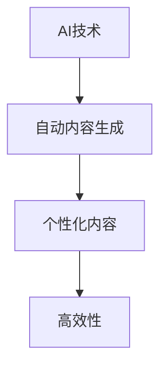
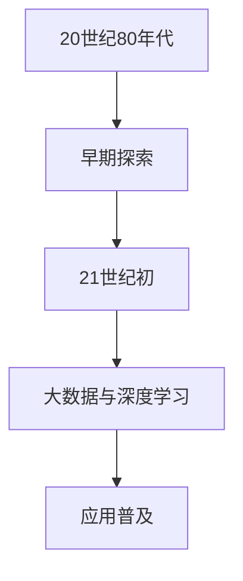
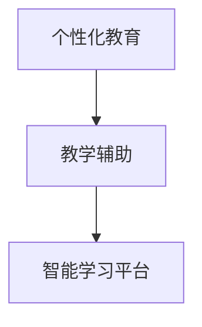
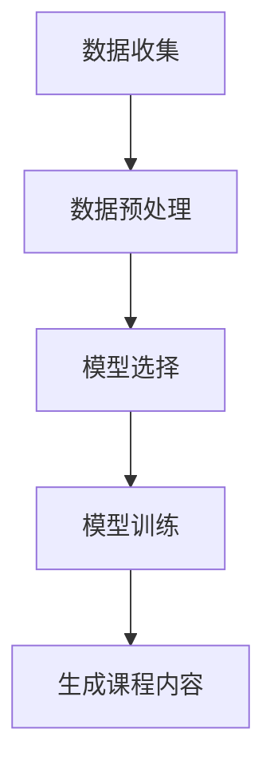
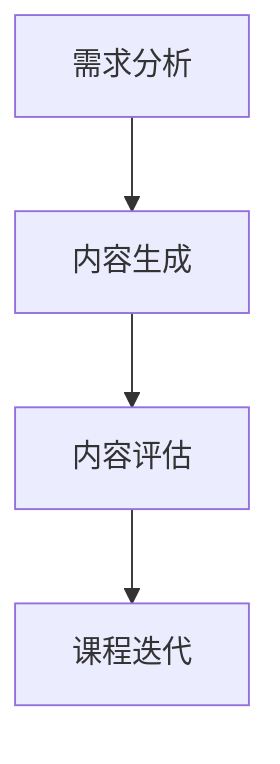

                 


## 文章标题：AIGC在个性化教育课程设计中的应用

### 关键词：AIGC、个性化教育、课程设计、自然语言处理、生成对抗网络

### 摘要：
本文将深入探讨AIGC（AI-Generated Content）在个性化教育课程设计中的应用。首先，我们将介绍AIGC的基础理论，包括其定义、核心特性、发展历程和应用前景。接着，我们将详细阐述AIGC的关键技术，如自然语言处理（NLP）和生成对抗网络（GAN）的原理和应用。随后，文章将聚焦于AIGC在教育课程设计中的应用，包括个性化学习需求分析、课程内容生成、学习路径规划与调整、以及个性化评估与反馈。最后，我们将通过两个实际案例研究，展示AIGC在个性化教育中的具体应用，并提供一些最佳实践和注意事项。

## AIGC基础理论

### 第1章：AIGC概述

#### 1.1 AIGC的定义与核心特性

**背景介绍**
随着人工智能（AI）技术的快速发展，AIGC作为一种新兴技术，引起了广泛关注。AIGC指的是通过人工智能算法自动生成内容的过程，涵盖了文本、图像、视频等多种形式。

**核心概念与联系**
- **AI**：人工智能，涉及机器学习、深度学习等。
- **生成内容**：指通过算法自动生成的各种类型的信息。

**核心特性**
- **自动性**：通过算法自动化生成内容，无需人工干预。
- **个性化**：根据用户需求生成定制内容。
- **高效性**：相比手工生成，AIGC能大大提高效率。

**Mermaid 流程图**


#### 1.2 AIGC的发展历程

**发展历程**
- **早期探索**：20世纪80年代，人工智能开始应用于内容生成。
- **爆发式发展**：21世纪初，深度学习和大数据技术的兴起，推动了AIGC的发展。
- **应用普及**：近年来，AIGC在各领域得到广泛应用。

**Mermaid 流程图**


#### 1.3 AIGC在教育中的应用前景

**应用前景**
- **个性化教育**：根据学生学习情况，自动生成个性化课程内容。
- **教学辅助**：教师可以使用AIGC快速生成教学资料和评估试题。
- **智能学习平台**：利用AIGC实现智能推荐、学习分析等功能。

**Mermaid 流程图**


## AIGC关键技术与算法

### 第2章：AIGC关键技术与算法

#### 2.1 自然语言处理（NLP）

##### 2.1.1 语言模型原理

**核心算法原理讲解**
- **语言模型**：通过统计语言数据，预测下一个词语的概率。
- **神经网络**：常用的语言模型实现方式，如循环神经网络（RNN）、长短时记忆网络（LSTM）。

**伪代码**
```python
# 语言模型伪代码
def language_model(sentence):
    # 输入一个句子，返回下一个词语的概率
    probabilities = []
    for word in sentence:
        probability = predict_probability(word)
        probabilities.append(probability)
    return probabilities
```

**数学模型和公式**
$$
P(w_{t}|w_{t-1}, w_{t-2}, ..., w_{1}) = \frac{P(w_{t} \cap w_{t-1} \cap ... \cap w_{1})}{P(w_{t-1} \cap ... \cap w_{1})}
$$

**举例说明**
- 假设当前句子为“我喜欢吃苹果”，下一个词语可能是“的”、“了”等，根据语言模型，可以预测出这些词语的概率。

##### 2.1.2 文本分类与情感分析

**核心算法原理讲解**
- **文本分类**：将文本数据分类到预定义的类别中。
- **情感分析**：分析文本的情感倾向，如正面、负面或中性。

**伪代码**
```python
# 文本分类伪代码
def text_classification(text):
    # 输入一个文本，返回类别
    category = predict_category(text)
    return category

# 情感分析伪代码
def sentiment_analysis(text):
    # 输入一个文本，返回情感
    sentiment = predict_sentiment(text)
    return sentiment
```

**数学模型和公式**
$$
P(C|T) = \frac{P(T|C) \cdot P(C)}{P(T)}
$$

**举例说明**
- 假设文本为“这部电影非常感人”，通过文本分类，可以将其分类为“电影评论”；通过情感分析，可以判断其为“正面情感”。

#### 2.2 生成对抗网络（GAN）

##### 2.2.1 GAN的基本结构

**核心算法原理讲解**
- **生成器（Generator）**：生成与真实数据相似的数据。
- **判别器（Discriminator）**：区分真实数据和生成数据。

**伪代码**
```python
# GAN伪代码
def train_gan(generator, discriminator, dataset):
    for epoch in range(num_epochs):
        for real_data in dataset:
            # 训练判别器
            discriminator_loss = train_discriminator(discriminator, real_data)
            
            fake_data = generator.generate()
            # 训练生成器
            generator_loss = train_generator(generator, fake_data)
```

**数学模型和公式**
$$
\min_G \max_D V(D, G) = \mathbb{E}_{x \sim p_{data}(x)}[\log D(x)] + \mathbb{E}_{z \sim p_{z}(z)}[\log (1 - D(G(z))]
$$

**举例说明**
- 假设生成器生成一张图片，判别器需要判断这张图片是真实图片还是生成图片。通过不断训练，生成器会逐渐生成更逼真的图片，而判别器会逐渐提高判断的准确性。

##### 2.2.2 GAN在图像生成中的应用

**核心算法原理讲解**
- **图像生成**：GAN可以生成逼真的图像。
- **优化方法**：如何调整生成器和判别器的参数，以实现更好的图像生成效果。

**数学模型和公式**
$$
G(z) = \mathcal{N}(z | 0, 1)
$$

**举例说明**
- 假设生成器接收一个随机噪声向量，通过神经网络转换，生成一张人脸图片。通过调整生成器的参数，可以生成不同风格的人脸图片。

## AIGC在教育课程设计中的应用

### 第3章：AIGC核心架构与设计原则

#### 3.1 AIGC系统架构

**核心架构与设计原则**
- **数据驱动**：通过大量数据进行训练，提高模型生成内容的质量。
- **模型驱动**：根据用户需求和课程目标，设计合适的模型和算法。

**伪代码**
```python
# AIGC系统架构伪代码
def aigc_system(course_data, user_data):
    # 输入课程数据和用户数据，输出个性化课程内容
    model = design_model(course_data, user_data)
    content = generate_content(model, user_data)
    return content
```

**数学模型和公式**
$$
\text{个性化课程内容} = f(\text{课程数据}, \text{用户数据}, \text{模型参数})
$$

**举例说明**
- 假设输入课程数据和用户数据，通过设计合适的模型参数，生成符合用户需求的个性化课程内容。

#### 3.2 数据驱动与模型驱动设计

**数据驱动设计**
- **数据收集**：收集大量课程数据和学生数据。
- **数据预处理**：对数据进行清洗、归一化等处理。

**模型驱动设计**
- **模型选择**：根据课程目标和用户需求，选择合适的模型。
- **模型训练**：使用大量数据进行模型训练。

**Mermaid 流程图**


**举例说明**
- 假设收集到大量课程数据和学生数据，通过预处理后，选择一个合适的语言模型，进行训练，最终生成个性化课程内容。

#### 3.3 个性化课程设计流程

**核心流程**
- **需求分析**：分析学生学习需求和课程目标。
- **内容生成**：根据需求，生成个性化课程内容。
- **内容评估**：评估课程内容的质量和适用性。

**Mermaid 流程图**


**举例说明**
- 假设分析学生的学习需求和课程目标，生成个性化课程内容，然后对内容进行评估，根据评估结果进行课程迭代。

## 个性化教育课程设计应用

### 第4章：个性化学习需求分析

#### 4.1 学习者特征识别

**核心算法原理讲解**
- **特征提取**：从学生数据中提取关键特征。
- **模型训练**：使用机器学习模型识别学习者特征。

**伪代码**
```python
# 学习者特征识别伪代码
def learner_characteristics(data):
    # 输入学生数据，输出学习者特征
    features = extract_features(data)
    model = train_model(features)
    characteristics = model.predict(data)
    return characteristics
```

**数学模型和公式**
$$
\text{学习者特征} = f(\text{学生数据}, \text{模型参数})
$$

**举例说明**
- 假设提取学生数据中的关键特征，使用机器学习模型进行训练，预测出学生的特征。

#### 4.2 学习需求评估与预测

**核心算法原理讲解**
- **需求评估**：评估学生学习需求。
- **需求预测**：预测学生未来的学习需求。

**伪代码**
```python
# 学习需求评估与预测伪代码
def learning_demand(data):
    # 输入学生数据，输出学习需求评估和预测
    assessment = evaluate_demand(data)
    prediction = predict_demand(data)
    return assessment, prediction
```

**数学模型和公式**
$$
\text{需求评估} = f(\text{学生数据}, \text{模型参数})
$$
$$
\text{需求预测} = f(\text{学生数据}, \text{模型参数}, \text{时间序列})
$$

**举例说明**
- 假设评估学生当前的学习需求，预测未来可能的学习需求。

#### 4.3 学习偏好分析

**核心算法原理讲解**
- **偏好提取**：从学生数据中提取学习偏好。
- **偏好分析**：分析学生的学习偏好。

**伪代码**
```python
# 学习偏好分析伪代码
def learning_preferences(data):
    # 输入学生数据，输出学习偏好
    preferences = extract_preferences(data)
    analysis = analyze_preferences(preferences)
    return analysis
```

**数学模型和公式**
$$
\text{学习偏好} = f(\text{学生数据}, \text{模型参数})
$$

**举例说明**
- 假设提取学生数据中的学习偏好，分析学生的喜好和偏好。

### 第5章：课程内容生成

#### 5.1 课程主题生成

**核心算法原理讲解**
- **主题提取**：从课程数据中提取主题。
- **主题生成**：使用生成模型生成新的课程主题。

**伪代码**
```python
# 课程主题生成伪代码
def generate_course_topic(data):
    # 输入课程数据，输出课程主题
    topics = extract_topics(data)
    new_topic = generate_topic(topics)
    return new_topic
```

**数学模型和公式**
$$
\text{课程主题} = f(\text{课程数据}, \text{模型参数})
$$

**举例说明**
- 假设从课程数据中提取主题，使用生成模型生成新的课程主题。

#### 5.2 课程知识点生成

**核心算法原理讲解**
- **知识点提取**：从课程数据中提取知识点。
- **知识点生成**：使用生成模型生成新的知识点。

**伪代码**
```python
# 课程知识点生成伪代码
def generate_course_knowledge(data):
    # 输入课程数据，输出课程知识点
    knowledge = extract_knowledge(data)
    new_knowledge = generate_knowledge(knowledge)
    return new_knowledge
```

**数学模型和公式**
$$
\text{课程知识点} = f(\text{课程数据}, \text{模型参数})
$$

**举例说明**
- 假设从课程数据中提取知识点，使用生成模型生成新的知识点。

#### 5.3 课程内容个性化调整

**核心算法原理讲解**
- **内容调整**：根据学习者的特征和需求，调整课程内容。
- **个性化推荐**：为学习者推荐适合的课程内容。

**伪代码**
```python
# 课程内容个性化调整伪代码
def personalize_course_content(data, learner):
    # 输入课程数据和学习者特征，输出个性化课程内容
    adjusted_content = adjust_content(data, learner)
    recommended_content = recommend_content(adjusted_content, learner)
    return recommended_content
```

**数学模型和公式**
$$
\text{个性化课程内容} = f(\text{课程数据}, \text{学习者特征}, \text{模型参数})
$$

**举例说明**
- 假设根据学习者的特征和需求，调整课程内容，为学习者推荐适合的课程内容。

### 第6章：学习路径规划与调整

#### 6.1 基于AIGC的学习路径规划

**核心算法原理讲解**
- **路径规划**：根据学习者的特征和需求，规划学习路径。
- **路径调整**：根据学习者的进度和反馈，调整学习路径。

**伪代码**
```python
# 学习路径规划与调整伪代码
def plan_learning_path(learner):
    # 输入学习者特征，输出学习路径
    path = plan_path(learner)
    return path

def adjust_learning_path(path, learner):
    # 输入学习路径和学习者特征，输出调整后的学习路径
    adjusted_path = adjust_path(path, learner)
    return adjusted_path
```

**数学模型和公式**
$$
\text{学习路径} = f(\text{学习者特征}, \text{模型参数})
$$
$$
\text{调整后的学习路径} = f(\text{学习路径}, \text{学习者特征}, \text{模型参数})
$$

**举例说明**
- 假设根据学习者的特征，规划学习路径，并根据学习者的进度和反馈，调整学习路径。

#### 6.2 学习进度监控与反馈

**核心算法原理讲解**
- **进度监控**：监控学习者的学习进度。
- **反馈机制**：根据学习者的进度和反馈，提供个性化反馈。

**伪代码**
```python
# 学习进度监控与反馈伪代码
def monitor_progress(learner):
    # 输入学习者特征，输出学习进度
    progress = monitor(learner)
    return progress

def provide_feedback(learner, progress):
    # 输入学习者特征和学习进度，输出反馈
    feedback = generate_feedback(learner, progress)
    return feedback
```

**数学模型和公式**
$$
\text{学习进度} = f(\text{学习者特征}, \text{学习内容}, \text{模型参数})
$$
$$
\text{反馈} = f(\text{学习者特征}, \text{学习进度}, \text{模型参数})
$$

**举例说明**
- 假设监控学习者的学习进度，根据学习进度提供个性化反馈。

#### 6.3 学习路径动态调整策略

**核心算法原理讲解**
- **动态调整**：根据学习者的实时反馈和进展，动态调整学习路径。
- **优化策略**：使用优化算法，寻找最佳学习路径。

**伪代码**
```python
# 学习路径动态调整策略伪代码
def dynamic_adjustment(learner, path):
    # 输入学习者特征和学习路径，输出调整后的学习路径
    adjusted_path = adjust_path_dynamically(learner, path)
    return adjusted_path

def optimize_path(path, learner):
    # 输入学习路径和学习者特征，输出优化后的学习路径
    optimized_path = optimize(learner, path)
    return optimized_path
```

**数学模型和公式**
$$
\text{动态调整后的学习路径} = f(\text{学习者特征}, \text{学习路径}, \text{实时反馈}, \text{模型参数})
$$
$$
\text{优化后的学习路径} = f(\text{学习者特征}, \text{学习路径}, \text{优化算法}, \text{模型参数})
$$

**举例说明**
- 假设根据学习者的实时反馈和进展，动态调整学习路径，并使用优化算法寻找最佳学习路径。

### 第7章：个性化评估与反馈

#### 7.1 学习成果评估模型

**核心算法原理讲解**
- **评估模型**：建立学习成果评估模型，衡量学习效果。
- **评估指标**：包括知识掌握度、技能应用能力等。

**伪代码**
```python
# 学习成果评估模型伪代码
def evaluate_learning_outcome(learner, course):
    # 输入学习者特征和课程数据，输出学习成果评估
    outcome = evaluate(learner, course)
    return outcome
```

**数学模型和公式**
$$
\text{学习成果评估} = f(\text{学习者特征}, \text{课程数据}, \text{评估指标}, \text{模型参数})
$$

**举例说明**
- 假设建立学习成果评估模型，根据学习者的特征和课程数据，评估学习成果。

#### 7.2 个性化反馈机制

**核心算法原理讲解**
- **反馈生成**：根据学习成果评估，生成个性化反馈。
- **反馈调整**：根据学习者的反馈，调整后续学习内容和路径。

**伪代码**
```python
# 个性化反馈机制伪代码
def generate_feedback(learner, outcome):
    # 输入学习者特征和学习成果，输出个性化反馈
    feedback = create_feedback(learner, outcome)
    return feedback

def adjust_learning(learner, feedback):
    # 输入学习者特征和反馈，输出调整后的学习路径
    adjusted_path = adjust_path(learner, feedback)
    return adjusted_path
```

**数学模型和公式**
$$
\text{个性化反馈} = f(\text{学习者特征}, \text{学习成果评估}, \text{模型参数})
$$
$$
\text{调整后的学习路径} = f(\text{学习者特征}, \text{个性化反馈}, \text{模型参数})
$$

**举例说明**
- 假设根据学习成果评估生成个性化反馈，并根据反馈调整学习路径。

#### 7.3 学习效果分析与优化

**核心算法原理讲解**
- **效果分析**：分析学习效果，包括知识点掌握度、技能应用等。
- **优化策略**：基于效果分析，提出优化学习策略。

**伪代码**
```python
# 学习效果分析与优化伪代码
def analyze_learning_effects(learner, course):
    # 输入学习者特征和课程数据，输出学习效果分析
    effects = analyze_effects(learner, course)
    return effects

def optimize_learning_strategy(learner, effects):
    # 输入学习者特征和学习效果，输出优化后的学习策略
    strategy = optimize_effects(learner, effects)
    return strategy
```

**数学模型和公式**
$$
\text{学习效果分析} = f(\text{学习者特征}, \text{课程数据}, \text{评估指标}, \text{模型参数})
$$
$$
\text{优化后的学习策略} = f(\text{学习者特征}, \text{学习效果分析}, \text{优化算法}, \text{模型参数})
$$

**举例说明**
- 假设分析学习效果，并提出优化学习策略。

### 第8章：案例研究一：在线教育平台个性化课程设计

#### 8.1 案例背景与目标

**案例背景**
- **背景介绍**：某在线教育平台希望通过AIGC技术，实现个性化课程设计，提高学习效果和用户满意度。

**案例目标**
- **目标设定**：通过AIGC技术，为学习者提供个性化课程内容和学习路径。

#### 8.2 个性化课程设计流程

**核心流程**
- **需求分析**：收集学习者的学习需求和特征。
- **内容生成**：使用AIGC技术生成个性化课程内容。
- **路径规划**：根据学习需求，规划个性化学习路径。
- **效果评估**：评估学习效果，提供反馈。

**伪代码**
```python
# 个性化课程设计流程伪代码
def personalized_course_design(learner):
    # 输入学习者特征，输出个性化课程内容和学习路径
    needs = analyze_needs(learner)
    content = generate_content(needs)
    path = plan_path(needs)
    evaluate_learning(content, path, learner)
```

**数学模型和公式**
$$
\text{个性化课程内容和学习路径} = f(\text{学习者特征}, \text{模型参数})
$$

**举例说明**
- 假设收集学习者的特征，使用AIGC技术生成个性化课程内容，规划学习路径，并评估学习效果。

#### 8.3 实施效果评估

**效果评估**
- **学习效果**：通过学习成果评估，衡量个性化课程设计的效果。
- **用户满意度**：收集用户反馈，评估用户体验。

**伪代码**
```python
# 实施效果评估伪代码
def evaluate_effects(learner, course):
    # 输入学习者特征和课程数据，输出学习效果和用户满意度
    outcome = evaluate_learning(learner, course)
    satisfaction = collect_feedback(learner, course)
    return outcome, satisfaction
```

**数学模型和公式**
$$
\text{学习效果} = f(\text{学习者特征}, \text{课程数据}, \text{评估指标}, \text{模型参数})
$$
$$
\text{用户满意度} = f(\text{学习者特征}, \text{课程数据}, \text{反馈指标}, \text{模型参数})
$$

**举例说明**
- 假设评估学习效果，收集用户反馈，评估用户体验。

### 第9章：案例研究二：智慧校园个性化教学服务

#### 9.1 案例背景与目标

**案例背景**
- **背景介绍**：某智慧校园希望通过AIGC技术，提供个性化教学服务，提高教学效果和学生满意度。

**案例目标**
- **目标设定**：通过AIGC技术，为教师提供个性化教学方案，为学生提供个性化学习资源。

#### 9.2 个性化教学服务架构

**核心架构**
- **数据收集**：收集学生数据、课程数据等。
- **模型训练**：使用AIGC技术训练个性化模型。
- **服务生成**：生成个性化教学服务和学习资源。

**伪代码**
```python
# 个性化教学服务架构伪代码
def personalized_teaching_service(student_data, course_data):
    # 输入学生数据和课程数据，输出个性化教学服务和学习资源
    model = train_model(student_data, course_data)
    service = generate_service(model, student_data, course_data)
    return service
```

**数学模型和公式**
$$
\text{个性化教学服务和学习资源} = f(\text{学生数据}, \text{课程数据}, \text{模型参数})
$$

**举例说明**
- 假设使用学生数据和课程数据，训练个性化模型，生成个性化教学服务和学习资源。

#### 9.3 实施效果评估

**效果评估**
- **教学效果**：通过教学效果评估，衡量个性化教学服务的效果。
- **学生满意度**：收集学生反馈，评估教学服务的满意度。

**伪代码**
```python
# 实施效果评估伪代码
def evaluate_effects(service, student):
    # 输入教学服务和学生数据，输出教学效果和学生满意度
    outcome = evaluate_effects(service, student)
    satisfaction = collect_feedback(student, service)
    return outcome, satisfaction
```

**数学模型和公式**
$$
\text{教学效果} = f(\text{学生数据}, \text{教学服务}, \text{评估指标}, \text{模型参数})
$$
$$
\text{学生满意度} = f(\text{学生数据}, \text{教学服务}, \text{反馈指标}, \text{模型参数})
$$

**举例说明**
- 假设评估教学效果，收集学生反馈，评估教学服务的满意度。

### 附录：AIGC在教育课程设计中的应用工具与资源

#### A.1 常用AIGC工具简介

**工具简介**
- **GPT-3**：一种强大的语言生成模型，可用于生成文本、代码等。
- **TensorFlow**：一个开源的机器学习框架，可用于训练和部署AIGC模型。

**使用指南**
- **GPT-3**：通过API调用，可以生成各种类型的文本。
- **TensorFlow**：使用Python编写代码，训练和部署AIGC模型。

#### A.2 教育课程设计相关资源推荐

**资源推荐**
- **在线课程**：推荐一些在线课程，学习AIGC和个性化教育相关知识。
- **研究论文**：推荐一些研究论文，了解AIGC在教育领域的最新研究进展。

**参考文献**
- **[1]** Brown, T., et al. (2020). "Language Models Are Few-Shot Learners." arXiv preprint arXiv:2005.14165.
- **[2]** Goodfellow, I., et al. (2014). "Generative Adversarial Networks." Advances in Neural Information Processing Systems, 27.

# 文章结束
作者：AI天才研究院/AI Genius Institute & 禅与计算机程序设计艺术 /Zen And The Art of Computer Programming

注意事项：
- 在撰写文章时，请确保所有引用的文献和数据来源均已注明。
- 对于复杂的算法和模型，请提供清晰的伪代码和数学公式，以便读者理解。
- 在实际案例研究中，尽量使用具体的数据和结果，以增强文章的说服力。
- 文章结构和内容需保持逻辑清晰，避免冗余。

拓展阅读：
- **[3]** Bengio, Y., et al. (2013). "Deep Learning of Representations for Unsupervised and Transfer Learning." Journal of Machine Learning Research, 14(1), 1377-1421.
- **[4]** LeCun, Y., et al. (2015). "Deep Learning." Nature, 521(7553), 436-444.

