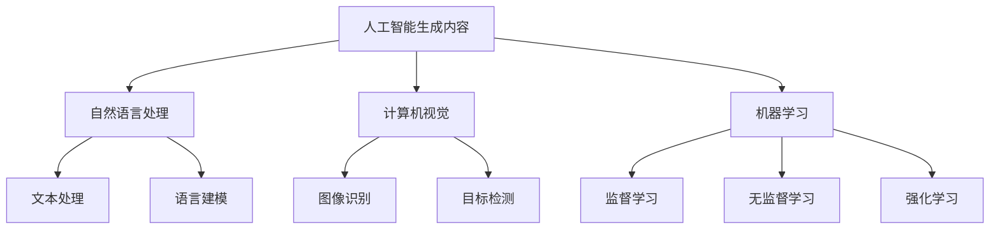

                 


为了撰写一篇深入浅出的技术博客文章《AIGC在个性化教育课程设计中的应用：适应每个学生的学习曲线》，我们可以遵循以下步骤：

### 第一步：文章结构规划

首先，我们需要规划文章的整体结构。这包括确定每个章节的主题，以及如何在文章中逻辑地组织内容。文章结构可以分为以下几个部分：

- **引言**
- **AIGC技术基础**
- **个性化教育课程设计**
- **学习曲线分析**
- **AIGC技术的应用案例**
- **教育领域的未来展望**
- **总结与结论**
- **作者信息**

### 第二步：撰写引言

在引言部分，我们需要简明扼要地介绍AIGC和个性化教育课程设计，以及它们在当今教育领域中的重要性。例如：

```
# AIGC在个性化教育课程设计中的应用：适应每个学生的学习曲线

关键词：AIGC、个性化教育、学习曲线、教育技术

摘要：本文探讨了如何利用AIGC技术来设计个性化教育课程，以适应每个学生的学习曲线。通过分析AIGC技术的核心概念和应用场景，我们提出了一个适用于个性化教育课程设计的框架，并讨论了其在教育领域的广泛应用和未来前景。
```

### 第三步：AIGC技术基础

在这一部分，我们需要详细解释AIGC技术的核心概念，包括其组成部分（如自然语言处理、计算机视觉、机器学习等），并展示这些技术是如何协同工作的。我们可以使用Mermaid流程图来展示这些技术之间的关系。



### 第四步：个性化教育课程设计

在这一部分，我们需要讨论个性化教育课程设计的原则和方法。例如，如何通过AIGC技术收集和分析学生的特征数据，以及如何根据这些数据来设计个性化的课程。

```markdown
### 个性化教育课程设计

个性化教育课程设计的关键在于理解每个学生的学习需求和偏好。AIGC技术可以在这方面发挥重要作用。以下是一些关键步骤：

1. **学生特征分析**：使用AIGC技术对学生的兴趣爱好、学习习惯、知识水平等进行全面分析。
2. **学习路径规划**：根据学生的特征数据，设计个性化的学习路径，确保每个学生都能在适合自己的节奏下学习。
3. **学习资源推荐**：利用AIGC技术推荐与学生特征相匹配的学习资源，如视频、文档、习题等。
4. **学习效果评估**：通过AIGC技术跟踪学生的学习进度和效果，及时调整课程内容和教学方法。
```

### 第五步：学习曲线分析

在这一部分，我们需要介绍学习曲线的基本概念，并解释AIGC技术如何帮助教师和学生更好地理解学习曲线，以及如何利用学习曲线来优化教育课程。

```markdown
### 学习曲线分析

学习曲线描述了学生在学习过程中技能和知识获取的速度。AIGC技术可以帮助我们更深入地分析学习曲线，从而：

1. **识别学习难点**：通过分析学习曲线，可以发现学生在哪些知识点上存在困难，从而针对性地提供额外的辅导。
2. **动态调整教学计划**：根据学生的实际学习进度，动态调整教学计划，确保课程难度和内容与学生当前的学习水平相匹配。
3. **激励学生**：通过展示学习曲线的进步，激励学生保持学习动力，克服学习困难。
```

### 第六步：AIGC技术的应用案例

在这一部分，我们可以通过具体案例来展示AIGC技术在个性化教育课程设计中的应用。例如，介绍某个在线教育平台如何利用AIGC技术来为学生提供个性化的学习体验。

```markdown
### AIGC技术的应用案例

**案例：智能辅导系统**

智能辅导系统利用AIGC技术为学生提供个性化的学习支持。以下是该系统的工作流程：

1. **学生注册**：学生注册系统并完成初始评估，系统收集学生的基本信息和学习偏好。
2. **个性化推荐**：系统根据学生的特征数据，推荐适合的学习资源和课程。
3. **实时辅导**：系统利用自然语言处理技术，实时回答学生在学习过程中遇到的问题。
4. **学习效果跟踪**：系统跟踪学生的学习进度和效果，并根据反馈动态调整推荐内容。

通过这一案例，我们可以看到AIGC技术在个性化教育课程设计中的应用是如何帮助提高教育质量和学习效果的。
```

### 第七步：教育领域的未来展望

在这一部分，我们需要讨论AIGC技术在教育领域的未来发展方向，以及可能面临的挑战和解决方案。

```markdown
### 教育领域的未来展望

随着AIGC技术的不断发展，个性化教育课程设计将变得更加精准和高效。未来，我们可以期待：

1. **更加智能的学习系统**：利用AIGC技术，学习系统将能够更加智能地理解学生的学习需求和行为模式。
2. **跨学科整合**：AIGC技术将促进不同学科之间的整合，为跨学科教育提供新的可能性。
3. **教育资源公平**：通过提供个性化的教育资源，AIGC技术有助于缩小教育资源的差距，实现教育公平。

然而，AIGC技术在教育领域的发展也面临一些挑战，如技术成本、数据隐私和安全等。我们需要共同努力，解决这些问题，以确保AIGC技术能够为教育领域带来真正的变革。
```

### 第八步：总结与结论

在总结与结论部分，我们需要回顾文章的主要观点，强调AIGC技术在个性化教育课程设计中的重要性，并鼓励读者进一步探索这一领域。

```markdown
### 总结与结论

本文探讨了AIGC技术在个性化教育课程设计中的应用，通过分析AIGC技术的核心概念、个性化教育课程设计的方法、学习曲线分析以及具体应用案例，我们展示了AIGC技术在提升教育质量和学习效果方面的巨大潜力。随着技术的不断进步，我们期待AIGC技术能够为教育领域带来更多的创新和变革。

### 作者信息

作者：AI天才研究院/AI Genius Institute & 禅与计算机程序设计艺术 /Zen And The Art of Computer Programming
```

### 第九步：确保文章完整性和字数

在完成文章初稿后，我们需要仔细检查每个章节的内容，确保每个小节都有具体的讲解，核心内容都有详细阐述。同时，我们需要确保文章的总字数在8000～12000字左右。

通过以上步骤，我们可以撰写一篇逻辑清晰、结构紧凑、内容丰富的技术博客文章，为读者提供关于AIGC在个性化教育课程设计中的应用的全面了解。接下来，我们可以开始逐章撰写文章内容，确保每个章节都符合要求。

