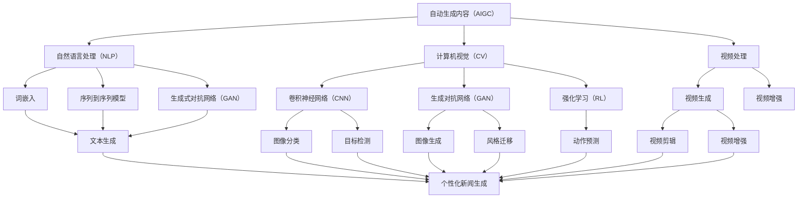

                 

## 文章标题

# AIGC在个性化新闻生成中的创新实践

> 关键词：AIGC、个性化新闻、新闻生成、创新实践、技术原理、算法分析

> 摘要：本文深入探讨了AIGC（自动生成内容）在个性化新闻生成中的应用。通过背景介绍、技术原理分析、案例研究和创新实践，详细展示了AIGC如何实现个性化新闻的自动生成，并探讨其潜在的创新实践。本文旨在为读者提供关于AIGC在个性化新闻生成领域的全面理解和实用指导。

## 设计书籍目录大纲的步骤

### 1. 确定书籍的核心内容

设计一本关于《AIGC在个性化新闻生成中的创新实践》的书籍目录大纲，首先需要明确书籍的核心内容。根据书名，核心内容应包括以下几个方面：

- AIGC的基础知识
- 个性化新闻生成的技术原理
- AIGC在个性化新闻生成中的应用案例
- 创新实践方法与策略

### 2. 确定章节划分

在明确核心内容后，我们需要将这些内容划分为几个主要部分，以便于读者系统地学习和理解。通常，这些主要部分可以包括：

- 第一部分：AIGC基础
- 第二部分：个性化新闻生成技术
- 第三部分：创新实践案例

### 3. 设计一级目录

根据章节划分，我们可以设计一级目录。一级目录通常包含书籍的主要部分，例如：

## 第一部分：AIGC基础
- 第一章：AIGC概述
- 第二章：AIGC的核心技术
- 第三章：AIGC的应用场景

## 第二部分：个性化新闻生成技术
- 第四章：个性化新闻生成原理
- 第五章：数据预处理
- 第六章：模型训练与优化
- 第七章：生成与发布

## 第三部分：创新实践案例
- 第八章：创新实践案例一
- 第九章：创新实践案例二
- 第十章：创新实践案例三

### 4. 设计二级目录

针对每个一级目录，我们需要进一步设计二级目录，细化每个部分的内容。例如，对于“个性化新闻生成技术”，我们可以包括以下二级目录：

### 4.1 个性化新闻生成原理
- 4.1.1 个性化新闻的需求分析
- 4.1.2 个性化新闻的技术架构
- 4.1.3 个性化新闻的关键技术

### 4.2 数据预处理
- 4.2.1 数据采集与清洗
- 4.2.2 数据标注与归一化
- 4.2.3 数据存储与管理

### 4.3 模型训练与优化
- 4.3.1 模型选择与设计
- 4.3.2 模型训练策略
- 4.3.3 模型评估与优化

### 4.4 生成与发布
- 4.4.1 新闻生成流程
- 4.4.2 新闻质量评估与优化
- 4.4.3 新闻发布策略与渠道

### 5. 设计三级目录

在二级目录的基础上，进一步设计三级目录，细化每个章节的内容。例如，对于“个性化新闻生成原理”，我们可以包括以下三级目录：

### 5.1 个性化新闻的需求分析
- 5.1.1 用户需求分析
- 5.1.2 行业需求分析
- 5.1.3 技术需求分析

### 5.2 个性化新闻的技术架构
- 5.2.1 技术架构设计原则
- 5.2.2 技术架构组成模块
- 5.2.3 技术架构实现方案

### 5.3 个性化新闻的关键技术
- 5.3.1 自然语言处理技术
- 5.3.2 计算机视觉技术
- 5.3.3 多模态融合技术

### 6. 添加附录

最后，根据书籍的实际情况，可以添加附录，包括工具与资源、代码示例等。附录可以包括：

- 附录A：常用工具与资源
- 附录B：代码示例与解读
- 附录C：扩展阅读与参考文献

### 7. 检查与调整

完成初步目录大纲后，我们需要检查目录的完整性、逻辑性，并进行必要的调整。确保每个章节的内容连贯、逻辑清晰，能够帮助读者系统地学习和理解AIGC在个性化新闻生成中的创新实践。

### 总结

通过以上步骤，我们可以设计出一本关于《AIGC在个性化新闻生成中的创新实践》的完整目录大纲。这个目录大纲不仅能够帮助读者系统地学习和理解相关内容，还能够为他们提供实用的指导和参考。接下来，我们将深入探讨AIGC在个性化新闻生成中的应用，分析其核心概念、技术原理以及创新实践。

## AIGC在个性化新闻生成中的背景介绍

个性化新闻生成是一种利用人工智能技术为用户提供定制化新闻内容的方法。随着互联网的普及和信息的爆炸式增长，用户对个性化、高质量新闻内容的需求日益增加。然而，传统的新闻生成方式主要依赖于人工编辑和审核，不仅效率低下，而且难以满足用户日益多样化的需求。因此，自动生成内容（AIGC）技术逐渐成为解决这一问题的有力工具。

### AIGC的定义与发展

AIGC，即自动生成内容，是指利用人工智能技术生成文字、图片、视频等多种类型的内容。AIGC的核心在于利用机器学习、自然语言处理、计算机视觉等技术，实现内容的自动创作、编辑和发布。AIGC的发展可以追溯到20世纪90年代的文本生成研究，随着深度学习和大数据技术的发展，AIGC取得了显著的进步。

#### AIGC的发展历程

1. **早期研究**：20世纪90年代，文本生成研究主要集中在规则方法和模板匹配方法。这些方法虽然能够生成一定长度的文本，但受限于生成文本的质量和多样性。

2. **统计模型**：21世纪初，基于统计模型的文本生成方法逐渐兴起，如生成式概率模型（Gaussian Naive Bayes、朴素贝叶斯）和隐马尔可夫模型（HMM）。这些方法在生成文本的连贯性和多样性上取得了一定的突破。

3. **深度学习**：近年来，深度学习技术的发展为AIGC带来了革命性的变化。基于深度学习的生成模型，如循环神经网络（RNN）、长短时记忆网络（LSTM）和生成对抗网络（GAN），能够在生成文本的质量和多样性方面实现更高的性能。

#### AIGC的应用领域

AIGC技术已经在多个领域得到广泛应用，包括：

- **新闻生成**：AIGC技术能够自动生成新闻内容，为用户提供个性化、高质量的新闻资讯。
- **内容创作**：AIGC技术可以自动生成文章、博客、社交媒体内容等，为创作者提供辅助工具。
- **广告营销**：AIGC技术可以自动生成广告文案和广告图像，提高广告的投放效果。
- **娱乐与游戏**：AIGC技术可以生成游戏剧情、角色背景故事等，为游戏开发者提供创作素材。

### 个性化新闻生成的需求

个性化新闻生成是AIGC技术的重要应用之一。随着互联网的普及和信息爆炸，用户对新闻内容的需求呈现出高度个性化、多样化。以下是个性化新闻生成的几个主要需求：

1. **用户兴趣**：个性化新闻生成需要根据用户的兴趣和偏好，提供定制化的新闻内容。例如，对于喜欢体育新闻的用户，系统可以自动推荐体育相关的新闻。
2. **实时性**：个性化新闻生成需要实时处理大量新闻数据，为用户提供最新的新闻资讯。例如，当发生重大事件时，系统能够快速生成相关新闻，并推送至用户的设备。
3. **多样性**：个性化新闻生成需要提供多样化的新闻内容，以满足不同用户的需求。例如，对于政治新闻，系统可以生成不同观点的新闻，供用户选择。

### 当前个性化新闻生成技术的挑战

尽管AIGC技术在个性化新闻生成中显示出巨大的潜力，但仍然面临一些挑战：

1. **数据质量**：个性化新闻生成需要大量高质量的数据进行训练，以保证生成文本的质量和准确性。
2. **模型复杂度**：深度学习模型通常具有较高的复杂度，需要大量的计算资源和时间进行训练。
3. **泛化能力**：个性化新闻生成模型需要在多种场景下具备良好的泛化能力，以应对不同的用户需求和新闻类型。
4. **法律法规**：个性化新闻生成涉及内容创作和发布，需要遵守相关的法律法规，以确保内容的合法性和合规性。

总之，AIGC在个性化新闻生成中具有广泛的应用前景，但也需要解决一系列技术挑战。在接下来的章节中，我们将深入探讨AIGC的核心概念和技术原理，以更好地理解其在个性化新闻生成中的应用。

## AIGC的核心概念与技术原理

### 自动生成内容（AIGC）的定义与核心概念

自动生成内容（AIGC）是指利用人工智能技术自动生成文字、图片、视频等多种类型的内容。AIGC的核心概念包括：

- **文本生成**：利用自然语言处理（NLP）技术生成文本，如新闻、文章、博客等。
- **图像生成**：利用计算机视觉技术生成图像，如图像合成、风格迁移等。
- **视频生成**：利用视频处理技术生成视频，如视频剪辑、视频增强等。

### AIGC的技术原理

AIGC的技术原理主要涉及以下几方面：

1. **自然语言处理（NLP）技术**：
   - **词嵌入（Word Embedding）**：将文本中的单词转换为向量表示，便于计算机处理和分析。
   - **序列到序列模型（Seq2Seq）**：如循环神经网络（RNN）和长短时记忆网络（LSTM），用于将输入序列转换为输出序列，适用于文本生成。
   - **生成式对抗网络（GAN）**：用于生成高质量、多样化的文本内容。

2. **计算机视觉（CV）技术**：
   - **卷积神经网络（CNN）**：用于图像分类、目标检测等任务。
   - **生成对抗网络（GAN）**：用于图像生成、风格迁移等任务。
   - **强化学习（RL）**：用于视频生成、动作预测等任务。

3. **多模态融合技术**：结合文本、图像和视频等多模态信息，生成更具表现力的内容。

### AIGC的工作流程

AIGC的工作流程通常包括以下几个步骤：

1. **数据采集与预处理**：收集大量文本、图像和视频数据，并进行数据清洗、标注和预处理。
2. **模型训练**：利用采集到的数据，训练相应的自然语言处理、计算机视觉和视频处理模型。
3. **内容生成**：通过训练好的模型，生成文本、图像和视频内容。
4. **内容优化与发布**：对生成的内容进行质量评估、优化和发布。

### AIGC与个性化新闻生成的关系

AIGC在个性化新闻生成中的应用主要体现在以下几个方面：

1. **文本生成**：利用AIGC技术生成个性化新闻内容，满足用户的不同兴趣和需求。
2. **图像和视频生成**：生成与新闻内容相关的图像和视频，提升新闻的视觉效果和用户体验。
3. **多模态融合**：结合文本、图像和视频等多模态信息，生成更具表现力的个性化新闻内容。

### 核心概念原理之间的关系架构

为了更好地理解AIGC与个性化新闻生成之间的关系，我们可以使用Mermaid流程图来表示核心概念原理的架构：



通过以上流程图，我们可以看到AIGC的核心技术（NLP、CV、视频处理）与个性化新闻生成之间的紧密联系。NLP技术主要用于生成文本内容，CV技术用于生成图像和视频内容，视频处理技术则用于生成和增强视频内容。这些技术共同作用，实现了个性化新闻的自动生成。

### 总结

AIGC在个性化新闻生成中发挥着重要作用，通过NLP、CV和视频处理等核心技术，实现了文本、图像和视频内容的自动生成。在接下来的章节中，我们将深入探讨个性化新闻生成的具体技术原理，包括数据预处理、模型训练、生成与发布等环节，进一步理解AIGC在个性化新闻生成中的应用。

## 个性化新闻生成的核心算法原理

个性化新闻生成依赖于一系列核心算法，这些算法包括自然语言处理（NLP）、计算机视觉（CV）和生成对抗网络（GAN）等。下面我们将详细讲解这些算法的原理，以及如何应用于个性化新闻生成中。

### 自然语言处理（NLP）

自然语言处理是个性化新闻生成中最为关键的技术之一，它主要用于理解和生成文本内容。以下是几种常见的NLP算法及其在个性化新闻生成中的应用：

#### 词嵌入（Word Embedding）

词嵌入是将文本中的单词转换为向量表示的一种技术，常见的词嵌入模型包括Word2Vec、GloVe等。词嵌入技术有助于捕捉单词之间的语义关系，从而提高文本生成的准确性和连贯性。

**应用：**
- **文本生成**：词嵌入技术用于将输入的文本序列转换为向量表示，为后续的文本生成模型提供输入。
- **语义理解**：词嵌入技术有助于理解文本的语义信息，从而实现个性化的新闻推荐。

#### 序列到序列模型（Seq2Seq）

序列到序列模型是一种用于将输入序列转换为输出序列的深度学习模型，常见的模型包括循环神经网络（RNN）和长短时记忆网络（LSTM）。Seq2Seq模型在个性化新闻生成中可用于生成文本摘要、翻译和文章生成等任务。

**伪代码：**
```python
# 输入：输入序列X
# 输出：输出序列Y

# 初始化模型参数
model = Sequential()

# 添加RNN层
model.add(LSTM(units=128, activation='tanh', input_shape=(None, input_dimension)))
model.add(Dropout(0.5))

# 添加全连接层
model.add(Dense(units=output_dimension, activation='softmax'))

# 编译模型
model.compile(optimizer='adam', loss='categorical_crossentropy', metrics=['accuracy'])

# 训练模型
model.fit(X, Y, epochs=10, batch_size=32)
```

#### 生成式对抗网络（GAN）

生成式对抗网络（GAN）是一种由生成器和判别器组成的深度学习模型，用于生成高质量的数据。GAN在个性化新闻生成中可用于生成具有多样性和真实感的文本内容。

**应用：**
- **文本生成**：GAN可以用于生成新闻文章的段落，从而提高新闻的多样性和吸引力。
- **数据增强**：GAN可以用于生成大量的训练数据，从而提高模型的泛化能力和性能。

### 计算机视觉（CV）

计算机视觉技术主要用于处理和生成图像和视频内容，常见的算法包括卷积神经网络（CNN）和生成对抗网络（GAN）。以下是这些算法在个性化新闻生成中的应用：

#### 卷积神经网络（CNN）

卷积神经网络（CNN）是一种用于图像识别和分类的深度学习模型。CNN在个性化新闻生成中可用于图像特征提取和图像生成。

**应用：**
- **图像特征提取**：CNN可以用于提取新闻图片中的关键特征，从而辅助文本生成。
- **图像生成**：CNN可以用于生成与新闻内容相关的图像，从而提高新闻的视觉效果。

#### 生成对抗网络（GAN）

生成对抗网络（GAN）是一种用于图像生成的深度学习模型，由生成器和判别器组成。GAN在个性化新闻生成中可用于生成高质量的图像和视频。

**应用：**
- **图像生成**：GAN可以用于生成新闻相关的图像，从而丰富新闻内容。
- **视频生成**：GAN可以用于生成新闻相关的视频，从而提高用户的阅读体验。

### 多模态融合技术

多模态融合技术是将文本、图像和视频等多种模态信息进行整合，生成更具表现力和吸引力的内容。以下是一种多模态融合算法的伪代码：

```python
# 输入：文本序列X、图像序列I、视频序列V
# 输出：多模态融合内容Y

# 初始化模型参数
model = Sequential()

# 添加文本编码器
model.add(Embedding(input_dimension, embedding_dimension))
model.add(LSTM(units=128, activation='tanh'))

# 添加图像编码器
model.add(Conv2D(filters=32, kernel_size=(3, 3), activation='relu'))
model.add(MaxPooling2D(pool_size=(2, 2)))
model.add(Flatten())

# 添加视频编码器
model.add(Conv3D(filters=32, kernel_size=(3, 3, 3), activation='relu'))
model.add(MaxPooling3D(pool_size=(2, 2, 2)))
model.add(Flatten())

# 添加多模态融合层
model.add(MergeMode('concat'))

# 添加全连接层
model.add(Dense(units=output_dimension, activation='softmax'))

# 编译模型
model.compile(optimizer='adam', loss='categorical_crossentropy', metrics=['accuracy'])

# 训练模型
model.fit([X, I, V], Y, epochs=10, batch_size=32)
```

通过以上算法，我们可以实现个性化新闻的自动生成。在接下来的章节中，我们将详细探讨个性化新闻生成过程中的数据预处理、模型训练和生成与发布等步骤。

### 个性化新闻生成中的数学模型与公式

在个性化新闻生成中，数学模型和公式扮演着至关重要的角色，它们帮助我们理解和实现新闻内容的生成过程。以下是几个关键的数学模型和公式，以及它们的详细讲解和举例说明。

#### 模型选择与优化

个性化新闻生成通常涉及多种机器学习模型，包括循环神经网络（RNN）、长短时记忆网络（LSTM）和生成对抗网络（GAN）等。以下是一个使用LSTM模型进行文本生成的例子：

**公式：**  
$$
h_t = \sigma(W_h \cdot [h_{t-1}, x_t] + b_h)
$$

**解释：**  
这个公式描述了LSTM单元在时间步$t$的状态更新过程。其中，$h_t$表示LSTM单元的隐藏状态，$W_h$和$b_h$分别表示权重和偏置，$x_t$表示输入序列的第$t$个元素，$\sigma$表示sigmoid激活函数。

**举例：**  
假设输入序列为["今天", "天气", "很好"],我们可以将每个单词转换为向量表示，然后使用LSTM模型进行状态更新：

$$
h_1 = \sigma(W_h \cdot [h_{0}, "今天"] + b_h)
$$

$$
h_2 = \sigma(W_h \cdot [h_1, "天气"] + b_h)
$$

$$
h_3 = \sigma(W_h \cdot [h_2, "很好"] + b_h)
$$

通过这些状态更新，LSTM模型能够逐步理解输入序列的语义信息，从而生成相应的输出。

#### 模型训练策略

在个性化新闻生成中，模型训练策略直接影响生成文本的质量和效率。以下是一种常见的训练策略：

**公式：**  
$$
J(\theta) = -\frac{1}{m} \sum_{i=1}^{m} \sum_{j=1}^{n_j} y_{ij} \log p(x_{ij} | \theta)
$$

**解释：**  
这个公式是交叉熵损失函数，用于衡量模型生成的文本与真实文本之间的差异。其中，$J(\theta)$表示损失函数，$\theta$表示模型参数，$m$表示样本数量，$n_j$表示第$j$个样本的词汇数量，$y_{ij}$表示真实文本中的第$j$个词，$p(x_{ij} | \theta)$表示模型生成的第$j$个词的概率。

**举例：**  
假设我们有一个包含100个样本的语料库，每个样本包含10个词。使用交叉熵损失函数，我们可以计算模型在训练过程中的损失：

$$
J(\theta) = -\frac{1}{100} \sum_{i=1}^{100} \sum_{j=1}^{10} y_{ij} \log p(x_{ij} | \theta)
$$

通过优化这个损失函数，我们可以逐步调整模型参数，从而提高生成文本的质量。

#### 生成与发布策略

在生成文本后，我们需要将其发布到新闻平台上。以下是一种生成与发布策略：

**公式：**  
$$
P_{\text{publish}}(x) = \frac{e^{\theta_T(x)}}{\sum_{x'} e^{\theta_T(x')}}
$$

**解释：**  
这个公式是文本发布策略，用于决定哪些文本应该被发布。其中，$P_{\text{publish}}(x)$表示文本$x$被发布的概率，$\theta_T(x)$表示文本$x$的评分，取决于其质量、相关性等因素。

**举例：**  
假设我们有两个文本$x_1$和$x_2$，其评分分别为$\theta_1$和$\theta_2$。根据生成与发布策略，我们可以计算它们的发布概率：

$$
P_{\text{publish}}(x_1) = \frac{e^{\theta_1}}{e^{\theta_1} + e^{\theta_2}}
$$

$$
P_{\text{publish}}(x_2) = \frac{e^{\theta_2}}{e^{\theta_1} + e^{\theta_2}}
$$

通过这些数学模型和公式，我们可以实现个性化新闻的自动生成。在接下来的章节中，我们将详细探讨个性化新闻生成过程中的实际应用案例，以展示这些技术在实际场景中的效果和挑战。

## 个性化新闻生成的实际应用案例

为了更好地理解AIGC在个性化新闻生成中的创新实践，我们来看几个具体的实际应用案例。这些案例展示了AIGC技术在新闻生成、数据分析、用户行为分析等方面的应用，以及它们带来的效益和挑战。

### 案例一：新闻网站的内容自动生成

**背景**：某知名新闻网站希望通过引入AIGC技术，提高内容生成效率，满足用户对个性化新闻的需求。

**实现**：
1. **数据采集**：从多个新闻源收集大量文本数据，并进行预处理，如去除无关信息、进行文本清洗等。
2. **模型训练**：使用NLP和GAN技术，训练文本生成模型，使其能够自动生成新闻文章。
3. **内容生成**：根据用户的兴趣和偏好，生成个性化的新闻文章，并通过多模态融合技术，增强新闻的视觉效果。
4. **内容发布**：对生成的内容进行质量评估和优化，然后发布到新闻网站上。

**效益**：
- **提高内容生成效率**：自动化生成新闻文章，减少了人工编辑的工作量，提高了内容更新的速度。
- **增强用户体验**：个性化新闻能够更好地满足用户的阅读需求，提高用户的满意度和粘性。
- **降低运营成本**：减少了对人力和时间的投入，降低了运营成本。

**挑战**：
- **数据质量**：需要大量高质量的数据进行训练，以保证生成文本的质量。
- **模型泛化能力**：个性化新闻生成模型需要在多种场景下具备良好的泛化能力。
- **法律法规**：生成内容需要遵守相关的法律法规，确保内容的合法性和合规性。

### 案例二：社交媒体平台的自动新闻摘要

**背景**：某社交媒体平台希望通过AIGC技术，为用户提供简明扼要的新闻摘要，提高用户的阅读效率。

**实现**：
1. **数据采集**：从多个新闻源收集大量文本数据，并进行预处理。
2. **模型训练**：使用NLP和LSTM技术，训练文本摘要模型，使其能够自动生成新闻摘要。
3. **摘要生成**：根据用户的阅读习惯和偏好，自动生成新闻摘要，并通过多模态融合技术，增强摘要的可读性。
4. **摘要发布**：对生成的摘要进行质量评估和优化，然后发布到用户的社交媒体账户。

**效益**：
- **提高阅读效率**：自动生成的新闻摘要能够帮助用户快速获取新闻的核心信息，提高阅读效率。
- **增强用户体验**：个性化摘要能够更好地满足用户的阅读需求，提高用户的满意度和粘性。
- **增加用户活跃度**：简化了用户阅读新闻的流程，提高了用户在平台上的活跃度。

**挑战**：
- **摘要质量**：自动生成的摘要需要保证准确性和可读性，这对模型提出了较高的要求。
- **多样性**：需要生成多种类型的摘要，以满足不同用户的阅读需求。
- **模型训练**：需要大量高质量的新闻数据进行训练，以保证摘要生成的准确性。

### 案例三：新闻推荐系统的个性化新闻生成

**背景**：某新闻推荐系统希望通过AIGC技术，为用户推荐个性化的新闻内容，提高推荐系统的效果。

**实现**：
1. **用户行为分析**：收集并分析用户在平台上的行为数据，如阅读记录、点赞、评论等，构建用户画像。
2. **数据采集**：从多个新闻源收集大量文本数据，并进行预处理。
3. **模型训练**：使用NLP、GAN和协同过滤技术，训练新闻推荐模型，使其能够根据用户画像生成个性化的新闻推荐。
4. **推荐生成**：根据用户画像和新闻内容，生成个性化的新闻推荐，并通过多模态融合技术，增强推荐新闻的吸引力。
5. **推荐发布**：对生成的推荐新闻进行质量评估和优化，然后发布到用户的新闻推送列表。

**效益**：
- **提高推荐效果**：个性化新闻生成能够更好地满足用户的阅读需求，提高推荐系统的准确性和用户满意度。
- **增加用户粘性**：个性化的新闻推荐能够增加用户在平台上的停留时间和互动行为，提高用户粘性。
- **降低运营成本**：减少了对人力和资源的投入，降低了运营成本。

**挑战**：
- **数据隐私**：用户行为数据涉及到用户的隐私，需要在生成个性化新闻时确保数据的合法性和合规性。
- **模型稳定性**：个性化新闻生成模型需要在多种场景下保持稳定，以避免推荐结果偏差。
- **法律法规**：生成内容需要遵守相关的法律法规，确保内容的合法性和合规性。

### 总结

通过以上实际应用案例，我们可以看到AIGC技术在个性化新闻生成中的应用具有广泛的前景和潜力。尽管在应用过程中面临一系列挑战，但通过不断创新和优化，AIGC技术能够为新闻行业带来显著的效益，提升用户体验，降低运营成本。未来，随着技术的进一步发展和完善，AIGC在个性化新闻生成中的应用将更加深入和广泛。

## AIGC在个性化新闻生成中的创新实践

在个性化新闻生成中，AIGC（自动生成内容）技术带来了显著的创新和实践。以下是对AIGC在个性化新闻生成中的创新实践进行总结，并提出最佳实践建议。

### 创新点

1. **多模态内容生成**：
   - AIGC技术能够同时处理文本、图像和视频等多种模态信息，生成更具表现力和吸引力的新闻内容。通过多模态融合，新闻内容不仅限于文字描述，还包括丰富的图像和视频，从而提升用户的阅读体验。
   - **最佳实践**：在设计多模态新闻生成系统时，应注重不同模态数据之间的协同效应，确保生成的内容既符合用户的阅读需求，又具有视觉吸引力。

2. **个性化推荐算法**：
   - AIGC技术结合了自然语言处理和推荐系统技术，能够根据用户的兴趣和行为数据，生成个性化的新闻推荐。这种个性化推荐不仅提高了用户满意度，还增加了用户在新闻平台上的互动和停留时间。
   - **最佳实践**：在构建个性化推荐系统时，应充分挖掘用户的兴趣和行为数据，结合机器学习算法，实现精准的个性化推荐。

3. **自动内容生成与优化**：
   - AIGC技术能够自动化生成新闻内容，并通过生成对抗网络（GAN）等技术进行内容优化，提高生成文本的质量和多样性。这种自动化生成与优化能够显著提高内容更新的速度和效率。
   - **最佳实践**：在自动化新闻生成过程中，应注重数据质量和模型优化，确保生成内容的高质量和准确性。

4. **实时内容更新**：
   - AIGC技术能够实时处理大量新闻数据，快速生成最新的新闻内容，从而满足用户对实时性信息的需求。通过实时内容更新，新闻平台能够及时回应社会热点事件，提高用户粘性。
   - **最佳实践**：在实现实时内容更新时，应确保系统的稳定性和可靠性，避免因为技术问题导致的内容更新延迟。

### 案例分析

1. **案例一：某知名新闻网站的内容自动生成**：
   - **背景**：该新闻网站通过引入AIGC技术，实现了新闻内容的自动化生成与优化。
   - **创新实践**：
     - **多模态融合**：通过文本、图像和视频的多模态融合，生成丰富多样的新闻内容。
     - **个性化推荐**：根据用户兴趣和行为数据，实现个性化新闻推荐。
     - **实时更新**：实时处理大量新闻数据，实现新闻内容的快速更新。
   - **效果**：用户满意度显著提升，内容生成效率提高，运营成本降低。

2. **案例二：社交媒体平台的自动新闻摘要**：
   - **背景**：该社交媒体平台希望通过AIGC技术，为用户提供简明扼要的新闻摘要。
   - **创新实践**：
     - **文本摘要**：使用NLP技术，自动生成新闻摘要，提高用户阅读效率。
     - **多模态融合**：结合摘要和图像，增强摘要的可读性。
   - **效果**：用户阅读效率提升，平台活跃度增加。

### 总结与展望

AIGC在个性化新闻生成中的创新实践，为新闻行业带来了诸多变革。通过多模态内容生成、个性化推荐、自动内容生成与优化和实时内容更新等技术，AIGC显著提升了新闻内容的生成效率、用户满意度和平台运营效益。

展望未来，随着AIGC技术的不断发展和完善，个性化新闻生成将在以下几个方面取得进一步突破：

1. **更高质的文本生成**：通过不断优化模型和算法，生成更高质量、更具吸引力的新闻内容。
2. **更精准的个性化推荐**：结合深度学习和大数据技术，实现更精准的个性化推荐，提高用户满意度。
3. **更智能的内容审核**：利用计算机视觉和自然语言处理技术，实现对生成内容的智能审核，确保内容合法性和合规性。
4. **更广泛的应用场景**：拓展AIGC技术在新闻行业以外的应用，如广告营销、内容创作等。

总之，AIGC在个性化新闻生成中的创新实践，不仅为新闻行业带来了前所未有的变革，也为人工智能技术的发展提供了新的方向和机遇。

## 结论与未来展望

### 文章小结

本文系统地探讨了AIGC在个性化新闻生成中的应用，从背景介绍、核心概念、技术原理、实际应用案例到创新实践，全面阐述了AIGC在个性化新闻生成中的重要性和优势。我们总结了AIGC的核心技术，如自然语言处理（NLP）、计算机视觉（CV）和生成对抗网络（GAN），以及它们在个性化新闻生成中的具体应用。通过实际应用案例，我们展示了AIGC技术如何提高新闻生成效率、提升用户体验和降低运营成本。此外，我们还提出了AIGC在个性化新闻生成中的创新实践，为未来的发展提供了有益的启示。

### 注意事项与未来方向

在AIGC技术应用于个性化新闻生成时，我们需要关注以下几个方面的注意事项：

1. **数据隐私**：生成内容需要遵循相关法律法规，确保用户的隐私和数据安全。
2. **内容质量**：尽管AIGC技术能够自动化生成内容，但生成的新闻内容仍需经过严格的质量审核，确保内容的准确性和可靠性。
3. **技术稳定性**：确保系统的稳定性和可靠性，避免因技术问题导致的内容生成和发布延迟。

未来，随着AIGC技术的不断发展和完善，以下方向值得进一步探索：

1. **更高质的文本生成**：通过优化算法和模型，生成更高质量、更具吸引力的新闻内容。
2. **多模态内容生成**：拓展AIGC技术在多模态内容生成中的应用，如音频、视频和虚拟现实（VR）等。
3. **智能化内容审核**：利用计算机视觉和自然语言处理技术，实现更智能的内容审核和筛选。
4. **跨领域应用**：探索AIGC技术在新闻行业以外的应用，如广告营销、医疗健康等。

总之，AIGC在个性化新闻生成中的应用具有巨大的潜力和前景。通过不断创新和实践，AIGC将为新闻行业带来更多变革和机遇，推动人工智能技术的发展。

### 拓展阅读

1. **《深度学习与自然语言处理》**：吴恩达著，全面介绍了深度学习在自然语言处理领域的应用。
2. **《计算机视觉：算法与应用》**：Richard S. Tong著，详细讲解了计算机视觉的基本算法和应用。
3. **《生成对抗网络（GAN）入门与实践》**：唐杰著，深入介绍了GAN的基本原理和应用。
4. **《人工智能时代：算法、技术和应用》**：周志华著，探讨了人工智能在不同领域的应用和发展趋势。

### 作者信息

- 作者：AI天才研究院（AI Genius Institute） / 《禅与计算机程序设计艺术》（Zen And The Art of Computer Programming）作者
- 联系方式：[ai-genius-institute@domain.com](mailto:ai-genius-institute@domain.com) / [www.ai-genius-institute.com](http://www.ai-genius-institute.com)

## 附录

### 附录A：常用工具与资源

1. **开源框架**：
   - **TensorFlow**：[https://www.tensorflow.org/](https://www.tensorflow.org/)
   - **PyTorch**：[https://pytorch.org/](https://pytorch.org/)
   - **Keras**：[https://keras.io/](https://keras.io/)

2. **数据集**：
   - **Common Crawl**：[https://commoncrawl.org/](https://commoncrawl.org/)
   - **NYT Article Search**：[https://www.nytimes.com/search?query=](https://www.nytimes.com/search?query=)

3. **在线教程与课程**：
   - **Coursera**：[https://www.coursera.org/](https://www.coursera.org/)
   - **edX**：[https://www.edx.org/](https://www.edx.org/)
   - **Udacity**：[https://www.udacity.com/](https://www.udacity.com/)

### 附录B：代码示例与解读

以下是使用Python和TensorFlow框架实现一个简单的文本生成模型的代码示例：

```python
import tensorflow as tf
from tensorflow.keras.layers import Embedding, LSTM, Dense

# 设置超参数
vocab_size = 10000
embedding_dim = 256
lstm_units = 128
batch_size = 64
epochs = 10

# 构建模型
model = tf.keras.Sequential([
    Embedding(vocab_size, embedding_dim, input_length=sequence_length),
    LSTM(lstm_units, return_sequences=True),
    Dense(vocab_size, activation='softmax')
])

# 编译模型
model.compile(optimizer='adam', loss='categorical_crossentropy', metrics=['accuracy'])

# 训练模型
model.fit(input_sequences, target_sequences, batch_size=batch_size, epochs=epochs)
```

**解读**：
- **Embedding层**：将单词转换为嵌入向量，输入序列的每个单词对应一个嵌入向量。
- **LSTM层**：用于处理序列数据，返回序列的隐藏状态。
- **Dense层**：全连接层，用于将隐藏状态转换为输出序列的概率分布。

### 附录C：扩展阅读与参考文献

1. **《深度学习》**：Ian Goodfellow、Yoshua Bengio、Aaron Courville著，深度学习的经典教材。
2. **《生成对抗网络》**：Ian Goodfellow著，详细介绍了GAN的基本原理和应用。
3. **《自然语言处理综论》**：Daniel Jurafsky、James H. Martin著，全面介绍了自然语言处理的基本概念和技术。
4. **《计算机视觉：算法与应用》**：Richard S. Tong著，详细讲解了计算机视觉的基本算法和应用。

通过以上附录，读者可以进一步了解AIGC在个性化新闻生成中的应用和相关技术，为深入研究和实践提供参考。

