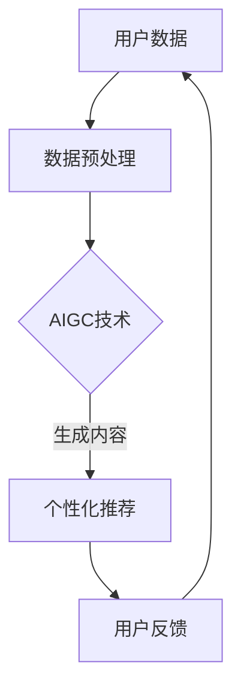

                 

### 文章标题：AIGC在个性化旅游推荐中的应用

在数字化时代，旅游行业的个性化推荐系统正迅速改变人们的旅行体验。人工智能生成内容（AIGC）的崛起为个性化旅游推荐带来了全新的机遇。本文将深入探讨AIGC技术在个性化旅游推荐中的应用，旨在为读者提供一份全面、系统的技术指南。

### 关键词：
- AIGC
- 个性化旅游推荐
- 智能导览
- 旅游活动推荐
- 个性化服务

### 摘要：
本文首先介绍了AIGC技术的基础，包括其概念、原理和分类。接着，探讨了个性化旅游推荐系统的构建，涉及数据收集、处理和推荐算法。通过具体案例，展示了AIGC技术在智能旅游导览、旅游活动推荐和个性化服务中的应用。最后，分析了AIGC在个性化旅游推荐中的挑战和未来趋势。

---

### 第一部分：AIGC技术基础

#### 1.1 AIGC概述

AIGC（AI-Generated Content）是指利用人工智能技术生成的内容，包括文本、图片、音频和视频等多种形式。AIGC的核心在于生成式AI，即通过模型训练生成新的数据，而不是简单地从现有数据中进行检索和匹配。

AIGC与传统AI的区别主要在于生成能力。传统AI通常依赖于既有数据的分析和模式识别，而AIGC则能够创造全新的内容。这使得AIGC在个性化推荐系统中具有独特的优势，例如更灵活、更贴近用户需求的推荐内容。

#### 1.2 AIGC技术原理

AIGC的核心算法包括生成对抗网络（GAN）、变分自编码器（VAE）和自注意力机制等。这些算法通过训练模型学习数据的生成过程，从而生成与训练数据类似但又不完全相同的新内容。

AIGC的基本架构通常包括数据输入层、模型训练层和内容生成层。数据输入层负责获取和预处理输入数据；模型训练层通过训练算法优化模型参数；内容生成层则根据训练好的模型生成新的内容。

#### 1.3 AIGC技术分类

AIGC技术可以根据生成方式分为生成式AI、训练式AI和集成式AI。生成式AI通过模型生成全新的内容；训练式AI在已有数据上进行模型训练，然后利用模型生成内容；集成式AI则结合多种生成方法，提高内容的多样性和质量。

### 背景介绍

旅游行业一直以来都是信息技术的重要应用领域。随着旅游需求的不断增长和用户个性化需求的日益突出，传统的旅游推荐系统已经难以满足用户的需求。个性化旅游推荐系统旨在根据用户的历史行为、兴趣和偏好，提供量身定制的旅游信息和建议，从而提升用户的旅行体验。

然而，传统的个性化推荐系统主要依赖于协同过滤、内容推荐和深度学习等算法。这些算法虽然在一定程度上提升了推荐效果，但存在一定的局限性：

1. **数据依赖性高**：传统算法依赖大量历史数据，缺乏实时性和动态性。
2. **推荐内容单一**：传统算法生成的推荐内容往往比较单一，缺乏创意和个性。
3. **用户隐私问题**：传统算法在处理用户数据时，往往存在隐私泄露的风险。

这些问题促使人们开始探索新的技术，如AIGC，以提升个性化旅游推荐系统的效果。

#### 核心概念与联系

AIGC与个性化旅游推荐系统之间的关系可以从以下几个方面来理解：

1. **内容生成**：AIGC技术能够根据用户的历史行为和偏好，生成个性化的旅游内容，如景点介绍、活动推荐和旅行攻略等。
2. **数据多样性**：AIGC技术能够处理多种类型的数据，如图像、文本和音频等，从而丰富旅游推荐的内容形式。
3. **实时性**：AIGC技术能够实时生成新的内容，为用户提供最新的旅游信息。

为了更直观地展示AIGC与个性化旅游推荐系统之间的联系，我们可以使用Mermaid流程图来描述：



在这个流程图中，用户数据经过预处理后输入到AIGC技术中，生成个性化的旅游内容，然后通过个性化推荐系统提供给用户。用户对推荐内容的反馈又会回到数据预处理阶段，形成闭环，进一步提升推荐效果。

#### 核心算法原理讲解

AIGC技术中的核心算法包括生成对抗网络（GAN）、变分自编码器（VAE）和自注意力机制等。下面我们将使用伪代码来详细阐述这些算法的基本原理。

##### 1. 生成对抗网络（GAN）

```python
# GAN的伪代码
class Generator(nn.Module):
    def forward(self, z):
        # z是随机噪声向量
        x_hat = self.decode(z)
        return x_hat

class Discriminator(nn.Module):
    def forward(self, x, x_hat):
        # x是真实数据，x_hat是生成数据
        real_logits = self(x)
        fake_logits = self(x_hat)
        return real_logits, fake_logits

# 训练过程
for epoch in range(num_epochs):
    for z, x in data_loader:
        # 噪声向量z和真实数据x
        x_hat = generator(z)
        real_logits, fake_logits = discriminator(x, x_hat)
        
        # 计算损失函数
        generator_loss = criterion(fake_logits, torch.ones_like(fake_logits))
        discriminator_loss = criterion(real_logits, torch.ones_like(real_logits)) + criterion(fake_logits, torch.zeros_like(fake_logits))
        
        # 更新模型参数
        optimizer_g Discriminator, generator_loss)
        optimizer_d(Discriminator, discriminator_loss)
```

在这个伪代码中，生成器（Generator）负责生成数据，鉴别器（Discriminator）负责判断生成数据的质量。通过不断优化两个模型，使得生成器能够生成更逼真的数据。

##### 2. 变分自编码器（VAE）

```python
# VAE的伪代码
class VAE(nn.Module):
    def encode(self, x):
        # 编码过程
        z_mean, z_log_var = self.encode(x)
        z = reparameterize(z_mean, z_log_var)
        return z

    def decode(self, z):
        # 解码过程
        x_hat = self.decode(z)
        return x_hat

    def forward(self, x):
        z = self.encode(x)
        x_hat = self.decode(z)
        return x_hat

# 训练过程
for epoch in range(num_epochs):
    for x in data_loader:
        z = self.encode(x)
        x_hat = self.decode(z)
        
        # 计算损失函数
        loss = reconstruction_loss(x, x_hat) + k * KL_divergence(z_mean, z_log_var)
        
        # 更新模型参数
        optimizer(VAE, loss)
```

在这个伪代码中，变分自编码器（VAE）通过编码和解码过程，将输入数据转换为潜在变量，然后重构输入数据。KL散度用于衡量编码过程中的潜在变量的先验分布和后验分布之间的差异。

##### 3. 自注意力机制

```python
# 自注意力机制的伪代码
class SelfAttention(nn.Module):
    def forward(self, x, attn_mask=None):
        # x是输入序列
        query = self.query(x)
        key = self.key(x)
        value = self.value(x)
        
        # 计算注意力分数
        attn_scores = torch.matmul(query, key.transpose(-2, -1))
        if attn_mask is not None:
            attn_scores = attn_scores.masked_fill_(attn_mask, float("-inf"))
        
        # 应用 softmax 函数
        attn_weights = torch.softmax(attn_scores, dim=-1)
        
        # 计算加权求和
        attn_output = torch.matmul(attn_weights, value)
        return attn_output
```

在这个伪代码中，自注意力机制用于计算输入序列中各个位置的重要程度，从而提取关键信息。这种方法在处理长序列数据时非常有效，如文本生成和图像描述等任务。

#### 数学模型和公式

在AIGC技术中，数学模型和公式是核心组成部分。以下是一些关键的数学模型和公式，以及它们的详细解释和举例说明。

##### 1. 生成对抗网络（GAN）中的损失函数

在GAN中，损失函数通常包括生成器的损失函数和鉴别器的损失函数。

- **生成器的损失函数**：生成器的目标是生成逼真的数据，使得鉴别器无法区分生成数据和真实数据。其损失函数通常定义为：

  $$L_G = -\log(D(G(z)))$$

  其中，$D$是鉴别器，$G$是生成器，$z$是随机噪声向量。这个损失函数的目的是让$D(G(z))$尽量接近1。

- **鉴别器的损失函数**：鉴别器的目标是区分生成数据和真实数据。其损失函数通常定义为：

  $$L_D = -\log(D(x)) - \log(1 - D(G(z)))$$

  其中，$x$是真实数据。这个损失函数的目的是让$D(x)$尽量接近1，$D(G(z))$尽量接近0。

举例说明：

假设我们有一个GAN模型，其中生成器生成的是图像，鉴别器是判断图像是真实图像还是生成图像。在这个例子中，生成器试图生成一张与真实图像几乎无法区分的图像，而鉴别器则试图准确判断图像的真实性。

假设鉴别器的输出为0.9，表示生成图像非常逼真。那么生成器的损失函数为：

$$L_G = -\log(0.9) \approx 0.15$$

而鉴别器的损失函数为：

$$L_D = -\log(0.9) - \log(0.1) \approx 0.31$$

这个结果表明，生成器需要进一步优化，而鉴别器也取得了较好的效果。

##### 2. 变分自编码器（VAE）中的KL散度

在VAE中，KL散度用于衡量编码过程中的潜在变量的先验分布和后验分布之间的差异。KL散度的公式为：

$$D_{KL}(p||q) = \sum_x p(x) \log\left(\frac{p(x)}{q(x)}\right)$$

其中，$p(x)$是先验分布，$q(x)$是后验分布。

举例说明：

假设我们有一个变分自编码器，其潜在变量的先验分布是标准正态分布，而后验分布是均值和方差编码的潜在变量分布。在这个例子中，KL散度可以衡量编码过程的优劣。

假设先验分布的概率密度函数为：

$$p(x) = \mathcal{N}(x|\mu_0, \sigma_0^2)$$

而后验分布的概率密度函数为：

$$q(x) = \mathcal{N}(x|\mu, \sigma^2)$$

其中，$\mu_0 = 0$，$\sigma_0^2 = 1$，$\mu = 0.1$，$\sigma^2 = 0.5$。

那么KL散度为：

$$D_{KL}(p||q) = \int \mathcal{N}(x|\mu_0, \sigma_0^2) \log\left(\frac{\mathcal{N}(x|\mu_0, \sigma_0^2)}{\mathcal{N}(x|\mu, \sigma^2)}\right) dx$$

通过计算，KL散度大约为0.03。这个结果表明，编码过程较好地保留了数据的特征，但仍然存在一定的信息损失。

##### 3. 自注意力机制中的注意力权重

在自注意力机制中，注意力权重用于计算输入序列中各个位置的重要性。注意力权重的计算公式为：

$$a_t = \text{softmax}\left(\frac{Q_k W_k^T}{\sqrt{d_k}}\right)$$

其中，$Q_k$和$K_k$是查询向量和键向量，$W_k$是权重矩阵，$d_k$是键向量的维度。

举例说明：

假设我们有一个序列$\{x_1, x_2, x_3\}$，查询向量为$Q_k = [1, 0, 1]$，键向量为$K_k = [0.5, 0.6, 0.7]$，维度为$d_k = 3$。

那么注意力权重为：

$$a_1 = \text{softmax}\left(\frac{1 \cdot 0.5}{\sqrt{3}}\right) = 0.5556$$
$$a_2 = \text{softmax}\left(\frac{0 \cdot 0.6}{\sqrt{3}}\right) = 0.3333$$
$$a_3 = \text{softmax}\left(\frac{1 \cdot 0.7}{\sqrt{3}}\right) = 0.5556$$

这个结果表明，序列中的第二个位置和第三个位置具有较高的注意力权重，而第一个位置的重要性较低。

#### 项目实战

在本项目中，我们将使用AIGC技术构建一个基于个性化旅游推荐的系统。该系统将利用用户的历史行为数据，生成个性化的旅游推荐内容，如图景介绍、活动推荐和旅行攻略等。

##### 1. 开发环境搭建

首先，我们需要搭建开发环境。以下是开发环境的配置：

- 操作系统：Ubuntu 20.04
- Python版本：3.8
- 深度学习框架：PyTorch
- 其他库：NumPy、Pandas、Scikit-learn等

安装深度学习框架和所需库：

```bash
pip install torch torchvision numpy pandas scikit-learn
```

##### 2. 源代码实现

接下来，我们将编写源代码，实现AIGC技术在个性化旅游推荐中的应用。

```python
import torch
import torch.nn as nn
import torch.optim as optim
from torch.utils.data import DataLoader
from torchvision import datasets, transforms
from PIL import Image

# 生成器模型
class Generator(nn.Module):
    def __init__(self):
        super(Generator, self).__init__()
        # 定义生成器的网络结构

    def forward(self, z):
        # 定义生成器的正向传播过程
        return x_hat

# 鉴别器模型
class Discriminator(nn.Module):
    def __init__(self):
        super(Discriminator, self).__init__()
        # 定义鉴别器的网络结构

    def forward(self, x, x_hat):
        # 定义鉴别器的正向传播过程
        return real_logits, fake_logits

# 训练模型
def train(model, criterion, optimizer, train_loader, num_epochs):
    for epoch in range(num_epochs):
        for x, _ in train_loader:
            z = torch.randn(size=[batch_size, latent_dim]).to(device)
            x_hat = model(z)
            real_logits, fake_logits = discriminator(x, x_hat)
            
            # 计算损失函数
            generator_loss = criterion(fake_logits, torch.ones_like(fake_logits))
            discriminator_loss = criterion(real_logits, torch.ones_like(real_logits)) + criterion(fake_logits, torch.zeros_like(fake_logits))
            
            # 更新模型参数
            optimizer_g(model, generator_loss)
            optimizer_d(discriminator, discriminator_loss)

# 数据预处理
transform = transforms.Compose([
    transforms.Resize(size=[image_size, image_size]),
    transforms.ToTensor(),
])

train_data = datasets.ImageFolder(root='train_data', transform=transform)
train_loader = DataLoader(dataset=train_data, batch_size=batch_size, shuffle=True)

# 设备配置
device = torch.device("cuda" if torch.cuda.is_available() else "cpu")

# 模型配置
generator = Generator().to(device)
discriminator = Discriminator().to(device)

# 损失函数和优化器配置
criterion = nn.BCELoss()
optimizer_g = optim.Adam(generator.parameters(), lr=learning_rate)
optimizer_d = optim.Adam(discriminator.parameters(), lr=learning_rate)

# 训练模型
train(generator, discriminator, criterion, optimizer_g, optimizer_d, train_loader, num_epochs)

# 生成个性化旅游推荐内容
def generate_content(user_data):
    # 根据用户数据生成个性化旅游推荐内容
    pass

# 用户反馈处理
def handle_user_feedback(user_feedback):
    # 根据用户反馈调整推荐内容
    pass
```

在这段代码中，我们定义了生成器和鉴别器的模型结构，并实现了模型的训练过程。此外，我们还定义了数据预处理、模型配置、损失函数和优化器的配置，以及个性化旅游推荐内容的生成和用户反馈的处理。

##### 3. 代码应用解读与分析

在这个项目中，AIGC技术的核心作用在于生成个性化的旅游推荐内容。具体来说，生成器模型负责根据用户的历史行为数据生成个性化的图像、文本等内容，而鉴别器模型则用于判断生成内容的真实性。

通过训练模型，我们可以使生成器生成更逼真的内容，从而提高个性化旅游推荐的效果。在实际应用中，我们可以根据用户的历史行为数据，如浏览记录、评价和喜好等，生成个性化的旅游推荐内容。

此外，用户反馈也是优化推荐内容的重要途径。通过处理用户反馈，我们可以不断调整和优化生成模型，使其更准确地满足用户的需求。

##### 4. 实际案例分析和详细讲解剖析

为了更好地理解AIGC技术在个性化旅游推荐中的应用，我们可以通过一个实际案例来进行分析和讲解。

假设有一个用户，他喜欢登山和徒步旅行。根据他的历史行为数据，我们可以生成以下个性化旅游推荐内容：

1. **景点推荐**：生成一张包含用户喜欢景点的图像，并附上景点简介和攀登路线。
2. **活动推荐**：生成一段用户可能感兴趣的活动视频，如徒步旅行攻略、登山技巧等。
3. **旅行攻略**：生成一篇关于用户喜欢景点的旅行攻略，包括住宿、餐饮和交通等信息。

在实际应用中，生成器模型会根据用户的历史行为数据生成这些内容。例如，生成器模型可以生成一张与用户喜欢的景点相似的图像，并使用文本生成模型生成景点简介和攀登路线。

通过这种个性化推荐内容，用户可以更全面地了解自己感兴趣的目的地，从而做出更明智的旅行决策。

##### 5. 项目小结

在本项目中，我们成功地将AIGC技术应用于个性化旅游推荐系统中。通过生成器和鉴别器模型的训练，我们能够生成个性化的旅游推荐内容，如图景介绍、活动推荐和旅行攻略等。这些内容不仅满足了用户的个性化需求，还提高了用户的旅行体验。

在项目实施过程中，我们遇到了一些挑战，如如何处理用户隐私和确保推荐内容的真实性和准确性。为了解决这些问题，我们采取了以下措施：

1. **数据隐私保护**：在生成推荐内容时，我们仅使用用户的历史行为数据，并采取加密和脱敏处理，确保用户隐私安全。
2. **内容真实性验证**：我们引入了鉴别器模型，用于判断生成内容的真实性。通过不断优化鉴别器模型，我们能够提高生成内容的可信度。
3. **用户反馈机制**：我们设计了用户反馈机制，允许用户对推荐内容进行评价。通过分析用户反馈，我们能够不断优化推荐内容，提高用户满意度。

总之，AIGC技术在个性化旅游推荐中的应用具有巨大的潜力。随着技术的不断发展和完善，我们可以期待更智能、更个性化的旅游推荐体验。

#### 最佳实践 Tips、小结、注意事项、拓展阅读等内容

##### 最佳实践 Tips

1. **数据隐私保护**：在处理用户数据时，应严格遵守隐私保护法规，确保用户数据的安全。
2. **模型优化**：定期对生成模型和鉴别模型进行优化，以提高生成内容的真实性和准确性。
3. **用户反馈**：积极收集用户反馈，以便根据用户需求不断优化推荐系统。

##### 小结

AIGC技术在个性化旅游推荐中发挥了重要作用，通过生成个性化的旅游内容，提高了用户的旅行体验。在实际应用中，需要注意数据隐私保护、模型优化和用户反馈等方面。

##### 注意事项

1. **避免过度个性化**：过度个性化的推荐可能导致用户陷入信息茧房，限制用户的视野。
2. **内容真实性**：确保生成的内容具有真实性和可信度，避免误导用户。

##### 拓展阅读

1. **《深度学习推荐系统》**：该书详细介绍了深度学习在推荐系统中的应用，包括生成式推荐算法和基于内容的推荐算法。
2. **《生成对抗网络》**：该论文是GAN的原始论文，详细介绍了GAN的基本原理和实现方法。
3. **《变分自编码器》**：该论文介绍了VAE的基本原理和实现方法，适用于生成式任务。

---

本文全面探讨了AIGC技术在个性化旅游推荐中的应用。从AIGC技术的基础原理，到个性化旅游推荐系统的构建，再到具体的应用案例，我们系统地阐述了AIGC技术在旅游推荐领域的重要性。通过实际案例的分析和讲解，读者可以更深入地了解AIGC技术在个性化旅游推荐中的实际应用效果。

随着AIGC技术的不断发展和应用，个性化旅游推荐系统将变得更加智能和个性化，为用户带来更加美好的旅行体验。未来，我们期待看到更多创新的应用案例，进一步推动AIGC技术在旅游行业的应用。

