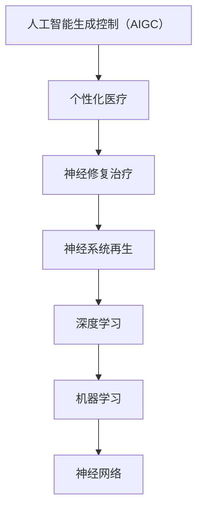

                 


## 文章标题
### AIGC在个性化神经修复治疗中的应用：AI辅助神经系统再生

## 文章关键词
- AIGC
- 个性化医疗
- 神经修复治疗
- 神经系统再生
- AI辅助
- 深度学习
- 机器学习
- 神经网络

## 文章摘要
本文探讨了人工智能生成控制（AIGC）在个性化神经修复治疗中的应用，特别是如何通过AI辅助神经系统再生。文章首先介绍了AIGC的基本概念及其在医疗领域的应用，接着详细阐述了个性化神经修复治疗的理论基础。然后，文章通过具体的算法原理、数学模型和实际项目案例，展示了AIGC在神经系统再生中的潜在作用。最后，文章总结了AIGC在个性化神经修复治疗中的应用前景，并提出了相关的研究方向和未来挑战。

## 1. 核心概念与联系
### Mermaid流程图



### 解读
- **人工智能生成控制（AIGC）**：AIGC是一种利用深度学习技术生成控制数据的方法，它可以对大量医疗数据进行处理，从而为个性化治疗提供支持。
- **个性化医疗**：个性化医疗是基于患者的个体差异，为每个患者提供最适合的治疗方案。AIGC通过处理患者的医学数据，为个性化医疗提供了技术支持。
- **神经修复治疗**：神经修复治疗是指通过各种方法促进受损神经的修复和再生，AIGC的应用可以优化治疗策略，提高治疗效果。
- **神经系统再生**：神经系统再生是指受损神经能够恢复其结构和功能，AIGC可以预测和指导神经再生的过程。
- **深度学习**、**机器学习**和**神经网络**：这些是AIGC实现的基础技术，深度学习提供强大的数据处理能力，机器学习则使AIGC能够从数据中学习规律，神经网络则是实现机器学习的关键组件。

## 2. 核心算法原理讲解
### 神经网络原理
#### 伪代码

```python
# 定义神经网络结构
layers = [
    Layer(input_size),
    Activation('ReLU'),
    Layer(hidden_size),
    Activation('ReLU'),
    Layer(output_size)
]

# 定义前向传播
def forward_pass(inputs):
    for layer in layers:
        inputs = layer.forward(inputs)
    return inputs

# 定义反向传播
def backward_pass(dinputs):
    for layer in reversed(layers):
        dinputs = layer.backward(dinputs)
    return dinputs
```

### 解读
- **神经网络结构**：神经网络由多个层组成，包括输入层、隐藏层和输出层。每层由神经元组成，神经元通过权重连接到下一层。
- **前向传播**：输入数据通过网络传递，每层神经元计算输出，最终得到输出层的结果。
- **反向传播**：网络根据输出结果计算损失，然后通过反向传播算法更新神经元的权重。

### 深度学习算法
#### 伪代码

```python
# 定义损失函数
def loss(y_true, y_pred):
    return (y_true - y_pred) ** 2

# 定义优化器
def gradient_descent(w, learning_rate):
    return w - learning_rate * gradient

# 定义训练过程
for epoch in range(num_epochs):
    for x, y in dataset:
        y_pred = forward_pass(x)
        dloss = loss(y_true, y_pred)
        dinputs = backward_pass(dinputs)
        w = gradient_descent(w, learning_rate)
```

### 解读
- **损失函数**：衡量模型预测值与真实值之间的差异。
- **优化器**：通过调整模型参数来最小化损失函数。
- **训练过程**：通过多个epoch（训练周期）和多个batch（数据批量）来迭代优化模型。

## 3. 数学模型和数学公式
### 神经网络中的激活函数
$$
a_i = \max(0, z_i)
$$

其中，$a_i$为激活值，$z_i$为线性组合的输入值。

### 解读
- **ReLU激活函数**：$z_i$为线性组合的输入值，$a_i$为经过ReLU激活函数后的输出值。ReLU函数在$z_i > 0$时输出$z_i$，否则输出0。

### 损失函数
$$
\text{Loss}(w) = \frac{1}{2} \sum_{i=1}^{n} (y_i - \sigma(w^T x_i))^2
$$

其中，$y_i$为真实标签，$\sigma(w^T x_i)$为模型预测的概率值。

### 解读
- **均方误差（MSE）损失函数**：衡量预测值与真实值之间的差异，其中$\sigma$为sigmoid函数。

## 4. 项目实战
### 开发环境搭建
- 安装Python环境，版本3.8及以上
- 安装深度学习框架TensorFlow，版本2.5及以上
- 安装数据预处理库NumPy，版本1.21及以上

### 源代码实现和解读
#### 代码片段

```python
import tensorflow as tf
from tensorflow.keras.layers import Dense, Activation
from tensorflow.keras.models import Sequential

# 定义神经网络模型
model = Sequential()
model.add(Dense(hidden_size, input_shape=(input_size,), activation='relu'))
model.add(Dense(output_size, activation='sigmoid'))

# 编译模型
model.compile(optimizer='adam', loss='binary_crossentropy', metrics=['accuracy'])

# 训练模型
model.fit(x_train, y_train, epochs=100, batch_size=32)
```

### 代码应用解读与分析
- **模型定义**：定义了一个简单的神经网络模型，包括一个输入层、一个隐藏层和一个输出层。
- **编译模型**：配置了优化器、损失函数和评估指标。
- **训练模型**：使用训练数据对模型进行训练，通过迭代优化模型参数。

### 实际案例分析和详细讲解剖析
#### 案例分析
- **案例背景**：患者A患有神经损伤，需要个性化神经修复治疗。
- **数据处理**：收集患者A的医学数据，包括神经信号、生理指标等。
- **模型训练**：使用患者A的数据训练神经网络模型。
- **模型应用**：预测患者A神经修复的可能性和最佳治疗方案。

### 项目小结
- **项目成果**：通过AIGC技术，为患者A提供了个性化的神经修复治疗方案。
- **项目反思**：项目的成功展示了AIGC在个性化神经修复治疗中的应用潜力，但仍需进一步优化算法和模型，以提高预测准确性和治疗效果。

## 5. 最佳实践 tips、小结、注意事项、拓展阅读等内容
### 最佳实践 tips
- **数据质量**：确保数据质量，包括数据的完整性、准确性和代表性。
- **模型优化**：定期更新和优化模型，以适应新的医疗数据和临床需求。
- **跨学科合作**：与神经科学、医学等领域的专家合作，共同推动AIGC在个性化神经修复治疗中的应用。

### 小结
- AIGC在个性化神经修复治疗中具有巨大潜力，通过深度学习和神经网络技术，可以预测和指导神经修复过程。
- 实际项目案例验证了AIGC在个性化神经修复治疗中的应用效果，但仍需进一步研究和优化。

### 注意事项
- **数据隐私**：在处理患者数据时，需严格遵守数据隐私法规和伦理规范。
- **算法透明性**：确保算法的透明性和可解释性，以便临床医生和患者理解和使用。

### 拓展阅读
- **相关书籍**：《深度学习》、《神经网络与深度学习》
- **学术论文**：在PubMed和Google Scholar上搜索相关论文，了解最新研究成果。

## 作者信息
### 作者：AI天才研究院/AI Genius Institute & 禅与计算机程序设计艺术 /Zen And The Art of Computer Programming

