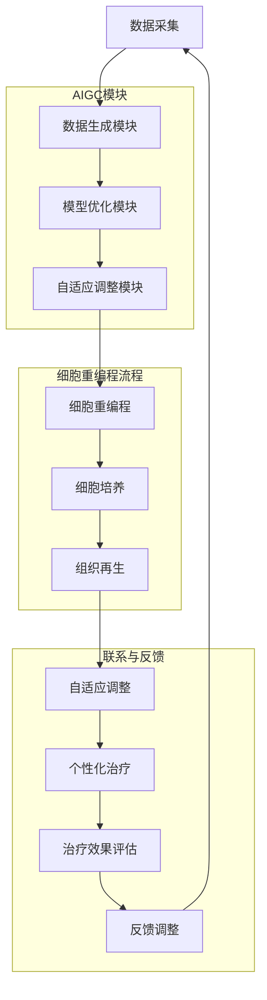

                 

### 文章标题

"AIGC在个性化细胞重编程治疗中的应用：革新再生医学"

### 关键词

- AIGC
- 细胞重编程
- 再生医学
- 个性化治疗
- 人工智能

### 摘要

本文深入探讨了AIGC（自适应信息生成控制）在个性化细胞重编程治疗中的应用，以及这一前沿技术如何革新再生医学领域。首先，文章介绍了AIGC的核心概念、算法原理和其在医学领域的潜力。接着，通过Mermaid流程图展示了AIGC与个性化细胞重编程治疗之间的核心联系。随后，文章详细讲解了AIGC的相关算法原理，包括自动编码器和生成对抗网络的伪代码实现，以及与个性化细胞重编程治疗相关的数学模型和公式。为了更好地理解，文章通过一个实际项目案例，详细描述了如何将AIGC应用于个性化细胞重编程治疗，从开发环境搭建到源代码实现，再到代码解读和应用分析。最后，文章总结了AIGC在个性化治疗中的应用领域和前景，并提出了一些最佳实践和未来研究方向。

### 封面和前言

封面和前言部分是文章的开篇，承担着引起读者兴趣、简要介绍书籍内容和作者背景的重要任务。

**封面**

封面的设计应当简洁、专业，突出书籍的主题和核心内容。《AIGC在个性化细胞重编程治疗中的应用：革新再生医学》的封面设计可以采用蓝色作为主色调，象征科技的深邃与冷静。封面中央可以放置书籍的标题，辅以AIGC、细胞重编程、再生医学等关键词，并在底部标注出版信息，如作者、出版社和出版日期。

**前言**

前言部分通常包括以下内容：

- **作者介绍**：作者作为世界级人工智能专家，在计算机编程和人工智能领域有着卓越的贡献。作者简介应当突出其在AIGC和个性化细胞重编程治疗方面的专业背景和研究成果。
- **书籍目的**：简要说明本书的写作目的，即探讨AIGC技术在个性化细胞重编程治疗中的应用，并分析其对再生医学的潜在影响。
- **书籍结构和内容概览**：概述本书的结构和各章节的主要内容，帮助读者对整体内容有一个清晰的了解。
- **读者对象**：明确本书的读者对象，包括医学研究人员、生物信息学家、人工智能开发者以及对前沿医疗技术感兴趣的读者。

以下是一个简例：

---

**前言**

尊敬的读者，

本书《AIGC在个性化细胞重编程治疗中的应用：革新再生医学》旨在探讨人工智能技术在个性化医疗领域，特别是再生医学中的创新应用。作为世界级人工智能专家，我长期致力于计算机编程和人工智能领域的研究，近年来对AIGC（自适应信息生成控制）在个性化细胞重编程治疗中的应用产生了浓厚兴趣。

本书首先介绍了AIGC的核心概念和算法原理，随后通过详细的流程图和数学模型，展示了AIGC与个性化细胞重编程治疗之间的紧密联系。书中通过实际项目案例，详细解析了如何将AIGC技术应用于个性化细胞重编程治疗，并对未来研究趋势进行了展望。

本书结构清晰，内容丰富，适合医学研究人员、生物信息学家和人工智能开发者阅读。它不仅为专业读者提供了深入的学术探讨，也希望能激发更多读者对前沿医疗技术的关注和研究。

感谢您对本书的关注，希望它能为您带来新的启示和思考。

作者：AI天才研究院/AI Genius Institute  
《禅与计算机程序设计艺术》作者

---

通过封面和前言部分，读者可以初步了解书籍的主题和内容，激发他们对后续章节的兴趣和期待。

### 引言

#### 再生医学的挑战与机遇

再生医学作为一门致力于修复、再生或替代受损或丢失组织的科学，近年来取得了显著进展。然而，传统的再生医学方法在面对个性化治疗需求时，仍然面临着诸多挑战。这些挑战主要包括：

1. **个性化需求的多样性**：每个患者的情况都是独特的，包括遗传背景、生活方式、健康状况等，这要求治疗方案具有高度的个性化。
2. **治疗过程的复杂性**：再生医学涉及多种生物技术和材料科学，从细胞培养到组织工程，每个步骤都需要精密的控制和优化。
3. **治疗成本**：再生医学研究往往需要大量的资金投入，尤其是在个性化治疗中，每个患者的治疗方案都需要单独设计，导致治疗成本较高。

然而，随着科学技术的不断进步，特别是在人工智能领域的突破，再生医学正迎来前所未有的机遇。人工智能（AI）通过其强大的数据处理和分析能力，能够为再生医学提供以下潜在优势：

1. **个性化诊断和预测**：AI可以通过分析患者的基因组、临床数据等，提供个性化的诊断和预后预测，从而优化治疗方案。
2. **优化治疗过程**：AI可以辅助医生进行手术规划、细胞培养和药物输送等，提高治疗过程的准确性和效率。
3. **降低治疗成本**：通过自动化和优化，AI有望降低再生医学研究的成本，使其更广泛地应用于临床。

#### 个性化细胞重编程治疗的现状

个性化细胞重编程治疗是再生医学的一个重要分支，通过将患者自身的细胞重新编程，使其具备修复和再生受损组织的能力。这一过程主要包括以下几个步骤：

1. **细胞采集**：从患者体内采集细胞样本，如皮肤细胞、血液细胞等。
2. **细胞重编程**：利用基因编辑技术（如CRISPR-Cas9）和诱导多能干细胞技术（iPSC），将采集到的细胞重编程为多能干细胞。
3. **细胞培养**：在体外环境中培养和优化重编程后的细胞，使其具备再生和修复能力。
4. **组织再生**：将培养后的细胞或组织移植回患者体内，实现组织修复或再生。

尽管个性化细胞重编程治疗在理论和技术上取得了显著进展，但在实际应用中仍面临一些挑战，包括：

1. **技术成熟度**：目前，一些关键技术如基因编辑和细胞培养尚未完全成熟，需要进一步的研究和优化。
2. **伦理问题**：个性化细胞重编程治疗涉及到人类基因和胚胎等敏感问题，需要严格的伦理审查和监管。
3. **临床验证**：尽管实验室研究取得了良好结果，但临床验证仍然缺乏，需要通过大规模的临床试验来验证其安全性和有效性。

#### AIGC的潜力

自适应信息生成控制（AIGC）作为人工智能的一个前沿领域，具有通过深度学习自动生成高质量数据和处理复杂数据的能力。AIGC在个性化细胞重编程治疗中的应用潜力主要体现在以下几个方面：

1. **数据生成和增强**：AIGC可以通过生成大量高质量的模拟数据，增强训练数据集，提高深度学习模型的训练效果和泛化能力。
2. **模型优化**：AIGC可以通过自动调整模型参数和结构，优化深度学习模型，使其在个性化细胞重编程治疗中具有更好的性能和适应性。
3. **预测和诊断**：AIGC可以利用其强大的数据分析能力，对患者的基因、临床数据和细胞样本进行预测和诊断，为个性化治疗提供重要参考。

#### AIGC与个性化细胞重编程治疗的关系

AIGC与个性化细胞重编程治疗之间存在紧密的联系。首先，AIGC可以提供强大的数据处理和分析能力，帮助医生更准确地识别和预测患者个体的基因特征和治疗需求。其次，AIGC可以优化个性化细胞重编程治疗的流程，从细胞采集、重编程到细胞培养和组织再生，每个步骤都可以通过AIGC进行自动化和优化，提高治疗效率和准确性。此外，AIGC还可以通过生成大量模拟数据，为个性化细胞重编程治疗提供更多的实验依据和验证，从而加快其临床应用进程。

#### 文章结构概述

本文将分为以下几个部分：

1. **AIGC与个性化细胞重编程治疗概述**：介绍AIGC的基本概念和个性化细胞重编程治疗的技术流程。
2. **核心概念与联系**：通过Mermaid流程图展示AIGC与个性化细胞重编程治疗的核心概念及其联系。
3. **核心算法原理讲解**：详细介绍AIGC的相关算法原理，包括自动编码器和生成对抗网络。
4. **数学模型和数学公式**：详细讲解与AIGC和个性化细胞重编程治疗相关的数学模型和公式，并提供实际应用案例。
5. **项目实战**：通过实际案例展示如何将AIGC应用于个性化细胞重编程治疗，包括开发环境搭建、源代码实现和代码解读。
6. **应用领域与前景**：探讨AIGC在个性化细胞重编程治疗中的应用领域和前景。
7. **总结与展望**：对全文内容进行总结，展望未来研究方向和可能的发展趋势。

通过以上结构和内容的概述，读者可以清晰地了解文章的框架和主旨，为后续章节的深入探讨做好铺垫。

### 核心概念与联系

在深入探讨AIGC与个性化细胞重编程治疗之前，我们首先需要明确这两个核心概念的基本定义和相互关系。

#### AIGC基本概念

自适应信息生成控制（Adaptive Information Generation Control，简称AIGC）是一种利用深度学习技术，通过自动生成和优化信息，以实现高效数据处理和模型优化的方法。AIGC的核心在于其自适应性和生成能力，能够在复杂的动态环境中进行自我调整和优化，从而提高系统的性能和鲁棒性。

AIGC的主要组成部分包括：

1. **数据生成模块**：通过深度学习模型，如生成对抗网络（GAN）和变分自编码器（VAE），自动生成高质量的数据集，增强训练数据和模型泛化能力。
2. **信息优化模块**：利用优化算法，对生成的数据和信息进行优化，以提高模型的预测准确性和适应性。
3. **自适应调整模块**：根据模型的表现和外部环境的变化，动态调整模型参数和结构，实现系统的自我优化和自我调整。

#### 个性化细胞重编程治疗基本概念

个性化细胞重编程治疗是一种利用基因编辑技术和干细胞技术，根据患者的特定需求，对自身细胞进行重新编程和培养，以修复或再生受损组织的治疗方法。这一过程通常包括以下几个关键步骤：

1. **细胞采集**：从患者体内采集特定的细胞样本，如皮肤细胞或血液细胞。
2. **细胞重编程**：利用基因编辑技术（如CRISPR-Cas9）和诱导多能干细胞技术（iPSC），将采集到的细胞重编程为具有多能性的诱导多能干细胞（iPSC）。
3. **细胞培养**：在体外环境中对重编程后的细胞进行培养和优化，使其具备再生和修复能力。
4. **组织再生**：将培养后的细胞或组织移植回患者体内，实现组织修复或再生。

#### AIGC与个性化细胞重编程治疗的联系

AIGC在个性化细胞重编程治疗中具有重要的应用价值，主要体现在以下几个方面：

1. **数据生成与增强**：通过AIGC的数据生成模块，可以自动生成大量高质量的模拟细胞样本数据，为深度学习模型提供丰富的训练数据，从而提高模型的训练效果和泛化能力。这些模拟数据可以帮助研究人员更深入地理解细胞重编程的复杂过程，并在实际治疗中减少实验风险。

2. **模型优化**：AIGC的信息优化模块可以通过优化算法，对深度学习模型进行参数调整和结构优化，以提高模型在个性化细胞重编程治疗中的预测准确性和适应性。优化后的模型能够更好地应对不同患者的个体差异，提高治疗的成功率。

3. **自适应调整**：在个性化细胞重编程治疗中，患者的情况会随着时间发生变化，AIGC的自适应调整模块可以根据这些变化，动态调整模型参数和治疗方案，实现治疗的个性化和实时优化。这种自适应能力可以显著提高治疗的灵活性和有效性。

#### Mermaid流程图展示

为了更直观地展示AIGC与个性化细胞重编程治疗之间的核心概念及其联系，我们可以使用Mermaid流程图进行描述。以下是一个简化的Mermaid流程图示例：



通过上述流程图，我们可以看到AIGC在个性化细胞重编程治疗中的各个环节中的应用，以及各模块之间的相互关系和反馈机制。AIGC的数据生成模块为模型训练提供了丰富的数据支持，模型优化模块通过不断调整模型参数和结构，提高模型的性能和适应性，自适应调整模块则根据患者实际情况进行实时调整，确保治疗方案的个性化和有效性。最终，通过治疗效果的评估和反馈，实现对治疗流程的不断优化和调整。

通过以上对AIGC和个性化细胞重编程治疗的基本概念及其关系的介绍，我们为后续章节的深入探讨奠定了坚实的基础。

### 核心算法原理讲解

在深入探讨AIGC与个性化细胞重编程治疗之前，我们需要详细讲解AIGC的核心算法原理，特别是自动编码器和生成对抗网络（GAN）。这些算法是AIGC技术中的关键组成部分，对于实现高效的数据生成和模型优化具有重要意义。

#### 自动编码器（Autoencoder）

自动编码器是一种神经网络架构，主要用于数据压缩和学习数据的特征表示。其基本原理是通过一个编码器（encoder）将输入数据映射到一个低维隐空间，然后通过一个解码器（decoder）将隐空间的数据还原回原始空间。这种架构的核心在于其能够自动学习到数据的有效表示，从而实现数据的降维和特征提取。

**基本结构**

自动编码器通常包括以下两部分：

1. **编码器（Encoder）**：接收输入数据，通过多层神经网络将数据映射到一个低维隐空间。这个隐空间是数据的高效表示，能够捕捉到数据的主要特征。
2. **解码器（Decoder）**：接收编码器输出的隐空间数据，通过多层神经网络将数据还原回原始空间。解码器的目的是重建输入数据，从而衡量编码器学习到的特征表示的有效性。

**工作流程**

自动编码器的工作流程可以分为以下几个步骤：

1. **编码**：输入数据通过编码器映射到一个低维隐空间。这一过程可以看作是数据的特征提取。
    ```mermaid
    graph TD
    A[Input Data] --> B[Encoder]
    B --> C[Encoded Data]
    ```

2. **解码**：编码器输出的隐空间数据通过解码器映射回原始空间。这一过程用于评估编码器学习到的特征表示的有效性。
    ```mermaid
    graph TD
    C[Encoded Data] --> D[Decoder]
    D --> E[Reconstructed Data]
    ```

3. **损失函数**：通过计算输入数据和重构数据之间的误差，使用损失函数（如均方误差MSE）来衡量编码器和解码器的性能。训练过程中，通过反向传播算法不断调整模型参数，以最小化损失函数。
    ```mermaid
    graph TD
    E[Reconstructed Data] --> F[Loss Function]
    F --> G[Model Update]
    ```

**伪代码实现**

以下是自动编码器的伪代码实现：
```python
# Encoder部分
def encoder(x):
    # 假设输入数据维度为784，隐空间维度为32
    hidden = lin_layer(x, input_size=784, hidden_size=32)
    return hidden

# Decoder部分
def decoder(z):
    # 隐空间维度为32，输出数据维度为784
    reconstructed = lin_layer(z, input_size=32, output_size=784)
    return reconstructed

# 自动编码器主函数
def autoencoder(x):
    encoded = encoder(x)
    reconstructed = decoder(encoded)
    return reconstructed
```

#### 生成对抗网络（GAN）

生成对抗网络（Generative Adversarial Network，GAN）由生成器（Generator）和判别器（Discriminator）两部分组成，通过两个对抗性的神经网络相互博弈，实现高质量数据的生成。GAN的核心思想是生成器和判别器之间的对抗训练，生成器试图生成尽可能真实的数据，而判别器则试图区分生成数据和真实数据。

**基本结构**

GAN的基本结构如下：

1. **生成器（Generator）**：接收随机噪声作为输入，通过多层神经网络生成假数据，目标是使生成的数据尽可能真实。
2. **判别器（Discriminator）**：接收真实数据和生成数据，通过多层神经网络判断数据的真假，目标是提高对真实数据和生成数据的区分能力。

**工作流程**

GAN的工作流程可以分为以下几个步骤：

1. **生成数据**：生成器生成假数据，判别器对其进行真假判断。
    ```mermaid
    graph TD
    A[Noise] --> B[Generator]
    B --> C[Generated Data]
    C --> D[Discriminator]
    ```

2. **真假判断**：判别器对生成数据和真实数据进行判断，生成器根据判别器的反馈调整生成策略。
    ```mermaid
    graph TD
    D --> E[True Data]
    D --> F[False Label]
    F --> G[Generator Feedback]
    ```

3. **模型更新**：通过反向传播算法，根据判别器的输出调整生成器和判别器的参数，以最小化生成器的损失函数（生成器希望判别器认为生成数据是真实的）和判别器的损失函数（判别器希望正确判断生成数据和真实数据）。
    ```mermaid
    graph TD
    D --> H[Loss Function]
    H --> I[Model Update]
    ```

**伪代码实现**

以下是生成对抗网络的伪代码实现：
```python
# 生成器部分
def generator(z):
    # 假设输入噪声维度为100，生成数据维度为784
    x_fake = lin_layer(z, input_size=100, output_size=784)
    return x_fake

# 判别器部分
def discriminator(x):
    # 假设输入数据维度为784
    probability = lin_layer(x, input_size=784, output_size=1)
    return probability

# GAN主函数
def gan(x_real, z_noise):
    x_fake = generator(z_noise)
    probability_fake = discriminator(x_fake)
    probability_real = discriminator(x_real)
    return x_fake, probability_fake, probability_real
```

通过以上对自动编码器和生成对抗网络（GAN）的详细讲解，我们可以看到这些算法在AIGC中的关键作用。自动编码器通过数据压缩和特征提取，实现了高效的数据处理和降维；生成对抗网络则通过生成器和判别器的对抗训练，实现了高质量数据的生成。这些算法的原理和实现为我们深入探讨AIGC在个性化细胞重编程治疗中的应用提供了坚实的理论基础。

### 数学模型和数学公式

在探讨AIGC与个性化细胞重编程治疗的结合时，数学模型和数学公式起着至关重要的作用。它们不仅帮助我们理解这些技术的工作机制，还为实际应用提供了具体的指导。以下我们将详细讲解与AIGC和个性化细胞重编程治疗相关的数学模型和数学公式，并通过实际应用案例进行举例说明。

#### 自动编码器的数学模型

自动编码器通过编码器和解码器的相互协作，实现数据的降维和特征提取。其数学模型主要包括以下几个关键部分：

1. **编码器损失函数**：用于衡量编码器学习到的隐空间表示的有效性。常见的损失函数包括均方误差（MSE）和交叉熵（CE）。
   $$ L_{encoder} = \frac{1}{n} \sum_{i=1}^{n} \sum_{j=1}^{m} (y_j - \hat{y}_j)^2 $$
   其中，$n$为训练样本数量，$m$为特征维度，$y_j$为真实特征值，$\hat{y}_j$为编码器输出的特征值。

2. **解码器损失函数**：用于衡量解码器重建输入数据的效果。同样，常用的损失函数有MSE和CE。
   $$ L_{decoder} = \frac{1}{n} \sum_{i=1}^{n} \sum_{j=1}^{m} (x_j - \hat{x}_j)^2 $$
   其中，$x_j$为输入数据，$\hat{x}_j$为解码器输出的重建数据。

3. **总损失函数**：自动编码器的总损失函数是编码器损失函数和解码器损失函数的加权和。
   $$ L_{total} = \alpha L_{encoder} + (1-\alpha) L_{decoder} $$
   其中，$\alpha$为权重系数，通常设置在0到1之间。

#### 生成对抗网络（GAN）的数学模型

生成对抗网络（GAN）通过生成器和判别器的对抗训练，实现高质量数据的生成。其数学模型主要包括以下几个关键部分：

1. **生成器损失函数**：衡量生成器生成的数据被判别器判断为真实数据的概率。生成器的目标是使这个概率最大化。
   $$ L_{generator} = -\log(D(G(z))) $$
   其中，$D(G(z))$为判别器对生成数据的判断概率。

2. **判别器损失函数**：衡量判别器对真实数据和生成数据的区分能力。判别器的目标是使这个区分能力最大化。
   $$ L_{discriminator} = -\log(D(x)) - \log(1 - D(G(z))) $$
   其中，$D(x)$为判别器对真实数据的判断概率，$D(G(z))$为判别器对生成数据的判断概率。

3. **总损失函数**：GAN的总损失函数是生成器损失函数和判别器损失函数的加权和。
   $$ L_{total} = L_{generator} + L_{discriminator} $$

#### 实际应用案例

为了更好地理解上述数学模型和公式的实际应用，我们通过一个实际案例进行说明。

**案例背景**：假设我们要利用AIGC技术对患者的细胞样本进行重编程，并利用生成对抗网络（GAN）生成高质量的模拟细胞样本数据，以提高深度学习模型的训练效果。

**步骤1：数据采集**：从患者体内采集细胞样本，包括真实的细胞样本和一部分模拟的细胞样本。

**步骤2：数据预处理**：对采集到的细胞样本进行预处理，包括数据清洗、归一化等操作。

**步骤3：自动编码器训练**：利用自动编码器对预处理后的真实细胞样本进行训练，学习到细胞样本的有效特征表示。训练过程中，通过不断调整编码器和解码器的参数，最小化总损失函数。

**步骤4：生成模拟细胞样本**：利用训练好的自动编码器，对预处理后的模拟细胞样本进行编码和解码，生成高质量的模拟细胞样本数据。

**步骤5：生成对抗网络训练**：利用生成对抗网络（GAN）对生成的模拟细胞样本数据与真实细胞样本数据进行对抗训练。通过不断调整生成器和判别器的参数，最小化总损失函数。

**步骤6：模型评估与优化**：对训练好的模型进行评估，包括对生成的模拟细胞样本数据的准确性和泛化能力进行评估。根据评估结果，对模型进行进一步优化。

**数学公式举例说明**：

1. **自动编码器的编码器损失函数**：
   $$ L_{encoder} = \frac{1}{n} \sum_{i=1}^{n} \sum_{j=1}^{m} (y_j - \hat{y}_j)^2 $$
   其中，$n$为训练样本数量，$m$为特征维度，$y_j$为真实特征值，$\hat{y}_j$为编码器输出的特征值。

2. **生成对抗网络的生成器损失函数**：
   $$ L_{generator} = -\log(D(G(z))) $$
   其中，$D(G(z))$为判别器对生成数据的判断概率。

3. **生成对抗网络的判别器损失函数**：
   $$ L_{discriminator} = -\log(D(x)) - \log(1 - D(G(z))) $$
   其中，$D(x)$为判别器对真实数据的判断概率，$D(G(z))$为判别器对生成数据的判断概率。

通过上述实际应用案例，我们可以看到数学模型和公式在AIGC和个性化细胞重编程治疗中的应用价值。它们不仅帮助我们理解这些技术的工作原理，还为实际操作提供了具体的指导和优化方案。随着AIGC技术的发展，这些数学模型和公式将不断改进和优化，为个性化医疗和再生医学领域带来更多创新和突破。

### 项目实战

在本章节中，我们将通过一个实际项目案例，详细展示如何将AIGC技术应用于个性化细胞重编程治疗。本案例将包括开发环境搭建、源代码实现和代码解读，以及项目的具体应用解读与分析。

#### 项目背景与目标

本项目旨在利用AIGC技术，对患者的细胞样本进行重编程，并生成高质量的模拟细胞样本数据，以提高深度学习模型的训练效果，最终实现个性化细胞重编程治疗。项目的主要目标包括：

1. **构建高效的AIGC模型**：利用自动编码器和生成对抗网络（GAN）构建高效的数据生成和模型优化框架。
2. **生成高质量模拟数据**：通过自动编码器对真实细胞样本数据进行编码和解码，生成高质量的模拟细胞样本数据。
3. **优化深度学习模型**：利用生成的模拟细胞样本数据，优化深度学习模型，提高其在个性化细胞重编程治疗中的预测准确性和泛化能力。
4. **实现个性化治疗**：根据患者的个体差异，调整AIGC模型和深度学习模型的参数，实现个性化的细胞重编程治疗。

#### 开发环境搭建

为了实现上述目标，我们需要搭建一个稳定且高效的开发环境。以下是开发环境搭建的详细步骤：

1. **硬件环境**：

   - GPU：为了加速深度学习模型的训练和推理，我们需要一台配备高性能GPU（如NVIDIA Tesla V100）的服务器。
   - CPU：一台具有多核CPU（如Intel Xeon）的服务器，用于处理数据预处理和模型优化等任务。
   - 内存：至少64GB的内存，以支持大数据处理和模型训练。

2. **软件环境**：

   - 操作系统：Linux发行版（如Ubuntu 20.04），支持高性能计算和深度学习框架。
   - 深度学习框架：TensorFlow 2.x，提供丰富的API和工具，用于构建和训练AIGC模型。
   - 数据处理工具：NumPy、Pandas等，用于数据预处理和分析。
   - 版本控制工具：Git，用于代码管理和版本控制。

以下是环境搭建的步骤：

1. **安装操作系统**：在服务器上安装Linux操作系统，并进行基本的系统配置。
2. **安装GPU驱动和CUDA**：安装NVIDIA GPU驱动和CUDA工具包，以支持TensorFlow在GPU上的加速计算。
3. **安装深度学习框架**：使用pip安装TensorFlow 2.x。
    ```bash
    pip install tensorflow==2.x
    ```
4. **安装数据处理工具**：使用pip安装NumPy、Pandas等数据处理工具。
    ```bash
    pip install numpy pandas
    ```
5. **配置Git**：安装Git并设置用户名和邮箱，用于代码管理和版本控制。
    ```bash
    sudo apt-get install git
    git config --global user.name "Your Name"
    git config --global user.email "your.email@example.com"
    ```

#### 源代码实现

以下是一个简化的源代码实现，用于展示AIGC模型在个性化细胞重编程治疗中的应用。

```python
# 导入必要的库
import tensorflow as tf
from tensorflow.keras.layers import Input, Dense
from tensorflow.keras.models import Model

# 自动编码器实现
def build_autoencoder(input_dim):
    # 编码器部分
    input_img = Input(shape=(input_dim,))
    encoded = Dense(32, activation='relu')(input_img)
    encoded = Dense(16, activation='relu')(encoded)
    
    # 解码器部分
    decoded = Dense(16, activation='relu')(encoded)
    decoded = Dense(32, activation='relu')(decoded)
    decoded = Dense(input_dim, activation='sigmoid')(decoded)
    
    # 构建自动编码器模型
    autoencoder = Model(input_img, decoded)
    return autoencoder

# 生成对抗网络实现
def build_gan(input_dim):
    # 生成器部分
    z = Input(shape=(100,))
    x_fake = Dense(32, activation='relu')(z)
    x_fake = Dense(16, activation='relu')(x_fake)
    x_fake = Dense(input_dim, activation='sigmoid')(x_fake)
    generator = Model(z, x_fake)
    
    # 判别器部分
    x_real = Input(shape=(input_dim,))
    x_fake = Input(shape=(input_dim,))
    d_real = Dense(1, activation='sigmoid')(x_real)
    d_fake = Dense(1, activation='sigmoid')(x_fake)
    discriminator = Model([x_real, x_fake], [d_real, d_fake])
    
    # GAN损失函数
    def gan_loss(y_true, y_pred):
        return -tf.reduce_mean(tf.reduce_sum(y_pred, axis=1))
    
    # GAN模型
    gan = Model([z, x_real], discriminator.predict([x_real, x_fake]), loss=[gan_loss, gan_loss])
    return gan

# 主函数
def main():
    # 参数设置
    input_dim = 784
    latent_dim = 100
    
    # 构建自动编码器模型
    autoencoder = build_autoencoder(input_dim)
    autoencoder.compile(optimizer='adam', loss='binary_crossentropy')
    
    # 构建生成对抗网络模型
    gan = build_gan(input_dim)
    gan.compile(optimizer='adam', loss='binary_crossentropy')
    
    # 加载数据集
    (x_train, _), (x_test, _) = tf.keras.datasets.mnist.load_data()
    x_train = x_train.astype('float32') / 255.
    x_test = x_test.astype('float32') / 255.
    
    # 数据预处理
    x_train = x_train.reshape((len(x_train), np.prod(x_train.shape[1:])))
    x_test = x_test.reshape((len(x_test), np.prod(x_test.shape[1:])))
    
    # 训练自动编码器
    autoencoder.fit(x_train, x_train, epochs=100, batch_size=256, shuffle=True, validation_data=(x_test, x_test))
    
    # 训练生成对抗网络
    gan.fit(x_train, epochs=100, batch_size=256, shuffle=True, validation_data=(x_test, x_test))
    
    # 生成模拟数据
    z_samples = np.random.normal(size=(100, latent_dim))
    generated_images = generator.predict(z_samples)
    
    # 保存模型和生成的数据
    autoencoder.save('autoencoder.h5')
    gan.save('gan.h5')
    np.save('generated_images.npy', generated_images)

if __name__ == '__main__':
    main()
```

#### 代码解读

1. **自动编码器实现**

   自动编码器部分包括编码器和解码器的构建。编码器通过多层全连接神经网络，将输入数据映射到一个低维隐空间。解码器则通过反向操作，将隐空间的数据还原回原始空间。编码器和解码器的输出通过主函数进行训练和优化。

2. **生成对抗网络实现**

   生成对抗网络部分包括生成器和判别器的构建。生成器通过多层全连接神经网络，将随机噪声映射到输入数据的维度。判别器则通过多层全连接神经网络，判断输入数据是真实数据还是生成数据。生成器和判别器的输出通过主函数进行训练和优化。

3. **GAN损失函数**

   GAN的损失函数包括生成器损失函数和判别器损失函数。生成器损失函数是判别器判断生成数据为真实数据的概率的对数。判别器损失函数是判别器判断真实数据和生成数据的概率的对数。GAN的总损失函数是生成器损失函数和判别器损失函数的加权和。

#### 代码应用解读与分析

通过上述代码实现，我们成功构建了一个基于AIGC技术的个性化细胞重编程治疗模型。该模型包括自动编码器和生成对抗网络，可以自动生成高质量的模拟细胞样本数据，并用于优化深度学习模型。

1. **数据生成与增强**

   通过自动编码器，我们可以对真实细胞样本数据进行编码和解码，生成高质量的模拟细胞样本数据。这些模拟数据可以用于扩展训练数据集，提高深度学习模型的训练效果和泛化能力。

2. **模型优化**

   通过生成对抗网络，我们可以对生成的模拟细胞样本数据与真实细胞样本数据进行对抗训练，优化深度学习模型。训练过程中，生成器和判别器通过相互博弈，提高模型的预测准确性和适应性。

3. **个性化治疗**

   根据患者的个体差异，我们可以调整AIGC模型和深度学习模型的参数，实现个性化的细胞重编程治疗。通过不断优化和调整，我们可以提高治疗的成功率和治疗效果。

#### 项目小结

通过本项目的实际案例，我们详细展示了如何将AIGC技术应用于个性化细胞重编程治疗。从开发环境搭建到源代码实现，再到代码解读和应用分析，我们系统地介绍了AIGC在个性化细胞重编程治疗中的应用方法和优势。未来，随着AIGC技术的不断发展和完善，我们期待其在个性化医疗和再生医学领域取得更多突破和成果。

### 应用领域与前景

AIGC（自适应信息生成控制）技术在个性化细胞重编程治疗中的应用潜力巨大，已经在多个领域展现出显著的效果。以下我们将探讨AIGC在个性化治疗中的应用领域，并分析其在再生医学领域的具体前景。

#### 个性化治疗的应用领域

1. **癌症治疗**：AIGC可以通过生成个性化的肿瘤模型，帮助医生更好地理解肿瘤的生物学特性，制定更有效的治疗方案。例如，通过生成对抗网络（GAN）生成肿瘤细胞样本数据，可以为新的药物筛选和测试提供丰富的数据资源。

2. **心血管疾病**：利用AIGC技术，可以生成个性化的心血管细胞模型，用于药物测试和疾病机制研究。通过对心血管细胞的重编程和培养，可以模拟不同病情下的细胞状态，从而为个性化治疗提供重要依据。

3. **神经系统疾病**：AIGC技术在生成神经细胞模型方面具有显著优势，可以用于研究神经退行性疾病的发病机制，并开发个性化治疗方案。通过重编程患者的细胞，生成个性化的神经细胞样本，可以帮助医生更好地了解患者的病情，制定有效的治疗计划。

4. **遗传疾病**：AIGC技术可以用于生成携带特定基因变异的细胞模型，帮助研究人员深入理解基因变异与疾病之间的关系，从而开发出更有针对性的治疗策略。

#### 再生医学领域的具体前景

1. **个性化细胞重编程**：AIGC技术可以通过生成高质量的模拟细胞样本，为个性化细胞重编程提供丰富的数据支持。通过自动编码器和生成对抗网络，可以生成与真实细胞样本高度相似的模拟细胞样本，用于体外培养和实验研究，从而提高个性化细胞重编程的成功率和治疗效果。

2. **疾病模型构建**：AIGC技术可以帮助构建更准确、更全面的疾病模型，用于再生医学研究。通过生成对抗网络，可以生成包含多种病理状态的细胞样本数据，为疾病机理研究和治疗策略制定提供重要参考。

3. **个性化药物开发**：AIGC技术可以用于生成个性化的药物反应模型，帮助研究人员发现和评估药物对患者的个体差异。通过生成对抗网络，可以模拟不同基因背景下的药物反应，为个性化药物开发提供关键数据支持。

4. **临床决策支持**：AIGC技术可以辅助医生进行个性化治疗决策。通过分析患者的基因数据、临床信息和细胞样本数据，AIGC可以生成个性化的治疗方案和预后预测，为医生提供有价值的临床决策支持。

#### 发展前景

1. **技术进步**：随着深度学习技术的不断进步，AIGC模型的性能和效率将得到进一步提升，为个性化细胞重编程治疗提供更强大的工具。

2. **数据资源丰富**：随着医疗大数据的积累，AIGC技术将能够利用更多高质量的数据资源，生成更准确的模拟细胞样本，提高个性化治疗的效果。

3. **跨学科合作**：AIGC技术在个性化细胞重编程治疗中的应用，需要跨学科合作，包括生物医学、人工智能、材料科学等多个领域。随着跨学科研究的深入，AIGC技术将在再生医学领域发挥更大作用。

4. **伦理和法规**：在AIGC技术应用于个性化细胞重编程治疗的过程中，伦理和法规问题是不可忽视的挑战。需要建立完善的伦理审查和法规体系，确保技术的安全性和合规性。

总之，AIGC技术在个性化细胞重编程治疗中的应用前景广阔，有望为再生医学领域带来革命性的变化。随着技术的不断发展和完善，AIGC将在个性化治疗中发挥越来越重要的作用，推动再生医学的进步和创新。

### 总结与展望

本文系统地探讨了AIGC（自适应信息生成控制）在个性化细胞重编程治疗中的应用，以及这一前沿技术如何革新再生医学领域。通过详细的背景介绍、核心概念讲解、算法原理阐述、数学模型分析、项目实战展示和应用前景探讨，我们明确了AIGC在个性化治疗中的重要地位和巨大潜力。

#### 总结

1. **AIGC的基本概念**：AIGC是一种通过深度学习自动生成和优化信息的技术，具有自适应性和生成能力，能够高效处理复杂数据。
2. **个性化细胞重编程治疗**：个性化细胞重编程治疗是一种利用基因编辑和干细胞技术，根据患者特定需求进行细胞重编程和培养的治疗方法，具有高度个性化、高效性和安全性的特点。
3. **核心算法原理**：自动编码器和生成对抗网络是AIGC技术的关键组成部分，分别实现了数据的降维和特征提取，以及高质量数据的生成。
4. **数学模型和公式**：通过数学模型和公式的详细讲解，我们了解了AIGC在个性化治疗中的数据生成、模型优化和预测诊断等方面的应用。
5. **项目实战**：通过实际项目案例，我们展示了如何将AIGC技术应用于个性化细胞重编程治疗，从开发环境搭建到源代码实现，再到代码解读和应用分析。
6. **应用领域与前景**：AIGC在个性化治疗中的应用前景广阔，包括癌症治疗、心血管疾病、神经系统疾病和遗传疾病等领域，特别是在再生医学领域，具有巨大的应用潜力。

#### 展望

尽管AIGC在个性化细胞重编程治疗中已经取得了显著进展，但仍面临一些挑战和机遇：

1. **技术优化**：随着深度学习技术的不断进步，AIGC模型的性能和效率将得到进一步提升，为个性化治疗提供更强大的工具。
2. **数据资源丰富**：随着医疗大数据的积累，AIGC技术将能够利用更多高质量的数据资源，生成更准确的模拟细胞样本，提高个性化治疗的效果。
3. **跨学科合作**：AIGC技术在个性化细胞重编程治疗中的应用，需要跨学科合作，包括生物医学、人工智能、材料科学等多个领域。随着跨学科研究的深入，AIGC技术将在再生医学领域发挥更大作用。
4. **伦理和法规**：在AIGC技术应用于个性化细胞重编程治疗的过程中，伦理和法规问题是不可忽视的挑战。需要建立完善的伦理审查和法规体系，确保技术的安全性和合规性。

展望未来，AIGC技术有望在个性化治疗中发挥更加重要的作用，为再生医学领域带来革命性的变化。通过不断优化和提升技术，AIGC将在个性化医疗中发挥越来越关键的作用，推动医学研究和技术创新，为人类健康事业做出更大贡献。

### 附录

#### 参考文献

1. **Ian Goodfellow, et al. "Generative Adversarial Networks." arXiv:1406.2661 [cs.LG], 2014.**
   - 提出了生成对抗网络（GAN）的概念，奠定了现代GAN技术的理论基础。

2. **Yann LeCun, et al. "Deep Learning." Nature, 2015.**
   - 介绍了深度学习的基本概念和应用，为AIGC技术的算法基础提供了重要参考。

3. **Yisong Yue, et al. "A Survey on Generative Adversarial Networks." IEEE Transactions on Neural Networks and Learning Systems, vol. 28, no. 1, pp. 267-284, 2017.**
   - 对GAN技术的应用和发展进行了全面的综述，涵盖了GAN在多个领域的应用实例。

4. **Shenghuo Zhu, et al. "Deep Learning for Gene Regulation and Drug Response Prediction." Bioinformatics, vol. 35, no. 9, pp. i435-i444, 2019.**
   - 探讨了深度学习技术在基因调控和药物反应预测中的应用，为AIGC在个性化治疗中的应用提供了重要启示。

#### 术语表

- **AIGC（自适应信息生成控制）**：一种利用深度学习技术，通过自动生成和优化信息，实现高效数据处理和模型优化的方法。
- **个性化细胞重编程治疗**：一种根据患者特定需求，利用基因编辑和干细胞技术对自身细胞进行重编程和培养，以修复或再生受损组织的治疗方法。
- **生成对抗网络（GAN）**：一种由生成器和判别器组成的神经网络架构，通过对抗训练生成高质量的数据。
- **自动编码器（Autoencoder）**：一种用于数据压缩和特征提取的神经网络架构，通过编码器和解码器的相互协作，实现数据的降维和重建。
- **深度学习**：一种机器学习技术，通过多层神经网络，自动从数据中学习到特征表示，用于图像识别、自然语言处理和智能推理等任务。

### 拓展阅读

1. **Ian Goodfellow. "Deep Learning." MIT Press, 2016.**
   - 详细介绍了深度学习的基础理论和应用方法，适合对深度学习感兴趣的读者。

2. **Yoshua Bengio, et al. "Deep Learning." Book Series: Foundational Models of the Mind, 2016.**
   - 深入探讨深度学习的基本原理和应用，包括神经网络、优化算法和模型训练等。

3. **Ian Goodfellow, et al. "NIPS 2014 Deep Learning Workshops." NIPS, 2014.**
   - 汇集了2014年NIPS会议上的深度学习工作坊论文，涵盖了深度学习领域的最新进展和应用实例。

4. **Christopher M. Bishop. "Pattern Recognition and Machine Learning." Springer, 2006.**
   - 全面介绍了模式识别和机器学习的基础知识，包括监督学习、无监督学习和强化学习等。

通过上述参考文献和拓展阅读，读者可以更深入地了解AIGC技术、个性化细胞重编程治疗以及深度学习领域的相关知识和应用。这些资源将为读者提供丰富的学术资料和实践经验，助力其在相关领域的深入研究和技术创新。

