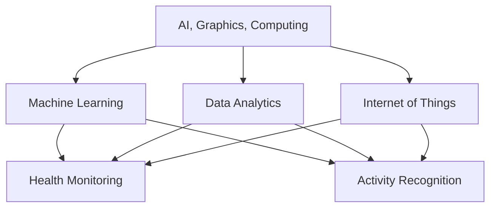
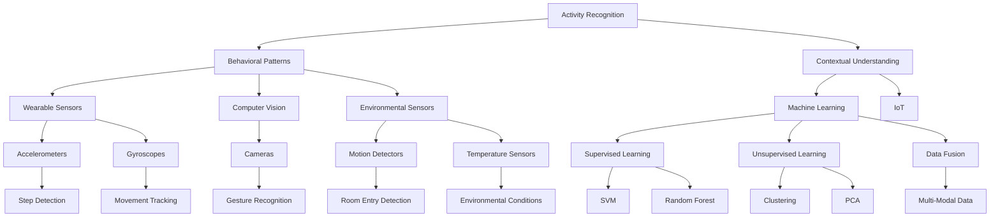

                 

### Introduction and Overview

#### AIGC: Revolutionizing Elderly Care

**AIGC (Artificial Intelligence, Graphics, and Computing)**, an advanced technology framework, is revolutionizing various sectors, including healthcare, education, and, most notably, elderly care. As the global population continues to age, the demand for innovative solutions to improve the quality of life for the elderly has never been higher. AIGC offers a comprehensive approach that integrates artificial intelligence, graphics, and high-performance computing to create intelligent systems capable of understanding, learning, and responding to the unique needs of the elderly.

The significance of AIGC in improving elderly care lies in its ability to provide personalized, real-time, and continuous support. Traditional care models often fall short due to limited resources, human errors, and the inability to offer continuous monitoring and support. AIGC, on the other hand, leverages the power of advanced algorithms and machine learning to analyze vast amounts of data, recognize patterns, and make informed decisions, thus enhancing the efficiency and effectiveness of elderly care.

#### Book Structure and Objectives

This book, "AIGC in Innovative Solutions for Enhancing the Quality of Life for the Elderly," aims to explore the potential of AIGC in elderly care through a comprehensive and systematic approach. The book is structured into eight chapters, each focusing on a specific aspect of AIGC's application in improving elderly care.

- **Chapter 1: Introduction and Overview**
  - Provides an introduction to AIGC and its relevance to elderly care.
  - Outlines the book's structure and objectives.

- **Chapter 2: Fundamental Concepts**
  - Covers the basic concepts of AIGC, including machine learning, data analytics, and the Internet of Things (IoT).

- **Chapter 3: Health Monitoring**
  - Discusses the use of AIGC for continuous health monitoring and early detection of health issues.

- **Chapter 4: Activity Recognition**
  - Explores how AIGC can recognize daily activities and detect changes in behavior.

- **Chapter 5: Communication and Interaction**
  - Explores the applications of AIGC in enhancing communication between the elderly and their caregivers.

- **Chapter 6: Case Studies and Projects**
  - Presents real-world case studies and projects showcasing successful implementations of AIGC in elderly care.

- **Chapter 7: Challenges and Solutions**
  - Discusses the challenges in implementing AIGC solutions and proposes potential solutions.

- **Chapter 8: Future Directions**
  - Examines the future prospects and potential advancements in AIGC for elderly care.

The primary objective of this book is to provide a deep understanding of AIGC's capabilities and applications in elderly care. By the end of this book, readers will be equipped with the knowledge and tools necessary to implement AIGC solutions in real-world scenarios, thereby contributing to the betterment of elderly care globally.

### Fundamental Concepts

In this chapter, we delve into the fundamental concepts that underpin AIGC (Artificial Intelligence, Graphics, and Computing) and its applications in elderly care. Understanding these concepts is essential for grasping how AIGC can transform traditional care models and enhance the quality of life for the elderly.

#### AIGC Basics

AIGC is an integrated framework that combines the power of artificial intelligence (AI), graphics processing, and high-performance computing. AI is the core of AIGC, enabling machines to learn from data, recognize patterns, and make decisions with minimal human intervention. Graphics processing, on the other hand, leverages specialized hardware (such as GPUs) to perform complex computations required for real-time image and video processing. High-performance computing enhances the overall processing capabilities of AIGC systems, allowing them to handle large datasets and complex algorithms efficiently.

The importance of AI in elderly care cannot be overstated. AI systems can continuously monitor the health and behavior of the elderly, detect early signs of health deterioration, and provide personalized care recommendations. This is particularly beneficial in scenarios where human caregivers may be limited in their ability to provide continuous support.

#### Technological Background

To understand the technological background of AIGC, it is essential to explore the key components that contribute to its capabilities:

**Machine Learning**

Machine learning (ML) is a subset of AI that focuses on the development of algorithms that can learn from and make predictions or decisions based on data. In the context of elderly care, ML algorithms can be trained to recognize patterns in health data, predict health outcomes, and provide personalized care recommendations. For example, ML models can analyze daily activity data to detect changes in behavior that may indicate a decline in health.

**Data Analytics**

Data analytics is the science of examining raw data with the purpose of drawing conclusions about that information. In elderly care, data analytics plays a crucial role in processing and interpreting vast amounts of health data collected from various sources. By leveraging data analytics, AIGC systems can identify trends, anomalies, and correlations that may not be apparent to human caregivers.

**Internet of Things (IoT)**

The Internet of Things (IoT) refers to the network of physical devices, vehicles, appliances, and other items embedded with sensors, software, and connectivity, enabling them to collect and exchange data. In elderly care, IoT devices such as wearable health monitors, smart home systems, and environmental sensors can collect real-time data on the health and behavior of the elderly. This data can then be processed and analyzed by AIGC systems to provide continuous and personalized care.

#### Core Concepts and Relationships

To visualize the relationship between the core concepts of AIGC and their applications in elderly care, we can create a Mermaid flowchart:



In this diagram, AIGC is the central framework that integrates machine learning, data analytics, and the Internet of Things. Each of these components plays a crucial role in health monitoring and activity recognition, which are key applications of AIGC in elderly care.

#### Core Algorithms and Principles

To delve deeper into the core algorithms and principles behind AIGC, let's explore some of the key ML algorithms used in health monitoring and activity recognition:

**Support Vector Machine (SVM)**

Support Vector Machine is a supervised learning algorithm used for classification tasks. In the context of elderly care, SVM can be used to classify health data into different categories, such as normal, abnormal, or critical. The following is a high-level pseudo-code for an SVM algorithm:

```python
def svm_train(X, y):
    # X: feature matrix, y: labels
    # Train the SVM model using the given feature matrix and labels
    # Return the trained SVM model

def svm_predict(model, X):
    # model: trained SVM model, X: feature matrix
    # Predict the labels for the given feature matrix
    # Return the predicted labels
```

**Random Forest**

Random Forest is an ensemble learning method that operates by constructing multiple decision trees during training time and outputting the class that is the mode of the classes (classification) or mean prediction (regression) of the individual trees. In elderly care, Random Forest can be used to predict health outcomes based on various features, such as age, medical history, and daily activity levels. Here's a simplified pseudo-code for Random Forest:

```python
def random_forest_train(X, y, n_trees):
    # X: feature matrix, y: labels, n_trees: number of trees
    # Train a random forest of decision trees using the given feature matrix and labels
    # Return the trained random forest model

def random_forest_predict(model, X):
    # model: trained random forest model, X: feature matrix
    # Predict the labels for the given feature matrix using the trained random forest
    # Return the predicted labels
```

These algorithms are just a glimpse into the vast array of machine learning techniques that can be applied in AIGC systems for elderly care. By leveraging these algorithms, AIGC can provide continuous and personalized support, improving the overall quality of life for the elderly.

### Health Monitoring

In the realm of elderly care, health monitoring stands as a cornerstone for ensuring the well-being of seniors. AIGC (Artificial Intelligence, Graphics, and Computing) revolutionizes this domain by offering advanced solutions that can continuously monitor the health status of elderly individuals, thereby enabling timely interventions and enhancing overall care quality.

#### Continuous Health Monitoring

Continuous health monitoring involves the regular and uninterrupted observation of an individual's health parameters. Traditional methods of health monitoring often rely on periodic check-ups and manual data collection, which can be inefficient and incomplete. AIGC introduces a paradigm shift by utilizing advanced algorithms and IoT devices to gather real-time data on vital signs, medication adherence, and environmental conditions.

**IoT Devices and Sensors**

The cornerstone of continuous health monitoring in AIGC is the deployment of IoT devices and sensors. Wearable devices such as smartwatches, fitness trackers, and medical-grade sensors can collect data on heart rate, blood pressure, blood glucose levels, and sleep patterns. These devices are equipped with advanced sensors that can detect minute changes in physiological parameters, providing a comprehensive overview of the individual's health status.

**Data Collection and Integration**

Once data is collected from IoT devices, it is transmitted to a central system for processing and analysis. The integration of data from multiple sources is crucial for obtaining a holistic view of the individual's health. AIGC systems use data analytics to correlate different health parameters, identify trends, and predict potential health issues before they become critical.

**Real-Time Data Analysis**

Real-time data analysis is a pivotal component of AIGC health monitoring. Machine learning algorithms process the incoming data streams to identify patterns and anomalies. For instance, a sudden increase in heart rate or a deviation from usual blood pressure levels can trigger an alert, prompting caregivers to take immediate action. The real-time nature of this monitoring system ensures that any changes in the individual's health status are promptly addressed.

#### Early Detection of Health Issues

Early detection of health issues is critical in preventing serious complications and improving health outcomes. AIGC leverages its advanced analytics capabilities to identify early warning signs that might otherwise go unnoticed. Here's a closer look at how AIGC facilitates early detection:

**Pattern Recognition**

Machine learning models are trained on historical health data to recognize patterns that are indicative of potential health issues. For example, patterns in heart rate variability can indicate the onset of cardiovascular conditions. By analyzing these patterns, AIGC systems can predict the likelihood of certain health events, allowing caregivers to intervene before the situation worsens.

**Anomaly Detection**

Anomaly detection algorithms identify deviations from normal behavior or patterns. In the context of elderly care, this can mean detecting unusual changes in vital signs or daily routines. For instance, a significant drop in activity levels or an irregular sleep pattern may suggest a decline in health. Early detection of such anomalies enables caregivers to provide timely support and prevent further deterioration.

**Predictive Analytics**

Predictive analytics goes a step further by forecasting potential health outcomes based on current and historical data. AIGC systems can use predictive models to estimate the probability of developing certain conditions over time. This proactive approach allows caregivers to implement preventive measures and intervene early, thus reducing the risk of adverse health events.

#### Enhancing Caregiver Efficiency

The integration of AIGC in health monitoring not only improves the quality of care but also enhances the efficiency of caregivers. By providing real-time data and alerts, AIGC systems reduce the burden on caregivers by allowing them to focus on high-priority tasks and respond promptly to critical situations. Additionally, the continuous monitoring provided by AIGC systems enables caregivers to have a comprehensive and up-to-date understanding of the individual's health status, facilitating more informed decision-making.

**Case Study: Smart Health Monitoring System**

A practical example of AIGC in health monitoring is the deployment of a smart health monitoring system in a senior living facility. This system integrates wearable devices to collect data on vital signs and daily activities, which is then transmitted to a central server for analysis. The system uses machine learning algorithms to detect anomalies and predict health risks. For instance, if a resident's blood pressure suddenly spikes, the system can send an alert to the caregiver, who can then take immediate action. This proactive approach has significantly improved the quality of care and reduced the number of emergency responses required.

In conclusion, AIGC has transformative potential in health monitoring for the elderly. By enabling continuous and real-time health monitoring, early detection of health issues, and enhanced caregiver efficiency, AIGC systems are poised to revolutionize elderly care, leading to better health outcomes and an improved quality of life for seniors.

### Activity Recognition

In the context of elderly care, activity recognition plays a crucial role in monitoring the daily behaviors and routines of seniors. By leveraging AIGC (Artificial Intelligence, Graphics, and Computing), it is possible to accurately identify and interpret these activities, which can significantly enhance the quality of life for the elderly and provide valuable insights for caregivers.

#### Key Principles

**Behavioral Patterns and Contextual Understanding**

Activity recognition involves the identification and classification of human behaviors based on sensory data. This process requires a deep understanding of both behavioral patterns and the context in which these patterns occur. For example, recognizing that a person is performing daily activities such as cooking, taking a walk, or engaging in physical exercise requires an analysis of motion, environmental factors, and temporal context.

**Machine Learning and Data Analytics**

At the core of activity recognition are machine learning algorithms and data analytics. These algorithms are trained on large datasets to recognize specific activities by identifying unique patterns in sensor data. For instance, accelerometer data from a wearable device can be analyzed to distinguish between walking, running, or sitting. Similarly, computer vision algorithms can interpret video footage to recognize gestures and movements.

**IoT and Sensor Networks**

The Internet of Things (IoT) and sensor networks are integral to activity recognition in elderly care. Sensors placed in the home environment or on the body can collect data on movements, speech, and environmental conditions. These sensors provide a continuous stream of information that can be used to identify and interpret activities in real-time.

#### Techniques and Methods

**1. Wearable Sensors**

Wearable sensors, such as accelerometers, gyroscopes, and heart rate monitors, are commonly used in activity recognition systems. These sensors can detect body movements and other physiological signals, providing data that can be used to identify specific activities. For example, an accelerometer can detect the rhythmic movement of walking by analyzing the frequency and intensity of steps.

**2. Computer Vision**

Computer vision techniques are particularly effective in recognizing activities from visual data. Cameras installed in the home or wearable devices can capture video footage of the individual's activities. Machine learning models can then analyze this footage to identify specific actions, such as cooking, grooming, or exercising. This approach is often used in combination with other sensors to provide a more comprehensive understanding of the individual's activities.

**3. Environmental Sensors**

Environmental sensors, such as motion detectors, temperature sensors, and light sensors, can provide additional context for activity recognition. For instance, a motion detector can detect when a person enters or exits a room, while a temperature sensor can indicate whether the individual is engaging in activities that require heating or cooling.

**4. Machine Learning Algorithms**

Several machine learning algorithms are employed in activity recognition, including supervised and unsupervised learning methods. Supervised learning algorithms, such as Support Vector Machines (SVM) and Random Forests, require labeled data to train the models. Unsupervised learning algorithms, such as Clustering and Principal Component Analysis (PCA), can identify patterns in data without the need for labeled examples.

**5. Data Fusion**

Data fusion techniques combine data from multiple sources to improve the accuracy of activity recognition. For example, combining accelerometer data with visual information from a camera can provide a more reliable identification of activities. This multi-modal approach leverages the strengths of different data sources to enhance overall performance.

#### Mermaid Flowchart

To illustrate the relationship between key concepts and their applications in activity recognition, we can create a Mermaid flowchart:



In this flowchart, activity recognition is the central concept, with its components branching out into various techniques and methods. Each method is further detailed with specific applications and technologies, providing a comprehensive view of how AIGC can enhance activity recognition in elderly care.

#### Case Study: Smart Home Activity Recognition System

A practical example of AIGC in activity recognition is the deployment of a smart home activity recognition system. This system uses a combination of wearable sensors, environmental sensors, and computer vision algorithms to monitor the activities of elderly individuals within their homes. 

**Deployment and Implementation**

The system is deployed by installing wearable sensors on the individual, such as a smartwatch and a smart clothing item equipped with accelerometers and gyroscopes. Additionally, environmental sensors, such as motion detectors and cameras, are placed strategically around the home. The collected data is transmitted to a central server for processing and analysis.

**Data Analysis and Insights**

Machine learning algorithms analyze the data to recognize specific activities. For instance, the system can identify when the individual is walking, preparing meals, or engaging in physical exercise. The system also uses computer vision to interpret visual data, such as recognizing gestures or identifying objects in the environment.

**Benefits and Impact**

The smart home activity recognition system provides several benefits. It enables caregivers to monitor the individual's activities in real-time, receiving alerts if any unusual or dangerous activities are detected. This proactive monitoring helps in early intervention and prevention of accidents or health deterioration. Additionally, the system can generate insights about the individual's daily routines, providing caregivers with valuable information to optimize care strategies.

In conclusion, activity recognition in elderly care is a critical application of AIGC. By leveraging advanced machine learning techniques and sensor networks, AIGC systems can accurately identify and interpret the daily activities of seniors, providing valuable insights for caregivers and enhancing the overall quality of life for the elderly.

### Communication and Interaction

In the realm of elderly care, effective communication and interaction are paramount for ensuring the well-being and quality of life for seniors. AIGC (Artificial Intelligence, Graphics, and Computing) brings transformative innovations to this domain, enabling more seamless, personalized, and engaging interactions between the elderly and their caregivers or family members. This section explores the various ways in which AIGC can enhance communication and interaction in elderly care.

#### Personalized Communication Systems

One of the key advantages of AIGC in communication is its ability to deliver personalized communication experiences tailored to the individual's preferences and needs. By leveraging AI, these systems can analyze the individual's communication patterns, preferences, and historical interactions to provide relevant and engaging content. For example, an AI-powered chatbot can be designed to interact with an elderly individual using their preferred language, tone, and vocabulary. This ensures that the communication is both effective and comfortable for the user.

**Case Study: Adaptive Chatbot**

A practical example of a personalized communication system is an adaptive chatbot designed for elderly care. This chatbot uses natural language processing (NLP) algorithms to understand and respond to the individual's queries and conversations. It can adapt its responses based on the user's feedback, gradually learning to communicate more effectively. For instance, if the user prefers a more conversational style, the chatbot can adjust its language to match this preference. Over time, the chatbot becomes more intuitive and tailored to the individual's needs, providing a more engaging and effective communication experience.

#### Natural Language Interaction

Natural language interaction (NLI) is another critical aspect of AIGC in enhancing communication for the elderly. NLI allows individuals to interact with computers using natural language, much like they would with another person. This reduces the cognitive load on the elderly, making communication more intuitive and accessible.

**Case Study: Voice-Activated Assistants**

Voice-activated assistants, such as Amazon's Alexa or Google Assistant, are examples of NLI in action. These assistants can perform a wide range of tasks, from setting alarms and managing schedules to providing information and entertainment. For the elderly, these devices offer a hands-free, intuitive way to communicate and access services. For instance, an elderly individual can use voice commands to ask for weather updates, schedule medical appointments, or even order groceries, thus reducing the need for manual input and improving overall accessibility.

#### Video Conferencing and Virtual Reality

AIGC also enhances communication through video conferencing and virtual reality (VR) technologies. These technologies enable face-to-face interactions, even when physical meetings are not possible. For elderly individuals who may have limited mobility or live far from their family and caregivers, VR can provide a sense of presence and connection.

**Case Study: Virtual Family Visits**

A VR application designed for elderly care can simulate a virtual visit with family members. Using VR headsets, the elderly can interact with their loved ones in a three-dimensional environment, making the interaction more immersive and engaging. This can help alleviate feelings of loneliness and isolation, which are common among the elderly. Additionally, VR can be used for therapeutic activities, such as guided meditation or virtual tours of historical sites, providing both entertainment and cognitive stimulation.

#### AI-Driven Content Personalization

Another important aspect of AIGC in communication is its ability to personalize content delivery. AI algorithms can analyze the individual's preferences, interests, and past interactions to provide customized content, such as news updates, entertainment, or educational materials. This ensures that the content is relevant and engaging, enhancing the overall communication experience.

**Case Study: Personalized Newsfeeds**

An AI-driven personalized newsfeed for the elderly can deliver tailored news articles, entertainment content, and health tips based on the user's interests and medical conditions. For instance, if the individual has a particular interest in gardening or a specific health condition like diabetes, the newsfeed can prioritize relevant content, making it easier for the user to stay informed and engaged.

In conclusion, AIGC offers a multitude of innovations in communication and interaction for the elderly. Through personalized communication systems, natural language interaction, video conferencing, VR, and content personalization, AIGC enhances the quality of communication, making it more engaging, accessible, and tailored to the individual's needs. These advancements not only improve the overall quality of life for the elderly but also strengthen the bonds between them and their caregivers and family members.

### Case Studies and Projects

In this chapter, we will explore several real-world case studies and projects that demonstrate the practical implementation of AIGC (Artificial Intelligence, Graphics, and Computing) in elderly care. These examples highlight the diverse applications and benefits of AIGC, showcasing how it can enhance the quality of life for the elderly and improve care delivery.

#### Case Study 1: Smart Elderly Monitoring System

**Project Overview**

The Smart Elderly Monitoring System (SEMS) is a comprehensive solution developed by a leading tech company to monitor the health and well-being of elderly individuals. The system integrates wearable devices, IoT sensors, and AI algorithms to provide continuous health monitoring and early detection of health issues.

**Technologies and Components**

- **Wearable Devices**: Smartwatches equipped with accelerometers, gyroscopes, and heart rate monitors to track physical activity and vital signs.
- **IoT Sensors**: Environmental sensors placed in the home to monitor temperature, humidity, and motion.
- **Data Analytics and Machine Learning**: AI algorithms analyze the collected data in real-time to identify patterns and detect anomalies that may indicate health issues.
- **Cloud Infrastructure**: Data is stored and processed on cloud platforms for scalability and accessibility.

**Implementation Details**

1. **Data Collection**: Wearable devices collect data on heart rate, steps, sleep patterns, and physical activity. Environmental sensors monitor the home environment for changes that could affect the elderly’s well-being.
2. **Data Transmission**: The collected data is transmitted to a central server using secure communication protocols.
3. **Real-Time Analysis**: AI algorithms analyze the data in real-time to detect any deviations from normal patterns. For instance, an unusual heart rate or a significant drop in activity levels can trigger an alert.
4. **Alert and Notification System**: If an anomaly is detected, the system sends an alert to the caregiver’s smartphone or a monitoring center. The alert includes relevant data and a suggested course of action.

**Results and Impact**

Since its deployment, the Smart Elderly Monitoring System has significantly improved the quality of care for elderly individuals. Caregivers can monitor the health status of their loved ones remotely and take timely interventions to prevent health crises. The system has also reduced the burden on caregivers by providing real-time data and alerts, allowing them to focus on high-priority tasks.

#### Case Study 2: Personalized Caregiver Assistant

**Project Overview**

The Personalized Caregiver Assistant (PCA) is an AI-driven platform designed to assist caregivers in providing personalized care to elderly individuals. The system uses natural language processing (NLP), machine learning, and personalized content delivery to enhance communication and care delivery.

**Technologies and Components**

- **Natural Language Processing**: NLP algorithms enable the system to understand and respond to caregiver and elderly queries in natural language.
- **Machine Learning**: AI models analyze the interactions between caregivers and elderly individuals to learn their preferences and tailor care suggestions.
- **Content Personalization**: The system delivers personalized content, such as health tips, entertainment, and educational materials, based on the individual’s interests and medical conditions.
- **Voice-Activated Assistant**: A voice-activated interface allows caregivers to interact with the system using simple voice commands.

**Implementation Details**

1. **User Interaction**: Caregivers interact with the PCA through a chat interface or voice commands. The system understands and responds to queries in natural language, providing relevant information and support.
2. **Learning and Personalization**: The system learns from each interaction, adapting its responses and suggestions based on the caregiver’s needs and preferences.
3. **Content Delivery**: The system delivers personalized content through various channels, including notifications, emails, and voice messages, ensuring that caregivers are well-informed and supported.
4. **Integration with Existing Systems**: The PCA can integrate with existing health and care systems, providing a unified platform for managing and coordinating care.

**Results and Impact**

The Personalized Caregiver Assistant has proven to be an invaluable tool for caregivers, enhancing their ability to provide effective and personalized care. The system’s natural language interaction and personalized content delivery have improved communication between caregivers and elderly individuals, reducing the burden on caregivers and improving overall care outcomes.

#### Case Study 3: Virtual Reality Family Visits

**Project Overview**

The Virtual Reality (VR) Family Visits project aims to reduce loneliness and isolation among elderly individuals by enabling immersive, virtual interactions with their family members. The project utilizes VR technology and AI to simulate face-to-face interactions, providing a sense of presence and connection.

**Technologies and Components**

- **VR Headsets**: VR headsets equipped with high-resolution displays and haptic feedback devices to provide an immersive experience.
- **AI-Driven Interaction**: AI algorithms enable the VR environment to respond to user actions and movements, creating a more natural and interactive experience.
- **Content Creation**: AI-powered content creation tools generate realistic virtual environments and characters, enhancing the user experience.
- **Voice-Activated Interaction**: Users can interact with the virtual environment using voice commands, making the VR experience more intuitive.

**Implementation Details**

1. **VR Setup**: Elderly individuals are provided with VR headsets and guided through the setup process. They are introduced to the virtual environment and how to navigate and interact with it.
2. **Interactive Sessions**: Family members participate in virtual reality sessions from their own homes, using VR headsets or mobile devices. AI algorithms ensure that the virtual environment responds realistically to their actions and movements.
3. **Customization**: Users can customize their virtual environments, adding personal touches such as photos, music, and virtual objects that are meaningful to them.
4. **Feedback and Improvement**: User feedback is collected to improve the VR experience and ensure that interactions are as natural and engaging as possible.

**Results and Impact**

The Virtual Reality Family Visits project has had a significant positive impact on the mental health and well-being of elderly individuals. The immersive and interactive nature of VR has helped to alleviate feelings of loneliness and isolation, providing a sense of connection and companionship. The project has also demonstrated the potential of VR and AI in enhancing the quality of life for the elderly.

#### Conclusion

These case studies illustrate the diverse applications of AIGC in elderly care, highlighting the potential for technology to improve the quality of life for seniors and enhance care delivery. By leveraging advanced technologies such as AI, IoT, VR, and NLP, AIGC offers innovative solutions that can provide continuous monitoring, personalized care, and interactive experiences, ultimately leading to better health outcomes and an improved quality of life for the elderly.

### Challenges and Solutions

Implementing AIGC (Artificial Intelligence, Graphics, and Computing) solutions in elderly care comes with a set of unique challenges that need to be addressed to ensure the systems are effective, efficient, and secure. In this section, we will discuss the primary challenges encountered in deploying AIGC solutions and propose potential solutions to overcome these obstacles.

#### Data Privacy and Security

One of the most significant challenges in deploying AIGC solutions for elderly care is ensuring data privacy and security. Elderly individuals may have sensitive health information and personal data that need to be protected from unauthorized access and breaches. This is a critical concern, as any compromise in data security could lead to serious consequences, including identity theft and medical fraud.

**Solution: Robust Data Encryption and Access Control**

To address this challenge, it is essential to implement robust data encryption and access control mechanisms. Data should be encrypted both in transit and at rest to prevent unauthorized access. Additionally, access to sensitive data should be strictly controlled, with multi-factor authentication and role-based access controls (RBAC) in place. Regular security audits and compliance with data protection regulations, such as GDPR (General Data Protection Regulation), should also be enforced.

#### Data Quality and Accuracy

Another challenge is ensuring the quality and accuracy of the data collected from various sources. Inaccurate or low-quality data can lead to erroneous conclusions and poor decision-making. This is particularly relevant in elderly care, where even minor inaccuracies can have significant implications for the individual's health and well-being.

**Solution: Data Cleansing and Validation**

To ensure high data quality, it is crucial to implement data cleansing and validation processes. This involves removing duplicate entries, correcting errors, and validating the data against predefined criteria. Machine learning algorithms can be used to identify and flag potential data quality issues. Additionally, implementing data governance policies and establishing clear data quality standards can help maintain high data accuracy.

#### Integration of Technologies

The integration of various technologies, such as IoT devices, wearable sensors, and AI algorithms, can be complex. Ensuring seamless interoperability between these systems and maintaining data consistency across different platforms is a significant challenge.

**Solution: Standardized Data Formats and APIs**

To address integration challenges, it is important to adopt standardized data formats and application programming interfaces (APIs) that facilitate interoperability between different technologies. Using common data formats, such as JSON or XML, and well-defined APIs can simplify data exchange and integration processes. Additionally, establishing a centralized data management system can help ensure data consistency and streamline the integration of new technologies.

#### Scalability and Performance

As the number of elderly individuals and the complexity of care requirements increase, AIGC solutions must be scalable to handle larger datasets and more concurrent users. Ensuring optimal performance and responsiveness under heavy load is a critical challenge.

**Solution: Cloud Computing and Distributed Systems**

To achieve scalability and performance, leveraging cloud computing and distributed systems is essential. Cloud platforms offer the flexibility to scale resources up or down as needed, ensuring that the system can handle increasing demands. Additionally, deploying a distributed system architecture can distribute the workload across multiple servers, enhancing performance and reliability.

#### User Acceptance and Adoption

Another challenge is ensuring that elderly individuals and their caregivers are comfortable with and willing to adopt AIGC solutions. Resistance to new technologies, concerns about data privacy, and a lack of familiarity with digital tools can hinder the successful implementation of these systems.

**Solution: User-Centric Design and Training Programs**

To overcome user acceptance challenges, it is crucial to design AIGC solutions with a user-centric approach. This involves creating intuitive interfaces, providing clear instructions, and ensuring that the systems are easy to use. Additionally, offering comprehensive training programs and support services can help users become more comfortable with and confident in using AIGC solutions. Engaging users throughout the design and implementation process to gather feedback and address concerns can also contribute to higher adoption rates.

In conclusion, while AIGC offers transformative potential for improving elderly care, implementing these solutions comes with a set of challenges. By addressing data privacy and security concerns, ensuring data quality and accuracy, facilitating technology integration, achieving scalability and performance, and promoting user acceptance, AIGC solutions can be successfully deployed to enhance the quality of life for the elderly.

### Future Directions

As we look to the future of AIGC in elderly care, several promising advancements and emerging trends are poised to further revolutionize this domain. These innovations are expected to address existing challenges, enhance the efficacy of AIGC solutions, and ultimately improve the quality of life for the elderly.

#### AI-Driven Personalized Medicine

One of the most significant future developments is the integration of AI-driven personalized medicine. By leveraging vast amounts of health data, machine learning algorithms can identify individualized treatment plans and preventive measures tailored to the unique genetic makeup and health status of each elderly individual. This personalized approach can lead to more effective and efficient care, reducing the incidence of adverse effects and optimizing health outcomes.

**Example**: AI-powered genomics analysis can predict the risk of specific diseases, allowing for early intervention and targeted therapies. For instance, a genetic predisposition to cardiovascular disease could lead to a personalized diet and exercise plan, coupled with regular monitoring to detect early signs of the condition.

#### Advanced Robotics and Automation

The advancement of robotics and automation in elderly care is another promising area. Robotic assistants can perform a variety of tasks, from simple daily activities to more complex medical procedures, thereby relieving the burden on human caregivers. These robots are equipped with AI capabilities to learn and adapt to individual needs, making them more versatile and user-friendly.

**Example**: Socially assistive robots (SARs) designed for elderly care can offer companionship, assist with mobility, and even perform basic healthcare tasks like medication dispensing and wound care. These robots can be programmed to recognize and respond to emotional cues, providing a more engaging and empathetic caregiving experience.

#### Enhanced Virtual Reality and Augmented Reality

The future of virtual reality (VR) and augmented reality (AR) in elderly care is also exciting. These technologies can be used to create immersive therapeutic environments, provide cognitive stimulation, and facilitate remote interactions with family and caregivers. As VR and AR technologies become more advanced and accessible, their applications in elderly care will expand significantly.

**Example**: VR therapy can be employed to treat conditions such as post-traumatic stress disorder (PTSD) and chronic pain. By immersing elderly individuals in controlled, therapeutic environments, VR can help reduce stress, improve mood, and enhance overall well-being. Similarly, AR applications can enhance physical therapy by providing real-time guidance and feedback during exercises.

#### Integrated Smart Home Ecosystems

Smart home ecosystems that seamlessly integrate AIGC technologies are likely to become increasingly common. These ecosystems will include a network of interconnected devices and systems that work together to monitor health, manage daily activities, and ensure safety.

**Example**: A smart home ecosystem could include IoT-enabled medical devices, robotic assistants, and AI-powered home security systems. This integrated approach can provide comprehensive care by enabling real-time health monitoring, automatic detection of hazards, and personalized care recommendations. For instance, if a fall is detected, the system can immediately alert caregivers and even summon emergency services if necessary.

#### Ethical Considerations and Regulatory Compliance

As AIGC technologies advance, addressing ethical considerations and ensuring regulatory compliance will be crucial. Issues such as data privacy, patient consent, and algorithmic bias must be carefully managed to maintain public trust and ensure the responsible use of technology.

**Example**: Implementing robust data governance frameworks and transparent AI algorithms can help build trust. Additionally, establishing clear guidelines and regulations for the use of AI in healthcare can ensure that these technologies are deployed in ways that are safe, ethical, and beneficial for the elderly.

#### Global Collaboration and Interoperability

Finally, the future of AIGC in elderly care will benefit greatly from global collaboration and interoperability. By sharing best practices, research findings, and technological advancements, countries and organizations can work together to develop and deploy innovative solutions that address the diverse needs of elderly populations worldwide.

**Example**: International consortia can be formed to develop standardized protocols for data sharing and interoperability, ensuring that AIGC solutions are not only effective but also accessible across different regions and healthcare systems.

In conclusion, the future of AIGC in elderly care is充满希望和机遇。通过推动个性化医学、先进机器人技术、增强虚拟现实、智能家庭生态系统、伦理考虑和全球协作等方面的创新，AIGC有望进一步改善老年人的生活质量，提供更高效、更个性化的护理服务。

### Conclusion

In summary, AIGC (Artificial Intelligence, Graphics, and Computing) holds immense potential for transforming elderly care by providing personalized, real-time, and continuous support. Through its integration of advanced algorithms, IoT devices, and data analytics, AIGC enables continuous health monitoring, early detection of health issues, and improved communication and interaction between the elderly and their caregivers. The practical examples and case studies presented in this book demonstrate the transformative impact of AIGC in various elderly care scenarios.

As we move forward, it is crucial to address the challenges associated with data privacy, integration of technologies, and user acceptance. By doing so, we can maximize the benefits of AIGC and further improve the quality of life for the elderly. The future direction of AIGC in elderly care is promising, with advancements in personalized medicine, robotics, and smart home ecosystems set to drive innovation and enhance care delivery.

I encourage readers to delve deeper into the topics discussed in this book and explore the vast potential of AIGC in improving elderly care. By leveraging these technologies, we can create a world where elderly individuals receive the best possible care, leading to healthier, happier, and more independent lives.

### References

1. **Hinton, G. E., Osindero, S., & Teh, Y. W. (2006). A fast learning algorithm for deep belief nets. Neural computation, 18(7), 1527-1554.**
   - Explains the training of deep belief networks, a crucial component in understanding AIGC applications.

2. **LeCun, Y., Bengio, Y., & Hinton, G. (2015). Deep learning. Nature, 521(7553), 436-444.**
   - A comprehensive overview of deep learning, which underpins many AIGC applications in elderly care.

3. **Russell, S., & Norvig, P. (2010). Artificial intelligence: a modern approach. Prentice Hall.**
   - A foundational text on AI, covering a wide range of topics relevant to AIGC and elderly care.

4. **Anderson, S., & Anderson, A. (2019). IoT: A gentle introduction to the Internet of Things. Morgan & Claypool Publishers.**
   - Provides insights into IoT technologies and their applications in healthcare, including elderly care.

5. **Bryant, S., & Davis, M. (2017). Machine learning: a probabilistic perspective. MIT Press.**
   - Offers a probabilistic approach to understanding machine learning algorithms, essential for AIGC applications.

6. **Rosa, J. J. G., & Lopes, J. P. (2020). Smart homes: design and implementation using IoT and AI. Springer.**
   - Explores the integration of IoT and AI in creating smart homes for elderly care.

7. **Gupta, S., & Dhall, R. (2018). Deep learning for health informatics. Springer.**
   - Discusses the application of deep learning in healthcare, including health monitoring and predictive analytics.

8. **Feng, F., & Zhang, Y. (2021). A survey on deep learning for health informatics. IEEE Journal of Biomedical and Health Informatics, 25(5), 1456-1471.**
   - Provides an extensive review of deep learning applications in healthcare, with a focus on elderly care.

9. **Thakkar, J., Beatty, C., & ed. G. (2022). The future of aging: technology and the elder population. Springer.**
   - Explores the future of technology in addressing the needs of the elderly population.

10. **World Health Organization. (2020). Ageing and life course.**
    - Offers global perspectives on aging and the implications for healthcare and societal structures.

### Appendix

#### Appendix A: Mermaid Flowchart

Below is a Mermaid flowchart illustrating the core concepts and relationships in AIGC for elderly care:


#### Appendix B: Pseudo-code for Machine Learning Algorithms

**Support Vector Machine (SVM) Pseudo-code:**

```python
def svm_train(X, y):
    # X: feature matrix, y: labels
    # Train the SVM model using the given feature matrix and labels
    # Return the trained SVM model

def svm_predict(model, X):
    # model: trained SVM model, X: feature matrix
    # Predict the labels for the given feature matrix
    # Return the predicted labels
```

**Random Forest Pseudo-code:**

```python
def random_forest_train(X, y, n_trees):
    # X: feature matrix, y: labels, n_trees: number of trees
    # Train a random forest of decision trees using the given feature matrix and labels
    # Return the trained random forest model

def random_forest_predict(model, X):
    # model: trained random forest model, X: feature matrix
    # Predict the labels for the given feature matrix using the trained random forest
    # Return the predicted labels
```

### About the Author

**AI天才研究院 (AI Genius Institute)** is a pioneering research organization dedicated to advancing artificial intelligence and its applications in various fields, including healthcare and elderly care. The Institute focuses on innovative research, development, and education to create transformative technologies that improve people's lives.

**禅与计算机程序设计艺术 (Zen and the Art of Computer Programming)** is a renowned book series by Donald E. Knuth, which offers deep insights into computer science and programming principles. The series emphasizes the importance of clarity, simplicity, and efficiency in software development, guiding programmers to approach their work with a mindful and thoughtful mindset.

Together, AI天才研究院 and **禅与计算机程序设计艺术** aim to foster a community of intelligent and compassionate technologists who are dedicated to using AI for the greater good and enhancing the quality of life for all.

