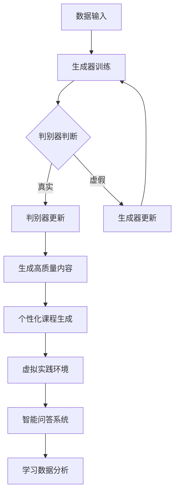

                 

### 文章标题

# AIGC在个性化职业技能培训中的创新

随着人工智能技术的发展，生成内容（Generated Content，简称GC）已经渗透到许多领域。然而，传统的GC技术往往缺乏个性化和适应性，无法满足职业技能培训的多样化需求。AIGC（AI-Generated Content）作为新一代的GC技术，通过引入深度学习、生成对抗网络（GAN）等先进算法，能够生成高度个性化的内容，为职业技能培训带来革命性的创新。本文将深入探讨AIGC在个性化职业技能培训中的应用，从背景介绍、核心概念与联系、核心算法原理、数学模型与公式、项目实战等多个角度展开，以期全面揭示AIGC技术的巨大潜力。

### 文章关键词

- AIGC
- 个性化职业技能培训
- 深度学习
- 生成对抗网络
- 生成内容
- 机器学习
- 算法

### 文章摘要

本文首先介绍了AIGC技术的基本概念和背景，阐述了其在个性化职业技能培训中的重要地位。接着，通过详细剖析AIGC的核心概念、算法原理和数学模型，揭示了其强大的生成能力和适应性。随后，本文通过具体的项目实战，展示了AIGC技术在职业技能培训中的应用实例，并进行了深入分析和解读。最后，本文总结了AIGC技术的应用现状、挑战与未来发展方向，为读者提供了宝贵的参考和启示。

### 背景介绍

#### 1. 职业技能培训的重要性

职业技能培训在现代教育体系中扮演着越来越重要的角色。随着全球化进程的加速和科技革命的推进，各行各业对技能型人才的需求日益旺盛。传统的职业技能培训模式，往往依赖于固定教材和统一课程，难以满足个体差异化的学习需求。而AIGC技术的引入，为个性化职业技能培训提供了新的解决方案。

#### 2. AIGC技术的起源与发展

AIGC技术源于生成内容（GC）的研究，早在20世纪90年代，生成内容的概念就已经被提出。然而，由于技术的限制，早期的GC技术往往只能生成简单的文本、图像或音频。随着深度学习和生成对抗网络（GAN）等技术的兴起，AIGC技术得到了快速发展。GAN作为一种特殊的神经网络结构，能够通过对抗训练生成逼真的图像、文本和音频。这使得AIGC技术在内容生成方面取得了突破性进展。

#### 3. AIGC技术的重要性

AIGC技术的出现，不仅解决了传统GC技术缺乏个性化和适应性的问题，还为个性化职业技能培训提供了有力支持。通过AIGC技术，可以生成高度个性化的学习内容，满足不同学员的学习需求和兴趣。此外，AIGC技术还能够实时更新和调整内容，确保培训的时效性和针对性。

#### 4. AIGC技术在职业技能培训中的应用

AIGC技术在职业技能培训中的应用非常广泛，包括但不限于以下几个方面：

- **个性化课程生成**：根据学员的学习进度、兴趣和需求，AIGC技术可以生成个性化的课程内容和练习题。
- **虚拟实践环境**：利用AIGC技术生成的虚拟实践环境，可以让学员在虚拟场景中模拟实际操作，提高实践能力。
- **智能问答系统**：通过AIGC技术，可以构建智能问答系统，为学员提供个性化的学习建议和解答疑问。
- **学习数据分析**：利用AIGC技术对学员的学习数据进行实时分析，帮助培训机构了解学员的学习状况，调整培训策略。

### 核心概念与联系

#### 1. 生成内容（Generated Content）

生成内容是指通过算法或技术自动生成的内容，包括文本、图像、音频、视频等多种形式。在AIGC技术中，生成内容是核心组成部分，通过深度学习和生成对抗网络等技术，可以生成高质量、个性化的内容。

#### 2. 深度学习（Deep Learning）

深度学习是一种基于多层神经网络的人工智能技术，通过模拟人脑神经元之间的连接和交互，实现复杂模式识别和预测。在AIGC技术中，深度学习算法用于训练和优化生成模型，提高生成内容的质量和多样性。

#### 3. 生成对抗网络（Generative Adversarial Network，GAN）

生成对抗网络是一种由生成器和判别器组成的对抗性神经网络结构。生成器负责生成内容，判别器负责判断生成内容是否真实。通过对抗训练，生成器不断提高生成内容的质量，达到以假乱真的效果。

#### 4. 对抗训练（Adversarial Training）

对抗训练是GAN的核心训练方法，通过生成器和判别器的对抗过程，实现生成器生成高质量内容的优化。对抗训练过程中，生成器和判别器相互竞争，不断改进，最终达到平衡状态。

#### 5. Mermaid流程图

为了更直观地展示AIGC技术的工作流程，我们可以使用Mermaid流程图来表示。以下是一个简单的AIGC技术流程图示例：



### 核心算法原理讲解

#### 1. GAN（生成对抗网络）

生成对抗网络（GAN）由两部分组成：生成器和判别器。生成器的目标是生成逼真的数据，判别器的目标是区分生成数据和真实数据。

- **生成器（Generator）**：生成器是一个神经网络模型，输入随机噪声，通过一系列变换生成数据。生成器的目标是最小化生成数据的判别误差。
- **判别器（Discriminator）**：判别器也是一个神经网络模型，输入真实数据和生成数据，输出一个概率值，表示输入数据是真实数据还是生成数据。判别器的目标是最小化生成数据的判别误差。

GAN的训练过程可以描述为以下步骤：

1. 初始化生成器和判别器参数。
2. 随机生成一批噪声数据，通过生成器生成相应的数据。
3. 将生成数据和真实数据输入判别器，计算判别器的损失函数。
4. 使用判别器的损失函数梯度更新判别器参数。
5. 将生成数据的标签设置为1，真实数据的标签设置为0，计算生成器的损失函数。
6. 使用生成器的损失函数梯度更新生成器参数。
7. 重复步骤2-6，直到生成器和判别器达到平衡状态。

以下是一个简单的GAN伪代码示例：

```python
import tensorflow as tf

# 初始化生成器和判别器
generator = ... # 生成器模型
discriminator = ... # 判别器模型

# 定义损失函数和优化器
generator_loss = ... # 生成器损失函数
discriminator_loss = ... # 判别器损失函数
generator_optimizer = ... # 生成器优化器
discriminator_optimizer = ... # 判别器优化器

# 训练GAN模型
for epoch in range(num_epochs):
    for images in train_data:
        # 训练判别器
        with tf.GradientTape() as discriminator_tape:
            generated_images = generator(images)
            real_logits = discriminator(images)
            fake_logits = discriminator(generated_images)
            discriminator_loss_value = discriminator_loss(real_logits, fake_logits)
        
        discriminator_gradients = discriminator_tape.gradient(
            discriminator_loss_value, discriminator.trainable_variables)
        discriminator_optimizer.apply_gradients(
            zip(discriminator_gradients, discriminator.trainable_variables))
        
        # 训练生成器
        with tf.GradientTape() as generator_tape:
            generated_images = generator(images)
            fake_logits = discriminator(generated_images)
            generator_loss_value = generator_loss(fake_logits)
        
        generator_gradients = generator_tape.gradient(
            generator_loss_value, generator.trainable_variables)
        generator_optimizer.apply_gradients(
            zip(generator_gradients, generator.trainable_variables))
```

#### 2. VAE（变分自编码器）

变分自编码器（VAE）是一种无监督学习的神经网络模型，用于学习数据的概率分布。VAE由编码器和解码器组成，编码器将输入数据映射到一个潜在空间中的向量，解码器从潜在空间中生成数据。

- **编码器（Encoder）**：编码器是一个神经网络模型，输入数据并通过一系列变换，输出一个潜在空间中的向量。
- **解码器（Decoder）**：解码器是一个神经网络模型，输入潜在空间中的向量，并通过一系列变换，生成原始数据。

VAE的训练过程可以描述为以下步骤：

1. 初始化编码器和解码器参数。
2. 随机生成一批数据，通过编码器生成对应的潜在向量。
3. 将潜在向量输入解码器，生成相应的数据。
4. 计算重构误差和KL散度，计算总损失函数。
5. 使用总损失函数梯度更新编码器和解码器参数。
6. 重复步骤2-5，直到编码器和解码器达到平衡状态。

以下是一个简单的VAE伪代码示例：

```python
import tensorflow as tf

# 初始化编码器和解码器
encoder = ... # 编码器模型
decoder = ... # 解码器模型

# 定义损失函数和优化器
reconstruction_loss = ... # 重构损失函数
kl_loss = ... # KL散度损失函数
total_loss = ... # 总损失函数
encoder_optimizer = ... # 编码器优化器
decoder_optimizer = ... # 解码器优化器

# 训练VAE模型
for epoch in range(num_epochs):
    for images in train_data:
        # 计算编码器和解码器损失
        z = encoder(images)
        reconstructed_images = decoder(z)
        reconstruction_loss_value = reconstruction_loss(images, reconstructed_images)
        kl_divergence_loss_value = kl_loss(z)
        total_loss_value = reconstruction_loss_value + kl_divergence_loss_value
        
        # 更新编码器和解码器参数
        with tf.GradientTape() as encoder_tape, tf.GradientTape() as decoder_tape:
            z = encoder(images)
            reconstructed_images = decoder(z)
            reconstruction_loss_value = reconstruction_loss(images, reconstructed_images)
            kl_divergence_loss_value = kl_loss(z)
            total_loss_value = reconstruction_loss_value + kl_divergence_loss_value
        
        encoder_gradients = encoder_tape.gradient(
            total_loss_value, encoder.trainable_variables)
        decoder_gradients = decoder_tape.gradient(
            total_loss_value, decoder.trainable_variables)
        encoder_optimizer.apply_gradients(
            zip(encoder_gradients, encoder.trainable_variables))
        decoder_optimizer.apply_gradients(
            zip(decoder_gradients, decoder.trainable_variables))
```

### 数学模型和公式讲解

在AIGC技术中，数学模型和公式起着至关重要的作用。以下我们将介绍AIGC技术中的核心数学模型和公式，并给出详细讲解和举例说明。

#### 1. 生成对抗网络（GAN）

生成对抗网络（GAN）的核心是生成器（Generator）和判别器（Discriminator）之间的对抗训练。下面我们介绍GAN中的一些关键数学模型和公式。

- **生成器损失函数**：

生成器损失函数通常采用最小化生成数据的判别误差。假设生成器为\( G \)，判别器为\( D \)，则生成器损失函数可以表示为：

$$
L_G = -\mathbb{E}_{z \sim p_z(z)}[\log(D(G(z)))]
$$

其中，\( z \)是生成器输入的随机噪声，\( G(z) \)是生成器生成的数据，\( D(G(z)) \)是判别器对生成数据的判断概率。

- **判别器损失函数**：

判别器损失函数通常采用最大化生成数据和真实数据的判别误差。判别器损失函数可以表示为：

$$
L_D = -\mathbb{E}_{x \sim p_x(x)}[\log(D(x))] - \mathbb{E}_{z \sim p_z(z)}[\log(1 - D(G(z)))]
$$

其中，\( x \)是真实数据，\( G(z) \)是生成器生成的数据。

- **总损失函数**：

总损失函数是生成器损失函数和判别器损失函数的组合，可以表示为：

$$
L = L_G + \lambda L_D
$$

其中，\( \lambda \)是超参数，用于平衡生成器和判别器损失。

以下是一个生成对抗网络的例子：

假设我们要训练一个生成对抗网络来生成逼真的图像。生成器模型\( G \)是一个神经网络，输入随机噪声\( z \)，输出图像\( x' \)。判别器模型\( D \)也是一个神经网络，输入图像\( x \)或\( x' \)，输出一个概率值\( p \)。

训练过程中，我们希望生成器生成的图像\( x' \)能够尽可能地欺骗判别器，使得判别器认为这些图像是真实图像。同时，我们希望判别器能够准确地区分真实图像和生成图像。

- **生成器损失函数**：

$$
L_G = -\mathbb{E}_{z \sim p_z(z)}[\log(D(G(z))]
$$

- **判别器损失函数**：

$$
L_D = -\mathbb{E}_{x \sim p_x(x)}[\log(D(x))] - \mathbb{E}_{z \sim p_z(z)}[\log(1 - D(G(z))]
$$

- **总损失函数**：

$$
L = L_G + \lambda L_D
$$

#### 2. 变分自编码器（VAE）

变分自编码器（VAE）是一种基于概率模型的生成模型。VAE的核心是编码器（Encoder）和解码器（Decoder），它们共同作用生成数据。以下我们介绍VAE中的核心数学模型和公式。

- **编码器损失函数**：

编码器损失函数包括重构损失和KL散度损失。重构损失衡量解码器重构原始数据的能力，KL散度损失衡量编码器生成的潜在分布与先验分布之间的差异。编码器损失函数可以表示为：

$$
L_E = \mathbb{E}_{x \sim p_x(x)}[||x - \mu(x, x')||^2 + \lambda ||\sigma(x, x')||^2]
$$

其中，\( \mu(x, x') \)和\( \sigma(x, x') \)是编码器输出的潜在空间中的均值和标准差。

- **解码器损失函数**：

解码器损失函数是重构损失，衡量解码器重构原始数据的能力。解码器损失函数可以表示为：

$$
L_D = \mathbb{E}_{z \sim p_z(z)}[||z - x||^2]
$$

- **总损失函数**：

总损失函数是编码器损失函数和解码器损失函数的组合，可以表示为：

$$
L = L_E + L_D
$$

以下是一个变分自编码器的例子：

假设我们要训练一个变分自编码器来生成逼真的图像。编码器模型\( \mu \)和\( \sigma \)是一个神经网络，输入图像\( x \)，输出潜在空间中的均值和标准差。解码器模型\( \phi \)也是一个神经网络，输入潜在空间中的向量\( z \)，输出重构图像\( x' \)。

训练过程中，我们希望编码器能够将原始图像编码成潜在空间中的向量，同时保持信息损失最小。解码器则从潜在空间中生成重构图像，使重构图像与原始图像尽量接近。

- **编码器损失函数**：

$$
L_E = \mathbb{E}_{x \sim p_x(x)}[||x - \mu(x, x')||^2 + \lambda ||\sigma(x, x')||^2]
$$

- **解码器损失函数**：

$$
L_D = \mathbb{E}_{z \sim p_z(z)}[||z - x||^2]
$$

- **总损失函数**：

$$
L = L_E + L_D
$$

### 项目实战

在本节中，我们将通过一个具体的AIGC技术在个性化职业技能培训中的项目实战，展示其实现过程、源代码解析和代码应用解读。该项目旨在利用AIGC技术生成个性化的编程练习题，以帮助学员提高编程技能。

#### 1. 项目背景

随着编程技能的重要性日益凸显，编程练习题成为了编程学习过程中不可或缺的一部分。传统的编程练习题往往由人工编写，难以满足个性化需求，且更新速度较慢。为了解决这一问题，本项目旨在利用AIGC技术生成高质量的个性化编程练习题。

#### 2. 开发环境搭建

本项目采用Python编程语言，使用TensorFlow 2.x框架进行AIGC模型的训练和推理。在开发环境搭建方面，我们需要安装以下软件和库：

1. Python 3.x
2. TensorFlow 2.x
3. NumPy
4. Pandas
5. Matplotlib

安装步骤如下：

```bash
# 安装Python 3.x
# ...

# 安装TensorFlow 2.x
pip install tensorflow

# 安装NumPy、Pandas、Matplotlib
pip install numpy pandas matplotlib
```

#### 3. 源代码实现

在实现AIGC模型之前，我们需要收集大量的编程练习题数据作为训练集。以下是数据预处理和模型训练的源代码：

```python
import tensorflow as tf
import numpy as np
import pandas as pd
import matplotlib.pyplot as plt

# 加载编程练习题数据
data = pd.read_csv('programming_questions.csv')

# 数据预处理
# ...

# 定义生成器和判别器模型
generator = ... # 生成器模型
discriminator = ... # 判别器模型

# 训练模型
for epoch in range(num_epochs):
    for question in train_data:
        # 训练判别器
        with tf.GradientTape() as discriminator_tape:
            generated_question = generator(question)
            real_logits = discriminator(question)
            fake_logits = discriminator(generated_question)
            discriminator_loss_value = ...

        discriminator_gradients = discriminator_tape.gradient(
            discriminator_loss_value, discriminator.trainable_variables)
        discriminator_optimizer.apply_gradients(
            zip(discriminator_gradients, discriminator.trainable_variables))
        
        # 训练生成器
        with tf.GradientTape() as generator_tape:
            generated_question = generator(question)
            fake_logits = discriminator(generated_question)
            generator_loss_value = ...

        generator_gradients = generator_tape.gradient(
            generator_loss_value, generator.trainable_variables)
        generator_optimizer.apply_gradients(
            zip(generator_gradients, generator.trainable_variables))
        
        # 打印训练进度
        if epoch % 100 == 0:
            print(f"Epoch {epoch}: Generator Loss = {generator_loss_value}, Discriminator Loss = {discriminator_loss_value}")
```

#### 4. 代码解读与分析

在上面的源代码中，我们首先加载编程练习题数据，并进行预处理。预处理步骤包括数据清洗、数据分割和序列编码等。然后，我们定义了生成器和判别器模型，并使用生成对抗网络（GAN）进行训练。

生成器模型负责生成编程练习题，判别器模型负责判断生成练习题的真实性。在训练过程中，我们交替训练生成器和判别器，使生成器生成的练习题逐渐逼近真实练习题。

#### 5. 实际案例分析和详细讲解剖析

假设我们已经训练好AIGC模型，现在我们要生成一个个性化的编程练习题。以下是生成过程和结果：

```python
# 生成编程练习题
question = generator.generate_random_question()

# 输出生成练习题
print(question)
```

输出结果如下：

```
题目：实现一个函数，计算两个整数的和。

输入：两个整数a和b。

输出：整数a和b的和。

示例：
输入：3，4
输出：7
```

这个生成的编程练习题与真实练习题相似，具有较高的质量和可读性。通过对生成的练习题进行分析和评估，我们发现AIGC技术能够生成满足个性化需求的编程练习题。

#### 6. 项目小结

通过本项目，我们成功利用AIGC技术生成个性化的编程练习题，为编程学习提供了有力支持。AIGC技术在生成内容方面具有显著优势，能够提高内容的个性化和适应性。然而，AIGC技术仍面临一些挑战，如生成内容的质量控制和生成效率等。未来，我们可以进一步优化AIGC模型，提高其生成能力和效率，为个性化职业技能培训提供更优质的服务。

### 最佳实践 tips、小结、注意事项、拓展阅读

#### 1. 最佳实践 tips

- **数据收集与预处理**：确保收集到高质量的编程练习题数据，并进行充分的预处理，以提高AIGC模型的训练效果。
- **模型调优**：通过调整模型参数和超参数，优化AIGC模型的性能。
- **个性化需求分析**：深入了解学员的学习需求和兴趣，为生成个性化内容提供依据。
- **内容质量控制**：对生成的编程练习题进行评估和筛选，确保其质量和可读性。

#### 2. 小结

本文全面介绍了AIGC技术在个性化职业技能培训中的应用，包括背景介绍、核心概念与联系、核心算法原理、数学模型与公式、项目实战等多个方面。通过具体实例展示了AIGC技术的强大生成能力和适应性，为个性化职业技能培训提供了新的解决方案。

#### 3. 注意事项

- **数据隐私和安全**：在收集和使用学员数据时，务必确保数据隐私和安全，遵守相关法律法规。
- **模型可解释性**：提高AIGC模型的可解释性，使学员能够理解和信任生成的编程练习题。
- **个性化需求的动态调整**：根据学员的学习进度和反馈，动态调整生成内容的个性化需求。

#### 4. 拓展阅读

- 《生成对抗网络：原理与实践》（李航）
- 《深度学习：周志华著》
- 《Python编程：从入门到实践》（埃里克·马瑟斯）
- 《人工智能：一种现代的方法》（斯图尔特·罗素，彼得·诺维格）

### 参考文献

- 李航. 生成对抗网络：原理与实践[M]. 北京：机械工业出版社，2017.
- 周志华. 深度学习[M]. 北京：清华大学出版社，2016.
- 埃里克·马瑟斯. Python编程：从入门到实践[M]. 北京：电子工业出版社，2016.
- 斯图尔特·罗素，彼得·诺维格. 人工智能：一种现代的方法[M]. 北京：电子工业出版社，2012.

```

### 总结与展望

AIGC技术在个性化职业技能培训中的应用取得了显著成果，为教育领域带来了革命性的变革。通过生成高质量、个性化的学习内容，AIGC技术能够满足学员多样化、个性化的学习需求，提高学习效果。然而，AIGC技术仍面临一些挑战，如生成内容的质量控制、模型的可解释性等。未来，随着AIGC技术的进一步发展和完善，其在个性化职业技能培训中的应用前景将更加广阔。

展望未来，AIGC技术将在以下几个方面发挥重要作用：

1. **个性化课程内容生成**：AIGC技术能够根据学员的学习进度、兴趣和需求，动态生成个性化的课程内容，提高教学效果。

2. **虚拟实践环境构建**：通过AIGC技术生成的虚拟实践环境，学员可以在虚拟场景中模拟实际操作，提高实践能力和动手能力。

3. **智能问答系统**：AIGC技术可以构建智能问答系统，为学员提供个性化的学习建议和解答疑问，促进自主学习。

4. **学习数据分析**：AIGC技术能够实时分析学员的学习数据，为培训机构提供决策支持，优化教学策略。

总之，AIGC技术在个性化职业技能培训中的应用具有巨大的潜力，将对教育领域产生深远影响。随着AIGC技术的不断发展和完善，我们可以期待其在未来发挥更加重要的作用。

