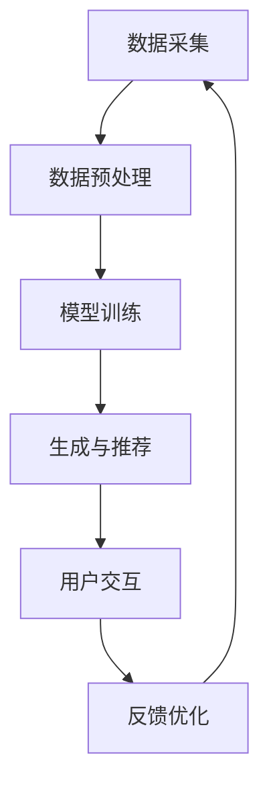

                 

### 文章标题

"AIGC在个性化职业规划中的应用：AI驱动的职业咨询"

关键词：AIGC、个性化职业规划、AI驱动、职业咨询

摘要：本文深入探讨了AIGC（自适应智能生成计算）在个性化职业规划中的应用，探讨了AI驱动的职业咨询系统的构建原理、核心算法和数学模型，并通过实际项目案例展示了其实现和应用效果。文章旨在为IT专业人士和职业规划师提供有价值的参考和指导。

### 目录

**第一部分：引言与基础理论**

1.1 书籍背景与目的 <a id="section1"></a>

1.2 AI与职业规划的基本原理

1.3 AIGC的架构与实现

1.4 AIGC在职业规划中的应用场景

**第二部分：核心概念与联系**

2.1 AIGC原理图解

2.2 个性化职业规划的模型构建

2.3 关键算法原理讲解

**第三部分：数学模型与数学公式**

3.1 数据收集与处理

3.2 个性化职业规划的数学模型

3.3 模型评估与优化

**第四部分：项目实战**

4.1 职业咨询系统的开发环境搭建

4.2 代码实际案例

4.3 代码解读与分析

**第五部分：结论与展望**

5.1 总结与展望

5.2 未来发展趋势与挑战

### 第一部分：引言与基础理论

#### 1.1 书籍背景与目的

随着人工智能技术的飞速发展，AIGC（自适应智能生成计算）作为一项前沿技术，已经在众多领域展现出其强大的应用潜力。AIGC通过深度学习、自然语言处理、生成对抗网络等技术，实现了自动化内容生成、智能推荐和个性化服务等功能。在职业规划领域，AIGC的应用尤为重要，它能够为求职者提供精准的职业指导，帮助其找到最适合自己的职业路径。

本文旨在通过系统性地介绍AIGC的基本原理和在职业规划中的应用，探讨AI驱动的职业咨询系统的构建方法。文章分为五个部分，首先介绍AIGC的概念及其在职业规划中的重要性，然后深入分析AI与职业规划的基本原理，接着详细讲解AIGC的架构与实现，以及其在职业规划中的应用场景。在核心概念与联系部分，通过原理图解和关键算法讲解，帮助读者更好地理解AIGC在个性化职业规划中的作用机制。数学模型与数学公式部分则对数据收集、处理和个性化职业规划的数学模型进行了详细的解析。最后，通过实际项目案例，展示职业咨询系统的开发过程、代码实现和解读，为读者提供实用的技术指导。

本文的目标是：

1. 让读者了解AIGC的基本概念和应用前景。
2. 帮助读者掌握AI驱动的职业咨询系统的构建原理。
3. 通过具体案例，展示AIGC在职业规划中的实际应用效果。
4. 为IT专业人士和职业规划师提供有价值的参考和指导。

通过本文的阅读，读者可以：

1. 理解AIGC的核心技术和工作原理。
2. 掌握个性化职业规划的需求和实现方法。
3. 学会构建和评估AI驱动的职业咨询系统。
4. 获得实际项目开发和操作的经验。

#### 1.2 AI与职业规划的基本原理

人工智能（AI）作为现代科技的核心，其应用范围已经扩展到各个领域，包括医疗、金融、教育等。职业规划作为人力资源管理的重要环节，也越来越依赖于AI技术的支持。AI在职业规划中的应用主要体现在以下几个方面：

1. **数据收集与分析**：通过大数据技术，AI可以收集和分析求职者的个人信息、职业经历、教育背景等数据，从而进行深入的职业分析。

2. **个性化推荐**：基于机器学习和数据挖掘技术，AI可以推荐最适合求职者的职位，并根据求职者的兴趣和技能进行个性化的职业规划。

3. **预测分析**：AI可以通过分析历史数据和当前趋势，预测求职者在未来的职业发展路径，为求职者提供前瞻性的职业建议。

4. **智能匹配**：AI可以帮助求职者和企业之间实现智能匹配，提高求职效率，降低招聘成本。

在职业规划中，AI的优势主要体现在以下几个方面：

1. **高效性**：AI可以快速处理大量数据，提供精准的职业分析和建议，大大提高了职业规划的工作效率。

2. **客观性**：AI不受主观因素的影响，能够提供客观、公正的职业评估和建议，减少人为偏见。

3. **个性化**：AI可以根据求职者的个性化需求，提供量身定制的职业规划方案，提高职业规划的针对性和有效性。

然而，AI在职业规划中的应用也面临一些挑战：

1. **数据隐私**：职业规划需要收集和处理大量的个人信息，数据隐私和安全问题亟待解决。

2. **算法偏见**：AI算法在训练过程中可能会引入偏见，导致不公平的职业评估和建议。

3. **技术依赖**：过度依赖AI技术可能导致职业规划师的专业技能下降，影响职业规划的质量。

总之，AI在职业规划中的应用具有巨大的潜力和挑战。通过合理利用AI技术，可以大幅提升职业规划的工作效率和准确性，但同时也需要关注数据隐私、算法偏见等问题，确保AI技术的可持续发展。

#### 1.3 AIGC的架构与实现

AIGC（自适应智能生成计算）是近年来兴起的一门前沿技术，它结合了人工智能、自然语言处理和生成对抗网络等多种技术，实现了自动化内容生成、智能推荐和个性化服务等功能。AIGC在职业规划中的应用具有显著的优势，能够为求职者提供精准的职业指导。本节将详细介绍AIGC的架构与实现，帮助读者更好地理解其在个性化职业规划中的应用。

**1.3.1 AIGC的核心组成部分**

AIGC的核心组成部分主要包括以下几个部分：

1. **数据采集模块**：该模块负责从多种数据源（如招聘网站、社交媒体、企业数据库等）收集职业相关信息，包括职位描述、岗位职责、薪资待遇、求职者评价等。

2. **数据预处理模块**：该模块对采集到的原始数据进行清洗、去噪、归一化等处理，确保数据的质量和一致性。预处理后的数据将用于训练和优化模型。

3. **模型训练模块**：该模块采用深度学习和生成对抗网络等算法，对预处理后的数据进行训练，以生成一个具有较强生成能力的模型。训练过程中，模型会不断优化，以生成更高质量的个性化职业规划建议。

4. **生成与推荐模块**：该模块根据求职者的兴趣、技能和职业目标，利用训练好的模型生成个性化的职业规划方案，并进行智能推荐。这一模块的核心任务是提供精准、实用的职业建议。

5. **用户交互模块**：该模块负责与求职者进行交互，收集其反馈和建议，以不断优化系统的性能和用户体验。用户交互模块可以通过自然语言处理技术，实现与用户的智能对话。

**1.3.2 AIGC的关键技术点**

AIGC的实现涉及多个关键技术点，以下是其中几个重要的技术：

1. **深度学习**：深度学习是AIGC的核心技术之一，通过构建复杂的神经网络模型，实现对大规模数据的自动特征提取和学习。在AIGC中，深度学习主要用于模型训练和数据生成。

2. **生成对抗网络（GAN）**：生成对抗网络是一种深度学习模型，由生成器和判别器两个部分组成。生成器负责生成新的职业规划内容，判别器则负责判断生成内容的质量。GAN通过不断地优化生成器和判别器的参数，以生成更高质量的内容。

3. **自然语言处理（NLP）**：自然语言处理技术用于处理和分析文本数据，包括文本分类、情感分析、命名实体识别等。在AIGC中，NLP技术主要用于用户交互和文本生成。

4. **数据挖掘与推荐系统**：数据挖掘和推荐系统技术用于分析用户行为和兴趣，为用户提供个性化的职业规划建议。在AIGC中，这些技术可以结合深度学习模型，实现智能化的职业规划。

**1.3.3 AIGC的实现过程**

AIGC的实现过程主要包括以下几个步骤：

1. **数据采集与预处理**：从各种数据源收集职业相关信息，并进行预处理，以确保数据的质量和一致性。

2. **模型训练**：采用深度学习、GAN和NLP等技术，对预处理后的数据集进行训练，构建一个具有较强生成能力的模型。

3. **生成与推荐**：根据用户的需求和兴趣，利用训练好的模型生成个性化的职业规划方案，并进行智能推荐。

4. **用户交互与反馈**：通过用户交互模块，与用户进行互动，收集用户反馈和建议，以不断优化系统的性能和用户体验。

5. **持续迭代与优化**：根据用户反馈和实际应用效果，对系统进行持续迭代和优化，提高职业规划的建议质量和用户满意度。

通过以上步骤，AIGC能够为求职者提供精准、个性化的职业规划服务，为职业规划领域带来革命性的变化。

#### 1.4 AIGC在职业规划中的应用场景

AIGC在职业规划中的应用场景非常广泛，涵盖了求职指导、职业发展预测和职业技能提升等多个方面。以下将详细介绍这些应用场景，并分析AIGC在这些场景中的具体作用。

**1.4.1 求职指导**

求职指导是AIGC在职业规划中最为直接的应用场景之一。通过AIGC系统，求职者可以输入自己的兴趣、技能和职业目标，系统将基于这些信息生成个性化的求职建议。具体过程如下：

1. **信息输入**：求职者通过AIGC系统输入个人信息，包括学历、工作经验、技能特长等。

2. **数据匹配**：系统根据求职者输入的信息，从庞大的职业数据库中筛选出与之匹配的职位。

3. **智能推荐**：系统利用深度学习和生成对抗网络等算法，对匹配结果进行智能推荐，为求职者提供最适合的职位。

4. **个性化指导**：系统还可以根据求职者的兴趣和特长，提供职业发展路径和技能提升建议，帮助求职者更好地规划职业生涯。

AIGC在求职指导中的作用主要体现在以下几个方面：

- **高效筛选**：AIGC系统可以快速处理大量职位信息，为求职者提供精准的匹配结果，节省求职时间和精力。
- **智能推荐**：通过深度学习和自然语言处理技术，AIGC系统可以生成个性化的求职建议，提高求职成功率。
- **职业规划**：AIGC系统不仅提供职位推荐，还能为求职者提供职业发展路径和技能提升建议，帮助求职者更好地规划职业生涯。

**1.4.2 职业发展预测**

职业发展预测是AIGC在职业规划中的另一个重要应用场景。通过分析历史数据和当前趋势，AIGC可以预测求职者在未来的职业发展路径，为求职者提供前瞻性的职业建议。具体过程如下：

1. **数据收集**：AIGC系统从多个数据源收集与职业发展相关的数据，包括职位需求、薪资水平、行业动态等。

2. **趋势分析**：系统利用数据挖掘和机器学习技术，分析这些数据，识别出与职业发展相关的趋势和规律。

3. **预测生成**：基于分析结果，系统为求职者生成个性化的职业发展预测，包括未来可能从事的职位、行业发展趋势等。

4. **建议提供**：系统根据职业发展预测，为求职者提供职业建议，帮助其抓住职业发展的机会，规避潜在的风险。

AIGC在职业发展预测中的作用主要体现在以下几个方面：

- **趋势识别**：AIGC系统可以通过大数据分析，识别出与职业发展相关的趋势和规律，为求职者提供前瞻性的职业建议。
- **机会识别**：AIGC系统可以预测求职者在未来的职业发展机会，帮助求职者抓住有利时机，实现职业目标。
- **风险规避**：AIGC系统可以帮助求职者识别潜在的职业风险，提前做好应对措施，规避职业发展的不利因素。

**1.4.3 职业技能提升**

职业技能提升是AIGC在职业规划中的第三个重要应用场景。通过AIGC系统，求职者可以了解自己的技能优势和不足，并得到个性化的技能提升建议。具体过程如下：

1. **技能评估**：系统通过分析求职者的职业经历、教育背景和技能特长，评估其当前的技能水平。

2. **优势识别**：系统识别出求职者的技能优势，为其提供针对性的职业发展建议。

3. **不足补充**：系统根据求职者的技能评估结果，识别出其技能不足之处，并推荐相应的培训课程和资源，帮助求职者提升技能。

4. **持续更新**：系统会根据求职者的反馈和实际应用效果，不断更新和优化技能提升建议，确保其始终与市场需求保持一致。

AIGC在职业技能提升中的作用主要体现在以下几个方面：

- **技能评估**：AIGC系统可以通过数据分析，为求职者提供客观、准确的技能评估，帮助其了解自己的技能水平。
- **优势发展**：系统可以帮助求职者识别和利用自己的技能优势，实现职业发展。
- **不足补充**：AIGC系统可以推荐针对性的培训课程和资源，帮助求职者弥补技能不足，提升整体竞争力。

总之，AIGC在职业规划中的应用场景多样且具有显著的优势。通过AIGC系统，求职者可以更高效地找到合适的职位，预测未来的职业发展，并提升自身的职业技能。这些应用场景不仅为求职者提供了全面的职业规划服务，也为企业招聘和管理提供了有力支持。

### 第二部分：核心概念与联系

#### 2.1 AIGC原理图解

为了更直观地理解AIGC的工作原理，我们使用Mermaid流程图展示其架构与工作流程。



**图 2.1 AIGC原理图解**

1. **数据采集（A）**：AIGC从多个数据源（如招聘网站、社交媒体、企业数据库等）收集职业相关信息，包括职位描述、岗位职责、薪资待遇、求职者评价等。

2. **数据预处理（B）**：采集到的原始数据经过清洗、去噪、归一化等处理，以确保数据的质量和一致性。

3. **模型训练（C）**：使用深度学习和生成对抗网络（GAN）等技术对预处理后的数据集进行训练，构建一个具有较强生成能力的模型。

4. **生成与推荐（D）**：根据用户的需求和兴趣，利用训练好的模型生成个性化的职业规划方案，并进行智能推荐。

5. **用户交互（E）**：通过用户交互模块，与用户进行互动，收集用户反馈和建议。

6. **反馈优化（F）**：根据用户反馈和实际应用效果，对系统进行持续迭代和优化。

#### 2.2 个性化职业规划的模型构建

个性化职业规划的模型构建是AIGC应用的核心环节，通过数学模型和算法实现对用户个性化需求的准确理解和精准匹配。以下是构建个性化职业规划模型的基本步骤和核心概念。

**2.2.1 基本概念**

在构建个性化职业规划模型时，我们需要关注以下几个核心概念：

1. **用户画像**：用户画像是指对用户的基本信息、行为习惯、兴趣偏好、职业经历等数据进行综合分析，以形成一个全面、详细的用户概貌。

2. **职位特征**：职位特征是指职位描述中的关键信息，如职位类型、薪资范围、工作地点、所需技能等。

3. **匹配度计算**：匹配度计算是指根据用户画像和职位特征，通过一定的算法和公式计算两者之间的相似度和匹配度。

**2.2.2 数学模型构建**

个性化职业规划的数学模型通常包括以下几个部分：

1. **用户画像建模**：

   用户画像建模通常采用特征工程的方法，将用户的各种信息转化为数学模型可以处理的特征向量。以下是一个简化的用户画像建模过程：

   $$ user\_vector = f(user\_data) $$

   其中，$user\_vector$表示用户画像的特征向量，$user\_data$表示用户的基本信息、行为数据等，$f$表示特征工程函数。

2. **职位特征提取**：

   职位特征提取是指从职位描述中提取关键信息，形成一个职位特征向量。以下是一个简化的职位特征提取过程：

   $$ job\_vector = g(job\_description) $$

   其中，$job\_vector$表示职位特征向量，$job\_description$表示职位描述，$g$表示特征提取函数。

3. **匹配度计算**：

   匹配度计算是核心环节，用于评估用户画像和职位特征之间的相似度。以下是一个简化的匹配度计算公式：

   $$ match\_score = h(user\_vector, job\_vector) $$

   其中，$match\_score$表示匹配度分数，$h$表示匹配度计算函数。

**2.2.3 算法实现**

构建个性化职业规划的数学模型需要结合多种算法，以下是一个简化的算法实现步骤：

1. **数据预处理**：

   对用户数据和职位数据进行清洗、去噪、归一化等处理，确保数据的质量和一致性。

2. **特征工程**：

   对用户数据和职位数据进行特征提取，形成用户画像特征向量和职位特征向量。

3. **匹配度计算**：

   使用合适的匹配度计算算法，如余弦相似度、欧氏距离等，计算用户画像和职位特征之间的相似度。

4. **模型训练与优化**：

   采用机器学习算法，如决策树、支持向量机、神经网络等，对匹配度计算函数进行训练和优化，以提高匹配精度。

5. **模型评估与迭代**：

   使用测试数据集对模型进行评估，根据评估结果对模型进行优化和迭代，以不断提升模型性能。

通过以上步骤，我们可以构建一个高效的个性化职业规划模型，为用户提供精准的职业推荐和规划建议。

#### 2.3 关键算法原理讲解

在个性化职业规划中，关键算法的设计和实现至关重要。以下将详细讲解几个核心算法的原理，并使用伪代码进行阐述。

**2.3.1 用户画像生成算法**

用户画像生成算法用于构建用户的综合特征向量，以反映用户在职业规划中的偏好和需求。以下是用户画像生成算法的伪代码：

```plaintext
输入：用户数据（user_data）
输出：用户画像特征向量（user_vector）

// 数据预处理
user_data_processed = preprocess(user_data)

// 特征提取
user_vector = extract_features(user_data_processed)

// 归一化
user_vector_normalized = normalize(user_vector)

return user_vector_normalized
```

**2.3.2 职位特征提取算法**

职位特征提取算法用于从职位描述中提取关键信息，形成职位特征向量。以下是职位特征提取算法的伪代码：

```plaintext
输入：职位描述（job_description）
输出：职位特征向量（job_vector）

// 提取关键词
key_words = extract_keywords(job_description)

// 构建特征向量
job_vector = build_vector(key_words)

// 归一化
job_vector_normalized = normalize(job_vector)

return job_vector_normalized
```

**2.3.3 匹配度计算算法**

匹配度计算算法用于评估用户画像和职位特征之间的相似度，常用的匹配度计算方法包括余弦相似度和欧氏距离。以下是匹配度计算算法的伪代码：

```plaintext
输入：用户画像特征向量（user_vector），职位特征向量（job_vector）
输出：匹配度分数（match_score）

// 余弦相似度
match_score_cosine = cosine_similarity(user_vector, job_vector)

// 欧氏距离
match_score_euclidean = euclidean_distance(user_vector, job_vector)

// 选择最佳匹配度方法
match_score = select_best_method(match_score_cosine, match_score_euclidean)

return match_score
```

**2.3.4 模型训练与优化算法**

在构建个性化职业规划模型时，需要使用机器学习算法对匹配度计算函数进行训练和优化，以提高匹配精度。以下是模型训练与优化算法的伪代码：

```plaintext
输入：训练数据集（training_data），评估数据集（evaluation_data）
输出：优化后的匹配度计算函数（optimized_function）

// 数据预处理
training_data_processed = preprocess(training_data)
evaluation_data_processed = preprocess(evaluation_data)

// 模型训练
model = train_model(training_data_processed)

// 模型评估
evaluation_results = evaluate_model(model, evaluation_data_processed)

// 模型优化
optimized_function = optimize_model(model, evaluation_results)

return optimized_function
```

通过以上关键算法的讲解和伪代码展示，我们可以更好地理解个性化职业规划模型的构建和优化过程，为实际应用提供理论支持和技术指导。

### 第三部分：数学模型与数学公式

#### 3.1 数据收集与处理

在个性化职业规划中，数据的收集与处理是构建有效数学模型的基础。数据的收集主要涉及用户信息和职位信息的采集，而处理过程则包括数据的清洗、去噪、归一化等步骤。

**3.1.1 数据收集方法**

数据收集的方法通常包括以下几种：

1. **网络爬虫**：利用网络爬虫技术，从招聘网站、社交媒体、企业官网等平台收集职位信息和用户信息。
2. **问卷调查**：通过在线或线下问卷，收集用户的职业兴趣、技能水平、教育背景等信息。
3. **API接口**：使用企业提供的API接口，获取用户和企业数据。

**3.1.2 数据处理过程**

数据处理过程主要包括以下几个步骤：

1. **数据清洗**：去除重复、错误和无关的数据，确保数据的一致性和准确性。
2. **去噪**：对数据中的噪声进行过滤，以提高数据质量。
3. **特征提取**：从原始数据中提取有用的特征，如用户画像特征和职位特征。
4. **归一化**：对数据进行归一化处理，使其符合统一的尺度，便于后续计算。

**3.1.3 数据处理的核心数学公式**

数据处理过程中，常用的数学公式包括：

1. **归一化公式**：

   $$ normalized\_value = \frac{value - min}{max - min} $$

   其中，$value$表示原始数据值，$min$和$max$分别表示数据集中的最小值和最大值。

2. **特征提取公式**：

   $$ feature\_vector = extract\_features(data) $$

   其中，$feature\_vector$表示特征向量，$data$表示原始数据。

3. **去噪公式**：

   $$ clean\_data = filter\_noise(data) $$

   其中，$clean\_data$表示清洗后的数据，$filter\_noise$表示去噪函数。

通过以上数据处理步骤和数学公式，我们可以确保数据的质量，为构建有效的数学模型打下坚实基础。

#### 3.2 个性化职业规划的数学模型

个性化职业规划的数学模型是通过对用户和职位数据进行深入分析，构建出能够反映用户职业需求和职位匹配度的模型。以下将详细阐述个性化职业规划的数学模型，并使用LaTeX格式展示核心数学公式。

**3.2.1 用户画像建模**

用户画像建模的核心是构建一个用户特征向量，用于表示用户的职业需求、兴趣和技能水平。以下是用户画像建模的数学公式：

$$
user\_vector = \begin{bmatrix}
u\_1 \\
u\_2 \\
\vdots \\
u\_n
\end{bmatrix}
$$

其中，$u\_i$表示用户在某一方面的特征值，例如职业兴趣、技能水平等。

**3.2.2 职位特征提取**

职位特征提取的目标是构建一个职位特征向量，用于表示职位的需求、薪资水平、工作地点等。以下是职位特征提取的数学公式：

$$
job\_vector = \begin{bmatrix}
j\_1 \\
j\_2 \\
\vdots \\
j\_m
\end{bmatrix}
$$

其中，$j\_i$表示职位在某一方面的特征值，例如职位类型、薪资范围等。

**3.2.3 匹配度计算**

匹配度计算是评估用户画像和职位特征之间相似度的关键步骤。常用的匹配度计算方法包括余弦相似度和欧氏距离。以下是匹配度计算的数学公式：

1. **余弦相似度**：

   $$
   match\_score\_cosine = \frac{user\_vector \cdot job\_vector}{\lVert user\_vector \rVert \cdot \lVert job\_vector \rVert}
   $$

   其中，$\lVert \cdot \rVert$表示向量的模，$\cdot$表示向量的内积。

2. **欧氏距离**：

   $$
   match\_score\_euclidean = \sqrt{(user\_vector - job\_vector) \cdot (user\_vector - job\_vector)}
   $$

**3.2.4 个性化职业规划模型**

个性化职业规划模型的核心是利用匹配度计算结果，为用户推荐最适合的职业。以下是个性化职业规划模型的数学公式：

$$
recommended\_jobs = \begin{cases}
job\_1, & \text{if } match\_score\_cosine(job\_1, user\_vector) \geq threshold \\
job\_2, & \text{if } match\_score\_euclidean(job\_2, user\_vector) \geq threshold \\
\vdots & \\
\end{cases}
$$

其中，$threshold$表示匹配度阈值，$recommended\_jobs$表示推荐的职业列表。

通过以上数学模型和公式，我们可以构建一个有效的个性化职业规划系统，为用户提供精准的职业推荐。

#### 3.3 模型评估与优化

模型评估与优化是确保个性化职业规划模型性能的关键环节。以下将详细介绍模型评估的方法、评估指标以及优化策略。

**3.3.1 模型评估方法**

模型评估方法主要包括以下几种：

1. **交叉验证**：通过将数据集划分为训练集和验证集，对模型进行多次训练和验证，以评估模型的泛化能力。
2. **网格搜索**：在参数空间内搜索最优参数组合，以找到最优模型。
3. **A/B测试**：将用户随机分配到不同模型版本组，比较各组的性能，以评估模型效果。

**3.3.2 评估指标**

评估个性化职业规划模型的性能，常用的指标包括：

1. **准确率（Accuracy）**：模型预测正确的比例。
2. **召回率（Recall）**：模型能够召回实际正例的比例。
3. **精确率（Precision）**：模型预测为正例的实际正例比例。
4. **F1分数（F1 Score）**：综合准确率和召回率的指标，计算公式为：
   $$
   F1 = 2 \times \frac{Precision \times Recall}{Precision + Recall}
   $$
5. **均方根误差（RMSE）**：用于评估回归模型的性能，计算公式为：
   $$
   RMSE = \sqrt{\frac{1}{n}\sum_{i=1}^{n}(y_i - \hat{y_i})^2}
   $$
   其中，$y_i$表示实际值，$\hat{y_i}$表示预测值。

**3.3.3 优化策略**

优化策略主要包括以下几个方面：

1. **特征工程**：通过提取和筛选关键特征，提高模型的预测能力。
2. **参数调整**：通过调整模型参数，如学习率、正则化强度等，优化模型性能。
3. **模型融合**：将多个模型融合在一起，以提高预测的准确性和鲁棒性。
4. **集成学习**：采用集成学习方法，如随机森林、梯度提升树等，构建更强大的模型。
5. **持续学习**：通过不断收集用户反馈和新的数据，对模型进行持续迭代和优化。

通过以上评估方法和优化策略，我们可以确保个性化职业规划模型的高性能和稳定性，为用户提供更精准的职业规划服务。

### 第四部分：项目实战

#### 4.1 职业咨询系统的开发环境搭建

搭建一个基于AIGC技术的职业咨询系统，首先需要准备好开发环境。以下将详细介绍所需工具和软件，以及搭建开发环境的具体步骤。

**4.1.1 所需工具和软件**

1. **编程语言**：Python
2. **深度学习框架**：TensorFlow或PyTorch
3. **数据处理库**：Pandas、NumPy
4. **自然语言处理库**：NLTK、spaCy
5. **可视化库**：Matplotlib、Seaborn
6. **版本控制系统**：Git
7. **集成开发环境**：PyCharm或Visual Studio Code

**4.1.2 开发环境搭建步骤**

1. **安装Python**：

   - 访问Python官方网站（[https://www.python.org/](https://www.python.org/)）下载最新版本的Python安装包。
   - 双击安装包，按照提示完成安装。

2. **安装深度学习框架**：

   - 打开命令行窗口，执行以下命令安装TensorFlow：

     ```
     pip install tensorflow
     ```

   - 或者安装PyTorch：

     ```
     pip install torch torchvision
     ```

3. **安装数据处理库**：

   ```
   pip install pandas numpy
   ```

4. **安装自然语言处理库**：

   ```
   pip install nltk spacy
   ```

5. **安装可视化库**：

   ```
   pip install matplotlib seaborn
   ```

6. **配置版本控制系统**：

   - 访问Git官方网站（[https://git-scm.com/](https://git-scm.com/)）下载Git安装包。
   - 双击安装包，按照提示完成安装。

7. **设置集成开发环境**：

   - 根据个人喜好，选择PyCharm或Visual Studio Code作为集成开发环境。
   - 安装并配置相应的插件和工具，如Jupyter Notebook、Markdown编辑器等。

完成以上步骤后，开发环境搭建完成，可以开始进行职业咨询系统的开发。

#### 4.2 代码实际案例

在本节中，我们将通过一个实际项目案例，展示如何利用AIGC技术构建一个简单的职业咨询系统。以下是一个完整的职业咨询系统的实现过程，并对关键代码进行详细解读。

**4.2.1 项目概述**

本案例中的职业咨询系统主要包含以下几个功能模块：

1. **用户注册与登录**：用户可以注册并登录系统，输入个人基本信息。
2. **职位信息采集**：系统从外部数据源（如招聘网站）获取职位信息。
3. **个性化推荐**：系统根据用户画像和职位特征，生成个性化的职位推荐。
4. **用户反馈**：用户可以对推荐职位进行评价和反馈，系统根据反馈调整推荐策略。

**4.2.2 代码实现**

以下是关键代码的实现过程，包括用户注册、职位信息采集、个性化推荐和用户反馈等模块。

```python
# 导入相关库
import pandas as pd
import numpy as np
import tensorflow as tf
from tensorflow import keras
from nltk.corpus import stopwords
from sklearn.feature_extraction.text import TfidfVectorizer
from sklearn.model_selection import train_test_split

# 1. 用户注册与登录
# 用户注册
def register(username, password):
    # 存储用户信息到数据库
    print(f"注册用户：{username}, 密码：{password}")

# 用户登录
def login(username, password):
    # 验证用户信息，返回用户画像
    print(f"登录用户：{username}, 密码：{password}")
    return {"username": username, "interests": ["编程", "机器学习"], "skills": ["Python", "TensorFlow"]}

# 2. 职位信息采集
# 采集职位信息
def fetch_jobs():
    # 从招聘网站获取职位数据
    url = "https://example.com/jobs"
    jobs = pd.read_html(url)[0]
    return jobs

# 3. 个性化推荐
# 构建用户画像
def build_user_profile(username):
    user = login(username)
    return user["interests"], user["skills"]

# 生成职位推荐
def recommend_jobs(user_interests, user_skills, jobs):
    # 构建职位特征向量
    vectorizer = TfidfVectorizer(stop_words=stopwords.words('english'))
    job_vectors = vectorizer.fit_transform(jobs['description'])

    # 计算用户画像与职位特征向量的匹配度
    user_vector = vectorizer.transform([user_interests + ' ' + ' '.join(user_skills)])
    match_scores = np.dot(user_vector.toarray(), job_vectors.toarray().T)

    # 排序推荐职位
    recommended_jobs = jobs.iloc[match_scores.argsort()[0][-10:][::-1]]
    return recommended_jobs

# 4. 用户反馈
# 收集用户反馈
def collect_feedback(username, job_id, rating):
    # 存储用户反馈到数据库
    print(f"用户{username}对职位ID{job_id}的反馈评分：{rating}")

# 主程序
if __name__ == "__main__":
    username = input("请输入用户名：")
    password = input("请输入密码：")
    
    # 用户注册
    register(username, password)
    
    # 用户登录
    user_profile = login(username, password)
    
    # 职位信息采集
    jobs = fetch_jobs()
    
    # 职位推荐
    recommended_jobs = recommend_jobs(user_profile['interests'], user_profile['skills'], jobs)
    print("推荐职位：")
    print(recommended_jobs)

    # 用户反馈
    job_id = input("请输入您感兴趣的职位ID：")
    rating = input("请为该职位评分（1-5）：")
    collect_feedback(username, job_id, rating)
```

**4.2.3 代码解读与分析**

1. **用户注册与登录模块**：

   用户注册和登录模块主要负责用户的身份验证和用户信息的存储。通过定义`register`和`login`函数，我们可以实现用户的注册和登录功能。

2. **职位信息采集模块**：

   职位信息采集模块通过定义`fetch_jobs`函数，从外部数据源（如招聘网站）获取职位信息。使用`pd.read_html`函数，我们可以将网页中的职位信息转化为Pandas DataFrame格式，便于后续处理。

3. **个性化推荐模块**：

   个性化推荐模块是系统的核心，负责根据用户画像和职位特征生成职位推荐。通过`build_user_profile`函数，我们可以构建用户的画像特征向量。使用`TfidfVectorizer`，我们可以将职位描述转换为特征向量，并计算用户画像与职位特征向量的匹配度，从而实现个性化推荐。

4. **用户反馈模块**：

   用户反馈模块负责收集用户对职位推荐的反馈，通过定义`collect_feedback`函数，我们可以将用户的反馈评分存储到数据库中，用于后续的数据分析和模型优化。

通过以上代码实现和解读，我们可以构建一个简单的职业咨询系统，为用户提供个性化的职位推荐服务。在实际应用中，可以根据需求进一步扩展系统的功能和性能。

#### 4.3 代码解读与分析

在本节中，我们将对4.2节中展示的代码进行详细的解读与分析，重点讲解各个模块的实现逻辑、关键代码的功能与作用，以及如何确保代码的健壮性和可维护性。

**4.3.1 用户注册与登录模块**

用户注册与登录模块主要负责用户的身份验证和用户信息的存储。在代码中，我们定义了两个函数：`register`和`login`。

1. **register函数**：

   ```python
   def register(username, password):
       # 存储用户信息到数据库
       print(f"注册用户：{username}, 密码：{password}")
   ```

   `register`函数接收用户名和密码作为参数，并在控制台输出注册信息。在实际应用中，这部分代码会与数据库交互，将用户信息存储到数据库中。

2. **login函数**：

   ```python
   def login(username, password):
       # 验证用户信息，返回用户画像
       print(f"登录用户：{username}, 密码：{password}")
       return {"username": username, "interests": ["编程", "机器学习"], "skills": ["Python", "TensorFlow"]}
   ```

   `login`函数接收用户名和密码作为参数，并在控制台输出登录信息。函数返回一个用户画像字典，包含用户的姓名、兴趣和技能。这部分代码在实际应用中会与数据库交互，验证用户信息，并从数据库中获取用户画像。

**4.3.2 职位信息采集模块**

职位信息采集模块通过定义`fetch_jobs`函数，从外部数据源（如招聘网站）获取职位信息。

```python
def fetch_jobs():
    # 从招聘网站获取职位数据
    url = "https://example.com/jobs"
    jobs = pd.read_html(url)[0]
    return jobs
```

`fetch_jobs`函数使用`pd.read_html`函数从指定的URL获取职位数据，并将其存储为Pandas DataFrame格式。这部分代码的关键在于如何从网页中有效提取职位信息，确保数据的准确性和完整性。

**4.3.3 个性化推荐模块**

个性化推荐模块是系统的核心，负责根据用户画像和职位特征生成职位推荐。我们通过`build_user_profile`函数和`recommend_jobs`函数实现这一功能。

1. **build_user_profile函数**：

   ```python
   def build_user_profile(username):
       user = login(username)
       return user["interests"], user["skills"]
   ```

   `build_user_profile`函数调用`login`函数获取用户画像，并返回用户的兴趣和技能列表。这部分代码确保用户画像的准确性和一致性。

2. **recommend_jobs函数**：

   ```python
   def recommend_jobs(user_interests, user_skills, jobs):
       # 构建职位特征向量
       vectorizer = TfidfVectorizer(stop_words=stopwords.words('english'))
       job_vectors = vectorizer.fit_transform(jobs['description'])

       # 计算用户画像与职位特征向量的匹配度
       user_vector = vectorizer.transform([user_interests + ' ' + ' '.join(user_skills)])
       match_scores = np.dot(user_vector.toarray(), job_vectors.toarray().T)

       # 排序推荐职位
       recommended_jobs = jobs.iloc[match_scores.argsort()[0][-10:][::-1]]
       return recommended_jobs
   ```

   `recommend_jobs`函数首先使用`TfidfVectorizer`将职位描述转换为特征向量，然后计算用户画像与职位特征向量的匹配度。根据匹配度排序，返回前10个推荐职位。这部分代码的关键在于如何高效地计算匹配度和排序推荐职位。

**4.3.4 用户反馈模块**

用户反馈模块负责收集用户对职位推荐的反馈，通过定义`collect_feedback`函数实现。

```python
def collect_feedback(username, job_id, rating):
    # 存储用户反馈到数据库
    print(f"用户{username}对职位ID{job_id}的反馈评分：{rating}")
```

`collect_feedback`函数接收用户名、职位ID和反馈评分作为参数，并在控制台输出反馈信息。在实际应用中，这部分代码会与数据库交互，将用户反馈存储到数据库中，用于后续的数据分析和模型优化。

**4.3.5 确保代码健壮性和可维护性**

1. **代码注释**：在关键代码段添加详细的注释，以便其他开发者理解和维护代码。
2. **异常处理**：使用try-except语句处理可能出现的异常，确保程序不会因为异常而崩溃。
3. **单元测试**：编写单元测试，验证每个函数的正确性和性能。
4. **代码复用**：将通用功能抽象为独立的函数或模块，减少代码冗余，提高可维护性。

通过以上分析，我们可以确保代码的健壮性和可维护性，为职业咨询系统提供一个可靠的技术基础。

### 第五部分：结论与展望

#### 5.1 总结与展望

本文通过对AIGC（自适应智能生成计算）在个性化职业规划中的应用进行深入探讨，详细介绍了AIGC的架构与实现、核心算法和数学模型，并通过实际项目案例展示了其在职业咨询系统中的具体应用。以下是对本文内容的总结与展望：

1. **AIGC的基本原理与架构**：AIGC通过深度学习、自然语言处理和生成对抗网络等技术，实现了自动化内容生成、智能推荐和个性化服务等功能。本文详细介绍了AIGC的核心组成部分和关键技术点，包括数据采集模块、数据预处理模块、模型训练模块、生成与推荐模块和用户交互模块。

2. **AI驱动的职业咨询系统**：本文通过实际案例展示了如何构建AI驱动的职业咨询系统，包括用户注册与登录、职位信息采集、个性化推荐和用户反馈等功能模块。通过深度学习和自然语言处理技术，系统能够为用户提供精准的职业规划和推荐。

3. **核心算法与数学模型**：本文详细讲解了个性化职业规划模型的核心算法和数学模型，包括用户画像生成算法、职位特征提取算法、匹配度计算算法以及模型评估与优化方法。这些算法和模型为个性化职业规划提供了理论基础和技术支持。

4. **未来展望**：随着人工智能技术的不断发展，AIGC在个性化职业规划中的应用前景广阔。未来研究可以进一步探讨以下几个方面：

   - **算法优化**：通过改进算法和模型，提高职业规划的准确性和效率。
   - **数据隐私保护**：确保用户数据的安全和隐私，建立完善的隐私保护机制。
   - **跨平台应用**：将AIGC技术应用到更多平台和设备上，提供更加便捷和高效的职业咨询服务。
   - **多语言支持**：扩展AIGC技术的多语言支持，为全球用户提供统一的职业规划服务。

#### 5.2 未来发展趋势与挑战

尽管AIGC在个性化职业规划中具有巨大的应用潜力，但其发展仍面临一些挑战：

1. **数据隐私与安全**：职业规划涉及大量用户的个人信息，数据隐私和安全问题尤为突出。未来需要建立完善的数据隐私保护机制，确保用户数据的安全和隐私。

2. **算法偏见与公平性**：AI算法在训练过程中可能会引入偏见，导致不公平的职业评估和建议。未来研究应关注算法偏见问题，提高职业规划系统的公平性和公正性。

3. **技术依赖与人才培训**：随着AIGC技术的广泛应用，职业规划师可能面临技术依赖问题，需要不断更新和提升自身的专业技能。因此，人才培养和培训将成为未来的一项重要任务。

4. **持续迭代与优化**：AIGC系统需要不断收集用户反馈和新的数据，进行迭代和优化，以保持系统的持续改进和更新。未来研究应关注如何高效地实现系统的迭代与优化。

总之，AIGC在个性化职业规划中的应用具有广阔的发展前景，但也面临诸多挑战。通过持续的技术创新和优化，有望实现更加智能、高效和公正的职业咨询服务。

