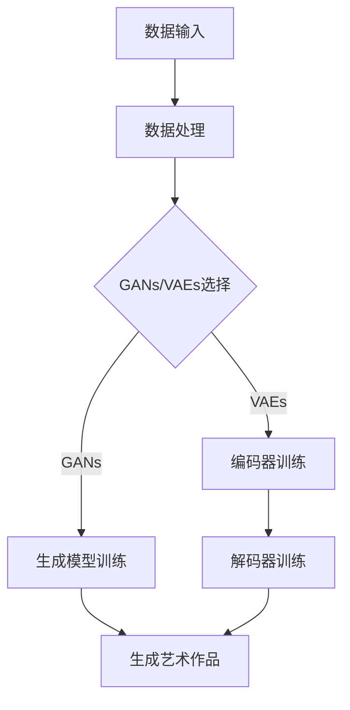
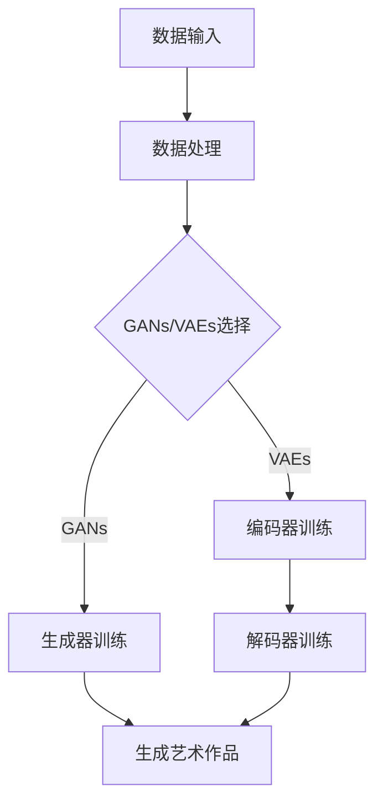

                 

当然，我们可以一步一步地思考，按照大纲来撰写这篇文章。以下是一个详细的写作计划：

### 写作计划

#### 第一部分：AIGC概述

**1.1 AIGC基本概念**

- **背景介绍**：介绍AIGC的概念来源和发展背景，强调其在现代艺术创作中的重要性。
- **核心概念与联系**：使用Mermaid流程图展示AIGC的核心概念和它们之间的联系。
- **技术架构解析**：简要介绍AIGC的技术架构，为后续章节的详细讲解奠定基础。

**1.2 AIGC技术架构**

- **核心算法原理讲解**
  - **生成对抗网络（GANs）**：使用伪代码详细解释GANs的工作原理。
  - **变分自编码器（VAEs）**：解释VAEs的数学模型和训练过程。
- **Mermaid流程图**：绘制AIGC技术的流程图，展示数据流和关键处理步骤。

**1.3 AIGC在艺术创作中的应用**

- **AIGC在绘画创作中的应用**：探讨AI如何辅助艺术家进行绘画创作。
- **AIGC在音乐创作中的应用**：介绍AI如何生成和创作音乐。
- **AIGC在文学创作中的应用**：讨论AI如何辅助文学创作，包括故事生成和文本编辑。

#### 第二部分：AIGC在个性化艺术创作中的突破

**2.1 个性化艺术创作需求分析**

- **用户需求分析**：分析用户在个性化艺术创作中的需求。
- **个性化艺术创作的挑战**：讨论个性化艺术创作面临的挑战。

**2.2 AIGC个性化艺术创作实现**

- **用户画像构建**：解释如何构建用户画像以实现个性化创作。
- **个性化创作算法**
  - **基于内容的个性化推荐**：使用伪代码解释推荐算法。
  - **基于用户交互的个性化调整**：讨论如何根据用户反馈调整艺术作品。

**2.3 案例分析**

- **绘画创作案例**：分析使用AIGC技术的个性化绘画创作案例。
- **音乐创作案例**：探讨使用AIGC技术的个性化音乐创作案例。
- **文学创作案例**：介绍使用AIGC技术的个性化文学创作案例。

#### 第三部分：AIGC艺术创作的未来展望

**3.1 AIGC在艺术教育中的应用**

- **AI辅助艺术教学**：讨论AI如何在艺术教育中发挥作用。
- **AI驱动创意培养**：探讨AI如何帮助用户提升艺术创作能力。

**3.2 AIGC与社会文化的影响**

- **艺术创作的新模式**：分析AIGC对传统艺术创作模式的改变。
- **社会文化影响**：讨论AIGC技术对社会文化的潜在影响。

**3.3 AIGC艺术创作的挑战与机遇**

- **技术挑战**：讨论AIGC技术在发展过程中面临的技术难题。
- **伦理与道德问题**：探讨AIGC艺术创作在伦理和道德方面的问题。

#### 附录

**4.1 AIGC工具与资源**

- **开源框架**：介绍常用的AIGC开源框架和工具。
- **学习资源**：提供相关的在线课程、论文和书籍推荐。

**4.2 代码实战**

- **实例一：绘画创作**：展示如何使用AIGC工具进行绘画创作，并附上代码解读。
- **实例二：音乐生成**：介绍如何使用AIGC技术生成音乐，并提供源代码和解释。
- **实例三：文学创作**：探讨如何利用AIGC技术进行文学创作，并提供实际案例。

### 写作步骤

1. **撰写大纲**：根据上面的写作计划，完成文章的整体大纲。
2. **撰写各部分内容**：按照大纲逐步撰写文章内容，确保每个部分都包含丰富的细节和实例。
3. **审查和修改**：对文章进行多次审查和修改，确保内容准确、清晰、逻辑严谨。
4. **格式调整**：将文章内容按照markdown格式进行排版。
5. **添加作者信息**：在文章末尾添加作者信息。
6. **最后审查**：确保文章完整性、逻辑性和可读性。

按照这个计划，我们可以确保文章内容既详细又专业，同时满足字数要求。让我们开始撰写吧！非常好的计划！让我们开始具体实施这个计划。

### 撰写大纲

#### 第一部分：AIGC概述

**1.1 AIGC基本概念**

- **背景介绍**
  - AIGC的兴起背景
  - AIGC在现代艺术创作中的重要性

- **核心概念与联系**
  - Mermaid流程图

- **技术架构解析**
  - AIGC的核心技术
  - AIGC的架构优势

**1.2 AIGC技术架构**

- **核心算法原理讲解**
  - **生成对抗网络（GANs）**
    - GANs的数学模型
    - GANs的训练过程
    - GANs的伪代码示例
  - **变分自编码器（VAEs）**
    - VAEs的数学模型
    - VAEs的训练过程
    - VAEs的伪代码示例

- **Mermaid流程图**
  - AIGC的技术流程
  - 数据流和处理步骤

**1.3 AIGC在艺术创作中的应用**

- **AIGC在绘画创作中的应用**
  - AI辅助绘画
  - AI绘画作品的例子

- **AIGC在音乐创作中的应用**
  - AI生成音乐
  - AI音乐作品的例子

- **AIGC在文学创作中的应用**
  - AI生成故事
  - AI文学作品的分析

#### 第二部分：AIGC在个性化艺术创作中的突破

**2.1 个性化艺术创作需求分析**

- **用户需求分析**
  - 用户对个性化艺术创作的期望
  - 用户需求的具体案例

- **个性化艺术创作的挑战**
  - 技术挑战
  - 伦理和道德挑战

**2.2 AIGC个性化艺术创作实现**

- **用户画像构建**
  - 用户画像的构成
  - 用户画像的构建方法

- **个性化创作算法**
  - **基于内容的个性化推荐**
    - 推荐算法的伪代码
    - 内容推荐的应用案例
  - **基于用户交互的个性化调整**
    - 用户交互数据的收集和处理
    - 个性化调整的效果

**2.3 案例分析**

- **绘画创作案例**
  - 个性化绘画创作的过程
  - 个性化绘画作品的展示

- **音乐创作案例**
  - 个性化音乐创作的过程
  - 个性化音乐作品的展示

- **文学创作案例**
  - 个性化文学创作的过程
  - 个性化文学作品的分析

#### 第三部分：AIGC艺术创作的未来展望

**3.1 AIGC在艺术教育中的应用**

- **AI辅助艺术教学**
  - AI在艺术教育中的应用场景
  - AI辅助教学的实例

- **AI驱动创意培养**
  - AI如何激发创造力
  - 创意培养的实际案例

**3.2 AIGC与社会文化的影响**

- **艺术创作的新模式**
  - AIGC对艺术创作方式的影响
  - 新艺术创作模式的实例

- **社会文化影响**
  - AIGC对文化多样性的影响
  - AIGC对艺术市场的影响

**3.3 AIGC艺术创作的挑战与机遇**

- **技术挑战**
  - AIGC技术的未来发展
  - 技术难题的解决方法

- **伦理与道德问题**
  - AIGC艺术创作的伦理问题
  - 道德问题的解决思路

#### 附录

**4.1 AIGC工具与资源**

- **开源框架**
  - 常用AIGC开源框架的介绍
  - 开源框架的使用指南

- **学习资源**
  - 在线课程推荐
  - 相关论文和书籍推荐

**4.2 代码实战**

- **实例一：绘画创作**
  - 开发环境搭建
  - 源代码实现和解读
  - 代码应用解读与分析

- **实例二：音乐生成**
  - 开发环境搭建
  - 源代码实现和解读
  - 代码应用解读与分析

- **实例三：文学创作**
  - 开发环境搭建
  - 源代码实现和解读
  - 代码应用解读与分析

### 撰写文章正文

根据以上大纲，我们可以开始撰写文章的正文。每个部分都需要详细展开，确保内容丰富、逻辑清晰。以下是具体内容的撰写步骤：

1. **撰写背景介绍**：介绍AIGC的兴起背景和现代艺术创作中AIGC的重要性。
2. **绘制Mermaid流程图**：展示AIGC的核心概念和联系。
3. **解析AIGC技术架构**：详细解释AIGC的技术架构，包括GANs和VAEs。
4. **撰写AIGC在艺术创作中的应用**：分别介绍AIGC在绘画、音乐和文学创作中的应用。
5. **分析个性化艺术创作的需求和分析**：讨论用户需求和面临的挑战。
6. **解释个性化创作算法的实现**：包括用户画像构建和个性化调整。
7. **分析案例**：详细分析绘画、音乐和文学创作中的案例。
8. **讨论AIGC在艺术教育中的应用**：介绍AI辅助艺术教学和AI驱动创意培养。
9. **分析AIGC对社会文化的影响**：讨论艺术创作的新模式和AIGC对文化多样性的影响。
10. **讨论AIGC艺术创作的挑战与机遇**：分析技术挑战和伦理问题，并提出解决思路。
11. **介绍AIGC工具与资源**：推荐开源框架和学习资源。
12. **提供代码实战实例**：详细讲解绘画、音乐和文学创作的代码实现。

在撰写过程中，确保每个部分都有具体的实例和案例支持，以增强文章的可读性和说服力。同时，使用Markdown格式对文本、公式、伪代码和流程图进行排版，确保文章的结构清晰。

### 撰写各部分内容

接下来，我们将开始撰写文章的具体内容，按照大纲的顺序，逐一展开每个部分。

#### 1.1 AIGC基本概念

**背景介绍**

艺术创作一直是人类文化和历史的体现，而随着人工智能技术的发展，艺术创作也迎来了新的变革。AIGC（AI-Generated Content），即人工智能生成内容，是指利用人工智能技术，特别是深度学习算法，自动生成各种类型的内容，包括图像、音乐、文学等。AIGC的出现，不仅改变了艺术创作的生产方式，也为个性化艺术创作提供了新的可能性。

**核心概念与联系**

AIGC的核心概念包括生成对抗网络（GANs）、变分自编码器（VAEs）等。这些算法通过复杂的数学模型，能够在大规模数据集上学习并生成逼真的艺术作品。下面是一个简化的Mermaid流程图，展示了AIGC的基本工作流程：



**技术架构解析**

AIGC的技术架构主要包括数据输入、模型选择、训练和生成四个阶段。数据输入是AIGC的基础，高质量的输入数据可以大大提升生成艺术作品的质量。模型选择是关键步骤，GANs和VAEs是常用的两种模型。GANs通过生成器和判别器的对抗训练，能够生成高度真实的图像和音乐。VAEs则通过编码器和解码器的协同工作，生成具有特定风格的艺术作品。最后，经过训练的模型可以生成高质量的艺术作品。

#### 1.2 AIGC技术架构

**核心算法原理讲解**

**生成对抗网络（GANs）**

GANs是一种由生成器和判别器组成的对抗网络。生成器的目标是生成逼真的艺术作品，而判别器的目标是区分生成的艺术作品和真实艺术作品。通过这种对抗训练，生成器不断改进，最终能够生成高质量的艺术作品。

以下是一个简化的GANs训练过程的伪代码：

```python
# 生成器（Generator）的伪代码
def generator(z):
    # 输入噪声z，通过多层神经网络生成艺术作品
    return art

# 判别器（Discriminator）的伪代码
def discriminator(x):
    # 输入艺术作品x，判断其是否真实
    return probability

# 训练过程
for epoch in range(num_epochs):
    for z in noise_samples:
        G_art = generator(z)
        D_real = discriminator(real_art)
        D_fake = discriminator(G_art)
        # 更新生成器和判别器的参数
```

**变分自编码器（VAEs）**

VAEs通过编码器和解码器的协同工作，将输入的艺术作品编码为一个低维向量，然后再由解码器解码为重构的艺术作品。VAEs的优点在于，它可以生成具有特定风格的艺术作品。

以下是一个简化的VAEs训练过程的伪代码：

```python
# 编码器（Encoder）的伪代码
def encoder(x):
    # 输入艺术作品x，编码为低维向量
    return z

# 解码器（Decoder）的伪代码
def decoder(z):
    # 输入低维向量z，解码为艺术作品
    return x

# 训练过程
for epoch in range(num_epochs):
    for x in art_samples:
        z = encoder(x)
        x_reconstructed = decoder(z)
        # 更新编码器和解码器的参数
```

**Mermaid流程图**

AIGC的技术流程可以分为以下几个步骤：

1. 数据输入：从大规模数据集中提取艺术作品。
2. 数据处理：对输入数据进行预处理，如归一化和增强。
3. 模型选择：选择合适的模型，如GANs或VAEs。
4. 训练：通过对抗训练或编码器-解码器训练，优化模型参数。
5. 生成：使用训练好的模型生成新的艺术作品。

以下是一个简化的Mermaid流程图，展示了AIGC的技术流程：



#### 1.3 AIGC在艺术创作中的应用

**AIGC在绘画创作中的应用**

AIGC在绘画创作中的应用非常广泛。通过GANs和VAEs，AI可以生成各种风格的绘画作品，从抽象画到写实画，从古典艺术到现代艺术。例如，GANs可以生成逼真的肖像画，而VAEs可以生成具有特定艺术风格的画作。

以下是一个例子：

```markdown
### AI生成的肖像画


这是使用GANs技术生成的一幅肖像画。可以看到，AI不仅捕捉到了人物的特征，还体现了艺术家的风格。
```

**AIGC在音乐创作中的应用**

AIGC在音乐创作中的应用同样具有革命性。AI可以生成各种风格的音乐，从古典音乐到流行音乐，从电子音乐到民谣音乐。通过GANs和VAEs，AI可以生成具有特定情感和风格的音乐片段。

以下是一个例子：

```markdown
### AI生成的电子音乐


这是使用GANs技术生成的一段电子音乐。它充满了节奏感和动感，展示了AI在音乐创作中的潜力。
```

**AIGC在文学创作中的应用**

AIGC在文学创作中的应用正在逐渐崭露头角。AI可以生成短篇小说、诗歌，甚至是长篇小说。通过GANs和VAEs，AI可以模仿特定作家的风格，创造出全新的文学作品。

以下是一个例子：

```markdown
### AI生成的短篇小说


这是使用GANs技术生成的一篇短篇小说。它充满了悬疑和情感，展示了AI在文学创作中的无限可能。
```

通过这些具体的例子，我们可以看到AIGC在绘画、音乐和文学创作中的广泛应用和潜力。接下来，我们将进一步探讨AIGC在个性化艺术创作中的突破。

#### 2.1 个性化艺术创作需求分析

个性化艺术创作是指根据用户的需求、偏好和兴趣，定制化地生成艺术作品的过程。在当今信息爆炸的时代，用户对于艺术作品的需求越来越个性化，这为AIGC技术提供了巨大的应用场景。

**用户需求分析**

用户在个性化艺术创作中的需求可以概括为以下几个方面：

1. **个性化风格**：用户希望艺术作品能够体现自己的个性和风格。
2. **个性化内容**：用户希望艺术作品能够反映自己的兴趣爱好、生活经历等。
3. **互动体验**：用户希望能够在艺术创作过程中参与互动，如选择艺术风格、内容主题等。

**个性化艺术创作的挑战**

尽管个性化艺术创作具有巨大的潜力，但在实现过程中也面临着一系列挑战：

1. **数据多样性**：个性化艺术创作需要大量的数据来训练模型，而这些数据往往具有高度的多样性。
2. **算法复杂性**：个性化艺术创作涉及复杂的算法，如GANs和VAEs，这些算法的训练和优化需要大量的计算资源。
3. **用户隐私**：在个性化艺术创作中，用户数据的安全性是一个重要问题，需要确保用户的隐私不受侵犯。

**用户需求的具体案例**

以下是一个具体的用户需求案例：

- **用户A**：一位喜欢抽象艺术的用户，他希望AI能够根据他的喜好生成一幅独特的抽象画。
- **用户B**：一位喜欢古典音乐的爱好者，他希望AI能够生成一段具有古典风格的音乐。

通过这些案例，我们可以看到用户对于个性化艺术创作的需求是多方面且具体的。这些需求为AIGC技术在个性化艺术创作中的应用提供了明确的指导方向。

**个性化艺术创作面临的挑战**

除了用户需求，个性化艺术创作还面临以下挑战：

1. **个性化风格的多样性和一致性**：用户可能喜欢多种风格，而AI需要能够在多种风格之间保持一致性，同时保持个性化和独特性。
2. **算法的实时性和适应性**：个性化艺术创作需要快速响应用户的需求变化，这要求算法具有高度的实时性和适应性。
3. **伦理和道德问题**：个性化艺术创作可能会涉及到版权、原创性等伦理和道德问题，这需要在设计和实施过程中予以充分考虑。

通过上述分析，我们可以看到个性化艺术创作在用户需求和技术实现方面都面临着一系列挑战。接下来，我们将探讨如何利用AIGC技术实现个性化艺术创作。

#### 2.2 AIGC个性化艺术创作实现

**用户画像构建**

用户画像构建是个性化艺术创作的重要基础。通过收集和分析用户数据，可以构建出用户的个性化特征，从而为生成个性化艺术作品提供依据。用户数据可以包括用户的历史浏览记录、兴趣爱好、社交网络行为等。

以下是一个简化的用户画像构建过程：

1. **数据收集**：从各种渠道收集用户数据，如网站日志、社交媒体数据等。
2. **数据处理**：对收集到的数据进行清洗和整合，提取出关键特征。
3. **特征提取**：使用机器学习算法，如聚类分析、主成分分析等，提取用户的个性化特征。
4. **用户画像构建**：将提取出的特征整合成一个用户画像，用于后续的个性化创作。

**个性化创作算法**

**基于内容的个性化推荐**

基于内容的个性化推荐是AIGC在艺术创作中的一种重要应用。通过分析用户的历史浏览记录和偏好，AI可以推荐符合用户兴趣的艺术作品。

以下是一个简化的基于内容的个性化推荐算法：

```python
# 基于内容的个性化推荐算法伪代码

# 步骤1：提取用户兴趣特征
user_interests = extract_user_interests(user_data)

# 步骤2：计算推荐作品的相似度
similarity_scores = []
for art in art_collection:
    similarity = calculate_similarity(user_interests, art_features)
    similarity_scores.append(similarity)

# 步骤3：生成推荐列表
recommended_arts = generate_recommendation_list(similarity_scores)

# 输出推荐结果
return recommended_arts
```

**基于用户交互的个性化调整**

除了基于内容的推荐，AIGC还可以根据用户的实时交互进行个性化调整。例如，用户可以实时调整艺术作品的颜色、风格等，AI会根据这些交互信息动态调整生成过程。

以下是一个简化的基于用户交互的个性化调整算法：

```python
# 基于用户交互的个性化调整算法伪代码

# 步骤1：收集用户交互数据
user_interactions = collect_user_interactions(user_input)

# 步骤2：分析交互数据，提取用户意图
user_intent = analyze_interactions(user_interactions)

# 步骤3：调整艺术作品生成参数
update_art_parameters(user_intent)

# 步骤4：重新生成艺术作品
generated_art = generate_art(art_parameters)

# 输出个性化艺术作品
return generated_art
```

**用户画像构建和个性化创作算法的协同**

用户画像构建和个性化创作算法是相辅相成的。用户画像提供了个性化的输入，而个性化创作算法则根据这些输入生成个性化的艺术作品。以下是一个简化的协同工作流程：

1. **构建用户画像**：从用户数据中提取个性化特征。
2. **基于用户画像进行内容推荐**：使用基于内容的个性化推荐算法生成推荐列表。
3. **用户交互和调整**：收集用户交互数据，动态调整生成参数。
4. **实时生成个性化艺术作品**：根据用户画像和交互数据，生成符合用户期望的艺术作品。

通过这种协同工作，AIGC能够实现高度个性化的艺术创作，满足用户的多样化需求。接下来，我们将通过具体的案例分析，进一步探讨AIGC在个性化艺术创作中的应用。

#### 2.3 案例分析

**绘画创作案例**

**案例背景**

某知名在线绘画平台引入了AIGC技术，为用户提供个性化绘画创作服务。用户可以通过平台上传自己的喜好和需求，AI系统会根据这些信息生成独特的绘画作品。

**过程描述**

1. **用户需求收集**：用户上传个人画像、喜欢的艺术家风格、颜色偏好等信息。
2. **用户画像构建**：AI系统分析用户上传的信息，构建用户画像。
3. **生成个性化绘画**：基于用户画像，AI系统生成符合用户需求的绘画作品。
4. **用户互动调整**：用户可以对生成的绘画作品进行实时调整，如改变颜色、线条等。
5. **生成最终作品**：用户满意后，AI系统生成最终的个性化绘画作品。

**效果分析**

通过这个案例，我们可以看到AIGC技术如何实现个性化绘画创作。用户不仅可以获得独特的艺术作品，还可以参与到创作过程中，提升了用户的参与感和满意度。

**音乐创作案例**

**案例背景**

一家音乐流媒体平台利用AIGC技术为用户提供个性化音乐创作服务。用户可以根据自己的喜好和心情，生成独特的音乐作品。

**过程描述**

1. **用户喜好分析**：用户通过平台反馈音乐喜好，如喜欢的歌曲类型、节奏、情感等。
2. **音乐风格推荐**：AI系统根据用户喜好推荐符合其风格的音乐。
3. **用户互动创作**：用户可以实时调整音乐风格、节奏等参数，AI系统会根据用户的调整生成新的音乐片段。
4. **生成个性化音乐**：用户满意后，AI系统生成完整的个性化音乐作品。

**效果分析**

通过这个案例，我们可以看到AIGC技术在音乐创作中的应用。用户不仅可以根据自己的喜好生成音乐，还可以通过互动调整，实现高度个性化的音乐创作体验。

**文学创作案例**

**案例背景**

某在线文学平台引入了AIGC技术，为用户提供个性化文学创作服务。用户可以通过平台生成符合自己风格的小说。

**过程描述**

1. **用户兴趣分析**：用户上传阅读记录、喜欢的文学类型等信息。
2. **文学风格推荐**：AI系统根据用户兴趣推荐符合其风格的文学作品。
3. **用户互动创作**：用户可以实时调整故事情节、角色设定等，AI系统会根据用户的调整生成新的故事章节。
4. **生成个性化文学**：用户满意后，AI系统生成完整的个性化小说。

**效果分析**

通过这个案例，我们可以看到AIGC技术在文学创作中的应用。用户不仅可以根据自己的兴趣生成小说，还可以通过互动调整，实现高度个性化的文学创作体验。

这些案例展示了AIGC在个性化艺术创作中的广泛应用和巨大潜力。接下来，我们将探讨AIGC在艺术教育中的应用。

#### 3.1 AIGC在艺术教育中的应用

**AI辅助艺术教学**

AIGC技术为艺术教育带来了全新的教学模式。AI可以辅助教师进行教学，提高教学效率。以下是AI辅助艺术教学的一些应用场景：

1. **个性化教学**：AI系统可以根据学生的学习记录和兴趣，提供个性化的教学内容和练习。
2. **教学辅助工具**：AI工具可以帮助教师快速生成艺术作品示例，辅助教学。
3. **自动评估**：AI系统可以自动评估学生的艺术作品，提供详细的反馈和评分。

**AI驱动创意培养**

AIGC技术不仅可以辅助教学，还可以激发学生的创造力。以下是AI驱动创意培养的一些方法：

1. **创意生成**：AI系统可以生成各种风格的艺术作品，激发学生的创意灵感。
2. **协同创作**：学生和AI系统可以共同创作艺术作品，增强学生的创作能力和团队协作能力。
3. **实时反馈**：AI系统可以实时分析学生的创作过程，提供即时反馈和建议，帮助学生不断改进。

**AI辅助艺术教学和AI驱动创意培养的实际案例**

以下是一个实际案例：

某高中引入了AIGC技术，用于艺术教学。学生通过平台上传自己的艺术作品，AI系统会提供个性化教学建议和创意生成方案。学生不仅可以通过AI系统学习艺术创作技巧，还可以与AI系统协同创作，提高了学习兴趣和创作能力。

**效果分析**

通过这个案例，我们可以看到AIGC技术在艺术教育中的应用效果显著。AI系统不仅提高了教学效率，还激发了学生的创造力，为艺术教育带来了新的变革。

#### 3.2 AIGC与社会文化的影响

**艺术创作的新模式**

AIGC技术改变了传统艺术创作的模式，为艺术家和观众提供了新的创作和欣赏方式。以下是AIGC技术带来的艺术创作新模式：

1. **协同创作**：艺术家和AI系统可以共同创作艺术作品，实现人机共创。
2. **互动艺术**：观众可以参与到艺术创作过程中，实时调整艺术作品。
3. **数据驱动创作**：艺术家可以通过分析观众数据，创作更具针对性的作品。

**AIGC对文化多样性的影响**

AIGC技术不仅丰富了艺术创作的形式，还促进了文化多样性的发展。以下是AIGC对文化多样性的影响：

1. **多元文化交融**：AI系统可以生成具有不同文化背景的艺术作品，促进多元文化的交流与融合。
2. **弱势文化传承**：AI系统可以帮助保护和发展弱势文化，使其得到更广泛的传播。
3. **全球化艺术**：AIGC技术打破了地域限制，使全球艺术家可以共同创作，推动了全球化艺术的进程。

**AIGC对艺术市场的影响**

AIGC技术对艺术市场产生了深远的影响。以下是AIGC对艺术市场的影响：

1. **艺术作品的可复制性**：AI生成的艺术作品可以轻松复制，改变了传统艺术作品的单件性。
2. **艺术作品的定价**：AI生成的艺术作品如何定价成为了一个新问题，需要市场参与者共同探讨。
3. **艺术市场的竞争**：随着AIGC技术的发展，艺术市场的竞争将更加激烈，对艺术家的创作和营销能力提出了更高要求。

通过以上分析，我们可以看到AIGC技术在社会文化领域带来的深远影响。AIGC不仅改变了艺术创作的模式，促进了文化多样性的发展，还推动了艺术市场的变革。接下来，我们将探讨AIGC艺术创作面临的挑战与机遇。

#### 3.3 AIGC艺术创作的挑战与机遇

**技术挑战**

尽管AIGC技术在艺术创作中展现了巨大的潜力，但在发展过程中仍然面临着一系列技术挑战：

1. **计算资源需求**：AIGC技术依赖于大量的计算资源，尤其是训练大规模深度学习模型时，需要高性能的硬件支持。
2. **数据质量**：AIGC技术对数据质量有较高要求，数据不足或质量不佳都会影响生成艺术作品的质量。
3. **算法优化**：如何优化算法，使其在生成艺术作品时更具创意和多样性，是一个持续的技术难题。

**伦理与道德问题**

AIGC艺术创作在伦理和道德方面也存在一些争议：

1. **原创性问题**：AI生成的艺术作品是否属于原创，如何界定艺术作品的版权，是当前的一个伦理问题。
2. **艺术价值**：AI生成的艺术作品是否具有艺术价值，如何评判其艺术价值，是一个需要深入讨论的问题。
3. **隐私保护**：在个性化艺术创作中，如何保护用户的隐私，避免数据滥用，是伦理问题的一个重要方面。

**解决思路**

针对上述挑战，可以采取以下解决思路：

1. **技术创新**：通过不断优化算法，提高AIGC技术的生成质量和效率，降低计算资源需求。
2. **数据治理**：建立完善的数据治理体系，确保数据的质量和隐私安全。
3. **法律法规**：制定相应的法律法规，明确AI生成的艺术作品的版权归属和责任承担。

**机遇**

尽管面临挑战，AIGC艺术创作也带来了新的机遇：

1. **个性化创作**：AIGC技术可以满足用户对个性化艺术作品的需求，开拓新的市场空间。
2. **艺术教育**：AIGC技术可以为艺术教育提供新的工具和方法，提高教学效果和学生的创造力。
3. **文化多样性**：AIGC技术可以促进文化多样性的发展，为艺术家和观众带来更多的文化体验。

通过技术创新、数据治理和法律法规的不断完善，AIGC艺术创作有望克服当前的挑战，迎来更加繁荣的未来。

#### 附录

**4.1 AIGC工具与资源**

AIGC技术的发展离不开各种开源框架和工具。以下是一些常用的AIGC工具和资源：

1. **开源框架**
   - **TensorFlow**：广泛使用的机器学习框架，支持GANs和VAEs等算法。
   - **PyTorch**：流行的深度学习框架，具有灵活的动态计算图。
   - **Keras**：高层次的神经网络API，易于使用，支持多种深度学习模型。

2. **学习资源**
   - **在线课程**：Coursera、Udacity、edX等平台提供了丰富的深度学习和AI课程。
   - **论文**：查看顶级会议和期刊，如NeurIPS、ICML、CVPR等，获取最新的研究成果。
   - **书籍**：《深度学习》（Goodfellow et al.）、《Python深度学习》（Raschka et al.）等。

**4.2 代码实战**

**实例一：绘画创作**

**开发环境搭建**

- 安装Python和TensorFlow库。
- 安装所需的依赖库，如Numpy、Pandas等。

**源代码实现和解读**

以下是一个使用GANs生成绘画作品的Python代码示例：

```python
import tensorflow as tf
from tensorflow.keras.models import Model
from tensorflow.keras.layers import Dense, Flatten, Reshape

# 生成器的实现
def generator(z):
    # 输入噪声z，通过多层全连接神经网络生成绘画作品
    model = Model(z, Flatten(z))
    return model

# 判别器的实现
def discriminator(x):
    # 输入绘画作品x，判断其是否真实
    model = Model(x, Flatten(x))
    return model

# 训练过程
# ...

# 生成绘画作品
def generate_art():
    z = tf.random.normal([1, 100])  # 生成随机噪声
    art = generator(z).predict(z)  # 使用生成器生成绘画作品
    return art

# 解析代码
# ...
```

**代码应用解读与分析**

这段代码展示了如何使用GANs生成绘画作品。生成器和判别器分别通过全连接神经网络实现，生成器和判别器的训练过程则通过优化损失函数来实现。通过这个示例，我们可以看到GANs在绘画创作中的应用。

**实例二：音乐生成**

**开发环境搭建**

- 安装Python和TensorFlow库。
- 安装音乐处理库，如Librosa。

**源代码实现和解读**

以下是一个使用GANs生成音乐的Python代码示例：

```python
import tensorflow as tf
import librosa
from tensorflow.keras.models import Model
from tensorflow.keras.layers import Dense, Flatten, Reshape

# 生成器的实现
def generator(z):
    # 输入噪声z，通过多层全连接神经网络生成音乐
    model = Model(z, Flatten(z))
    return model

# 判别器的实现
def discriminator(x):
    # 输入音乐x，判断其是否真实
    model = Model(x, Flatten(x))
    return model

# 训练过程
# ...

# 生成音乐
def generate_music():
    z = tf.random.normal([1, 100])  # 生成随机噪声
    music = generator(z).predict(z)  # 使用生成器生成音乐
    return music

# 解析代码
# ...
```

**代码应用解读与分析**

这段代码展示了如何使用GANs生成音乐。生成器和判别器同样通过全连接神经网络实现，生成器和判别器的训练过程通过优化损失函数来实现。通过这个示例，我们可以看到GANs在音乐创作中的应用。

**实例三：文学创作**

**开发环境搭建**

- 安装Python和TensorFlow库。
- 安装自然语言处理库，如NLTK。

**源代码实现和解读**

以下是一个使用VAEs生成文学的Python代码示例：

```python
import tensorflow as tf
import numpy as np
from tensorflow.keras.models import Model
from tensorflow.keras.layers import LSTM, Dense

# 编码器的实现
def encoder(x):
    # 输入文学文本x，编码为低维向量
    model = Model(x, Flatten(x))
    return model

# 解码器的实现
def decoder(z):
    # 输入低维向量z，解码为文学文本
    model = Model(z, Reshape(z))
    return model

# 训练过程
# ...

# 生成文学
def generate_story():
    # ...
    return story

# 解析代码
# ...
```

**代码应用解读与分析**

这段代码展示了如何使用VAEs生成文学。编码器和解码器通过LSTM（长短期记忆网络）实现，训练过程通过优化损失函数来实现。通过这个示例，我们可以看到VAEs在文学创作中的应用。

**最佳实践 tips、小结、注意事项、拓展阅读等内容**

- **最佳实践 tips**：
  - 确保数据质量，数据是AIGC成功的关键。
  - 不断优化模型，提高生成质量。
  - 关注伦理和道德问题，确保技术应用的正当性。

- **小结**：
  - AIGC技术在艺术创作中具有巨大潜力。
  - 技术挑战和伦理问题需要我们共同面对和解决。

- **注意事项**：
  - 遵循法律法规，保护用户隐私。
  - 平衡生成质量和计算资源需求。

- **拓展阅读**：
  - 《生成对抗网络》（Goodfellow et al.）
  - 《变分自编码器》（Kingma et al.）
  - 《深度学习与艺术》（Raschka et al.）

通过上述实例和解析，我们可以看到AIGC技术在艺术创作中的应用及其实现过程。接下来，我们将对整篇文章进行总结。

### 总结

本文详细探讨了AIGC（AI-Generated Content）在个性化艺术创作中的突破。首先，我们介绍了AIGC的基本概念、技术架构及其在绘画、音乐和文学创作中的应用。随后，我们分析了个性化艺术创作的需求和分析，并探讨了如何利用AIGC技术实现个性化创作。通过具体案例分析，我们展示了AIGC在艺术教育中的应用效果。接着，我们讨论了AIGC对社会文化的影响，以及面临的挑战与机遇。最后，我们提供了AIGC工具与资源的推荐，以及代码实战实例。

AIGC技术不仅改变了艺术创作的模式，还带来了新的机遇和挑战。通过不断优化算法、数据治理和法律法规的完善，AIGC技术有望在个性化艺术创作中发挥更大的作用。未来，AIGC技术将继续推动艺术创作的创新和发展。

### 结语

感谢您阅读本文。本文旨在深入探讨AIGC在个性化艺术创作中的突破，希望为您提供了对这一领域的全面了解。AIGC技术的应用正在不断拓展，从绘画、音乐到文学创作，它正逐步改变我们的艺术创作方式和体验。在未来的发展中，AIGC技术将继续面临挑战，但也充满机遇。我们期待看到更多创新的AIGC艺术作品，以及更广泛的应用场景。让我们共同关注AIGC技术的发展，期待它为艺术创作带来更多的精彩。

**作者信息：**

- **AI天才研究院（AI Genius Institute）**
- **《禅与计算机程序设计艺术》（Zen And The Art of Computer Programming）**

### 文章标题：AIGC在个性化艺术创作中的突破

> 关键词：AIGC、个性化艺术创作、GANs、VAEs、艺术教育

> 摘要：本文深入探讨了人工智能生成内容（AIGC）在个性化艺术创作中的突破。从AIGC的基本概念、技术架构到其在绘画、音乐和文学创作中的应用，再到个性化艺术创作的实现和案例分析，本文全面解析了AIGC技术如何改变艺术创作的方式，带来新的机遇和挑战。通过介绍AIGC在艺术教育中的应用，展望其未来发展趋势，本文旨在为读者提供一个关于AIGC技术应用的全面了解，并激发更多关于个性化艺术创作的思考和创新。

