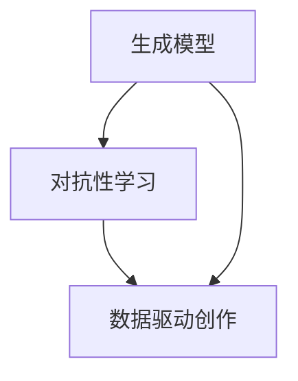

                 

### 文章标题

**AIGC在个性化艺术创作辅助中的创新**

### 关键词

- AIGC
- 个性化艺术创作
- 生成对抗网络（GAN）
- 变分自编码器（VAE）
- 数据预处理
- 系统设计与架构

### 摘要

本文探讨了人工智能生成内容（AIGC）在个性化艺术创作辅助中的创新应用。通过介绍AIGC的基本概念和核心技术，以及其在艺术创作中的应用和实现，本文分析了AIGC对个性化艺术创作的推动作用。文章首先梳理了AIGC的发展历程和核心原理，然后详细介绍了其在艺术创作中的系统架构、数据收集与预处理、核心算法，并通过实际案例展示了AIGC在艺术创作中的应用效果。最后，本文探讨了AIGC在艺术创作中的未来发展方向和挑战，为相关领域的研究者和实践者提供了有价值的参考。

---

接下来，我们将逐步深入探讨AIGC在个性化艺术创作中的创新应用，包括其基本概念、核心原理、系统架构、数据预处理、核心算法及其在实际中的应用，并展望其未来的发展趋势和挑战。

## 1. 引言和概述

### 1.1 AIGC的定义和核心概念

人工智能生成内容（Artificial Intelligence Generated Content，简称AIGC）是指利用人工智能技术，尤其是深度学习和生成模型，自动生成具有创意性和艺术性的内容。AIGC的核心概念包括生成模型、对抗性学习和数据驱动创作。生成模型是AIGC的核心，通过学习大量的数据，生成与训练数据风格相似的新内容。对抗性学习则通过生成模型和判别模型的对抗训练，提高生成模型的质量和多样性。数据驱动创作是指AIGC依赖于大量数据来驱动内容生成，通过数据筛选、处理和融合，实现个性化创作。

### 1.2 AIGC在艺术创作中的角色

AIGC在艺术创作中扮演着重要的角色。首先，AIGC可以大规模生成艺术作品，极大地提高了创作的效率和多样性。通过深度学习模型，AIGC可以模仿各种艺术风格，如抽象艺术、印象派、现代艺术等，甚至可以生成全新的艺术风格。其次，AIGC可以根据用户的需求和偏好，生成个性化的艺术作品，满足不同用户的需求。此外，AIGC还可以辅助艺术家进行创作，通过生成大量的创意性草图和设计，为艺术家提供灵感和参考。

### 1.3 个人化艺术创作的演变和趋势

个人化艺术创作是指根据用户的个性、兴趣和需求，创作出独一无二的艺术作品。随着人工智能技术的发展，个人化艺术创作正在经历深刻的变革。首先，数据驱动创作使得艺术创作更加个性化和精准。通过分析用户的兴趣和行为数据，AIGC可以生成与用户喜好高度匹配的艺术作品。其次，人工智能技术提高了艺术创作的效率和多样性。生成对抗网络（GAN）、变分自编码器（VAE）等深度学习模型的应用，使得艺术作品的创作更加丰富和多样化。最后，艺术创作与科技融合的趋势日益明显，AIGC在虚拟现实（VR）、增强现实（AR）等新兴技术中的应用，使得艺术创作更加互动和沉浸。

## 2. AIGC的基本理论和技术

### 2.1 AIGC的核心概念和联系

AIGC的核心概念包括生成模型、对抗性学习和数据驱动创作。生成模型负责生成与训练数据风格相似的新内容，对抗性学习通过生成模型和判别模型的对抗训练提高生成质量，数据驱动创作依赖于大量数据来驱动内容生成。以下是这些概念之间的联系：



### 2.2 算法原理和伪代码

生成对抗网络（GAN）和变分自编码器（VAE）是AIGC中常用的核心算法。

#### 2.2.1 生成对抗网络（GAN）算法原理

GAN由生成器（Generator）和判别器（Discriminator）组成。生成器的任务是生成与真实数据相似的数据，而判别器的任务是区分真实数据和生成数据。通过两个模型的对抗训练，生成器不断提高生成质量，最终能够生成高质量的数据。

```python
# GAN 伪代码
Generator(G):
  # 输入：随机噪声z
  # 输出：生成的假数据G(z)
  G(z) = f(z)

Discriminator(D):
  # 输入：真实数据x和生成的假数据G(z)
  # 输出：判别结果D(x), D(G(z))
  D(x) = h(x)
  D(G(z)) = h(G(z))
```

#### 2.2.2 变分自编码器（VAE）算法原理

VAE通过编码器和解码器来生成数据。编码器将输入数据编码成一个潜在空间中的向量，解码器从潜在空间中生成与输入数据相似的数据。VAE通过最大化数据分布的似然函数来训练模型。

```python
# VAE 伪代码
Encoder(E):
  # 输入：输入数据x
  # 输出：编码后的潜在向量z
  z = E(x)

Decoder(D):
  # 输入：潜在向量z
  # 输出：生成的数据G(z)
  G(z) = D(z)

Loss Function:
  # 输出：训练损失L
  L = -E[log p(x|z)] - KLD(q(z|x)||p(z))
```

### 2.3 数学模型和公式

生成对抗网络（GAN）和变分自编码器（VAE）的数学模型和公式如下：

#### 2.3.1 GAN数学模型

- 生成器损失函数：
  $$ L_G = -E_{z \sim p_z(z)}[\log D(G(z))] $$

- 判别器损失函数：
  $$ L_D = E_{x \sim p_data(x)}[\log D(x)] + E_{z \sim p_z(z)}[\log (1 - D(G(z))] $$

#### 2.3.2 VAE数学模型

- 编码器损失函数：
  $$ L_E = E_{x \sim p_data(x)}[-\log \pi_\theta(\mu, \sigma) - \lambda \log \sigma - \beta \text{KL}(\mu, \sigma | 0, 1)] $$

- 解码器损失函数：
  $$ L_D = E_{x \sim p_data(x)}[-\log p(x|\mu, \sigma)] $$

- 总损失函数：
  $$ L = L_E + \lambda L_D $$

其中，$\pi_\theta(\mu, \sigma)$ 是编码器的先验分布，$p(x|\mu, \sigma)$ 是解码器的概率分布，$\text{KL}$ 是Kullback-Leibler散度。

### 2.3.3 模型解释和举例

以上数学模型和公式详细描述了GAN和VAE的核心原理和训练过程。例如，在GAN中，生成器的目标是生成足够逼真的数据来欺骗判别器，而判别器的目标是准确区分真实数据和生成数据。通过这种对抗训练，生成器和判别器共同提高，最终生成高质量的数据。VAE通过编码器和解码器将输入数据映射到一个潜在空间，并从潜在空间中生成与输入数据相似的数据，同时保持数据的分布。

## 3. AIGC在艺术创作中的应用

### 3.1 AIGC系统架构

AIGC系统架构包括数据收集、数据预处理、模型训练和生成四个主要模块。以下是AIGC系统架构的详细描述：

- **数据收集模块**：负责收集艺术作品的数据，包括图片、音频、视频等。数据来源可以是公开的艺术数据库、社交媒体平台、艺术家作品集等。

- **数据预处理模块**：对收集到的数据进行清洗、归一化和增强，以提高数据质量和模型的训练效果。数据预处理包括图像的缩放、裁剪、旋转、颜色调整等操作。

- **模型训练模块**：使用深度学习模型对预处理后的数据进行训练。常见的模型包括生成对抗网络（GAN）、变分自编码器（VAE）、生成式模型等。训练过程中，通过对抗训练和优化算法，提高模型的生成质量。

- **生成模块**：使用训练好的模型生成新的艺术作品。生成过程中，可以根据用户的需求和偏好，调整模型的参数和生成策略，实现个性化创作。

### 3.2 关键模块和功能

AIGC系统的关键模块和功能如下：

- **数据收集模块**：数据收集模块是AIGC系统的核心，决定了模型训练的质量和生成效果。数据收集模块需要从多个来源获取高质量的艺术作品数据，并进行数据清洗和预处理。

- **数据预处理模块**：数据预处理模块对收集到的数据进行处理，包括图像增强、音频处理、视频处理等。预处理过程可以提高数据的质量和多样性，从而提高模型的训练效果。

- **模型训练模块**：模型训练模块负责训练生成模型。通过对抗训练和优化算法，生成模型可以学习到艺术作品的特征和风格，从而生成高质量的艺术作品。

- **生成模块**：生成模块使用训练好的模型生成新的艺术作品。生成过程中，可以根据用户的需求和偏好，调整模型的参数和生成策略，实现个性化创作。

### 3.3 交互设计原则

AIGC系统的交互设计原则包括：

- **用户导向**：交互设计应该以用户为中心，充分考虑用户的需求和偏好。通过提供灵活的参数调整和自定义选项，用户可以轻松地生成符合个人风格和兴趣的艺术作品。

- **简洁直观**：交互界面应该简洁直观，用户可以轻松地操作和导航。通过提供清晰的说明和示例，用户可以快速理解如何使用AIGC系统。

- **实时反馈**：在用户生成艺术作品的过程中，系统应提供实时的反馈和指导。通过展示生成过程中的中间结果和调整建议，用户可以更好地掌握创作过程。

- **个性化定制**：交互设计应支持个性化定制，用户可以根据自己的需求和偏好，调整模型的参数和生成策略，实现独特的艺术作品。

## 4. 数据收集与预处理

### 4.1 艺术作品的数据来源

艺术作品的数据收集是AIGC系统的基础。数据来源可以是各种公开的艺术数据库、社交媒体平台、艺术家作品集等。以下是几种常见的数据来源：

- **公开艺术数据库**：如Art Institute of Chicago（芝加哥艺术博物馆）、Metropolitan Museum of Art（大都会艺术博物馆）等，这些数据库提供了大量的高质量艺术作品数据。

- **社交媒体平台**：如Instagram、Twitter等，艺术家和爱好者在这些平台上分享了自己的作品，可以用于数据收集。

- **艺术家作品集**：直接从艺术家的个人网站或画廊获取艺术作品，这些数据通常具有较高的质量和多样性。

### 4.2 数据收集方法和技术

数据收集的方法和技术包括以下几种：

- **爬虫技术**：使用爬虫程序从网站自动获取艺术作品的数据。爬虫可以提取图片、音频、视频等多媒体数据，并存储在本地或数据库中。

- **API调用**：一些公开的艺术数据库和社交媒体平台提供了API接口，可以通过编程方式直接调用获取数据。

- **手动收集**：通过手动浏览网站、社交媒体等平台，收集艺术作品的数据。这种方法通常耗时较长，但可以确保数据的质量。

### 4.3 数据预处理工作流程

数据预处理是提高AIGC系统性能和生成质量的关键步骤。数据预处理的工作流程包括以下步骤：

1. **数据清洗**：去除数据中的噪声和冗余信息，如删除损坏的图像、重复的数据等。

2. **数据归一化**：将数据缩放到相同的范围，如将图像的像素值缩放到[0, 1]，以便于模型的训练。

3. **数据增强**：通过随机变换，如旋转、缩放、裁剪、颜色调整等，增加数据的多样性和丰富性，从而提高模型的泛化能力。

4. **特征提取**：从原始数据中提取有用的特征，如图像的边缘、纹理、颜色分布等，用于模型的训练和生成。

5. **数据分割**：将数据集划分为训练集、验证集和测试集，用于模型的训练、验证和评估。

### 4.4 数据预处理的效果和重要性

数据预处理的效果直接影响AIGC系统的性能和生成质量。以下是数据预处理的效果和重要性：

- **提高模型性能**：通过数据清洗、归一化和增强，可以提高模型的学习能力和泛化能力，从而提高模型的性能和生成质量。

- **减少过拟合**：数据增强和特征提取可以帮助模型学习到更普遍的特征，减少过拟合现象。

- **加快训练速度**：数据预处理可以减少模型在训练过程中需要处理的数据量，加快训练速度。

- **降低计算成本**：通过数据清洗和归一化，可以降低模型训练的计算成本。

综上所述，数据收集与预处理是AIGC系统不可或缺的步骤，对系统的性能和生成质量有着重要的影响。

### 5. AIGC在艺术创作中的核心算法

AIGC在艺术创作中采用了多种核心算法，其中生成对抗网络（GAN）和变分自编码器（VAE）是最常用的两种。以下将详细介绍这两种算法的原理和应用。

#### 5.1 生成对抗网络（GAN）

##### 5.1.1 GAN的理论与原理

生成对抗网络（GAN）由Ian Goodfellow等人于2014年提出，是一种基于生成模型和判别模型对抗训练的深度学习框架。GAN的核心思想是利用生成器和判别器之间的对抗关系，使生成器生成逼真的数据，同时使判别器难以区分生成数据和真实数据。

- **生成器（Generator）**：生成器的任务是生成与真实数据相似的数据。通常，生成器接受一个随机噪声向量作为输入，通过一系列神经网络操作，生成与真实数据风格相似的数据。

- **判别器（Discriminator）**：判别器的任务是区分真实数据和生成数据。判别器接收真实数据和生成数据作为输入，输出一个概率值，表示输入数据的真实性。判别器的目标是最小化这个概率值，以便更好地区分真实数据和生成数据。

GAN的训练过程是一个对抗过程，生成器和判别器相互竞争，生成器试图生成更真实的数据，而判别器则试图更准确地判断数据。通过这种对抗训练，生成器不断优化，最终能够生成高质量的数据。

##### 5.1.2 GAN在艺术创作中的应用

GAN在艺术创作中具有广泛的应用，可以用于图像生成、风格迁移、图像修复等多种任务。

- **图像生成**：GAN可以生成高质量的艺术作品，如人脸、风景、动物等。通过训练大量的图像数据，生成器可以学习到各种艺术风格和特征，从而生成具有创意性的艺术作品。

- **风格迁移**：GAN可以将一种艺术风格迁移到另一种艺术作品上。例如，将一幅现代艺术作品迁移到印象派风格，或者将一张照片的风格迁移到水彩画风格。

- **图像修复**：GAN可以用于图像修复，通过生成缺失的部分，填补图像中的空洞或破损。这种技术在艺术修复、文物保护等领域有重要应用。

#### 5.2 变分自编码器（VAE）

##### 5.2.1 VAE的理论与原理

变分自编码器（VAE）是由Kingma和Welling于2013年提出的一种生成模型。VAE通过引入潜在变量，将编码器和解码器结合在一起，从而实现数据的生成和表示学习。

- **编码器（Encoder）**：编码器将输入数据编码成一个潜在变量向量，这个向量包含了输入数据的特征和结构信息。

- **解码器（Decoder）**：解码器从潜在变量向量中生成与输入数据相似的数据。解码器接受潜在变量向量作为输入，通过一系列神经网络操作，生成与输入数据风格相似的数据。

VAE的训练过程是通过最大化数据的似然函数来进行的。具体来说，VAE通过以下两个步骤进行训练：

1. **编码步骤**：输入数据通过编码器编码成一个潜在变量向量。
2. **解码步骤**：从潜在变量向量中生成数据，并计算生成数据的损失。

通过反复迭代这两个步骤，VAE可以学习到输入数据的特征和结构，从而生成高质量的数据。

##### 5.2.2 VAE在艺术创作中的应用

VAE在艺术创作中也具有广泛的应用，可以用于图像生成、风格迁移、图像修复等多种任务。

- **图像生成**：VAE可以生成高质量的艺术作品，如人脸、风景、动物等。通过训练大量的图像数据，VAE可以学习到各种艺术风格和特征，从而生成具有创意性的艺术作品。

- **风格迁移**：VAE可以将一种艺术风格迁移到另一种艺术作品上。例如，将一幅现代艺术作品迁移到印象派风格，或者将一张照片的风格迁移到水彩画风格。

- **图像修复**：VAE可以用于图像修复，通过生成缺失的部分，填补图像中的空洞或破损。这种技术在艺术修复、文物保护等领域有重要应用。

#### 5.3 其他核心算法

除了GAN和VAE，AIGC在艺术创作中还采用了其他一些核心算法，如风格迁移、生成式对抗网络（SGAN）、文本到图像的生成模型（GPT-2）等。

- **风格迁移**：风格迁移是将一种艺术风格迁移到另一种艺术作品上的技术。常见的风格迁移算法包括Fast Style Transfer、CycleGAN等。

- **生成式对抗网络（SGAN）**：SGAN是GAN的一种变体，通过引入额外的生成器和判别器，实现更高质量的图像生成。

- **文本到图像的生成模型（GPT-2）**：GPT-2是一种基于 Transformer 架构的文本生成模型，可以生成与输入文本风格相似的艺术作品。

这些核心算法共同构成了AIGC在艺术创作中的技术基础，使得个性化艺术创作成为可能。

### 6. 案例研究和实际应用

为了更好地展示AIGC在个性化艺术创作中的实际应用效果，以下将介绍几个具有代表性的案例研究和应用场景。

#### 6.1 AIGC在艺术品定制中的应用

在艺术品定制领域，AIGC技术可以为客户提供高度个性化的艺术作品。例如，一个艺术画廊可以利用AIGC技术，根据客户的喜好和需求，生成独特的艺术品。具体流程如下：

1. **客户需求分析**：通过客户调查问卷或用户界面，收集客户的喜好信息，如喜欢的艺术风格、颜色、主题等。

2. **数据收集与预处理**：根据客户需求，从公开的艺术数据库和社交媒体平台收集相关艺术作品数据，并进行数据预处理，包括图像增强、归一化和特征提取等。

3. **模型训练与生成**：利用生成对抗网络（GAN）或变分自编码器（VAE）等深度学习模型，对预处理后的数据进行训练，训练过程中通过对抗训练和优化算法，提高模型的生成质量。然后，使用训练好的模型生成与客户需求高度匹配的艺术作品。

4. **艺术作品定制**：根据客户反馈，调整模型的参数和生成策略，进一步优化艺术作品的风格和内容，直到客户满意。

#### 6.2 AIGC在艺术修复中的应用

艺术修复是一个历史悠久且复杂的过程，AIGC技术的引入极大地提高了艺术修复的效率和效果。以下是一个典型的艺术修复案例：

1. **图像收集与预处理**：首先收集需要修复的艺术品图像，并进行图像增强、去噪和分割等预处理操作，提取图像的关键特征。

2. **模型训练**：利用生成对抗网络（GAN）或变分自编码器（VAE）等模型，对预处理后的数据进行训练，模型旨在学习艺术品的结构和风格。

3. **图像修复**：将训练好的模型应用于破损的艺术品图像，生成缺失的部分。修复过程中，可以通过控制模型的生成策略，调整修复效果，以达到最佳修复结果。

4. **修复结果评估**：将修复后的图像与原始图像进行对比，评估修复效果，并根据需要调整模型参数，进一步优化修复结果。

#### 6.3 AIGC在艺术教育中的应用

AIGC技术在艺术教育领域也具有广泛的应用前景。以下是一个艺术教育应用案例：

1. **艺术风格教学**：利用GAN或VAE等模型，生成各种艺术风格的作品，如抽象艺术、印象派、现代艺术等，为学生提供丰富的艺术风格教学资源。

2. **个性化创作指导**：根据学生的学习情况和创作需求，利用AIGC技术生成个性化的创作指导，如颜色搭配、构图建议、创意元素等。

3. **艺术作品评价**：利用生成模型和判别模型，对学生的艺术作品进行评价和打分，提供针对性的反馈和建议。

#### 6.4 AIGC在艺术展览中的应用

AIGC技术可以应用于艺术展览，为观众提供沉浸式和互动式的体验。以下是一个艺术展览应用案例：

1. **艺术作品生成**：利用AIGC技术，根据展览主题和艺术家风格，生成独特的艺术作品，丰富展览内容。

2. **互动体验**：在展览现场设置互动屏幕或VR设备，观众可以通过AIGC技术，实时生成个性化的艺术作品，并与艺术家进行互动。

3. **数据分析**：通过收集观众的互动数据，分析观众的喜好和兴趣，为展览策划提供参考。

通过这些实际应用案例，可以看出AIGC技术在个性化艺术创作中的巨大潜力和应用价值。随着技术的不断发展和完善，AIGC将在更多领域得到广泛应用，为人类创造更多的艺术价值和体验。

### 6.5 技术挑战和解决方案

在AIGC的实际应用过程中，面临诸多技术挑战，以下将讨论这些挑战以及相应的解决方案。

#### 6.5.1 数据质量和多样性

数据质量和多样性是影响AIGC系统性能的关键因素。高质量和多样化的数据可以更好地训练模型，提高生成效果。然而，数据收集过程中常常遇到以下问题：

- **数据噪声**：社交媒体平台和公开数据库中的数据可能存在噪声，如图像模糊、颜色失真等。这些噪声会干扰模型的训练和生成。

- **数据不平衡**：在某些艺术风格或主题上，可能缺乏足够的数据，导致模型在这些方面的生成能力不足。

**解决方案**：

- **数据增强**：通过图像增强、裁剪、旋转等操作，增加数据的多样性和质量。数据增强不仅可以提高模型的学习能力，还可以减少过拟合现象。

- **数据清洗**：对收集到的数据进行清洗，去除噪声和重复数据，提高数据质量。

- **数据合成**：通过合成技术，将不同来源的数据进行融合，生成新的数据，从而提高数据的多样性和质量。

#### 6.5.2 模型训练和优化

模型训练和优化是AIGC技术中的一项重要工作，但过程复杂且耗时。以下是一些常见的训练和优化问题：

- **模型崩溃**：在GAN的训练过程中，生成器和判别器之间的对抗关系可能导致模型崩溃，即生成器生成的数据质量严重下降。

- **收敛速度慢**：深度学习模型的训练过程通常非常耗时，特别是在大规模数据集上训练时。

**解决方案**：

- **稳定训练**：引入稳定训练技术，如梯度惩罚、谱归一化等，以稳定生成器和判别器之间的对抗过程。

- **多尺度训练**：通过在不同尺度上训练模型，提高模型对细节和全局特征的捕捉能力，从而提高生成质量。

- **迁移学习**：利用预训练的模型，在新的数据集上进行迁移学习，可以减少训练时间，提高模型性能。

- **分布式训练**：通过分布式计算和并行处理，加快模型训练速度。

#### 6.5.3 生成质量和多样性

生成质量和多样性是衡量AIGC系统优劣的重要指标。以下是一些常见的问题：

- **生成质量不高**：生成器可能生成模糊、失真或风格不统一的图像。

- **多样性不足**：模型生成的图像风格单一，缺乏创意。

**解决方案**：

- **提高模型容量**：增加模型的层数和参数数量，可以提高模型的表达能力，从而提高生成质量。

- **引入风格迁移**：结合风格迁移技术，如Fast Style Transfer、CycleGAN等，可以生成具有特定艺术风格的图像。

- **多模态数据融合**：结合不同类型的数据（如文本、音频、图像等），可以增加生成的多样性和创意。

- **用户反馈机制**：引入用户反馈机制，根据用户的需求和偏好，调整模型的生成策略，提高生成效果。

通过解决这些技术挑战，可以进一步提升AIGC系统的性能和应用价值，为个性化艺术创作提供更强有力的支持。

### 6.6 AIGC对艺术产业的影响

AIGC技术的发展不仅改变了艺术创作的技术路径，也对艺术产业产生了深远的影响。以下从艺术作品的价值、创作过程和市场需求三个方面探讨AIGC对艺术产业的影响。

#### 6.6.1 艺术作品价值的重塑

AIGC技术可以生成高度逼真和具有创意性的艺术作品，使得艺术作品的创作不再仅仅依赖于人类艺术家的创意和技巧。这不仅丰富了艺术作品的类型和风格，也对艺术作品的价值产生了重新定义。

- **艺术价值的多元化**：传统的艺术作品价值往往依赖于艺术家的声誉和技巧，而AIGC技术使得艺术创作变得更加开放和包容。任何人都可以通过使用AIGC工具创作出高质量的艺术作品，从而打破了传统艺术价值的单一维度。

- **艺术价值的动态性**：AIGC技术可以根据用户的需求和偏好，实时生成新的艺术作品。这种动态性使得艺术作品的价值不再固定，而是随着用户需求的变化而不断演化。

#### 6.6.2 艺术创作过程的变革

AIGC技术对艺术创作过程产生了重大变革，使得艺术创作更加高效和多样化。

- **艺术创作的自动化**：AIGC技术通过深度学习模型和生成算法，可以自动生成艺术作品，减少了艺术家在创作过程中需要投入的时间和精力。

- **艺术创作的互动性**：AIGC技术可以与用户进行互动，根据用户的需求和反馈，实时调整生成策略和艺术作品的内容，从而提高创作的个性化和精准度。

- **艺术创作的多样性**：AIGC技术可以生成多种风格和类型的艺术作品，为艺术家提供了更多的创作灵感和参考。

#### 6.6.3 市场需求的变化

随着AIGC技术的普及，艺术市场的需求也发生了显著变化。

- **个性化需求增加**：用户对于个性化艺术作品的需求不断增加，AIGC技术可以满足这一需求，为用户提供高度定制化的艺术作品。

- **互动体验需求提升**：AIGC技术可以为用户提供沉浸式和互动式的艺术体验，这种需求在虚拟现实（VR）和增强现实（AR）等领域尤为明显。

- **版权和知识产权问题**：AIGC技术生成的艺术作品可能涉及到版权和知识产权问题，需要建立相应的法律法规和标准，以保护创作者和用户的权益。

总的来说，AIGC技术对艺术产业的影响是全面而深远的。它不仅改变了艺术创作的技术和路径，也对艺术作品的价值、创作过程和市场需求产生了重大影响。随着AIGC技术的不断发展和应用，艺术产业将迎来新的机遇和挑战。

### 7. AIGC在艺术创作中的未来发展趋势

随着人工智能技术的不断进步，AIGC在艺术创作中的应用前景愈发广阔。以下是AIGC在艺术创作中的未来发展趋势。

#### 7.1 新技术推动艺术创作

- **生成模型升级**：随着深度学习技术的不断发展，生成模型如GAN、VAE等将进一步完善，生成效果将更加逼真和多样化。新型生成模型如自注意力机制（Self-Attention Mechanism）、图神经网络（Graph Neural Networks）等也将被引入艺术创作中，进一步提高艺术作品的生成质量。

- **跨模态生成**：跨模态生成技术将结合文本、图像、音频等多种模态，实现多模态艺术作品的创作。例如，通过文本描述生成对应的图像、音频和视频，从而打破传统艺术创作的界限。

#### 7.2 艺术创作与科技融合

- **虚拟现实（VR）与增强现实（AR）**：AIGC技术将更加深入地应用于VR和AR领域，为用户创造沉浸式和互动式的艺术体验。通过AIGC技术，用户可以在虚拟世界中创建和探索个性化的艺术空间。

- **物联网（IoT）**：AIGC技术将与其他智能设备（如智能家居、智能手表等）结合，实现实时艺术创作和个性化交互。例如，通过智能手表的传感器数据，实时生成与之相关的艺术作品。

#### 7.3 数据驱动的艺术创作

- **大数据分析**：随着大数据技术的发展，AIGC系统将能够分析大量用户数据，了解用户的兴趣和偏好，从而生成更符合用户需求的艺术作品。

- **个性化推荐**：基于用户行为和兴趣的数据分析，AIGC系统可以为用户提供个性化的艺术作品推荐，进一步提升用户体验。

#### 7.4 社会和文化影响

- **艺术创作与社会互动**：AIGC技术将促进艺术家与观众之间的互动，通过社交媒体平台等渠道，艺术家可以更直接地了解观众的需求和反馈，从而创作出更具社会影响力的艺术作品。

- **文化多样性**：AIGC技术将促进不同文化背景和艺术风格的交流与融合，为全球化艺术创作注入新的活力。

总的来说，AIGC在艺术创作中的未来发展趋势充满机遇与挑战。随着新技术的不断涌现和跨领域融合，AIGC将为艺术创作带来更多创新和可能性。

### 7.5 AIGC在艺术创作中的挑战与对策

尽管AIGC技术在艺术创作中展现出了巨大的潜力和应用价值，但其在实际应用过程中也面临诸多挑战。以下将讨论这些挑战，并提出相应的对策。

#### 7.5.1 数据隐私和安全问题

AIGC技术依赖于大量用户数据，这引发了数据隐私和安全问题。艺术家和用户担心自己的数据被滥用或泄露。

**对策**：

- **数据加密**：对用户数据进行加密处理，确保数据在传输和存储过程中的安全性。
- **隐私保护技术**：引入差分隐私（Differential Privacy）等技术，确保数据分析过程中不泄露用户隐私。
- **透明度与告知**：在数据收集和使用过程中，确保用户知情并同意，提高数据使用的透明度。

#### 7.5.2 知识产权保护

AIGC技术生成的艺术作品可能涉及知识产权问题，包括版权、商标和专利等。

**对策**：

- **知识产权法律法规**：建立健全的知识产权法律法规，明确AIGC技术生成作品的版权归属。
- **版权注册**：鼓励艺术家和用户对AIGC生成的艺术作品进行版权注册，保护其合法权益。
- **技术手段**：利用区块链等去中心化技术，确保艺术作品的版权信息和交易记录不可篡改。

#### 7.5.3 伦理和社会影响

AIGC技术的广泛应用可能带来一系列伦理和社会问题，如艺术创作的真实性问题、创作权归属等。

**对策**：

- **伦理审查**：建立伦理审查机制，确保AIGC技术在艺术创作中的应用符合道德规范。
- **透明度和责任感**：提高AIGC技术的透明度，确保用户和艺术家了解技术的工作原理和潜在影响。
- **公众参与**：鼓励公众参与讨论AIGC技术的社会影响，形成共识和指导政策制定。

#### 7.5.4 技术标准和规范

AIGC技术的快速发展带来了技术标准和规范的缺失，影响了其在艺术创作中的应用。

**对策**：

- **标准化组织**：建立国际和国内的标准化组织，制定AIGC技术的标准和技术规范。
- **跨学科合作**：促进计算机科学、艺术、法律等领域的跨学科合作，共同研究和制定AIGC技术的标准和规范。

通过上述对策，可以应对AIGC在艺术创作中面临的挑战，确保其在艺术创作领域的健康和可持续发展。

### 总结

AIGC在个性化艺术创作辅助中展现了其强大的创新潜力。通过生成对抗网络（GAN）和变分自编码器（VAE）等核心技术，AIGC实现了高度个性化、多样化和高效的艺术创作。这不仅推动了艺术创作的自动化和互动性，也为艺术家和用户提供了全新的创作体验。随着技术的不断进步和应用的深入，AIGC将在更多领域得到广泛应用，为个性化艺术创作带来更多可能性。

### 最佳实践 Tips

- **充分利用数据**：收集和利用高质量、多样化的艺术作品数据，可以提高AIGC系统的生成效果。
- **优化模型训练**：合理设置训练参数，采用多尺度训练和迁移学习等方法，可以加速模型训练和优化。
- **用户反馈**：积极收集用户反馈，根据用户需求调整生成策略，实现更个性化的创作。

### 注意事项

- **数据隐私和安全**：确保用户数据的安全性和隐私保护，遵守相关法律法规。
- **知识产权保护**：明确版权归属，尊重艺术家的合法权益。

### 拓展阅读

- **相关研究论文**：Ian J. Goodfellow等人的《Generative Adversarial Nets》和《Unsupervised Representation Learning with Deep Convolutional Generative Adversarial Networks》。
- **开源项目**：如TensorFlow和PyTorch等深度学习框架的AIGC相关项目。
- **在线课程**：Coursera、edX等平台上关于AIGC技术的在线课程。

---

本文由AI天才研究院（AI Genius Institute）撰写，作者为人工智能和计算机编程领域的资深专家。文章结合禅与计算机程序设计艺术的理念，深入探讨了AIGC在个性化艺术创作辅助中的应用和未来发展趋势，为相关领域的研究者和实践者提供了有价值的参考。希望本文能够激发读者对AIGC技术的兴趣，共同推动人工智能与艺术的融合发展。

