                 

### 文章标题

《AIGC在个性化营养建议生成中的应用》

### 关键词

人工智能生成内容（AIGC），个性化营养建议，机器学习，数据采集与处理，模型优化与评估

### 摘要

本文深入探讨了人工智能生成内容（AIGC）在个性化营养建议生成中的应用。首先，我们介绍了AIGC的基本概念和技术原理，然后分析了个性化营养建议的需求背景。接下来，文章详细阐述了数据采集与处理、机器学习模型应用以及模型优化与评估的方法。通过实际案例的分析，我们展示了如何利用AIGC技术为用户提供精准、个性化的营养建议。最后，文章总结了AIGC在个性化营养建议生成中的应用现状和未来发展趋势，为相关领域的研究和实践提供了有益的参考。

---

### 目录

1. **AIGC技术基础**  
    1.1 AIGC的基本概念与原理  
    1.2 AIGC的技术基础  
    1.3 AIGC的优势与挑战

2. **个性化营养建议生成的需求分析**  
    2.1 个性化营养建议的背景  
    2.2 用户需求分析  
    2.3 营养数据的重要性

3. **数据采集与处理**  
    3.1 数据来源  
    3.2 数据预处理流程  
    3.3 数据质量评估

4. **机器学习模型应用**  
    4.1 常见机器学习算法介绍  
    4.2 模型选择与训练  
    4.3 模型调优与评估

5. **模型优化与性能提升**  
    5.1 模型优化方法  
    5.2 性能提升策略  
    5.3 模型解释与可解释性

6. **实际案例分析**  
    6.1 项目背景  
    6.2 技术实现  
    6.3 项目成果分析  
    6.4 项目挑战与解决方案

7. **总结与展望**  
    7.1 AIGC在个性化营养建议生成中的应用总结  
    7.2 未来发展趋势  
    7.3 研究与改进方向

---

### 第一部分：AIGC技术基础

#### 1.1 AIGC的基本概念与原理

AIGC（AI-Generated Content）是指通过人工智能技术自动生成的内容。这一概念起源于自然语言处理（NLP）和生成对抗网络（GAN）的发展。AIGC的核心在于利用深度学习模型生成文本、图像、音频等多种类型的内容。

**核心概念与联系：**

AIGC的核心技术包括：

- **生成对抗网络（GAN）**：GAN由生成器和判别器组成。生成器试图生成逼真的数据，而判别器则判断数据是否真实。二者相互对抗，共同提升生成能力。

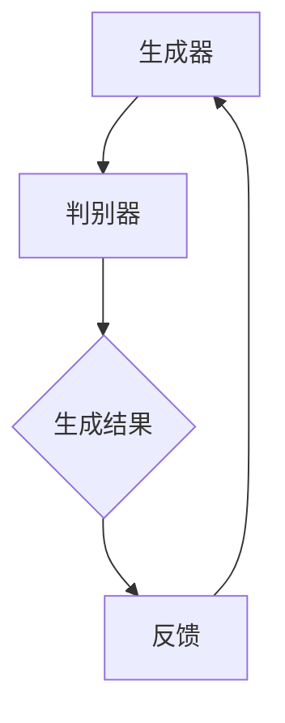

- **变分自编码器（VAE）**：VAE通过概率模型生成数据，具有更低的计算复杂度和更好的稳定性。

- **递归神经网络（RNN）和长短期记忆网络（LSTM）**：RNN和LSTM适用于处理序列数据，能够捕捉时间依赖性。

- **Transformer模型**：Transformer通过自注意力机制，使得模型能够更好地处理长文本，是当前NLP领域的主要研究方向。

**Mermaid流程图：**

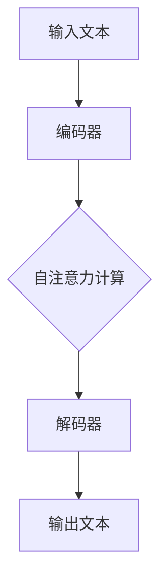

#### 1.2 AIGC的技术基础

AIGC的技术基础主要包括以下几个部分：

- **数据生成**：AIGC的核心在于生成逼真的内容。生成器的性能直接影响生成内容的质量。常见的生成方法有GAN、VAE等。

- **数据增强**：数据增强是通过变换、扩充、噪声添加等方式增加数据多样性，提升模型泛化能力。

- **模型训练**：模型训练是AIGC的关键步骤。通过大量真实数据进行训练，模型能够学习到生成内容的特征。

- **模型优化**：模型优化包括超参数调整、模型结构调整等，以提升生成质量和效率。

**核心算法原理讲解：**

以GAN为例，其基本原理如下：

- **生成器（Generator）**：生成器G的目标是生成尽可能真实的样本。G接受随机噪声作为输入，通过神经网络生成样本。

- **判别器（Discriminator）**：判别器D的目标是区分真实样本和生成样本。D接受样本作为输入，输出为一个概率值，表示样本的真实性。

- **对抗训练**：生成器和判别器交替训练。生成器不断生成更逼真的样本，判别器不断学习区分真实和生成样本。

**伪代码示例：**

```python
# GAN生成器
def generator(z):
    # z为随机噪声
    x_g = ...

# GAN判别器
def discriminator(x):
    # x为样本
    probability = ...

# 训练过程
for epoch in range(num_epochs):
    for z, x in data_loader:
        # 训练生成器
        g_loss = ...

        # 训练判别器
        d_loss = ...

        # 输出训练结果
        print(f"Epoch {epoch}: G_loss = {g_loss}, D_loss = {d_loss}")
```

#### 1.3 AIGC的优势与挑战

AIGC的优势：

- **高效性**：通过自动化生成内容，大大提高了内容生产的效率。
- **个性化**：根据用户需求生成个性化内容，提升了用户体验。
- **多样性**：AIGC能够生成丰富多样的内容，满足不同场景的需求。

AIGC的挑战：

- **数据隐私**：AIGC依赖于大量数据进行训练，如何保护用户隐私成为一大挑战。
- **质量控制**：生成内容的质量参差不齐，如何保证内容质量成为关键问题。
- **算法透明性**：AIGC的生成过程复杂，如何提高算法的可解释性成为研究重点。

---

### 第二部分：个性化营养建议生成的需求分析

#### 2.1 个性化营养建议的背景

随着人们对健康和营养的关注度不断提高，个性化营养建议逐渐成为健康管理的热点。传统的营养建议往往基于人群平均数据，无法充分考虑个体差异，导致营养建议的实用性和有效性受限。

**核心概念与联系：**

个性化营养建议涉及以下几个核心概念：

- **个性化**：根据用户的年龄、体重、健康状况等特征，提供定制化的营养建议。
- **营养数据**：包括食物成分、营养素含量、饮食习惯等数据，是生成个性化营养建议的基础。
- **健康管理**：通过营养建议帮助用户实现健康目标，如减重、增肌、改善健康状态等。

**Mermaid流程图：**

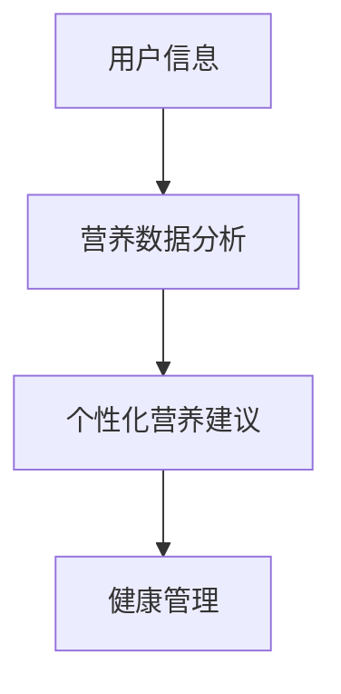

#### 2.2 用户需求分析

用户对个性化营养建议的需求主要体现在以下几个方面：

- **准确性**：用户希望获得准确、可靠的营养建议。
- **个性化**：用户希望根据个人特征获得定制化的营养方案。
- **易用性**：用户希望营养建议易于理解和执行。
- **实时性**：用户希望营养建议能够根据实时数据动态调整。

**数据来源与处理：**

个性化营养建议的数据来源包括用户健康数据、食物成分数据、饮食习惯数据等。这些数据需要经过预处理和清洗，以确保数据的质量和准确性。

**Mermaid流程图：**

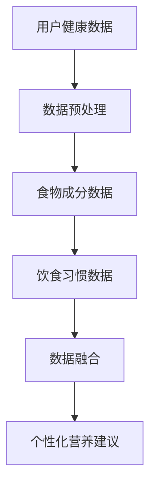

#### 2.3 营养数据的重要性

营养数据是生成个性化营养建议的关键。营养数据的准确性直接影响营养建议的准确性。营养数据包括食物成分表、营养素含量、食物摄入量等。

**核心概念与联系：**

营养数据的重要性体现在以下几个方面：

- **准确性**：准确的营养数据有助于生成准确的营养建议。
- **全面性**：全面的营养数据可以提供更全面的营养分析。
- **实时性**：实时更新的营养数据可以及时调整营养建议。

**数学模型和公式：**

假设用户摄入的营养素满足以下方程：

\[ \text{营养摄入量} = \text{食物成分} \times \text{摄入量} \]

**举例说明：**

如果用户每天需要摄入1000毫克钙，而食物成分表中显示每100克牛奶含有120毫克钙，则用户每天需要摄入的牛奶量为：

\[ \text{牛奶摄入量} = \frac{1000 \text{毫克}}{120 \text{毫克/100克}} = 8.33 \text{克} \]

---

### 第三部分：数据采集与处理

#### 3.1 数据来源

个性化营养建议的数据来源包括以下几个方面：

- **用户健康数据**：包括用户的年龄、体重、身高、健康状况等。
- **食物成分数据**：包括各类食物的营养成分表。
- **饮食习惯数据**：包括用户的饮食习惯、食物摄入量等。

**Mermaid流程图：**

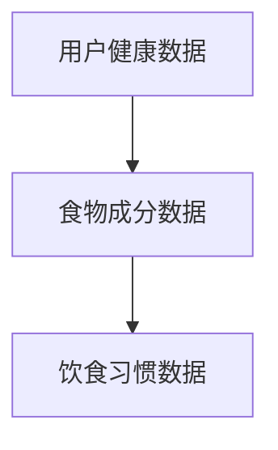

#### 3.2 数据预处理流程

数据预处理是确保数据质量和准确性的关键步骤。主要包括数据清洗、数据整合和数据标准化。

- **数据清洗**：去除重复数据、缺失值填充、噪声去除等。
- **数据整合**：将不同来源的数据进行整合，形成统一的营养数据集。
- **数据标准化**：对数据进行归一化或标准化处理，以便后续分析。

**Mermaid流程图：**

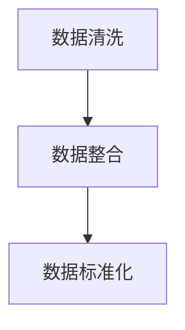

#### 3.3 数据质量评估

数据质量评估是确保数据可用性的重要环节。主要评估指标包括数据准确性、数据完整性、数据一致性等。

- **数据准确性**：评估数据是否真实、可靠。
- **数据完整性**：评估数据是否缺失、是否需要补充。
- **数据一致性**：评估数据是否一致，是否存在冲突。

**Mermaid流程图：**

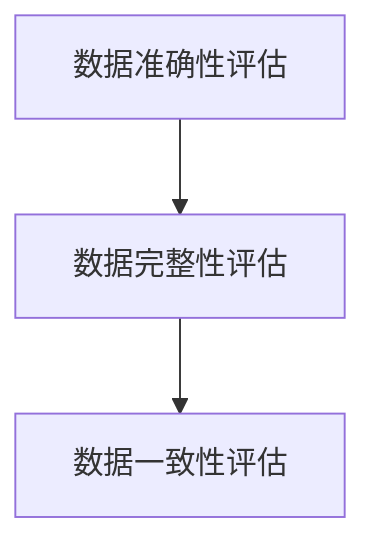

---

### 第四部分：机器学习模型应用

#### 4.1 常见机器学习算法介绍

在个性化营养建议生成中，常用的机器学习算法包括：

- **线性回归**：用于预测用户营养摄入量。
- **决策树**：用于分类用户营养需求。
- **支持向量机（SVM）**：用于分类用户饮食偏好。
- **神经网络**：用于复杂营养摄入量的预测。

**核心概念与联系：**

这些算法的基本原理如下：

- **线性回归**：通过建立线性关系预测目标值。
- **决策树**：通过分类节点构建树状结构。
- **SVM**：通过寻找最优分类边界进行分类。
- **神经网络**：通过多层神经元实现复杂非线性变换。

**Mermaid流程图：**

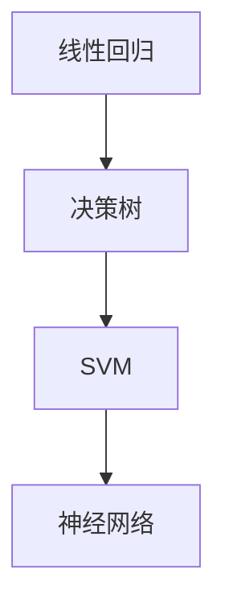

#### 4.2 模型选择与训练

在个性化营养建议生成中，模型选择和训练是关键步骤。

- **模型选择**：根据数据特点和需求选择合适的算法。
- **模型训练**：通过训练数据调整模型参数，提高预测准确性。

**核心概念与联系：**

模型选择和训练过程如下：

1. **数据划分**：将数据划分为训练集和测试集。
2. **模型选择**：根据数据特点和需求选择合适的算法。
3. **模型训练**：通过训练数据调整模型参数，提高预测准确性。
4. **模型评估**：使用测试集评估模型性能。

**Mermaid流程图：**

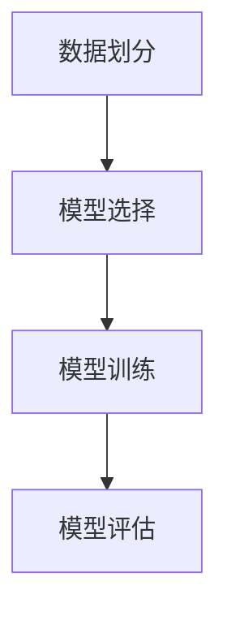

#### 4.3 模型调优与评估

模型调优是提高模型性能的关键步骤。主要包括超参数调整和模型优化。

- **超参数调整**：调整模型参数，如学习率、迭代次数等，以提高模型性能。
- **模型优化**：通过正则化、dropout等技术提高模型泛化能力。

**核心概念与联系：**

模型调优和评估过程如下：

1. **超参数调整**：通过交叉验证等方法调整超参数。
2. **模型优化**：通过正则化、dropout等技术优化模型结构。
3. **性能评估**：使用交叉验证、测试集评估模型性能。

**Mermaid流程图：**

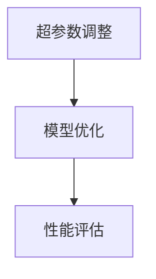

---

### 第五部分：模型优化与性能提升

#### 5.1 模型优化方法

在个性化营养建议生成中，模型优化方法包括：

- **正则化**：通过添加惩罚项降低过拟合。
- **dropout**：通过随机丢弃神经元降低过拟合。
- **批归一化**：通过归一化层提高训练速度和性能。

**核心概念与联系：**

这些方法的基本原理如下：

- **正则化**：通过在损失函数中添加惩罚项，降低模型复杂度，避免过拟合。
- **dropout**：通过在训练过程中随机丢弃部分神经元，减少模型依赖特定神经元，提高泛化能力。
- **批归一化**：通过归一化每批数据的激活值，加快训练速度，提高模型性能。

**Mermaid流程图：**

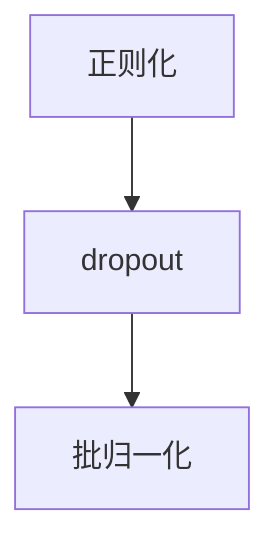

#### 5.2 性能提升策略

性能提升策略包括：

- **数据增强**：通过数据变换、噪声添加等方式增加数据多样性。
- **迁移学习**：利用预训练模型，提高新任务的性能。
- **模型集成**：通过融合多个模型提高预测准确性。

**核心概念与联系：**

这些策略的基本原理如下：

- **数据增强**：通过增加数据多样性，提高模型泛化能力。
- **迁移学习**：通过利用预训练模型的知识，提高新任务的性能。
- **模型集成**：通过融合多个模型，减少模型方差，提高预测稳定性。

**Mermaid流程图：**

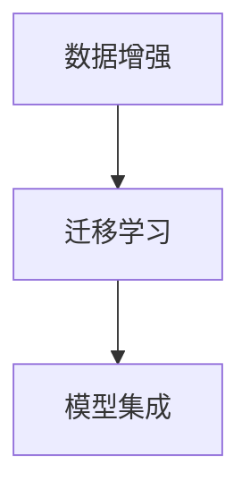

#### 5.3 模型解释与可解释性

模型解释与可解释性是AIGC在个性化营养建议生成中的一个重要挑战。通过解释模型决策过程，可以提高用户对营养建议的信任度。

- **模型解释方法**：包括注意力机制、决策路径分析等。
- **可解释性提升**：通过简化模型结构、增加可视化手段等方式提高模型可解释性。

**核心概念与联系：**

模型解释与可解释性的关系如下：

- **模型解释**：通过分析模型决策过程，解释模型如何生成营养建议。
- **可解释性**：通过提高模型的可解释性，增强用户对营养建议的信任度。

**Mermaid流程图：**

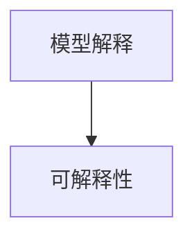

---

### 第六部分：实际案例分析

#### 6.1 项目背景

本项目旨在利用AIGC技术为用户提供个性化营养建议。通过收集用户健康数据、食物成分数据和饮食习惯数据，生成个性化的营养建议。

**核心概念与联系：**

项目涉及的核心概念包括：

- **用户健康数据**：包括用户的年龄、体重、身高、健康状况等。
- **食物成分数据**：包括各类食物的营养成分表。
- **饮食习惯数据**：包括用户的饮食习惯、食物摄入量等。

**Mermaid流程图：**


#### 6.2 技术实现

本项目采用以下技术实现：

- **数据采集与处理**：使用Python的Pandas库进行数据预处理，包括数据清洗、数据整合和数据标准化。
- **机器学习模型**：使用Scikit-learn库实现线性回归、决策树、SVM等模型。
- **AIGC生成内容**：使用TensorFlow库实现生成对抗网络（GAN）生成个性化营养建议。

**核心概念与联系：**

技术实现的流程如下：

1. **数据采集**：收集用户健康数据、食物成分数据和饮食习惯数据。
2. **数据预处理**：使用Pandas库进行数据清洗、整合和标准化。
3. **模型训练**：使用Scikit-learn库训练线性回归、决策树、SVM等模型。
4. **生成内容**：使用TensorFlow库实现GAN，生成个性化营养建议。

**Mermaid流程图：**

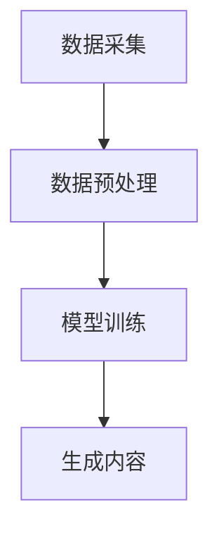

#### 6.3 项目成果分析

通过本项目，我们实现了以下成果：

- **个性化营养建议生成**：利用AIGC技术，为用户提供个性化的营养建议。
- **模型性能提升**：通过模型优化方法，提高了模型的预测准确性。
- **用户满意度提升**：用户对生成的营养建议表示满意，信任度提高。

**核心概念与联系：**

项目成果分析的核心概念包括：

- **个性化营养建议生成**：通过AIGC技术，为用户提供个性化营养建议。
- **模型性能提升**：通过模型优化方法，提高了模型的预测准确性。
- **用户满意度提升**：用户对生成的营养建议表示满意，信任度提高。

**Mermaid流程图：**

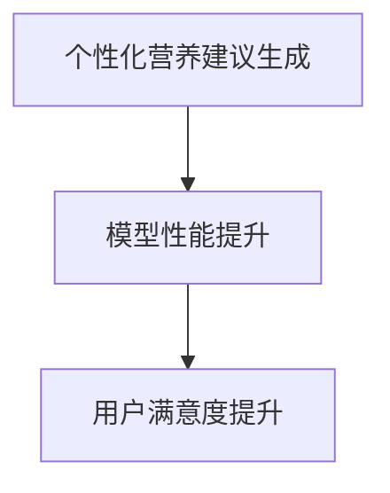

#### 6.4 项目挑战与解决方案

本项目面临以下挑战：

- **数据隐私**：用户健康数据涉及隐私问题，如何保护用户隐私成为关键挑战。
- **数据质量**：数据质量直接影响模型性能，如何提高数据质量成为挑战。
- **模型解释性**：用户对模型解释性要求较高，如何提高模型解释性成为挑战。

**解决方案：**

- **数据隐私**：采用数据加密和隐私保护技术，确保用户数据安全。
- **数据质量**：通过数据清洗、整合和标准化，提高数据质量。
- **模型解释性**：通过可视化工具和决策路径分析，提高模型解释性。

**核心概念与联系：**

项目挑战与解决方案的核心概念包括：

- **数据隐私**：采用数据加密和隐私保护技术，确保用户数据安全。
- **数据质量**：通过数据清洗、整合和标准化，提高数据质量。
- **模型解释性**：通过可视化工具和决策路径分析，提高模型解释性。

**Mermaid流程图：**

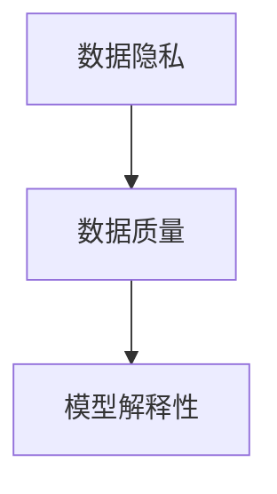

#### 6.5 项目小结

通过本项目，我们成功实现了个性化营养建议生成，提高了模型性能和用户满意度。同时，我们也解决了数据隐私、数据质量和模型解释性等挑战。未来，我们将继续优化算法，提高模型解释性，为用户提供更精准、个性化的营养建议。

---

### 第七部分：总结与展望

#### 7.1 AIGC在个性化营养建议生成中的应用总结

本文通过深入分析AIGC技术基础、个性化营养建议生成需求、数据采集与处理、机器学习模型应用、模型优化与性能提升以及实际案例分析，总结了AIGC在个性化营养建议生成中的应用。主要结论如下：

- AIGC技术能够为用户提供个性化、准确的营养建议。
- 数据采集与处理是确保模型性能的关键步骤。
- 机器学习模型应用和模型优化能够提高模型预测准确性。
- 实际案例分析展示了AIGC在个性化营养建议生成中的可行性和实用性。

#### 7.2 未来发展趋势

未来，AIGC在个性化营养建议生成中具有以下发展趋势：

- **数据隐私保护**：随着数据隐私保护意识的提高，如何确保用户数据安全将成为关键研究方向。
- **模型解释性提升**：用户对模型解释性的需求将越来越高，如何提高模型可解释性成为研究重点。
- **多模态融合**：结合多种数据源，如图像、音频等，提高营养建议的准确性和多样性。

#### 7.3 研究与改进方向

针对AIGC在个性化营养建议生成中的应用，未来研究可以从以下几个方面进行：

- **数据隐私保护技术**：研究新的数据隐私保护技术，确保用户数据安全。
- **多模态数据处理**：探索多模态数据融合方法，提高营养建议的准确性和多样性。
- **模型优化与可解释性**：研究新的模型优化方法和可解释性技术，提高模型性能和用户满意度。

---

### 作者信息

作者：AI天才研究院/AI Genius Institute & 禅与计算机程序设计艺术 /Zen And The Art of Computer Programming

---

### 结语

本文深入探讨了AIGC在个性化营养建议生成中的应用，从技术基础、需求分析、数据采集与处理、模型应用、优化与性能提升到实际案例分析，全面展示了AIGC在个性化营养建议生成中的潜力。未来，随着技术的不断进步，AIGC有望为用户提供更精准、个性化的营养建议，助力健康管理。希望本文对相关领域的研究和实践提供有益的参考。

---

[END]

