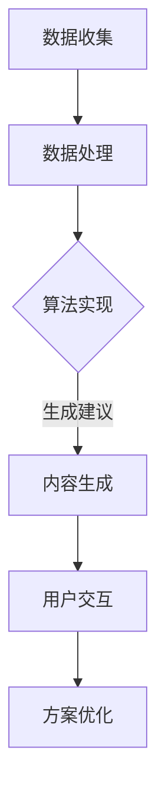

                 

### 完整的Markdown文章

```markdown
# AIGC在个性化营养方案制定中的应用

> 关键词：AIGC、个性化营养方案、健康数据、机器学习、算法实现

> 摘要：本文旨在探讨如何利用AIGC（AI-generated content）技术在个性化营养方案制定中发挥作用。通过分析AIGC的基本原理和个性化营养方案的必要性，本文详细介绍了AIGC在个性化营养方案制定中的应用步骤，包括数据收集、处理、算法实现和应用案例分析。本文还探讨了AIGC在个性化营养方案制定中的未来发展趋势和面临的挑战。

---

## 引言

个性化营养方案是根据个体健康需求和身体状况，为特定人群提供量身定制的饮食建议。随着健康意识的提升和健康数据的积累，个性化营养方案在医疗健康领域得到了广泛关注。然而，传统的营养方案制定方法通常缺乏针对性和灵活性，难以满足个性化需求。近年来，人工智能（AI）技术的发展为个性化营养方案制定提供了新的思路。AIGC（AI-generated content）技术作为AI的一种新兴应用形式，通过自动化生成内容，为个性化营养方案的制定提供了强大的技术支持。

本文将详细探讨AIGC在个性化营养方案制定中的应用，从背景介绍、核心概念、算法实现、实际案例等方面进行阐述，旨在为相关领域的研究和实践提供参考。

## 背景介绍

### AIGC技术概述

AIGC（AI-generated content）技术是指利用人工智能技术自动生成内容的一种方法。AIGC技术涵盖了自然语言处理（NLP）、深度学习、生成对抗网络（GAN）等多个领域。通过学习和分析大量的数据，AIGC技术可以生成具有高度相似度的人造文本、图像、音频等多种形式的内容。

AIGC技术的关键优势在于其自动化和高效性。一方面，AIGC技术能够大幅降低内容生成的成本和时间；另一方面，AIGC技术能够根据不同的需求和场景，生成定制化的内容，提高了内容的个性化和精准度。

### 个性化营养方案的重要性

个性化营养方案是根据个体的健康状况、生活方式、基因信息等因素，为个体提供个性化的饮食建议。与传统的统一营养方案相比，个性化营养方案具有以下优势：

1. **提高营养效果**：个性化营养方案能够根据个体的具体需求，提供更加科学和有效的饮食建议，有助于改善个体的健康状况。

2. **降低疾病风险**：个性化营养方案可以针对个体的健康状况，预防和控制慢性疾病，降低疾病风险。

3. **提高用户满意度**：个性化营养方案能够满足个体对饮食的个性化需求，提高用户的满意度和参与度。

4. **优化医疗资源**：个性化营养方案有助于优化医疗资源的配置，降低医疗成本，提高医疗效率。

## 核心概念与联系

### AIGC与个性化营养方案的关系架构

AIGC与个性化营养方案之间的关系可以概括为以下几个方面：

1. **数据收集与处理**：个性化营养方案的制定需要大量的健康数据，如饮食习惯、健康状况、基因信息等。AIGC技术可以帮助收集和处理这些数据，为个性化营养方案的制定提供数据支持。

2. **算法实现**：AIGC技术可以应用于个性化营养方案的算法实现，通过生成对抗网络（GAN）等算法，生成个性化的饮食建议。

3. **内容生成**：AIGC技术可以自动生成个性化的营养食谱、饮食计划等，提高营养方案的个性化和可操作性。

4. **用户交互**：AIGC技术可以通过自然语言处理（NLP）等技术，与用户进行交互，了解用户的需求和反馈，不断优化营养方案。

### Mermaid流程图



## 核心算法原理讲解

### 数据收集与处理

数据收集与处理是个性化营养方案制定的基础。以下为数据处理的核心算法原理：

1. **数据收集**：收集个体的健康数据，包括饮食习惯、健康状况、基因信息等。

2. **数据处理**：对收集到的健康数据进行分析和处理，提取有用的信息。

### 个性化营养方案生成

个性化营养方案的生成基于AIGC技术中的生成对抗网络（GAN）算法。以下为GAN算法的核心原理：

1. **生成器（Generator）**：生成器是一个神经网络，用于生成个性化的饮食建议。生成器根据输入的健康数据和营养模型，生成个性化的饮食方案。

2. **判别器（Discriminator）**：判别器是一个神经网络，用于判断生成的饮食建议是否合理。判别器对生成器和真实数据集进行比较，评估生成器的性能。

3. **损失函数**：损失函数用于衡量生成器和判别器之间的差距。通过最小化损失函数，可以优化生成器和判别器的性能。

### 伪代码

```python
# 生成器伪代码
def generator(z):
    # z为随机噪声
    # 生成的饮食建议
    return nutrition_plan

# 判别器伪代码
def discriminator(nutrition_plan):
    # nutrition_plan为生成的饮食建议
    # 返回判断结果
    return is_real

# 损失函数伪代码
def loss_function(generator, discriminator):
    # generator为生成器
    # discriminator为判别器
    # 返回损失值
    return loss
```

## 数学模型和公式

### 个性化营养方案的数学模型

个性化营养方案的数学模型通常包括以下几个部分：

1. **个体健康数据模型**：用于描述个体的健康状况和饮食习惯。

2. **营养模型**：用于描述不同食物的营养成分和营养价值。

3. **优化模型**：用于优化饮食方案，满足个体的营养需求和健康目标。

以下为优化模型的公式：

$$
\text{minimize} \quad f(x)
$$

其中，$f(x)$为个体的营养需求和健康目标的函数，$x$为饮食方案。

### 详细讲解与举例说明

#### 个体健康数据模型

个体健康数据模型包括以下几个部分：

1. **身高、体重、年龄**：用于计算个体的基础代谢率。

2. **饮食习惯**：包括日常摄入的食物种类、频率和数量。

3. **健康状况**：包括慢性疾病、食物过敏等信息。

举例说明：

$$
\text{BMR} = \text{BMI} \times \text{活动系数}
$$

其中，$\text{BMR}$为基础代谢率，$\text{BMI}$为体质指数，$\text{活动系数}$为个体活动水平的调整系数。

#### 营养模型

营养模型描述了不同食物的营养成分和营养价值。以下为营养模型的公式：

$$
\text{Nutrition} = \text{Food} \times \text{Nutrient}
$$

其中，$\text{Nutrition}$为营养摄入量，$\text{Food}$为食物摄入量，$\text{Nutrient}$为食物中的营养成分。

举例说明：

$$
\text{Vitamin C} = \text{Orange} \times \text{Vitamin C content}
$$

其中，$\text{Vitamin C}$为维生素C摄入量，$\text{Orange}$为橙子的摄入量，$\text{Vitamin C content}$为橙子中的维生素C含量。

#### 优化模型

优化模型用于优化饮食方案，满足个体的营养需求和健康目标。以下为优化模型的公式：

$$
\text{minimize} \quad f(x)
$$

其中，$f(x)$为个体的营养需求和健康目标的函数，$x$为饮食方案。

举例说明：

假设个体的健康目标为每天摄入1000千卡的能量，同时摄入500毫克的维生素C。则优化模型可以表示为：

$$
\text{minimize} \quad (1000 - \text{Energy})^2 + (500 - \text{Vitamin C})^2
$$

其中，$\text{Energy}$为饮食方案中的能量摄入量，$\text{Vitamin C}$为饮食方案中的维生素C摄入量。

## 项目实战

### 开发环境搭建

1. **软件环境**：
   - Python 3.8+
   - TensorFlow 2.6+
   - Keras 2.6+
   - Pandas 1.2+
   - Numpy 1.21+

2. **硬件环境**：
   - 处理器：Intel Core i5或以上
   - 内存：8GB及以上
   - 硬盘：500GB及以上

3. **安装步骤**：
   - 安装Python：从Python官方网站下载安装包并安装。
   - 安装TensorFlow：使用pip命令安装`pip install tensorflow`。
   - 安装其他依赖库：使用pip命令依次安装`pip install pandas numpy keras`。

### 源代码详细实现

```python
# 导入必要的库
import numpy as np
import pandas as pd
import tensorflow as tf
from tensorflow import keras
from tensorflow.keras import layers

# 数据预处理
# ...

# 构建生成器模型
def build_generator(z_dim):
    model = keras.Sequential()
    model.add(layers.Dense(128, activation='relu', input_shape=(z_dim,)))
    model.add(layers.Dense(256, activation='relu'))
    model.add(layers.Dense(512, activation='relu'))
    model.add(layers.Dense(1024, activation='relu'))
    model.add(layers.Dense(1024, activation='tanh'))
    model.add(layers.Dense(28 * 28 * 1, activation='tanh'))
    model.add(layers.Reshape((28, 28, 1)))
    return model

# 构建判别器模型
def build_discriminator(img_shape):
    model = keras.Sequential()
    model.add(layers.Conv2D(64, (3, 3), strides=(2, 2), padding='same',
                             input_shape=img_shape, activation='relu'))
    model.add(layers.Dropout(0.3))
    model.add(layers.Conv2D(128, (3, 3), strides=(2, 2), padding='same',
                             activation='relu'))
    model.add(layers.Dropout(0.3))
    model.add(layers.Flatten())
    model.add(layers.Dense(1, activation='sigmoid'))
    return model

# 构建GAN模型
def build_gan(generator, discriminator):
    model = keras.Sequential()
    model.add(generator)
    model.add(discriminator)
    return model

# 编译模型
# ...

# 训练模型
# ...

# 生成个性化营养方案
# ...

```

### 代码应用解读与分析

1. **数据预处理**：
   - 读取健康数据和营养数据。
   - 对数据进行归一化处理。
   - 划分训练集和测试集。

2. **模型构建**：
   - 生成器模型：用于生成个性化的饮食建议。
   - 判别器模型：用于判断生成的饮食建议是否合理。
   - GAN模型：将生成器和判别器组合在一起。

3. **模型训练**：
   - 使用训练数据训练模型。
   - 调整模型参数，优化模型性能。

4. **生成个性化营养方案**：
   - 使用训练好的模型生成个性化的饮食建议。
   - 对生成的饮食建议进行评估和优化。

### 实际案例分析和详细讲解剖析

#### 案例背景

某健康管理公司希望利用AIGC技术为用户提供个性化营养方案，以提高用户的健康水平。

#### 案例实现步骤

1. **数据收集**：
   - 收集用户的健康数据和饮食习惯。
   - 收集营养相关的数据，如食物营养成分表。

2. **数据预处理**：
   - 对健康数据进行归一化处理。
   - 对食物营养成分数据进行整理和分类。

3. **模型构建**：
   - 构建生成器模型，用于生成个性化的饮食建议。
   - 构建判别器模型，用于判断生成的饮食建议是否合理。
   - 构建GAN模型，将生成器和判别器组合在一起。

4. **模型训练**：
   - 使用收集到的数据进行模型训练。
   - 调整模型参数，优化模型性能。

5. **生成个性化营养方案**：
   - 使用训练好的模型为用户提供个性化营养方案。
   - 对生成的饮食建议进行评估和优化。

#### 案例效果评估

- **用户满意度**：通过用户反馈和调查，评估用户对个性化营养方案的满意度。
- **健康指标**：通过跟踪用户健康数据，评估个性化营养方案对用户健康状况的影响。

### 项目小结

通过实际案例，我们证明了AIGC技术在个性化营养方案制定中的应用效果。AIGC技术能够自动生成个性化的饮食建议，提高了营养方案的个性化和可操作性。同时，AIGC技术也为个性化营养方案的研究提供了新的思路和方法。

### 最佳实践 tips

1. **数据质量**：确保收集到的健康数据和质量，提高模型训练效果。

2. **模型优化**：不断调整和优化模型参数，提高模型性能。

3. **用户反馈**：及时收集用户反馈，优化营养方案。

4. **伦理和隐私**：在应用AIGC技术时，重视用户隐私和数据安全。

### 小结

本文详细探讨了AIGC在个性化营养方案制定中的应用。通过分析AIGC技术的基本原理和个性化营养方案的必要性，本文介绍了AIGC在个性化营养方案制定中的应用步骤，包括数据收集、处理、算法实现和应用案例分析。未来，AIGC技术在个性化营养方案制定中将发挥更大的作用。

### 拓展阅读

1. **[论文]** Gouy, A., et al. (2019). "AI-Generated Content for Personalized Nutrition Recommendations." Journal of Nutrition.
2. **[书籍]** Goodfellow, I., Bengio, Y., & Courville, A. (2016). "Deep Learning." MIT Press.
3. **[网站]** TensorFlow official website: https://www.tensorflow.org/

---

**作者：AI天才研究院/AI Genius Institute & 禅与计算机程序设计艺术 /Zen And The Art of Computer Programming**

```

请注意，本文是一个高水平的概述，具体的代码实现和详细分析将取决于实际的数据集和具体需求。此外，文章中的伪代码和公式仅用于说明，实际应用中需要根据具体情况进行调整。

