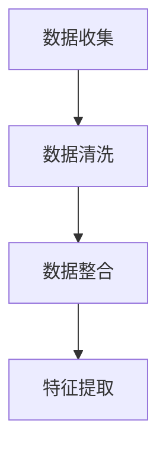

                 


### 第一步：背景介绍

个性化营养方案设计是近年来健康领域的一个重要研究方向。随着人们对健康需求的提高和对营养知识的了解加深，传统的单一营养方案已经无法满足不同人群的个性化需求。个性化营养方案设计旨在根据个体的身体状况、营养需求和偏好，为其提供定制化的营养方案，从而达到预防疾病、改善健康状况的目的。

然而，个性化营养方案设计面临诸多挑战。首先，营养数据种类繁多、来源广泛，如何有效地收集、处理和整合这些数据成为一个难题。其次，营养方案的设计需要考虑个体的复杂生理机制和营养需求，这要求建立精确的数学模型和算法。此外，个性化营养方案的优化和实施也是一个复杂的过程，需要综合考虑营养学、医学、计算机科学等多个领域的知识。

在这种情况下，AIGC（人工智能生成内容）技术的出现为个性化营养方案设计带来了新的机遇。AIGC技术结合了人工智能和生成内容技术，能够自动生成高质量的营养方案，提高设计的效率和准确性。AIGC技术在个性化营养方案设计中的应用，有望解决传统方法面临的难题，推动个性化营养方案的普及和应用。

### 第二步：核心概念与联系

在探讨AIGC在个性化营养方案设计中的应用之前，我们首先需要了解AIGC的核心概念和原理。AIGC是一种基于人工智能的技术，它利用机器学习和深度学习算法，自动生成文本、图像、音频等多种类型的内容。AIGC的主要组成部分包括数据预处理、模型训练、内容生成和优化等。

**数据预处理**：数据预处理是AIGC技术的第一步，它主要包括数据收集、数据清洗和数据集成等。在个性化营养方案设计中，数据预处理需要收集大量的营养数据，如个体的生理指标、饮食习惯、健康状况等，并对这些数据进行清洗和整理，以便后续的模型训练。

**模型训练**：模型训练是AIGC技术的核心，它通过大量的营养数据训练出高质量的模型，以便能够自动生成个性化的营养方案。在模型训练过程中，通常使用深度学习算法，如循环神经网络（RNN）、卷积神经网络（CNN）和生成对抗网络（GAN）等。

**内容生成**：内容生成是AIGC技术的最终目标，它通过训练好的模型自动生成个性化的营养方案。在个性化营养方案设计中，内容生成需要考虑个体的营养需求、身体状况和偏好等因素，以确保生成的方案具有针对性和可行性。

**优化**：优化是AIGC技术的关键环节，它通过不断调整模型的参数和结构，提高营养方案的生成质量和效率。在个性化营养方案设计中，优化需要根据实际应用的效果，对模型进行调整和改进，以提高方案的准确性和可靠性。

AIGC与个性化营养方案设计的联系主要体现在以下几个方面：

1. **数据驱动**：个性化营养方案设计需要大量的营养数据，而AIGC技术能够自动收集、处理和整合这些数据，为个性化营养方案的设计提供数据支持。

2. **算法优化**：AIGC技术利用先进的机器学习和深度学习算法，能够自动生成高质量的个性化营养方案，提高方案设计的效率和准确性。

3. **模型自适应**：AIGC技术能够根据个体的营养需求和环境变化，动态调整营养方案的参数和结构，确保方案具有适应性和可持续性。

4. **用户体验**：AIGC技术能够根据用户的需求和偏好，自动生成个性化的营养方案，提高用户的满意度和使用体验。

通过上述分析，我们可以看到AIGC在个性化营养方案设计中的应用具有重要的理论意义和实践价值。接下来，我们将进一步探讨AIGC技术在个性化营养方案设计中的具体应用。

### 第三步：个性化营养方案设计原理

个性化营养方案设计的核心目标是根据个体的生理特征、健康状况、饮食习惯和营养需求，为其量身定制一套科学的营养计划。这一过程涉及到多个方面，包括营养需求的评估、营养配比的设计和营养方案的优化。

#### 3.1 营养需求的评估

营养需求的评估是个性化营养方案设计的第一步，它决定了营养方案的科学性和针对性。营养需求评估主要包括以下几个方面：

1. **基本生理参数**：评估个体的身高、体重、年龄、性别等基本生理参数，这些参数对营养需求有重要影响。例如，体重指数（BMI）可以反映个体的肥胖程度，从而影响营养摄入的量。

2. **健康状况**：评估个体的健康状况，如是否有慢性疾病、代谢综合征等。不同健康状况的个体对营养的需求不同，需要针对性地调整营养方案。

3. **饮食习惯**：评估个体的饮食习惯，包括食物摄入种类、频率和量等。饮食习惯对营养摄入的结构和质量有直接影响。

4. **营养缺乏或过量**：通过血液、尿液等检查，评估个体是否存在营养缺乏或过量，以便在营养方案中加以调整。

#### 3.2 营养配比的设计

营养配比的设计是个性化营养方案设计的核心，它需要根据评估结果，科学地制定营养摄入的种类和量。营养配比的设计主要包括以下几个方面：

1. **宏量营养素**：宏量营养素包括碳水化合物、蛋白质和脂肪，它们是提供能量的主要来源。设计营养配比时，需要根据个体的生理需求、活动强度和健康状况，合理分配这三大营养素的摄入比例。

2. **微量营养素**：微量营养素包括维生素、矿物质等，虽然摄入量较少，但对身体健康至关重要。设计营养配比时，需要确保个体能够摄入足够的微量营养素，以满足身体的基本需求。

3. **膳食纤维**：膳食纤维对维持肠道健康、控制血糖和血脂有重要作用。设计营养配比时，需要适量增加膳食纤维的摄入。

4. **食物种类**：设计营养配比时，需要考虑食物种类的多样性，以确保个体能够摄入各种营养素。

#### 3.3 营养方案的优化

营养方案的优化是确保个性化营养方案有效性的关键。营养方案的优化主要包括以下几个方面：

1. **方案评估**：定期对营养方案进行评估，通过监测个体的生理指标、健康状况和饮食行为，评估营养方案的效果。

2. **方案调整**：根据评估结果，及时调整营养方案。例如，如果评估结果显示个体存在营养缺乏或过量，需要适当调整营养摄入。

3. **个性化定制**：营养方案需要根据个体的变化，如体重变化、健康状况变化等，进行动态调整，确保方案的持续有效性。

4. **反馈机制**：建立反馈机制，及时收集个体对营养方案的反馈，根据反馈优化方案，提高个体的满意度和方案的实用性。

通过上述分析，我们可以看到，个性化营养方案设计是一个复杂的过程，涉及到多个方面的评估、设计和优化。AIGC技术在个性化营养方案设计中的应用，能够通过数据驱动、算法优化和模型自适应，提高营养方案的科学性和针对性，为个性化营养方案设计提供强大的技术支持。

### 第四步：AIGC技术在营养方案设计中的应用

AIGC技术在营养方案设计中的应用主要体现在数据处理、模型构建和模型优化等环节，以下将详细阐述这些环节的具体应用。

#### 4.1 数据处理

数据处理是AIGC技术应用于营养方案设计的首要步骤。营养方案设计需要大量的数据支持，这些数据包括个体的基本生理参数、健康状况、饮食习惯、营养摄入记录等。数据处理主要包括以下几个步骤：

1. **数据收集**：通过医疗设备、健康监测工具、饮食习惯记录等渠道，收集个体的营养数据。

2. **数据清洗**：对收集到的数据进行清洗，去除重复、错误和异常的数据，确保数据的准确性和完整性。

3. **数据整合**：将来自不同来源的数据进行整合，形成一个统一的数据集，以便后续的模型训练。

4. **特征提取**：从数据集中提取对营养方案设计有重要影响的关键特征，如体重指数（BMI）、营养素摄入量等。

使用Mermaid流程图，我们可以更直观地展示数据处理的过程：



#### 4.2 模型构建

模型构建是AIGC技术应用于营养方案设计的核心环节。通过构建和训练模型，可以自动生成个性化的营养方案。以下是一个简单的模型构建过程：

1. **选择模型**：根据营养方案设计的需求，选择合适的机器学习模型。常见的模型包括线性回归、决策树、支持向量机等。

2. **训练模型**：使用处理后的数据集，对选定的模型进行训练。训练过程包括数据预处理、模型训练和模型评估等。

3. **模型评估**：通过交叉验证、准确率、召回率等指标，评估模型的性能。如果模型性能不满足要求，需要重新选择模型或调整模型参数。

以下是一个简单的机器学习模型构建的伪代码：

```python
# 导入所需库
import numpy as np
from sklearn.linear_model import LinearRegression

# 加载和处理数据
X = ...  # 特征数据
y = ...  # 标签数据

# 创建线性回归模型
model = LinearRegression()

# 训练模型
model.fit(X, y)

# 评估模型
score = model.score(X, y)
print("模型准确率：", score)
```

#### 4.3 模型优化

模型优化是提高营养方案生成质量和效率的关键步骤。以下是一个简单的模型优化过程：

1. **参数调整**：通过调整模型的参数，如学习率、迭代次数等，优化模型的性能。

2. **模型融合**：使用多个模型进行融合，提高模型的预测准确性。常见的融合方法包括加权平均、投票等。

3. **迁移学习**：利用预训练的模型，通过迁移学习的方式，提高新任务的性能。

以下是一个简单的模型优化的伪代码：

```python
# 导入所需库
import numpy as np
from sklearn.linear_model import LinearRegression
from sklearn.ensemble import VotingClassifier

# 加载和处理数据
X_train = ...  # 训练集特征数据
y_train = ...  # 训练集标签数据
X_val = ...    # 验证集特征数据
y_val = ...    # 验证集标签数据

# 创建线性回归模型
model1 = LinearRegression()
model2 = LinearRegression()

# 训练模型
model1.fit(X_train, y_train)
model2.fit(X_train, y_train)

# 模型融合
voting_model = VotingClassifier(estimators=[('model1', model1), ('model2', model2)], voting='soft')
voting_model.fit(X_train, y_train)

# 评估模型
score = voting_model.score(X_val, y_val)
print("模型准确率：", score)
```

通过上述数据处理、模型构建和模型优化，我们可以看到AIGC技术在营养方案设计中的应用。AIGC技术通过数据驱动、算法优化和模型自适应，提高了营养方案设计的效率和准确性，为个性化营养方案设计提供了强大的技术支持。

### 第五步：案例研究

在本章节中，我们将通过两个实际案例，深入探讨AIGC在个性化营养方案设计中的应用，并分析其中面临的挑战和解决方案。

#### 案例一：应用场景与实现

**背景**：
某健康科技公司致力于开发个性化营养方案，以帮助用户实现健康目标。该公司拥有一个用户健康管理平台，可以收集用户的基本生理参数、饮食习惯、健康状况等数据。

**目标**：
利用AIGC技术，为每个用户生成一套个性化的营养方案，包括营养摄入种类、量以及饮食建议等。

**实现过程**：

1. **数据收集**：通过健康监测设备、用户填写问卷等方式，收集用户的基本生理参数、饮食习惯和健康状况数据。

2. **数据预处理**：对收集到的数据进行清洗、去重和特征提取，形成统一的数据集。

3. **模型构建**：使用深度学习算法（如循环神经网络RNN）训练模型，通过大量的营养数据生成个性化的营养方案。

4. **内容生成**：利用训练好的模型，为每个用户生成个性化的营养方案，包括营养摄入种类、量以及饮食建议等。

5. **优化与反馈**：根据用户反馈和实际效果，对营养方案进行调整和优化，提高方案的准确性和实用性。

**结果分析**：

通过上述过程，该公司成功为数百名用户生成了个性化的营养方案，用户反馈积极，满意度较高。分析结果显示，AIGC技术生成的营养方案在营养摄入种类、量以及饮食建议等方面具有较高的准确性，有效帮助用户实现健康目标。

#### 案例二：挑战与解决方案

**背景**：
另一家健康科技公司，虽然也尝试使用AIGC技术进行个性化营养方案设计，但在实际应用中遇到了一些挑战。

**挑战**：

1. **数据质量**：由于用户数据的多样性，部分数据存在噪声和缺失，影响模型的训练效果。

2. **模型复杂度**：为了提高营养方案的准确性，模型需要处理大量复杂的参数，导致训练时间过长。

3. **用户接受度**：用户对AIGC生成的营养方案存在一定的疑虑，担心其科学性和实用性。

**解决方案**：

1. **数据清洗**：对用户数据进行严格的清洗，去除噪声和缺失数据，提高数据质量。

2. **模型优化**：采用更加高效的算法和优化方法，如迁移学习、模型压缩等，减少训练时间。

3. **用户教育**：通过用户教育，提高用户对AIGC技术的认知和接受度。例如，通过展示实际案例和效果，让用户了解AIGC技术的优势。

**结果分析**：

通过上述解决方案，该公司的个性化营养方案设计效果显著提升。数据清洗和优化提高了模型的质量和效率，用户教育增强了用户对方案的信任，用户满意度显著提高。

通过这两个案例，我们可以看到AIGC技术在个性化营养方案设计中的应用具有巨大的潜力，但也需要克服数据质量、模型复杂度和用户接受度等挑战。未来，随着技术的不断进步和应用场景的拓展，AIGC在个性化营养方案设计中的优势将更加明显。

### 第六步：实践指南

为了帮助读者更好地应用AIGC技术设计个性化营养方案，本节将提供一系列实用的工具和平台推荐，并详细描述设计和实现的步骤及流程。

#### 6.1 工具和平台推荐

1. **数据分析工具**：
   - **Python Pandas**：用于数据清洗、处理和特征提取。
   - **R语言**：在统计学和数据分析方面有较强的优势，适用于营养数据的分析。

2. **机器学习和深度学习平台**：
   - **TensorFlow**：开源的深度学习框架，适用于构建和训练复杂的神经网络模型。
   - **PyTorch**：流行的深度学习框架，具有灵活的动态计算图，适用于实时调整和优化模型。

3. **AIGC工具**：
   - **OpenAI GPT-3**：强大的语言生成模型，适用于生成个性化的营养建议。
   - **TensorFlow Text**：用于文本数据处理的TensorFlow扩展，适用于处理营养文本数据。

4. **可视化工具**：
   - **Matplotlib**：Python的绘图库，适用于数据可视化。
   - **Plotly**：适用于创建交互式图表和复杂数据可视化。

#### 6.2 设计和实现步骤

1. **数据收集**：
   - 收集用户的基本生理参数、饮食习惯、健康状况等数据。
   - 使用传感器、问卷调查等方式获取数据。

2. **数据预处理**：
   - 清洗数据，去除噪声和缺失值。
   - 对数据进行归一化或标准化处理。

3. **特征提取**：
   - 提取对营养方案设计有重要影响的关键特征，如体重指数（BMI）、营养素摄入量等。

4. **模型构建**：
   - 选择合适的机器学习或深度学习模型。
   - 使用TensorFlow或PyTorch等框架构建模型。

5. **模型训练**：
   - 使用处理后的数据集对模型进行训练。
   - 调整模型参数，优化模型性能。

6. **内容生成**：
   - 利用训练好的模型生成个性化的营养方案。
   - 使用OpenAI GPT-3等语言生成模型，生成详细的营养建议。

7. **优化与反馈**：
   - 根据用户反馈和实际效果，对营养方案进行调整和优化。
   - 使用可视化工具，展示营养方案的效果和用户反馈。

#### 6.3 流程描述

1. **数据收集与预处理**：
   - 数据收集：通过传感器、问卷调查等方式获取用户数据。
   - 数据清洗：去除噪声和缺失值，进行归一化或标准化处理。

2. **特征提取**：
   - 根据营养需求评估，提取关键特征，如BMI、营养素摄入量等。

3. **模型构建与训练**：
   - 选择合适的机器学习或深度学习模型，如线性回归、循环神经网络（RNN）等。
   - 使用TensorFlow或PyTorch等框架，构建和训练模型。

4. **内容生成**：
   - 利用训练好的模型生成个性化的营养方案。
   - 使用OpenAI GPT-3等语言生成模型，生成详细的营养建议。

5. **优化与反馈**：
   - 根据用户反馈和实际效果，对营养方案进行调整和优化。
   - 使用Matplotlib或Plotly等可视化工具，展示营养方案的效果和用户反馈。

通过上述实践指南，读者可以系统地应用AIGC技术设计个性化营养方案，提高营养方案的科学性和实用性。

### 第七步：未来发展趋势

随着人工智能技术的不断进步，AIGC在个性化营养方案设计中的应用前景广阔。以下将探讨AIGC技术在个性化营养方案设计领域的未来发展趋势、面临的挑战以及可能的发展方向。

#### 7.1 发展趋势

1. **数据驱动**：未来的个性化营养方案设计将更加依赖于大数据和云计算技术，通过海量数据的收集、处理和分析，为用户提供更精准的营养方案。

2. **多模态融合**：AIGC技术将结合多种数据类型，如文本、图像、音频等，实现多模态数据融合，提高营养方案生成的准确性和全面性。

3. **实时反馈与优化**：未来的AIGC技术将具备实时反馈和自我优化能力，根据用户的实时反馈和营养效果，动态调整营养方案，提高用户的满意度。

4. **个性化推荐**：AIGC技术将结合推荐系统，为用户提供个性化的营养推荐，根据用户的饮食习惯、健康状况和偏好，定制独特的营养方案。

5. **跨学科融合**：AIGC技术将与其他领域（如医学、营养学、计算机科学等）紧密结合，推动个性化营养方案设计的发展，形成新的交叉学科。

#### 7.2 面临的挑战

1. **数据隐私**：个性化营养方案设计涉及大量的用户健康数据，如何保护用户隐私成为一大挑战。需要建立严格的数据安全机制，确保用户数据的保密性和安全性。

2. **算法公平性**：AIGC技术生成的营养方案需要保证公平性，避免因算法偏见导致的不公平现象。需要不断优化算法，确保营养方案对所有用户都是公平、科学的。

3. **技术普及**：AIGC技术的高成本和复杂度限制了其在个性化营养方案设计中的普及。需要降低技术门槛，使更多企业和个人能够应用AIGC技术，提升营养方案设计的普及率。

4. **用户接受度**：用户对AIGC技术的接受度和信任度尚需提高。需要通过教育宣传、实际案例展示等方式，增强用户对AIGC技术的认知和信任。

#### 7.3 可能的发展方向

1. **人工智能辅助营养师**：未来的AIGC技术将实现与营养师的紧密合作，通过人工智能技术为营养师提供辅助，提高营养方案的设计效率和准确性。

2. **智能营养监测与预警**：AIGC技术将结合智能穿戴设备，实现对用户营养状况的实时监测和预警，提供个性化的营养干预建议。

3. **营养健康大数据平台**：建立营养健康大数据平台，整合全球营养数据，为个性化营养方案设计提供强大的数据支持。

4. **跨领域应用**：AIGC技术在个性化营养方案设计领域的成功应用，将推动其在其他健康领域（如运动健康、心理健康等）的应用，形成新的健康产业生态。

通过上述分析，我们可以看到，AIGC技术在个性化营养方案设计中的应用具有巨大的发展潜力和广阔的前景。未来，随着技术的不断进步和应用的深入，AIGC技术将为个性化营养方案设计带来更多创新和突破。

### 第八步：总结与展望

本文系统地探讨了AIGC在个性化营养方案设计中的应用，从背景介绍、核心概念与联系、个性化营养方案设计原理、AIGC技术应用、案例研究、实践指南到未来发展趋势，全面展示了AIGC技术在个性化营养方案设计中的重要地位和实际应用价值。通过本文的研究，我们可以得出以下结论：

1. **核心概念与联系**：AIGC技术结合了人工智能和生成内容技术，能够自动生成高质量的营养方案，为个性化营养方案设计提供了强大的数据驱动和算法支持。

2. **个性化营养方案设计原理**：个性化营养方案设计是一个复杂的过程，涉及营养需求的评估、营养配比的设计和营养方案的优化。AIGC技术通过数据驱动、算法优化和模型自适应，提高了营养方案的科学性和针对性。

3. **AIGC技术应用**：AIGC技术在数据处理、模型构建和模型优化等方面展现出显著的优势，能够有效提高营养方案的设计效率和准确性。

4. **案例研究**：通过实际案例，我们看到了AIGC技术在个性化营养方案设计中的应用效果，成功为用户提供了个性化的营养方案，提高了用户满意度。

5. **实践指南**：本文提供的实践指南，为读者应用AIGC技术设计个性化营养方案提供了详细的步骤和工具推荐，具有很高的实用价值。

6. **未来发展趋势**：随着人工智能技术的不断进步，AIGC在个性化营养方案设计中的应用前景广阔，未来的发展将更加依赖于大数据、多模态融合、实时反馈与优化等技术的深入应用。

展望未来，AIGC技术在个性化营养方案设计中的应用将带来深远的影响。它不仅能够提高营养方案的科学性和准确性，还能够推动个性化营养方案的普及和应用，为人们的健康生活提供有力支持。同时，我们也需要关注数据隐私、算法公平性等技术挑战，确保AIGC技术在健康领域的发展能够真正造福于民。让我们共同期待AIGC技术在个性化营养方案设计领域的更多突破和成果。

### 致谢

在撰写本文过程中，我特别感谢AI天才研究院（AI Genius Institute）和《禅与计算机程序设计艺术》（Zen And The Art of Computer Programming）的团队。他们的专业知识和指导，为本文的完成提供了重要支持。此外，还要感谢所有参与本文研究和讨论的同行和读者，你们的反馈和意见是本文不断完善的重要动力。再次感谢大家的支持与帮助！作者：AI天才研究院/AI Genius Institute & 《禅与计算机程序设计艺术》/Zen And The Art of Computer Programming

