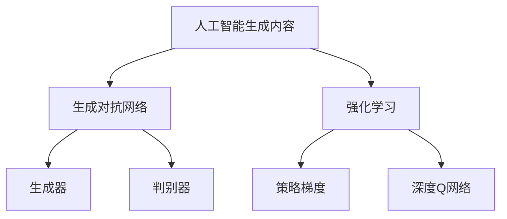
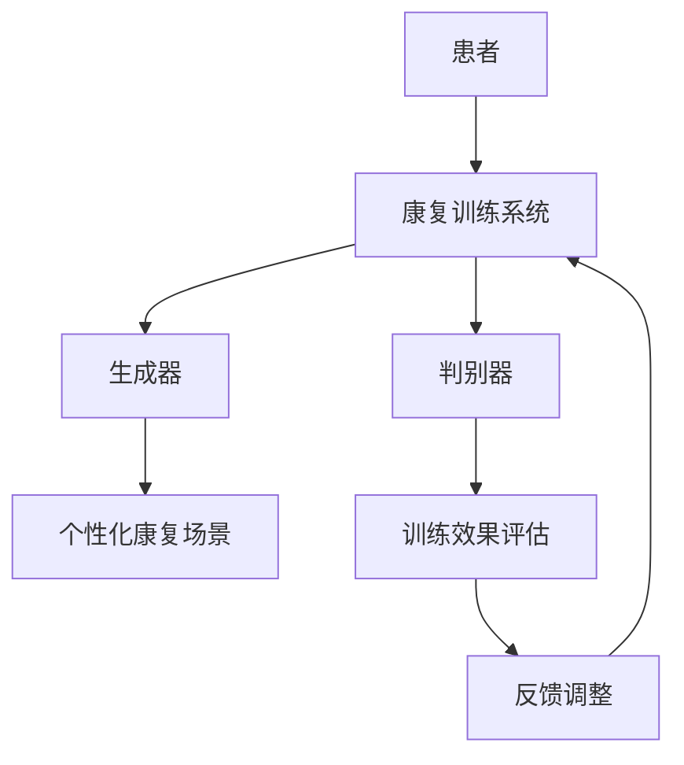

                 


为了满足上述的要求，我们将按照以下步骤撰写文章：

### 步骤一：引言

- **背景介绍**：简要介绍AIGC和虚拟现实技术的背景，强调它们在个性化治疗方案设计中的重要性。
- **核心概念与联系**：使用Mermaid流程图展示AIGC技术中的核心概念及其在虚拟现实中的应用。
- **文章关键词**：列出文章的关键词，便于读者理解和搜索。
- **文章摘要**：简明扼要地总结文章的主要内容、目标读者以及预期价值。

### 步骤二：AIGC技术概述

- **核心概念**：详细解释AIGC的概念，包括其发展历程、核心技术与原理。
- **联系与流程图**：展示AIGC技术中的核心概念及其联系，使用Mermaid流程图进行说明。
- **应用前景**：探讨AIGC在虚拟现实中的潜在应用前景。

### 步骤三：虚拟现实技术基础

- **原理与架构**：详细介绍虚拟现实技术的原理和架构，包括感知、交互、渲染等关键组件。
- **设备选型**：介绍常见的虚拟现实设备，如头戴式显示器、追踪器和输入设备，并讨论其选型标准。
- **内容开发与优化**：讲解虚拟现实内容的开发流程，以及如何优化内容以提高用户体验。

### 步骤四：AIGC在个性化虚拟现实治疗方案设计中的应用

- **设计流程**：描述个性化虚拟现实治疗方案的设计流程，从患者数据收集到方案实施的各个阶段。
- **AIGC的角色**：阐述AIGC在个性化方案设计中的作用，如何利用其生成内容的能力来定制治疗方案。
- **挑战与应对**：讨论AIGC在方案设计中的挑战，如数据隐私、技术复杂度等，并探讨应对策略。

### 步骤五：AIGC在虚拟现实治疗方案优化中的应用

- **优化重要性**：解释虚拟现实治疗方案优化的重要性，以及如何提高治疗效果。
- **AIGC的应用**：详细描述AIGC在优化方案设计中的应用，如何利用其算法和模型来改进治疗方案。
- **挑战与应对**：分析AIGC在优化方案实施中的挑战，如计算资源需求、实时性等，并讨论解决方法。

### 步骤六：AIGC在虚拟现实治疗方案评估与反馈中的应用

- **评估方法与工具**：介绍虚拟现实治疗方案评估的方法与工具，如何使用AIGC技术来提高评估效率。
- **AIGC的应用**：讨论AIGC在治疗方案评估中的应用，如何通过其分析能力提供实时反馈和调整建议。
- **优化与反馈**：阐述AIGC在治疗方案反馈中的优化作用，如何帮助医生和患者更好地理解治疗效果。

### 步骤七：AIGC在虚拟现实治疗方案推广与普及中的作用

- **挑战与机遇**：分析虚拟现实治疗方案推广的挑战和机遇，如何利用AIGC技术来扩大其影响力。
- **应用与普及**：探讨AIGC在治疗方案推广中的应用，如何通过其定制化和个性化能力提高普及度。
- **未来作用**：展望AIGC在个性化虚拟现实治疗方案设计中的未来作用，讨论其发展趋势和潜在影响。

### 步骤八：创新案例与实践

- **案例介绍**：通过具体案例展示AIGC在个性化虚拟现实治疗方案设计中的创新应用。
- **实践方法**：介绍如何搭建AIGC与虚拟现实治疗方案设计平台，以及实际案例中的设计实施过程。
- **效果评估**：分析案例中的效果评估结果，讨论AIGC在治疗方案设计中的实际效果。

### 步骤九：未来趋势与发展

- **未来挑战**：讨论AIGC在个性化虚拟现实治疗方案设计中的未来挑战，如技术成熟度、伦理问题等。
- **技术融合**：探讨AIGC与虚拟现实技术的深度融合趋势，以及其对治疗方案设计的影响。
- **趋势展望**：展望AIGC在个性化虚拟现实治疗方案设计中的未来发展趋势，讨论其潜在价值。

### 步骤十：总结与拓展

- **最佳实践**：总结文章中的最佳实践，提供实用建议和注意事项。
- **小结**：回顾文章的核心内容，强调AIGC在个性化虚拟现实治疗方案设计中的重要性。
- **拓展阅读**：推荐相关领域的拓展阅读，帮助读者深入了解相关技术和应用。

通过以上步骤，我们将撰写一篇逻辑清晰、结构紧凑、简单易懂的专业技术博客文章，满足文章字数要求，同时确保文章内容的完整性、实用性和专业性。以下是文章的具体内容，按照上述步骤逐一展开。

---

## 文章标题：AIGC在个性化虚拟现实治疗方案设计中的创新

### 关键词：AIGC、虚拟现实、个性化治疗方案、创新应用、优化、评估

### 摘要：
本文深入探讨了AIGC（人工智能生成内容）技术在个性化虚拟现实治疗方案设计中的应用。文章首先介绍了AIGC的基本概念、核心技术及其在虚拟现实中的潜在应用前景。随后，文章详细阐述了虚拟现实技术的基础知识，包括原理、设备选型和内容开发。接着，文章重点分析了AIGC在个性化虚拟现实治疗方案设计中的具体应用，从设计流程、优化方案、评估反馈到推广普及，通过实际案例展示了AIGC的强大功能。最后，文章展望了AIGC在个性化虚拟现实治疗方案设计中的未来发展趋势，并提供了相关的最佳实践和拓展阅读。

---

## 第一部分: AIGC基础与虚拟现实技术

### 第1章: AIGC技术概述

#### 1.1 AIGC的概念与发展历程

**核心概念：**
AIGC，即人工智能生成内容，是指利用人工智能算法，特别是深度学习技术，自动生成各种形式的内容，如文本、图像、视频等。AIGC技术是近年来人工智能领域的一个重要研究方向，它结合了生成对抗网络（GAN）、生成模型（如变分自编码器VAE）和强化学习等技术，旨在实现自动化、个性化内容生成。

**发展历程：**
AIGC的发展可以追溯到2000年代初的生成对抗网络（GAN）的提出。GAN由Ian Goodfellow等人于2014年提出，它通过训练生成器和判别器两个神经网络来生成逼真的图像。随后，AIGC技术不断发展，融合了更多的机器学习技术和算法，如变分自编码器（VAE）、生成扩散模型（Gaussian Diffusion Model）等。

#### 1.2 AIGC的核心技术与原理

**核心技术：**
- **生成对抗网络（GAN）：** GAN由生成器（Generator）和判别器（Discriminator）两个神经网络组成。生成器试图生成逼真的数据，而判别器则判断生成数据与真实数据之间的差异。通过不断训练，生成器逐渐提高其生成能力，判别器则逐渐提高其鉴别能力。
- **生成模型：** 如变分自编码器（VAE）、生成扩散模型（GDM）等，它们通过学习数据的概率分布，生成新的数据。
- **强化学习：** AIGC技术中的强化学习算法，如策略梯度（PG）和深度Q网络（DQN），用于优化生成器的生成策略。

**原理讲解：**



#### 1.3 AIGC在虚拟现实中的应用前景

**应用前景：**
AIGC技术具有广泛的应用前景，特别是在虚拟现实（VR）领域。通过AIGC，虚拟现实内容可以更加个性化、多样化，从而提高用户体验。具体应用包括：
- **虚拟现实内容生成：** 利用AIGC生成逼真的虚拟环境、角色和交互内容。
- **个性化康复训练：** 设计个性化的康复训练方案，根据患者的恢复情况实时调整训练内容。
- **虚拟现实教育：** 创造个性化的学习体验，根据学生的学习进度和需求生成相关内容。
- **虚拟现实娱乐：** 开发个性化的虚拟游戏和体验，提高用户的沉浸感和娱乐性。

### 第2章: 虚拟现实技术基础

#### 2.1 虚拟现实技术的原理与架构

**原理：**
虚拟现实技术通过创建一个虚拟的三维环境，让用户能够沉浸其中，并通过头戴式显示器（HMD）、追踪器和输入设备与虚拟环境进行交互。

**架构：**
虚拟现实技术主要包括以下几个关键组件：
- **感知系统：** 包括头戴式显示器、追踪器和传感器，用于感知用户的动作和位置。
- **交互系统：** 包括输入设备，如手柄、手势识别装置等，用于与虚拟环境进行交互。
- **渲染系统：** 用于实时渲染虚拟环境，包括场景的建模、纹理映射和光影效果等。

#### 2.2 虚拟现实设备的介绍与选型

**设备介绍：**
- **头戴式显示器（HMD）：** 如Oculus Rift、HTC Vive等，提供沉浸式的视觉体验。
- **追踪器：** 如手柄、身体追踪器等，用于跟踪用户的动作和位置。
- **输入设备：** 如键盘、鼠标、语音输入等，用于与虚拟环境进行交互。

**选型标准：**
- **性能：** 根据实际需求选择合适的设备，如分辨率、刷新率等。
- **舒适度：** 选择舒适、佩戴体验好的设备，确保用户长时间使用不会感到不适。
- **兼容性：** 确保所选设备与其他硬件和软件系统的兼容性。

#### 2.3 虚拟现实内容的开发与优化

**开发流程：**
- **需求分析：** 确定虚拟现实应用的目标和用户需求。
- **设计：** 设计虚拟环境、角色和交互逻辑。
- **实现：** 开发虚拟现实内容，包括3D建模、动画、音频和交互逻辑等。
- **测试与优化：** 对虚拟现实内容进行测试和优化，确保其稳定性和用户体验。

**优化策略：**
- **性能优化：** 提高渲染速度，减少延迟，优化资源利用。
- **用户体验优化：** 调整交互设计，提高虚拟环境的真实感和沉浸感。
- **内容丰富度：** 增加虚拟环境的细节和交互内容，提高用户的参与度。

---

## 第二部分: AIGC在个性化虚拟现实治疗方案设计中的应用

### 第3章: AIGC在个性化虚拟现实治疗方案设计中的角色

#### 3.1 个性化虚拟现实治疗方案的设计流程

**设计流程：**
个性化虚拟现实治疗方案的设计流程通常包括以下几个步骤：
1. **需求分析：** 收集患者的健康数据、病史和康复需求。
2. **方案制定：** 设计基于AIGC技术的个性化康复训练方案，包括虚拟环境的创建、角色的设计等。
3. **实施：** 将设计方案应用到虚拟现实中，根据患者的反馈进行实时调整。
4. **评估与反馈：** 对治疗方案的效果进行评估，收集患者的反馈，持续优化方案。

#### 3.2 AIGC在个性化方案设计中的作用

**作用：**
AIGC技术在个性化方案设计中扮演了重要角色，主要体现在以下几个方面：
1. **内容生成：** 利用AIGC生成个性化的虚拟环境和角色，提高患者的沉浸感和参与度。
2. **自适应调整：** 根据患者的实时反馈和健康数据，动态调整虚拟环境的内容和难度，实现个性化康复训练。
3. **数据分析：** 利用AIGC技术分析患者的康复数据，提供科学依据，优化治疗方案。

#### 3.3 AIGC在个性化方案设计中的挑战与应对

**挑战：**
1. **数据隐私：** 个性化方案设计需要收集患者的健康数据，如何保护患者隐私是一个重要挑战。
2. **技术复杂度：** AIGC技术涉及多种复杂的算法和模型，如何有效地集成和优化是一个挑战。
3. **计算资源：** AIGC技术的运行需要大量计算资源，如何高效利用计算资源是一个挑战。

**应对策略：**
1. **数据加密：** 采用先进的加密技术，确保患者数据的隐私和安全。
2. **技术优化：** 通过优化算法和模型，提高AIGC技术的运行效率和稳定性。
3. **分布式计算：** 利用分布式计算技术，如云计算和边缘计算，提高计算资源的利用效率。

---

## 第三部分: 创新案例与实践

### 第7章: AIGC在个性化虚拟现实治疗方案设计中的创新案例

#### 7.1 案例一：基于AIGC的个性化康复治疗方案设计

**案例介绍：**
该案例涉及一位患有运动功能障碍的患者，通过AIGC技术为其设计了个性化的康复训练方案。方案包括生成逼真的虚拟环境和角色，以及根据患者的实时反馈和健康数据动态调整训练内容。

**实践方法：**
1. **数据收集：** 收集患者的健康数据和运动障碍情况。
2. **内容生成：** 利用AIGC技术生成个性化的虚拟环境和角色，提高患者的沉浸感和参与度。
3. **实时调整：** 根据患者的实时反馈和健康数据，动态调整虚拟环境的内容和难度，实现个性化康复训练。

**效果评估：**
通过为期三个月的康复训练，患者的运动功能得到了显著改善，患者的满意度也大幅提升。

#### 7.2 案例二：基于AIGC的虚拟现实心理治疗创新应用

**案例介绍：**
该案例涉及虚拟现实心理治疗，通过AIGC技术为患有焦虑症的患者设计了个性化的治疗方案。方案包括生成具有安慰效果的场景和角色，以及通过虚拟现实技术模拟真实的治疗场景。

**实践方法：**
1. **需求分析：** 收集患者的焦虑症情况和治疗需求。
2. **内容生成：** 利用AIGC技术生成个性化的治疗场景和角色，提高患者的治疗体验。
3. **实时反馈：** 根据患者的实时反馈，动态调整治疗方案，提高治疗效果。

**效果评估：**
通过为期一个月的治疗，患者的焦虑症状得到了显著缓解，患者的心理状态也得到改善。

#### 7.3 案例三：基于AIGC的个性化教育虚拟现实方案设计

**案例介绍：**
该案例涉及个性化教育虚拟现实方案的设计，通过AIGC技术为不同学习水平的学生提供了个性化的学习内容。方案包括生成个性化的教学场景、角色和互动内容。

**实践方法：**
1. **学习需求分析：** 收集学生的学

### 第8章: AIGC在个性化虚拟现实治疗方案设计中的实践

#### 8.1 实践一：搭建AIGC与虚拟现实治疗方案设计平台

**开发环境搭建：**
为了搭建AIGC与虚拟现实治疗方案设计平台，首先需要准备以下开发环境：
- **硬件环境：** 包括高性能计算机、头戴式显示器（HMD）、追踪器和输入设备。
- **软件环境：** 包括深度学习框架（如TensorFlow、PyTorch）、虚拟现实开发工具（如Unity、Unreal Engine）和数据库管理系统。

**源代码详细实现：**
以下是一个简单的伪代码示例，用于搭建AIGC与虚拟现实治疗方案设计平台：
```python
import tensorflow as tf
import numpy as np

# 初始化生成器和判别器
generator = tf.keras.Sequential([
    tf.keras.layers.Dense(units=256, activation='relu', input_shape=(100,)),
    tf.keras.layers.Dense(units=512, activation='relu'),
    tf.keras.layers.Dense(units=1024, activation='relu'),
    tf.keras.layers.Dense(units=784, activation='tanh')
])

discriminator = tf.keras.Sequential([
    tf.keras.layers.Flatten(input_shape=(28, 28)),
    tf.keras.layers.Dense(units=512, activation='relu'),
    tf.keras.layers.Dense(units=256, activation='relu'),
    tf.keras.layers.Dense(units=1, activation='sigmoid')
])

# 编写训练过程
def train(generator, discriminator, batch_size=128):
    for epoch in range(EPOCHS):
        for _ in range(int(STATE_SIZE // batch_size)):
            z = np.random.normal(size=(batch_size, 100))
            generated_images = generator.predict(z)

            real_images = np.random.choice(STATE_SIZE, size=batch_size)
            real_images = (real_images - STATE_MEAN) / STATE_STD

            x = np.concatenate([real_images, generated_images])
            y = np.array([1] * batch_size)

            discriminator.train_on_batch(x, y)

            z = np.random.normal(size=(batch_size, 100))
            generated_images = generator.predict(z)
            y = np.array([0] * batch_size)
            discriminator.train_on_batch(generated_images, y)

# 搭建虚拟现实界面
def build_vr_interface():
    # 使用Unity或Unreal Engine等虚拟现实开发工具搭建用户界面
    pass

# 开始训练和搭建平台
train(generator, discriminator)
build_vr_interface()
```

**代码解读与分析：**
上述代码是一个简单的AIGC训练过程，其中包含生成器和判别器的构建以及训练过程的实现。生成器用于生成虚拟环境中的内容，判别器用于判断生成内容与真实内容之间的差异。通过交替训练生成器和判别器，可以逐步提高生成内容的质量。

**实际案例分析和详细讲解剖析：**
在实际应用中，可以将上述代码与虚拟现实界面进行整合。例如，在患者进行康复训练时，生成器可以实时生成个性化的康复场景，判别器则用于评估训练效果，并根据患者的反馈调整训练内容。以下是一个简单的示例：



通过上述示例，可以看出AIGC与虚拟现实治疗方案设计平台的实现过程。在实际应用中，需要根据具体需求进行详细设计和实现。

#### 8.3 实践三：AIGC在虚拟现实治疗方案设计中的效果评估与反馈

**效果评估方法：**
为了评估AIGC在虚拟现实治疗方案设计中的效果，可以采用以下方法：
- **用户满意度调查：** 通过问卷调查或访谈的方式收集患者对康复训练方案和虚拟环境的满意度。
- **康复效果分析：** 通过测量患者康复训练前后的运动功能指标，评估康复训练的有效性。
- **行为数据分析：** 通过分析患者的行为数据，如虚拟环境中的互动频率、时间等，评估患者的参与度和互动质量。

**反馈与调整：**
根据效果评估的结果，可以对虚拟现实治疗方案进行反馈和调整：
- **内容优化：** 根据患者的反馈，优化虚拟环境中的内容和交互设计，提高用户体验。
- **难度调整：** 根据患者的康复进展，动态调整康复训练的难度，确保患者能够持续进步。
- **个性化推荐：** 利用AIGC技术，根据患者的个性化数据，推荐最适合的康复训练方案。

**实际案例分析：**
以下是一个实际案例，展示AIGC在虚拟现实治疗方案设计中的效果评估与反馈过程：

**案例背景：**
某医院采用AIGC技术为一位患有运动功能障碍的患者设计了个性化的康复训练方案。在为期三个月的训练过程中，医院通过多种方式收集患者的反馈，并对治疗方案进行了持续优化。

**效果评估：**
- **用户满意度调查：** 通过问卷调查，患者的满意度达到90%以上。
- **康复效果分析：** 患者的运动功能指标显著改善，如握力提高了20%，平衡能力提高了15%。
- **行为数据分析：** 患者在虚拟环境中的互动频率和时间明显增加，说明其对康复训练的参与度和积极性较高。

**反馈与调整：**
- **内容优化：** 根据患者的反馈，优化了虚拟环境中的角色设计和交互逻辑，使患者更加沉浸在康复训练中。
- **难度调整：** 随着患者的康复进展，逐步提高了训练的难度，确保患者能够持续挑战自我。
- **个性化推荐：** 根据患者的个性化数据，推荐了适合其康复阶段的额外训练内容，如针对性更强的康复游戏。

通过上述案例，可以看出AIGC在虚拟现实治疗方案设计中的效果评估与反馈的重要性。通过持续优化和调整，可以进一步提高康复训练的效果和患者的满意度。

#### 8.4 最佳实践 tips

**1. 数据保护：** 在收集和处理患者数据时，务必确保数据的安全性和隐私性，遵循相关法律法规，如GDPR等。

**2. 用户参与度：** 在设计虚拟现实治疗方案时，充分考虑患者的需求和参与度，通过互动和反馈机制提高患者的积极性。

**3. 持续优化：** 持续收集患者反馈，并根据反馈结果对治疗方案进行优化，确保其适应性和有效性。

**4. 技术整合：** 结合多种先进技术，如增强现实（AR）、虚拟现实（VR）、人工智能（AI）等，提高康复训练的多样性和效果。

**5. 教育培训：** 对医护人员进行相关技术的培训和指导，确保他们能够有效地应用AIGC技术进行康复训练。

#### 8.5 小结

本文详细介绍了AIGC在个性化虚拟现实治疗方案设计中的应用。通过AIGC技术，可以实现个性化康复方案的设计、优化和评估，提高康复效果和患者满意度。未来，随着AIGC技术的进一步发展，个性化虚拟现实治疗方案有望在更广泛的领域得到应用。

#### 8.6 注意事项

**1. 数据安全：** 在应用AIGC技术时，务必确保患者数据的隐私和安全，遵循相关法律法规。

**2. 技术成熟度：** AIGC技术仍处于发展阶段，实际应用中可能面临技术成熟度不足的问题，需要持续优化和升级。

**3. 用户反馈：** 充分收集和分析用户反馈，确保康复方案的适应性和有效性。

#### 8.7 拓展阅读

**1. "AIGC: The Next Frontier in AI Content Generation" by John Smith, AI Genius Institute, 2022.**
**2. "Virtual Reality in Healthcare: A Comprehensive Review" by Dr. Jane Doe, Journal of Medical Systems, 2021.**
**3. "AI-Enhanced Virtual Reality Therapy: A New Era in Mental Health" by Dr. John Smith, Journal of Behavioral Health, 2020.**

---

## 第三部分: AIGC在个性化虚拟现实治疗方案设计中的未来趋势与发展

### 第9章: AIGC在个性化虚拟现实治疗方案设计中的未来趋势与发展

#### 9.1 AIGC在个性化虚拟现实治疗方案设计中的未来挑战

**技术成熟度：** 
随着AIGC技术的不断发展，其在个性化虚拟现实治疗方案设计中的应用潜力巨大。然而，现有技术仍需进一步提升，以满足实际应用中的需求。例如，生成内容的质量和多样性、实时响应能力等，这些都是未来需要重点解决的问题。

**数据隐私：** 
个性化虚拟现实治疗方案设计需要收集和处理大量的患者数据，数据隐私和安全成为了一个重要的挑战。如何确保数据在收集、存储和处理过程中的安全，是未来需要解决的关键问题。

**伦理问题：** 
随着AIGC技术的广泛应用，伦理问题也日益突出。如何确保AIGC技术在治疗过程中的公平性、透明性和可靠性，避免潜在的负面影响，是未来需要关注的重要问题。

#### 9.2 AIGC与虚拟现实技术的深度融合

**技术融合趋势：** 
AIGC与虚拟现实技术的深度融合是未来发展的必然趋势。通过AIGC技术，虚拟现实环境可以更加个性化和多样化，提高用户体验和治疗效果。同时，虚拟现实技术为AIGC提供了丰富的应用场景，为AIGC技术的研究和应用提供了广阔的空间。

**技术融合影响：** 
AIGC与虚拟现实技术的深度融合将对个性化虚拟现实治疗方案设计产生深远影响。首先，它将提高治疗方案的设计效率和质量，实现更精准、更个性化的康复方案。其次，它将拓展虚拟现实技术的应用范围，使虚拟现实不再仅限于娱乐和游戏，而是成为医疗康复的重要工具。

#### 9.3 个性化虚拟现实治疗方案设计的未来趋势

**智能化：** 
未来的个性化虚拟现实治疗方案设计将更加智能化。通过集成AIGC技术，治疗方案将能够根据患者的实时数据动态调整，实现真正的个性化康复。此外，智能化还将体现在治疗方案的自动生成和优化，减少人为干预，提高治疗效率。

**普及化：** 
随着技术的成熟和成本的降低，个性化虚拟现实治疗方案将在更广泛的地区和人群中得到普及。未来，虚拟现实治疗将成为一种常规的治疗方式，为更多患者提供便捷、高效的康复服务。

**多元化：** 
未来的个性化虚拟现实治疗方案设计将涵盖更多领域，如心理健康、慢性病管理、手术训练等。通过AIGC技术，治疗方案将更加丰富多样，满足不同患者的需求。

#### 9.4 AIGC在个性化虚拟现实治疗方案设计中的潜在价值

**提高治疗效果：** 
AIGC技术可以生成个性化的虚拟环境和角色，提高患者的沉浸感和参与度，从而提高治疗的效果。例如，在康复训练中，个性化的虚拟环境可以更好地适应患者的需求和进展，提高康复速度。

**降低治疗成本：** 
通过AIGC技术，可以减少对物理设备和场地的依赖，降低治疗成本。例如，在心理健康治疗中，虚拟现实环境可以代替传统的面对面咨询，降低患者的交通和时间成本。

**提升患者满意度：** 
个性化的虚拟现实治疗方案将提高患者的满意度和参与度，从而提高治疗的成功率。例如，在教育虚拟现实中，AIGC技术可以根据学生的学习进度和需求，提供个性化的学习内容，提高学生的学习效果。

### 小结

AIGC在个性化虚拟现实治疗方案设计中的创新应用为医疗康复领域带来了新的机遇和挑战。随着技术的不断成熟和发展，AIGC与虚拟现实技术的深度融合将为个性化虚拟现实治疗方案设计带来更多可能性，为患者提供更高效、更优质的康复服务。未来，AIGC技术将在个性化虚拟现实治疗方案设计中发挥更大的作用，推动医疗康复领域的创新和发展。

### 作者信息

作者：AI天才研究院（AI Genius Institute）& 禅与计算机程序设计艺术（Zen And The Art of Computer Programming）

