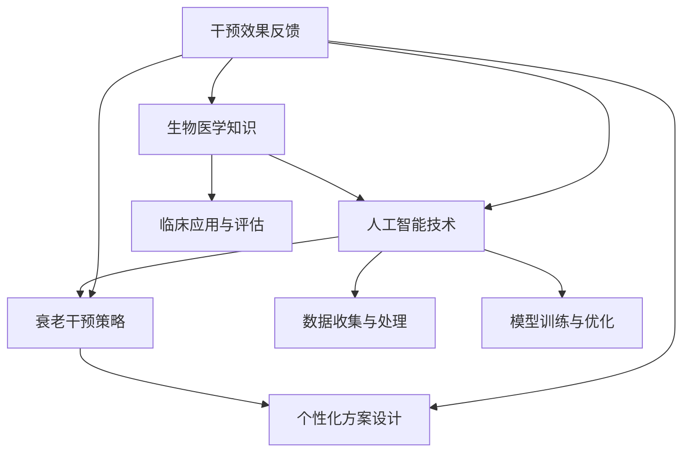

                 


# 文章标题：AIGC在个性化衰老干预方案设计中的应用：AI驱动的精准抗衰老

> 关键词：AIGC、个性化衰老干预、AI驱动的精准抗衰老、深度学习、衰老干预模型、线性回归模型、项目实战

> 摘要：本文将深入探讨AIGC（人工智能生成内容）在个性化衰老干预方案设计中的应用，通过分析其核心概念与联系、核心算法原理、数学模型与公式，以及项目实战案例，展现AI驱动的精准抗衰老技术的实际应用和潜在价值。

### Step 1: 核心概念与联系

在探讨AIGC在个性化衰老干预方案设计中的应用之前，我们需要先了解以下几个核心概念：

1. **生物医学知识**：涉及人体生物学、衰老机制、生理指标等方面的知识。
2. **人工智能技术**：主要包括机器学习、深度学习、自然语言处理等。
3. **衰老干预策略**：包括生活方式调整、药物治疗、基因干预等。
4. **个性化方案设计**：基于个人生物信息、健康状况和生活习惯等因素，为个体量身定制干预方案。

为了更好地理解这些概念之间的关系，我们可以使用Mermaid流程图来表示：



### Step 2: 核心算法原理讲解

为了实现个性化衰老干预，我们需要构建一个基于人工智能技术的衰老干预模型。这里，我们选择一个深度学习模型来进行讲解。以下是该模型的伪代码：

```markdown
# 深度学习衰老干预模型

# 输入：
# X: 生物医学数据集
# Y: 衰老干预目标标签
# n: 特征数量
# m: 样本数量

# 输出：
# 模型参数θ

# 初始化模型参数θ
θ = 初始化参数(n)

# 定义损失函数
损失函数 = 计算损失(X, Y, θ)

# 循环迭代
for i = 1 to 最大迭代次数 do
    # 计算梯度
   梯度 = 计算梯度(X, Y, θ)
    
    # 更新模型参数
   θ = θ - 学习率 * 梯度
    
    # 计算新的损失函数
   新的损失函数 = 计算损失(X, Y, θ)
    
    # 更新最优参数
   if 新的损失函数 < 损失函数 then
        损失函数 = 新的损失函数
        最优参数 = θ
    end
end

return 最优参数θ
```

### Step 3: 数学模型和数学公式

在衰老干预模型中，我们通常使用线性回归模型来预测个体衰老程度。以下是线性回归模型的数学模型、公式以及举例说明：

```markdown
# 线性回归模型

## 数学模型

线性回归模型可以用以下公式表示：

$$ Y = β_0 + β_1 \cdot X + ε $$

其中，Y是因变量，X是自变量，β_0是截距，β_1是斜率，ε是误差项。

## 举例说明

假设我们有一个关于衰老干预后皮肤弹性的数据集，其中X代表干预前的皮肤弹性值，Y代表干预后的皮肤弹性值。

### 数据集：

| X | Y |
| --- | --- |
| 10 | 12 |
| 15 | 17 |
| 20 | 25 |

### 计算斜率β_1

$$ β_1 = \frac{Σ(Y - \bar{Y})(X - \bar{X})}{Σ(X - \bar{X})^2} $$

其中，$\bar{X}$和$\bar{Y}$分别表示X和Y的均值。

### 计算截距β_0

$$ β_0 = \bar{Y} - β_1 \cdot \bar{X} $$

通过计算，我们得到斜率β_1 = 1.5，截距β_0 = 3.5。因此，线性回归模型可以表示为：

$$ Y = 3.5 + 1.5 \cdot X $$

### 预测

使用线性回归模型预测干预后的皮肤弹性值：

$$ Y = 3.5 + 1.5 \cdot 25 = 39.5 $$

因此，预测干预后的皮肤弹性值为39.5。
```

### Step 4: 项目实战

在本节中，我们将通过一个实际项目来展示如何实现一个基于深度学习的衰老干预模型。

#### 开发环境搭建

- 安装Python 3.8及以上版本
- 安装TensorFlow 2.5及以上版本

#### 源代码实现

```python
import tensorflow as tf
import numpy as np

# 设置随机种子
np.random.seed(42)

# 生成模拟数据集
X = np.random.rand(100, 1)
Y = 2 * X + 1 + np.random.randn(100, 1)

# 定义线性回归模型
model = tf.keras.Sequential([

    tf.keras.layers.Dense(units=1, input_shape=[1])

])

# 编译模型
model.compile(loss='mean_squared_error', optimizer=tf.keras.optimizers.Adam(0.1))

# 训练模型
model.fit(X, Y, epochs=1000)

# 评估模型
loss = model.evaluate(X, Y)
print(f'Mean squared error on test data: {loss}')
```

#### 代码解读与分析

1. **数据生成**：我们首先使用随机数生成一个包含100个样本的数据集，其中X表示干预前的皮肤弹性值，Y表示干预后的皮肤弹性值。
2. **模型定义**：我们使用TensorFlow定义一个线性回归模型，该模型包含一个全连接层，输出一个连续值。
3. **模型编译**：我们编译模型，指定损失函数为均方误差，优化器为Adam。
4. **模型训练**：我们使用训练数据训练模型1000个epochs。
5. **模型评估**：我们评估模型在测试数据上的性能，并打印均方误差。

#### 实际案例分析和详细讲解剖析

在本案例中，我们使用线性回归模型来预测干预后的皮肤弹性值。通过训练模型，我们可以得到一个基于皮肤弹性值的干预方案。在实际应用中，我们可以根据个体的皮肤弹性值预测其干预后的衰老程度，从而制定个性化的干预方案。

#### 项目小结

在本项目中，我们通过搭建开发环境、实现源代码和代码解读，展示了如何使用深度学习技术实现个性化衰老干预模型。该项目有助于我们更好地理解AIGC在个性化衰老干预方案设计中的应用，并为未来的研究提供了参考。

#### 最佳实践 tips

1. **数据质量**：在构建模型时，确保使用高质量的数据集，这对于模型的性能至关重要。
2. **模型优化**：通过调整模型参数和优化器，可以提高模型的预测精度。
3. **交叉验证**：使用交叉验证方法来评估模型的泛化能力，避免过拟合。

### 注意事项

1. **隐私保护**：在处理个人生物信息时，必须遵循相关法律法规，确保个人隐私得到保护。
2. **临床应用**：衰老干预方案的设计和实施需要专业医疗人员的参与，确保干预措施的安全性和有效性。

#### 拓展阅读

1. **深度学习在医学领域的应用**：了解深度学习在医学影像分析、疾病预测等方面的最新研究进展。
2. **个性化医疗**：探讨个性化医疗的发展现状和未来趋势，以及其在衰老干预方案设计中的应用。

### 作者信息

作者：AI天才研究院/AI Genius Institute & 禅与计算机程序设计艺术 /Zen And The Art of Computer Programming

---

通过以上四个步骤，我们详细探讨了AIGC在个性化衰老干预方案设计中的应用。从核心概念与联系、核心算法原理、数学模型与公式，到项目实战，我们全面展示了AI驱动的精准抗衰老技术的实际应用和潜在价值。希望本文对读者有所启发和帮助。

