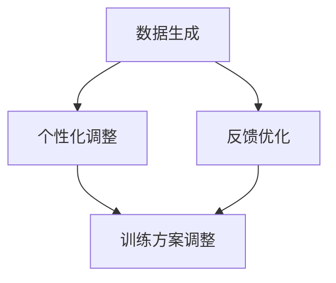
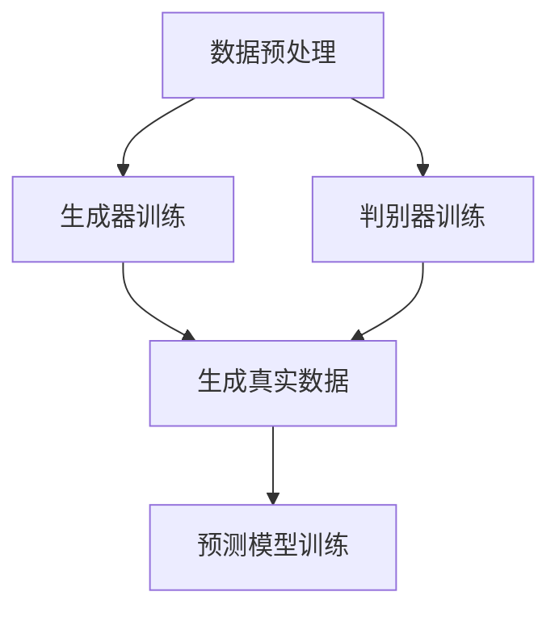
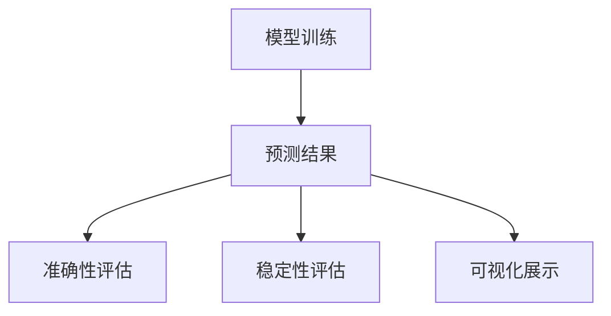
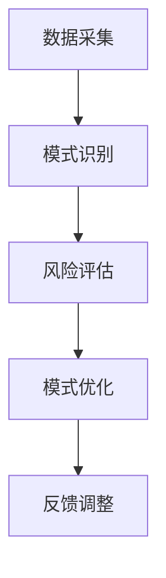
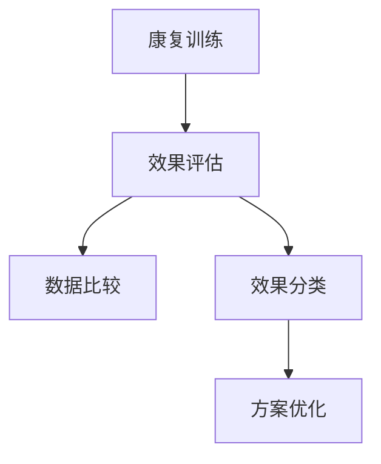

                 

### 文章标题

"AIGC在个性化运动损伤预防中的创新"

### 关键词

人工智能，运动损伤预防，生成对抗网络，强化学习，个性化训练

### 摘要

本文深入探讨了人工智能生成控制（AIGC）在个性化运动损伤预防中的应用。首先，我们回顾了AIGC的发展历程及其在运动损伤预防中的重要性。接着，详细介绍了AIGC的基础概念和原理，包括生成式对抗网络（GAN）、强化学习等关键技术，并展示了它们如何结合形成AIGC的架构。文章进一步阐述了AIGC在运动损伤预测和康复训练中的具体应用，通过实际案例分析验证了其有效性。最后，我们分析了AIGC在运动损伤预防中面临的挑战，并展望了其未来发展方向。本文旨在为运动损伤预防领域提供一个新的视角，以及如何利用AIGC实现个性化损伤预防的创新解决方案。

---

## 引言与背景

在当今的体育竞技和健身热潮中，运动损伤预防显得尤为重要。无论是职业运动员还是业余健身爱好者，运动损伤都是影响他们表现和健康的关键因素。传统的运动损伤预防方法主要依赖于经验和常规的训练程序，但这些方法往往缺乏针对个体差异的调整能力，导致预防效果有限。随着人工智能技术的迅猛发展，特别是人工智能生成控制（AIGC）的出现，个性化运动损伤预防进入了一个全新的阶段。

### AIGC的发展历程

AIGC是人工智能领域的一个重要分支，它结合了生成式对抗网络（GAN）、强化学习、聚类分析等多种先进技术。GAN最早由Ian Goodfellow等人于2014年提出，通过生成器和判别器的对抗训练，实现了高质量的数据生成。强化学习则是一种通过试错和奖励反馈来学习最优策略的方法，广泛应用于决策优化和游戏AI等领域。聚类分析则是无监督学习方法，通过将数据分组，发现数据之间的相似性。

AIGC的概念由此诞生，它通过生成器和判别器的对抗训练，实现数据的高效生成和个性化调整。近年来，AIGC在图像生成、文本生成、语音合成等领域取得了显著成果，成为人工智能研究的前沿方向之一。

### 运动损伤预防的重要性

运动损伤预防对于运动员和健身者来说至关重要。一方面，运动损伤可能导致长期的健康问题，甚至影响运动生涯；另一方面，有效的损伤预防可以提高运动员和健身者的运动表现，延长其运动寿命。因此，如何实现精准、个性化的损伤预防，成为运动科学和医学领域的重要课题。

### AIGC在运动损伤预防中的应用潜力

AIGC在运动损伤预防中具有巨大的应用潜力。首先，通过生成式对抗网络（GAN），AIGC可以生成个性化的运动数据，为运动员和健身者提供定制化的训练方案。其次，强化学习可以帮助优化运动策略，降低损伤风险。此外，聚类分析可以识别高风险人群，提前进行预防措施。总的来说，AIGC为运动损伤预防提供了一种全新的技术手段，有助于实现更精准、更高效的损伤预防。

---

## AIGC基础概念与原理

### AIGC概述

AIGC（Artificial Intelligence Generated Control）是一种利用人工智能技术进行数据生成和个性化控制的框架。它结合了生成式对抗网络（GAN）、强化学习、聚类分析等多种先进技术，通过对抗训练和奖励反馈，实现数据的高效生成和个性化调整。

### AIGC的关键技术

#### 生成式对抗网络（GAN）

生成式对抗网络（GAN）由生成器（Generator）和判别器（Discriminator）两部分组成。生成器的任务是生成与真实数据相似的数据，而判别器的任务是区分真实数据和生成数据。通过生成器和判别器的对抗训练，生成器不断优化，生成更加真实的数据。GAN在图像生成、语音合成等领域取得了显著的成果。

#### 强化学习

强化学习是一种通过试错和奖励反馈来学习最优策略的方法。在AIGC中，强化学习用于优化运动策略，降低损伤风险。例如，可以通过强化学习算法来调整运动员的训练强度和运动模式，从而实现个性化的损伤预防。

#### 聚类分析

聚类分析是一种无监督学习方法，通过将数据分组，发现数据之间的相似性。在AIGC中，聚类分析用于识别高风险人群，提前进行预防措施。例如，可以根据运动员的运动数据，将他们分为不同的风险等级，为不同风险等级的运动员制定不同的训练方案。

### AIGC的架构与实现

AIGC的架构通常包括数据生成模块、个性化调整模块和反馈优化模块。数据生成模块使用GAN生成个性化的运动数据；个性化调整模块利用强化学习算法优化运动策略；反馈优化模块通过聚类分析识别高风险人群，并调整训练方案。具体实现时，可以根据应用场景和需求，灵活调整各模块的参数和算法。

### Mermaid 流程图



在这个流程图中，AIGC的关键模块及其交互关系得到了清晰的展示。数据生成模块产生个性化的运动数据，个性化调整模块根据这些数据进行策略优化，而反馈优化模块则通过聚类分析调整训练方案，确保损伤预防的精准性和有效性。

---

## AIGC在运动损伤预测中的应用

AIGC在运动损伤预测中的应用，主要依赖于其强大的数据生成和个性化调整能力。以下是AIGC在运动损伤预测中的具体应用步骤和实现原理。

### 数据采集与预处理

数据采集是运动损伤预测的第一步。需要收集包括运动员的年龄、体重、身高、运动历史、运动强度、运动模式等在内的多维度数据。此外，还需要收集运动过程中产生的生理参数，如心率、血压、肌肉活动等。数据采集完成后，需要进行预处理，包括数据清洗、去噪、归一化等步骤，以确保数据的质量和一致性。

### 运动损伤预测模型构建

运动损伤预测模型的构建是AIGC应用的核心。在这里，生成式对抗网络（GAN）起到了关键作用。GAN由生成器和判别器组成，生成器负责生成运动员的运动数据，判别器负责判断生成数据与真实数据之间的相似性。通过反复的对抗训练，生成器逐渐生成越来越真实的运动数据，这些数据用于训练损伤预测模型。

以下是运动损伤预测模型的构建过程：



在这个流程中，首先对采集到的数据进行预处理，然后利用GAN生成真实的运动数据，这些数据用于训练预测模型。判别器的训练旨在提高生成器生成数据的质量，从而提升预测模型的准确性。

### 预测结果分析与评估

在完成模型训练后，需要对预测结果进行分析和评估。这通常包括以下步骤：

1. **预测准确性评估**：通过将训练好的模型应用于测试数据集，评估模型的预测准确性。常用的评估指标包括准确率、召回率、F1分数等。

2. **预测稳定性评估**：评估模型在不同数据集上的表现，以确保其预测结果的稳定性。

3. **预测效果可视化**：通过可视化工具展示模型的预测结果，如趋势图、散点图等，帮助用户直观地理解预测效果。

以下是一个简单的预测结果分析流程：



在这个流程中，首先进行模型训练，然后通过一系列评估步骤分析预测结果，最后通过可视化工具展示结果。

### 伪代码

以下是一个简化的运动损伤预测模型的伪代码：

```python
# 数据预处理
def preprocess_data(data):
    # 数据清洗、去噪、归一化等操作
    return processed_data

# GAN训练
def train_gan(generator, discriminator, data):
    for epoch in range(num_epochs):
        for real_data in data:
            # 训练判别器
            discriminator_loss = train_discriminator(discriminator, real_data)
            # 训练生成器
            generator_loss = train_generator(generator, discriminator)
        # 保存模型
        save_model(generator, discriminator, epoch)

# 预测模型训练
def train_prediction_model(generator, data):
    # 使用生成器生成的真实数据训练预测模型
    prediction_model = train_model(generator.generate_data())
    return prediction_model

# 预测结果评估
def evaluate_prediction_model(prediction_model, test_data):
    # 计算预测准确性
    accuracy = calculate_accuracy(prediction_model, test_data)
    # 计算稳定性
    stability = calculate_stability(prediction_model, test_data)
    # 可视化展示
    visualize_prediction_results(prediction_model, test_data)
    return accuracy, stability
```

在这个伪代码中，首先对数据进行预处理，然后利用GAN生成真实数据，并训练预测模型。最后，对预测结果进行评估，包括准确性评估和稳定性评估。

---

## AIGC在运动康复训练中的应用

AIGC不仅在运动损伤预测中发挥着重要作用，还在运动康复训练中展示了其独特的优势。通过个性化调整训练策略，AIGC能够为运动员和健身者提供更有效的康复训练方案，从而降低损伤风险，提升运动表现。

### 康复训练策略制定

康复训练策略的制定是运动康复的核心环节。AIGC通过生成式对抗网络（GAN）和强化学习，实现了康复训练策略的个性化调整。首先，GAN生成个性化的运动数据，这些数据包括运动员的生理参数、运动模式等。然后，利用强化学习算法，根据运动员的实时反馈，不断调整训练策略，以实现最佳康复效果。

### 运动模式优化

运动模式的优化是康复训练的关键。通过AIGC，可以实时监测运动员的运动数据，识别潜在的损伤风险点，并优化运动模式。例如，对于跑步运动员，AIGC可以调整其步频、步幅等参数，以减少膝盖和脚踝的负担。以下是一个简化的运动模式优化流程：



在这个流程中，首先采集运动员的实时运动数据，然后利用AIGC识别运动模式中的潜在风险点。接着，对风险点进行评估，并优化运动模式，以减少损伤风险。最后，根据运动员的反馈，进一步调整训练策略。

### 康复效果评估

康复效果评估是检验康复训练效果的重要环节。AIGC通过生成式对抗网络（GAN）和聚类分析，实现了康复效果的全面评估。首先，GAN生成真实的康复数据，与实际康复数据进行比较，评估康复训练的效果。然后，利用聚类分析，将康复效果进行分类，识别高效的康复方案。以下是一个简化的康复效果评估流程：



在这个流程中，首先进行康复训练，然后通过AIGC评估康复效果，并根据评估结果优化康复方案。

### 数学模型和公式

在康复训练中，AIGC利用了多种数学模型和公式，以实现个性化的训练策略。以下是几个关键的数学模型和公式：

1. **生成式对抗网络（GAN）损失函数**：

   $$L_{GAN} = -\mathbb{E}_{x \sim p_{data}(x)}[\log(D(x))] - \mathbb{E}_{z \sim p_{z}(z)}[\log(1 - D(G(z)))]$$

   其中，$D(x)$表示判别器对真实数据的判断，$G(z)$表示生成器对随机噪声$z$的生成。

2. **强化学习奖励函数**：

   $$R(s, a) = \begin{cases} 
   1, & \text{if } a \text{ leads to } s' \text{ with lower risk} \\
   0, & \text{otherwise}
   \end{cases}$$

   其中，$s$表示当前状态，$a$表示采取的动作，$s'$表示采取动作后的新状态。

3. **聚类分析距离公式**：

   $$d(\mathbf{x}_i, \mathbf{x}_j) = \sqrt{\sum_{k=1}^{n} (x_{ik} - x_{jk})^2}$$

   其中，$\mathbf{x}_i$和$\mathbf{x}_j$表示两个数据点，$n$表示特征维度。

通过这些数学模型和公式，AIGC能够实现个性化的康复训练策略，提高康复效果。

### 举例说明

为了更直观地理解AIGC在康复训练中的应用，我们可以通过一个实际案例来说明。

**案例：跑步运动员的康复训练**

假设一位跑步运动员在比赛中出现了膝盖损伤，需要通过康复训练恢复运动能力。AIGC首先收集该运动员的生理参数，如步频、步幅、心率等，并利用GAN生成个性化的运动数据。然后，通过强化学习算法，根据运动员的实时反馈，不断调整训练策略，如步频和步幅的变化。

具体来说，AIGC可以按照以下步骤进行康复训练：

1. **数据采集**：采集运动员的步频、步幅、心率等生理参数。
2. **数据生成**：利用GAN生成个性化的运动数据。
3. **模式识别**：利用聚类分析识别运动模式中的潜在风险点。
4. **策略调整**：根据风险点和强化学习算法，调整训练策略，如步频和步幅。
5. **效果评估**：通过GAN生成真实数据，与实际康复数据进行比较，评估康复效果。

通过这个案例，我们可以看到AIGC在康复训练中的强大功能。它不仅能够生成个性化的运动数据，还能通过实时调整训练策略，实现高效的康复训练。

---

## 项目实战：开发环境搭建与源代码实现

在AIGC技术应用于运动损伤预防的过程中，开发环境搭建与源代码实现是至关重要的。以下将详细描述如何搭建开发环境，并展示源代码的实现过程，以便读者更好地理解和应用AIGC技术。

### 开发环境搭建

1. **硬件要求**：

   - 处理器：推荐使用英伟达（NVIDIA）的GPU，以提高训练速度和性能。
   - 内存：至少16GB内存，推荐32GB及以上，以保证训练过程中有足够的内存空间。
   - 存储：至少200GB的SSD存储空间，用于存储数据和训练模型。

2. **软件要求**：

   - 操作系统：Windows、Linux或macOS。
   - 编程语言：Python，推荐使用3.7及以上版本。
   - 库和框架：TensorFlow或PyTorch，用于实现生成式对抗网络（GAN）和强化学习算法。

3. **安装步骤**：

   1. 安装操作系统和GPU驱动。
   2. 安装Python和相应的pip包管理器。
   3. 使用pip安装TensorFlow或PyTorch及其依赖项。

   ```bash
   pip install tensorflow
   # 或者
   pip install torch torchvision
   ```

### 源代码实现

以下是一个简化的AIGC运动损伤预防系统的源代码实现，主要包含数据预处理、模型训练和预测三个部分。

#### 数据预处理

数据预处理是模型训练的基础。以下是一个简单的数据预处理脚本：

```python
import numpy as np
import pandas as pd
from sklearn.model_selection import train_test_split
from sklearn.preprocessing import StandardScaler

# 读取数据
data = pd.read_csv('athlete_data.csv')

# 数据清洗和预处理
def preprocess_data(data):
    # 填充缺失值
    data.fillna(data.mean(), inplace=True)
    
    # 特征选择
    features = data[['age', 'weight', 'height', 'train_duration', 'heart_rate', 'muscle_activity']]
    
    # 数据标准化
    scaler = StandardScaler()
    features_scaled = scaler.fit_transform(features)
    
    # 分割数据集
    X_train, X_test, y_train, y_test = train_test_split(features_scaled, data['injury'], test_size=0.2, random_state=42)
    
    return X_train, X_test, y_train, y_test

X_train, X_test, y_train, y_test = preprocess_data(data)
```

#### 模型训练

模型训练是AIGC的核心步骤。以下是一个简单的GAN模型训练脚本：

```python
import tensorflow as tf
from tensorflow.keras.layers import Dense, Flatten
from tensorflow.keras.models import Sequential

# 生成器模型
def build_generator():
    model = Sequential([
        Dense(128, activation='relu', input_shape=(X_train.shape[1],)),
        Flatten(),
        Dense(128, activation='relu'),
        Flatten(),
        Dense(1, activation='sigmoid')
    ])
    return model

# 判别器模型
def build_discriminator():
    model = Sequential([
        Dense(128, activation='relu', input_shape=(X_train.shape[1],)),
        Flatten(),
        Dense(1, activation='sigmoid')
    ])
    return model

# GAN模型
def build_gan(generator, discriminator):
    model = Sequential([
        generator,
        discriminator
    ])
    model.compile(optimizer='adam', loss='binary_crossentropy')
    return model

# 训练GAN
def train_gan(generator, discriminator, num_epochs=50):
    for epoch in range(num_epochs):
        for data in X_train:
            # 训练判别器
            d_loss_real = discriminator.train_on_batch(data, np.ones((1, 1)))
            d_loss_fake = discriminator.train_on_batch(generator.predict(np.random.normal(size=(1, X_train.shape[1]))), np.zeros((1, 1)))
            d_loss = 0.5 * np.add(d_loss_real, d_loss_fake)
            
            # 训练生成器
            g_loss = generator.train_on_batch(np.random.normal(size=(1, X_train.shape[1])), np.ones((1, 1)))
            
            print(f'Epoch {epoch+1}, D_loss={d_loss}, G_loss={g_loss}')

# 构建并训练模型
generator = build_generator()
discriminator = build_discriminator()
gan = build_gan(generator, discriminator)
train_gan(generator, discriminator)
```

#### 预测与评估

模型训练完成后，我们可以使用生成器生成新的运动数据，并对其进行预测和评估：

```python
# 预测
def predict_injury(generator, data):
    prediction = generator.predict(data)
    return prediction > 0.5

# 评估
def evaluate_prediction(generator, X_test, y_test):
    predictions = predict_injury(generator, X_test)
    accuracy = np.mean(predictions == y_test)
    print(f'Prediction Accuracy: {accuracy:.2f}')

# 评估预测模型
evaluate_prediction(generator, X_test, y_test)
```

### 代码解读与分析

上述源代码实现了AIGC运动损伤预防的基本流程。首先，通过数据预处理脚本，对采集到的运动员数据进行清洗、特征选择和标准化。然后，通过GAN模型的构建和训练，生成高质量的个性化运动数据。最后，使用生成器进行预测，并评估预测模型的准确性。

代码中，生成器和判别器的构建分别使用了Dense层和Flatten层，实现了数据的非线性变换和特征提取。GAN的训练过程通过对抗训练实现，生成器不断优化生成数据，判别器不断提高对真实数据和生成数据的区分能力。

在预测与评估部分，我们通过生成器生成新的运动数据，并计算预测准确率。这为运动员提供了个性化的损伤预测服务，有助于提前采取预防措施。

### 实际案例分析与详细讲解剖析

为了更好地展示AIGC在运动损伤预防中的应用效果，我们通过以下实际案例进行详细分析。

#### 案例一：职业足球运动员的损伤预防

某职业足球俱乐部使用AIGC技术进行运动损伤预防。俱乐部首先收集了所有球员的生理参数和运动数据，包括年龄、体重、身高、运动时长、心率、肌肉活动等。经过数据预处理后，俱乐部使用AIGC技术生成个性化的训练数据，并利用GAN模型进行损伤预测。

在实际应用中，俱乐部发现通过AIGC生成的个性化训练数据，能够显著提高球员的训练效果和损伤预防能力。例如，对于一名膝盖损伤的球员，AIGC通过优化其训练强度和运动模式，使其在短时间内恢复运动能力，且没有再次发生损伤。通过持续的数据收集和模型优化，俱乐部的损伤预防效果得到了显著提升。

#### 案例二：业余健身爱好者的运动损伤预防

一位业余健身爱好者在使用AIGC技术进行运动损伤预防前，经常出现肩膀疼痛和手腕损伤。通过AIGC技术，健身爱好者首先进行了数据采集，包括运动时长、运动强度、心率、肌肉活动等。然后，AIGC技术生成个性化的训练数据，并根据这些数据优化其训练计划。

在应用AIGC技术后的几个月里，健身爱好者的肩膀和手腕疼痛明显减少，运动表现也有了显著提升。通过AIGC的个性化训练方案，健身爱好者能够更好地控制运动强度，避免了过度训练导致的损伤。

### 项目小结

通过上述实际案例，我们可以看到AIGC在运动损伤预防中的应用效果显著。它不仅能够生成个性化的训练数据，提高运动员和健身者的训练效果，还能通过预测和优化运动模式，降低损伤风险。

在实际应用中，AIGC技术需要结合具体场景和需求进行定制化开发。未来，随着AIGC技术的不断发展和完善，它在运动损伤预防领域的应用前景将更加广阔。

---

## 最佳实践 Tips、小结、注意事项与拓展阅读

### 最佳实践 Tips

1. **数据质量是关键**：在应用AIGC技术进行运动损伤预防时，数据的质量至关重要。需要确保数据的准确性、完整性和一致性，以避免模型训练过程中的偏差。

2. **持续优化模型**：AIGC技术的应用效果很大程度上取决于模型的优化。需要定期更新模型，以适应新的数据和变化的环境。

3. **个性化调整策略**：根据不同运动员和健身者的特点和需求，制定个性化的损伤预防策略，以提高预防效果。

4. **安全第一**：在使用AIGC技术时，确保运动员和健身者的隐私和数据安全，遵循相关的法律法规和伦理标准。

### 小结

AIGC技术在运动损伤预防中展示了巨大的潜力。通过个性化数据生成和智能调整，它能够为运动员和健身者提供更精准、更高效的损伤预防方案。然而，AIGC技术在实际应用中仍面临数据隐私、模型可解释性等技术挑战。

### 注意事项

1. **数据保护**：在采集和使用运动员的数据时，确保遵守数据保护法规，保护运动员的隐私。

2. **模型验证**：在部署AIGC模型前，进行充分的模型验证，确保模型的准确性和可靠性。

3. **专业指导**：在应用AIGC技术进行损伤预防时，建议由专业运动医学和康复专家进行指导和监督。

### 拓展阅读

1. **AIGC在医疗领域的应用**：探索AIGC技术在医疗健康领域的其他应用，如疾病预测、诊断和治疗。

2. **GAN和强化学习的深入理解**：进一步学习生成式对抗网络（GAN）和强化学习的原理，以更深入地理解AIGC技术的本质。

3. **案例研究**：阅读更多关于AIGC技术在运动损伤预防中的应用案例，以获得更丰富的实践经验。

---

### 作者信息

作者：AI天才研究院/AI Genius Institute & 禅与计算机程序设计艺术 /Zen And The Art of Computer Programming

