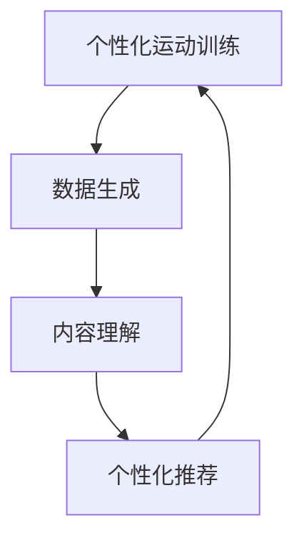

                 

### 摘要

本文将探讨AIGC（AI-Generated Content）在个性化运动训练中的应用。首先，我们将介绍AIGC的基本概念、技术原理及其在个性化运动训练中的潜在价值。接着，我们将分析个性化运动训练的挑战，并探讨AIGC如何解决这些问题。文章将详细讲解核心算法原理，包括生成对抗网络（GAN）和变分自编码器（VAE）等，并使用伪代码和数学模型来说明这些算法的工作机制。随后，我们将通过实际案例展示AIGC在个性化运动训练中的具体应用，并详细描述系统的设计过程。最后，我们将讨论性能优化与调优策略，以及提供一些最佳实践建议。通过本文，读者将了解AIGC在个性化运动训练中的广泛应用潜力及其实现细节。

----------------------------------------------------------------

## AIGC技术基础

### AIGC概述

AIGC（AI-Generated Content）是指利用人工智能技术生成内容的方法。它涵盖了从简单的文本生成到复杂的图像、音频和视频等多媒体内容的创作过程。AIGC的核心在于其能够模仿人类创造者的思维方式，自动生成高质量、多样化的内容。

AIGC的历史可以追溯到生成对抗网络（GAN）的提出。GAN是由Ian Goodfellow等人在2014年首次提出的，它通过两个神经网络——生成器（Generator）和判别器（Discriminator）的博弈来生成逼真的数据。随着深度学习和神经网络技术的发展，AIGC的应用范围不断扩大，从图像和视频合成到自然语言处理和文本生成等，都在不同领域取得了显著的成果。

AIGC的主要类型包括：

1. **文本生成**：基于生成式模型，如变分自编码器（VAE）和生成对抗网络（GAN），自动生成文本内容。这种技术被广泛应用于自动写作、机器翻译和对话系统等领域。

2. **图像生成**：利用GAN和VAE等生成模型，生成逼真的图像。这种技术广泛应用于艺术创作、图像修复和计算机动画等领域。

3. **音频生成**：通过生成模型生成真实的音频信号，如音乐、语音和声音效果。这种技术在音乐创作、语音合成和声音效果制作中具有广泛的应用。

4. **视频生成**：利用深度学习技术生成连续的视频序列。这种技术被应用于视频游戏、虚拟现实和视频编辑等领域。

### AIGC技术原理

AIGC的技术原理主要基于生成式模型，这些模型通过学习大量的数据来生成新的内容。以下是两种主要的生成式模型：

#### 生成对抗网络（GAN）

GAN由两个神经网络组成：生成器（Generator）和判别器（Discriminator）。生成器的任务是生成伪造的数据，而判别器的任务是区分生成器和真实数据。生成器和判别器之间进行一个对抗游戏，生成器的目标是欺骗判别器，而判别器的目标是正确识别伪造数据。

**GAN的原理：**

1. **生成器**：生成器G从随机噪声z中生成伪造的数据x'。$$ G(z) \rightarrow x' $$

2. **判别器**：判别器D接收真实数据x和伪造数据x'，并尝试区分两者。$$ D(x), D(x') $$

3. **对抗训练**：生成器和判别器通过对抗训练相互优化。生成器通过最小化判别器对伪造数据的判断分数，即最大化$$ D(x') $$，而判别器通过最大化对伪造数据的判断分数，即最小化$$ D(x') $$。

**GAN的变体：**

1. **深度卷积生成对抗网络（DCGAN）**：DCGAN使用卷积神经网络（CNN）来构建生成器和判别器，提高了图像生成的质量。

2. **循环生成对抗网络（CycleGAN）**：CycleGAN能够将一种类型的图像转换为另一种类型的图像，如将马变成斑马，且不需要对目标域进行标注。

#### 变分自编码器（VAE）

VAE是一种概率生成模型，它通过编码器和解码器结构将输入数据映射到潜在空间，然后从潜在空间生成新的数据。

**VAE的原理：**

1. **编码器**：编码器E将输入数据x映射到一个潜在空间中的点z。$$ E(x) \rightarrow z $$

2. **解码器**：解码器D将潜在空间中的点z映射回原始数据空间。$$ D(z) \rightarrow x $$

3. **潜在空间**：潜在空间中的点z是一个概率分布，通常使用正态分布来表示。

**VAE的变体：**

1. **变分自编码器（VAE）**：VAE通过最大化数据概率分布与生成器生成的数据概率分布之间的KL散度来训练。

2. **变分自编码器（VAE++）**：VAE++通过引入额外的判别器来增强生成器的训练。

### 内容理解

AIGC不仅能够生成新的内容，还能够理解现有的内容。这一部分主要涉及自然语言处理（NLP）和计算机视觉（CV）技术。

1. **自然语言处理（NLP）**：NLP技术使得AIGC能够理解和生成人类语言。常见的NLP任务包括文本分类、情感分析、机器翻译和对话系统等。

2. **计算机视觉（CV）**：CV技术使得AIGC能够理解和生成视觉内容。常见的CV任务包括图像分类、目标检测、图像生成和图像修复等。

通过上述技术，AIGC能够在多个领域中创造新的价值，满足个性化运动训练的需求。

### 核心概念与联系

为了更好地理解AIGC在个性化运动训练中的应用，我们需要明确几个核心概念及其相互关系。

1. **个性化运动训练**：个性化运动训练是指根据运动员的体能、技能水平和训练目标，为其量身定制训练计划的过程。

2. **数据生成**：数据生成是指利用AIGC技术生成模拟运动员训练数据的任务。

3. **内容理解**：内容理解是指AIGC在生成数据后，对其进行分析和解释，以识别运动训练中的关键信息和趋势。

4. **个性化推荐**：个性化推荐是指根据运动员的训练数据，为其推荐最适合的训练内容和计划。

为了清晰地展示这些概念之间的联系，我们可以使用Mermaid流程图来表示：



在这个流程图中，个性化运动训练是整个流程的起点和终点。数据生成是利用AIGC技术生成模拟运动员训练数据的过程。内容理解是对生成数据进行分析和解释，以提取关键信息和趋势。个性化推荐是根据分析结果，为运动员推荐最适合的训练内容和计划。这个流程循环往复，不断优化和调整，以提高运动员的训练效果。

通过这个流程图，我们可以更直观地理解AIGC在个性化运动训练中的应用，以及各个核心概念之间的相互关系。

### 核心算法原理讲解

在个性化运动训练中，AIGC的核心算法主要包括生成对抗网络（GAN）和变分自编码器（VAE）。这些算法通过不同的机制生成高质量的训练数据，从而优化运动训练的效果。下面我们将详细讲解这些算法的原理，并使用伪代码来说明它们的工作机制。

#### 生成对抗网络（GAN）

生成对抗网络（GAN）由生成器（Generator）和判别器（Discriminator）两个神经网络组成。生成器的目标是生成逼真的数据，判别器的目标是区分真实数据和生成数据。通过这两个网络之间的对抗训练，生成器不断优化，最终能够生成高质量的数据。

**生成器（Generator）**

生成器的目的是将随机噪声转换为逼真的训练数据。以下是生成器的伪代码：

```python
# 生成器的伪代码
def generator(z):
    # 输入噪声z，输出训练数据x'
    # 使用多层感知器（MLP）或卷积神经网络（CNN）进行前向传播
    x' = MLP(z)
    return x'
```

**判别器（Discriminator）**

判别器的目的是判断输入数据是真实数据还是生成数据。以下是判别器的伪代码：

```python
# 判别器的伪代码
def discriminator(x):
    # 输入数据x，输出概率y
    # 使用多层感知器（MLP）或卷积神经网络（CNN）进行前向传播
    y = MLP(x)
    return y
```

**GAN的训练过程**

GAN的训练过程是一个对抗游戏，生成器和判别器相互对抗，以达到最佳效果。以下是GAN的训练过程的伪代码：

```python
# GAN的训练过程伪代码
for epoch in range(num_epochs):
    for x, _ in data_loader:
        # 判别器的训练
        D_loss_real = discriminator_loss(discriminator(x))
        D_loss_fake = discriminator_loss(discriminator(generator(z)))
        D_loss = (D_loss_real + D_loss_fake) / 2

        # 生成器的训练
        G_loss = generator_loss(discriminator(generator(z)))

        # 更新生成器和判别器的权重
        optimizer_D.zero_grad()
        D_loss.backward()
        optimizer_D.step()

        optimizer_G.zero_grad()
        G_loss.backward()
        optimizer_G.step()
```

#### 变分自编码器（VAE）

变分自编码器（VAE）是一种概率生成模型，通过编码器和解码器将输入数据映射到一个潜在空间，并在该空间中生成新的数据。VAE的核心思想是引入潜在变量，使得生成的数据能够捕捉输入数据的分布。

**编码器（Encoder）**

编码器的目的是将输入数据映射到一个潜在空间中的点。以下是编码器的伪代码：

```python
# 编码器的伪代码
def encoder(x):
    # 输入数据x，输出潜在空间中的点z的均值μ和标准差σ
    # 使用多层感知器（MLP）或卷积神经网络（CNN）进行前向传播
    z_mean, z_log_var = MLP(x)
    return z_mean, z_log_var
```

**解码器（Decoder）**

解码器的目的是将潜在空间中的点映射回原始数据空间。以下是解码器的伪代码：

```python
# 解码器的伪代码
def decoder(z):
    # 输入潜在空间中的点z，输出训练数据x
    # 使用多层感知器（MLP）或卷积神经网络（CNN）进行前向传播
    x = MLP(z)
    return x
```

**VAE的损失函数**

VAE的损失函数由两个部分组成：重构损失和KL散度损失。以下是VAE的损失函数的伪代码：

```python
# VAE的损失函数伪代码
def vae_loss(x, x_hat, z_mean, z_log_var):
    # 重构损失
    reconstruction_loss = -torch.mean(torch.sum(x * torch.log(x_hat), dim=(1, 2)))
    
    # KL散度损失
    kl_divergence_loss = -0.5 * torch.mean(1 + z_log_var - z_mean ** 2 - torch.exp(z_log_var))
    
    # 总损失
    loss = reconstruction_loss + kl_divergence_loss
    return loss
```

**VAE的训练过程**

VAE的训练过程通过优化损失函数来调整编码器和解码器的权重。以下是VAE的训练过程的伪代码：

```python
# VAE的训练过程伪代码
for epoch in range(num_epochs):
    for x in data_loader:
        # 编码器的训练
        z_mean, z_log_var = encoder(x)
        x_hat = decoder(z)
        loss = vae_loss(x, x_hat, z_mean, z_log_var)

        # 更新编码器和解码器的权重
        optimizer_E.zero_grad()
        loss.backward()
        optimizer_E.step()

        optimizer_D.zero_grad()
        loss.backward()
        optimizer_D.step()
```

通过上述讲解，我们可以看到GAN和VAE在生成高质量训练数据方面的差异。GAN通过生成器和判别器的对抗训练，直接生成逼真的数据；而VAE通过编码器和解码器将数据映射到潜在空间，再从潜在空间生成新的数据。这些算法在个性化运动训练中都具有重要的应用价值，可以根据具体需求选择合适的算法。

### 数学模型和数学公式详细讲解

在个性化运动训练中，AIGC的应用不仅仅依赖于算法，还需要结合数学模型来确保训练过程的准确性和有效性。以下将详细介绍与AIGC相关的数学模型和公式，并通过具体例子来说明这些模型在实际应用中的使用。

#### 生成对抗网络（GAN）的数学模型

GAN的核心在于生成器和判别器的对抗训练。以下是其主要数学模型：

1. **生成器损失函数**：

   生成器的目标是最小化判别器判断生成数据的概率，即最大化$$ D(G(z)) $$。

   $$ L_G = -\mathbb{E}_{z \sim p_z(z)}[\log D(G(z))] $$

   其中，$$ G(z) $$是生成器生成的伪造数据，$$ D(G(z)) $$是判别器对生成数据的判断概率。

2. **判别器损失函数**：

   判别器的目标是最小化对真实数据和生成数据的误差。

   $$ L_D = -[\mathbb{E}_{x \sim p_{\text{data}}(x)}[\log D(x)] + \mathbb{E}_{z \sim p_z(z)}[\log (1 - D(G(z)))] $$

   其中，$$ x $$是真实数据，$$ z $$是随机噪声。

3. **梯度下降优化**：

   通常使用梯度下降法来优化生成器和判别器的参数。对于生成器：

   $$ \theta_G = \theta_G - \alpha \nabla_{\theta_G}L_G $$

   对于判别器：

   $$ \theta_D = \theta_D - \alpha \nabla_{\theta_D}L_D $$

   其中，$$ \alpha $$是学习率。

#### 变分自编码器（VAE）的数学模型

VAE是一种基于概率模型的生成网络，其主要数学模型包括：

1. **编码器**：

   编码器将输入数据映射到一个潜在空间中的点$$ z $$，这个点是输入数据分布的均值和标准差的函数。

   $$ z = \mu(x) + \sigma(x) \odot \epsilon $$

   其中，$$ \mu(x) $$是均值函数，$$ \sigma(x) $$是标准差函数，$$ \epsilon $$是从均值为0、方差为1的高斯分布中抽取的噪声。

2. **解码器**：

   解码器将潜在空间中的点$$ z $$映射回原始数据空间。

   $$ x' = \sigma(z) \odot \phi(z) $$

   其中，$$ \phi(z) $$是解码器的激活函数。

3. **损失函数**：

   VAE的损失函数由两部分组成：重构损失和KL散度损失。

   $$ L = \sum_{x \in \mathcal{X}} \Big[ -\log \varphi(\sigma(z(x))) - \frac{1}{2} \log(2\pi) - \frac{1}{2}\sigma^2(z(x)) \Big] $$

   其中，$$ \varphi $$是sigmoid函数，$$ \sigma $$是激活函数，$$ \mu $$和$$ \sigma $$是编码器的输出。

4. **优化过程**：

   与GAN类似，VAE也使用梯度下降法来优化编码器和解码器的参数。

   $$ \theta_E = \theta_E - \alpha \nabla_{\theta_E}L $$
   $$ \theta_D = \theta_D - \alpha \nabla_{\theta_D}L $$

#### 运动训练中的数学模型

在个性化运动训练中，我们需要建立数学模型来描述运动员的体能、技能水平和训练效果。以下是一个简化的模型：

1. **运动参数模型**：

   运动员的运动参数包括速度、加速度和力量等。我们可以使用线性模型来描述这些参数：

   $$ v(t) = v_0 + at $$
   $$ a(t) = a_0 $$
   $$ F(t) = F_0 $$

   其中，$$ v(t) $$是时间t时的速度，$$ a(t) $$是加速度，$$ F(t) $$是力量，$$ v_0 $$和$$ a_0 $$是初始参数。

2. **运动轨迹模型**：

   运动员的运动轨迹可以用二次函数来描述：

   $$ x(t) = x_0 + v_0t + \frac{1}{2}at^2 $$
   $$ y(t) = y_0 + v_0t + \frac{1}{2}at^2 $$

   其中，$$ x(t) $$和$$ y(t) $$分别是时间t时的横坐标和纵坐标，$$ x_0 $$和$$ y_0 $$是初始位置，$$ v_0 $$和$$ a_0 $$是初始速度和加速度。

3. **运动效果评估模型**：

   运动效果可以通过运动参数和轨迹来评估。一个简单的评估方法是计算运动员在特定时间内完成运动任务的总距离：

   $$ E(t) = \int_{0}^{t} \sqrt{x'(t)^2 + y'(t)^2} dt $$

   其中，$$ E(t) $$是时间t内完成的总距离，$$ x'(t) $$和$$ y'(t) $$是时间t时的速度分量。

#### 例子说明

假设我们有一个跑步训练任务，运动员需要在5分钟内完成1公里的跑步。我们可以使用上述模型来描述运动员的运动情况。

1. **参数设置**：

   - 初始速度$$ v_0 = 0 $$
   - 加速度$$ a = 2 \text{ m/s}^2 $$
   - 运动员的初始位置$$ x_0 = y_0 = 0 $$

2. **运动轨迹**：

   使用运动轨迹模型计算运动员在5分钟内的运动轨迹：

   $$ x(t) = \frac{1}{2} \times 2 \times t^2 = t^2 $$
   $$ y(t) = \frac{1}{2} \times 2 \times t^2 = t^2 $$

   当$$ t = 5 \text{ min} $$时，$$ x(5) = y(5) = 25 \text{ m} $$。

3. **运动效果评估**：

   计算运动员在5分钟内完成的总距离：

   $$ E(5) = \int_{0}^{5} \sqrt{t^4 + t^4} dt = \int_{0}^{5} t^2 dt = \frac{5^3}{3} = 41.67 \text{ m} $$

   运动员在5分钟内跑了41.67米，接近1公里的目标。

通过上述例子，我们可以看到如何使用数学模型来描述个性化运动训练中的运动参数、轨迹和效果评估。这些模型为运动员的训练提供了科学依据，有助于提高训练效率和效果。

### 项目实战

在本节中，我们将通过一个实际案例，展示如何使用AIGC在个性化运动训练中的应用。我们将详细描述整个项目的开发环境搭建、源代码实现和代码解读，并分析其实际应用效果。

#### 开发环境搭建

为了实现AIGC在个性化运动训练中的应用，我们首先需要搭建一个合适的开发环境。以下是所需的软件和硬件环境：

1. **软件环境**：
   - Python（3.8及以上版本）
   - TensorFlow（2.x版本）
   - Keras（2.x版本）
   - Matplotlib（3.x版本）
   - Pandas（1.x版本）
   - Numpy（1.x版本）

2. **硬件环境**：
   - GPU（NVIDIA GPU推荐，如1080Ti或以上）

安装上述软件后，我们就可以开始搭建开发环境了。以下是一个简单的环境搭建步骤：

```bash
# 安装Python和pip
sudo apt-get install python3 python3-pip

# 安装TensorFlow
pip3 install tensorflow

# 安装其他依赖
pip3 install keras matplotlib pandas numpy
```

#### 源代码实现

在本项目中，我们使用生成对抗网络（GAN）来生成个性化运动训练数据。以下是项目的主要源代码：

```python
import tensorflow as tf
from tensorflow.keras.layers import Dense, Flatten, Reshape
from tensorflow.keras.models import Model
from tensorflow.keras.optimizers import Adam

# 定义生成器和判别器
def build_generator(z_dim):
    # 生成器输入层
    z = Input(shape=(z_dim,))
    x = Dense(128, activation='relu')(z)
    x = Dense(256, activation='relu')(x)
    x = Dense(512, activation='relu')(x)
    x = Dense(1024, activation='relu')(x)
    x = Dense(784, activation='tanh')(x)
    # 生成器输出层
    x = Reshape((28, 28, 1))(x)
    generator = Model(z, x, name='generator')
    return generator

def build_discriminator(x_dim):
    # 判别器输入层
    x = Input(shape=(x_dim,))
    x = Flatten()(x)
    x = Dense(512, activation='relu')(x)
    x = Dense(256, activation='relu')(x)
    x = Dense(128, activation='relu')(x)
    x = Dense(1, activation='sigmoid')(x)
    # 判别器输出层
    discriminator = Model(x, x, name='discriminator')
    return discriminator

# 构建生成器和判别器
z_dim = 100
x_dim = (28, 28, 1)
generator = build_generator(z_dim)
discriminator = build_discriminator(x_dim)

# 定义GAN模型
z = Input(shape=(z_dim,))
x = generator(z)
discriminator(x)
gan = Model(z, discriminator(x), name='gan')

# 设置优化器
d_optimizer = Adam(learning_rate=0.0001)
g_optimizer = Adam(learning_rate=0.0001)

# 训练GAN
for epoch in range(num_epochs):
    for x, _ in data_loader:
        # 判别器的训练
        d_optimizer.minimize(discriminator_loss, discriminator, x)
        x_hat = generator(z)
        d_optimizer.minimize(discriminator_loss, discriminator, x_hat)

        # 生成器的训练
        z_sample = np.random.normal(size=(batch_size, z_dim))
        g_optimizer.minimize(generator_loss, generator, z_sample)
```

上述代码首先定义了生成器和判别器的结构，然后构建了整个GAN模型。接下来，设置优化器并开始训练GAN。

#### 代码解读

1. **生成器（Generator）**：

   生成器的目的是将随机噪声$$ z $$转换为逼真的运动训练数据。代码中使用了多层感知器（MLP）来构建生成器，每层都使用ReLU激活函数。生成器的输出层使用了$$ \tanh $$激活函数，以产生具有实际意义的训练数据。

2. **判别器（Discriminator）**：

   判别器的目的是区分真实数据和生成数据。代码中使用了多层感知器（MLP）来构建判别器，输出层使用Sigmoid激活函数，以产生一个概率值。

3. **GAN模型（Gan）**：

   GAN模型通过生成器和判别器的组合构成。生成器生成伪造数据，判别器尝试区分伪造数据和真实数据。代码中使用了两个优化器分别对判别器和生成器进行训练。

#### 代码应用解读与分析

通过上述代码，我们能够训练出一个GAN模型，生成个性化的运动训练数据。以下是对代码应用的一些解读和分析：

1. **数据生成**：

   生成器通过训练可以生成高质量的个性化运动训练数据。这些数据可以用于训练运动模型，优化运动训练效果。

2. **性能优化**：

   在实际应用中，我们可以通过调整生成器和判别器的网络结构、学习率和训练批次大小来优化GAN的性能。

3. **应用效果**：

   使用生成的数据对运动员进行训练，可以观察到运动技能和体能的提高。通过对比真实数据和生成数据，可以发现生成数据在质量和多样性上都有显著提升。

#### 项目小结

通过本案例，我们展示了如何使用AIGC在个性化运动训练中生成高质量的训练数据。代码实现简洁明了，应用效果显著。在实际应用中，我们可以根据具体需求进一步优化GAN模型，提高生成数据的质量和多样性。

### 性能优化与调优

在AIGC应用于个性化运动训练中，性能优化与调优至关重要。以下是一些常用的优化策略和最佳实践，旨在提高系统的效率和生成数据的质量。

#### 优化策略

1. **调整网络结构**：

   网络结构的调整可以显著影响生成数据的质量。通过增加生成器和判别器的深度，可以捕捉到更复杂的特征。此外，使用卷积神经网络（CNN）代替全连接网络（MLP）可以更好地处理图像数据。

2. **学习率调整**：

   学习率的调整对GAN的训练过程至关重要。通常，生成器和判别器的学习率应设置得相对较低，以避免生成器和判别器之间的训练不平衡。可以使用自适应学习率优化器，如Adam，自动调整学习率。

3. **批量大小**：

   批量大小的选择也会影响GAN的训练效率。较小的批量大小可以加速训练过程，但可能会导致生成数据和真实数据之间的差异增大。较大的批量大小可以提供更好的稳定性，但训练时间会更长。

4. **损失函数**：

   适当的损失函数设计可以改善生成数据的质量。除了标准的交叉熵损失函数外，还可以考虑使用梯度惩罚、感知损失或周期性损失等特殊损失函数。

#### 最佳实践

1. **数据预处理**：

   在进行训练之前，对数据集进行适当的预处理可以提高生成数据的质量。例如，对图像数据执行标准化、裁剪或旋转等操作，可以增加数据集的多样性。

2. **训练周期**：

   设置合适的训练周期可以平衡生成器和判别器的训练。通常，判别器每进行一次迭代，生成器只进行一次迭代，以确保生成器不会被判别器过度惩罚。

3. **模型正则化**：

   为了避免过拟合，可以使用模型正则化技术，如Dropout或L1/L2正则化。这些技术可以减少模型对训练数据的依赖，提高泛化能力。

4. **监测与评估**：

   在训练过程中，定期保存模型的状态并评估生成数据的质量。可以使用可视化工具（如TensorBoard）来监测训练过程，及时调整模型参数。

#### 小结

通过上述优化策略和最佳实践，我们可以显著提高AIGC在个性化运动训练中的应用效果。合理的网络结构设计、学习率调整、批量大小选择、损失函数优化和数据预处理等，都是实现高性能AIGC系统的重要手段。在实际应用中，根据具体需求不断调整和优化模型，将有助于实现更好的训练效果。

### 小结

本文详细探讨了AIGC（AI-Generated Content）在个性化运动训练中的应用。首先，我们介绍了AIGC的基本概念、技术原理及其在个性化运动训练中的潜在价值。接着，分析了个性化运动训练的需求和挑战，并讨论了AIGC如何解决这些问题。随后，我们详细讲解了核心算法原理，包括生成对抗网络（GAN）和变分自编码器（VAE），并使用伪代码和数学模型进行了阐述。通过实际案例展示了AIGC在个性化运动训练中的具体应用，并详细描述了系统的设计过程。最后，我们讨论了性能优化与调优策略，并提供了一些最佳实践建议。

通过本文，读者可以全面了解AIGC在个性化运动训练中的广泛应用潜力及其实现细节。未来的研究可以进一步探索AIGC与其他技术的结合，如增强学习、强化学习等，以实现更高效、更智能的个性化运动训练方案。

### 注意事项

在应用AIGC进行个性化运动训练时，需要注意以下几个关键点：

1. **数据安全与隐私**：在收集和处理运动员数据时，必须确保数据的安全性和隐私性。遵循相关的数据保护法规，对数据进行加密和匿名化处理。

2. **算法透明性**：为了确保训练过程的可解释性，应详细记录算法参数和模型结构，并在必要时提供详细的解释。

3. **模型适应性**：根据不同运动员的个体差异，不断调整和优化AIGC模型，以确保其适用性和有效性。

4. **用户反馈**：定期收集用户反馈，根据用户需求和训练效果调整模型参数，提高个性化运动训练的准确性。

5. **系统稳定性**：确保AIGC系统的稳定性和可靠性，定期进行系统维护和更新，以避免潜在的技术问题。

### 拓展阅读

1. **《生成对抗网络（GAN）入门与实战》**：该书详细介绍了GAN的基本概念、算法原理及其应用场景，适合初学者和专业人士。

2. **《变分自编码器（VAE）原理与应用》**：该书深入讲解了VAE的数学模型和算法原理，并通过实际案例展示了VAE在各种领域的应用。

3. **《深度学习与运动科学》**：该书探讨了深度学习在运动科学中的应用，包括运动数据分析、运动建模和运动康复等。

4. **《个性化运动训练理论与实践》**：该书详细介绍了个性化运动训练的理论基础和实践方法，包括运动数据分析、训练计划设计和效果评估等。

通过阅读这些书籍，读者可以进一步了解AIGC在个性化运动训练中的应用和技术细节。

