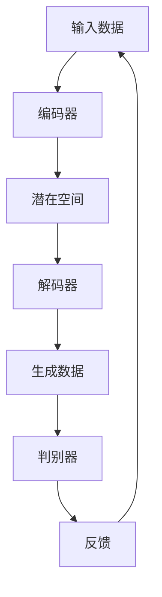

                 


### 第1章 引言

#### 1.1 AIGC的概念与应用

**背景介绍**

随着人工智能技术的不断发展，生成对抗网络（GAN）和变分自编码器（VAE）等生成模型在图像、文本和音频生成领域取得了显著成果。这些模型的出现，使得自适应智能生成计算（Adaptive Intelligent Generation Computing，简称AIGC）逐渐成为研究热点。AIGC是一种基于深度学习的生成计算方法，通过自适应地生成和优化数据，从而实现对复杂数据的建模和生成。

**核心概念与联系**

AIGC的核心概念包括生成对抗网络（GAN）和变分自编码器（VAE）。GAN由生成器（Generator）和判别器（Discriminator）组成，通过两个网络的对抗训练，生成器不断生成逼真的数据，判别器则不断学习区分真实数据和生成数据。VAE则通过编码器（Encoder）和解码器（Decoder）的学习，将输入数据映射到潜在空间，再从潜在空间生成新的数据。

**Mermaid流程图**

以下是一个简化的AIGC流程图：



#### 1.2 本书结构

**内容概述**

本书旨在深入探讨AIGC在个性化运动训练中的应用，包括AIGC的基础理论、运动数据分析与处理、AI教练的精准指导等内容。具体章节安排如下：

1. 引言
2. AIGC基础理论
3. AIGC在个性化运动训练中的应用
4. 运动数据分析与处理
5. AI教练的精准指导
6. 项目实战
7. 总结与展望

### 第2章 AIGC基础理论

#### 2.1 生成对抗网络（GAN）

**核心算法原理讲解**

生成对抗网络（GAN）由生成器（Generator）和判别器（Discriminator）组成。生成器的目标是生成尽可能逼真的数据，判别器的目标是区分真实数据和生成数据。通过两个网络的对抗训练，生成器不断优化，生成更逼真的数据，判别器则不断学习，提高对真实数据和生成数据的区分能力。

**伪代码**

以下是一个简化的GAN训练过程的伪代码：

```python
# 初始化生成器G和判别器D
G, D = initialize_models()

# 训练过程
for epoch in range(num_epochs):
    for real_data in real_data_loader:
        # 训练判别器
        D.train_on_real_data(real_data)
        
        for generated_data in generated_data_loader:
            # 训练生成器
            G.train_on_generated_data(generated_data)
            
    # 计算生成器的损失
    g_loss = compute_generator_loss(G)
    # 计算判别器的损失
    d_loss = compute_discriminator_loss(D)
    
    # 输出损失
    print(f"Epoch {epoch}: g_loss = {g_loss}, d_loss = {d_loss}")
```

#### 2.2 变分自编码器（VAE）

**核心算法原理讲解**

变分自编码器（VAE）通过编码器（Encoder）将输入数据映射到潜在空间，通过解码器（Decoder）将潜在空间的数据映射回原始数据空间。VAE的核心在于引入了潜在变量，使得数据生成过程具有变分性。

**数学模型和数学公式讲解**

VAE的损失函数通常由两部分组成：数据重构损失和Kullback-Leibler散度损失。

- **数据重构损失**：衡量输入数据与解码器生成的数据之间的差异。

$$L_{reconstruction} = -\sum_{x} p(x|\mu, \sigma) \log p(x|\mu, \sigma)$$

- **Kullback-Leibler散度损失**：衡量编码器映射的潜在变量分布与先验分布之间的差异。

$$L_{KL} = -\sum_{z} p(z) \log \frac{p(z|\theta)}{p(z)}$$

**数学公式举例说明**

假设输入数据为$x \in \mathbb{R}^{D}$，潜在变量为$z \in \mathbb{R}^{z}$，编码器参数为$\theta$，则VAE的生成模型可以表示为：

$$\mu = \phi(x; \theta), \quad \sigma^2 = \psi(x; \theta)$$

解码器模型可以表示为：

$$x' = \psi(z; \theta')$$

#### 2.3 AIGC模型的选择与优化

**模型选择**

在个性化运动训练中，选择适合的AIGC模型至关重要。GAN由于其强大的生成能力，更适合处理复杂、多样性的运动数据；而VAE则因其能够捕捉数据的潜在结构，更适合进行数据重构和生成。

**模型优化**

为了提高AIGC模型在个性化运动训练中的性能，可以采用以下策略：

- **损失函数调整**：通过调整生成器和判别器的损失函数，优化模型训练。
- **超参数优化**：调整学习率、批量大小等超参数，以获得更好的训练效果。
- **数据预处理**：对训练数据进行适当的预处理，提高模型的泛化能力。

### 第3章 AIGC在个性化运动训练中的应用

#### 3.1 运动数据的收集与预处理

**数据收集**

运动数据包括动作捕捉数据、生理数据、环境数据等。通过传感器、摄像头、生理监测设备等收集这些数据。

**数据预处理**

对收集到的运动数据进行预处理，包括去噪、归一化、特征提取等步骤，以提高数据的可用性和模型的训练效果。

#### 3.2 个性化训练计划的生成

**生成算法**

使用AIGC模型生成个性化的训练计划，包括动作模式、运动强度、训练周期等。

**案例研究**

以足球运动员为例，分析如何使用AIGC生成个性化的训练计划，以适应不同的比赛需求和身体状态。

#### 3.3 运动表现的评估与调整

**评估指标**

设计一套评估体系，包括动作准确性、运动效率、身体状态等指标，对运动员的运动表现进行评估。

**调整策略**

根据评估结果，调整训练计划，优化运动员的运动表现。

### 第4章 运动数据分析与处理

#### 4.1 数据分析技术

**数据分析技术**

介绍如何使用数据分析技术对运动数据进行分析，包括时间序列分析、聚类分析、关联规则挖掘等。

**算法实现**

使用伪代码展示运动数据分析算法的实现。

#### 4.2 数据可视化

**可视化技术**

介绍如何使用数据可视化技术展示运动数据，包括散点图、折线图、热力图等。

**案例展示**

提供实际案例，展示如何进行运动数据可视化。

### 第5章 AI教练的精准指导

#### 5.1 AI教练的角色与功能

**AI教练的角色**

解释AI教练在个性化运动训练中的作用，包括训练计划制定、运动表现评估、个性化指导等。

**AI教练的功能**

介绍AI教练的主要功能，如动作指导、强度控制、疲劳监测等。

#### 5.2 AI教练的个性化定制

**定制流程**

讲解AI教练如何进行个性化定制，包括用户画像、需求分析、训练计划生成等。

**用户反馈**

讨论AI教练如何根据用户反馈进行调整，提高个性化指导的准确性。

### 第6章 项目实战：AIGC在个性化运动训练中的应用

#### 6.1 开发环境搭建

**环境搭建**

介绍如何搭建AIGC在个性化运动训练中的开发环境，包括Python、TensorFlow、Keras等工具的安装与配置。

#### 6.2 源代码详细实现

**代码实现**

提供AIGC在个性化运动训练中的源代码实现，包括数据收集、预处理、模型训练、运动表现评估等。

**代码解读**

详细解读源代码，分析代码实现的关键技术和思路。

#### 6.3 代码应用解读与分析

**应用解读**

分析如何将AIGC技术应用于个性化运动训练，包括训练计划的生成、运动表现的评估等。

**案例分析**

提供实际案例，展示如何使用AIGC进行个性化运动训练。

#### 6.4 项目小结

**项目总结**

总结AIGC在个性化运动训练中的应用成果，分析项目的优势和不足。

**最佳实践 tips**

提供一些最佳实践建议，以提高AIGC在个性化运动训练中的效果。

### 第7章 总结与展望

#### 7.1 总结

**核心内容回顾**

回顾本书的核心内容，包括AIGC的概念、基础理论、应用场景等。

**成果总结**

总结AIGC在个性化运动训练中的应用成果，分析其对运动训练的影响。

#### 7.2 展望

**未来发展方向**

探讨AIGC在个性化运动训练中的未来发展方向，包括技术升级、应用拓展等。

**挑战与机遇**

分析AIGC在个性化运动训练中面临的挑战和机遇，展望其发展前景。

作者：AI天才研究院/AI Genius Institute & 禅与计算机程序设计艺术 /Zen And The Art of Computer Programming

### 文章关键词

- AIGC
- 个性化运动训练
- 生成对抗网络
- 变分自编码器
- 数据分析
- AI教练

### 文章摘要

本文深入探讨了自适应智能生成计算（AIGC）在个性化运动训练中的应用。首先，介绍了AIGC的概念及其与生成对抗网络（GAN）和变分自编码器（VAE）的联系。随后，详细阐述了AIGC的基础理论，包括核心算法原理、数学模型和优化策略。接着，本文分析了AIGC在个性化运动训练中的实际应用，包括运动数据的收集与预处理、个性化训练计划的生成、运动表现的评估与调整等。此外，本文还介绍了如何利用AIGC技术为运动员提供精准的指导，并通过实际项目案例展示了AIGC在个性化运动训练中的效果。最后，本文总结了AIGC在个性化运动训练中的应用成果，并展望了其未来的发展方向。作者：AI天才研究院/AI Genius Institute & 禅与计算机程序设计艺术 /Zen And The Art of Computer Programming。

