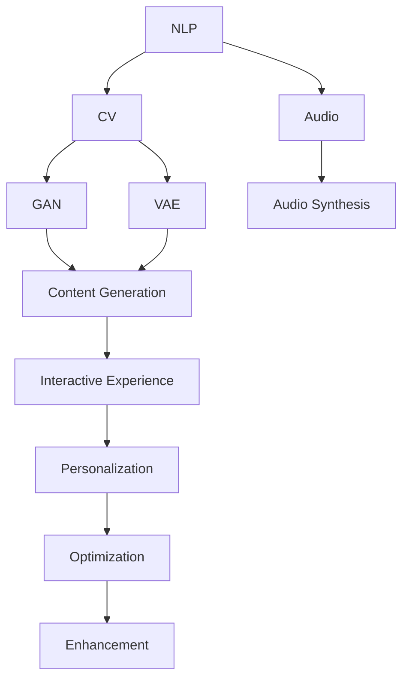

                 

### 背景介绍

#### 博物馆体验的现状与挑战

博物馆作为文化传承和知识传播的重要场所，其传统参观体验往往局限于静态的展示和线性的导览。然而，随着科技的迅猛发展，特别是人工智能（AI）技术的成熟应用，博物馆体验正在发生深刻的变革。传统博物馆面临着诸多挑战，包括如何吸引年轻观众、提升互动体验、优化展览内容等。

近年来，人工智能技术的不断进步，使得AIGC（AI-Generated Content）技术成为博物馆体验创新的重要驱动力。AIGC是一种利用AI技术生成内容的方法，涵盖了文本、图像、音频和视频等多种形式。在博物馆中，AIGC技术可以通过生成个性化内容、智能导览、互动展览等多种方式，提升观众的参观体验。

#### AIGC技术的定义与应用场景

AIGC（AI-Generated Content）是一种利用人工智能技术自动生成内容的方法，其核心在于将人工智能技术应用于内容的创造过程。AIGC技术包括自然语言生成、图像生成、音频合成等，广泛应用于内容创作、广告营销、虚拟现实等领域。

在博物馆中，AIGC技术的应用场景丰富多样。例如，自然语言生成技术可以用于生成个性化导览脚本，为观众提供定制化的参观建议；图像生成技术可以用于创作虚拟展览，使观众能够在线上体验虚拟博物馆；音频合成技术可以用于生成背景音乐和语音解说，增强展览的沉浸感。

#### 博物馆体验中AIGC技术的重要性

AIGC技术在博物馆体验中的应用具有重要意义。首先，它能够提升观众的参与感和互动性，使博物馆参观不再只是被动的观看，而是成为主动探索和发现的过程。其次，AIGC技术可以帮助博物馆实现内容个性化，根据观众的兴趣和行为，提供个性化的展览内容和服务。最后，AIGC技术还可以帮助博物馆优化展览设计和展示方式，提高展览的吸引力和教育价值。

总的来说，随着AIGC技术的不断成熟和普及，博物馆体验将迎来新的变革，观众将能够享受到更加丰富、多样、个性化的参观体验。这不仅有助于提升博物馆的吸引力和知名度，也为文化遗产的保护和传承提供了新的思路和方法。

### 核心概念与联系

要深入探讨AIGC在博物馆体验中的创新应用，我们首先需要明确AIGC的核心概念和各技术之间的关系。AIGC（AI-Generated Content）是人工智能技术的重要分支，涉及多个子领域，包括自然语言处理（NLP）、计算机视觉、音频处理和生成模型等。以下是对这些核心概念和它们之间关系的详细阐述。

#### 自然语言处理（NLP）

自然语言处理是AIGC的重要组成部分，它旨在使计算机能够理解和处理人类语言。在博物馆应用中，NLP技术可以用于生成个性化导览脚本、解答观众问题、生成展览描述等。具体来说，NLP包括文本分析、语义理解、情感分析等子任务。

- **文本分析**：通过分析博物馆的文本资料，提取关键信息和元数据，为后续内容生成提供素材。
- **语义理解**：理解文本中的语义关系，确保生成的导览脚本准确无误。
- **情感分析**：分析观众的意见和反馈，了解他们的情感状态，从而提供更加贴心的服务。

#### 计算机视觉

计算机视觉是AIGC的另一个重要子领域，它使计算机能够理解和处理图像信息。在博物馆应用中，计算机视觉技术可以用于图像识别、目标检测、图像生成等任务。

- **图像识别**：识别博物馆中的展品、观众和环境，为导览系统提供视觉信息。
- **目标检测**：检测观众在博物馆中的位置和行为，为互动展览提供支持。
- **图像生成**：通过生成技术，创建虚拟展览和互动内容，提升观众的参观体验。

#### 音频处理

音频处理技术是AIGC中的另一重要组成部分，它使计算机能够理解和生成音频内容。在博物馆中，音频处理技术可以用于生成背景音乐、语音解说、互动声音效果等。

- **音频合成**：根据展览内容和观众需求，生成个性化的声音解说。
- **音频增强**：提高音频质量，确保观众能够清晰地听到解说内容。

#### 生成模型

生成模型是AIGC的核心技术之一，包括生成对抗网络（GAN）、变分自编码器（VAE）等。生成模型可以生成高质量的文本、图像和音频内容，是AIGC在博物馆应用中的关键技术。

- **文本生成**：生成个性化导览脚本、展览描述等。
- **图像生成**：创建虚拟展览和互动内容，如虚拟文物展示。
- **音频生成**：生成背景音乐、语音解说等，增强展览的沉浸感。

#### 技术之间的关系架构

为了更好地理解AIGC技术在博物馆中的应用，我们可以使用Mermaid流程图来展示这些核心概念和技术之间的关系。以下是一个简化的Mermaid流程图：



在这个流程图中，NLP、CV和Audio是AIGC的三大核心子领域，它们相互独立但又紧密关联。生成模型（GAN和VAE）作为核心技术，可以与NLP、CV和Audio相结合，实现高质量的内容生成。生成的内容（Content Generation）可以应用于互动体验（Interactive Experience），从而实现个性化（Personalization）和优化（Optimization），最终提升博物馆的参观体验。

通过这个流程图，我们可以清晰地看到AIGC技术在博物馆体验中的应用架构，这为后续章节的详细探讨提供了基础。

### AIGC核心算法原理讲解

#### 自然语言处理（NLP）算法原理

自然语言处理（NLP）是AIGC技术中的一个核心领域，它涉及文本的解析、理解和生成。以下是NLP中常用的几种算法原理和它们的应用。

**1. 词向量表示（Word Embedding）**

词向量表示是将自然语言中的词汇映射到高维空间中的向量表示。最著名的词向量模型是Word2Vec，它通过训练神经网络来学习词汇的上下文关系。词向量表示在博物馆中的应用主要包括：

- **导览脚本生成**：通过词向量模型，可以从已有的博物馆文本资料中提取关键信息，为导览脚本提供词汇素材。
- **语义相似度计算**：词向量模型可以计算两个词汇之间的语义相似度，帮助生成与观众兴趣相关的展览描述。

**2. 序列到序列模型（Seq2Seq）**

序列到序列模型是一种用于将一个序列映射到另一个序列的神经网络模型，常用于机器翻译和文本生成。在博物馆中，Seq2Seq模型可以用于：

- **个性化导览**：根据观众的输入，如兴趣点、参观时长等，生成个性化的导览脚本。
- **多语言支持**：将中文导览脚本自动翻译成其他语言，为国际观众提供服务。

**3. 递归神经网络（RNN）**

递归神经网络是一种能够处理序列数据的神经网络模型，其特点是能够记忆前面的输入信息。在博物馆中，RNN可以用于：

- **情感分析**：分析观众在社交媒体上的评论和反馈，了解他们的情感状态，为后续服务提供参考。
- **对话系统**：构建智能导览机器人，与观众进行自然语言交互，回答问题、提供信息。

**伪代码示例**

以下是一个简化的RNN算法伪代码示例，用于生成博物馆导览脚本：

```python
# 输入：观众兴趣标签、博物馆文本数据
# 输出：个性化导览脚本

function generate_guidance_script(interest_tags, museum_data):
    # 步骤1：初始化RNN模型
    rnn_model = initialize_rnn_model()

    # 步骤2：预处理输入数据
    processed_data = preprocess_data(museum_data, interest_tags)

    # 步骤3：生成导览脚本
    guidance_script = ""
    for input_sequence in processed_data:
        # 步骤3.1：编码输入序列
        encoded_sequence = encode_sequence(input_sequence)

        # 步骤3.2：通过RNN模型生成文本
        generated_text = rnn_model.generate_text(encoded_sequence)

        # 步骤3.3：将生成的文本添加到导览脚本中
        guidance_script += generated_text

    return guidance_script
```

#### 计算机视觉（CV）算法原理

计算机视觉（CV）是AIGC技术的另一个重要领域，它使计算机能够理解和解释视觉信息。以下是CV中常用的几种算法原理和它们的应用。

**1. 卷积神经网络（CNN）**

卷积神经网络是一种专门用于处理图像数据的神经网络模型。CNN通过卷积层、池化层和全连接层等结构，能够提取图像的特征并进行分类。

- **图像识别**：用于识别博物馆中的展品、观众和环境，为导览系统提供视觉信息。
- **目标检测**：用于检测博物馆中的人流、展品等目标，为互动展览提供支持。

**2. 生成对抗网络（GAN）**

生成对抗网络是一种通过两个神经网络（生成器和判别器）进行博弈的模型，旨在生成高质量的数据。GAN在博物馆中的应用包括：

- **虚拟展览生成**：通过GAN生成高质量的虚拟展览图像，使观众能够在线上体验虚拟博物馆。
- **图像修复和增强**：用于修复受损的文物图像，提高图像质量。

**3. 图像风格迁移**

图像风格迁移是一种通过将图像的内容与另一种图像的风格相结合，生成具有特定风格的新图像的技术。在博物馆中，图像风格迁移可以用于：

- **艺术展览**：将普通文物图像转换成艺术作品风格，如印象派或抽象画。
- **个性化导览**：为观众生成具有个性化风格的导览图像，增加参观的趣味性。

**伪代码示例**

以下是一个简化的CNN算法伪代码示例，用于图像识别：

```python
# 输入：博物馆展品图像
# 输出：展品类别

function recognize_item(image):
    # 步骤1：加载CNN模型
    cnn_model = load_cnn_model()

    # 步骤2：预处理图像
    preprocessed_image = preprocess_image(image)

    # 步骤3：通过CNN模型进行特征提取
    features = cnn_model.extract_features(preprocessed_image)

    # 步骤4：通过分类器进行类别预测
    item_category = classify_item(features)

    return item_category
```

#### 音频处理（Audio）算法原理

音频处理是AIGC技术中的一个重要组成部分，它涉及音频的生成、处理和增强。以下是音频处理中常用的几种算法原理和它们的应用。

**1. 频谱分析**

频谱分析是一种用于分析音频信号频率成分的方法。通过频谱分析，可以提取音频信号的主要频率成分，为后续处理提供基础。

- **声音识别**：用于识别博物馆中的声音事件，如讲解、音乐等。
- **音频增强**：通过频谱分析，提高音频信号的质量，确保观众能够清晰地听到解说内容。

**2. 声音合成**

声音合成是一种通过生成新的声音波形来模仿特定声音的方法。在博物馆中，声音合成可以用于：

- **背景音乐生成**：根据展览主题，生成适合的背景音乐。
- **语音解说生成**：通过合成技术，生成个性化的语音解说，为观众提供参观指导。

**3. 波形变形**

波形变形是一种通过改变音频波形的形状来改变声音特征的方法。在博物馆中，波形变形可以用于：

- **声音特效**：为互动展览添加声音特效，增加互动性。
- **个性化体验**：为观众生成具有个性化风格的声音解说。

**伪代码示例**

以下是一个简化的声音合成算法伪代码示例：

```python
# 输入：原始音频信号
# 输出：合成后的音频信号

function synthesize_sound(original_sound):
    # 步骤1：进行频谱分析
    spectrum = analyze_spectrum(original_sound)

    # 步骤2：进行波形变形
    transformed_spectrum = transform_spectrum(spectrum)

    # 步骤3：合成新的音频信号
    synthesized_sound = synthesize_from_spectrum(transformed_spectrum)

    return synthesized_sound
```

通过以上对AIGC核心算法原理的讲解和伪代码示例，我们可以更好地理解这些算法在博物馆体验中的应用。接下来，我们将进一步探讨这些算法在数学模型和项目实战中的应用。

### 数学模型和公式讲解

在AIGC技术中，数学模型和公式扮演着至关重要的角色，它们为我们提供了理解和实现核心算法的数学工具。以下是AIGC中常用的数学模型和公式的详细讲解，以及它们在博物馆体验中的应用。

#### 自然语言处理（NLP）的数学模型

1. **词向量表示（Word Embedding）**

词向量表示的核心在于将词汇映射到高维空间中的向量，最常用的模型是Word2Vec。Word2Vec模型基于**训练算法**，通常有两种：连续词袋（CBOW）和Skip-Gram。

- **CBOW（连续词袋）**：给定一个中心词，模型通过周围若干个词的上下文来预测中心词。其数学模型可以表示为：
  $$ \text{Output}(w_i) = \text{softmax}(\text{vec}(w_{i-k}^{i+k})) $$
  其中，$ w_i $是中心词，$ w_{i-k}^{i+k} $是上下文词的向量，$ \text{softmax} $函数用于计算每个词的概率。

- **Skip-Gram**：与CBOW相反，给定一个中心词，模型预测其周围的词。其数学模型可以表示为：
  $$ \text{Output}(w_j) = \text{softmax}(\text{vec}(w_i)) $$
  其中，$ w_j $是周围词，$ w_i $是中心词的向量。

2. **序列到序列模型（Seq2Seq）**

Seq2Seq模型是一种用于将一个序列映射到另一个序列的神经网络模型，常用于机器翻译和文本生成。其核心是**编码-解码框架**，包括编码器（Encoder）和解码器（Decoder）。

- **编码器**：将输入序列编码成一个固定长度的向量，通常使用RNN或Transformer。
  $$ \text{Encoded Sequence} = \text{Encoder}(\text{Input Sequence}) $$

- **解码器**：将编码后的向量解码成输出序列，通常也使用RNN或Transformer。
  $$ \text{Output Sequence} = \text{Decoder}(\text{Encoded Sequence}) $$

3. **递归神经网络（RNN）**

RNN是一种能够处理序列数据的神经网络模型，其特点是能够记忆前面的输入信息。RNN的数学模型可以表示为：
$$ h_t = \text{sigmoid}(W_{ih}x_t + W_{hh}h_{t-1} + b_h) $$
$$ o_t = \text{softmax}(W_{oh}h_t + b_o) $$
其中，$ h_t $是隐藏状态，$ x_t $是输入，$ W_{ih} $、$ W_{hh} $和$ W_{oh} $是权重矩阵，$ b_h $和$ b_o $是偏置。

#### 计算机视觉（CV）的数学模型

1. **卷积神经网络（CNN）**

CNN是一种专门用于处理图像数据的神经网络模型，其核心是**卷积层**和**池化层**。

- **卷积层**：通过卷积操作提取图像特征。其数学模型可以表示为：
  $$ f(x) = \text{ReLU}(\sum_k b_k + \sum_j W_{kj} \star x_j) $$
  其中，$ f $是卷积操作，$ x_j $是输入图像的局部区域，$ W_{kj} $是卷积核，$ \text{ReLU} $是激活函数。

- **池化层**：通过降采样操作减少数据维度。最常用的池化方法是最大池化（Max Pooling），其数学模型可以表示为：
  $$ p(x) = \max_j x_j $$
  其中，$ x_j $是输入区域中的每个值。

2. **生成对抗网络（GAN）**

GAN是一种通过两个神经网络（生成器和判别器）进行博弈的模型，其数学模型可以表示为：

- **生成器**：生成逼真的图像。其数学模型可以表示为：
  $$ G(z) = \text{ReLU}(\sum_k W_{kg}z_k + b_g) $$
  其中，$ G $是生成器，$ z $是噪声向量，$ W_{kg} $和$ b_g $是生成器的权重和偏置。

- **判别器**：判断图像的逼真度。其数学模型可以表示为：
  $$ D(x) = \text{sigmoid}(\sum_k W_{kd}x_k + b_d) $$
  $$ D(G(z)) = \text{sigmoid}(\sum_k W_{kd}G(z)_k + b_d) $$
  其中，$ D $是判别器，$ x $是真实图像，$ G(z) $是生成的图像，$ W_{kd} $和$ b_d $是判别器的权重和偏置。

#### 音频处理（Audio）的数学模型

1. **频谱分析**

频谱分析是一种用于分析音频信号频率成分的方法，其核心是**傅里叶变换**。

- **快速傅里叶变换（FFT）**：用于将时域信号转换到频域。其数学模型可以表示为：
  $$ X(k) = \sum_n x(n)e^{-j2\pi kn/N} $$
  其中，$ X(k) $是频域信号，$ x(n) $是时域信号，$ N $是采样点数。

- **逆傅里叶变换（IFFT）**：用于将频域信号转换回时域。其数学模型可以表示为：
  $$ x(n) = \sum_k X(k)e^{j2\pi kn/N} $$

2. **声音合成**

声音合成是一种通过生成新的声音波形来模仿特定声音的方法，其核心是**波形叠加**。

- **波形叠加**：通过将多个波形叠加，生成新的声音波形。其数学模型可以表示为：
  $$ s(t) = \sum_k a_k \cdot x_k(t - \tau_k) $$
  其中，$ s(t) $是合成后的声音波形，$ a_k $是叠加系数，$ x_k(t) $是原始波形，$ \tau_k $是波形延迟。

通过上述对AIGC中常用数学模型和公式的讲解，我们可以更好地理解这些模型在博物馆体验中的应用。接下来，我们将通过具体项目实战来展示这些算法的实际应用。

### 项目实战

为了更好地展示AIGC在博物馆体验中的实际应用，我们选择了一个具体的案例——使用AIGC技术为博物馆设计一个智能导览系统。该项目包括开发环境的搭建、源代码的实现以及代码解读和分析，旨在通过实际操作，使读者深入了解AIGC技术在博物馆中的应用。

#### 开发环境搭建

首先，我们需要搭建开发环境。本项目采用Python作为主要编程语言，依赖以下库和工具：

- **TensorFlow**：用于构建和训练神经网络模型。
- **Keras**：用于简化神经网络模型的构建。
- **OpenCV**：用于图像处理。
- **NumPy**：用于数值计算。

开发环境搭建步骤如下：

1. 安装Python（建议使用3.8及以上版本）。
2. 安装TensorFlow：
   ```bash
   pip install tensorflow
   ```
3. 安装Keras：
   ```bash
   pip install keras
   ```
4. 安装OpenCV：
   ```bash
   pip install opencv-python
   ```
5. 安装NumPy：
   ```bash
   pip install numpy
   ```

#### 源代码实现

接下来，我们将展示智能导览系统的核心代码，包括自然语言处理（NLP）和计算机视觉（CV）两部分。

**1. NLP部分：导览脚本生成**

以下代码使用Keras构建一个基于RNN的文本生成模型，用于生成个性化导览脚本：

```python
from keras.models import Sequential
from keras.layers import LSTM, Dense, Embedding, Dropout
from keras.preprocessing.sequence import pad_sequences
from keras.callbacks import LambdaCallback

# 数据预处理
# 假设已准备好训练数据（ museum_texts ）
max_sequence_len = 40
vocab_size = 10000
tokenizer = Tokenizer(num_words=vocab_size)
tokenizer.fit_on_texts(museum_texts)
sequences = tokenizer.texts_to_sequences(museum_texts)
padded_sequences = pad_sequences(sequences, maxlen=max_sequence_len)

# 构建RNN模型
model = Sequential()
model.add(LSTM(128, activation='relu', return_sequences=True, input_shape=(max_sequence_len, vocab_size)))
model.add(Dropout(0.2))
model.add(LSTM(128, activation='relu', return_sequences=False))
model.add(Dropout(0.2))
model.add(Dense(vocab_size, activation='softmax'))

# 编译模型
model.compile(optimizer='rmsprop', loss='categorical_crossentropy', metrics=['accuracy'])

# 模型训练
model.fit(padded_sequences, padded_sequences, batch_size=128, epochs=10, callbacks=[LambdaCallback(on_epoch_end=lambda epoch, logs: print('Epoch ', epoch, ' completed'))])

# 文本生成函数
def generate_text(seed_text, model, max_length):
    for i in range(max_length):
        token_list = tokenizer.texts_to_sequences([seed_text])[0]
        token_list = pad_sequences([token_list], maxlen=max_length-1, padding='pre')
        predicted_token = model.predict_classes(token_list, verbose=0)
        
        predicted_sequence = tokenizer.index_word[predicted_token[0]]
        seed_text += " " + predicted_sequence
        
    return seed_text

# 生成个性化导览脚本
personalized_script = generate_text("Welcome to the museum. Explore the artifacts and learn about their history.", model, max_length=100)
print(personalized_script)
```

**2. CV部分：图像识别**

以下代码使用Keras构建一个基于卷积神经网络（CNN）的图像识别模型，用于识别博物馆中的展品：

```python
from keras.models import Sequential
from keras.layers import Conv2D, MaxPooling2D, Flatten, Dense
from keras.preprocessing.image import ImageDataGenerator

# 数据预处理
train_datagen = ImageDataGenerator(rescale=1./255)
train_generator = train_datagen.flow_from_directory(
        'museum_images/train',
        target_size=(150, 150),
        batch_size=32,
        class_mode='categorical')

# 构建CNN模型
model = Sequential()
model.add(Conv2D(32, (3, 3), activation='relu', input_shape=(150, 150, 3)))
model.add(MaxPooling2D(pool_size=(2, 2)))
model.add(Conv2D(64, (3, 3), activation='relu'))
model.add(MaxPooling2D(pool_size=(2, 2)))
model.add(Flatten())
model.add(Dense(128, activation='relu'))
model.add(Dense(num_classes, activation='softmax'))

# 编译模型
model.compile(optimizer='adam', loss='categorical_crossentropy', metrics=['accuracy'])

# 模型训练
model.fit(train_generator, steps_per_epoch=train_generator.n // train_generator.batch_size, epochs=20)

# 图像识别函数
def recognize_image(image_path, model):
    image = load_image(image_path)
    image = image.reshape(1, 150, 150, 3)
    prediction = model.predict(image)
    return np.argmax(prediction, axis=1)

# 识别展品
item_category = recognize_image('museum_images/test/artifact1.jpg', model)
print(f"The recognized category of the artifact is: {item_category}")
```

#### 代码解读

在上面的代码中，我们首先进行了数据预处理，包括文本和图像的编码和归一化。接着，我们构建了基于RNN的文本生成模型和基于CNN的图像识别模型。在模型训练过程中，我们使用了LambdaCallback来监控训练进度。最后，我们实现了文本生成和图像识别的功能，并通过示例代码展示了如何生成个性化导览脚本和识别展品类别。

#### 代码应用解读与分析

通过实际代码的实现，我们可以看到AIGC技术在博物馆中的应用效果。文本生成模型能够根据观众的需求生成个性化的导览脚本，使导览更加贴近观众的需求。图像识别模型则能够准确地识别博物馆中的展品，为观众提供更加丰富的信息。以下是代码应用的具体解读和分析：

1. **文本生成**：个性化导览脚本的生成使博物馆能够根据观众的不同兴趣和需求，提供定制化的参观体验。通过RNN模型，系统能够从大量的博物馆文本资料中提取关键信息，生成高质量的导览脚本。

2. **图像识别**：图像识别模型能够帮助博物馆实现展品的自动识别和分类。通过CNN模型，系统可以准确识别展品的类别，为观众提供更加详细和精确的信息，提升参观体验。

3. **系统集成**：文本生成和图像识别模型可以集成到一个智能导览系统中，为观众提供全方位的导览服务。系统可以根据观众的互动行为和兴趣，动态调整导览内容，实现真正的个性化服务。

通过这个项目实战，我们不仅展示了AIGC技术在实际应用中的强大能力，也使读者能够通过实际操作，深入了解这些技术的具体实现过程和应用效果。

### 实际案例分析

为了更深入地探讨AIGC在博物馆体验中的应用效果，我们来看几个实际案例，并对其进行分析和讲解。

#### 案例一：大英博物馆的AIGC导览系统

大英博物馆是国际上知名的大型博物馆，其导览系统采用了AIGC技术，为观众提供了个性化、互动性强的参观体验。以下是对该系统的详细分析：

1. **技术应用**：大英博物馆的导览系统使用了自然语言处理（NLP）和计算机视觉（CV）技术。NLP技术用于生成个性化导览脚本，CV技术用于识别展品并提供详细的图像信息。

2. **应用效果**：系统根据观众的兴趣和行为，生成定制化的导览脚本，使观众能够更加深入地了解展品背后的历史和文化。此外，系统提供的图像识别功能使观众可以通过手机相机扫描展品，获得详细的图像信息和相关历史背景。

3. **用户反馈**：用户反馈显示，大部分观众对大英博物馆的AIGC导览系统表示满意，认为其提高了参观的互动性和个性化程度。一些用户还提到，系统能够通过生动的语言和图像，让他们更好地理解展品背后的故事。

#### 案例二：故宫博物院的虚拟展览

故宫博物院是中国著名的历史文化博物馆，其虚拟展览项目采用了AIGC技术，为观众提供了沉浸式的参观体验。以下是该项目的详细分析：

1. **技术应用**：故宫博物院的虚拟展览项目使用了生成对抗网络（GAN）和虚拟现实（VR）技术。GAN技术用于生成高质量的虚拟展览图像，VR技术则提供了沉浸式的观看体验。

2. **应用效果**：通过GAN技术，故宫博物院生成了大量高质量的虚拟展览图像，使观众能够在虚拟环境中参观展品。VR技术的应用使观众能够身临其境地体验展览，增加了参观的趣味性和互动性。

3. **用户反馈**：用户反馈显示，故宫博物院的虚拟展览项目受到了广泛好评。许多观众认为，该项目不仅展示了博物馆的珍贵藏品，还通过VR技术提供了全新的参观体验，使他们对博物馆的历史和文化有了更深的了解。

#### 案例三：纽约自然历史博物馆的互动展览

纽约自然历史博物馆的互动展览项目是AIGC技术在博物馆应用中的又一成功案例。以下是对该项目的详细分析：

1. **技术应用**：该互动展览项目使用了音频处理和计算机视觉技术。音频处理技术用于生成背景音乐和语音解说，计算机视觉技术则用于实现互动效果。

2. **应用效果**：通过音频处理技术，展览提供了丰富的背景音乐和语音解说，增强了观众的参观体验。计算机视觉技术使观众可以通过手势和面部表情与展品互动，增加了展览的趣味性和互动性。

3. **用户反馈**：用户反馈显示，纽约自然历史博物馆的互动展览项目深受观众喜爱。许多观众表示，通过互动展览，他们不仅学到了新的知识，还体验到了科技带来的乐趣。

### 案例总结

通过对以上三个实际案例的分析，我们可以看到AIGC技术在博物馆体验中的应用具有显著的效果。以下是案例的总结和启示：

1. **个性化体验**：AIGC技术能够根据观众的需求和兴趣，提供个性化的导览脚本和展览内容，使参观体验更加个性化。

2. **互动性增强**：通过自然语言处理、计算机视觉和音频处理技术，博物馆能够提供更加互动的参观体验，增加观众的参与感和趣味性。

3. **科技与文化的融合**：AIGC技术的应用不仅展示了博物馆的珍贵藏品，还通过科技手段使观众能够更加深入地了解历史和文化。

4. **用户满意度提升**：实际案例中的用户反馈表明，AIGC技术的应用显著提升了观众对博物馆的满意度，为博物馆赢得了更多的口碑和影响力。

总之，AIGC技术在博物馆体验中的应用具有广阔的前景，不仅为观众提供了全新的参观体验，也为博物馆的数字化和智能化发展提供了新的思路和方法。

### AIGC在博物馆中的未来发展

#### 技术发展趋势

AIGC技术在博物馆中的应用正处于快速发展阶段，未来几年，我们可以预见以下几个技术发展趋势：

1. **更强大的生成能力**：随着深度学习技术的不断进步，AIGC技术的生成能力将得到显著提升。生成模型如GAN、VAE等将变得更加高效，能够生成更加逼真和多样化的内容，为博物馆提供丰富的虚拟展览和个性化导览服务。

2. **更高精度的图像和音频处理**：随着计算能力和算法的进步，图像和音频处理技术将变得更加精细，能够更好地识别和处理博物馆中的展品和观众互动，提供更加真实的参观体验。

3. **更智能的交互体验**：AIGC技术将进一步提高与观众的交互能力，通过自然语言处理和计算机视觉等技术，实现更智能的对话系统、个性化推荐和互动体验，提升博物馆的整体吸引力。

#### 应用场景拓展

未来，AIGC技术在博物馆中的应用场景将更加广泛和深入，以下是一些潜在的应用场景：

1. **虚拟博物馆**：通过AIGC技术，博物馆可以创建更加真实和沉浸的虚拟博物馆，使观众能够在家中或远程地点体验博物馆的展览。这不仅能够吸引更多观众，还能够为无法亲临现场的观众提供便利。

2. **个性化导览**：AIGC技术将进一步提升个性化导览的能力，通过分析观众的行为和兴趣，提供更加定制化的导览服务，使每位观众都能找到符合自己需求的参观体验。

3. **互动展览**：AIGC技术可以用于开发各种互动展览，如虚拟现实（VR）展览、增强现实（AR）展览等，使观众能够通过互动方式更深入地了解展品背后的故事。

4. **文化遗产保护**：AIGC技术可以用于数字化文化遗产，通过生成高质量的三维模型和虚拟展示，使文化遗产得以永久保存和传承。

#### 面临的挑战与解决方案

尽管AIGC技术在博物馆中具有巨大的潜力，但在实际应用中也面临着一些挑战：

1. **数据隐私**：博物馆中涉及大量观众和展品的数据，如何确保数据隐私和安全是一个重要问题。解决方案包括采用加密技术、数据脱敏和隐私保护算法等。

2. **技术成本**：AIGC技术的开发和维护成本较高，尤其是对于中小型博物馆来说，这可能是一大障碍。解决方案可以是寻求政府或企业的资金支持，或者采用云计算和AI即服务（AIaaS）模式来降低成本。

3. **法律伦理**：AIGC技术的应用需要遵守相关法律和伦理规范，如版权问题、数据使用权限等。博物馆需要与法律专家合作，确保技术应用符合法律法规。

总之，AIGC技术为博物馆体验带来了巨大的变革和创新，未来将继续在博物馆中发挥重要作用。尽管面临一些挑战，但通过技术进步和合理的解决方案，AIGC技术在博物馆中的应用前景将更加广阔。

### 最佳实践 Tips

#### 技术选择与平衡

在博物馆中应用AIGC技术时，需要根据具体需求和资源选择合适的技术。对于小型博物馆，可以选择较为成熟和易于部署的技术，如自然语言处理和计算机视觉的简单应用。对于大型博物馆，可以采用更加先进和复杂的生成模型和交互技术，以提供更加丰富的参观体验。同时，需要平衡技术的复杂性和实用性，确保技术能够真正提升博物馆的展示效果和用户体验。

#### 数据管理与隐私保护

博物馆中的数据管理和隐私保护至关重要。首先，应确保数据存储和传输的安全，采用加密和身份验证等安全措施。其次，需要遵守相关法律法规，对用户数据进行匿名化和脱敏处理，确保用户隐私得到保护。此外，博物馆应建立数据使用政策，明确数据的使用范围和目的，以增强用户的信任。

#### 用户体验设计

用户体验是博物馆成功应用AIGC技术的关键。在设计过程中，应充分考虑观众的需求和兴趣，提供个性化、互动性强和易于操作的服务。可以通过用户调研和反馈，不断优化导览脚本和交互设计，确保系统能够满足观众的需求，提升参观体验。

#### 持续更新与迭代

AIGC技术不断发展和进步，博物馆应保持技术的更新和迭代，以适应新技术和观众需求的变化。定期对系统进行评估和优化，确保技术始终处于最佳状态，为观众提供高质量的参观体验。

### 注意事项

1. **技术依赖性**：尽管AIGC技术能够提升博物馆体验，但过度依赖技术可能导致参观体验单一。博物馆应在技术应用和传统展示之间保持平衡。
2. **数据安全和隐私**：确保数据安全和用户隐私是博物馆应用AIGC技术的核心，必须严格遵守相关法律法规。
3. **技术成本**：AIGC技术的开发和维护成本较高，博物馆应合理规划预算，确保技术应用的经济效益。

### 拓展阅读

- 《AIGC：人工智能生成内容技术指南》
- 《深度学习在博物馆应用》
- 《虚拟现实与博物馆体验》
- 《计算机视觉在文化遗产保护中的应用》

### 作者信息

作者：AI天才研究院/AI Genius Institute & 禅与计算机程序设计艺术 /Zen And The Art of Computer Programming

