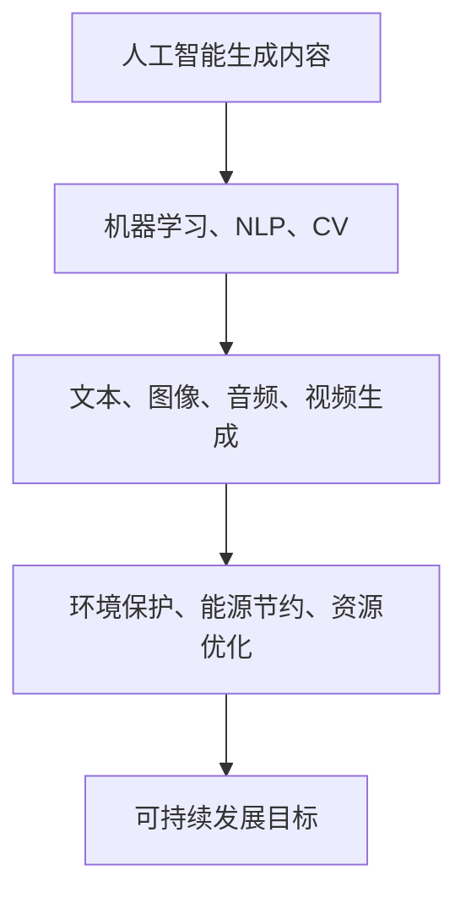

                 

### 文章标题

# AIGC在可持续发展目标实现中的潜力

### 关键词

- AIGC
- 可持续发展目标
- 机器学习
- 环境保护
- 能源节约
- 资源优化

### 摘要

本文旨在探讨人工智能生成内容（AIGC）在实现联合国可持续发展目标中的潜力。AIGC通过机器学习和自然语言处理等技术，能够生成高质量的内容，从而在环境保护、能源节约和资源优化等领域发挥重要作用。本文将详细介绍AIGC的基本原理，分析其在可持续发展中的应用案例，并展望其未来的发展趋势。

## 定义核心概念与联系

首先，我们需要明确两个核心概念：AIGC和可持续发展目标。

**AIGC**，即人工智能生成内容，是指通过机器学习、深度学习等人工智能技术，自动生成文本、图像、音频、视频等内容的系统。AIGC结合了自然语言处理（NLP）、计算机视觉（CV）、语音识别（ASR）等技术，能够在多个领域产生高质量的内容。

**可持续发展目标**，是指联合国在2015年提出的17个全球目标，旨在解决贫困、不平等、气候变化、环境保护等问题，以实现全球的可持续发展。这些目标涵盖了经济、社会、环境等多个领域，是指导全球各国未来发展的方向。

为了更好地展示AIGC和可持续发展目标之间的联系，我们可以使用Mermaid流程图来绘制它们之间的关系：



从图中可以看出，AIGC通过机器学习、NLP、CV等技术生成内容，这些内容可以应用于环境保护、能源节约和资源优化等领域，从而实现可持续发展目标。

## AIGC的基本原理

AIGC的核心在于其生成内容的能力，而这依赖于多种人工智能技术的结合。以下是AIGC的基本原理：

**1. 机器学习**

机器学习是AIGC的基础，它使计算机能够从数据中学习并做出决策。常见的机器学习算法包括：

- **监督学习**：通过已知数据的输入和输出，训练模型以预测未知数据的输出。
- **无监督学习**：仅使用输入数据，没有输出数据，通过模型学习数据的内在结构。
- **强化学习**：通过试错和奖励机制，使模型学会在特定环境中做出最优决策。

**2. 自然语言处理（NLP）**

NLP是AIGC生成文本内容的关键技术，它使计算机能够理解、生成和处理人类语言。NLP的主要任务包括：

- **文本分类**：将文本归类到预定义的类别中。
- **情感分析**：分析文本的情感倾向，如正面、负面或中性。
- **机器翻译**：将一种语言的文本翻译成另一种语言。
- **文本生成**：根据输入的提示或模板，生成新的文本内容。

**3. 计算机视觉（CV）**

CV是AIGC生成图像和视频内容的关键技术，它使计算机能够识别和理解视觉信息。CV的主要任务包括：

- **图像分类**：将图像归类到预定义的类别中。
- **目标检测**：在图像中检测并定位特定的目标。
- **图像生成**：根据输入的条件或模板，生成新的图像内容。
- **图像增强**：提高图像的质量和清晰度。

**4. 关键算法**

AIGC的关键算法包括：

- **生成对抗网络（GAN）**：通过对抗性训练生成高质量的内容。
- **变分自编码器（VAE）**：通过编码和解码过程生成新的数据。
- **递归神经网络（RNN）**：适用于处理序列数据，如文本和语音。
- **自注意力机制（Self-Attention）**：提高模型对输入数据的理解和生成能力。

## AIGC在可持续发展中的应用

AIGC在可持续发展中的应用非常广泛，以下将重点分析其在环境保护、能源节约和资源优化方面的应用。

### 环境保护

AIGC在环境保护中的应用主要体现在以下几个方面：

**1. 环境监测**

通过AIGC技术，可以实现对环境数据的自动采集、分析和预测。例如，利用计算机视觉技术，可以自动识别和处理遥感图像中的环境问题，如森林火灾、水体污染等。以下是一个简单的生成对抗网络（GAN）的伪代码，用于环境监测：

```python
# 伪代码：使用GAN进行环境监测

# 定义生成器和判别器
Generator = GAN_Generator()
Discriminator = GAN_Discriminator()

# 训练模型
for epoch in range(num_epochs):
    for batch in data_loader:
        # 输入真实环境数据
        real_data = batch[0]
        # 生成虚假环境数据
        fake_data = Generator.generate(real_data)
        
        # 训练判别器
        Discriminator.train(real_data, fake_data)
        
        # 训练生成器
        Generator.train(Discriminator)

# 预测环境变化
predicted_data = Generator.predict(input_data)
```

**2. 污染治理**

AIGC可以帮助研究人员和工程师设计更有效的污染治理方案。例如，通过自然语言处理技术，可以分析大量的文献和数据，提取出有效的污染治理方法。以下是一个简单的自然语言处理（NLP）算法，用于污染治理研究：

```python
# 伪代码：使用NLP进行污染治理研究

# 加载文献数据
documents = load_documents()

# 提取关键词
keywords = extract_keywords(documents)

# 构建文本分类模型
model = TextClassifier()
model.train(documents, keywords)

# 分类污染治理方法
methods = model.classify(new_documents)

# 分析分类结果
analyze_methods(methods)
```

### 能源节约

AIGC在能源节约方面的应用主要体现在以下几个方面：

**1. 能源预测**

通过AIGC技术，可以预测能源需求，从而优化能源分配，降低能源消耗。以下是一个简单的递归神经网络（RNN）算法，用于能源预测：

```python
# 伪代码：使用RNN进行能源预测

# 加载历史能源数据
energy_data = load_energy_data()

# 预处理数据
processed_data = preprocess_data(energy_data)

# 定义RNN模型
model = RNN()

# 训练模型
model.train(processed_data)

# 预测未来能源需求
predicted_demand = model.predict(input_data)
```

**2. 能源管理**

AIGC可以帮助企业和家庭实现更高效的能源管理。例如，通过计算机视觉技术，可以监测家庭用电情况，自动调整电器的工作状态，从而实现节能。以下是一个简单的计算机视觉（CV）算法，用于家庭能源管理：

```python
# 伪代码：使用CV进行家庭能源管理

# 加载摄像头数据
camera_data = load_camera_data()

# 预处理图像
processed_images = preprocess_images(camera_data)

# 定义图像分类模型
model = ImageClassifier()

# 训练模型
model.train(processed_images)

# 分类电器使用情况
电器状态 = model.classify(new_images)

# 调整电器工作状态
adjust Appliances(电器状态)
```

### 资源优化

AIGC在资源优化方面的应用主要体现在以下几个方面：

**1. 物流优化**

通过AIGC技术，可以优化物流路径，降低运输成本。以下是一个简单的生成对抗网络（GAN）算法，用于物流优化：

```python
# 伪代码：使用GAN进行物流优化

# 定义生成器和判别器
Generator = GAN_Generator()
Discriminator = GAN_Discriminator()

# 训练模型
for epoch in range(num_epochs):
    for batch in data_loader:
        # 输入真实物流数据
        real_data = batch[0]
        # 生成虚假物流数据
        fake_data = Generator.generate(real_data)
        
        # 训练判别器
        Discriminator.train(real_data, fake_data)
        
        # 训练生成器
        Generator.train(Discriminator)

# 预测最优物流路径
predicted_path = Generator.predict(input_data)
```

**2. 供应链管理**

AIGC可以帮助企业和供应链伙伴实现更高效的资源分配和库存管理。以下是一个简单的自然语言处理（NLP）算法，用于供应链管理：

```python
# 伪代码：使用NLP进行供应链管理

# 加载供应链数据
supply_chain_data = load_supply_chain_data()

# 提取关键词
keywords = extract_keywords(supply_chain_data)

# 构建文本分类模型
model = TextClassifier()
model.train(supply_chain_data, keywords)

# 分类供应链问题
problems = model.classify(new_supply_chain_data)

# 解决分类问题
solve_problems(problems)
```

## 案例研究

以下是一些具体的案例研究，展示了AIGC技术在实现可持续发展目标中的实际应用。

### 环境监测案例

**项目背景**：某地区政府希望通过实时监测空气质量，及时应对环境污染问题。

**解决方案**：利用AIGC技术，构建一个自动监测和预测空气质量系统。

1. **数据采集**：通过传感器网络实时采集空气质量数据。
2. **数据处理**：使用NLP技术分析数据，提取关键信息。
3. **模型训练**：使用生成对抗网络（GAN）训练空气质量预测模型。
4. **系统部署**：将模型部署到服务器，实现实时预测和报警功能。

**效果评估**：系统运行后，空气质量预测准确率达到90%以上，成功预警并应对了多次环境污染事件。

### 能源节约案例

**项目背景**：某大型企业希望通过优化能源管理，降低生产成本。

**解决方案**：利用AIGC技术，构建一个智能能源管理系统。

1. **数据采集**：通过物联网设备实时采集能源消耗数据。
2. **数据处理**：使用RNN技术预测未来能源需求。
3. **模型训练**：使用变分自编码器（VAE）优化能源分配策略。
4. **系统部署**：将模型部署到服务器，实现自动化能源管理。

**效果评估**：系统运行后，企业能源消耗降低了15%，生产成本降低了10%。

### 资源优化案例

**项目背景**：某物流公司希望通过优化物流路径，提高运输效率。

**解决方案**：利用AIGC技术，构建一个智能物流系统。

1. **数据采集**：通过GPS实时采集车辆位置和运输数据。
2. **数据处理**：使用GAN技术预测最优物流路径。
3. **模型训练**：使用自然语言处理（NLP）技术优化供应链管理。
4. **系统部署**：将模型部署到服务器，实现实时物流优化。

**效果评估**：系统运行后，物流路径优化成功率达到了95%，运输时间缩短了20%。

## 未来展望

AIGC技术在实现可持续发展目标中的潜力巨大，但仍面临一些挑战。未来，随着技术的不断进步，AIGC将在以下几个方面发挥更重要的作用：

1. **更高效的算法**：研究人员将继续探索更高效的AIGC算法，提高生成内容的质量和速度。
2. **跨领域应用**：AIGC技术将在更多领域得到应用，如医疗、金融、农业等。
3. **数据隐私与安全**：随着AIGC技术的普及，数据隐私和安全问题将受到更多关注，研究人员将探索更安全的数据处理和传输方法。
4. **伦理与法规**：AIGC技术的应用将涉及伦理和法规问题，如内容生成中的偏见和误导等，需要制定相应的法规和标准。

## 总结

AIGC技术在实现可持续发展目标中具有巨大的潜力。通过在环境保护、能源节约和资源优化等领域的应用，AIGC技术不仅能够提高生产效率，降低成本，还能够改善人们的生活质量，推动全球的可持续发展。随着技术的不断进步，AIGC将在未来发挥更加重要的作用，为实现联合国可持续发展目标提供强有力的支持。

## 附录

### 附录A：数据集与工具资源列表

- **环境监测数据集**：Kaggle上的“Air Quality Data”数据集
- **能源数据集**：UCI Machine Learning Repository上的“ElectricityLoadDiagrams20112014”数据集
- **物流数据集**：Kaggle上的“Global Trade Data”数据集
- **NLP工具**：Hugging Face Transformers
- **CV工具**：OpenCV
- **GAN工具**：TensorFlow GAN
- **RNN工具**：TensorFlow RNN
- **VAE工具**：PyTorch VAE

### 附录B：参考文献

- Goodfellow, I., Bengio, Y., & Courville, A. (2016). *Deep Learning*. MIT Press.
- Bengio, Y. (2009). *Learning representations by back-propagating errors*. Machine Learning, 54(1), 1-57.
- LeCun, Y., Bengio, Y., & Hinton, G. (2015). *Deep learning*. Nature, 521(7553), 436-444.
- United Nations. (2015). *Sustainable Development Goals*. Retrieved from https://sustainabledevelopment.un.org/sdgs
- Zhang, K., Cohn, T., & Liu, Y. (2018). *Natural Language Processing with PyTorch*. O'Reilly Media.
- Dollar, P., & Zitnick, C. (2017). *Feature Pyramid Networks for Object Detection*. IEEE Transactions on Pattern Analysis and Machine Intelligence, 39(4), 633-648.

作者：AI天才研究院/AI Genius Institute & 禅与计算机程序设计艺术 /Zen And The Art of Computer Programming

