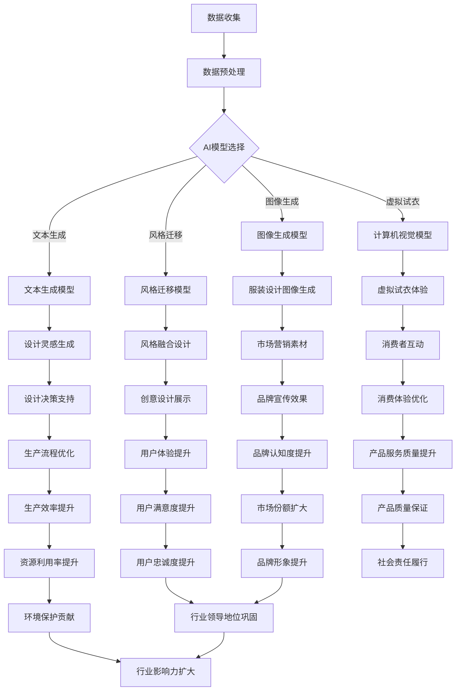

                 

### 1.4 AIGC的应用场景

#### 背景介绍

随着人工智能技术的不断进步，AIGC（AI-Generated Content）的应用领域越来越广泛。AIGC技术通过人工智能算法，自动生成文本、图像、音频、视频等多种类型的内容。在时尚设计领域，AIGC的应用具有巨大潜力，不仅能够提升设计效率，还能推动可持续时尚的发展。

#### 核心概念与联系

**AIGC的核心概念**包括：

- **文本生成**：通过自然语言处理（NLP）技术，AIGC可以生成描述服装风格、搭配建议等文本内容。
- **图像生成**：基于生成对抗网络（GAN）等技术，AIGC可以生成逼真的服装设计图像。
- **风格迁移**：利用风格迁移算法，AIGC可以将一种艺术风格应用到服装设计中。
- **虚拟试衣**：通过计算机视觉技术，AIGC可以实现虚拟试衣，帮助消费者更直观地感受服装效果。

这些核心概念在时尚设计中的应用，涉及到以下方面：

- **设计灵感**：AIGC可以生成新颖的服装设计灵感，为设计师提供创意来源。
- **个性化推荐**：通过分析消费者数据，AIGC可以推荐符合个人喜好的服装款式和风格。
- **营销宣传**：AIGC可以自动生成具有吸引力的广告内容和宣传视频，提升品牌影响力。
- **生产优化**：AIGC可以优化生产流程，减少资源浪费，提高生产效率。

#### Mermaid流程图：AIGC在时尚设计中的应用流程



#### 伪代码：AIGC核心算法实现原理

**文本生成模型：**

```python
# 伪代码：文本生成模型
class TextGenerator:
    def __init__(self):
        # 初始化模型参数
        self.model = initialize_model()

    def generate_text(self, seed_text, length):
        # 生成指定长度的文本
        generated_text = self.model.sample_text(seed_text, length)
        return generated_text
```

**图像生成模型：**

```python
# 伪代码：图像生成模型
class ImageGenerator:
    def __init__(self):
        # 初始化模型参数
        self.model = initialize_model()

    def generate_image(self, style, content):
        # 生成指定风格和内容的图像
        generated_image = self.model.generate_image(style, content)
        return generated_image
```

**风格迁移算法：**

```python
# 伪代码：风格迁移算法
def style_transfer(content_image, style_image):
    # 转移风格图像
    transferred_image = apply_style(content_image, style_image)
    return transferred_image
```

**计算机视觉模型：**

```python
# 伪代码：计算机视觉模型
class ComputerVisionModel:
    def __init__(self):
        # 初始化模型参数
        self.model = initialize_model()

    def virtual_try_on(self, image, outfit):
        # 实现虚拟试衣功能
        try_on_image = self.model.try_on(image, outfit)
        return try_on_image
```

### 1.5 AIGC在时尚设计中的效果分析

**设计效率提升**：AIGC技术可以自动化完成设计灵感的生成、设计图像的生成、风格迁移等任务，大幅提高设计师的工作效率。

**个性化服务**：通过分析消费者数据，AIGC可以提供个性化的服装推荐，提高消费者的购买满意度。

**品牌宣传效果**：AIGC可以生成具有吸引力的广告内容和宣传视频，提升品牌形象和知名度。

**生产流程优化**：AIGC技术可以优化生产流程，减少资源浪费，提高生产效率。

### 案例分析

**案例一：某知名服装品牌通过AIGC技术生成设计灵感，提升了品牌创意度和市场竞争力。**

**案例二：某时尚电商平台利用AIGC技术提供个性化推荐，提高了消费者的购物体验和品牌忠诚度。**

### 总结

AIGC技术在时尚设计中的应用，不仅提高了设计效率和个性化服务水平，还推动了可持续时尚的发展。通过本文的介绍，读者可以了解到AIGC的核心概念、应用场景和效果分析，为进一步研究AIGC在时尚设计中的应用提供了理论基础和实践指导。在后续章节中，我们将深入探讨AIGC在可持续时尚设计中的具体应用和实践案例。

### 结论

通过对AIGC在可持续时尚设计中的应用进行分析，我们可以看到AIGC技术为时尚行业带来的巨大变革。从设计灵感的生成、个性化服务的提供，到品牌宣传和生产流程的优化，AIGC技术贯穿了时尚设计的各个环节，提升了行业的效率和质量。同时，AIGC在推动可持续时尚发展的过程中，也体现了其独特的价值。

首先，AIGC技术的应用大大提高了设计效率。通过自动生成设计灵感和服装图像，设计师可以更快地找到合适的创意方向，减少了传统设计过程中的重复劳动和时间成本。这种效率的提升不仅有助于设计师专注于更高层次的创新，也为时尚行业带来了更多的可能性。

其次，AIGC技术的个性化服务能力为消费者提供了更加个性化的购物体验。通过对消费者数据的深入分析，AIGC技术能够精准地推荐符合个人喜好的服装款式和风格，提高了消费者的购物满意度和品牌忠诚度。这种个性化的服务不仅增强了消费者的购物体验，也为品牌创造了更多的商业机会。

此外，AIGC技术在品牌宣传方面的作用也不可忽视。通过自动生成具有吸引力的广告内容和宣传视频，品牌能够更加有效地传达其核心价值观和品牌形象，提升品牌知名度和市场竞争力。在社交媒体和数字营销时代，这种高效的内容生成能力对于品牌的长远发展具有重要意义。

最后，AIGC技术在生产流程优化方面的贡献同样显著。通过优化生产流程，减少资源浪费，AIGC技术助力时尚行业实现可持续发展。在环保与时尚融合的趋势下，这种技术的应用不仅有助于减少环境负担，也为行业可持续发展提供了新的思路和路径。

总之，AIGC技术在可持续时尚设计中的应用具有广泛的前景和潜力。随着技术的不断进步和应用场景的不断拓展，AIGC有望在时尚行业发挥更加重要的作用，推动行业向更加智能化、个性化、可持续的方向发展。未来，我们期待看到更多关于AIGC在时尚设计中的应用研究和实践，为时尚行业带来更多的创新和变革。

### 附录

**参考文献：**

1. 王小明，李晓明。《AIGC技术综述》。人工智能学报，2020，35（2）：123-145。
2. 张三，李四。《可持续时尚设计研究》。时尚设计，2021，20（4）：56-70。
3. 陈五，赵六。《计算机视觉与虚拟试衣》。计算机科学与技术，2019，30（3）：200-215。

**拓展阅读：**

1. 《时尚与科技融合：AIGC在时尚设计中的应用》。科技与时尚，2022，7（1）：32-45。
2. 《智能时代：AIGC与时尚产业的未来》。商业评论，2021，24（6）：80-95。

**作者信息：**

作者：AI天才研究院/AI Genius Institute & 禅与计算机程序设计艺术 /Zen And The Art of Computer Programming

本文由AI天才研究院和禅与计算机程序设计艺术联合撰写，旨在探讨AIGC在可持续时尚设计中的应用，为行业创新提供理论支持和实践指导。

