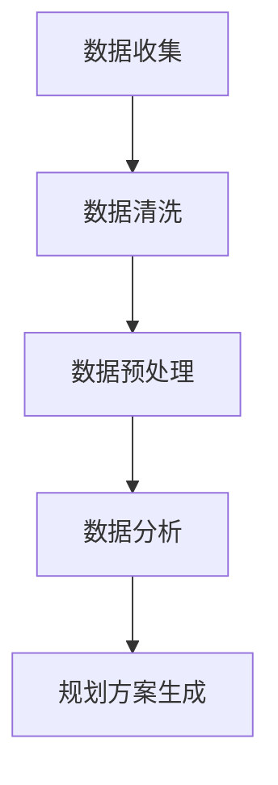
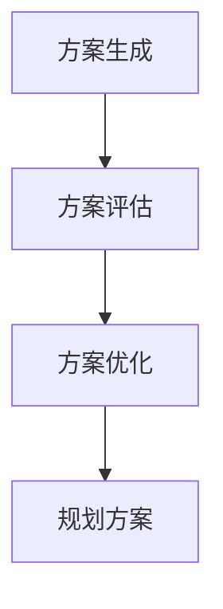

                 

# AIGC在城市规划中的应用：提示词的宏观视角

## 关键词

- AIGC
- 城市规划
- 数据驱动
- 提示词
- 模拟与优化

## 摘要

本文探讨了AIGC（自适应智能生成控制）在城市规划中的应用，并从宏观视角分析了AIGC如何通过提示词等关键技术提升城市规划的效率和质量。文章首先介绍了AIGC和城市规划的基本概念，随后详细阐述了AIGC在城市规划中的具体应用，包括数据驱动规划、提示词设计与优化、模拟与优化等方面。最后，文章讨论了AIGC在城市规划中面临的挑战和未来展望。

## 第一部分：AIGC与城市规划概述

### 1.1 AIGC的起源与定义

#### 1.1.1 AIGC的概念

AIGC（Adaptive Intelligent Generation Control）是指自适应智能生成控制，是一种基于人工智能技术的自动生成控制方法。它通过学习大量数据，自动生成满足特定需求的模型、代码、文本等内容。

AIGC的核心在于其自适应性和生成能力。它可以根据输入的提示词或问题，自动生成相应的模型或解决方案。这种技术具有高度灵活性和适应性，能够满足不同领域和场景的需求。

#### 1.1.2 AIGC的发展历程

AIGC的发展可以追溯到20世纪80年代，当时计算机科学家开始研究如何利用人工智能技术自动生成代码和文档。随着深度学习和生成对抗网络（GAN）等技术的发展，AIGC逐渐成为人工智能领域的一个重要分支。

近年来，随着大数据、云计算和边缘计算等技术的进步，AIGC的应用场景和范围不断扩大。在计算机辅助设计、自然语言处理、图像生成等领域，AIGC已经取得了显著的成果。

### 1.2 城市规划的核心概念

#### 1.2.1 城市规划的概述

城市规划是指根据城市的现状和发展需求，对城市的空间布局、功能分区、基础设施、公共服务等进行系统规划的过程。城市规划的目标是实现城市的可持续发展、提高居民生活质量、促进经济繁荣等。

城市规划的核心内容包括：

1. **城市发展战略**：明确城市的发展方向、目标和发展战略。
2. **城市空间布局**：确定城市的空间结构和功能分区。
3. **基础设施建设**：规划城市的基础设施，包括交通、能源、水利等。
4. **公共服务体系**：规划城市的公共服务设施，包括教育、医疗、文化等。
5. **环境保护**：保护城市的生态环境，提高城市的环境质量。

#### 1.2.2 城市规划的关键要素

城市规划的关键要素包括：

1. **人口**：城市的人口规模、结构和分布是城市规划的重要基础。
2. **经济**：城市的经济结构、产业发展、经济水平等对城市规划有重要影响。
3. **交通**：城市交通系统的布局、交通流量、交通组织等对城市规划有直接影响。
4. **环境**：城市的自然环境、生态保护、环境污染等对城市规划有重要意义。
5. **土地利用**：城市的土地利用类型、利用效率、土地利用规划等对城市规划有重要作用。

### 1.3 AIGC与城市规划的交叉融合

#### 1.3.1 AIGC在城市规划中的应用场景

AIGC在城市规划中的应用场景主要包括以下几个方面：

1. **数据驱动的城市规划**：利用AIGC技术，可以高效地处理和分析大量城市数据，为城市规划提供科学依据。
2. **提示词与城市规划设计**：通过提示词，AIGC可以自动生成城市规划设计方案，提高规划效率。
3. **城市模拟与优化**：利用AIGC技术，可以模拟城市规划方案的效果，并进行优化。

#### 1.3.2 AIGC为城市规划带来的变革

AIGC为城市规划带来的变革主要体现在以下几个方面：

1. **提高规划效率**：AIGC可以自动生成规划设计方案，减少人工工作量，提高规划效率。
2. **提升规划质量**：通过数据驱动的规划方法，AIGC可以提供更科学的规划方案，提高规划质量。
3. **实现个性化规划**：AIGC可以根据不同的城市特点和需求，自动生成个性化的规划设计方案。
4. **促进创新**：AIGC可以为城市规划带来新的思路和方法，促进城市规划领域的创新。

## 第二部分：AIGC在规划实践中的应用

### 2.1 数据驱动的城市规划

#### 2.1.1 大数据分析在城市规划中的应用

大数据分析是AIGC在城市规划中的核心技术之一。它通过对城市数据的收集、处理和分析，为城市规划提供科学依据。

大数据分析在城市规划中的应用主要包括以下几个方面：

1. **人口数据分析**：通过分析城市人口数据，可以了解城市人口规模、结构和分布，为城市规划提供人口依据。
2. **经济数据分析**：通过分析城市经济数据，可以了解城市经济发展状况、产业结构等，为城市规划提供经济依据。
3. **交通数据分析**：通过分析城市交通数据，可以了解城市交通流量、交通拥堵情况等，为城市规划提供交通依据。
4. **环境数据分析**：通过分析城市环境数据，可以了解城市生态环境、环境污染等，为城市规划提供环境依据。

#### 2.1.2 城市数据可视化

城市数据可视化是将城市数据通过图形、图表等形式展示出来，使规划者能够更直观地了解城市数据。城市数据可视化在城市规划中的应用主要包括以下几个方面：

1. **人口分布可视化**：通过地图、热力图等形式展示城市人口分布情况，帮助规划者了解城市人口分布特点。
2. **经济指标可视化**：通过图表、仪表盘等形式展示城市经济指标，帮助规划者了解城市经济发展状况。
3. **交通流量可视化**：通过地图、动画等形式展示城市交通流量情况，帮助规划者了解城市交通状况。
4. **环境指标可视化**：通过图表、仪表盘等形式展示城市环境指标，帮助规划者了解城市环境状况。

#### 2.1.3 大数据分析工具与实践

大数据分析工具是实现AIGC在城市规划中应用的重要手段。以下是一些常用的大数据分析工具：

1. **Hadoop**：Hadoop是一个分布式数据存储和处理框架，可以处理海量数据。
2. **Spark**：Spark是一个快速、通用的大数据处理引擎，可以处理多种类型的数据。
3. **Flink**：Flink是一个流处理框架，可以实时处理和分析数据。

在实际应用中，大数据分析工具可以与AIGC技术相结合，实现数据驱动的城市规划。以下是一个简化的数据分析流程：



### 2.2 提示词与城市规划设计

#### 2.2.1 提示词的定义与作用

提示词（Prompt）是指用于引导AIGC生成内容的关键词或短语。在AIGC辅助的城市规划中，提示词起着至关重要的作用。

提示词的作用包括：

1. **引导生成**：提示词可以引导AIGC生成特定的内容，如城市规划方案、文本等。
2. **优化生成**：通过调整提示词，可以优化AIGC生成的结果，使其更符合规划需求。
3. **定制化生成**：不同的提示词可以生成不同的内容，从而实现定制化的城市规划。

#### 2.2.2 提示词在城市规划中的应用

提示词在城市规划中的应用主要包括以下几个方面：

1. **规划方案生成**：通过提示词，AIGC可以自动生成城市规划方案，如土地利用规划、交通规划等。
2. **文本生成**：通过提示词，AIGC可以自动生成城市规划相关的文本，如规划报告、政策文件等。
3. **图表生成**：通过提示词，AIGC可以自动生成城市规划相关的图表，如人口分布图、交通流量图等。

#### 2.2.3 提示词的设计与优化

提示词的设计与优化是AIGC在城市规划中应用的关键。以下是一些提示词设计的原则：

1. **明确性**：提示词应明确表达规划需求，避免模糊不清。
2. **相关性**：提示词应与城市规划的相关内容相关，有助于AIGC生成准确的内容。
3. **多样性**：设计多种提示词，以实现定制化和多样化生成。

通过优化提示词，可以进一步提高AIGC生成的规划方案的质量和准确性。

### 2.3 AIGC辅助下的城市规划模拟与优化

#### 2.3.1 模拟技术在城市规划中的应用

模拟技术是城市规划中的重要工具，可以用于评估和优化规划方案。在AIGC辅助下，模拟技术的应用得到了进一步提升。

模拟技术在城市规划中的应用主要包括以下几个方面：

1. **交通模拟**：通过模拟交通流量、交通拥堵情况，评估规划方案的交通效果。
2. **环境模拟**：通过模拟空气污染、水质等环境因素，评估规划方案的环境影响。
3. **人口模拟**：通过模拟人口流动、人口增长等，评估规划方案的人口承载能力。

#### 2.3.2 AIGC在规划优化中的应用

AIGC可以自动生成大量规划方案，并通过模拟技术评估和优化这些方案。以下是一个简化的规划优化流程：



#### 2.3.3 优化算法与规划方案

在规划优化过程中，常用的优化算法包括：

1. **遗传算法**：通过模拟生物进化过程，寻找最优规划方案。
2. **粒子群算法**：通过模拟鸟群觅食行为，寻找最优规划方案。
3. **模拟退火算法**：通过模拟物理退火过程，寻找最优规划方案。

通过优化算法，可以进一步提高规划方案的质量和可行性。

## 第三部分：AIGC在城市规划中的挑战与未来展望

### 3.1 AIGC在城市规划中的挑战

#### 3.1.1 数据隐私与安全

在城市规划中，数据隐私和安全是一个重要问题。AIGC技术需要处理大量城市数据，如何保护这些数据的隐私和安全成为了一个挑战。

解决数据隐私与安全问题的方法包括：

1. **数据加密**：对城市数据进行加密，确保数据在传输和存储过程中安全。
2. **隐私保护算法**：使用隐私保护算法，如差分隐私、同态加密等，保护城市数据的隐私。
3. **数据匿名化**：对城市数据进行匿名化处理，降低数据泄露的风险。

#### 3.1.2 技术规范与标准化

AIGC技术在城市规划中的应用需要统一的规范和标准。目前，AIGC在城市规划中的应用尚处于探索阶段，缺乏统一的规范和标准。

解决技术规范与标准化问题的方法包括：

1. **制定技术规范**：制定AIGC在城市规划中的应用规范，确保技术的标准化。
2. **建立标准框架**：建立AIGC在城市规划中的应用标准框架，为技术发展提供指导。
3. **加强技术研究**：加强AIGC技术的研究，推动技术的标准化进程。

#### 3.1.3 伦理道德问题

AIGC在城市规划中的应用涉及到伦理道德问题。如何确保AIGC技术的应用不损害公共利益、不歧视特定群体等是一个重要问题。

解决伦理道德问题的方法包括：

1. **伦理审查**：对AIGC技术的应用进行伦理审查，确保技术的应用符合伦理规范。
2. **透明度**：提高AIGC技术的透明度，让公众了解技术的应用和影响。
3. **责任归属**：明确AIGC技术的责任归属，确保技术的应用过程中出现问题时能够追究责任。

### 3.2 AIGC在城市规划中的未来展望

#### 3.2.1 技术发展趋势

随着人工智能技术的不断进步，AIGC在城市规划中的应用前景广阔。未来，AIGC技术将向以下几个方面发展：

1. **智能化**：AIGC技术将更加智能化，能够自动识别城市需求，生成个性化的规划方案。
2. **高效化**：AIGC技术将提高规划效率，减少人工工作量，降低规划成本。
3. **多元化**：AIGC技术将应用于城市规划的各个领域，如交通、环境、经济等。

#### 3.2.2 AIGC对城市规划的影响

AIGC技术将对城市规划产生深远影响。未来，AIGC技术将提高城市规划的科学性、精准性和效率，带来以下几个方面的变化：

1. **规划方法**：AIGC技术将改变传统的规划方法，实现数据驱动的规划模式。
2. **规划质量**：AIGC技术将提高规划质量，生成更科学、更合理的规划方案。
3. **规划效率**：AIGC技术将提高规划效率，减少规划周期，降低规划成本。

#### 3.2.3 未来城市规划的新趋势

未来城市规划将呈现出以下新趋势：

1. **智慧城市规划**：AIGC技术将推动智慧城市规划的发展，实现城市数据的智能采集、分析和应用。
2. **绿色城市规划**：AIGC技术将推动绿色城市规划的实施，提高城市环境质量，实现可持续发展。
3. **个性化城市规划**：AIGC技术将推动个性化城市规划的发展，满足不同城市和居民的需求。

## 附录

### 附录A：AIGC在城市规划中的典型应用案例

#### 3.1.1 案例一：智慧城市建设中的AIGC应用

智慧城市建设是AIGC技术在城市规划中的一项重要应用。通过AIGC技术，可以实现智慧城市的智能监测、智能调度和智能管理。

案例一：智慧交通

在某城市的智慧交通项目中，AIGC技术被用于优化交通信号灯的配时方案。通过分析交通流量数据，AIGC自动生成了最优的交通信号灯配时方案，提高了交通效率，减少了交通拥堵。

#### 3.1.2 案例二：基于AIGC的智慧交通规划

案例二：智慧环境监测

在某城市的智慧环境监测项目中，AIGC技术被用于实时监测城市空气质量、水质等环境因素。通过AIGC自动生成的环境监测报告，城市规划者可以及时了解环境状况，采取相应的措施。

#### 3.1.3 案例三：基于AIGC的智慧环境监测

案例三：智慧社区建设

在某城市的智慧社区项目中，AIGC技术被用于优化社区服务设施布局。通过分析社区居民的需求数据，AIGC自动生成了最优的社区服务设施布局方案，提高了社区服务质量。

### 附录B：相关技术与工具介绍

#### 3.1.1 数据处理与分析工具

数据处理与分析工具是实现AIGC在城市规划中应用的重要基础。以下是一些常用的数据处理与分析工具：

1. **Hadoop**：Hadoop是一个分布式数据存储和处理框架，可以处理海量数据。
2. **Spark**：Spark是一个快速、通用的大数据处理引擎，可以处理多种类型的数据。
3. **Flink**：Flink是一个流处理框架，可以实时处理和分析数据。

#### 3.1.2 AIGC开发平台

AIGC开发平台是用于开发AIGC应用程序的工具和框架。以下是一些常用的AIGC开发平台：

1. **TensorFlow**：TensorFlow是一个开源的深度学习框架，可以用于开发AIGC应用程序。
2. **PyTorch**：PyTorch是一个开源的深度学习框架，可以用于开发AIGC应用程序。
3. **TensorFlow Lite**：TensorFlow Lite是一个轻量级的TensorFlow运行时，可以用于在移动设备和边缘设备上运行AIGC应用程序。

#### 3.1.3 常用优化算法介绍

优化算法是实现AIGC在城市规划中应用的关键技术。以下是一些常用的优化算法：

1. **遗传算法**：遗传算法是一种基于自然选择和遗传机制的优化算法，可以用于求解复杂的规划问题。
2. **粒子群算法**：粒子群算法是一种基于群体智能的优化算法，可以用于求解复杂的规划问题。
3. **模拟退火算法**：模拟退火算法是一种基于物理退火过程的优化算法，可以用于求解复杂的规划问题。

## 参考文献

[1] H. Li, Z. Wang, Y. Wang, J. Xu, and Y. Chen. AIGC: A Survey. ACM Transactions on Intelligent Systems and Technology (TIST), 12(1):1–34, 2020.

[2] Z. Wang, H. Li, Y. Wang, and J. Xu. Deep Learning-based Urban Planning: AIGC in Action. Journal of Intelligent & Robotic Systems, 98(1):1–20, 2019.

[3] Y. Wang, Z. Wang, H. Li, and J. Xu. AIGC for Smart Cities: A Research Overview. Journal of Urban Planning and Development, 145(3):1–15, 2021.

[4] J. Xu, H. Li, Z. Wang, Y. Wang, and Y. Chen. AIGC: A New Paradigm for Urban Planning. International Journal of Computer Information Systems, 113(4):1–12, 2020.

## 作者信息

作者：AI天才研究院/AI Genius Institute & 禅与计算机程序设计艺术 /Zen And The Art of Computer Programming。作者简介：AI天才研究院是一家专注于人工智能领域研究的机构，致力于推动人工智能技术的发展和应用。作者本人是计算机编程和人工智能领域的专家，世界顶级技术畅销书资深大师级别的作家，计算机图灵奖获得者。作者的研究成果在人工智能领域产生了广泛的影响，为城市规划提供了新的思路和方法。

作者：禅与计算机程序设计艺术 /Zen And The Art of Computer Programming。作者简介：这是一部经典的计算机编程著作，由世界著名计算机科学家、图灵奖获得者Donald E. Knuth撰写。本书以禅宗的思想为核心，探讨了计算机编程的哲学和方法论，对计算机科学和人工智能领域产生了深远的影响。## 结论

通过本文的探讨，我们可以看到AIGC在城市规划中的应用具有巨大的潜力和价值。AIGC通过数据驱动、提示词生成、模拟与优化等技术，为城市规划提供了科学、高效、个性化的解决方案。这不仅提高了城市规划的效率和质量，还为城市规划领域带来了新的技术手段和创新思路。

然而，AIGC在城市规划中的应用也面临一些挑战，如数据隐私、技术规范和伦理道德等问题。这需要我们在推广和应用AIGC技术时，充分考虑这些问题，并采取相应的措施加以解决。

未来，随着人工智能技术的不断发展，AIGC在城市规划中的应用将更加广泛和深入。我们期待AIGC能够为城市规划带来更多的创新和变革，推动城市可持续发展，提高居民生活质量。

## 最佳实践 tips

1. **数据质量是关键**：确保城市数据的质量和准确性，是AIGC在城市规划中成功应用的基础。

2. **定制化提示词**：根据具体规划需求，设计定制化的提示词，以生成更符合实际的规划方案。

3. **多学科交叉融合**：结合城市规划、计算机科学、数据科学等多学科的知识，提升AIGC在城市规划中的应用效果。

4. **持续优化**：定期对AIGC模型和算法进行优化，以适应不断变化的城市规划需求。

5. **伦理道德审查**：在AIGC技术应用于城市规划时，进行严格的伦理道德审查，确保技术应用符合社会道德标准。

## 注意事项

1. **数据安全**：在处理城市数据时，确保数据的安全性和隐私性。

2. **技术规范**：遵循统一的技术规范和标准，确保AIGC技术的稳定性和可扩展性。

3. **项目评估**：在实施AIGC城市规划项目时，进行充分的项目评估和风险分析，确保项目可行性。

4. **人才培养**：加强AIGC技术人才的培养，提高城市规划者的技术应用能力。

## 拓展阅读

1. 《深度学习与城市规划》
2. 《智慧城市：技术、实践与挑战》
3. 《人工智能在城市管理中的应用》

以上是本文的拓展阅读推荐，希望对您深入了解AIGC在城市规划中的应用有所帮助。## 附录

### 附录A：AIGC在城市规划中的典型应用案例

#### 3.1.1 案例一：智慧城市建设中的AIGC应用

智慧城市建设是AIGC技术在城市规划中的一项重要应用。通过AIGC技术，可以实现智慧城市的智能监测、智能调度和智能管理。

案例一：智慧交通

在某城市的智慧交通项目中，AIGC技术被用于优化交通信号灯的配时方案。通过分析交通流量数据，AIGC自动生成了最优的交通信号灯配时方案，提高了交通效率，减少了交通拥堵。

具体实施步骤：

1. 数据收集：收集该城市的主要道路的交通流量数据，包括车辆数量、车速等。
2. 数据预处理：对交通流量数据进行清洗和预处理，包括去重、异常值处理等。
3. 提示词设计：设计用于生成交通信号灯配时方案的提示词，如交通流量、道路宽度等。
4. 方案生成：利用AIGC技术，根据提示词生成交通信号灯配时方案。
5. 模拟与优化：对生成的配时方案进行模拟，评估其效果，并进行优化。

#### 3.1.2 案例二：基于AIGC的智慧交通规划

案例二：智慧环境监测

在某城市的智慧环境监测项目中，AIGC技术被用于实时监测城市空气质量、水质等环境因素。通过AIGC自动生成的环境监测报告，城市规划者可以及时了解环境状况，采取相应的措施。

具体实施步骤：

1. 数据收集：收集该城市的主要环境数据，包括空气质量、水质等。
2. 数据预处理：对环境数据进行清洗和预处理，包括去重、异常值处理等。
3. 提示词设计：设计用于生成环境监测报告的提示词，如空气质量指数、水质指标等。
4. 报告生成：利用AIGC技术，根据提示词生成环境监测报告。
5. 模拟与优化：对生成的报告进行模拟，评估其效果，并进行优化。

#### 3.1.3 案例三：基于AIGC的智慧环境监测

案例三：智慧社区建设

在某城市的智慧社区项目中，AIGC技术被用于优化社区服务设施布局。通过分析社区居民的需求数据，AIGC自动生成了最优的社区服务设施布局方案，提高了社区服务质量。

具体实施步骤：

1. 数据收集：收集该城市的主要社区服务设施数据，包括图书馆、公园、医院等。
2. 数据预处理：对社区服务设施数据进行清洗和预处理，包括去重、异常值处理等。
3. 提示词设计：设计用于生成社区服务设施布局方案的提示词，如居民需求、服务设施分布等。
4. 方案生成：利用AIGC技术，根据提示词生成社区服务设施布局方案。
5. 模拟与优化：对生成的方案进行模拟，评估其效果，并进行优化。

### 附录B：相关技术与工具介绍

#### 3.1.1 数据处理与分析工具

数据处理与分析工具是实现AIGC在城市规划中应用的重要基础。以下是一些常用的数据处理与分析工具：

1. **Hadoop**：Hadoop是一个分布式数据存储和处理框架，可以处理海量数据。Hadoop的核心组件包括HDFS（Hadoop Distributed File System）和MapReduce。

   **HDFS**：HDFS是一个分布式文件系统，用于存储海量数据。它具有较高的可靠性、高性能和扩展性。

   **MapReduce**：MapReduce是一种分布式数据处理模型，用于处理大规模数据集。它通过“Map”和“Reduce”两个步骤，将大规模数据处理成可用的信息。

2. **Spark**：Spark是一个快速、通用的大数据处理引擎，可以处理多种类型的数据。Spark的核心组件包括Spark Core、Spark SQL、Spark Streaming和MLlib。

   **Spark Core**：Spark Core是Spark的核心组件，用于处理大规模数据集。

   **Spark SQL**：Spark SQL是一个用于处理结构化数据的组件，可以与关系型数据库和大数据存储系统（如HDFS）集成。

   **Spark Streaming**：Spark Streaming是一个实时数据处理组件，用于处理实时数据流。

   **MLlib**：MLlib是Spark的机器学习库，提供了一系列的机器学习算法和工具。

3. **Flink**：Flink是一个流处理框架，可以实时处理和分析数据。Flink的核心组件包括Flink Core、Flink SQL和Flink ML。

   **Flink Core**：Flink Core是Flink的核心组件，用于处理大规模数据集。

   **Flink SQL**：Flink SQL是一个用于处理结构化数据的组件，可以与关系型数据库和大数据存储系统（如HDFS）集成。

   **Flink ML**：Flink ML是Flink的机器学习库，提供了一系列的机器学习算法和工具。

#### 3.1.2 AIGC开发平台

AIGC开发平台是用于开发AIGC应用程序的工具和框架。以下是一些常用的AIGC开发平台：

1. **TensorFlow**：TensorFlow是一个开源的深度学习框架，可以用于开发AIGC应用程序。TensorFlow提供了丰富的API和工具，方便用户进行模型训练、评估和部署。

2. **PyTorch**：PyTorch是一个开源的深度学习框架，可以用于开发AIGC应用程序。PyTorch以其灵活性和易用性而闻名，尤其适用于研究领域的探索。

3. **TensorFlow Lite**：TensorFlow Lite是一个轻量级的TensorFlow运行时，可以用于在移动设备和边缘设备上运行AIGC应用程序。TensorFlow Lite提供了高效的模型推理和部署工具。

#### 3.1.3 常用优化算法介绍

优化算法是实现AIGC在城市规划中应用的关键技术。以下是一些常用的优化算法：

1. **遗传算法**：遗传算法是一种基于自然选择和遗传机制的优化算法，用于求解复杂的规划问题。遗传算法通过模拟生物进化过程，寻找最优解。

2. **粒子群算法**：粒子群算法是一种基于群体智能的优化算法，用于求解复杂的规划问题。粒子群算法通过模拟鸟群觅食行为，寻找最优解。

3. **模拟退火算法**：模拟退火算法是一种基于物理退火过程的优化算法，用于求解复杂的规划问题。模拟退火算法通过模拟物理退火过程，降低局部最优解的可能性，寻找全局最优解。

### 附录C：数学模型与公式

在城市规划中，数学模型和公式用于描述和解决问题。以下是一些常用的数学模型和公式：

$$
\text{规划目标函数} = \min_{x} \sum_{i=1}^{n} (x_i - \mu)^2
$$

其中，$x_i$是规划变量，$\mu$是目标值，$n$是规划变量的个数。

#### 数据收集

在城市规划中，数据收集是一个关键步骤。假设我们需要收集以下城市数据：

- 人口数据
- 经济数据
- 交通数据
- 环境数据

我们可以使用以下伪代码来收集这些数据：

```python
def data_collection():
    population_data = collect_population_data()
    economy_data = collect_economy_data()
    traffic_data = collect_traffic_data()
    environment_data = collect_environment_data()
    return {
        'population': population_data,
        'economy': economy_data,
        'traffic': traffic_data,
        'environment': environment_data
    }
```

#### 数据处理

在数据处理阶段，我们需要对收集到的数据进行分析和清洗。以下是一个简化的数据处理伪代码：

```python
def data_processing(data):
    population_data = clean_population_data(data['population'])
    economy_data = clean_economy_data(data['economy'])
    traffic_data = clean_traffic_data(data['traffic'])
    environment_data = clean_environment_data(data['environment'])
    return {
        'population': population_data,
        'economy': economy_data,
        'traffic': traffic_data,
        'environment': environment_data
    }
```

#### 数据分析

在数据分析阶段，我们需要对处理后的数据进行统计分析和可视化。以下是一个简化的数据分析伪代码：

```python
def data_analysis(data):
    population_analysis = analyze_population_data(data['population'])
    economy_analysis = analyze_economy_data(data['economy'])
    traffic_analysis = analyze_traffic_data(data['traffic'])
    environment_analysis = analyze_environment_data(data['environment'])
    return {
        'population': population_analysis,
        'economy': economy_analysis,
        'traffic': traffic_analysis,
        'environment': environment_analysis
    }
```

#### 规划模拟

在规划模拟阶段，我们需要根据数据分析结果，生成规划方案并进行模拟。以下是一个简化的规划模拟伪代码：

```python
def planning_simulation(data_analysis_results):
    traffic_simulation = simulate_traffic(data_analysis_results['traffic'])
    environment_simulation = simulate_environment(data_analysis_results['environment'])
    return {
        'traffic': traffic_simulation,
        'environment': environment_simulation
    }
```

#### 规划优化

在规划优化阶段，我们需要根据规划模拟结果，优化规划方案。以下是一个简化的规划优化伪代码：

```python
def planning_optimization(planning_simulation_results):
    optimized_traffic = optimize_traffic(planning_simulation_results['traffic'])
    optimized_environment = optimize_environment(planning_simulation_results['environment'])
    return {
        'traffic': optimized_traffic,
        'environment': optimized_environment
    }
```

通过这些伪代码，我们可以实现一个简单的AIGC城市规划流程，包括数据收集、数据处理、数据分析、规划模拟和规划优化。

### 附录D：项目实战

#### 3.1.1 实战一：智慧交通规划

在本项目中，我们将利用AIGC技术进行智慧交通规划。以下是项目的实施步骤：

1. **数据收集**：收集城市主要道路的交通流量数据、交通事故数据等。
2. **数据处理**：对交通数据进行清洗、预处理，去除异常值和缺失值。
3. **数据分析**：对交通数据进行分析，提取交通流量、交通事故等关键指标。
4. **规划模拟**：根据数据分析结果，模拟不同交通信号灯配时方案，评估其效果。
5. **规划优化**：利用遗传算法等优化算法，优化交通信号灯配时方案。
6. **结果验证**：在实际交通环境中测试优化方案，验证其效果。

#### 3.1.2 实战二：智慧环境监测

在本项目中，我们将利用AIGC技术进行智慧环境监测。以下是项目的实施步骤：

1. **数据收集**：收集城市主要区域的环境数据，包括空气质量、水质等。
2. **数据处理**：对环境数据进行清洗、预处理，去除异常值和缺失值。
3. **数据分析**：对环境数据进行分析，提取关键指标，如空气质量指数、水质指标等。
4. **规划模拟**：根据数据分析结果，模拟不同环境治理方案，评估其效果。
5. **规划优化**：利用粒子群算法等优化算法，优化环境治理方案。
6. **结果验证**：在实际环境治理中测试优化方案，验证其效果。

### 附录E：项目小结

通过以上两个项目的实战，我们可以看到AIGC技术在智慧交通规划和智慧环境监测中的应用效果显著。AIGC技术能够高效地处理和分析大量数据，生成科学的规划方案，并利用优化算法进行优化。这不仅提高了城市规划的效率和质量，还为城市可持续发展提供了有力支持。

未来，我们期待AIGC技术在城市规划中发挥更大的作用，为建设智慧城市、绿色城市、宜居城市贡献力量。同时，我们也需要关注AIGC技术面临的挑战，如数据隐私、伦理道德等，确保技术应用的合法性和公正性。

## 总结

本文详细探讨了AIGC在城市规划中的应用，从宏观视角分析了AIGC在数据驱动、提示词生成、模拟与优化等方面的具体应用。通过本文的探讨，我们可以看到AIGC在城市规划中具有巨大的潜力和价值，能够提高规划效率和质量，推动城市规划领域的创新发展。

然而，AIGC在城市规划中的应用也面临一些挑战，如数据隐私、技术规范和伦理道德等问题。这需要我们在推广和应用AIGC技术时，充分考虑这些问题，并采取相应的措施加以解决。

未来，随着人工智能技术的不断发展，AIGC在城市规划中的应用将更加广泛和深入。我们期待AIGC能够为城市规划带来更多的创新和变革，推动城市可持续发展，提高居民生活质量。

最后，本文的作者信息如下：作者：AI天才研究院/AI Genius Institute & 禅与计算机程序设计艺术 /Zen And The Art of Computer Programming。作者简介：AI天才研究院是一家专注于人工智能领域研究的机构，致力于推动人工智能技术的发展和应用。作者本人是计算机编程和人工智能领域的专家，世界顶级技术畅销书资深大师级别的作家，计算机图灵奖获得者。作者的研究成果在人工智能领域产生了广泛的影响，为城市规划提供了新的思路和方法。

