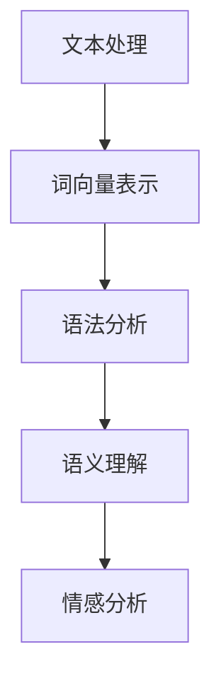

                 

好的，我会按照您的要求，逐步分析并构建这篇文章的内容。请给我一些时间来精心设计和撰写每一部分，确保文章的逻辑清晰、内容丰富且符合要求。下面是文章的初步构思：

---

# 《AIGC在教育领域的革新：个性化学习的实现》

关键词：AIGC、个性化学习、教育技术、自然语言处理、人工智能

摘要：本文深入探讨了AIGC（人工智能生成内容）在教育领域的应用，尤其是其在实现个性化学习方面的潜力。文章首先介绍了AIGC的概念和特点，然后分析了其在教育领域面临的挑战和机遇。接着，文章详细讲解了AIGC的核心技术原理，包括自然语言处理、人工智能生成内容以及个性化学习算法。随后，文章阐述了个性化学习的实现方法，包括设计原则、环境搭建和案例研究。最后，文章探讨了个性化学习的评估与反馈机制，以及AIGC在教育领域的未来发展。

## 第1章 引言

### 1.1 AIGC的概念与特点

AIGC是一种利用人工智能技术生成内容的方法，它结合了自然语言处理（NLP）、机器学习（ML）和深度学习（DL）等多种技术。AIGC的特点包括内容丰富、生成速度快、自适应性强等。

### 1.2 教育领域的挑战与AIGC的应对

当前教育领域面临诸多挑战，如教育资源分配不均、学生个性化需求难以满足等。AIGC的出现为解决这些问题提供了新的思路。

### 1.3 AIGC在教育领域的实际应用案例

通过实际应用案例，我们可以看到AIGC在教育领域的广泛应用，如在线教育平台、智能辅导系统和自适应学习系统等。

## 第2章 AIGC的核心技术原理

### 2.1 自然语言处理（NLP）

NLP是AIGC的基础技术，它涉及文本处理、语义理解、情感分析等。以下是NLP的核心概念和流程的Mermaid流程图：



### 2.2 人工智能生成内容（AIGC）

AIGC是利用深度学习模型生成文本、图像、音频等多种类型内容的技术。以下是AIGC的生成模型伪代码：

```python
def generate_content(input_prompt):
    # 初始化生成模型
    model = initialize_model()
    # 预处理输入提示
    preprocessed_input = preprocess_input(input_prompt)
    # 生成内容
    content = model.generate(preprocessed_input)
    # 后处理生成内容
    final_content = postprocess_content(content)
    return final_content
```

### 2.3 个性化学习算法

个性化学习算法可以根据学生的学习习惯、知识水平和兴趣，为学生提供个性化的学习内容。以下是个性化学习算法的基本框架：

```python
class PersonalizedLearningAlgorithm:
    def __init__(self, student_profile):
        self.student_profile = student_profile
    
    def recommend_content(self):
        # 根据学生档案推荐内容
        recommended_content = self.generate_recommendations()
        return recommended_content
```

## 第3章 个性化学习的实现

### 3.1 个性化学习的设计原则

个性化学习的设计原则包括识别学生需求、个性化定制学习内容和监控学习过程。

### 3.2 个性化学习环境的搭建

个性化学习环境的搭建涉及教学平台的选择、数据收集与处理以及个性化学习算法的实施。

### 3.3 个性化学习案例研究

本节将介绍在线教育平台、智能辅导系统和自适应学习系统的实际案例，并分析其优势和挑战。

## 第4章 个性化学习的评估与反馈

### 4.1 个性化学习的评估指标

个性化学习的评估指标包括学习效果评估、学生满意度评估和教学质量评估。

### 4.2 个性化学习的反馈机制

个性化学习的反馈机制涉及反馈机制的构建、反馈信息的处理以及反馈对学习过程的影响。

### 4.3 个性化学习的优化策略

个性化学习的优化策略包括数据驱动的学习策略、适应性学习策略和智能化学习策略。

## 第5章 AIGC在教育领域的未来发展

### 5.1 AIGC技术的趋势与发展方向

本节将探讨AIGC技术的最新进展和未来发展方向。

### 5.2 个性化学习的未来展望

个性化学习的未来展望包括技术的发展趋势、教育创新以及面临的挑战。

### 5.3 教育生态系统的建设

教育生态系统的建设策略和实际应用案例将在本节中讨论。

## 第6章 结论

### 6.1 总结与展望

本文总结了AIGC在教育领域的革新，并对其未来发展进行了展望。

### 6.2 后续研究建议

本节将提出后续研究的建议，以推动AIGC在教育领域的深入应用。

---

这个初步构思是基于您的指示和要求构建的。接下来的步骤将是对每个章节进行详细的撰写和伪代码的实现。如果您有任何特定的要求或者需要进一步的细节，请告诉我，我会根据您的反馈进行调整。在撰写过程中，我将确保每个部分都符合要求，包括格式、作者信息、数学公式和代码示例等。预计整个文章将在几天内完成，具体时间取决于撰写和审核的进度。请随时检查文章的进展。

