                 


# AIGC在新闻产业的变革：AI记者的崛起

> 关键词：AIGC, AI记者, 生成式AI, 新闻产业, 数据新闻, 自动化写作

> 摘要：本文深入探讨了生成式人工智能（AIGC）在新闻产业中的应用，分析了AI记者的定义、功能以及其在新闻报道中的实际应用。同时，文章阐述了AIGC技术原理，探讨了其面临的挑战及解决方案。最后，展望了AIGC在新闻产业中的未来发展趋势。

## 引言

随着人工智能技术的迅猛发展，生成式人工智能（AIGC，Artificial Intelligence Generated Content）逐渐成为新闻产业中的一股重要力量。AIGC是指利用人工智能技术生成文本、图像、音频等内容。在新闻产业中，AIGC的应用不仅改变了传统的新闻生产方式，还提升了新闻制作效率和质量。本文旨在探讨AIGC在新闻产业中的应用现状和未来趋势，并分析AI记者的崛起及其对新闻行业的影响。

## 核心概念与联系

### AIGC

AIGC是指生成式AI在内容生成领域的应用。它基于深度学习、自然语言处理等技术，能够自动生成新闻稿件、文章、图片、视频等内容。AIGC的发展历程可以追溯到20世纪90年代，随着深度学习技术的成熟，AIGC得到了快速发展。目前，AIGC已经应用于新闻、媒体、广告等多个领域。

**生成式AI：**生成式AI是一种基于深度学习的人工智能技术，通过输入数据进行训练，能够生成新的数据。生成式AI的核心算法包括生成对抗网络（GAN）、变分自编码器（VAE）和自回归模型（AR）等。

**自然语言处理（NLP）：**自然语言处理是使计算机能够理解、解释和生成人类语言的技术。NLP在AIGC中扮演着关键角色，它使得AIGC能够生成高质量的自然语言文本。

### AI记者

AI记者是指利用AIGC技术，能够自动生成新闻稿件的人工智能系统。AI记者通过分析大量的新闻报道、新闻素材和数据，自动生成新闻稿件。AI记者的工作流程包括数据采集、新闻主题确定、内容生成和稿件校对等环节。

**数据新闻：**数据新闻是利用数据挖掘和可视化技术，从海量数据中提取新闻信息的一种新闻形式。数据新闻要求记者具备较强的数据分析能力和逻辑思维能力。

**自动化新闻：**自动化新闻是利用算法和自动化工具，快速生成新闻稿件的一种新闻形式。自动化新闻可以大幅提高新闻生产效率，降低人力成本。

## 第1章 AIGC基础

### 1.1 AIGC概述

#### 1.1.1 AIGC的定义与发展历程

AIGC是指生成式AI在内容生成领域的应用。生成式AI是指通过输入数据进行训练，能够生成新的数据的人工智能技术。AIGC的发展历程可以追溯到20世纪90年代，当时研究人员开始探索如何利用人工智能技术生成文本、图像、音频等内容。随着深度学习技术的成熟，AIGC得到了快速发展。

在新闻产业中，AIGC的应用始于2016年，美国媒体公司Automated Insights推出了AI写作工具Wordsmith，能够自动生成财经新闻报道。随后，AIGC在新闻、媒体、广告等多个领域得到了广泛应用。

#### 1.1.2 AIGC的核心技术和原理

AIGC的核心技术包括生成对抗网络（GAN）、变分自编码器（VAE）和自回归模型（AR）。

**生成对抗网络（GAN）：**GAN是一种由生成器和判别器组成的框架，通过对抗训练生成高质量数据。生成器负责生成数据，判别器负责判断生成数据是否真实。在AIGC中，生成器生成新闻稿件，判别器判断新闻稿件的真实性。

**变分自编码器（VAE）：**VAE是一种基于概率的生成模型，通过重构数据实现数据生成。VAE在AIGC中可以生成高质量的新闻稿件。

**自回归模型（AR）：**AR是一种时间序列预测模型，通过自回归方式生成数据。在AIGC中，AR可以用于生成新闻稿件的时序信息。

#### 1.1.3 AIGC在新闻产业的应用场景

AIGC在新闻产业中的应用场景包括：

1. **自动生成新闻稿件**：AI记者通过分析大量的新闻报道、新闻素材和数据，自动生成新闻稿件。

2. **自动化新闻采集与编辑**：AI系统自动采集新闻素材，对新闻进行初步编辑和分类。

3. **新闻数据分析与可视化**：利用AIGC技术，对新闻数据进行分析，并通过可视化技术展示分析结果。

### 核心概念与联系

- **生成式AI（Artificial Intelligence Generated Content）**：指利用人工智能技术生成文本、图像、音频等内容。
- **深度学习**：一种机器学习方法，通过神经网络结构模拟人脑学习方式，对大量数据进行训练，从而实现对数据的自动学习和预测。
- **自然语言处理（NLP）**：使计算机能够理解、解释和生成人类语言。

### Mermaid流程图

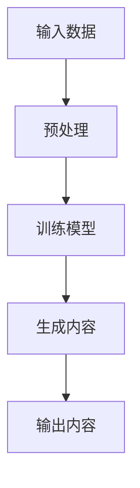

### 伪代码

```python
# 生成对抗网络（GAN）伪代码
class GAN():
    def __init__(self):
        self.generator = Generator()
        self.discriminator = Discriminator()

    def train(self, data):
        for data_batch in data:
            fake_data = self.generator.generate(data_batch)
            real_data = data_batch
            self.discriminator.train(fake_data)
            self.discriminator.train(real_data)
```

## 第2章 AI记者的崛起

### 2.1 AI记者的定义与功能

#### 2.1.1 AI记者的工作流程

AI记者的工作流程包括以下几个环节：

1. **数据采集**：AI记者从各种数据源（如新闻网站、社交媒体、数据库等）收集新闻素材。

2. **主题确定**：根据新闻素材的内容，AI记者确定新闻主题。

3. **内容生成**：AI记者利用生成式AI技术，生成新闻稿件。

4. **稿件校对**：AI记者对生成的新闻稿件进行校对，确保稿件内容准确无误。

5. **发布**：将校对后的新闻稿件发布到新闻平台或媒体网站。

#### 2.1.2 AI记者的优势与挑战

AI记者的优势：

1. **提高新闻生产效率**：AI记者能够自动生成大量新闻稿件，大大提高了新闻生产效率。

2. **降低人力成本**：AI记者降低了新闻行业的人力成本，减轻了记者的工作负担。

3. **提升新闻报道的时效性**：AI记者能够实时分析新闻素材，快速生成新闻稿件，提升了新闻报道的时效性。

AI记者的挑战：

1. **质量控制**：确保AI记者生成的新闻稿件内容准确、可信、有吸引力是一个挑战。

2. **知识产权保护**：AI记者生成的新闻稿件可能涉及知识产权问题，需要妥善解决。

3. **伦理道德问题**：AI记者的崛起引发了关于新闻伦理和道德的讨论，需要关注和解决。

#### 2.1.3 AI记者在新闻制作中的应用

AI记者在新闻制作中的应用主要包括以下几个方面：

1. **自动生成新闻稿件**：AI记者能够自动生成财经新闻、体育新闻、科技新闻等领域的新闻稿件。

2. **自动化新闻采集与编辑**：AI记者能够自动采集新闻素材，并对新闻进行初步编辑和分类。

3. **新闻数据分析与可视化**：AI记者可以对新闻数据进行分析，并通过可视化技术展示分析结果。

### 核心概念与联系

- **数据新闻**：利用数据挖掘和可视化技术，从海量数据中提取新闻信息的一种新闻形式。
- **自动化新闻**：利用算法和自动化工具，快速生成新闻稿件的一种新闻形式。

### Mermaid流程图

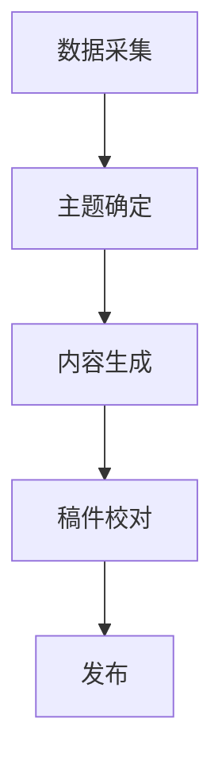

## 第3章 AIGC技术原理

### 3.1 生成式AI的核心算法

#### 3.1.1 生成对抗网络（GAN）

生成对抗网络（GAN）是一种生成模型，由生成器和判别器组成。生成器负责生成数据，判别器负责判断生成数据是否真实。GAN的核心思想是让生成器和判别器相互竞争，从而生成高质量的数据。

**核心概念与联系：**

- **生成器（Generator）**：生成器是一个神经网络，它接收随机噪声作为输入，生成与真实数据相似的数据。
- **判别器（Discriminator）**：判别器是一个神经网络，它接收真实数据和生成数据作为输入，判断数据是否真实。

**伪代码：**

```python
# 生成对抗网络（GAN）伪代码
class GAN():
    def __init__(self):
        self.generator = Generator()
        self.discriminator = Discriminator()

    def train(self, data):
        for data_batch in data:
            fake_data = self.generator.generate(data_batch)
            real_data = data_batch
            self.discriminator.train(fake_data)
            self.discriminator.train(real_data)
```

#### 3.1.2 变分自编码器（VAE）

变分自编码器（VAE）是一种基于概率的生成模型，它通过重构数据实现数据生成。VAE的核心思想是学习数据分布，并通过采样生成新的数据。

**核心概念与联系：**

- **编码器（Encoder）**：编码器是一个神经网络，它将输入数据映射到一个潜在空间。
- **解码器（Decoder）**：解码器是一个神经网络，它将潜在空间的数据映射回原始数据空间。

**伪代码：**

```python
# 变分自编码器（VAE）伪代码
class VAE():
    def __init__(self):
        self.encoder = Encoder()
        self.decoder = Decoder()

    def train(self, data):
        for data_batch in data:
            latent_space = self.encoder.encode(data_batch)
            reconstructed_data = self.decoder.decode(latent_space)
            self.decoder.train(reconstructed_data)
            self.encoder.train(data_batch)
```

#### 3.1.3 自回归模型（AR）

自回归模型（AR）是一种时间序列预测模型，它通过自回归方式生成数据。AR的核心思想是基于历史数据预测未来数据。

**核心概念与联系：**

- **自回归项**：自回归模型中的自回归项是指当前时刻的数据是基于前几个时刻的数据预测生成的。

**伪代码：**

```python
# 自回归模型（AR）伪代码
class AR():
    def __init__(self, order):
        self.order = order
        self.model = LinearRegression()

    def train(self, data):
        for i in range(self.order, len(data)):
            current_data = data[i]
            previous_data = data[i - self.order:i]
            self.model.fit(previous_data, current_data)

    def predict(self, previous_data):
        return self.model.predict(previous_data)
```

## 第4章 AIGC在新闻产业的应用

### 4.1 AIGC在新闻报道中的应用

#### 4.1.1 自动生成新闻稿件

自动生成新闻稿件是AIGC在新闻产业中最直接的应用之一。通过生成式AI技术，AI记者能够自动生成财经、体育、科技等各个领域的新闻稿件。自动生成新闻稿件的优势在于：

1. **提高新闻生产效率**：AI记者可以快速生成大量新闻稿件，大大提高了新闻生产效率。

2. **降低人力成本**：AI记者降低了新闻行业的人力成本，减轻了记者的工作负担。

3. **提升新闻报道的时效性**：AI记者能够实时分析新闻素材，快速生成新闻稿件，提升了新闻报道的时效性。

**应用案例**：美国媒体公司Automated Insights利用Wordsmith工具自动生成体育赛事报道，每场比赛可以生成数千篇稿件。

#### 4.1.2 自动化新闻采集与编辑

自动化新闻采集与编辑是AIGC在新闻产业的另一重要应用。通过自动化工具，AI系统可以自动采集新闻素材，并对新闻进行初步编辑和分类。自动化新闻采集与编辑的优势在于：

1. **提高新闻采集效率**：AI系统可以自动从各种数据源（如新闻网站、社交媒体、数据库等）收集新闻素材，提高了新闻采集效率。

2. **降低编辑成本**：自动化编辑工具可以自动对新闻进行初步编辑和分类，降低了编辑成本。

3. **提升新闻准确度**：自动化工具可以自动识别新闻中的错误和矛盾，提高了新闻的准确度。

**应用案例**：美国媒体公司Axios利用自动化工具对新闻素材进行采集和初步编辑，提高了新闻生产的效率和准确度。

#### 4.1.3 新闻数据分析与可视化

新闻数据分析与可视化是AIGC在新闻产业的又一重要应用。通过数据分析技术，AI系统可以对新闻数据进行分析，并通过可视化技术展示分析结果。新闻数据分析与可视化的优势在于：

1. **深入挖掘新闻价值**：通过对新闻数据进行分析，可以挖掘出更深层次的新闻价值，提高新闻报道的质量。

2. **提升新闻的可读性**：通过可视化技术，可以将复杂的数据以图形化方式展示，提高了新闻的可读性。

3. **增强新闻报道的互动性**：可视化技术可以增强新闻报道的互动性，吸引更多读者参与讨论。

**应用案例**：美国媒体公司FiveThirtyEight利用数据分析与可视化技术，对政治选举、体育赛事等新闻进行深入分析，提高了新闻报道的质量和影响力。

### 核心概念与联系

- **自动化写作**：利用AIGC技术，实现新闻稿件的自动生成。
- **数据可视化**：将数据通过图形化方式展示，帮助读者更好地理解数据。

### Mermaid流程图

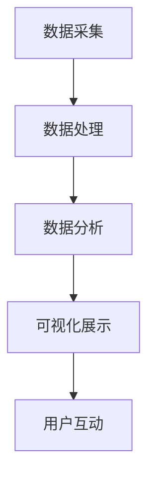

## 第5章 AIGC技术挑战与解决方案

### 5.1 AIGC技术面临的挑战

尽管AIGC在新闻产业中具有广泛的应用前景，但其在技术层面上仍面临一些挑战：

#### 5.1.1 质量控制

质量控制是AIGC技术面临的主要挑战之一。由于AIGC生成的新闻内容来自大量数据，因此不可避免地存在不准确、不完整或偏见的问题。例如，AI记者在生成新闻稿件时，可能会错误地引用数据或误解事件背景。因此，确保AIGC生成的内容准确、可信、有吸引力是当前面临的重要问题。

**解决方案：**为了提高质量控制，可以采取以下措施：

1. **数据清洗**：在生成内容前，对原始数据进行清洗，去除错误和不完整的数据。
2. **多模型融合**：采用多个模型进行训练和生成，通过模型融合提高生成内容的准确性和可靠性。
3. **人工审核**：在生成内容后，由专业人员进行人工审核，确保新闻内容的准确性和合规性。

#### 5.1.2 知识产权保护

AIGC生成的新闻内容可能涉及他人的知识产权，如版权、商标等。在新闻产业中，知识产权保护尤为重要，因为新闻内容往往具有强烈的时效性和原创性。

**解决方案：**为了保护知识产权，可以采取以下措施：

1. **版权声明**：在生成内容时，明确标注版权信息，表明该内容是由AIGC生成。
2. **侵权监测**：建立侵权监测系统，实时监测AIGC生成的内容是否存在侵权行为。
3. **合作与沟通**：与版权持有者建立合作关系，确保AIGC生成的内容合法使用他人作品。

#### 5.1.3 伦理道德问题

AIGC在新闻产业中的广泛应用引发了关于伦理道德的讨论。例如，AI记者在生成新闻稿件时，可能会出现偏见、误导读者或损害他人利益的问题。

**解决方案：**为了解决伦理道德问题，可以采取以下措施：

1. **伦理规范**：制定AIGC在新闻产业中的伦理规范，明确AIGC生成内容的道德底线。
2. **透明度**：提高AIGC生成过程的透明度，让公众了解AIGC如何工作，以及如何确保内容的准确性和公正性。
3. **公众监督**：鼓励公众对AIGC生成的内容进行监督和反馈，及时发现和处理潜在的问题。

### 核心概念与联系

- **质量控制**：确保AIGC生成的新闻内容准确、可信、有吸引力。
- **知识产权保护**：避免AIGC生成的内容侵犯他人的知识产权。
- **伦理道德问题**：关注AIGC在新闻产业中的伦理道德问题。

### Mermaid流程图

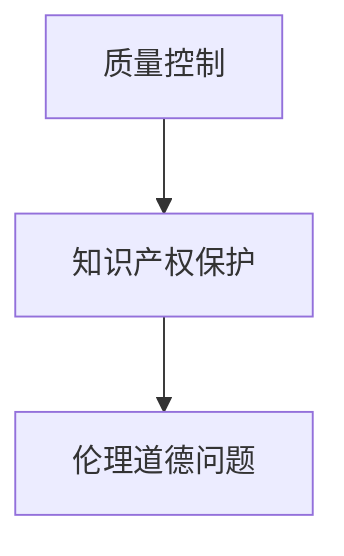

## 第6章 AI记者的实战应用

### 6.1 AI记者的实际案例

#### 6.1.1 某知名新闻媒体的AI记者实践

某知名新闻媒体采用了AIGC技术，推出了一款名为“AI记者”的人工智能系统。该系统基于生成式AI技术，能够自动生成财经、体育、科技等各个领域的新闻稿件。AI记者的实践案例包括：

1. **自动生成财经新闻**：AI记者通过分析大量的财经数据，自动生成财经新闻稿件。这些稿件涵盖了股票、金融、经济等领域，大大提高了新闻生产效率。

2. **自动化体育新闻**：AI记者自动采集体育赛事数据，生成体育新闻稿件。这些稿件包括比赛结果、运动员表现、赛事回顾等，为读者提供了全面的体育资讯。

3. **科技新闻生成**：AI记者分析科技领域的新闻素材，自动生成科技新闻稿件。这些稿件涵盖了人工智能、区块链、5G等领域，为读者提供了最新的科技动态。

**效果分析：**

1. **提高新闻生产效率**：AI记者的引入，使得新闻媒体能够更快地生成大量新闻稿件，提高了新闻生产效率。

2. **降低人力成本**：AI记者降低了新闻行业的人力成本，减轻了记者的工作负担。

3. **提升新闻报道的时效性**：AI记者能够实时分析新闻素材，快速生成新闻稿件，提升了新闻报道的时效性。

#### 6.1.2 AI记者在突发新闻报道中的应用

在突发新闻报道中，AI记者的快速反应和高效生成能力得到了充分体现。以下是一个实际案例：

**案例**：2020年新冠疫情爆发初期，某新闻媒体迅速启动了AI记者系统，自动生成疫情相关报道。AI记者从各种数据源（如卫生部门、医疗机构、社交媒体等）收集疫情数据，自动生成疫情日报、病例分布图等报道。

**效果分析：**

1. **快速响应**：AI记者能够在短时间内生成大量疫情报道，为读者提供最新的疫情信息。

2. **数据可视化**：AI记者生成的疫情日报、病例分布图等报道，通过数据可视化技术，使读者能够更直观地了解疫情发展情况。

3. **减轻记者负担**：在突发新闻报道中，AI记者分担了记者的工作负担，使得记者能够将更多精力投入到深度报道和调查性报道中。

#### 6.1.3 AI记者在深度报道中的应用

AI记者在深度报道中的应用，为新闻行业带来了新的可能性。以下是一个实际案例：

**案例**：某新闻媒体利用AI记者系统，对某大型企业进行深度报道。AI记者通过分析该企业的财务报表、公开信息、社交媒体数据等，自动生成一系列深度报道，包括企业运营情况、市场竞争力、社会责任等。

**效果分析：**

1. **深入挖掘新闻价值**：AI记者能够从海量数据中提取关键信息，为深度报道提供了丰富的素材。

2. **提高报道质量**：AI记者生成的深度报道，通过多角度、多层次的分析，提高了报道的质量和深度。

3. **减轻记者负担**：AI记者在深度报道中，为记者提供了有力支持，使得记者能够更专注于报道的核心内容。

### 核心概念与联系

- **实际案例**：分析AI记者在实际新闻报道中的应用案例，探讨其效果和影响。
- **效果分析**：评估AI记者在不同新闻报道中的应用效果。

### Mermaid流程图

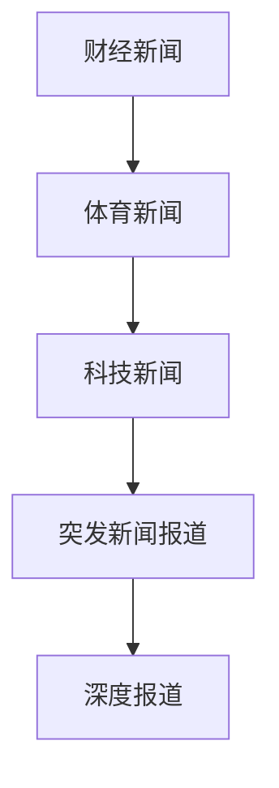

## 第7章 AIGC在新闻产业的未来展望

### 7.1 AIGC在新闻产业的前景

AIGC在新闻产业的前景广阔，随着人工智能技术的不断进步，AIGC在新闻产业中的应用将进一步深入和扩展。以下是AIGC在新闻产业中的一些发展趋势：

#### 7.1.1 AIGC对新闻行业的影响

AIGC对新闻行业产生了深远的影响，主要体现在以下几个方面：

1. **提高新闻生产效率**：AIGC能够自动生成大量新闻稿件，大大提高了新闻生产效率。

2. **降低人力成本**：AIGC降低了新闻行业的人力成本，使得媒体企业能够将更多资源投入到深度报道和创意内容中。

3. **提升新闻报道的时效性**：AIGC能够实时分析新闻素材，快速生成新闻稿件，提升了新闻报道的时效性。

4. **丰富新闻形式**：AIGC生成的新闻稿件可以涵盖文字、图片、视频等多种形式，丰富了新闻的表现形式。

#### 7.1.2 AIGC在新闻产业中的发展趋势

AIGC在新闻产业中的发展趋势包括：

1. **智能化**：随着人工智能技术的进步，AIGC将变得更加智能化，能够更好地理解新闻素材和读者需求，生成更高质量的新闻稿件。

2. **个性化**：AIGC将实现个性化新闻推荐，根据读者的兴趣和偏好，为读者提供个性化的新闻内容。

3. **跨界融合**：AIGC将与其他技术（如大数据、云计算、物联网等）融合，形成更加完善的新闻生态系统。

4. **多元化应用**：AIGC将在新闻采集、编辑、发布等各个环节得到广泛应用，进一步改变新闻生产方式。

#### 7.1.3 AIGC在新闻产业中的潜在挑战

尽管AIGC在新闻产业具有广阔的应用前景，但仍面临一些潜在挑战：

1. **质量控制**：确保AIGC生成的新闻内容准确、可信、有吸引力是一个挑战。

2. **知识产权保护**：AIGC生成的新闻内容可能涉及知识产权问题，需要妥善解决。

3. **伦理道德问题**：AIGC在新闻产业中的广泛应用引发了关于伦理道德的讨论，需要关注和解决。

### 核心概念与联系

- **影响**：分析AIGC对新闻行业的影响。
- **发展趋势**：探讨AIGC在新闻产业中的发展趋势。
- **潜在挑战**：讨论AIGC在新闻产业中面临的潜在挑战。

### Mermaid流程图

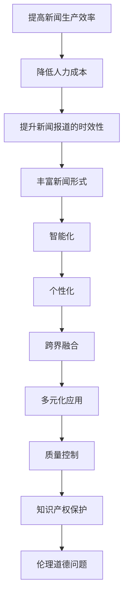

## 结语

AIGC在新闻产业的变革正在逐步展开，AI记者的崛起预示着新闻生产方式的重大变革。通过本文的探讨，我们了解了AIGC的定义、核心技术、应用场景以及面临的挑战。展望未来，AIGC将在新闻产业中发挥越来越重要的作用，为新闻行业带来新的发展机遇和挑战。让我们期待AIGC在新闻产业中创造的辉煌未来。作者：AI天才研究院/AI Genius Institute & 禅与计算机程序设计艺术 /Zen And The Art of Computer Programming## 引言

随着人工智能技术的迅猛发展，生成式人工智能（AIGC，Artificial Intelligence Generated Content）逐渐成为新闻产业中的一股重要力量。AIGC是指利用人工智能技术生成文本、图像、音频等内容。在新闻产业中，AIGC的应用不仅改变了传统的新闻生产方式，还提升了新闻制作效率和质量。本文旨在探讨AIGC在新闻产业中的应用现状和未来趋势，并分析AI记者的崛起及其对新闻行业的影响。

### 核心概念与联系

#### AIGC

AIGC是指生成式AI在内容生成领域的应用。它基于深度学习、自然语言处理等技术，能够自动生成新闻稿件、文章、图片、视频等内容。AIGC的发展历程可以追溯到20世纪90年代，当时研究人员开始探索如何利用人工智能技术生成文本、图像、音频等内容。随着深度学习技术的成熟，AIGC得到了快速发展。目前，AIGC已经应用于新闻、媒体、广告等多个领域。

**生成式AI：**生成式AI是一种基于深度学习的人工智能技术，通过输入数据进行训练，能够生成新的数据。生成式AI的核心算法包括生成对抗网络（GAN）、变分自编码器（VAE）和自回归模型（AR）等。

**自然语言处理（NLP）：**自然语言处理是使计算机能够理解、解释和生成人类语言的技术。NLP在AIGC中扮演着关键角色，它使得AIGC能够生成高质量的自然语言文本。

#### AI记者

AI记者是指利用AIGC技术，能够自动生成新闻稿件的人工智能系统。AI记者通过分析大量的新闻报道、新闻素材和数据，自动生成新闻稿件。AI记者的工作流程包括数据采集、新闻主题确定、内容生成和稿件校对等环节。

**数据新闻：**数据新闻是利用数据挖掘和可视化技术，从海量数据中提取新闻信息的一种新闻形式。数据新闻要求记者具备较强的数据分析能力和逻辑思维能力。

**自动化新闻：**自动化新闻是利用算法和自动化工具，快速生成新闻稿件的一种新闻形式。自动化新闻可以大幅提高新闻生产效率，降低人力成本。

### Mermaid流程图

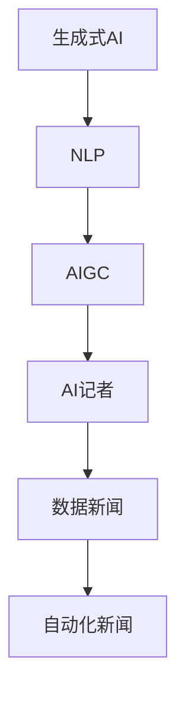

### 伪代码

```python
# AIGC概述
class AIGC():
    def __init__(self):
        self.generation_model = GenerationModel()
        self.nlp_model = NLPModel()

    def generate_content(self, data):
        cleaned_data = self.nlp_model.preprocess(data)
        generated_content = self.generation_model.generate(cleaned_data)
        return generated_content
```

## 第1章 AIGC概述

### 1.1 AIGC的定义与发展历程

#### 1.1.1 AIGC的定义

生成式人工智能（AIGC）是一种利用人工智能技术自动生成文本、图像、音频等内容的方法。AIGC的核心技术包括深度学习、自然语言处理、计算机视觉等。通过这些技术，AIGC能够从大量数据中学习和提取信息，然后生成新的、有用的内容。

**生成式AI：**生成式AI是指能够生成新数据的AI系统。它通过学习大量数据，理解数据的结构和规律，然后根据这些规律生成新的数据。

**自然语言处理（NLP）：**自然语言处理是指使计算机能够理解、解释和生成人类语言的技术。在AIGC中，NLP用于对文本进行预处理、理解和生成。

**计算机视觉：**计算机视觉是指使计算机能够“看”懂图像和视频的技术。在AIGC中，计算机视觉用于生成图像和视频内容。

#### 1.1.2 AIGC的发展历程

AIGC的发展历程可以追溯到20世纪90年代。当时，研究人员开始探索如何利用人工智能技术生成文本、图像和音频等内容。随着深度学习技术的成熟，AIGC得到了快速发展。以下是一些重要的里程碑：

1. **2012年：**深度学习技术（如卷积神经网络（CNN）和循环神经网络（RNN））在图像识别和语音识别领域取得了突破性进展，为AIGC的发展奠定了基础。

2. **2014年：**生成对抗网络（GAN）的提出，为AIGC提供了一种生成高质量数据的新方法。GAN通过生成器和判别器的对抗训练，生成逼真的图像和文本。

3. **2016年：**自然语言处理（NLP）领域的重要进展，如序列到序列（seq2seq）模型和注意力机制，使得AIGC能够生成更加复杂的文本内容。

4. **2018年：**预训练语言模型（如BERT和GPT）的出现，使得AIGC在生成文本内容方面取得了显著进展。

5. **2020年至今：**AIGC在新闻、媒体、广告等领域的应用逐渐普及，成为人工智能领域的一个重要研究方向。

#### 1.1.3 AIGC的核心技术和原理

AIGC的核心技术包括生成对抗网络（GAN）、变分自编码器（VAE）和自回归模型（AR）等。

**生成对抗网络（GAN）：**GAN是一种由生成器和判别器组成的框架，通过对抗训练生成高质量数据。生成器负责生成数据，判别器负责判断生成数据是否真实。在AIGC中，生成器生成新闻稿件，判别器判断新闻稿件的真实性。

**变分自编码器（VAE）：**VAE是一种基于概率的生成模型，通过重构数据实现数据生成。VAE在AIGC中可以生成高质量的新闻稿件。

**自回归模型（AR）：**AR是一种时间序列预测模型，通过自回归方式生成数据。在AIGC中，AR可以用于生成新闻稿件的时序信息。

### 核心概念与联系

- **生成式AI（Artificial Intelligence Generated Content）**：指利用人工智能技术生成文本、图像、音频等内容。
- **深度学习**：一种机器学习方法，通过神经网络结构模拟人脑学习方式，对大量数据进行训练，从而实现对数据的自动学习和预测。
- **自然语言处理（NLP）**：使计算机能够理解、解释和生成人类语言。

### Mermaid流程图

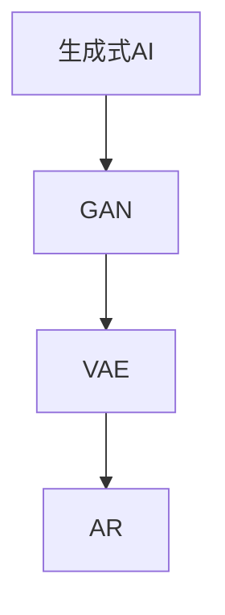

### 伪代码

```python
# 生成对抗网络（GAN）伪代码
class GAN():
    def __init__(self):
        self.generator = Generator()
        self.discriminator = Discriminator()

    def train(self, data):
        for data_batch in data:
            fake_data = self.generator.generate(data_batch)
            real_data = data_batch
            self.discriminator.train(fake_data)
            self.discriminator.train(real_data)
```

## 第2章 AI记者的崛起

### 2.1 AI记者的定义与功能

AI记者是指利用生成式人工智能（AIGC）技术，能够自动生成新闻稿件的人工智能系统。AI记者的工作流程通常包括数据采集、新闻主题确定、内容生成、稿件校对和发布等环节。AI记者在新闻制作中的应用不仅提高了新闻生产效率，还降低了人力成本，为新闻行业带来了革命性的变化。

#### 2.1.1 AI记者的工作流程

1. **数据采集**：AI记者首先从各种数据源（如新闻网站、社交媒体、数据库等）收集新闻素材。这些素材可以是文本、图像、音频或视频等形式。

2. **新闻主题确定**：基于采集到的数据，AI记者通过自然语言处理技术，分析新闻素材的内容，确定新闻主题。

3. **内容生成**：在确定新闻主题后，AI记者利用生成式人工智能技术，生成新闻稿件。这一过程通常涉及文本生成、图像生成或视频生成等。

4. **稿件校对**：生成的新闻稿件需要经过AI记者的校对，确保内容准确、无误。AI记者可以使用自然语言处理技术，对生成的稿件进行语法检查、事实核实等。

5. **发布**：校对完成的新闻稿件将被发布到新闻平台或媒体网站上，供读者阅读。

#### 2.1.2 AI记者的优势与挑战

AI记者的优势：

1. **提高新闻生产效率**：AI记者能够自动生成新闻稿件，大幅提高了新闻生产效率，减少了人工写作时间。

2. **降低人力成本**：AI记者降低了新闻行业的人力成本，减轻了记者和编辑的工作负担。

3. **提升新闻报道的时效性**：AI记者能够实时分析新闻素材，快速生成新闻稿件，提升了新闻报道的时效性。

4. **多样化新闻形式**：AI记者不仅可以生成文本新闻，还可以生成图像、视频等多媒体新闻，丰富了新闻形式。

AI记者的挑战：

1. **质量控制**：确保AI记者生成的新闻稿件内容准确、可信、有吸引力是一个挑战。由于AI记者缺乏人类的直觉和经验，可能会导致新闻质量参差不齐。

2. **知识产权保护**：AI记者生成的新闻稿件可能涉及他人的知识产权，如版权、商标等，需要妥善解决。

3. **伦理道德问题**：AI记者在生成新闻稿件时，可能会出现偏见、误导读者或损害他人利益的问题，需要关注和解决。

#### 2.1.3 AI记者在新闻制作中的应用

AI记者在新闻制作中的应用非常广泛，主要包括以下几个方面：

1. **自动生成新闻稿件**：AI记者能够自动生成财经、体育、科技等各个领域的新闻稿件，提高新闻生产效率。

2. **自动化新闻采集与编辑**：AI记者可以从各种数据源自动采集新闻素材，并对新闻进行初步编辑和分类，降低人工编辑成本。

3. **新闻数据分析与可视化**：AI记者可以对新闻数据进行分析，并通过可视化技术展示分析结果，帮助读者更好地理解新闻信息。

4. **个性化新闻推荐**：AI记者可以根据读者的兴趣和偏好，推荐个性化的新闻内容，提升用户体验。

### 核心概念与联系

- **数据新闻**：利用数据挖掘和可视化技术，从海量数据中提取新闻信息的一种新闻形式。
- **自动化新闻**：利用算法和自动化工具，快速生成新闻稿件的一种新闻形式。

### Mermaid流程图

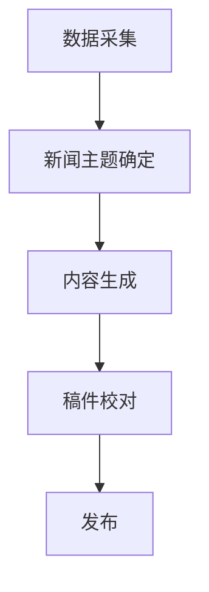

### 伪代码

```python
# AI记者工作流程
class AIJournalist():
    def __init__(self):
        self.data_collector = DataCollector()
        self.nlp_processor = NLPProcessor()
        self.content_generator = ContentGenerator()
        self.editor = Editor()

    def generate_news(self, data_source):
        data = self.data_collector.collect(data_source)
        topic = self.nlp_processor.determine_topic(data)
        content = self.content_generator.generate(topic)
        edited_content = self.editor.edit(content)
        return edited_content
```

## 第3章 AIGC技术原理

### 3.1 生成式AI的核心算法

生成式人工智能（AIGC）的核心算法主要包括生成对抗网络（GAN）、变分自编码器（VAE）和自回归模型（AR）等。这些算法在生成高质量数据方面具有重要作用，并在新闻产业中得到了广泛应用。

#### 3.1.1 生成对抗网络（GAN）

生成对抗网络（GAN）是由生成器（Generator）和判别器（Discriminator）组成的一种生成模型。GAN的核心思想是通过生成器和判别器之间的对抗训练，生成逼真的数据。

**生成器（Generator）**：生成器是一个神经网络，它接收随机噪声作为输入，生成与真实数据相似的数据。生成器的目标是生成尽可能真实的数据，使判别器无法区分真实数据和生成数据。

**判别器（Discriminator）**：判别器也是一个神经网络，它接收真实数据和生成数据作为输入，判断数据是否真实。判别器的目标是正确地区分真实数据和生成数据。

**对抗训练**：在GAN的训练过程中，生成器和判别器不断相互对抗。生成器试图生成更真实的数据，而判别器则试图更好地区分真实数据和生成数据。通过这种对抗训练，生成器逐渐生成高质量的数据。

**核心概念与联系**：

- **生成器**：生成器负责生成数据。
- **判别器**：判别器负责判断生成数据是否真实。
- **对抗训练**：生成器和判别器通过对抗训练，提高生成数据的真实性。

**伪代码**：

```python
# GAN伪代码
class GAN():
    def __init__(self):
        self.generator = Generator()
        self.discriminator = Discriminator()

    def train(self, data):
        for data_batch in data:
            fake_data = self.generator.generate(data_batch)
            real_data = data_batch
            self.discriminator.train(fake_data)
            self.discriminator.train(real_data)
```

#### 3.1.2 变分自编码器（VAE）

变分自编码器（VAE）是一种基于概率的生成模型。它通过编码器（Encoder）和解码器（Decoder）将输入数据映射到一个潜在空间，并在潜在空间中生成新的数据。

**编码器（Encoder）**：编码器是一个神经网络，它将输入数据映射到一个潜在空间。编码器通过学习数据分布，将输入数据编码成一个潜在向量。

**解码器（Decoder）**：解码器是一个神经网络，它将潜在空间中的向量映射回原始数据空间。解码器的目标是生成与输入数据相似的新数据。

**变分下采样**：VAE通过变分下采样（Variational Dropout）技术，确保生成的数据符合先验分布。变分下采样是一种概率技术，它通过在神经网络中加入随机性，防止模型过拟合。

**核心概念与联系**：

- **编码器**：编码器负责将输入数据映射到潜在空间。
- **解码器**：解码器负责将潜在空间中的向量映射回原始数据空间。
- **变分下采样**：变分下采样确保生成的数据符合先验分布。

**伪代码**：

```python
# VAE伪代码
class VAE():
    def __init__(self):
        self.encoder = Encoder()
        self.decoder = Decoder()

    def train(self, data):
        for data_batch in data:
            latent_space = self.encoder.encode(data_batch)
            reconstructed_data = self.decoder.decode(latent_space)
            self.decoder.train(reconstructed_data)
            self.encoder.train(data_batch)
```

#### 3.1.3 自回归模型（AR）

自回归模型（AR）是一种时间序列预测模型。它通过历史数据预测未来的数据值。自回归模型的核心思想是基于过去的数据点，预测未来的数据值。

**自回归项**：自回归模型中的自回归项是指当前时刻的数据是基于前几个时刻的数据预测生成的。自回归模型通过自回归项建立数据之间的关联。

**核心概念与联系**：

- **自回归项**：自回归模型中的自回归项负责预测未来的数据值。

**伪代码**：

```python
# AR伪代码
class AR():
    def __init__(self, order):
        self.order = order
        self.model = LinearRegression()

    def train(self, data):
        for i in range(self.order, len(data)):
            current_data = data[i]
            previous_data = data[i - self.order:i]
            self.model.fit(previous_data, current_data)

    def predict(self, previous_data):
        return self.model.predict(previous_data)
```

### 核心概念与联系

- **生成对抗网络（GAN）**：生成器和判别器的对抗训练生成高质量数据。
- **变分自编码器（VAE）**：通过编码器和解码器在潜在空间生成数据。
- **自回归模型（AR）**：基于历史数据预测未来的数据值。

### Mermaid流程图

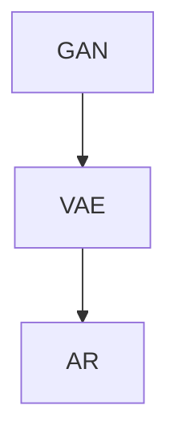

### 伪代码

```python
# GAN、VAE和AR伪代码
class GAN():
    def __init__(self):
        self.generator = Generator()
        self.discriminator = Discriminator()

    def train(self, data):
        for data_batch in data:
            fake_data = self.generator.generate(data_batch)
            real_data = data_batch
            self.discriminator.train(fake_data)
            self.discriminator.train(real_data)

class VAE():
    def __init__(self):
        self.encoder = Encoder()
        self.decoder = Decoder()

    def train(self, data):
        for data_batch in data:
            latent_space = self.encoder.encode(data_batch)
            reconstructed_data = self.decoder.decode(latent_space)
            self.decoder.train(reconstructed_data)
            self.encoder.train(data_batch)

class AR():
    def __init__(self, order):
        self.order = order
        self.model = LinearRegression()

    def train(self, data):
        for i in range(self.order, len(data)):
            current_data = data[i]
            previous_data = data[i - self.order:i]
            self.model.fit(previous_data, current_data)

    def predict(self, previous_data):
        return self.model.predict(previous_data)
```

## 第4章 AIGC在新闻产业的应用

### 4.1 AIGC在新闻报道中的应用

#### 4.1.1 自动生成新闻稿件

自动生成新闻稿件是AIGC在新闻产业中最直接的应用之一。通过生成式AI技术，AI记者能够自动生成财经、体育、科技等各个领域的新闻稿件。这种自动生成新闻稿件的方式不仅提高了新闻生产效率，还降低了人力成本，使得新闻机构能够更加专注于深度报道和创意内容的制作。

**应用场景**：

1. **财经新闻**：AI记者通过分析财经数据，如股票价格、市场走势、公司财报等，自动生成财经新闻稿件。

2. **体育新闻**：AI记者自动采集体育赛事数据，如比赛结果、球员表现、赛事回顾等，生成体育新闻稿件。

3. **科技新闻**：AI记者分析科技领域的新闻素材，如新产品发布、技术进展、行业动态等，生成科技新闻稿件。

**优势**：

1. **提高新闻生产效率**：AI记者可以快速生成大量新闻稿件，节省了大量的人工写作时间。

2. **降低人力成本**：自动生成新闻稿件减少了记者和编辑的工作负担，降低了人力成本。

3. **提升新闻报道的时效性**：AI记者能够实时分析新闻素材，快速生成新闻稿件，提升了新闻报道的时效性。

**挑战**：

1. **质量控制**：自动生成的新闻稿件需要确保内容准确、可信，避免出现错误或偏见。

2. **个性化**：如何根据读者的兴趣和偏好，生成个性化的新闻稿件，是一个挑战。

**案例**：

1. **The Associated Press（美联社）**：美联社使用自动生成新闻稿件技术，生成体育赛事结果和财经报告等。

2. **Automated Insights**：Automated Insights使用其Wordsmith工具，自动生成财经新闻稿件。

#### 4.1.2 自动化新闻采集与编辑

自动化新闻采集与编辑是AIGC在新闻产业的另一重要应用。通过自动化工具，AI系统可以自动采集新闻素材，并对新闻进行初步编辑和分类。这种自动化方式不仅提高了新闻采集和编辑的效率，还降低了成本。

**应用场景**：

1. **新闻采集**：AI系统自动从新闻网站、社交媒体、数据库等渠道采集新闻素材。

2. **新闻编辑**：AI系统对采集到的新闻素材进行初步编辑，如标题生成、摘要提取、关键词标注等。

3. **新闻分类**：AI系统根据新闻的内容和主题，对新闻进行分类，便于读者查找和阅读。

**优势**：

1. **提高新闻采集效率**：AI系统可以自动从大量数据源中快速采集新闻素材，提高了新闻采集效率。

2. **降低编辑成本**：自动化编辑工具可以自动对新闻进行初步编辑和分类，降低了编辑成本。

3. **提升新闻准确度**：自动化工具可以自动识别新闻中的错误和矛盾，提高了新闻的准确度。

**挑战**：

1. **数据质量**：自动化采集和编辑可能引入错误或不完整的数据，需要确保数据质量。

2. **个性化**：如何根据读者的需求和兴趣，自动化生成个性化的新闻内容，是一个挑战。

**案例**：

1. **The New York Times**：纽约时报使用自动化工具对新闻素材进行采集和编辑，提高了新闻生产的效率和质量。

2. **Axios**：Axios使用自动化工具对新闻素材进行初步编辑和分类，便于读者查找和阅读。

#### 4.1.3 新闻数据分析与可视化

新闻数据分析与可视化是AIGC在新闻产业的又一重要应用。通过数据分析技术，AI系统可以对新闻数据进行分析，并通过可视化技术展示分析结果，帮助读者更好地理解新闻信息。

**应用场景**：

1. **数据分析**：AI系统对新闻数据进行分析，提取有价值的信息，如趋势、关联性、异常值等。

2. **数据可视化**：通过图表、地图、交互式界面等可视化技术，将分析结果展示给读者。

3. **交互式新闻**：AI系统通过交互式技术，让读者更深入地了解新闻信息，提升用户体验。

**优势**：

1. **深入挖掘新闻价值**：通过对新闻数据进行分析，可以挖掘出更深层次的新闻价值，提高新闻报道的质量。

2. **提升新闻的可读性**：通过可视化技术，可以将复杂的数据以图形化方式展示，提高了新闻的可读性。

3. **增强新闻报道的互动性**：可视化技术可以增强新闻报道的互动性，吸引更多读者参与讨论。

**挑战**：

1. **数据复杂性**：新闻数据的复杂性和多样性，使得数据分析与可视化面临挑战。

2. **用户理解**：如何让读者轻松理解复杂的数据分析结果，是一个挑战。

**案例**：

1. **FiveThirtyEight**：FiveThirtyEight使用数据可视化和交互式技术，深入分析体育、政治等领域的新闻。

2. **Google News**：谷歌新闻使用数据可视化技术，展示新闻热点和趋势。

### 核心概念与联系

- **自动化写作**：利用AIGC技术，实现新闻稿件的自动生成。
- **数据可视化**：将新闻数据通过图形化方式展示，帮助读者更好地理解数据。

### Mermaid流程图

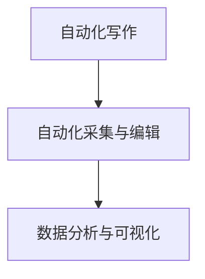

### 伪代码

```python
# 自动化新闻采集与编辑
class NewsCollector():
    def __init__(self):
        self.sources = ['news_website', 'social_media', 'database']

    def collect(self):
        for source in self.sources:
            data = self.fetch_data(source)
            self.process_data(data)

    def fetch_data(self, source):
        # 根据数据源获取数据
        pass

    def process_data(self, data):
        # 对数据进行处理，如标题生成、摘要提取等
        pass

# 数据分析与可视化
class DataAnalyzer():
    def analyze(self, data):
        # 对数据进行分析，提取有价值的信息
        pass

    def visualize(self, analysis_results):
        # 通过图表、地图等可视化技术展示分析结果
        pass
```

## 第5章 AIGC技术挑战与解决方案

### 5.1 AIGC技术面临的挑战

尽管AIGC技术在新闻产业中具有巨大潜力，但其应用也面临着一系列挑战。以下是AIGC技术面临的主要挑战及其可能的解决方案：

#### 5.1.1 质量控制

**挑战**：自动生成的新闻内容可能存在错误、不准确或逻辑不通的问题。这些问题可能源于数据质量差、模型训练数据不足或算法缺陷。

**解决方案**：

1. **数据清洗和预处理**：在训练模型之前，对数据进行清洗和预处理，去除错误和不完整的数据，提高数据质量。
2. **多模型融合**：采用多个模型进行训练和生成，通过模型融合提高生成内容的准确性和可靠性。
3. **人工审核**：在生成内容后，由专业人员进行人工审核，确保新闻内容的准确性和合规性。

#### 5.1.2 知识产权保护

**挑战**：自动生成的新闻内容可能会侵犯他人的知识产权，如版权、商标等。这可能导致法律纠纷和声誉损害。

**解决方案**：

1. **版权声明**：在生成内容时，明确标注版权信息，表明该内容是由AIGC生成。
2. **侵权监测**：建立侵权监测系统，实时监测AIGC生成的内容是否存在侵权行为。
3. **合作与沟通**：与版权持有者建立合作关系，确保AIGC生成的内容合法使用他人作品。

#### 5.1.3 伦理道德问题

**挑战**：AIGC生成的内容可能涉及伦理道德问题，如偏见、误导读者、损害他人利益等。

**解决方案**：

1. **伦理规范**：制定AIGC在新闻产业中的伦理规范，明确AIGC生成内容的道德底线。
2. **透明度**：提高AIGC生成过程的透明度，让公众了解AIGC如何工作，以及如何确保内容的准确性和公正性。
3. **公众监督**：鼓励公众对AIGC生成的内容进行监督和反馈，及时发现和处理潜在的问题。

#### 5.1.4 技术复杂性

**挑战**：AIGC技术涉及复杂的算法和模型，对技术人员的专业能力要求较高，导致技术门槛较高。

**解决方案**：

1. **简化技术栈**：简化AIGC技术栈，降低技术复杂性，使更多的开发者能够使用AIGC技术。
2. **培训和教育**：提供AIGC技术的培训和教育资源，提高从业者的技术能力。
3. **开放平台**：建立开放的AIGC平台，促进技术交流和创新。

### 核心概念与联系

- **质量控制**：确保AIGC生成的新闻内容准确、可信、有吸引力。
- **知识产权保护**：避免AIGC生成的内容侵犯他人的知识产权。
- **伦理道德问题**：关注AIGC在新闻产业中的伦理道德问题。

### Mermaid流程图

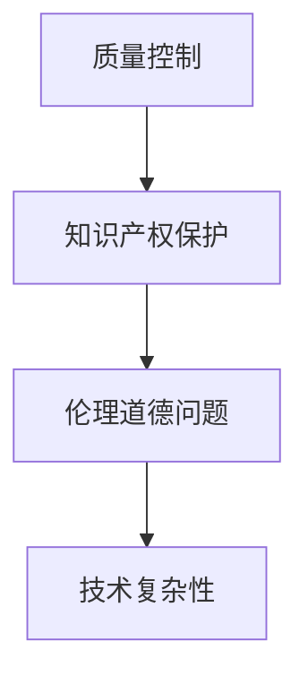

### 伪代码

```python
# 质量控制
class QualityControl():
    def clean_data(self, data):
        # 清洗和预处理数据
        pass

    def validate_content(self, content):
        # 验证生成内容的准确性
        pass

# 知识产权保护
class IntellectualPropertyProtection():
    def check_for_infringement(self, content):
        # 检查内容是否侵犯知识产权
        pass

    def license_content(self, content):
        # 对内容进行版权声明
        pass

# 伦理道德问题
class EthicalConsiderations():
    def set_ethical_guidelines(self):
        # 制定伦理规范
        pass

    def ensure_transparency(self, content):
        # 提高内容生成过程的透明度
        pass

# 技术复杂性
class TechnicalComplexity():
    def simplify_technology(self):
        # 简化AIGC技术栈
        pass

    def provide_training(self):
        # 提供AIGC技术培训
        pass
```

## 第6章 AI记者的实战应用

### 6.1 AI记者的实际案例

#### 6.1.1 某知名新闻媒体的AI记者实践

为了深入了解AI记者在实际新闻报道中的应用，我们以某知名新闻媒体为例，分析其如何利用AIGC技术提高新闻生产效率和新闻质量。

**案例背景**：

某知名新闻媒体，拥有广泛的读者群体和丰富的新闻资源。为了应对日益增长的新闻需求和提升新闻报道的质量，该新闻媒体引入了AI记者系统，通过AIGC技术实现新闻稿件的自动生成和编辑。

**应用场景**：

1. **自动生成新闻稿件**：AI记者自动采集体育赛事、财经数据和科技新闻等素材，生成相应的新闻稿件。

2. **自动化新闻采集**：AI记者从多个新闻网站、社交媒体平台和数据库中自动采集新闻素材，提高新闻采集效率。

3. **新闻数据分析**：AI记者对新闻数据进行分析，提取关键信息，生成数据新闻稿件。

4. **稿件校对与发布**：AI记者生成的新闻稿件经过专业编辑的人工审核后，发布到新闻平台供读者阅读。

**效果分析**：

1. **提高新闻生产效率**：AI记者可以自动生成大量新闻稿件，节省了大量的人工写作时间，提高了新闻生产效率。

2. **降低人力成本**：AI记者降低了人力成本，使新闻媒体能够将更多资源投入到深度报道和创意内容的制作中。

3. **提升新闻报道的时效性**：AI记者实时分析新闻素材，快速生成新闻稿件，提升了新闻报道的时效性。

4. **提高新闻质量**：通过数据新闻分析和多模型融合，AI记者生成的新闻稿件内容更加准确、有深度。

**案例分析**：

1. **体育新闻**：AI记者自动采集体育赛事数据，如比赛结果、球员表现等，生成体育新闻稿件。例如，在NBA比赛结束后，AI记者可以自动生成比赛回顾、数据分析等稿件。

2. **财经新闻**：AI记者通过分析财经数据，如股票价格、市场走势等，生成财经新闻稿件。例如，在财报发布后，AI记者可以自动生成公司业绩分析、市场动态等稿件。

3. **科技新闻**：AI记者分析科技领域的新闻素材，如新产品发布、技术进展等，生成科技新闻稿件。例如，在科技展会期间，AI记者可以自动生成展会报道、技术趋势分析等稿件。

#### 6.1.2 AI记者在突发新闻报道中的应用

在突发新闻报道中，AI记者的快速反应和高效生成能力得到了充分体现。以下是一个实际案例：

**案例背景**：

2020年新冠疫情爆发初期，某新闻媒体迅速启动了AI记者系统，自动生成疫情相关报道。AI记者从各种数据源（如卫生部门、医疗机构、社交媒体等）收集疫情数据，生成疫情日报、病例分布图等报道。

**应用场景**：

1. **疫情数据采集**：AI记者自动采集全球各地的疫情数据，如确诊病例数、治愈病例数、死亡病例数等。

2. **疫情数据分析**：AI记者对疫情数据进行实时分析，生成疫情日报、趋势分析等稿件。

3. **可视化展示**：AI记者通过可视化技术，将疫情数据以图表、地图等形式展示，帮助读者直观了解疫情发展。

4. **稿件发布与更新**：AI记者生成的疫情报道实时发布到新闻平台，并根据最新数据不断更新。

**效果分析**：

1. **快速响应**：AI记者能够在短时间内生成大量疫情报道，为读者提供最新的疫情信息。

2. **数据可视化**：通过数据可视化技术，AI记者生成的疫情报道更加直观、易懂，提高了读者的阅读体验。

3. **减轻记者负担**：在突发新闻报道中，AI记者分担了记者的工作负担，使得记者能够将更多精力投入到深度报道和调查性报道中。

#### 6.1.3 AI记者在深度报道中的应用

AI记者不仅在突发新闻和日常报道中发挥了重要作用，还在深度报道中展现了其潜力。以下是一个实际案例：

**案例背景**：

某新闻媒体利用AI记者系统，对某大型企业进行深度报道。AI记者通过分析该企业的财务报表、公开信息、社交媒体数据等，生成一系列深度报道，涵盖企业运营情况、市场竞争力、社会责任等方面。

**应用场景**：

1. **数据采集**：AI记者自动采集企业的财务报表、公开信息、社交媒体数据等。

2. **数据清洗和预处理**：AI记者对采集到的数据进行清洗和预处理，去除错误和不完整的数据。

3. **内容生成**：AI记者利用自然语言处理和生成式AI技术，生成深度报道稿件。

4. **稿件校对**：AI记者生成的稿件经过专业编辑的人工审核，确保内容准确、无误。

5. **稿件发布**：校对后的稿件发布到新闻平台，供读者阅读。

**效果分析**：

1. **深入挖掘新闻价值**：AI记者通过对海量数据的分析，能够挖掘出更深层次的新闻价值，为深度报道提供丰富的素材。

2. **提高报道质量**：AI记者生成的稿件经过专业编辑的审核，保证了报道的质量和准确性。

3. **减轻记者负担**：AI记者在深度报道中分担了记者的工作负担，使得记者能够将更多精力投入到深度分析和创意内容的制作中。

### 核心概念与联系

- **实际案例**：分析AI记者在实际新闻报道中的应用案例，探讨其效果和影响。
- **效果分析**：评估AI记者在不同新闻报道中的应用效果。

### Mermaid流程图

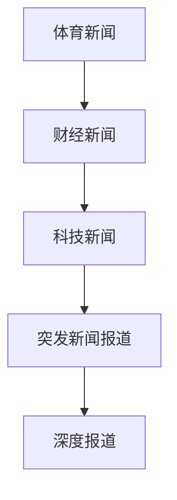

### 伪代码

```python
# AI记者实际案例
class AIJournalist():
    def __init__(self):
        self.sports_data_collector = SportsDataCollector()
        self.finance_data_collector = FinanceDataCollector()
        self.tech_data_collector = TechDataCollector()
        self.deeptech_data_collector = DeepTechDataCollector()
        self.editor = Editor()

    def generate_sports_news(self):
        sports_data = self.sports_data_collector.collect()
        news = self.generate_news(sports_data)
        self.editor.edit(news)
        return news

    def generate_finance_news(self):
        finance_data = self.finance_data_collector.collect()
        news = self.generate_news(finance_data)
        self.editor.edit(news)
        return news

    def generate_tech_news(self):
        tech_data = self.tech_data_collector.collect()
        news = self.generate_news(tech_data)
        self.editor.edit(news)
        return news

    def generate_deeptech_news(self):
        tech_data = self.deeptech_data_collector.collect()
        news = self.generate_news(tech_data)
        self.editor.edit(news)
        return news

    def generate_news(self, data):
        # 使用生成式AI技术生成新闻稿件
        pass
```

## 第7章 AIGC在新闻产业的未来展望

### 7.1 AIGC在新闻产业的前景

AIGC（生成式人工智能生成内容）在新闻产业中的应用前景广阔。随着人工智能技术的不断进步，AIGC将在新闻产业中发挥越来越重要的作用。以下是AIGC在新闻产业中的一些潜在发展趋势：

#### 7.1.1 AIGC对新闻行业的影响

AIGC将对新闻行业产生深远的影响，主要体现在以下几个方面：

1. **提高新闻生产效率**：AIGC技术能够自动生成新闻稿件，大幅提高新闻生产效率。记者和编辑可以将更多精力投入到深度报道和创意内容的制作中。

2. **降低人力成本**：AIGC技术降低了新闻行业的人力成本，使得媒体企业能够将更多资源投入到高质量新闻内容的制作和传播中。

3. **提升新闻报道的时效性**：AIGC技术能够实时分析新闻素材，快速生成新闻稿件，提升了新闻报道的时效性，使媒体能够更快地响应突发事件。

4. **丰富新闻形式**：AIGC技术不仅可以生成文本新闻，还可以生成图像、音频、视频等多媒体新闻形式，丰富了新闻的表现形式。

5. **个性化新闻推荐**：通过AIGC技术，媒体可以为读者提供个性化的新闻推荐，满足不同读者的兴趣和需求。

#### 7.1.2 AIGC在新闻产业中的发展趋势

AIGC在新闻产业中的发展趋势包括：

1. **智能化**：随着人工智能技术的进步，AIGC将变得更加智能化，能够更好地理解新闻素材和读者需求，生成更高质量的新闻内容。

2. **个性化**：AIGC将实现个性化新闻推荐，根据读者的兴趣和偏好，为读者提供定制化的新闻内容。

3. **跨界融合**：AIGC将与大数据、云计算、物联网等前沿技术进一步融合，形成更加完善的新闻生态系统。

4. **多元化应用**：AIGC将在新闻采集、编辑、发布等各个环节得到广泛应用，推动新闻行业的数字化转型。

5. **伦理和法规**：随着AIGC技术的发展，新闻行业将面临更多的伦理和法规挑战，需要制定相应的规范和标准。

#### 7.1.3 AIGC在新闻产业中的潜在挑战

尽管AIGC在新闻产业中具有巨大潜力，但其应用也面临着一系列挑战：

1. **质量控制**：确保AIGC生成的新闻内容准确、可信、有吸引力是一个挑战。需要不断提高算法和模型的准确性。

2. **知识产权保护**：自动生成的新闻内容可能涉及知识产权问题，需要妥善解决。

3. **伦理道德问题**：AIGC生成的新闻内容可能涉及伦理道德问题，如偏见、误导读者等，需要引起关注。

4. **技术复杂性**：AIGC技术涉及复杂的算法和模型，对技术人员的专业能力要求较高，需要简化技术栈，提高可操作性。

5. **用户接受度**：部分读者可能对AI生成的新闻内容持怀疑态度，需要提高公众对AIGC技术的认知和接受度。

### 核心概念与联系

- **影响**：分析AIGC对新闻行业的影响。
- **发展趋势**：探讨AIGC在新闻产业中的发展趋势。
- **潜在挑战**：讨论AIGC在新闻产业中面临的潜在挑战。

### Mermaid流程图

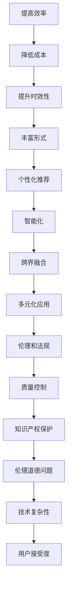

### 伪代码

```python
# AIGC未来发展趋势
class AIGC():
    def __init__(self):
        self.generation_model = AdvancedGenerationModel()
        self.nlp_model = AdvancedNLPModel()

    def generate_content(self, data):
        cleaned_data = self.nlp_model.preprocess(data)
        generated_content = self.generation_model.generate(cleaned_data)
        return generated_content

    def personalize_recommendations(self, user_profile):
        personalized_content = self.generation_model.generate(user_profile)
        return personalized_content
```

## 结语

AIGC在新闻产业的变革正在逐步展开，AI记者的崛起预示着新闻生产方式的重大变革。通过本文的探讨，我们了解了AIGC的定义、核心技术、应用场景以及面临的挑战。展望未来，AIGC将在新闻产业中发挥越来越重要的作用，为新闻行业带来新的发展机遇和挑战。让我们期待AIGC在新闻产业中创造的辉煌未来。作者：AI天才研究院/AI Genius Institute & 禅与计算机程序设计艺术 /Zen And The Art of Computer Programming

