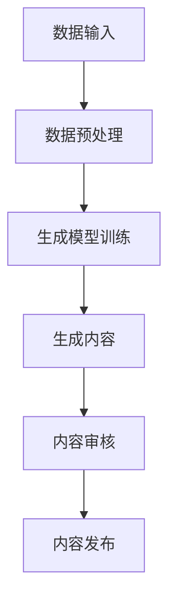

                 

# AIGC在新闻媒体中的伦理考量：真实性与客观性的平衡

## 关键词

- AIGC
- 新闻媒体
- 伦理考量
- 真实性
- 客观性
- 偏见分析
- 算法透明性

## 摘要

随着人工智能生成内容（AIGC）技术的迅猛发展，其在新闻媒体行业中的应用日益广泛。AIGC技术以其高效、智能的特点，大大提升了新闻写作、图像和视频制作等领域的效率。然而，AIGC的广泛应用也引发了关于其伦理考量的讨论，特别是真实性和客观性方面的平衡问题。本文将从AIGC的基本概念、技术原理、应用场景、伦理考量以及法律框架等多个角度，系统地探讨AIGC在新闻媒体中的伦理考量，以期为行业的发展提供有益的参考。

---

## 第1章 引言

### 1.1 书籍背景与目的

本文旨在探讨人工智能生成内容（AIGC）在新闻媒体行业中的应用及其带来的伦理挑战，特别是真实性与客观性的平衡问题。随着人工智能技术的不断进步，AIGC已经在新闻写作、视觉报道和数据分析等多个领域展现出了巨大的潜力。然而，AIGC的广泛应用也引发了一系列伦理问题，如内容的真实性、客观性和算法的偏见等。本文将通过对AIGC技术的基本概念、工作原理、应用场景的详细分析，深入探讨其在新闻媒体中的伦理考量，并提出相应的解决方案。

### 1.2 AIGC概述

人工智能生成内容（AIGC，Artificial Intelligence Generated Content）是指利用人工智能技术自动生成文字、图片、音频和视频等内容的一种技术。AIGC技术涵盖了自然语言处理、计算机视觉、生成对抗网络和强化学习等多个领域。通过这些技术，人工智能能够自动生成高质量、多样化的内容，从而提高新闻媒体的创作效率和内容丰富度。

### 1.3 新闻媒体的现状与挑战

新闻媒体行业面临着诸多挑战，包括信息泛滥、内容同质化和读者流失等。传统新闻写作和报道方式已经难以满足现代读者的需求。同时，新闻媒体的生存压力也日益增大，需要寻求新的发展模式和盈利模式。AIGC技术的出现为新闻媒体提供了一种新的解决方案，通过自动化和智能化手段，提高内容创作效率，降低成本，从而提升竞争力。

### 1.4 伦理考量的重要性

在AIGC技术广泛应用的同时，其带来的伦理问题不容忽视。特别是真实性和客观性的平衡问题，直接关系到新闻媒体的公信力和社会责任。如何确保AIGC生成的内容真实、客观，如何避免算法偏见和误导，成为新闻媒体行业亟待解决的重要问题。本文将从伦理考量的角度，对这些问题进行深入探讨。

---

## 第2章 AIGC技术基础

### 2.1 AIGC概念与类型

#### 2.1.1 AIGC基本概念

AIGC是指利用人工智能技术生成内容的过程。它包括自然语言处理（NLP）、计算机视觉（CV）、生成对抗网络（GAN）和强化学习（RL）等多种技术。AIGC技术能够自动生成文字、图片、音频和视频等多种形式的内容，广泛应用于新闻写作、视觉报道、数据分析等领域。

#### 2.1.2 自动内容生成技术的分类

根据生成内容的类型，AIGC技术可以分为以下几类：

1. **文本生成**：包括自然语言生成（NLG）和文章生成。常见的应用场景有自动写作、摘要生成和问答系统等。
2. **图像生成**：利用生成对抗网络（GAN）等技术，能够自动生成逼真的图像。常见的应用场景有图像修复、风格转换和艺术创作等。
3. **音频生成**：通过深度学习技术，可以自动生成音频内容，如音乐、语音合成和语音增强等。
4. **视频生成**：结合计算机视觉和自然语言处理技术，能够自动生成视频内容，如视频增强、视频摘要和视频剪辑等。

#### 2.1.3 AIGC的技术架构

AIGC的技术架构主要包括以下几个关键组件：

1. **数据输入**：包括文本、图像、音频和视频等多种类型的数据。
2. **数据预处理**：对输入数据进行清洗、标注和转换等操作，以便后续处理。
3. **生成模型**：利用生成对抗网络（GAN）、自编码器（AE）和变分自编码器（VAE）等生成模型，生成高质量的内容。
4. **后处理**：对生成的结果进行格式化、编辑和优化等操作，使其符合实际需求。

### 2.2 AIGC工作原理

#### 2.2.1 自然语言处理

自然语言处理（NLP）是AIGC技术的基础之一。它包括文本分析、语义理解、情感分析和问答系统等多个方面。NLP技术能够处理和理解人类语言，从而实现文本生成、摘要和翻译等功能。

#### 2.2.2 计算机视觉

计算机视觉（CV）是AIGC技术的重要组成部分。它利用图像处理、目标检测和图像生成等技术，实现图像分析、识别和生成等功能。计算机视觉技术在新闻媒体中的应用广泛，如图像识别、图像修复和视频生成等。

#### 2.2.3 生成对抗网络

生成对抗网络（GAN）是一种深度学习模型，由生成器和判别器两个部分组成。生成器生成虚假数据，判别器判断数据是否真实。通过两个网络的对抗训练，生成器能够生成越来越真实的数据。

#### 2.2.4 强化学习

强化学习（RL）是一种通过试错学习的方法。在AIGC技术中，强化学习可以用于优化生成模型，提高生成内容的质量。例如，在文本生成中，强化学习可以用于优化文本的连贯性和语义一致性。

### 2.3 AIGC算法原理讲解

#### 2.3.1 生成式模型的伪代码讲解

生成式模型是通过学习数据的分布来生成新数据的模型。以下是一个简单的生成式模型的伪代码：

```
function generate_content(data):
    # 预处理数据
    preprocessed_data = preprocess_data(data)
    
    # 使用生成模型生成内容
    content = generator(preprocessed_data)
    
    # 后处理生成的内容
    final_content = postprocess_content(content)
    
    return final_content
```

#### 2.3.2 判别式模型的伪代码讲解

判别式模型是通过学习数据的分布来区分真实和虚假数据的模型。以下是一个简单的判别式模型的伪代码：

```
function classify_content(content):
    # 预处理内容
    preprocessed_content = preprocess_content(content)
    
    # 使用判别模型判断内容是否真实
    is_real = discriminator(preprocessed_content)
    
    return is_real
```

#### 2.3.3 强化学习的伪代码讲解

强化学习是一种通过试错学习的方法，以下是一个简单的强化学习模型的伪代码：

```
function reinforcement_learning():
    # 初始化模型参数
    model_params = initialize_params()
    
    # 进行训练
    for episode in range(num_episodes):
        state = initial_state()
        done = False
        
        while not done:
            # 选择动作
            action = select_action(state, model_params)
            
            # 执行动作，获取奖励
            next_state, reward, done = execute_action(action)
            
            # 更新模型参数
            model_params = update_params(model_params, state, action, reward)
            
            # 更新状态
            state = next_state
    
    return model_params
```

---

## 第3章 AIGC在新闻媒体中的应用

### 3.1 AIGC在新闻写作中的应用

#### 3.1.1 自动写作工具

自动写作工具是AIGC技术在新闻写作中最常见的应用。这些工具能够自动生成新闻文章、博客和报告等文本内容。常见的自动写作工具有OpenAI的GPT-3、清华大学KEG实验室的GPT2-News和百度AI写作平台等。

以下是一个简单的自动写作工具的伪代码：

```
function generate_news(article_template, data):
    # 预处理数据
    preprocessed_data = preprocess_data(data)
    
    # 使用自然语言生成模型生成新闻内容
    content = nlg_model.generate_content(article_template, preprocessed_data)
    
    # 后处理生成的内容
    final_content = postprocess_content(content)
    
    return final_content
```

#### 3.1.2 数据驱动的新闻报道

数据驱动的新闻报道是指利用AIGC技术自动生成基于数据的新闻报道。这种方法能够快速处理大量数据，提取关键信息，生成详细的新闻内容。常见的数据驱动新闻报道工具有IBM的Watson Analytics和微软的Power BI等。

以下是一个简单数据驱动的新闻报道工具的伪代码：

```
function generate_data_news(data_source, query):
    # 预处理数据源
    preprocessed_data = preprocess_data_source(data_source)
    
    # 提取关键信息
    key_info = extract_key_info(preprocessed_data, query)
    
    # 使用自然语言生成模型生成新闻内容
    content = nlg_model.generate_content(key_info)
    
    # 后处理生成的内容
    final_content = postprocess_content(content)
    
    return final_content
```

#### 3.1.3 自动内容摘要

自动内容摘要是AIGC技术在新闻写作中的另一个重要应用。自动内容摘要工具能够自动提取新闻文章的主要信息，生成简洁、准确的摘要。常见的自动内容摘要工具有谷歌的Summarize和百度的摘要生成器等。

以下是一个简单的自动内容摘要工具的伪代码：

```
function generate_summary(article):
    # 预处理文章
    preprocessed_article = preprocess_article(article)
    
    # 使用摘要生成模型生成摘要
    summary = summary_model.generate_summary(preprocessed_article)
    
    # 后处理生成的摘要
    final_summary = postprocess_summary(summary)
    
    return final_summary
```

### 3.2 AIGC在视觉新闻报道中的应用

#### 3.2.1 自动图像生成

自动图像生成是AIGC技术在视觉新闻报道中的一个重要应用。利用生成对抗网络（GAN）等技术，可以自动生成新闻相关的图像。这种方法能够提高新闻制作的效率，丰富新闻内容的表现形式。常见的自动图像生成工具有DeepMind的DALL-E和OpenAI的CLIP等。

以下是一个简单的自动图像生成工具的伪代码：

```
function generate_image(news_template, data):
    # 预处理数据
    preprocessed_data = preprocess_data(data)
    
    # 使用生成模型生成图像
    image = gan_model.generate_image(news_template, preprocessed_data)
    
    # 后处理生成的图像
    final_image = postprocess_image(image)
    
    return final_image
```

#### 3.2.2 自动视频剪辑

自动视频剪辑是AIGC技术在视觉新闻报道中的另一个重要应用。利用计算机视觉和自然语言处理技术，可以自动剪辑视频，提取关键画面，生成新闻视频。这种方法能够提高新闻视频的制作效率，减少人力成本。常见的自动视频剪辑工具有Adobe的Premiere Pro和Adobe的After Effects等。

以下是一个简单的自动视频剪辑工具的伪代码：

```
function generate_video(video_source, data):
    # 预处理视频
    preprocessed_video = preprocess_video(video_source)
    
    # 提取关键画面
    key_frames = extract_key_frames(preprocessed_video, data)
    
    # 使用视频生成模型生成视频
    video = video_model.generate_video(key_frames)
    
    # 后处理生成的视频
    final_video = postprocess_video(video)
    
    return final_video
```

#### 3.2.3 增强现实新闻

增强现实（AR）新闻是AIGC技术在视觉新闻报道中的前沿应用。利用计算机视觉和增强现实技术，可以生成具有互动性和沉浸感的新闻内容。这种方法能够提升新闻的传播效果，增强读者的体验。常见的增强现实新闻应用有谷歌的ARCore和苹果的ARKit等。

以下是一个简单的增强现实新闻工具的伪代码：

```
function generate_ar_news(news_template, data, ar_device):
    # 预处理数据
    preprocessed_data = preprocess_data(data)
    
    # 使用增强现实模型生成新闻内容
    ar_content = ar_model.generate_content(news_template, preprocessed_data)
    
    # 在增强现实设备上显示新闻内容
    display_ar_content(ar_content, ar_device)
```

### 3.3 AIGC在数据分析中的应用

#### 3.3.1 数据可视化

数据可视化是AIGC技术在数据分析中的一个重要应用。利用计算机视觉和自然语言处理技术，可以自动生成数据的可视化图表，如折线图、柱状图和饼图等。这种方法能够直观地展示数据，帮助读者更好地理解数据。常见的数据可视化工具有Tableau、Power BI和D3.js等。

以下是一个简单的数据可视化工具的伪代码：

```
function generate_chart(data, chart_type):
    # 预处理数据
    preprocessed_data = preprocess_data(data)
    
    # 使用可视化模型生成图表
    chart = visualization_model.generate_chart(preprocessed_data, chart_type)
    
    # 后处理生成的图表
    final_chart = postprocess_chart(chart)
    
    return final_chart
```

#### 3.3.2 自动趋势分析

自动趋势分析是AIGC技术在数据分析中的另一个重要应用。利用机器学习和自然语言处理技术，可以自动分析数据中的趋势和模式，生成趋势分析报告。这种方法能够快速发现数据中的规律，为新闻媒体提供决策支持。常见的自动趋势分析工具有Google Trends、百度指数和微博舆情分析等。

以下是一个简单的自动趋势分析工具的伪代码：

```
function generate_trend_analysis(data, trend_type):
    # 预处理数据
    preprocessed_data = preprocess_data(data)
    
    # 使用机器学习模型进行趋势分析
    trends = ml_model.analyze_trends(preprocessed_data, trend_type)
    
    # 生成趋势分析报告
    report = generate_report(trends)
    
    return report
```

#### 3.3.3 机器学习驱动的新闻推荐

机器学习驱动的新闻推荐是AIGC技术在数据分析中的前沿应用。利用机器学习和自然语言处理技术，可以自动分析用户的阅读偏好和兴趣，生成个性化的新闻推荐。这种方法能够提高新闻的传播效果，增强读者的粘性。常见的新闻推荐系统有今日头条、微博推荐和知乎推荐等。

以下是一个简单的机器学习驱动的新闻推荐工具的伪代码：

```
function generate_news_recommendations(user_profile, news_data):
    # 预处理用户数据和新闻数据
    preprocessed_user_profile = preprocess_user_profile(user_profile)
    preprocessed_news_data = preprocess_news_data(news_data)
    
    # 使用机器学习模型生成新闻推荐
    recommendations = ml_model.generate_recommendations(preprocessed_user_profile, preprocessed_news_data)
    
    return recommendations
```

---

## 第4章 AIGC对新闻媒体真实性与客观性的影响

### 4.1 真实性考量

#### 4.1.1 自动生成内容的准确性

自动生成内容的准确性是新闻媒体行业面临的一个关键问题。AIGC技术虽然能够快速生成大量内容，但并不意味着这些内容都是准确和可靠的。自动生成内容的准确性受到多种因素的影响，包括数据源的可靠性、模型的训练质量和生成算法的优化程度等。

为了提高自动生成内容的准确性，可以采取以下措施：

1. **数据源的筛选与清洗**：确保数据源的可靠性和质量，对数据源进行严格的筛选和清洗，去除错误和异常数据。
2. **模型的训练与优化**：通过不断增加数据和迭代训练，提高模型的准确性和鲁棒性。同时，优化生成算法，提高内容生成的质量和效率。
3. **交叉验证与测试**：采用多种验证方法，对生成内容进行交叉验证和测试，确保内容的准确性和可靠性。

#### 4.1.2 数据源的可靠性

数据源的可靠性是确保自动生成内容真实性的关键。在AIGC技术的应用中，数据源的可靠性受到数据来源、数据质量和数据标注等因素的影响。

为了提高数据源的可靠性，可以采取以下措施：

1. **多源数据整合**：整合多种数据源，提高数据的全面性和准确性。例如，结合社交媒体、新闻报道和官方数据等。
2. **数据质量监控**：建立数据质量监控机制，对数据源进行定期检查和评估，及时发现和纠正数据质量问题。
3. **数据标注与清洗**：对数据进行严格的标注和清洗，去除错误和异常数据，确保数据的质量和准确性。

#### 4.1.3 潜在的偏见与误导

自动生成内容在真实性方面还可能受到潜在的偏见和误导的影响。由于AIGC技术的训练数据可能存在偏见，或者生成算法本身存在缺陷，导致生成的内容存在偏见和误导。

为了降低潜在的偏见和误导，可以采取以下措施：

1. **偏见检测与校正**：开发偏见检测算法，对生成的内容进行实时检测和校正，确保内容的客观性和公正性。
2. **多样化数据训练**：通过引入多样化的训练数据，降低模型对特定数据的依赖，提高模型的鲁棒性和客观性。
3. **算法透明性与可解释性**：提高生成算法的透明性和可解释性，让读者能够理解内容生成的过程和依据，增强对生成内容的信任。

### 4.2 客观性考量

#### 4.2.1 自动生成内容的偏见分析

自动生成内容在客观性方面可能受到偏见的影响。偏见可能来源于训练数据、生成算法和社会因素等多个方面。例如，训练数据可能存在性别、种族、地域等偏见，导致生成的内容也存在相应的偏见。

为了分析自动生成内容的偏见，可以采取以下措施：

1. **偏见检测算法**：开发偏见检测算法，对生成的内容进行实时检测，识别潜在的偏见。
2. **偏见校正算法**：开发偏见校正算法，对存在偏见的内容进行校正，确保内容的客观性和公正性。
3. **数据多样性**：引入多样化的训练数据，减少偏见的影响，提高内容的客观性。

#### 4.2.2 报道平衡性问题

报道平衡性是新闻媒体客观性的重要体现。在自动生成内容的应用中，报道平衡性问题尤为突出。自动生成内容可能因为算法的缺陷、数据源的偏差或者编辑人员的失误，导致报道缺乏平衡性。

为了解决报道平衡性问题，可以采取以下措施：

1. **平衡性检测算法**：开发平衡性检测算法，对生成的内容进行实时检测，识别潜在的报道不平衡问题。
2. **平衡性校正算法**：开发平衡性校正算法，对存在不平衡的内容进行校正，确保内容的公正性和客观性。
3. **多样化内容生成**：鼓励自动生成内容涵盖多种观点和立场，确保内容的多样性和平衡性。

#### 4.2.3 客观性的算法设计

客观性的算法设计是确保自动生成内容客观性的关键。在算法设计过程中，需要充分考虑内容的真实性、客观性和公正性等因素。

为了提高算法设计的客观性，可以采取以下措施：

1. **透明性设计**：设计算法时，充分考虑算法的透明性和可解释性，让读者能够理解内容生成的过程和依据。
2. **公正性设计**：确保算法在生成内容时，不偏袒任何一方，保持公正和中立。
3. **多样化训练**：在算法训练过程中，引入多样化的训练数据，降低算法的偏见和误导。

---

## 第5章 伦理考量与法律框架

### 5.1 伦理考量的重要性

随着人工智能技术的快速发展，伦理考量在新闻媒体行业中的重要性日益凸显。AIGC技术的应用不仅改变了新闻的创作和传播方式，也对新闻的真实性、客观性和公正性提出了新的挑战。伦理考量不仅关乎新闻媒体的公信力和社会责任，也涉及到用户的权益和社会的公平正义。

伦理考量的重要性体现在以下几个方面：

1. **真实性保障**：新闻媒体的核心职责是传递真实、准确的信息。AIGC技术的应用可能会影响新闻的真实性，因此保障新闻的真实性成为伦理考量的重要方面。
2. **客观性维护**：新闻应该公正、客观地反映事实，避免偏见和误导。在AIGC技术的应用中，确保内容的客观性是伦理考量的重要内容。
3. **公正性追求**：新闻媒体应该为所有观点提供平等的机会和空间，避免歧视和偏见。AIGC技术的应用需要充分考虑公正性，确保内容的公正性和多样性。
4. **用户权益保护**：新闻媒体在应用AIGC技术时，需要尊重用户的隐私权、知情权和选择权，保护用户的合法权益。

### 5.2 伦理与道德标准

在AIGC技术的应用中，伦理与道德标准起着重要的指导作用。以下是一些关键的伦理与道德标准：

1. **真实性原则**：新闻媒体应确保生成内容的真实性，避免虚假报道和误导。真实性是新闻的生命线，也是新闻媒体的道德底线。
2. **客观性原则**：新闻媒体应坚持客观、公正的原则，避免偏见和歧视。在内容生成过程中，应充分考虑多方面的观点和信息，确保内容的客观性。
3. **公正性原则**：新闻媒体应致力于为所有观点提供平等的发声机会，避免片面报道和偏见。公正性是新闻媒体的伦理准则，也是社会公正的体现。
4. **透明性原则**：新闻媒体应提高内容生成过程的透明度，让用户了解内容的来源、生成过程和依据。透明性有助于增强用户的信任和满意度。
5. **用户权益原则**：新闻媒体应尊重用户的隐私权、知情权和选择权，保护用户的合法权益。在应用AIGC技术时，应确保用户的权益不受侵害。

### 5.3 社会责任

新闻媒体在应用AIGC技术时，承担着重要的社会责任。社会责任不仅包括遵守伦理与道德标准，还包括积极参与社会建设、推动科技进步和促进公共利益。

社会责任体现在以下几个方面：

1. **传播正能量**：新闻媒体应积极传播正能量，倡导积极、健康、向上的价值观，引导公众树立正确的世界观、价值观和人生观。
2. **监督公权力**：新闻媒体应发挥监督公权力、维护社会公平正义的作用，对权力滥用、腐败现象等进行揭露和批评。
3. **服务公众需求**：新闻媒体应关注公众需求，提供高质量、多元化的新闻服务，满足公众的信息需求。
4. **参与社会建设**：新闻媒体应积极参与社会建设，推动社会进步，促进社会和谐稳定。
5. **推动科技进步**：新闻媒体应关注科技创新，积极推动人工智能等新技术的发展和应用，为社会进步贡献力量。

### 5.4 职业操守

新闻媒体从业人员在应用AIGC技术时，应遵守职业操守，确保内容的质量和公信力。以下是一些关键的职业操守：

1. **诚信为本**：新闻从业人员应坚持诚信原则，确保内容的真实性和准确性，避免虚假报道和误导。
2. **客观公正**：新闻从业人员应保持客观、公正的态度，避免偏见和歧视，确保内容的公正性和平衡性。
3. **专业素养**：新闻从业人员应具备扎实的专业素养，掌握新闻业务和人工智能技术的相关知识，确保内容的专业性和权威性。
4. **伦理规范**：新闻从业人员应遵守伦理规范，尊重用户的隐私权和知情权，保护用户的合法权益。
5. **持续学习**：新闻从业人员应不断学习新知识、新技能，适应时代发展的要求，提高自身的综合素质。

### 5.5 法律框架

在AIGC技术的应用中，法律框架起着重要的规范和保障作用。以下是一些关键的法律框架：

1. **国际法规与标准**：国际社会对人工智能生成内容的法律框架和标准进行了广泛讨论和制定。例如，联合国教科文组织发布了《人工智能伦理建议》，欧盟制定了《通用数据保护条例》（GDPR）等。
2. **国家法规与政策**：各国政府也纷纷制定了针对人工智能生成内容的相关法规和政策。例如，中国发布了《新一代人工智能发展规划》，美国发布了《美国人工智能倡议》等。
3. **法律责任与纠纷解决**：在AIGC技术的应用中，法律责任和纠纷解决机制尤为重要。法律框架应明确人工智能生成内容的法律责任和纠纷解决机制，确保各方权益得到公平、公正的处理。

---

## 第6章 AIGC在新闻媒体中的最佳实践

### 6.1 内容审核与质量控制

在AIGC技术的应用中，内容审核与质量控制是确保新闻真实性、客观性和公正性的关键环节。以下是一些最佳实践：

1. **自动化内容审核工具**：引入自动化内容审核工具，对自动生成的内容进行实时检测和过滤，识别潜在的问题和风险。自动化审核工具可以利用自然语言处理、计算机视觉和机器学习等技术，快速识别违规内容和错误信息。
2. **人工审核与编辑**：尽管自动化审核工具能够提高审核效率，但人工审核与编辑仍然是不可替代的。新闻从业人员应加强对自动生成内容的审核，确保内容的真实性、客观性和公正性。人工审核应重点关注内容的逻辑性、准确性和合规性等方面。
3. **质量控制流程设计**：建立完善的内容质量控制流程，包括内容审核、编辑、发布和反馈等环节。质量控制流程应明确各环节的职责和标准，确保内容在各个环节得到严格把关。

### 6.2 偏见分析与算法透明性

偏见分析与算法透明性是确保AIGC生成内容公正性和客观性的重要措施。以下是一些最佳实践：

1. **偏见检测方法**：开发偏见检测方法，对自动生成的内容进行实时检测和纠正。偏见检测方法可以基于统计学、机器学习和深度学习等技术，识别和处理内容中的偏见和歧视问题。
2. **算法透明性工具**：开发算法透明性工具，提高自动生成内容的过程和依据的可解释性。算法透明性工具可以提供内容生成过程的可视化界面，让用户了解内容的生成过程和依据。
3. **用户反馈机制**：建立用户反馈机制，收集用户对自动生成内容的意见和反馈。用户反馈可以为算法优化和内容改进提供重要依据，有助于提高内容的公正性和客观性。

### 6.3 案例研究

通过案例研究，可以深入了解AIGC在新闻媒体中的实践效果和问题。以下是一些典型案例：

1. **成功案例分析**：
   - **案例1**：某新闻媒体应用AIGC技术自动生成新闻摘要，提高了新闻制作的效率和内容质量。通过用户反馈和数据分析，发现自动生成摘要的准确性和用户满意度较高。
   - **案例2**：某新闻媒体应用AIGC技术进行数据驱动的新闻报道，通过分析大量数据，发现了隐藏的新闻线索，为新闻报道提供了有力的数据支持。
2. **失败案例分析**：
   - **案例1**：某新闻媒体在应用AIGC技术进行新闻报道时，由于数据源的偏见，导致生成的内容存在明显的偏见和误导。用户对报道的信任度下降，引发社会争议。
   - **案例2**：某新闻媒体应用AIGC技术生成新闻文章，但由于算法的缺陷和内容审核不力，导致多篇报道存在事实错误和逻辑混乱。新闻媒体面临舆论压力和法律风险。

### 6.4 从案例中学习

通过案例研究，可以总结出以下经验教训：

1. **重视数据质量**：确保数据源的可靠性和质量，是保障自动生成内容真实性和客观性的基础。新闻媒体应加强对数据源的筛选、清洗和标注，提高数据的准确性和全面性。
2. **加强内容审核**：尽管AIGC技术能够提高内容生成的效率，但内容审核仍然是不可替代的。新闻媒体应建立完善的内容审核机制，确保内容的真实性、客观性和公正性。
3. **算法透明性与可解释性**：提高算法的透明性和可解释性，有助于增强用户对自动生成内容的信任。新闻媒体应开发算法透明性工具，提供内容生成过程的可视化界面，让用户了解内容的生成过程和依据。
4. **用户反馈与改进**：建立用户反馈机制，收集用户对自动生成内容的意见和反馈，是优化算法和内容的重要途径。新闻媒体应积极采纳用户建议，不断改进内容生成算法和审核机制。
5. **持续培训与学习**：新闻从业人员应不断学习新知识、新技能，提高自身的专业素养和伦理意识。新闻媒体应加强对从业人员的培训，提高其对AIGC技术的理解和应用能力。

---

## 第7章 未来展望与挑战

### 7.1 AIGC技术的发展趋势

随着人工智能技术的不断进步，AIGC技术也在持续发展。未来，AIGC技术将呈现以下发展趋势：

1. **技术融合**：AIGC技术将与其他人工智能技术，如计算机视觉、语音识别、自然语言处理等进一步融合，实现跨领域的综合应用。
2. **模型优化**：生成模型将不断提高，生成质量将更加接近人类创作水平。算法优化将进一步提升内容生成的效率和质量。
3. **智能化**：AIGC技术将更加智能化，能够根据用户需求和环境自适应地生成内容，提供个性化的新闻服务。
4. **开放性**：AIGC技术将更加开放，支持更多的开源工具和平台，促进技术的共享和合作。
5. **普及化**：AIGC技术将更加普及，广泛应用于新闻媒体、广告、娱乐、教育等多个领域，改变传统的内容创作和传播方式。

### 7.2 AIGC在新闻媒体中的伦理挑战

随着AIGC技术在新闻媒体中的广泛应用，伦理挑战也将日益突出。未来，AIGC在新闻媒体中面临的伦理挑战包括：

1. **真实性保障**：确保自动生成内容的真实性仍是一个重要挑战。如何避免虚假报道和误导，需要新闻媒体和算法开发者共同努力。
2. **偏见与歧视**：自动生成内容可能存在偏见和歧视，如何消除偏见，确保内容的公正性和客观性，是一个亟待解决的问题。
3. **算法透明性**：提高算法的透明性和可解释性，增强用户对自动生成内容的信任，是未来需要关注的重点。
4. **用户权益保护**：在应用AIGC技术时，如何保护用户的隐私权和知情权，避免滥用用户数据，是一个重要的伦理问题。
5. **法律责任与纠纷解决**：明确人工智能生成内容的法律责任和纠纷解决机制，确保各方权益得到公平、公正的处理，是一个关键挑战。

### 7.3 挑战与解决方案

为了应对AIGC在新闻媒体中的伦理挑战，可以采取以下解决方案：

1. **伦理准则与法规**：制定明确的伦理准则和法规，规范AIGC技术在新闻媒体中的应用，确保内容的真实性、公正性和透明性。
2. **透明性与可解释性**：提高算法的透明性和可解释性，让用户了解内容生成的过程和依据，增强用户对自动生成内容的信任。
3. **多样化数据训练**：引入多样化的训练数据，减少算法偏见，提高内容的客观性和公正性。
4. **用户反馈机制**：建立用户反馈机制，收集用户对自动生成内容的意见和反馈，优化算法和内容，提高用户的满意度。
5. **持续监督与审查**：加强对自动生成内容的监督和审查，及时发现和纠正问题，确保内容的真实性、客观性和公正性。

### 7.4 社会共识与规范建立

建立AIGC技术在新闻媒体中的社会共识和规范，是应对伦理挑战的重要举措。以下是一些具体的建议：

1. **行业自律**：新闻媒体行业应制定自律规范，规范AIGC技术的应用，确保内容的真实性、公正性和透明性。
2. **国际合作**：国际社会应加强合作，制定全球性的伦理准则和法规，推动AIGC技术在新闻媒体中的规范应用。
3. **公众参与**：鼓励公众参与AIGC技术在新闻媒体中的应用讨论，提高公众对AIGC技术的认知和理解，增强社会共识。
4. **教育培训**：加强对新闻从业人员和算法开发者的教育培训，提高其伦理意识和专业素养，确保AIGC技术的健康、可持续发展。

---

## 附录

### 附录A: AIGC相关资源与工具

#### A.1 开源工具与平台

1. **TensorFlow**：谷歌开源的深度学习框架，支持各种机器学习和深度学习模型的训练和部署。
2. **PyTorch**：Facebook开源的深度学习框架，广泛应用于图像识别、自然语言处理等领域。
3. **Keras**：基于Theano和TensorFlow的开源深度学习库，提供简洁、高效的模型训练和部署工具。
4. **GPT-3**：OpenAI开源的自然语言生成模型，支持各种文本生成任务。
5. **GANlib**：一个用于生成对抗网络的Python库，支持多种GAN模型的训练和评估。

#### A.2 商业工具与服务

1. **IBM Watson**：IBM提供的AI解决方案，包括自然语言处理、计算机视觉、数据分析和机器学习等。
2. **Google Cloud**：谷歌提供的云计算服务，支持AI模型的训练和部署。
3. **AWS SageMaker**：亚马逊提供的机器学习和深度学习平台，支持模型训练、部署和自动化管理。
4. **Azure Machine Learning**：微软提供的机器学习和深度学习平台，支持模型训练、部署和自动化管理。

#### A.3 研究与报告

1. **斯坦福大学自然语言处理组**：斯坦福大学自然语言处理组的研究和论文，涵盖了自然语言处理的多个方面。
2. **谷歌AI研究博客**：谷歌AI研究博客，发布了最新的AI研究进展和应用。
3. **OpenAI论文库**：OpenAI发布的论文，涵盖了生成对抗网络、自然语言处理等多个领域。

---

## 附录B: Mermaid流程图与伪代码示例

### B.1 AIGC技术架构流程图



### B.2 自动写作算法伪代码

```python
function generate_news(data):
    # 预处理数据
    preprocessed_data = preprocess_data(data)

    # 使用自然语言生成模型生成新闻内容
    content = nlg_model.generate_content(preprocessed_data)

    # 后处理生成的内容
    final_content = postprocess_content(content)

    return final_content
```

### B.3 视觉新闻报道算法伪代码

```python
function generate_video(video_source, data):
    # 预处理视频
    preprocessed_video = preprocess_video(video_source)

    # 提取关键画面
    key_frames = extract_key_frames(preprocessed_video, data)

    # 使用视频生成模型生成视频
    video = video_model.generate_video(key_frames)

    # 后处理生成的视频
    final_video = postprocess_video(video)

    return final_video
```

---

## 作者信息

作者：AI天才研究院/AI Genius Institute & 禅与计算机程序设计艺术 /Zen And The Art of Computer Programming

