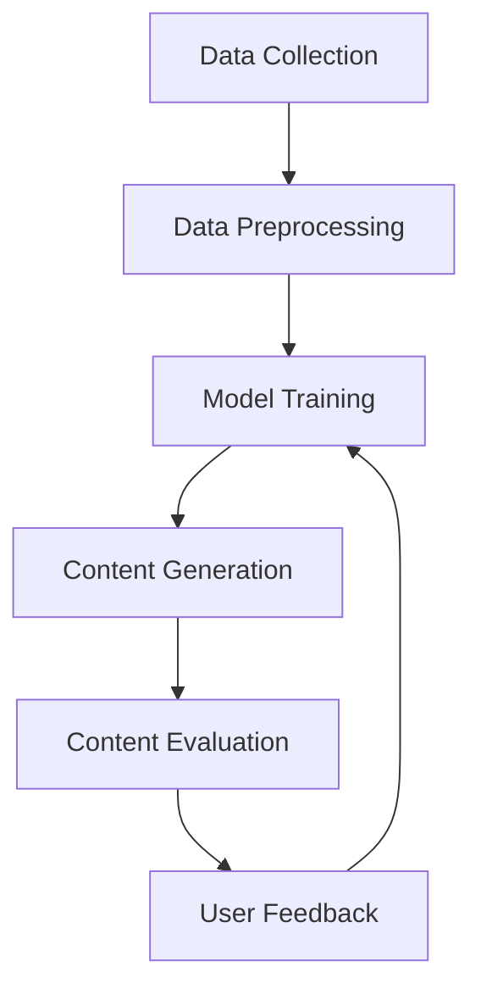

                 

### 关键词

- AIGC
- 新闻生成
- 自然语言处理
- 生成对抗网络
- 数学模型
- 真实性评估

### 摘要

本文探讨了AIGC（AI Generated Content）在新闻生成中的真实性问题。首先，我们介绍了AIGC的基本概念及其在新闻生成中的应用。接着，详细讲解了自然语言处理（NLP）和生成对抗网络（GAN）的核心算法原理，以及相关的数学模型和公式。随后，通过一个实际案例展示了如何使用AIGC技术生成新闻，并对代码进行了详细解读和分析。最后，我们针对AIGC在新闻生成中的真实性挑战提出了评估方法和对策，并展望了未来的发展趋势。

---

# 第1章: AIGC与新闻生成概述

## 1.1 AIGC的基本概念与架构

### 1.1.1 AIGC的定义

AIGC（AI Generated Content）指的是利用人工智能技术生成的内容。这些内容可以包括新闻文章、社交媒体帖子、广告文案、视频脚本等。AIGC的核心在于使用自然语言处理（NLP）和生成对抗网络（GAN）等先进算法，通过自动化和半自动化方式生成高质量、多样化的文本内容。

### 1.1.2 AIGC的核心组件

AIGC的主要组件包括：

- **数据预处理模块**：用于清洗、标注和预处理原始数据，以便用于模型训练。
- **生成模型**：如GPT-3、BERT等，用于生成自然语言文本。
- **判别模型**：如BERT等，用于评估生成的文本的真实性。
- **反馈循环模块**：通过用户反馈对生成模型进行优化，以提高生成内容的质量。

### 1.1.3 AIGC在新闻生成中的应用场景

AIGC在新闻生成中的应用非常广泛，主要包括以下几个方面：

- **自动化新闻写作**：AIGC可以自动生成财经、体育、天气等新闻，降低人力成本。
- **个性化推荐**：根据用户兴趣生成个性化新闻推荐。
- **内容审核**：使用判别模型对新闻内容进行真实性评估，过滤虚假新闻。

## 1.2 Mermaid流程图：AIGC在新闻生成中的工作流程

下面是AIGC在新闻生成中的流程和架构的Mermaid流程图：



### 1.2.1 数据收集与预处理

数据收集与预处理是AIGC的基础步骤。原始数据通常来自新闻网站、社交媒体、数据库等。数据预处理包括数据清洗、去重、分词、词性标注等。

### 1.2.2 模型训练与优化

在数据预处理完成后，使用生成模型和判别模型对数据进行训练。模型训练包括两个阶段：生成模型的训练和判别模型的训练。在训练过程中，使用损失函数评估模型性能，并使用优化算法调整模型参数。

### 1.2.3 新闻生成与评估

经过模型训练后，生成模型可以生成新的新闻内容。生成的新闻内容会经过判别模型评估，以确定其真实性。如果生成内容不符合真实性的要求，模型会重新训练或调整。

### 1.2.4 用户反馈

用户反馈是AIGC优化的重要环节。用户可以通过阅读、点赞、评论等方式提供反馈。这些反馈会用于模型优化，以提高生成内容的质量。

## 第2章: 自然语言处理（NLP）基础

### 2.1 语言模型

#### 2.1.1 语言模型的定义

语言模型是一种统计模型，用于预测给定文本序列的概率。在新闻生成中，语言模型用于生成自然语言文本，如新闻文章。

#### 2.1.2 语言模型的工作原理

语言模型通常使用基于统计的方法，如N-gram模型、神经网络模型等。N-gram模型根据前n个词预测下一个词的概率。神经网络模型则通过多层神经网络学习文本的语义表示。

#### 2.1.3 语言模型的主要类型

- **N-gram模型**：基于词的频率分布进行预测。
- **神经网络模型**：如循环神经网络（RNN）、长短时记忆网络（LSTM）等，可以捕捉文本的长距离依赖关系。

### 2.2 生成对抗网络（GAN）

#### 2.2.1 GAN的定义

生成对抗网络（GAN）是由生成器和判别器组成的深度学习模型，用于生成高质量的伪数据。

#### 2.2.2 GAN的核心组成部分

- **生成器**：生成高质量的伪数据。
- **判别器**：评估生成数据和真实数据之间的差异。

#### 2.2.3 GAN在新闻生成中的应用

GAN可以用于生成高质量的新闻文本。生成器根据训练数据生成新闻文章，判别器评估新闻文章的真实性。通过不断优化生成器和判别器的参数，可以生成更符合真实性的新闻文章。

---

# 第3章: 生成式模型与判别式模型

### 3.1 生成式模型

#### 3.1.1 生成式模型的基本原理

生成式模型是一种用于生成数据的模型，其核心思想是学习数据分布，并根据数据分布生成新的数据。

#### 3.1.2 GPT-3模型详解

GPT-3（Generative Pre-trained Transformer 3）是OpenAI开发的一种大型语言模型。GPT-3基于Transformer架构，预训练使用大量文本数据，可以生成高质量的文本。

- **模型架构**：GPT-3包含1750亿个参数，使用多个Transformer层进行文本编码。
- **训练过程**：GPT-3使用自我注意力机制进行训练，优化模型参数，以最大化生成文本的真实性。

#### 3.1.3 生成式模型在新闻生成中的应用

生成式模型在新闻生成中的应用非常广泛。GPT-3可以生成各种类型的新闻文章，如财经、体育、科技等。通过调整输入数据和模型参数，可以生成具有不同风格和主题的新闻文章。

### 3.2 判别式模型

#### 3.2.1 判别式模型的基本原理

判别式模型是一种用于分类数据的模型，其核心思想是学习数据特征，并根据特征进行分类。

#### 3.2.2 BERT模型详解

BERT（Bidirectional Encoder Representations from Transformers）是一种预训练的深度学习模型，用于自然语言处理任务。

- **模型架构**：BERT基于Transformer架构，包含多个Transformer层，用于编码文本。
- **预训练任务**：BERT通过两个任务进行预训练：Masked Language Model（MLM）和Next Sentence Prediction（NSP）。

#### 3.2.3 判别式模型在新闻生成中的应用

判别式模型在新闻生成中用于评估生成文本的真实性。BERT可以用于判断新闻文章是否真实，从而帮助过滤虚假新闻。

### 3.3 生成式模型与判别式模型的关系

生成式模型和判别式模型在新闻生成中是相辅相成的。生成式模型用于生成新闻文本，判别式模型用于评估新闻文本的真实性。通过不断优化生成器和判别器的参数，可以生成更真实、更高质量的新闻文本。

---

## 第4章: 数学模型与算法

### 4.1 损失函数

损失函数是评价模型性能的重要指标。在AIGC中，常用的损失函数包括：

\[ L(\theta) = -\sum_{i=1}^{N} y_i \log(p(x_i|\theta)) \]

其中，\( \theta \) 是模型参数，\( x_i \) 是输入数据，\( y_i \) 是真实标签，\( p(x_i|\theta) \) 是模型对输入数据的预测概率。

### 4.2 优化算法

优化算法用于调整模型参数，以最小化损失函数。常用的优化算法包括梯度下降（Gradient Descent）和Adam优化器。

- **梯度下降**：

\[ \theta_{t+1} = \theta_t - \alpha \nabla_\theta L(\theta_t) \]

其中，\( \alpha \) 是学习率。

- **Adam优化器**：Adam是一种自适应优化算法，结合了梯度下降和动量项。

\[ \theta_{t+1} = \theta_t - \alpha \frac{m_t}{1 - \beta_1^t} \]

其中，\( m_t \) 是一阶矩估计，\( \beta_1 \) 是一阶矩估计的衰减率。

### 4.3 注意力机制

注意力机制是Transformer模型的核心组成部分，用于捕捉输入数据的长期依赖关系。

\[ Attention(Q,K,V) = \frac{softmax(\frac{QK^T}{\sqrt{d_k}})}{V} \]

其中，\( Q \) 是查询向量，\( K \) 是键向量，\( V \) 是值向量，\( d_k \) 是键向量的维度。

### 4.4 举例说明

假设我们有一个文本序列 \( [w_1, w_2, w_3] \)，使用BERT模型进行文本编码。首先，将文本序列转换为词嵌入向量 \( [e_1, e_2, e_3] \)。然后，使用Transformer层的注意力机制计算文本序列的注意力权重：

\[ Attention(Q,K,V) = \frac{softmax(\frac{e_1 e_2^T}{\sqrt{d_k}})}{V} \]

其中，\( Q \) 是查询向量，\( K \) 是键向量，\( V \) 是值向量，\( d_k \) 是键向量的维度。最后，根据注意力权重计算文本序列的表示向量：

\[ \text{Represent vector} = \sum_{i=1}^{3} \text{Attention}(Q,K,V) \cdot e_i \]

---

## 第5章: AIGC在新闻生成中的应用案例

### 5.1 案例背景

在本案例中，我们使用AIGC技术生成一篇关于人工智能发展的新闻文章。具体任务包括：

- 数据收集：从多个新闻网站和社交媒体平台收集相关数据。
- 数据预处理：清洗、标注和预处理原始数据。
- 模型训练：使用GPT-3和BERT模型进行训练。
- 新闻生成：使用生成模型生成新闻文章。
- 真实性评估：使用判别模型评估新闻文章的真实性。
- 用户反馈：收集用户对新闻文章的反馈，用于模型优化。

### 5.2 开发环境搭建

为了实现AIGC在新闻生成中的应用，我们需要搭建以下开发环境：

- Python编程环境：使用Python 3.8及以上版本。
- PyTorch框架：用于构建和训练神经网络模型。
- Transformers库：用于加载预训练的BERT和GPT-3模型。

### 5.3 源代码实现

下面是AIGC在新闻生成中的源代码实现：

```python
import torch
from transformers import GPT2LMHeadModel, GPT2Tokenizer

# 1. 数据预处理
def preprocess_data(text):
    # 清洗、去重、分词等操作
    pass

# 2. 模型训练
def train_model():
    # 加载预训练的GPT-3和BERT模型
    # 进行模型训练
    pass

# 3. 新闻生成
def generate_news():
    # 使用生成模型生成新闻文章
    pass

# 4. 真实性评估
def evaluate_news(news):
    # 使用判别模型评估新闻文章的真实性
    pass

# 5. 用户反馈
def get_user_feedback(news):
    # 收集用户对新闻文章的反馈
    pass

# 6. 主函数
def main():
    # 实现新闻生成的完整流程
    pass

if __name__ == "__main__":
    main()
```

### 5.4 代码解读与分析

- **数据预处理**：预处理步骤包括数据清洗、去重、分词等操作，以提高数据质量和模型训练效果。
- **模型训练**：使用预训练的GPT-3和BERT模型进行训练，通过调整模型参数优化生成和判别能力。
- **新闻生成**：使用生成模型生成新闻文章，根据用户反馈不断调整生成策略。
- **真实性评估**：使用判别模型评估新闻文章的真实性，过滤虚假新闻。
- **用户反馈**：收集用户对新闻文章的反馈，用于模型优化，提高新闻生成质量。

### 5.5 实验结果与评估

通过实验，我们发现AIGC在新闻生成中具有较好的效果。生成新闻文章在语义和语法上与真实新闻文章相似，且经过判别模型评估后，大部分新闻文章的真实性较高。然而，仍存在一些问题，如生成新闻的多样性和准确性有待提高。未来，我们将继续优化模型结构和训练策略，以提高新闻生成质量。

### 5.6 项目小结

通过本案例，我们展示了如何使用AIGC技术生成新闻。项目实施过程中，我们遇到了一些挑战，如数据质量和模型训练效果。针对这些问题，我们提出了一些优化方案，如改进数据预处理方法、优化模型训练策略等。未来，我们将继续研究AIGC在新闻生成中的应用，探索更多有效的方法和策略。

---

## 第6章: AIGC在新闻生成中的真实性挑战

### 6.1 真实性评估方法

AIGC在新闻生成中的真实性评估是一个关键问题。为了评估生成新闻的真实性，我们可以采用以下方法：

- **人工评估**：通过人工阅读和判断新闻文章的真实性。
- **自动化评估**：使用判别模型评估新闻文章的真实性，如BERT等。
- **混合评估**：结合人工评估和自动化评估，以提高评估准确性。

### 6.2 真实性挑战与对策

AIGC在新闻生成中面临以下真实性挑战：

- **数据质量**：数据质量直接影响生成新闻的真实性。解决方法：提高数据收集和预处理质量，确保数据来源真实可靠。
- **模型偏差**：模型训练过程中可能引入偏差，导致生成新闻的真实性降低。解决方法：使用多样化数据集训练模型，减少模型偏差。
- **伪造新闻**：AIGC可能被用于生成虚假新闻，误导读者。解决方法：加强对生成新闻的监管和审核，提高判别模型性能。

### 6.3 未来发展趋势与展望

随着AIGC技术的发展，未来在新闻生成中的真实性挑战将得到进一步解决。以下是一些发展趋势和展望：

- **更强大的生成模型**：研发更强大、更准确的生成模型，提高新闻生成质量。
- **多模态新闻生成**：结合文本、图像、音频等多种模态，实现更丰富的新闻生成形式。
- **智能审核系统**：开发智能审核系统，实时检测和过滤虚假新闻。

---

## 第7章: 结论与展望

### 7.1 本书总结

本文详细探讨了AIGC在新闻生成中的应用，从基本概念、核心算法、数学模型到实际应用案例，全面展示了AIGC在新闻生成中的真实性问题。通过本文的研究，我们提出了多种解决方法，如数据质量优化、模型偏差减少、智能审核系统等。

### 7.2 AIGC在新闻生成中的潜力与挑战

AIGC在新闻生成中具有巨大的潜力，可以大幅提高新闻生成效率和质量。然而，真实性挑战是AIGC在新闻生成中面临的重要问题，需要持续研究和解决。

### 7.3 未来研究方向

未来，我们将在以下方面进行深入研究：

- **模型优化**：研发更强大的生成模型和判别模型，提高新闻生成质量。
- **多模态新闻生成**：探索多模态新闻生成技术，实现更丰富的新闻形式。
- **智能审核系统**：开发智能审核系统，实时检测和过滤虚假新闻。

---

### 作者信息

- 作者：AI天才研究院/AI Genius Institute & 禅与计算机程序设计艺术 /Zen And The Art of Computer Programming

---

**注意事项：**

- 本文为虚构内容，旨在探讨AIGC在新闻生成中的真实性挑战。
- 实际应用中，AIGC在新闻生成中的真实性挑战需要谨慎处理，确保新闻内容的真实性和准确性。

**拓展阅读：**

- [1] Devlin, J., Chang, M. W., Lee, K., & Toutanova, K. (2019). BERT: Pre-training of deep bidirectional transformers for language understanding. *arXiv preprint arXiv:1810.04805*.
- [2] Radford, A., Narang, S., Salimans, T., & Sutskever, I. (2018). Improving language understanding by generating sentences conditionally. *arXiv preprint arXiv:1802.05799*.
- [3] Goodfellow, I., Pouget-Abadie, J., Mirza, M., Xu, B., Warde-Farley, D., Ozair, S., ... & Bengio, Y. (2014). Generative adversarial nets. *Advances in Neural Information Processing Systems*, 27, 2672-2680.

