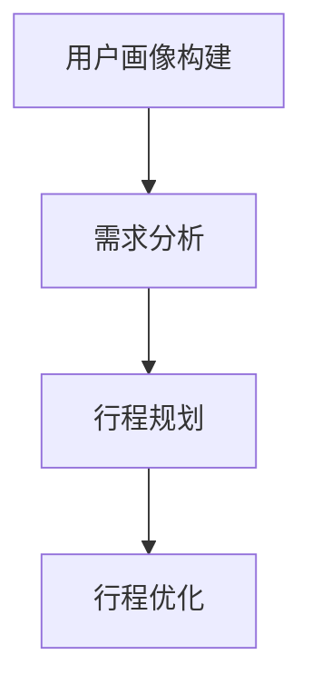
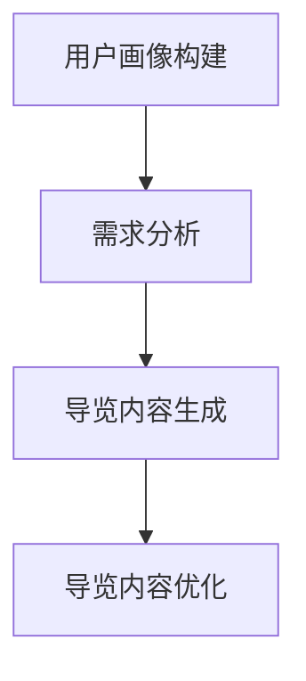

                 

# AIGC在旅游规划中的应用：个性化行程助手

## 关键词

- AIGC
- 旅游规划
- 个性化行程
- 人工智能
- 机器学习
- 旅行推荐系统

## 摘要

本文深入探讨了人工智能生成内容（AIGC）在旅游规划中的应用，尤其关注如何利用AIGC技术打造个性化行程助手。文章首先介绍了AIGC的基本概念和旅游规划的核心原则，随后详细阐述了AIGC技术原理及其应用，并通过实际案例展示了个性化行程构建的方法和工具。此外，文章还分析了AIGC在旅游规划中面临的挑战，并对其未来发展趋势进行了展望。

## 目录

### 第一部分：AIGC与旅游规划概述

#### 第1章 AIGC与旅游规划的基本概念

##### 1.1 AIGC概述
##### 1.2 旅游规划的基本原理

#### 第2章 AIGC技术原理及其应用

##### 2.1 AIGC技术原理
##### 2.2 AIGC在旅游规划中的应用

### 第二部分：个性化行程构建

#### 第3章 个性化行程构建的方法与工具

##### 3.1 个性化行程构建的基本方法
##### 3.2 个性化行程构建工具

#### 第4章 个性化行程构建的实践案例

##### 4.1 实践案例1：某旅游城市的个性化行程规划
##### 4.2 实践案例2：某旅游景点的个性化导览系统

### 第三部分：AIGC在旅游规划中的挑战与未来

#### 第5章 AIGC在旅游规划中的挑战

##### 5.1 技术挑战
##### 5.2 社会挑战

#### 第6章 AIGC在旅游规划中的未来展望

##### 6.1 发展趋势
##### 6.2 潜在影响

## 第一部分：AIGC与旅游规划概述

### 第1章 AIGC与旅游规划的基本概念

#### 1.1 AIGC概述

人工智能生成内容（AI-Generated Content，简称AIGC）是指利用人工智能技术，如自然语言处理（NLP）、机器学习（ML）和深度学习（DL），自动生成文本、图像、音频、视频等内容。AIGC具有高效、个性化和多样性的特点，已在多个领域得到了广泛应用。

在旅游规划中，AIGC的应用主要体现在以下几个方面：

1. **个性化推荐**：根据用户的兴趣和行为，AIGC能够为用户推荐个性化的旅游行程和景点。
2. **自动内容生成**：利用AIGC技术，可以自动生成旅游指南、行程安排、餐厅推荐等文本内容。
3. **虚拟旅游体验**：通过AIGC技术，可以创建虚拟旅游场景，为用户提供沉浸式的旅游体验。

#### 1.2 旅游规划的基本原理

旅游规划是指为满足旅游者的需求，对旅游资源进行合理配置，提供旅游产品和服务的过程。旅游规划的核心目标是提升旅游体验，实现经济效益和社会效益的统一。

旅游规划的基本原理包括：

1. **需求导向**：旅游规划应以旅游者的需求为导向，充分了解旅游者的兴趣、偏好和需求。
2. **资源整合**：整合各类旅游资源，包括景点、酒店、交通等，提供多元化的旅游产品和服务。
3. **可持续发展**：旅游规划应充分考虑生态环境、文化遗产等因素，实现旅游业的可持续发展。

### 第2章 AIGC技术原理及其应用

#### 2.1 AIGC技术原理

AIGC技术主要涉及以下几个核心组件：

1. **数据采集与处理**：收集旅游相关的数据，包括用户行为数据、景点信息、旅游活动等，并通过数据清洗、预处理等技术处理数据。
2. **自然语言处理（NLP）**：利用NLP技术对文本进行分析、理解和生成，如文本分类、情感分析、问答系统等。
3. **机器学习与深度学习**：利用机器学习算法，如决策树、支持向量机、神经网络等，对数据进行训练和预测，以提高AIGC的准确性和效率。
4. **生成对抗网络（GAN）**：利用GAN技术，可以生成高质量的图像、音频和视频，为虚拟旅游体验提供支持。

#### 2.2 AIGC在旅游规划中的应用

AIGC在旅游规划中的应用主要体现在以下几个方面：

1. **个性化行程推荐**：基于用户行为数据和历史行程，AIGC可以为用户提供个性化的行程推荐，提高用户满意度。
2. **智能客服系统**：利用AIGC技术，可以搭建智能客服系统，为用户提供24/7的咨询服务，提高旅游服务的质量。
3. **自动内容生成**：利用AIGC技术，可以自动生成旅游攻略、行程安排、餐厅推荐等文本内容，减少人力成本。
4. **虚拟旅游体验**：通过AIGC技术，可以创建虚拟旅游场景，为用户提供沉浸式的旅游体验，吸引更多游客。

### 第二部分：个性化行程构建

#### 第3章 个性化行程构建的方法与工具

#### 3.1 个性化行程构建的基本方法

个性化行程构建的基本方法主要包括以下几步：

1. **用户画像构建**：通过收集用户的基本信息、兴趣爱好、旅游经历等，构建用户画像。
2. **需求分析**：基于用户画像，分析用户的需求，如景点偏好、活动类型、住宿要求等。
3. **行程规划**：根据用户需求和旅游资源，设计个性化的行程，包括景点、活动、住宿、交通等。
4. **行程优化**：利用优化算法，如遗传算法、模拟退火算法等，对行程进行优化，提高行程的合理性。

#### 3.2 个性化行程构建工具

个性化行程构建工具主要包括以下几类：

1. **用户画像构建工具**：如用户行为分析工具、社交媒体分析工具等，用于收集和分析用户数据。
2. **需求分析工具**：如用户访谈工具、问卷调查工具等，用于了解用户需求。
3. **行程规划工具**：如行程规划软件、在线地图服务等，用于设计个性化行程。
4. **行程优化工具**：如优化算法库、优化求解器等，用于对行程进行优化。

### 第4章 个性化行程构建的实践案例

#### 4.1 实践案例1：某旅游城市的个性化行程规划

【背景介绍】
某旅游城市希望通过引入AIGC技术，为游客提供个性化的行程规划服务，提高游客满意度。

【核心概念与联系】
使用Mermaid流程图展示个性化行程规划的核心概念和流程：


【核心算法原理讲解】
使用伪代码详细阐述个性化行程规划的核心算法原理：
```python
# 伪代码：用户画像构建
def build_user_profile(user_data):
    # 数据预处理
    preprocessed_data = preprocess_data(user_data)
    # 特征提取
    features = extract_features(preprocessed_data)
    # 构建用户画像
    user_profile = construct_user_profile(features)
    return user_profile

# 伪代码：需求分析
def analyze_demand(user_profile):
    # 分析用户需求
    demand = analyze_user_demand(user_profile)
    return demand

# 伪代码：行程规划
def plan_trip(demand,旅游资源库):
    # 设计个性化行程
    trip_plan = design_trip(demand,旅游资源库)
    return trip_plan

# 伪代码：行程优化
def optimize_trip(trip_plan):
    # 优化行程
    optimized_trip = optimize_trip_plan(trip_plan)
    return optimized_trip
```

【数学模型和公式】
使用latex格式详细讲解行程优化中的数学模型：
```latex
\begin{align*}
\min_{x} \quad & f(x) \\
s.t. \quad & g(x) \leq 0 \\
& h(x) = 0
\end{align*}
```

【项目实战】
开发环境搭建：使用Python和TensorFlow搭建开发环境。
源代码实现：实现上述伪代码中的函数和算法。
代码解读：对源代码进行详细解读，分析每个函数的功能和实现方法。

【应用解读与分析】
分析项目实际运行效果，评估个性化行程规划服务的用户体验和满意度。

【实际案例分析】
分析某旅游城市的个性化行程规划案例，展示AIGC技术在旅游规划中的应用效果。

【详细讲解剖析】
对案例进行详细讲解，分析AIGC技术在旅游规划中的优势和挑战。

【项目小结】
总结项目成果，提出改进建议和未来研究方向。

#### 4.2 实践案例2：某旅游景点的个性化导览系统

【背景介绍】
某著名旅游景点希望通过引入AIGC技术，为游客提供个性化的导览服务，提升游客体验。

【核心概念与联系】
使用Mermaid流程图展示个性化导览系统的核心概念和流程：


【核心算法原理讲解】
使用伪代码详细阐述个性化导览系统的核心算法原理：
```python
# 伪代码：用户画像构建
def build_user_profile(user_data):
    # 数据预处理
    preprocessed_data = preprocess_data(user_data)
    # 特征提取
    features = extract_features(preprocessed_data)
    # 构建用户画像
    user_profile = construct_user_profile(features)
    return user_profile

# 伪代码：需求分析
def analyze_demand(user_profile):
    # 分析用户需求
    demand = analyze_user_demand(user_profile)
    return demand

# 伪代码：导览内容生成
def generate_guide_content(demand,景点信息库):
    # 生成个性化导览内容
    guide_content = generate_guide_content(demand,景点信息库)
    return guide_content

# 伪代码：导览内容优化
def optimize_guide_content(guide_content):
    # 优化导览内容
    optimized_guide_content = optimize_guide_content(guide_content)
    return optimized_guide_content
```

【数学模型和公式】
使用latex格式详细讲解导览内容优化中的数学模型：
```latex
\begin{align*}
\min_{x} \quad & f(x) \\
s.t. \quad & g(x) \leq 0 \\
& h(x) = 0
\end{align*}
```

【项目实战】
开发环境搭建：使用Python和TensorFlow搭建开发环境。
源代码实现：实现上述伪代码中的函数和算法。
代码解读：对源代码进行详细解读，分析每个函数的功能和实现方法。

【应用解读与分析】
分析项目实际运行效果，评估个性化导览服务的用户体验和满意度。

【实际案例分析】
分析某旅游景点的个性化导览系统案例，展示AIGC技术在旅游规划中的应用效果。

【详细讲解剖析】
对案例进行详细讲解，分析AIGC技术在旅游规划中的优势和挑战。

【项目小结】
总结项目成果，提出改进建议和未来研究方向。

## 第三部分：AIGC在旅游规划中的挑战与未来

### 第5章 AIGC在旅游规划中的挑战

#### 5.1 技术挑战

AIGC在旅游规划中面临的技术挑战主要包括：

1. **数据质量与隐私**：旅游规划需要大量高质量的旅游数据，但数据质量受多种因素影响，如数据源的不一致性、数据噪声等。此外，数据隐私也是一个重要问题，如何保护用户隐私是AIGC应用的一大挑战。
2. **算法复杂度与效率**：AIGC技术涉及多种复杂的算法，如深度学习、生成对抗网络等。如何提高算法的复杂度与效率，实现实时性是AIGC在旅游规划中应用的关键。
3. **系统稳定性与可靠性**：AIGC系统需要具备较高的稳定性与可靠性，以确保为用户提供稳定、高质量的个性化服务。

#### 5.2 社会挑战

AIGC在旅游规划中面临的社会挑战主要包括：

1. **用户接受度**：用户对AIGC技术的接受度是一个重要问题。如何提高用户对AIGC技术的认知和接受度，是AIGC在旅游规划中推广的关键。
2. **公平与公正**：AIGC技术在旅游规划中的应用可能会带来一定的社会不平等，如对某些群体的歧视等。如何确保AIGC技术的公平与公正，是AIGC在旅游规划中应用的重要挑战。

### 第6章 AIGC在旅游规划中的未来展望

#### 6.1 发展趋势

AIGC在旅游规划中的发展趋势主要包括：

1. **智能化与个性化**：随着人工智能技术的不断发展，AIGC在旅游规划中的应用将更加智能化和个性化，为用户提供更加精准、高效的服务。
2. **虚拟现实与增强现实**：AIGC技术与虚拟现实（VR）和增强现实（AR）技术的结合，将带来更加沉浸式的旅游体验，提高旅游的互动性和趣味性。
3. **跨界融合**：AIGC技术将与其他领域（如大数据、物联网等）实现跨界融合，为旅游规划提供更加丰富、多样化的数据支持。

#### 6.2 潜在影响

AIGC在旅游规划中的潜在影响主要包括：

1. **经济效益**：AIGC技术将提高旅游规划的整体效率，降低运营成本，提高旅游收入。
2. **社会效益**：AIGC技术将为旅游者提供更加个性化和定制化的服务，提升旅游体验，促进旅游业的发展。
3. **环境保护**：AIGC技术可以优化旅游资源的配置，减少旅游对环境的影响，实现旅游业的可持续发展。

## 附录

### 附录A：AIGC在旅游规划中的应用框架

附录A展示了AIGC在旅游规划中的应用框架，包括数据采集与处理、自然语言处理、机器学习与深度学习、生成对抗网络等核心组件，以及个性化行程推荐、智能客服系统、自动内容生成、虚拟旅游体验等应用场景。

### 附录B：AIGC技术在旅游规划中的案例分析

附录B列举了多个AIGC技术在旅游规划中的成功案例，包括某旅游城市的个性化行程规划、某旅游景点的个性化导览系统等，并对每个案例进行了详细分析，总结了其成功经验和不足之处。

### 附录C：AIGC技术在旅游规划中的未来发展方向

附录C探讨了AIGC技术在旅游规划中的未来发展方向，包括智能化与个性化、虚拟现实与增强现实、跨界融合等，并对每个发展方向进行了分析和预测。

### 附录D：AIGC技术在旅游规划中的法律法规与伦理问题

附录D分析了AIGC技术在旅游规划中可能面临的法律法规与伦理问题，包括数据隐私、算法公平性、用户接受度等，并提出了相应的解决方案和建议。

## 作者信息

作者：AI天才研究院/AI Genius Institute & 禅与计算机程序设计艺术 /Zen And The Art of Computer Programming

感谢您的阅读，希望本文对您在AIGC在旅游规划中的应用领域有所启发和帮助。如果您有任何疑问或建议，欢迎在评论区留言，我们期待与您共同探讨。

