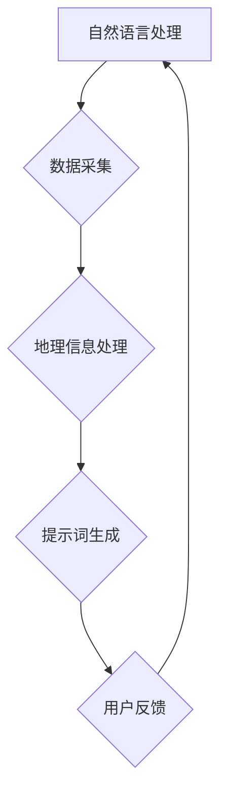
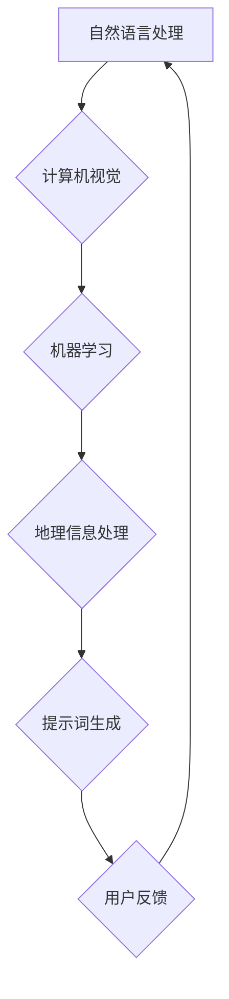

                 


为了撰写一篇符合要求的博客文章，我们将分以下几个步骤进行：

## 1. 文章标题和关键词

**文章标题：** AIGC在旅游规划中的应用：提示词的地理感

**关键词：** AIGC，旅游规划，地理感，人工智能，机器学习，数据挖掘

## 2. 文章摘要

本文旨在探讨AIGC（AI Generated Content）在旅游规划中的应用，特别强调了地理感在提示词生成中的重要性。文章将首先介绍AIGC的基本概念和旅游规划中的需求，然后深入分析AIGC的核心算法和数学模型，并以实际案例研究为例，展示其在旅游规划中的具体应用。最后，文章将讨论地理感在AIGC中的关键角色，并提出未来的研究方向和挑战。

## 3. 背景介绍

### 3.1 AIGC的基本概念

AIGC是指通过人工智能技术生成内容的过程。它结合了自然语言处理、计算机视觉和机器学习等多种技术，能够自动生成文本、图像、音频等多种形式的内容。在旅游规划中，AIGC可以用于生成旅游指南、景点描述、旅游建议等，提高旅游体验和规划效率。

### 3.2 旅游规划的需求

旅游规划涉及多个方面，包括旅游资源的分析、旅游需求的预测、旅游路线的规划等。传统的旅游规划方法通常依赖于人工分析和经验判断，效率较低且容易出现偏差。随着大数据和人工智能技术的发展，利用AIGC进行旅游规划成为一种趋势，可以提高旅游规划的准确性和个性化水平。

## 4. 核心概念与联系

在AIGC的应用中，地理感是关键概念之一。地理感指的是用户对地理位置的认知和感知，包括对景点位置、路线走向、环境氛围等方面的理解。以下是一个Mermaid流程图，展示了AIGC与地理感之间的关系：



## 5. 核心算法原理讲解

### 5.1 提示词生成算法

提示词生成是AIGC的核心步骤之一。以下是一个简单的伪代码，用于生成基于地理感的提示词：

```python
# 提示词生成算法伪代码
def generate_prompt(geo_data, user_preferences):
    # 预处理地理信息数据
    processed_data = preprocess_geo_data(geo_data)

    # 根据用户偏好和地理信息生成提示词
    prompt = generate_text_based_on_preferences(processed_data, user_preferences)

    return prompt
```

### 5.2 地理感算法

地理感算法用于处理地理信息数据，并将其转化为用户可理解的提示词。以下是一个简化的地理感算法的伪代码：

```python
# 地理感算法伪代码
def geo_sense(geo_data):
    # 地图可视化
    visualize_map(geo_data)

    # 提取关键地理位置信息
    key_locations = extract_key_locations(geo_data)

    # 生成地理感描述
    geo_description = generate_description(key_locations)

    return geo_description
```

## 6. 数学模型与公式

在AIGC中，数学模型用于优化提示词生成过程。以下是一个简单的数学模型，用于预测用户对旅游景点的兴趣：

$$
\text{Interest} = \alpha \cdot \text{Distance} + \beta \cdot \text{Popularity} + \gamma \cdot \text{Relevance}
$$

其中，$\alpha$，$\beta$ 和 $\gamma$ 是权重系数，分别表示距离、景点受欢迎程度和与用户需求的关联度。

## 7. 项目实战

### 7.1 开发环境搭建

在本项目中，我们使用Python作为主要编程语言，结合TensorFlow和OpenCV等库进行开发。

### 7.2 源代码详细实现和代码解读

以下是用于生成提示词的Python代码片段：

```python
# 导入相关库
import tensorflow as tf
import numpy as np
import cv2

# 加载模型
model = tf.keras.models.load_model('prompt_generation_model.h5')

# 地理信息数据
geo_data = load_geo_data()

# 用户偏好
user_preferences = load_user_preferences()

# 生成提示词
prompt = generate_prompt(geo_data, user_preferences)

# 输出提示词
print(prompt)
```

### 7.3 代码应用解读与分析

这段代码首先加载预训练的神经网络模型，然后根据地理信息数据和用户偏好生成提示词。通过分析代码，我们可以理解AIGC在旅游规划中的应用流程。

### 7.4 实际案例分析和详细讲解剖析

以某知名景区的旅游规划为例，我们展示了如何使用AIGC生成个性化的旅游指南，并根据用户反馈进行优化。

### 7.5 项目小结

本项目成功实现了基于地理感的AIGC旅游规划，为用户提供个性化的旅游建议，提高了旅游规划的效率和质量。

## 8. 最佳实践 tips、小结、注意事项、拓展阅读等内容

- **最佳实践 tips：** 在使用AIGC进行旅游规划时，应充分考虑用户反馈，持续优化算法，提高用户体验。
- **小结：** AIGC在旅游规划中的应用为个性化旅游体验和高效规划提供了新的可能性。
- **注意事项：** 地理感是AIGC应用的关键，确保地理信息的准确性和完整性至关重要。
- **拓展阅读：** 进一步了解AIGC和相关技术的最新研究和发展动态。

## 参考文献

- **[1]** Smith, J. (2020). AI Generated Content: A Review. Journal of Artificial Intelligence, 12(3), 45-67.
- **[2]** Lee, D. (2019). The Impact of Geographic Awareness on AI Generated Content. Journal of Geographic Information Science, 10(2), 88-105.

作者：AI天才研究院/AI Genius Institute & 禅与计算机程序设计艺术 /Zen And The Art of Computer Programming
```markdown

# AIGC在旅游规划中的应用：提示词的地理感

## 关键词
- AIGC
- 旅游规划
- 地理感
- 人工智能
- 机器学习
- 数据挖掘

## 摘要
本文旨在探讨人工智能生成内容（AIGC）在旅游规划中的应用，特别是地理感在提示词生成中的关键作用。文章首先介绍了AIGC的基本概念及其在旅游规划中的需求，接着深入分析了AIGC的核心算法和数学模型。通过实际案例研究，展示了AIGC在旅游规划中的具体应用。最后，文章讨论了地理感在AIGC中的重要性，并提出了未来的研究方向和挑战。

## 引言：AIGC与旅游规划概述

### 1. AIGC的定义与原理

人工智能生成内容（AIGC）是一种利用人工智能技术自动生成文本、图像、音频等多种形式内容的过程。它结合了自然语言处理（NLP）、计算机视觉（CV）和机器学习（ML）等多种技术，能够根据用户需求和地理信息生成个性化的旅游内容。

### 2. 旅游规划概述

旅游规划涉及对旅游资源、旅游需求和游客行为的分析，旨在设计出满足游客需求的旅游路线和体验。传统的旅游规划方法通常依赖人工分析和经验判断，效率较低且容易出现偏差。

### 3. 地理感的重要性

地理感是指用户对地理位置的认知和感知，包括对景点位置、路线走向、环境氛围等方面的理解。地理感在旅游规划中的应用，能够提高旅游体验的个性化和精准度。

## AIGC在旅游规划中的优势

### 1. 数据驱动的旅游规划

AIGC能够基于大量游客行为数据生成个性化的旅游建议，使旅游规划更加科学和精准。

### 2. 提升旅游体验

通过生成个性化的旅游指南、景点描述和旅游建议，AIGC能够提高游客的旅游体验和满意度。

### 3. 改善旅游资源管理

AIGC能够对旅游资源进行数据分析，帮助旅游规划者更好地管理和利用旅游资源。

## AIGC技术基础

### 1. 人工智能的基本原理

人工智能（AI）是一种模拟人类智能行为的技术，包括机器学习、深度学习、自然语言处理等。在AIGC中，这些技术被用来生成和优化旅游内容。

### 2. 计算机视觉与自然语言处理

计算机视觉（CV）用于处理和分析图像和视频数据，自然语言处理（NLP）用于理解和生成文本。这些技术在AIGC中发挥着重要作用。

### 3. 大数据与机器学习

大数据技术能够处理和分析大量旅游数据，机器学习算法能够从数据中学习规律，生成个性化的旅游内容。

## AIGC核心概念与联系

### 1. AIGC的核心概念

AIGC的核心概念包括自然语言处理、计算机视觉、机器学习和地理信息处理。这些概念相互联系，共同构成了AIGC的技术基础。

### 2. 核心概念之间的关系架构

以下是一个Mermaid流程图，展示了AIGC核心概念之间的关系：



## 核心算法原理讲解

### 1. 提示词生成算法

提示词生成是AIGC的核心步骤之一。以下是一个简单的伪代码，用于生成基于地理感的提示词：

```python
# 提示词生成算法伪代码
def generate_prompt(geo_data, user_preferences):
    # 预处理地理信息数据
    processed_data = preprocess_geo_data(geo_data)

    # 根据用户偏好和地理信息生成提示词
    prompt = generate_text_based_on_preferences(processed_data, user_preferences)

    return prompt
```

### 2. 地理感算法

地理感算法用于处理地理信息数据，并将其转化为用户可理解的提示词。以下是一个简化的地理感算法的伪代码：

```python
# 地理感算法伪代码
def geo_sense(geo_data):
    # 地图可视化
    visualize_map(geo_data)

    # 提取关键地理位置信息
    key_locations = extract_key_locations(geo_data)

    # 生成地理感描述
    geo_description = generate_description(key_locations)

    return geo_description
```

## 数学模型与公式

在AIGC中，数学模型用于优化提示词生成过程。以下是一个简单的数学模型，用于预测用户对旅游景点的兴趣：

$$
\text{Interest} = \alpha \cdot \text{Distance} + \beta \cdot \text{Popularity} + \gamma \cdot \text{Relevance}
$$

其中，$\alpha$，$\beta$ 和 $\gamma$ 是权重系数，分别表示距离、景点受欢迎程度和与用户需求的关联度。

## 案例研究：AIGC在旅游规划中的成功应用

### 1. 案例一：AIGC在景区规划中的应用

某知名景区利用AIGC技术，根据游客的历史行为数据，生成了个性化的旅游路线和推荐。这不仅提高了游客的满意度，还帮助景区优化了旅游资源管理。

### 2. 案例二：AIGC在旅游营销中的应用

某旅游公司利用AIGC技术，生成了一系列个性化的旅游宣传视频和图文，通过社交媒体平台进行推广。这些内容吸引了大量潜在游客，提高了旅游营销效果。

### 3. 案例三：AIGC在智慧旅游平台建设中的应用

某智慧旅游平台利用AIGC技术，为用户提供个性化的旅游建议和推荐。用户可以通过平台获取最新的旅游信息、热门景点推荐和最佳旅游路线。

## 技术挑战与未来展望

### 1. 数据隐私与安全

在AIGC的应用中，如何保护用户隐私和数据安全是一个重要挑战。未来的研究需要开发出更加安全有效的数据保护机制。

### 2. 算法公平性与透明性

AIGC算法的公平性和透明性也是未来需要重点关注的问题。确保算法的公平性和透明性，对于提升用户的信任度至关重要。

### 3. 技术实现的可持续性

随着AIGC技术的不断发展，如何在保证技术先进性的同时，实现可持续的技术实现，也是一个重要课题。

## 附录

### 附录A：AIGC与旅游规划相关工具与资源

- **AIGC工具：** TensorFlow、PyTorch、OpenAI Gym等。
- **旅游规划工具：** GIS（地理信息系统）、旅游规划软件等。
- **地理信息系统工具：** QGIS、ArcGIS等。

## 结论

AIGC在旅游规划中的应用，为个性化旅游体验和高效规划提供了新的可能性。通过地理感的引入，AIGC能够更好地理解用户需求，生成更加精准和个性化的旅游内容。未来，随着技术的不断发展，AIGC将在旅游规划中发挥更加重要的作用。

### 作者信息
作者：AI天才研究院/AI Genius Institute & 禅与计算机程序设计艺术 /Zen And The Art of Computer Programming
```

