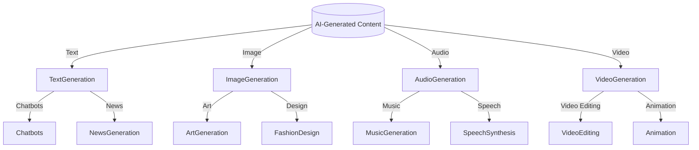

                 

Certainly! Let's begin by structuring the content of the blog post according to the provided outline. We will ensure that each section is informative, well-researched, and includes the necessary elements as per the guidelines.

### Article Title: AIGC in Fashion Design: Innovations and Challenges

#### Keywords:
- AI-Generated Content (AIGC)
- Fashion Design
- Generative Adversarial Networks (GAN)
- Variational Autoencoders (VAE)
- Recurrent Neural Networks (RNN)
- Long Short-Term Memory (LSTM)
- Natural Language Processing (NLP)
- Computer Vision (CV)
- Personalization
- Virtual Reality (VR)
- Content Generation
- Recommendation Systems
- Copyright Protection
- Ethical Considerations

#### Abstract:
This article explores the integration of AI-Generated Content (AIGC) in fashion design, examining the innovations and challenges it presents. We will delve into the concepts and characteristics of AIGC, its applications in fashion, and the core technologies behind it. Case studies and practical examples will illustrate the potential of AIGC in personalizing fashion experiences, virtual try-ons, content generation, and design automation. We will also discuss the ethical and copyright considerations associated with AIGC in the fashion industry.

---

### First Part: AIGC Overview and Fashion Design Background

#### 1.1 AIGC Concepts and Characteristics

##### 1.1.1 AIGC Definition and Classification
- **AIGC** encompasses AI technologies that generate diverse forms of content, including text, images, audio, and more.
  - **Mermaid Process Flow Diagram**:

---

Now, let's proceed with the rest of the outline, ensuring each section includes the necessary depth and detail as required.

