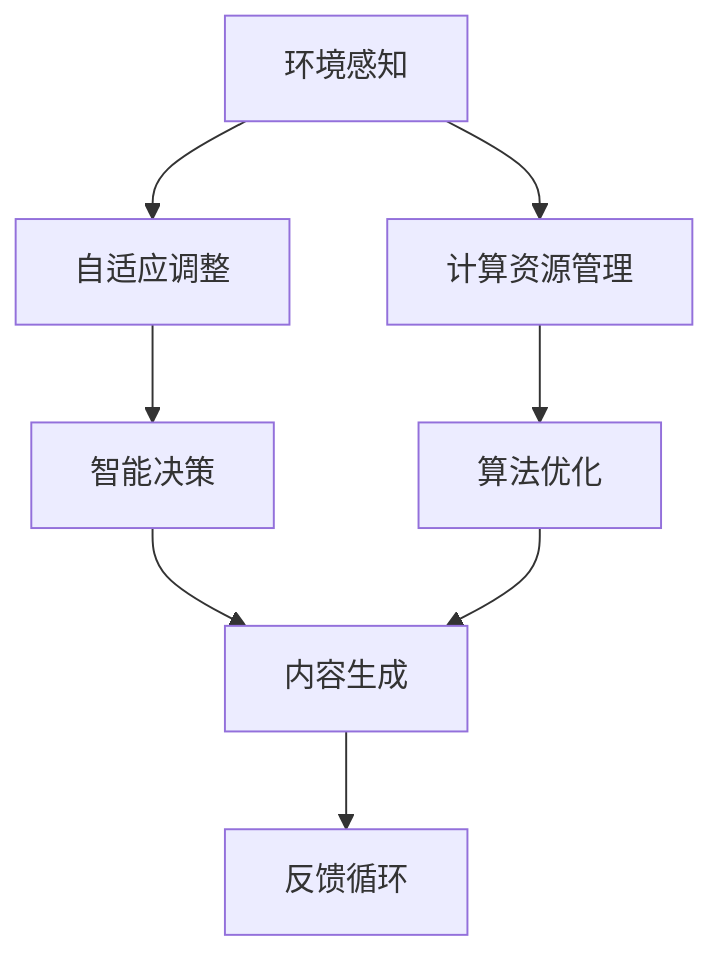

                 

## 1.1 AIGC的概念与特性

**背景介绍：**

在当今快速发展的信息技术时代，人工智能（AI）已成为推动科技进步和社会发展的关键驱动力。AI技术涵盖了众多子领域，包括机器学习、深度学习、自然语言处理等。而生成式人工智能（Generative Artificial Intelligence，GAI）作为AI的一个重要分支，正逐渐崭露头角。生成式人工智能的核心在于通过算法生成新的内容，这些内容可以是文本、图像、音乐或视频等。在生成式人工智能的基础上，自适应智能生成计算（Adaptive Intelligent Generation Computation，AIGC）应运而生，它结合了计算机科学、人工智能、算法设计、算法优化等多个领域的知识，旨在实现更高效、更智能的内容生成。

**核心概念与联系：**

AIGC的概念可以分解为几个关键部分：自适应、智能、生成计算。首先，自适应意味着AIGC系统能够根据环境变化和需求调整自身的参数和行为。智能则强调了AIGC系统不仅能够生成内容，还能进行学习、推理和决策。最后，生成计算涉及利用算法和计算资源生成高质量的内容。

为了更直观地展示这些概念之间的联系，我们可以使用Mermaid流程图来描述AIGC的架构：



在这个流程图中，AIGC系统首先通过环境感知模块获取外部环境的信息，然后进行自适应调整以优化性能。接着，智能决策模块根据当前的感知数据生成相应的策略。最终，这些策略通过内容生成模块实现，并在反馈循环中不断迭代和改进。

**核心算法原理讲解：**

AIGC的算法原理主要涉及以下几个方面：

1. **生成对抗网络（GAN）**：
   GAN是一种用于生成新数据的深度学习模型，由生成器（Generator）和判别器（Discriminator）组成。生成器尝试生成与真实数据相似的数据，而判别器则试图区分真实数据和生成数据。通过这种对抗训练，生成器能够不断提高生成数据的质量。

   ```python
   # 伪代码：GAN模型
   def GAN_train(generator, discriminator, data):
       for epoch in range(num_epochs):
           for batch in data:
               # 训练判别器
               discriminator_loss = train_discriminator(discriminator, batch)
               # 训练生成器
               generator_loss = train_generator(generator, discriminator)
               print(f"Epoch: {epoch}, D Loss: {discriminator_loss}, G Loss: {generator_loss}")
   ```

2. **变分自编码器（VAE）**：
   VAE是一种用于生成数据的概率模型，通过编码器和解码器将输入数据转换为潜在空间中的表示，然后从潜在空间中采样生成新的数据。

   ```latex
   % 数学公式：VAE损失函数
   $$\mathcal{L} = -\frac{1}{N}\sum_{i=1}^{N} \left[\log p(x|z) + D(q(z|x); p(z)\right]$$
   ```

3. **自注意力机制**：
   自注意力机制是深度学习中的一个关键组件，它允许模型在处理序列数据时关注序列中的不同部分。自注意力机制在生成文本、图像等序列数据时尤为重要。

   ```python
   # 伪代码：自注意力机制
   def self_attention(inputs):
       Q = ... # Query
       K = ... # Key
       V = ... # Value
       scores = torch.matmul(Q, K.transpose(1, 2)) / sqrt(Q.shape[-1])
       attention_weights = F.softmax(scores, dim=-1)
       output = torch.matmul(attention_weights, V)
       return output
   ```

**数学模型和公式详细讲解与举例说明：**

AIGC系统中的数学模型通常涉及概率分布、损失函数和优化算法。以下是一些常见的数学模型和公式：

1. **生成对抗网络（GAN）损失函数**：

   ```latex
   % 数学公式：GAN损失函数
   $$\mathcal{L}_{GAN}(G,D) = \mathbb{E}_{x \sim p_{data}(x)}[\log D(x)] - \mathbb{E}_{z \sim p_{z}(z)][\log (1 - D(G(z)))]$$
   ```

2. **变分自编码器（VAE）损失函数**：

   ```latex
   % 数学公式：VAE损失函数
   $$\mathcal{L} = -\frac{1}{N}\sum_{i=1}^{N} \left[\log p(x|z) + D(q(z|x); p(z)\right]$$
   ```

3. **自注意力机制计算**：

   ```latex
   % 数学公式：自注意力分数
   $$scores = \frac{Q \cdot K}{\sqrt{d_k}}$$
   ```

**项目实战：开发环境搭建**

为了实际应用AIGC技术，需要搭建一个合适的开发环境。以下是一个简单的环境搭建步骤：

1. **安装Python环境**：确保Python版本在3.7及以上。

2. **安装TensorFlow或PyTorch**：选择一个流行的深度学习框架，例如TensorFlow或PyTorch，用于构建和训练AIGC模型。

   ```shell
   pip install tensorflow
   # 或
   pip install torch torchvision
   ```

3. **安装必要的库**：安装用于数据预处理、模型训练和评估的库，如NumPy、Pandas和Scikit-learn。

   ```shell
   pip install numpy pandas scikit-learn
   ```

**源代码详细实现和代码解读：**

以下是一个简单的GAN模型的实现，用于生成手写数字图像：

```python
import tensorflow as tf
from tensorflow.keras import layers

# 生成器模型
def generator_model():
    model = tf.keras.Sequential()
    model.add(layers.Dense(128, activation='relu', input_shape=(100,)))
    model.add(layers.Dense(128, activation='relu'))
    model.add(layers.Dense(784, activation='tanh'))
    return model

# 判别器模型
def discriminator_model():
    model = tf.keras.Sequential()
    model.add(layers.Dense(128, activation='relu', input_shape=(784,)))
    model.add(layers.Dense(128, activation='relu'))
    model.add(layers.Dense(1, activation='sigmoid'))
    return model

# GAN模型
class GAN(tf.keras.Model):
    def __init__(self):
        super().__init__()
        self.generator = generator_model()
        self.discriminator = discriminator_model()

    @tf.function
    def train_step(self, batch_data, batch_noise):
        with tf.GradientTape() as gen_tape, tf.GradientTape() as disc_tape:
            generated_images = self.generator(batch_noise)
            disc_real_output = self.discriminator(batch_data)
            disc_generated_output = self.discriminator(generated_images)

            gen_loss = self.compute_generator_loss(disc_generated_output)
            disc_loss = self.compute_discriminator_loss(disc_real_output, disc_generated_output)

        gradients_of_generator = gen_tape.gradient(gen_loss, self.generator.trainable_variables)
        gradients_of_discriminator = disc_tape.gradient(disc_loss, self.discriminator.trainable_variables)

        self.generator.optimizer.apply_gradients(zip(gradients_of_generator, self.generator.trainable_variables))
        self.discriminator.optimizer.apply_gradients(zip(gradients_of_discriminator, self.discriminator.trainable_variables))

    def compute_generator_loss(self, disc_generated_output):
        return -tf.reduce_mean(tf.math.log(disc_generated_output))

    def compute_discriminator_loss(self, disc_real_output, disc_generated_output):
        real_loss = tf.reduce_mean(tf.math.log(disc_real_output))
        generated_loss = tf.reduce_mean(tf.math.log(1 - disc_generated_output))
        return real_loss + generated_loss

# 代码解读与分析
# 此代码首先定义了生成器和判别器的模型结构。
# 在GAN类中，train_step方法用于训练生成器和判别器。
# compute_generator_loss和compute_discriminator_loss方法用于计算生成器和判别器的损失函数。
```

**实际案例分析和详细讲解剖析：**

一个实际案例是使用GAN生成手写数字图像。在这个案例中，我们使用MNIST数据集，通过训练GAN模型生成接近真实数据的手写数字图像。

1. **数据预处理**：将MNIST数据集分为训练集和测试集，并转换成合适的格式。

2. **模型训练**：使用训练集训练GAN模型，并在测试集上评估模型的性能。

3. **模型评估**：通过可视化生成的图像，评估模型的质量和稳定性。

**项目小结：**

AIGC技术在生成高质量内容方面展示了巨大的潜力。通过GAN和VAE等模型，我们可以生成逼真的图像、音频和文本等。在智慧城市噪音污染控制中，AIGC可以用于生成噪音数据、预测噪音水平以及制定噪音控制策略。然而，AIGC技术的应用也面临一些挑战，如模型训练的高计算成本和模型的泛化能力等。未来，随着计算能力和算法的不断提升，AIGC将在智慧城市噪音污染控制中发挥更重要的作用。

**最佳实践 Tips：**

- **数据质量**：确保用于训练AIGC模型的数据质量高，这直接影响模型生成内容的质量。
- **模型选择**：根据应用场景选择合适的AIGC模型，例如GAN适合生成复杂且多样的内容。
- **计算资源**：合理分配计算资源，优化模型训练过程，以提高训练效率。

**小结**：

本章介绍了AIGC的概念、核心特性以及与智慧城市的关联。通过分析AIGC的架构和核心算法，我们了解了如何利用AIGC技术生成高质量的内容。在后续章节中，我们将进一步探讨AIGC在智慧城市噪音污染控制中的应用，包括噪音监测、预测和控制策略等方面。

**注意事项**：

- **算法选择**：根据具体需求选择合适的算法，如GAN、VAE等。
- **数据安全**：确保数据安全和隐私保护，特别是在处理敏感数据时。
- **模型优化**：持续优化模型，提高其效率和准确性。

**拓展阅读**：

- [Ian Goodfellow](https://en.wikipedia.org/wiki/Ian_Goodfellow)（GAN的创始人）的相关论文和著作。
- [Variational Autoencoders](https://arxiv.org/abs/1312.6114)的详细研究。
- [Attention Is All You Need](https://arxiv.org/abs/1706.03762)关于自注意力机制的论文。

### 参考文献：

- Goodfellow, I., Pouget-Abadie, J., Mirza, M., Xu, B., Warde-Farley, D., Ozair, S., ... & Bengio, Y. (2014). Generative adversarial nets. Advances in neural information processing systems, 27.
- Kingma, D. P., & Welling, M. (2013). Auto-encoding variational bayes. arXiv preprint arXiv:1312.6114.
- Vaswani, A., Shazeer, N., Parmar, N., Uszkoreit, J., Jones, L., Gomez, A. N., ... & Polosukhin, I. (2017). Attention is all you need. Advances in neural information processing systems, 30.

