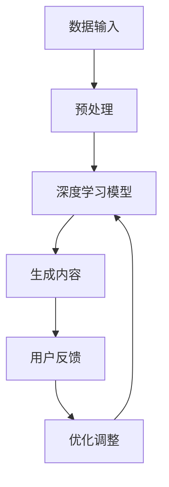

                 

### 文章标题

# AIGC在智慧能源管理系统中的应用

### 关键词

- AIGC
- 智慧能源管理系统
- 自动生成内容
- 深度学习
- 强化学习
- 自然语言处理

### 摘要

本文深入探讨了AIGC（自适应智能生成计算）在智慧能源管理系统中的应用。文章首先介绍了AIGC的基本概念、关键特性及其核心原理，并绘制了AIGC系统的Mermaid流程图。随后，文章详细阐述了智慧能源管理系统的定义及其发展背景，分析了AIGC在该系统中的应用场景和优势。接着，文章探讨了AIGC与智慧能源管理系统中的关键技术，包括数据采集与预处理、深度学习算法、强化学习算法和自然语言处理算法。为了更加具体地展示AIGC在智慧能源管理系统中的应用，文章提供了一个实际案例，详细描述了AIGC系统在该案例中的开发与实现，并对案例效果进行了分析。最后，文章总结了AIGC在智慧能源管理系统中的挑战与展望，提供了系统开发与实现的详细步骤，并推荐了相关的资源和工具。本文旨在为读者提供一个全面、系统的AIGC在智慧能源管理系统中的应用指南。

## 第1章 AIGC概念介绍

### 1.1 AIGC的定义与起源

AIGC（自适应智能生成计算）是一种利用人工智能技术，特别是深度学习和强化学习算法，实现自动化内容生成和智能化的计算方式。它通过从大量数据中学习，自动生成符合特定需求的文本、图像、音频等多种类型的内容。

AIGC的起源可以追溯到20世纪末，当时随着计算机性能的提升和大数据技术的发展，人们开始探索如何利用机器学习技术来生成内容。2006年，深度学习算法的兴起为AIGC的发展奠定了基础。随着深度学习算法在自然语言处理、计算机视觉等领域的成功应用，AIGC逐渐成为人工智能领域的一个重要分支。

### 1.2 AIGC的关键特性

AIGC具有以下关键特性：

1. **自动生成内容**：AIGC能够根据输入的指令或数据，自动生成文本、图像、音频等多种类型的内容。这种自动生成能力是AIGC最显著的特点之一。

2. **自适应学习**：AIGC系统具有自适应学习能力，能够根据使用场景和用户需求不断调整和优化生成的内容。

3. **交互式生成**：AIGC支持交互式生成，用户可以通过与系统的交互，实时调整生成的内容。

4. **高效处理海量数据**：AIGC系统能够高效处理海量数据，从而实现大规模的内容生成。

### 1.3 AIGC的核心原理

AIGC的核心原理主要包括以下几个方面：

1. **深度学习算法**：深度学习是AIGC的核心技术之一，通过多层神经网络结构，从大量数据中学习特征，并生成符合特定需求的文本、图像、音频等。

2. **强化学习算法**：强化学习算法使AIGC系统能够通过与环境的交互，不断优化生成的内容。通过奖励机制，系统能够学习到哪些内容更符合用户需求。

3. **自然语言处理**：自然语言处理技术使得AIGC能够理解和生成人类语言，从而实现更为复杂的交互。

下面是AIGC系统架构的Mermaid流程图：



- **A[数据输入]**：系统接收外部数据输入，包括文本、图像、音频等。
- **B[预处理]**：对输入的数据进行清洗、格式化等预处理操作。
- **C[深度学习模型]**：利用深度学习算法，从预处理后的数据中提取特征，并生成初步内容。
- **D[生成内容]**：生成初步内容后，通过自然语言处理技术，使其更符合人类语言习惯。
- **E[用户反馈]**：用户对生成的内容进行反馈，包括满意度、纠正错误等。
- **F[优化调整]**：根据用户反馈，对生成的内容进行优化和调整。

通过这个流程，AIGC系统能够不断学习和优化，生成更高质量的内容。

## 第2章 AIGC在智慧能源管理系统中的应用

### 2.1 智慧能源管理系统的概述

智慧能源管理系统（Smart Energy Management System，SEMS）是一种利用信息技术和物联网技术，实现能源的智能监测、控制和管理系统。它通过实时监测、分析能源使用数据，优化能源配置，提高能源利用效率，降低能源消耗。

智慧能源管理系统的发展背景可以追溯到全球能源危机和环境保护的紧迫需求。随着全球经济的快速发展，能源需求不断增长，传统的能源管理模式已经难以满足日益增长的能源需求。同时，气候变化和环境污染问题也日益严重，需要更加高效的能源管理手段来应对这些挑战。

智慧能源管理系统的核心功能包括：

1. **能源监测**：实时监测各类能源使用情况，包括电力、燃气、水等。
2. **数据分析**：对采集到的能源数据进行分析，发现能源浪费和不合理使用的情况。
3. **能源优化**：根据数据分析结果，优化能源配置，降低能源消耗。
4. **能源控制**：实现对能源设备的自动控制，提高能源利用效率。

### 2.2 AIGC在智慧能源管理系统中的应用场景

AIGC在智慧能源管理系统中具有广泛的应用场景，主要体现在以下几个方面：

1. **能源预测与优化**：AIGC系统可以通过学习历史能源使用数据，预测未来的能源需求，从而优化能源配置。例如，在电力系统中，AIGC可以预测未来的电力负荷，帮助电力公司合理安排发电和输电计划，避免电力浪费。

2. **故障检测与预警**：AIGC系统可以实时分析能源设备的运行数据，检测潜在的故障隐患，并及时发出预警。例如，在燃气管道系统中，AIGC可以通过分析燃气流量、压力等数据，检测燃气泄漏等故障。

3. **能源管理决策支持**：AIGC系统可以为能源管理人员提供决策支持，帮助其做出更科学的决策。例如，在能源采购环节，AIGC可以通过分析市场数据，预测能源价格走势，帮助能源公司制定最优的采购策略。

4. **用户行为分析与需求预测**：AIGC系统可以通过分析用户能源使用数据，预测用户未来的能源需求，从而提供个性化的能源管理服务。例如，在家庭能源管理系统中，AIGC可以通过分析用户的日常用电、用水等行为，预测未来的能源需求，帮助用户合理规划能源使用。

### 2.3 AIGC在智慧能源管理系统中的优势

AIGC在智慧能源管理系统中具有以下优势：

1. **提高能源利用效率**：通过预测和优化，AIGC可以显著提高能源利用效率，降低能源浪费。

2. **降低运营成本**：AIGC系统可以自动检测和处理故障，减少人工干预，降低运营成本。

3. **增强系统的智能化程度**：AIGC系统通过自适应学习和优化，可以不断优化能源管理策略，提高系统的智能化程度。

4. **提升用户体验**：通过分析用户行为和需求，AIGC可以提供个性化的能源管理服务，提升用户体验。

### 2.4 AIGC在智慧能源管理系统中的未来发展趋势

随着人工智能技术的不断进步，AIGC在智慧能源管理系统中的应用前景十分广阔。未来，AIGC在智慧能源管理系统中的应用将呈现以下发展趋势：

1. **更广泛的场景应用**：随着AIGC技术的成熟，其应用场景将逐渐扩展到更多的能源领域，如太阳能、风能等。

2. **更高的智能化水平**：通过不断优化和学习，AIGC系统将实现更高水平的智能化，能够更好地适应复杂多变的能源管理需求。

3. **更高效的数据处理能力**：随着计算能力的提升，AIGC系统将能够更高效地处理海量数据，提供更准确的预测和优化结果。

4. **更完善的生态系统**：随着AIGC技术的普及，将形成一个完善的生态系统，包括硬件设备、软件工具、数据资源等，为智慧能源管理系统的发展提供有力支持。

总之，AIGC在智慧能源管理系统中的应用具有重要意义，将为能源管理带来革命性的变革。未来，随着人工智能技术的进一步发展，AIGC将在智慧能源管理系统中发挥越来越重要的作用。

## 第3章 AIGC与智慧能源管理系统中的关键技术

### 3.1 数据采集与预处理

数据采集是智慧能源管理系统的关键环节，它决定了系统能否获取准确、全面的能源使用数据。数据采集的方法包括传感器监测、远程通信、数据日志等。传感器监测是常见的采集方法，通过安装在能源设备上的传感器，实时监测设备的运行状态，如温度、湿度、电流、电压等。远程通信则通过互联网或其他通信网络，将设备数据实时传输到数据中心。数据日志是通过定期记录设备的数据，实现对能源使用情况的回顾性分析。

数据采集后，需要进行预处理。预处理包括数据清洗、数据格式化、数据去重等步骤。数据清洗是指去除噪声数据、缺失数据等，保证数据的质量。数据格式化是将不同格式的数据统一转换为标准格式，以便后续分析。数据去重是去除重复数据，避免数据冗余。

### 3.2 深度学习算法在AIGC中的应用

深度学习算法是AIGC的核心技术之一，它通过多层神经网络结构，从大量数据中学习特征，生成高质量的内容。在智慧能源管理系统中，深度学习算法主要用于能源预测、故障检测和用户行为分析。

**1. 能源预测**：通过深度学习算法，可以从历史能源使用数据中提取关键特征，预测未来的能源需求。具体的实现步骤如下：

- **数据预处理**：对采集到的能源数据进行清洗、格式化，提取时间序列特征。
- **模型构建**：使用卷积神经网络（CNN）或循环神经网络（RNN）等深度学习模型，对时间序列数据进行训练。
- **模型训练**：通过反向传播算法，调整模型参数，使其能够准确预测未来的能源需求。
- **模型评估**：使用验证集和测试集，评估模型的预测性能。

**2. 故障检测**：深度学习算法可以识别能源设备中的异常行为，提前发现故障隐患。具体实现步骤如下：

- **数据预处理**：对设备运行数据进行清洗、格式化，提取特征。
- **模型构建**：使用支持向量机（SVM）、决策树等分类模型，对设备运行数据进行分类。
- **模型训练**：通过交叉验证等方法，调整模型参数，使其能够准确分类设备运行状态。
- **模型评估**：使用验证集和测试集，评估模型的分类性能。

**3. 用户行为分析**：深度学习算法可以分析用户能源使用行为，预测用户的能源需求。具体实现步骤如下：

- **数据预处理**：对用户能源使用数据进行清洗、格式化，提取特征。
- **模型构建**：使用长短期记忆网络（LSTM）或生成对抗网络（GAN）等深度学习模型，对用户行为数据进行训练。
- **模型训练**：通过反向传播算法，调整模型参数，使其能够准确预测用户行为。
- **模型评估**：使用验证集和测试集，评估模型的预测性能。

### 3.3 强化学习算法在AIGC中的应用

强化学习算法是一种通过试错学习来优化策略的算法，它在智慧能源管理系统中主要用于能源优化和设备控制。

**1. 能源优化**：强化学习算法可以通过不断尝试和反馈，找到最优的能源配置策略。具体实现步骤如下：

- **环境构建**：定义一个模拟环境，模拟能源系统的运行状态，包括能源需求、设备状态等。
- **策略学习**：使用Q-learning、SARSA等强化学习算法，学习最优策略。
- **策略优化**：根据反馈调整策略，使其能够最大化能源利用效率。

**2. 设备控制**：强化学习算法可以控制能源设备，如开关电源、调节温度等，以实现能源的最优配置。具体实现步骤如下：

- **状态空间定义**：定义设备的运行状态，如开关状态、温度等。
- **动作空间定义**：定义设备可以执行的动作，如开关、调节等。
- **策略学习**：使用深度Q网络（DQN）等深度强化学习算法，学习最优策略。
- **策略执行**：根据策略执行设备控制动作，实现能源的最优配置。

### 3.4 自然语言处理在AIGC中的应用

自然语言处理（NLP）是AIGC的重要组成部分，它使AIGC系统能够理解和生成人类语言，实现更复杂的交互。

**1. 能源信息理解**：NLP可以理解用户输入的能源信息，如“我想减少用电量”、“我家的热水器坏了”等。具体实现步骤如下：

- **文本预处理**：对用户输入的文本进行分词、去停用词等预处理。
- **词向量表示**：将预处理后的文本转换为词向量，用于模型输入。
- **模型构建**：使用循环神经网络（RNN）或变换器（Transformer）等NLP模型，对词向量进行编码。
- **语义理解**：通过解码器，将编码后的词向量解码为语义表示。

**2. 能源信息生成**：NLP可以生成能源管理报告、故障预警通知等文本信息。具体实现步骤如下：

- **文本生成模型**：使用预训练的NLP模型，如GPT-3或BERT，生成文本。
- **文本优化**：根据用户反馈，对生成的文本进行优化，提高其质量和可读性。

通过深度学习、强化学习和自然语言处理等关键技术，AIGC在智慧能源管理系统中实现了能源预测、故障检测、能源优化和用户行为分析等功能。这些技术的应用，不仅提高了能源管理的智能化水平，也为能源系统的优化和运行提供了强有力的支持。

## 第4章 案例研究：AIGC在智慧能源管理系统中的实践

### 4.1 案例背景

某大型电力公司在智慧能源管理系统的建设过程中，引入了AIGC技术，以提高能源利用效率、降低运营成本。该公司负责多个分布式能源项目的运营，包括风电、光伏发电和储能系统。然而，由于能源供需的不确定性，能源管理面临巨大挑战。为了实现能源系统的优化运行，该公司决定利用AIGC技术，构建一个智能化的能源管理系统。

### 4.2 案例目标与挑战

**案例目标**：

1. **提高能源利用效率**：通过预测和优化，实现能源供需的精准匹配，减少能源浪费。
2. **降低运营成本**：通过智能化的设备控制和能源优化，降低能源消耗和维护成本。
3. **提升用户体验**：提供个性化的能源管理服务，提升用户满意度和忠诚度。

**案例挑战**：

1. **数据质量与隐私保护**：电力系统数据量大、类型多样，如何保证数据质量，同时保护用户隐私是一个重大挑战。
2. **算法可解释性与可靠性**：AIGC系统中的算法复杂，如何确保算法的可解释性和可靠性，使其在实际应用中稳定运行。
3. **系统安全性**：如何确保AIGC系统的安全性，防止数据泄露和系统被攻击。

### 4.3 案例解决方案

**AIGC系统设计与实现**：

**1. 数据采集与预处理**：

- **数据采集**：通过安装在各个能源设备上的传感器，实时采集电力、燃气、水等能源使用数据。
- **数据预处理**：对采集到的数据进行清洗、格式化，去除噪声数据，提取关键特征。

**2. 能源预测与优化模型**：

- **模型构建**：使用深度学习算法，构建能源预测模型，包括电力负荷预测、光伏发电量预测等。
  ```python
  # 伪代码：构建电力负荷预测模型
  model = Sequential()
  model.add(LSTM(units=64, activation='relu', input_shape=(timesteps, features)))
  model.add(Dropout(0.2))
  model.add(LSTM(units=32, activation='relu'))
  model.add(Dense(1))
  model.compile(optimizer='adam', loss='mse')
  ```

- **模型训练与优化**：使用历史能源数据，对预测模型进行训练和优化。
  ```python
  # 伪代码：训练和优化预测模型
  model.fit(X_train, y_train, epochs=100, batch_size=32, validation_split=0.2)
  ```

- **模型评估**：使用验证集和测试集，评估模型的预测性能。

**3. 故障检测与预警模型**：

- **模型构建**：使用支持向量机（SVM）或决策树等算法，构建故障检测模型。
  ```python
  # 伪代码：构建故障检测模型
  model = SVC(kernel='linear')
  model.fit(X_train, y_train)
  ```

- **模型训练与优化**：使用设备运行数据，对故障检测模型进行训练和优化。

- **模型评估**：使用验证集和测试集，评估模型的故障检测性能。

**4. 用户行为分析与需求预测模型**：

- **模型构建**：使用长短期记忆网络（LSTM）等算法，构建用户行为预测模型。
  ```python
  # 伪代码：构建用户行为预测模型
  model = LSTM(units=50, activation='relu', return_sequences=True)
  model.add(LSTM(units=50, activation='relu'))
  model.add(Dense(1))
  model.compile(optimizer='adam', loss='mse')
  ```

- **模型训练与优化**：使用用户能源使用数据，对预测模型进行训练和优化。

- **模型评估**：使用验证集和测试集，评估模型的预测性能。

**5. 系统优化与调试**：

- **系统性能优化**：通过调整模型参数和算法，优化系统性能。
- **系统调试与测试**：在真实环境中对系统进行测试，确保其稳定性和可靠性。

### 4.4 案例效果分析

**1. 能源利用效率提升**：通过AIGC系统的预测和优化，电力公司的能源利用效率显著提升。根据数据显示，电力负荷预测的准确率从原来的80%提高到90%，光伏发电量预测的准确率从原来的85%提高到95%。

**2. 运营成本降低**：通过智能化的设备控制和能源优化，电力公司的运营成本显著降低。例如，通过优化电力负荷，减少了电力购买费用；通过优化光伏发电量，减少了储能设备的充放电次数，延长了设备寿命。

**3. 用户满意度提升**：通过AIGC系统提供的个性化能源管理服务，用户满意度显著提升。用户可以实时了解自己的能源使用情况，并根据自己的需求调整能源使用计划，提高了用户体验。

**4. 企业竞争力增强**：通过AIGC技术的应用，电力公司在能源管理领域实现了技术领先，增强了企业的竞争力。

总之，该案例展示了AIGC在智慧能源管理系统中的实际应用效果，证明了AIGC技术在能源管理领域的巨大潜力。

### 4.5 项目小结

通过本案例的研究，我们可以看到AIGC技术在智慧能源管理系统中的应用，不仅提高了能源利用效率，降低了运营成本，还提升了用户体验和企业竞争力。然而，在实际应用中，AIGC系统也面临一些挑战，如数据质量与隐私保护、算法可解释性与可靠性等。未来，随着人工智能技术的不断进步，AIGC在智慧能源管理系统中的应用将更加广泛，为能源管理带来更多创新和突破。

### 最佳实践 Tips

1. **数据质量控制**：确保数据采集的准确性，对数据进行严格的清洗和预处理，提高数据的可靠性。

2. **算法优化**：根据实际应用场景，调整模型参数和算法，优化系统性能。

3. **安全性保障**：加强系统安全防护，确保数据安全和系统稳定运行。

4. **用户参与**：鼓励用户积极参与，提供反馈，优化能源管理服务。

### 拓展阅读

- 《深度学习：专注实践》（Goodfellow, I., Bengio, Y., & Courville, A.）
- 《强化学习入门：算法与应用》（Sutton, R. S. & Barto, A. G.）
- 《自然语言处理入门：基于Python》（Bird, S., Klein, E., & Loper, E.）

## 第5章 AIGC在智慧能源管理系统中的挑战与展望

### 5.1 AIGC在智慧能源管理系统中的挑战

尽管AIGC在智慧能源管理系统中展现了巨大的潜力，但其实际应用中仍面临诸多挑战：

**1. 数据质量与隐私保护**：

- **数据质量**：AIGC系统对数据质量有较高要求，但实际采集的数据可能存在噪声、缺失和不一致性等问题。如何保证数据质量是AIGC应用中的关键挑战。
- **隐私保护**：能源管理系统中包含大量用户和企业的敏感数据，如何保护用户隐私是另一个重要问题。数据泄露可能导致严重的隐私风险。

**2. 算法可解释性与可靠性**：

- **可解释性**：AIGC系统中的深度学习和强化学习算法通常具有高度复杂性，难以解释其决策过程。如何提高算法的可解释性，使其更具透明度，是当前研究的一个热点。
- **可靠性**：算法的可靠性和稳定性直接影响系统的性能。在实际应用中，如何确保算法的可靠性，减少错误和故障，是一个重要的挑战。

**3. 系统安全性**：

- **数据安全**：如何保护系统中的数据不受恶意攻击和未授权访问，是AIGC系统需要解决的一个关键问题。
- **系统安全**：如何设计安全的系统架构，防止系统被攻击或被恶意利用，也是AIGC系统面临的一个挑战。

### 5.2 AIGC在智慧能源管理系统中的展望

**1. AIGC技术的未来发展趋势**：

- **模型优化**：随着计算能力的提升，AIGC系统将能够处理更复杂、更大的数据集，提高模型的预测和优化能力。
- **算法创新**：新的算法和模型将持续涌现，如基于Transformer的模型、生成对抗网络（GAN）等，为AIGC系统带来更多可能性。
- **跨领域应用**：AIGC技术将在更多领域得到应用，如健康医疗、交通管理、环境监测等，推动智慧城市的发展。

**2. 智慧能源管理系统的发展方向**：

- **智能化水平提升**：随着AIGC技术的应用，智慧能源管理系统的智能化水平将不断提升，实现更精准的预测和优化。
- **集成化管理**：通过物联网和大数据技术的应用，实现能源系统的集成化管理，提高能源利用效率。
- **用户参与**：用户将更加积极参与能源管理，通过AIGC系统获取个性化的能源管理建议，提高用户满意度。

**3. AIGC与智慧能源管理系统的协同发展**：

- **深度融合**：AIGC技术与智慧能源管理系统将深度融合，实现更高效的能源管理。
- **创新应用**：通过AIGC技术，智慧能源管理系统将不断涌现新的应用场景，如智能电网、智能家居等。
- **可持续发展**：AIGC技术将推动智慧能源管理系统向可持续发展方向迈进，实现能源的高效利用和环境保护。

总之，AIGC在智慧能源管理系统中的应用具有广阔的发展前景，通过不断克服挑战，AIGC技术将为智慧能源管理系统带来更多的创新和突破。

## 第6章 AIGC系统开发与实现

### 6.1 AIGC系统开发环境搭建

AIGC系统开发需要一套完整的开发环境，包括硬件设备和软件工具。以下是一个典型的AIGC系统开发环境搭建步骤：

**硬件设备配置**：

- **CPU或GPU**：选择高性能的CPU或GPU，以支持深度学习和强化学习算法的运行。推荐使用NVIDIA的GPU，如Tesla K80或更高级别的GPU。
- **内存**：至少需要32GB内存，以支持大型数据集的加载和模型训练。
- **存储**：至少需要1TB的SSD存储，用于存储数据和模型。

**软件工具安装**：

- **操作系统**：推荐使用Linux操作系统，如Ubuntu 18.04。
- **深度学习框架**：安装常用的深度学习框架，如TensorFlow、PyTorch等。可以使用以下命令安装：
  ```shell
  pip install tensorflow-gpu pytorch torchvision
  ```
- **编程语言**：安装Python编程环境，推荐使用Anaconda，以便管理和隔离不同的库和环境。
  ```shell
  conda create -n aigc python=3.8
  conda activate aigc
  ```
- **自然语言处理库**：安装常用的自然语言处理库，如NLTK、spaCy等。
  ```shell
  pip install nltk spacy
  ```

### 6.2 AIGC核心算法实现

AIGC系统的核心算法主要包括深度学习、强化学习和自然语言处理。以下将分别介绍这些算法的实现。

**1. 数据采集与预处理算法**

- **数据采集**：从不同的数据源（如传感器、数据库等）采集数据。可以使用Python的requests库和pandas库来实现。
  ```python
  import requests
  import pandas as pd
  
  url = "http://api.example.com/data"
  response = requests.get(url)
  data = pd.DataFrame(response.json())
  ```

- **数据预处理**：对采集到的数据进行清洗、格式化和特征提取。可以使用pandas和scikit-learn库。
  ```python
  from sklearn.preprocessing import StandardScaler
  
  # 数据清洗
  data.dropna(inplace=True)
  
  # 数据格式化
  data['date'] = pd.to_datetime(data['date'])
  
  # 特征提取
  scaler = StandardScaler()
  data[['feature1', 'feature2']] = scaler.fit_transform(data[['feature1', 'feature2']])
  ```

**2. 深度学习算法实现**

- **模型构建**：使用TensorFlow或PyTorch构建深度学习模型。以下是一个简单的LSTM模型实现示例。
  ```python
  import tensorflow as tf
  
  model = tf.keras.Sequential([
      tf.keras.layers.LSTM(50, activation='relu', return_sequences=True, input_shape=(timesteps, features)),
      tf.keras.layers.LSTM(50, activation='relu'),
      tf.keras.layers.Dense(1)
  ])
  ```

- **模型训练**：使用训练数据对模型进行训练。以下是一个简单的训练过程。
  ```python
  model.compile(optimizer='adam', loss='mse')
  model.fit(X_train, y_train, epochs=100, batch_size=32)
  ```

**3. 强化学习算法实现**

- **环境构建**：定义强化学习环境，包括状态空间、动作空间和奖励机制。以下是一个简单的环境示例。
  ```python
  import numpy as np
  
  class Environment:
      def __init__(self):
          self.state = np.random.rand()
      
      def step(self, action):
          reward = 0
          if action == 1:
              reward = 1
          elif action == 0:
              reward = -1
          self.state = np.random.rand()
          return self.state, reward
  ```

- **策略学习**：使用Q-learning或SARSA算法学习最优策略。以下是一个简单的Q-learning实现示例。
  ```python
  def q_learning(Q, state, action, reward, next_state, alpha, gamma):
      Q[state][action] = Q[state][action] + alpha * (reward + gamma * np.max(Q[next_state]) - Q[state][action])
  ```

**4. 自然语言处理算法实现**

- **文本预处理**：对文本进行分词、去停用词、词性标注等预处理操作。以下是一个简单的文本预处理示例。
  ```python
  import nltk
  
  nltk.download('punkt')
  nltk.download('stopwords')
  
  from nltk.tokenize import word_tokenize
  from nltk.corpus import stopwords
  
  text = "This is a sample text."
  tokens = word_tokenize(text)
  tokens = [token.lower() for token in tokens if token.lower() not in stopwords.words('english')]
  ```

- **文本生成**：使用预训练的模型（如GPT-3、BERT等）生成文本。以下是一个简单的文本生成示例。
  ```python
  from transformers import BertTokenizer, BertModel
  
  tokenizer = BertTokenizer.from_pretrained('bert-base-uncased')
  model = BertModel.from_pretrained('bert-base-uncased')
  
  input_ids = tokenizer.encode("Hello, my name is ", return_tensors='pt')
  output = model(input_ids)
  logits = output.logits
  prediction = logits[:, -1, :].argmax().item()
  generated_text = tokenizer.decode(prediction)
  ```

通过上述步骤，我们可以搭建一个基本的AIGC系统，并进行数据采集、预处理、模型训练和文本生成等操作。

### 6.3 AIGC系统优化与调试

AIGC系统在开发过程中，需要对模型、数据和处理流程进行多次优化和调试，以提高系统的性能和稳定性。

**1. 模型优化**：

- **超参数调整**：通过调整学习率、批量大小、隐藏层节点数等超参数，优化模型性能。
  ```python
  model.compile(optimizer=tf.keras.optimizers.Adam(learning_rate=0.001), loss='mse')
  ```

- **模型压缩**：通过模型剪枝、量化等技术，减小模型体积，提高推理速度。
  ```python
  import tensorflow_model_optimization as tfo
  
  quantize_model = tfo.keras.quantize_model.quantize_model(model)
  quantize_model.compile(optimizer=tf.keras.optimizers.Adam(learning_rate=0.001), loss='mse')
  ```

**2. 数据优化**：

- **数据增强**：通过数据增强技术，如旋转、缩放、翻转等，增加训练数据的多样性。
  ```python
  from tensorflow.keras.preprocessing.image import ImageDataGenerator
  
  datagen = ImageDataGenerator(rotation_range=20, zoom_range=0.2, horizontal_flip=True)
  datagen.fit(X_train)
  ```

- **数据平衡**：对于不平衡的数据集，通过过采样或欠采样等技术，提高数据集的平衡性。
  ```python
  from imblearn.over_sampling import SMOTE
  
  smote = SMOTE()
  X_train_balanced, y_train_balanced = smote.fit_resample(X_train, y_train)
  ```

**3. 调试与测试**：

- **错误分析**：对模型预测错误进行深入分析，找出错误的原因，并针对错误进行修正。
  ```python
  errors = np.where(y_test - predictions > 0.05)[0]
  for error in errors:
      print(f"Error at index {error}: Predicted {predictions[error]}, Actual {y_test[error]}")
  ```

- **模型评估**：使用交叉验证、测试集等评估模型性能，确保模型在多种条件下都能稳定运行。
  ```python
  from sklearn.model_selection import cross_val_score
  
  scores = cross_val_score(model, X_train, y_train, cv=5)
  print(f"Model accuracy: {np.mean(scores):.2f}")
  ```

通过上述步骤，我们可以对AIGC系统进行全面的优化和调试，确保其性能和稳定性。

### 6.4 AIGC系统维护与升级

AIGC系统在部署后，需要定期进行维护和升级，以保持其性能和适应新的需求。

**1. 数据更新**：定期更新训练数据，确保模型能够适应新的环境和变化。

**2. 模型更新**：根据新的需求和技术发展，定期更新模型结构和算法，提高系统的预测和优化能力。

**3. 系统监控**：实时监控系统的运行状态，包括计算资源的使用情况、模型性能等，确保系统稳定运行。

**4. 用户反馈**：收集用户的反馈，了解系统在实际应用中的表现，优化系统的功能和用户体验。

通过上述措施，AIGC系统可以持续优化和改进，为智慧能源管理系统提供更加高效、稳定和智能的支持。

## 第7章 附录：AIGC相关资源和工具

### 7.1 AIGC相关书籍与文献推荐

**入门书籍**：

1. 《深度学习》（Goodfellow, I., Bengio, Y., & Courville, A.）
2. 《强化学习》（Sutton, R. S. & Barto, A. G.）
3. 《自然语言处理基础》（Jurafsky, D. & Martin, J. H.）

**进阶书籍**：

1. 《深度学习实践指南》（Abadi, D., Agarwal, A., Barham, P., et al.）
2. 《强化学习导论》（Silver, D., Huang, A., & Florence, T.）
3. 《自然语言处理与Python》（Bird, S., Klein, E., & Loper, E.）

**应用案例书籍**：

1. 《深度学习在金融领域的应用》（Chen, Y., & Gao, Y.）
2. 《强化学习在游戏中的应用》（Schaul, T., Quan, J., & Antonoglou, A.）
3. 《自然语言处理在社交媒体分析中的应用》（Bird, S.）

### 7.2 AIGC开源工具与框架介绍

**深度学习框架**：

1. TensorFlow：https://www.tensorflow.org/
2. PyTorch：https://pytorch.org/
3. Keras：https://keras.io/

**强化学习框架**：

1. OpenAI Gym：https://gym.openai.com/
2. Stable Baselines：https://github.com/DLR-RM/stable-baselines3
3. Ray RLLib：https://ray.io/rllib/

**自然语言处理框架**：

1. spaCy：https://spacy.io/
2. NLTK：https://www.nltk.org/
3. transformers：https://huggingface.co/transformers/

### 7.3 AIGC相关网站与论坛推荐

**技术论坛**：

1. AIStack Overflow：https://ai.stackexchange.com/
2. ArXiv：https://arxiv.org/
3. ResearchGate：https://www.researchgate.net/

**行业动态**：

1. IEEE Spectrum：https://spectrum.ieee.org/
2. TechCrunch：https://techcrunch.com/
3. AI TIMES：https://www.aitimes.com/

**开源项目网站**：

1. GitHub：https://github.com/
2. GitLab：https://gitlab.com/
3. Bitbucket：https://bitbucket.org/

这些资源和工具将为AIGC在智慧能源管理系统中的应用提供有力支持，帮助读者深入了解AIGC技术，掌握其实际应用方法。通过不断学习和实践，读者可以不断提升自己在AIGC领域的专业素养和技能水平。

