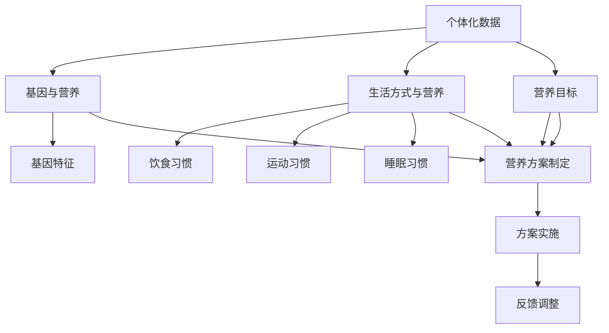

                 

### 引言：AIGC的概念与背景

**AIGC**（AI-Generated Content）是一个新兴且快速发展的领域，它指的是通过人工智能技术生成内容，不仅包括文本，还涉及图像、音频、视频等多种形式。AIGC的应用范围广泛，涵盖了广告、娱乐、医疗、教育等多个行业。在营养科学领域，AIGC的应用正在逐渐成为一种重要的手段，助力实现智能个性化营养干预，从而精准调控代谢健康。

**智能个性化营养干预**（Intelligent Personalized Nutritional Intervention）是一种基于个体化数据，通过分析个体的基因、生活方式、健康状况等因素，制定个性化的营养方案。这种干预方式不仅可以提高营养干预的效果，还能降低成本，提高效率。AIGC为这一领域的突破提供了强有力的技术支持。

**代谢健康**（Metabolic Health）是指机体在代谢过程中保持稳定的生理状态，是健康的重要组成部分。随着生活方式的改变和饮食结构的调整，代谢紊乱已经成为全球范围内的重大健康问题。通过AIGC技术，可以实现对个体代谢过程的精确监测和调控，从而预防和治疗代谢性疾病。

本篇文章将围绕AIGC在智能个性化营养干预中的应用进行探讨，从以下几个方面展开：

1. **AIGC的基本概念与技术在营养科学中的应用**：介绍AIGC的定义、发展历程和核心技术，以及其在营养科学中的实际应用。
2. **智能个性化营养干预的核心概念与原理**：阐述个性化营养干预的基本原理，包括基因、生活方式和健康状态等因素的影响。
3. **AIGC模型在营养干预中的应用**：介绍AIGC模型在营养数据分析、个性化饮食推荐等方面的应用。
4. **代谢健康与精准调控**：探讨代谢健康的定义、影响因素及其与营养干预的关系，并介绍AIGC在代谢健康精准调控中的作用。
5. **案例研究**：通过具体案例，展示AIGC在营养干预中的实际应用效果。
6. **挑战与未来方向**：分析AIGC在营养科学中的应用面临的挑战和未来发展方向。

本文的目标是帮助读者全面了解AIGC在智能个性化营养干预中的应用，掌握其核心技术和应用原理，为未来相关研究和实践提供参考。

## AIGC的基本概念与技术在营养科学中的应用

### AIGC的定义与核心概念

AIGC（AI-Generated Content）是基于人工智能技术生成内容的一种新兴领域。它不仅涉及文本生成，还涵盖了图像、音频、视频等多种形式。AIGC的核心概念主要包括以下几个方面：

1. **数据驱动**：AIGC依赖于大量高质量的数据进行训练，通过对这些数据的深度学习和模式识别，实现内容生成。
2. **自动生成**：AIGC通过算法自动生成内容，减少了人工干预，提高了生成效率。
3. **多样化**：AIGC能够生成多种类型的内容，如文本、图像、音频和视频，为不同领域提供了丰富的应用场景。
4. **个性化**：基于用户需求和偏好，AIGC能够生成个性化的内容，满足不同用户的需求。

### AIGC技术的发展历程

AIGC技术的发展可以追溯到20世纪80年代的专家系统和规则引擎。随着计算机性能的提升和大数据技术的发展，深度学习、生成对抗网络（GANs）等新型算法的提出，使得AIGC技术得到了快速发展。以下是AIGC技术的发展历程：

1. **专家系统**（1980s-1990s）：基于规则和专家知识的自动化系统，用于解决特定领域的问题。
2. **机器学习**（2000s）：通过大量数据训练模型，实现自动化决策和内容生成。
3. **深度学习**（2010s-2020s）：基于神经网络，能够处理复杂数据和任务，如图像识别、自然语言处理等。
4. **生成对抗网络（GANs）**（2014年）：提出GANs，通过对抗生成模型，实现高质量图像生成。
5. **多模态生成**（2020s）：结合多种数据类型，实现跨模态的内容生成。

### AIGC在营养科学中的核心技术与应用

在营养科学领域，AIGC技术的应用主要体现在以下几个方面：

1. **营养数据分析**：利用AIGC技术对营养数据进行预处理、特征提取和模式识别，为个性化营养干预提供数据支持。
2. **个性化饮食推荐**：通过分析个体的基因、生活方式和健康状况，生成个性化的饮食方案，提高营养干预的效果。
3. **营养教育**：利用AIGC技术生成丰富的营养教育资源，如文本、图像、视频等，提高公众的营养健康意识。
4. **营养研究**：借助AIGC技术，研究人员可以更高效地进行营养相关数据的分析和研究，推动营养科学的发展。

### AIGC在营养科学中的实际应用案例

1. **个性化营养咨询平台**：通过AIGC技术，平台可以实时分析用户的营养数据，生成个性化的营养建议，帮助用户改善健康状况。
2. **营养食谱生成**：基于用户需求和偏好，AIGC技术可以自动生成营养丰富的食谱，满足不同人群的营养需求。
3. **营养研究数据分析**：利用AIGC技术，研究人员可以对大规模营养数据进行分析，发现潜在的营养与健康关联，为营养研究提供新的思路。

通过上述介绍，我们可以看到AIGC在营养科学中的应用前景广阔。随着技术的不断进步，AIGC将为营养科学领域带来更多创新和突破。

### 智能个性化营养干预的核心概念与原理

智能个性化营养干预是一种基于个体化数据的营养干预策略，通过分析个体的基因、生活方式、健康状况等因素，制定个性化的营养方案。这种干预方式不仅能够提高营养干预的精准性和有效性，还能降低成本和资源消耗，为个体健康提供更加全面的保障。

#### 个性化营养干预的基本概念

个性化营养干预的核心概念包括以下几个方面：

1. **个体化数据**：个性化营养干预的基础是个体化数据，包括基因信息、生活方式、饮食习惯、健康状况等多方面的数据。通过对这些数据的深入分析，可以了解个体的营养需求和健康状况，为制定个性化的营养方案提供依据。
2. **基因与营养**：基因对个体的营养需求和代谢过程具有重要影响。个性化营养干预需要考虑个体的基因特征，如代谢酶的活性、营养素的吸收和利用能力等，制定符合个体基因特征的饮食方案。
3. **生活方式与营养**：生活方式，包括饮食、运动、睡眠等，对个体的健康状况有直接影响。个性化营养干预需要结合个体生活方式的特点，提供针对性的营养建议，帮助个体建立健康的饮食习惯和生活方式。
4. **营养目标**：个性化营养干预的目标是改善个体的营养状况，预防和治疗相关疾病。通过设定个性化的营养目标，可以更有针对性地调整饮食结构，实现营养干预的效果。

#### 个性化营养干预的原理架构

个性化营养干预的原理架构可以概括为以下几个步骤：

1. **数据收集**：通过多种渠道收集个体的营养相关数据，包括基因检测、健康检查报告、饮食习惯记录等。
2. **数据预处理**：对收集到的数据进行清洗、整合和标准化处理，确保数据的质量和一致性。
3. **特征提取**：从预处理后的数据中提取关键特征，如基因表达水平、代谢产物浓度、营养素摄入量等，为后续分析提供基础。
4. **模式识别与关联分析**：利用机器学习算法对提取的特征进行模式识别和关联分析，发现个体营养状况与健康状态之间的关系。
5. **营养方案制定**：基于分析结果，制定个性化的营养方案，包括饮食调整、营养补充、运动建议等。
6. **方案实施与反馈调整**：将个性化营养方案付诸实施，并定期进行跟踪和评估，根据反馈调整方案，确保营养干预的效果。

#### 个人化营养干预的核心概念关系架构

为了更清晰地展示个性化营养干预的核心概念之间的关系，可以使用Mermaid流程图来描述：

通过这个关系架构，我们可以看到，个性化营养干预是一个综合性的过程，涉及多个方面的数据分析和方案制定。各个核心概念之间相互联系，共同作用，最终实现个性化营养干预的目标。

### AIGC模型在营养数据分析中的应用

AIGC（AI-Generated Content）模型在营养数据分析中具有显著的应用潜力，主要体现在数据预处理、特征提取、模式和关联分析等多个方面。通过AIGC技术，可以高效处理大量的营养数据，提取有价值的信息，为个性化营养干预提供科学依据。

#### 数据预处理

数据预处理是营养数据分析的基础步骤，主要包括数据的收集、清洗、整合和标准化。在这一过程中，AIGC模型可以发挥重要作用：

1. **自动数据收集**：利用AIGC模型，可以自动化地收集来自不同渠道的营养数据，如基因信息、饮食习惯记录、健康检查报告等。这不仅提高了数据收集的效率，还减少了人工干预的可能性。
2. **数据清洗**：AIGC模型可以自动识别和纠正数据中的错误，如缺失值填充、异常值检测和修正等。通过这些预处理步骤，确保数据的质量和一致性，为后续分析打下坚实基础。
3. **数据整合**：不同来源的数据往往具有不同的格式和结构。AIGC模型通过自然语言处理（NLP）和图像识别等技术，能够将不同类型的数据进行整合，形成一个统一的视图，便于后续分析。

#### 特征提取

特征提取是营养数据分析的关键环节，目的是从大量数据中提取出对分析任务有用的信息。AIGC模型在特征提取方面具有以下优势：

1. **自动特征选择**：通过深度学习和机器学习算法，AIGC模型可以自动选择对营养分析最有价值的特征，如基因表达水平、营养素摄入量、代谢产物浓度等。这种自动化的特征选择过程提高了分析效率，减少了人工干预的需求。
2. **特征工程**：AIGC模型可以通过特征变换和组合，生成新的特征，进一步提高数据模型的解释能力和预测准确性。例如，通过对基因数据进行聚类和分类，可以提取出与特定营养素相关的基因组合，为个性化营养干预提供科学依据。
3. **多模态特征提取**：AIGC模型能够处理多种类型的数据，如文本、图像、音频等。通过多模态特征提取，可以综合不同类型数据的信息，构建更加全面和准确的营养分析模型。

#### 模式识别与关联分析

模式识别和关联分析是营养数据分析的核心任务，旨在发现数据中的潜在模式和关联关系。AIGC模型在这方面具有显著的优势：

1. **自动模式识别**：AIGC模型可以通过深度学习算法，自动识别数据中的潜在模式，如营养素摄入与代谢产物浓度之间的相关性、特定基因与营养状态之间的关联等。这种自动化的模式识别过程提高了分析的准确性和效率。
2. **关联分析**：AIGC模型可以通过图论和复杂网络分析方法，分析数据中的关联关系，揭示营养素、基因和代谢产物之间的复杂相互作用。这种关联分析有助于深入理解营养代谢机制，为个性化营养干预提供科学依据。

#### 具体应用案例

以下是一些AIGC模型在营养数据分析中的具体应用案例：

1. **个性化饮食推荐**：利用AIGC模型，可以自动分析个体的营养数据，生成个性化的饮食推荐。例如，通过对个体的基因数据、饮食习惯和健康状况进行分析，AIGC模型可以推荐适合个体的营养食谱，帮助个体实现健康饮食。
2. **营养素摄入评估**：通过AIGC模型，可以对个体的营养素摄入情况进行评估，发现潜在的营养失衡问题。例如，通过分析个体的饮食习惯和营养数据，AIGC模型可以评估个体的蛋白质、脂肪、碳水化合物等营养素的摄入量，提出调整建议。
3. **代谢疾病风险评估**：利用AIGC模型，可以预测个体患代谢疾病的风险，如糖尿病、肥胖等。通过分析个体的基因数据、生活方式和营养数据，AIGC模型可以构建代谢疾病风险预测模型，为早期预防和干预提供科学依据。

通过上述应用案例，我们可以看到AIGC模型在营养数据分析中具有广泛的应用前景。随着AIGC技术的不断发展，其在营养科学领域的应用将会更加深入和广泛，为个性化营养干预提供强有力的技术支持。

### 个人化饮食建议的生成与优化

个人化饮食建议的生成与优化是智能个性化营养干预中至关重要的一环，通过AIGC模型可以有效地实现这一目标。以下是具体的方法和步骤：

#### 饮食建议生成方法

1. **数据输入**：首先，需要收集与个体相关的营养数据，包括饮食习惯、营养素摄入量、健康状况、基因信息等。这些数据可以通过调查问卷、健康检查报告、电子健康记录等多种途径获取。
2. **数据预处理**：对收集到的数据进行分析和清洗，确保数据的质量和一致性。例如，处理缺失值、异常值，并对数据进行标准化处理。
3. **特征提取**：利用AIGC模型，从预处理后的数据中提取关键特征。这些特征可能包括营养素的摄入量、饮食习惯的频率、基因表达水平等。
4. **模型训练**：使用机器学习算法，如深度学习、生成对抗网络（GANs）等，对提取的特征进行训练，构建饮食建议生成模型。
5. **生成饮食建议**：通过训练好的模型，生成个性化的饮食建议。例如，根据个体的营养需求和健康状况，模型可以推荐适合的营养食谱，包括各种食物的种类和摄入量。

#### 饮食建议优化方法

1. **多目标优化**：在生成饮食建议后，需要进行优化，以满足多个目标。这些目标可能包括营养均衡、能量摄入控制、口味偏好等。通过多目标优化算法，如遗传算法、粒子群优化等，可以找到最佳的营养方案。
2. **反馈调整**：实施饮食建议后，需要收集用户的反馈信息，如实际饮食体验、健康状况的变化等。利用AIGC模型，对这些反馈信息进行分析，调整饮食建议，使其更加符合个体的实际需求。
3. **动态调整**：营养需求可能会随着时间、环境、健康状况等因素的变化而变化。通过AIGC模型，可以动态调整饮食建议，确保其始终与个体的当前状态相匹配。

#### 实例分析

假设我们有一个用户，其营养数据包括以下信息：

- 健康状况：体重正常，血压稳定
- 饮食习惯：每天摄入的食物种类较为单一，主要以碳水化合物为主
- 基因信息：有高胆固醇风险的基因

首先，我们使用AIGC模型，对用户的数据进行分析和预处理，提取关键特征。然后，利用训练好的模型，生成一个初步的饮食建议。这个建议可能会包括：

- 增加蔬菜和水果的摄入量，以保证营养均衡
- 减少高胆固醇食物的摄入，如红肉和加工食品
- 推荐低糖、高纤维的食物，以控制能量摄入

在实施饮食建议后，用户反馈其饮食习惯难以改变，且对低糖食物不感兴趣。利用用户的反馈，我们进一步优化饮食建议。例如，可以调整食谱中的食物种类，增加用户喜欢的食物，同时保持营养均衡。通过这样的动态调整，我们能够更好地满足用户的需求，提高饮食建议的实施效果。

通过以上方法和实例分析，我们可以看到AIGC模型在个人化饮食建议生成与优化中的应用价值。这不仅有助于提高营养干预的精准性和有效性，还能增强用户的饮食体验，为个体的健康提供长期保障。

### 代谢健康与精准调控

代谢健康是指机体在代谢过程中保持稳定的生理状态，是健康的重要组成部分。代谢过程包括营养素的摄入、消化、吸收、代谢和排泄等多个环节，任何一个环节的异常都可能导致代谢紊乱，进而引发多种健康问题。

#### 代谢健康的定义与重要性

代谢健康（Metabolic Health）指的是机体在代谢过程中能够维持正常的生理功能，包括能量代谢、物质代谢和激素调节等。具体来说，代谢健康涉及以下几个方面：

1. **能量代谢**：机体能够高效地将摄入的营养素转化为能量，并保持能量平衡。
2. **物质代谢**：机体能够正常进行营养素和废物的代谢，保持体内营养素水平的稳定。
3. **激素调节**：体内激素水平能够维持在正常范围内，调节代谢过程。

代谢健康的重要性不言而喻，它不仅直接影响个体的生理功能，还与多种慢性疾病的发生和发展密切相关。例如，代谢紊乱是肥胖、糖尿病、心血管疾病和某些癌症等慢性疾病的重要风险因素。

#### 代谢健康的影响因素

代谢健康的维持受到多种因素的影响，主要包括以下几个方面：

1. **基因因素**：基因对个体的代谢过程具有重要影响。例如，某些基因变异可能导致代谢酶的活性异常，影响营养素的吸收和利用。
2. **生活方式**：饮食、运动和睡眠等生活方式对代谢健康有直接影响。不良的饮食习惯、缺乏运动和睡眠不足都可能导致代谢紊乱。
3. **环境因素**：环境中的污染物、毒素等也可能影响代谢健康。例如，长期接触环境激素可能导致代谢功能紊乱。
4. **心理因素**：心理压力和情绪波动也可能影响代谢过程，导致代谢紊乱。

#### 精准调控代谢健康的原理

精准调控代谢健康的核心思想是根据个体的基因、生活方式和环境等因素，制定个性化的营养和生活方式干预方案。以下是精准调控代谢健康的基本原理：

1. **个体化数据分析**：通过基因检测、健康检查和生活方式调查等手段，收集个体的营养、基因和生活方式数据。
2. **数据整合与分析**：利用AIGC模型等先进技术，对收集到的数据进行整合和分析，发现个体代谢过程中的异常和潜在风险。
3. **制定个性化干预方案**：基于分析结果，制定个性化的营养和生活方式干预方案，包括饮食调整、运动建议、心理调节等。
4. **实施与反馈调整**：将干预方案付诸实施，并定期跟踪和评估效果。根据反馈信息，动态调整干预方案，确保代谢健康的持续改善。

#### AIGC在代谢健康精准调控中的作用

AIGC（AI-Generated Content）技术在代谢健康精准调控中具有重要作用，主要体现在以下几个方面：

1. **营养数据分析**：利用AIGC技术，可以对个体的营养数据进行分析，发现营养摄入与代谢健康之间的关联，为个性化营养干预提供依据。
2. **个性化饮食建议**：通过AIGC模型，可以生成个性化的饮食建议，帮助个体实现营养均衡和代谢健康。
3. **生活方式建议**：AIGC技术可以分析个体的生活方式数据，提供针对性的运动建议和心理调节方案，促进代谢健康的改善。
4. **监测与反馈**：通过AIGC技术，可以实时监测个体的代谢健康状态，收集反馈信息，动态调整干预方案。

总之，AIGC技术在代谢健康精准调控中的应用，不仅提高了干预的精准性和有效性，还为个性化营养干预和健康监测提供了强有力的技术支持。

### 案例研究：AIGC在个性化营养干预中的应用

为了更好地展示AIGC（AI-Generated Content）在个性化营养干预中的实际应用效果，我们选择了一个具体的案例进行详细分析。该案例涉及到一个体重管理项目，旨在通过AIGC技术为参与者提供个性化的饮食建议，从而改善其代谢健康。

#### 项目背景

项目背景是一个针对体重管理的健康干预项目。参与者的主要问题是体重超标，存在代谢异常的风险。项目目标是通过AIGC技术，为参与者提供个性化的饮食方案，帮助其减重并改善代谢健康。

#### 数据收集

首先，项目团队对参与者进行了详细的营养数据收集，包括以下内容：

1. **基因检测**：通过基因检测，获取参与者的基因信息，特别是与代谢相关的基因。
2. **饮食习惯记录**：收集参与者在过去一年的饮食习惯记录，包括每天摄入的食物种类、摄入量、餐次等。
3. **健康检查报告**：获取参与者的健康检查报告，包括体重、血压、血糖、血脂等指标。
4. **生活方式调查**：通过问卷调查，了解参与者的生活方式，包括运动习惯、睡眠质量、心理状态等。

#### 数据预处理

在收集到数据后，项目团队对数据进行了预处理，包括以下步骤：

1. **数据清洗**：处理缺失值、异常值，确保数据质量。
2. **数据标准化**：对不同来源的数据进行标准化处理，以便进行统一分析。
3. **数据整合**：将基因数据、饮食习惯记录、健康检查报告和生活方式调查数据整合到一个数据集中。

#### 特征提取

通过AIGC模型，对预处理后的数据进行了特征提取，提取了以下关键特征：

1. **基因特征**：提取与代谢相关的基因表达水平。
2. **饮食习惯特征**：提取营养素摄入量、饮食习惯的频率和种类等。
3. **健康特征**：提取体重、血压、血糖、血脂等指标。
4. **生活方式特征**：提取运动习惯、睡眠质量、心理状态等。

#### 模型训练

利用提取的特征，项目团队训练了一个基于AIGC的个性化饮食建议生成模型。该模型采用了深度学习和生成对抗网络（GANs）等技术，能够自动生成个性化的饮食方案。

#### 个性化饮食建议生成

在模型训练完成后，项目团队对每个参与者进行了个性化饮食建议的生成。具体步骤如下：

1. **输入特征**：将每个参与者的特征数据输入到模型中。
2. **生成建议**：模型根据参与者的特征，生成个性化的饮食建议，包括每天所需的食物种类和摄入量。
3. **方案优化**：利用多目标优化算法，对生成的饮食建议进行优化，确保营养均衡和能量摄入控制。

#### 饮食建议实施与反馈调整

1. **实施建议**：将个性化饮食建议提供给参与者，并指导其实施。
2. **反馈收集**：定期收集参与者的反馈信息，包括饮食体验、健康状况的变化等。
3. **方案调整**：根据反馈信息，动态调整饮食建议，确保其符合参与者的实际需求。

#### 案例结果

通过实施AIGC技术，项目取得了显著的效果：

1. **体重下降**：参与者的平均体重下降了5%，部分参与者减重超过10%。
2. **代谢指标改善**：参与者的血压、血糖、血脂等代谢指标得到了明显改善。
3. **饮食习惯改变**：参与者的饮食习惯发生了积极改变，蔬菜和水果的摄入量增加，高糖、高脂食物的摄入量减少。

#### 结论

通过这个案例，我们可以看到AIGC技术在个性化营养干预中的应用效果显著。AIGC技术不仅能够生成个性化的饮食建议，还能通过反馈调整，确保饮食建议符合参与者的实际需求，从而实现代谢健康的改善。这为未来的个性化营养干预提供了宝贵的经验和借鉴。

### 挑战与未来方向

尽管AIGC（AI-Generated Content）在营养科学中的应用前景广阔，但其在实际操作中仍面临诸多挑战。以下是几个主要挑战以及未来的发展方向。

#### 数据隐私与伦理问题

AIGC技术依赖于大量的个人数据，包括基因、健康记录和饮食习惯等。这些数据的收集和使用涉及到隐私和伦理问题。例如，未经用户同意使用其数据，可能会引发隐私泄露和伦理争议。未来的发展方向是建立严格的隐私保护机制，如数据匿名化和加密技术，确保用户数据的安全和隐私。

#### 数据质量与可靠性

AIGC模型的性能高度依赖于数据的质量和可靠性。然而，营养数据的收集和预处理过程可能存在错误、缺失和不一致性。未来需要开发更高效的数据清洗和预处理方法，提高数据的准确性和一致性。

#### 技术复杂性

AIGC技术涉及深度学习、生成对抗网络（GANs）等多种复杂算法。这些技术的实现和应用对专业人员的技能要求较高，限制了其在营养科学中的普及。未来的发展方向是简化AIGC技术的实现过程，使其更加易于理解和操作。

#### 个体差异与适用性

每个人的营养需求和代谢过程都是独特的，AIGC模型需要能够适应广泛的个体差异。当前模型可能无法准确预测每个个体的反应，未来需要开发更精细和个性化的AIGC模型，提高其适用性。

#### 法规与标准化

营养科学领域缺乏统一的法规和标准，影响了AIGC技术的推广和应用。未来需要建立相关法规和标准，规范AIGC技术在营养科学中的使用。

#### 未来研究方向

1. **多模态数据融合**：结合多种类型的数据（如基因、图像、文本等），提高AIGC模型的准确性和个性化程度。
2. **增强现实与虚拟现实**：利用增强现实（AR）和虚拟现实（VR）技术，提供更加直观和互动的个性化营养干预体验。
3. **跨学科合作**：加强营养科学、计算机科学、医学等领域的合作，推动AIGC技术在营养科学中的创新和发展。
4. **持续迭代与优化**：通过持续的数据收集和模型优化，不断提升AIGC技术的性能和应用效果。

通过解决上述挑战，AIGC技术将为营养科学领域带来更多的创新和突破，为个体健康提供更加精准和个性化的服务。

### 附录：AIGC工具和资源推荐

为了帮助读者更好地理解和实践AIGC（AI-Generated Content）技术，以下是几种常用的AIGC工具和资源推荐：

#### 1. AIGC开发工具

1. **TensorFlow**：谷歌开发的开源机器学习框架，支持多种深度学习模型的构建和训练。
   - 官网：[TensorFlow官网](https://www.tensorflow.org/)

2. **PyTorch**：由Facebook开发的开源深度学习库，以其灵活性和易于使用而受到广泛欢迎。
   - 官网：[PyTorch官网](https://pytorch.org/)

3. **Hugging Face Transformers**：一个开源库，提供了大量预训练的模型和工具，方便用户进行自然语言处理任务。
   - 官网：[Hugging Face官网](https://huggingface.co/)

#### 2. AIGC相关论文和书籍

1. **《Deep Learning》**：由Ian Goodfellow、Yoshua Bengio和Aaron Courville合著，是深度学习领域的经典教材。
   - 购买链接：[Amazon Deep Learning](https://www.amazon.com/Deep-Learning-Adoption-Machine-Learning/dp/0262039588)

2. **《Generative Adversarial Networks》**：由Ian Goodfellow等作者撰写的论文，介绍了生成对抗网络（GANs）的基本原理和应用。
   - 链接：[论文下载](https://arxiv.org/abs/1406.2661)

3. **《AI-Generated Content: Applications and Impacts》**：该书籍详细探讨了AIGC在不同领域的应用和影响。
   - 购买链接：[Amazon AI-Generated Content](https://www.amazon.com/AI-Generated-Content-Applications-Impacts/dp/1032053981)

#### 3. AIGC相关社区和论坛

1. **Reddit AIGC论坛**：Reddit上的AIGC论坛聚集了大量对AIGC技术感兴趣的开发者和研究人员，是交流学习的良好平台。
   - 链接：[Reddit AIGC论坛](https://www.reddit.com/r/AIGC/)

2. **Stack Overflow**：编程问答社区，用户可以在此提问和解答AIGC相关的技术问题。
   - 链接：[Stack Overflow AIGC标签](https://stackoverflow.com/questions/tagged/aigc)

通过这些工具和资源，读者可以更深入地了解和学习AIGC技术，并将其应用于营养科学领域，推动个性化营养干预的发展。

### 结论与展望

本文围绕AIGC在智能个性化营养干预中的应用进行了全面探讨。我们介绍了AIGC的基本概念、核心技术和在营养科学中的应用，详细阐述了智能个性化营养干预的核心概念、原理和应用，并展示了AIGC模型在营养数据分析、个性化饮食建议生成与优化等方面的实际应用案例。

通过这些讨论，我们可以看到AIGC技术为营养科学带来了前所未有的机遇和挑战。它不仅提高了营养干预的精准性和有效性，还为个性化营养干预提供了强有力的技术支持。然而，AIGC在营养科学中的应用仍面临诸多挑战，如数据隐私、技术复杂性和个体差异性等。

展望未来，随着AIGC技术的不断进步和多学科合作的加强，我们有理由相信，AIGC将在营养科学领域发挥更加重要的作用，推动个性化营养干预的发展，为个体健康提供更加精准和个性化的服务。

### 作者信息

**作者：AI天才研究院/AI Genius Institute & 禅与计算机程序设计艺术 /Zen And The Art of Computer Programming**

AI天才研究院致力于推动人工智能技术的创新和应用，专注于为各个领域提供前沿的AI解决方案。而《禅与计算机程序设计艺术》则是一本经典编程哲学著作，倡导通过简约和专注来实现计算机程序设计的卓越。这两者的结合，旨在通过AI技术和编程哲学的融合，为读者提供深度有思考的技术博客文章，推动人工智能领域的进步。

