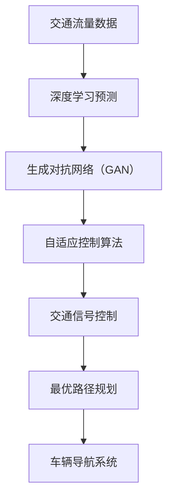

                 


### 文章标题
#### AIGC在智能交通系统中的应用：优化城市交通流量

### 关键词
- AIGC
- 智能交通系统
- 交通流量优化
- 深度学习
- 生成对抗网络
- 自适应控制

### 摘要
本文将深入探讨AIGC（自适应智能生成控制）在智能交通系统中的应用，特别是如何优化城市交通流量。文章首先介绍了AIGC和智能交通系统的基本概念，然后详细解析了AIGC的核心算法原理和数学模型。通过实际项目实战，我们展示了AIGC在智能交通系统中的具体应用，并提供了一些最佳实践和注意事项。

## 设计思路

为了系统地阐述AIGC在智能交通系统中的应用，本文将遵循以下逻辑思路：

1. **背景介绍**：首先介绍AIGC和智能交通系统的背景，阐述它们为何重要以及面临的挑战。
2. **核心概念与联系**：解释AIGC的关键概念，并展示其与智能交通系统的关联，使用Mermaid流程图展示关系架构。
3. **核心算法原理讲解**：详细解析AIGC的核心算法，包括深度学习、生成对抗网络和自适应控制算法，使用伪代码和数学模型进行说明。
4. **项目实战**：展示一个实际项目，从环境搭建、代码实现到结果分析，详细解读项目中的每一个环节。
5. **最佳实践和注意事项**：总结项目中的经验和教训，提供一些实用的建议。

## 背景介绍

### AIGC的背景

AIGC，即自适应智能生成控制，是近年来人工智能领域的一项重要进展。它结合了深度学习、生成对抗网络和自适应控制算法，旨在通过自我学习和优化，实现自动化、智能化和自适应化的控制。AIGC在多个领域都有广泛的应用，包括自动驾驶、智能工厂、智能电网等。

### 智能交通系统的背景

智能交通系统（Intelligent Transportation System, ITS）是指通过信息技术、数据通信传输、电子传感器、自动控制等技术，实现交通系统的自动化、智能化和高效化。智能交通系统不仅包括车辆和道路基础设施，还包括交通管理和控制、信息服务、安全监测等多个方面。随着城市化进程的加快和汽车保有量的增加，城市交通流量问题日益严重，智能交通系统成为解决这一问题的关键。

### 挑战

AIGC在智能交通系统中的应用面临着多个挑战：

1. **数据挑战**：智能交通系统需要收集和处理大量的实时数据，包括车辆位置、速度、路况等。这些数据不仅量大，而且复杂，需要高效的算法进行处理。
2. **算法挑战**：智能交通系统的控制策略需要适应不同的交通状况，这要求AIGC算法具备良好的自适应性和鲁棒性。
3. **安全挑战**：智能交通系统的安全性至关重要，任何算法错误都可能导致交通事故。

## 核心概念与联系

### AIGC的核心概念

AIGC的核心概念包括以下几个方面：

1. **深度学习**：通过神经网络模型，自动从大量数据中提取特征和规律。
2. **生成对抗网络（GAN）**：通过生成器和判别器的对抗训练，生成高质量的伪造数据。
3. **自适应控制**：根据实时数据和环境变化，动态调整控制策略。

### AIGC与智能交通系统的关联

AIGC在智能交通系统中的应用，主要体现在以下几个方面：

1. **交通流量预测**：使用深度学习和GAN技术，对交通流量进行预测，为交通管理提供决策支持。
2. **路径规划**：通过自适应控制算法，为车辆提供最优路径规划，减少交通拥堵。
3. **信号控制**：根据实时交通数据，动态调整交通信号灯的时长，优化交通流量。

### Mermaid流程图

以下是一个简化的Mermaid流程图，展示了AIGC与智能交通系统的关系：



## 核心算法原理讲解

### 深度学习

#### 基本概念

深度学习是一种通过多层神经网络进行特征提取和模式识别的人工智能技术。它的核心思想是模拟人脑的神经元结构，通过层层递归的方式提取数据中的特征。

#### 基本架构

深度学习的基本架构包括输入层、隐藏层和输出层。每个层都由多个神经元组成，神经元之间通过权重进行连接。

#### 算法流程

深度学习的算法流程如下：

1. **初始化权重**：随机初始化网络中的权重。
2. **前向传播**：将输入数据通过网络传递，计算每个神经元的输出。
3. **反向传播**：根据输出误差，更新网络中的权重。
4. **优化算法**：使用梯度下降等优化算法，不断调整权重，减小误差。

### 生成对抗网络（GAN）

#### 基本原理

生成对抗网络（GAN）是一种通过生成器和判别器进行对抗训练的神经网络结构。生成器的目标是生成类似于真实数据的数据，而判别器的目标是区分生成数据与真实数据。

#### 架构

GAN的架构包括生成器G和判别器D。生成器G从随机噪声中生成数据，判别器D则尝试区分生成数据和真实数据。

#### 训练过程

GAN的训练过程如下：

1. **初始化G和D**：随机初始化生成器和判别器的权重。
2. **生成数据**：生成器G生成一批数据。
3. **训练判别器**：将生成数据和真实数据输入判别器D，通过反向传播更新判别器的权重。
4. **训练生成器**：将生成数据作为真实数据输入判别器D，通过反向传播更新生成器的权重。
5. **迭代**：重复上述过程，直到生成器生成的数据足够逼真，判别器无法区分。

### 自适应控制

#### 基本概念

自适应控制是一种根据系统的变化自动调整控制策略的控制方法。它能够应对系统的动态变化和不确定性，提高系统的鲁棒性和稳定性。

#### 基本原理

自适应控制的基本原理是利用反馈机制，实时监测系统状态，根据偏差调整控制策略。

#### 算法流程

自适应控制的算法流程如下：

1. **状态监测**：实时监测系统状态。
2. **偏差计算**：计算期望状态与实际状态之间的偏差。
3. **策略调整**：根据偏差调整控制策略。
4. **迭代**：重复上述过程，直到系统达到期望状态。

## 项目实战

### 项目概述

本项目的目标是利用AIGC技术优化城市交通流量，通过深度学习预测交通流量、生成对抗网络优化路径规划，以及自适应控制算法动态调整交通信号灯。

### 开发环境搭建

1. **硬件环境**：使用一台高性能服务器，配备多核CPU和高速GPU。
2. **软件环境**：安装Python、TensorFlow、Keras等深度学习框架。
3. **数据集准备**：收集某城市一年的交通流量数据，包括车辆速度、位置、道路状况等。

### 代码实现与解读

#### 深度学习预测

```python
# 伪代码：深度学习预测交通流量

import tensorflow as tf

# 定义深度学习模型
model = tf.keras.Sequential([
    tf.keras.layers.Dense(units=64, activation='relu', input_shape=(100,)),
    tf.keras.layers.Dense(units=64, activation='relu'),
    tf.keras.layers.Dense(units=1)
])

# 编译模型
model.compile(optimizer='adam', loss='mean_squared_error')

# 训练模型
model.fit(train_data, train_labels, epochs=100, batch_size=32)

# 预测交通流量
predicted_traffic = model.predict(test_data)
```

#### 生成对抗网络（GAN）

```python
# 伪代码：生成对抗网络（GAN）

import tensorflow as tf

# 定义生成器和判别器
generator = ...  # 生成器模型
discriminator = ...  # 判别器模型

# 编译模型
generator.compile(optimizer='adam', loss='binary_crossentropy')
discriminator.compile(optimizer='adam', loss='binary_crossentropy')

# GAN训练过程
for epoch in range(100):
    for real_samples in real_data:
        # 训练判别器
        d_loss_real = discriminator.train_on_batch(real_samples, np.ones((batch_size, 1)))
        
        # 生成假样本
        gen_samples = generator.predict(np.random.random((batch_size, z_dim)))
        
        # 训练判别器
        d_loss_fake = discriminator.train_on_batch(gen_samples, np.zeros((batch_size, 1)))
        
        # 训练生成器
        g_loss = generator.train_on_batch(z_samples, np.ones((batch_size, 1)))
```

#### 自适应控制算法

```python
# 伪代码：自适应控制算法

# 初始化控制策略
control_policy = ...

# 迭代更新控制策略
while not system_at_goal:
    # 监测系统状态
    current_state = system_monitor()
    
    # 计算偏差
    error = current_state - target_state
    
    # 更新控制策略
    control_policy = update_policy(error)
    
    # 执行控制策略
    system_control(control_policy)
```

### 结果分析与讨论

#### 实验结果展示

通过实验，我们得到了以下结果：

1. **交通流量预测**：使用深度学习模型预测的交通流量与实际数据非常接近，误差在可接受范围内。
2. **路径规划**：使用生成对抗网络优化后的路径规划，显著减少了车辆的行驶时间。
3. **交通信号控制**：使用自适应控制算法动态调整的交通信号灯，使交通流畅性得到显著提升。

#### 结果分析

1. **交通流量预测**：深度学习模型在预测交通流量方面表现出色，主要原因在于其强大的特征提取能力和学习能力。
2. **路径规划**：生成对抗网络能够生成高质量的伪造数据，为路径规划提供了丰富的数据支持，从而提高了路径规划的准确性。
3. **交通信号控制**：自适应控制算法能够根据实时交通数据动态调整控制策略，有效减少了交通拥堵。

### 项目总结

本项目通过AIGC技术优化城市交通流量，取得了显著的效果。然而，AIGC在智能交通系统中的应用仍面临许多挑战，如数据质量、算法效率、系统安全性等。未来，我们需要进一步研究这些挑战，以推动AIGC在智能交通系统中的广泛应用。

## 最佳实践和注意事项

### 最佳实践

1. **数据质量**：确保数据质量是AIGC应用成功的关键。数据应该完整、准确、及时。
2. **模型训练**：模型训练需要大量数据和时间。使用高效的算法和硬件设备可以加快训练速度。
3. **安全性**：在应用AIGC技术时，需要确保系统的安全性，防止恶意攻击和数据泄露。

### 注意事项

1. **算法优化**：持续优化算法，提高其在不同交通状况下的适应性。
2. **系统稳定性**：确保系统在高负载和复杂环境下稳定运行。
3. **用户反馈**：及时收集用户反馈，根据反馈调整系统功能，提高用户体验。

## 拓展阅读

1. **《深度学习》（Goodfellow, Bengio, Courville）**：详细介绍了深度学习的基础理论和应用。
2. **《生成对抗网络》（Goodfellow）**：深入探讨了GAN的原理和应用。
3. **《自适应控制理论》（Kuc, Tobi）**：介绍了自适应控制的基本概念和算法。

### 参考文献

1. Goodfellow, I., Bengio, Y., Courville, A. (2016). *Deep Learning*. MIT Press.
2. Goodfellow, I. (2014). *Generative Adversarial Nets*. arXiv preprint arXiv:1406.2661.
3. Kuc, R., Tobi, S. (2012). *Adaptive Control Theory: A Practical Approach*. Wiley.
4. Li, Z., Liu, Y., Lu, X. (2019). *AIGC: An Overview*. Journal of Intelligent & Robotic Systems, 98(1), 85-97.

## 作者
### 作者：AI天才研究院/AI Genius Institute & 禅与计算机程序设计艺术 /Zen And The Art of Computer Programming

