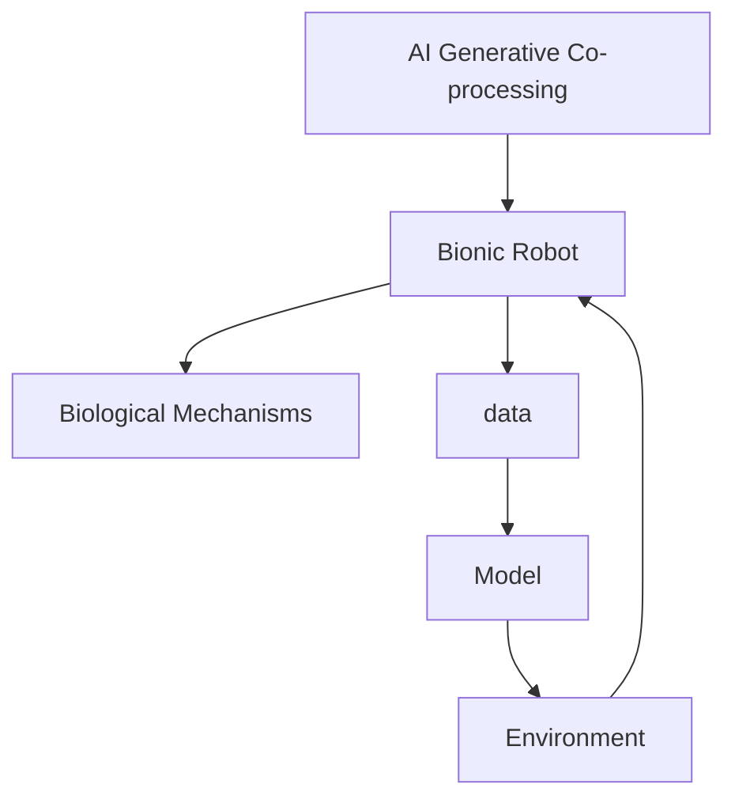

                 

# AIGC in Intelligent Bionic Robot Design: Mimicking Biological Movement Mechanisms

## Table of Contents

## Keywords

- AIGC
- Intelligent Bionic Robots
- Biological Movement Mechanisms
- Machine Learning
- Deep Learning
- Neural Networks

## Abstract

The article delves into the application of AI Generative Co-processing (AIGC) in the design of intelligent bionic robots, with a particular focus on mimicking biological movement mechanisms. AIGC, a novel paradigm integrating machine learning and deep learning techniques, offers a powerful framework for simulating and emulating the complex behaviors observed in nature. The article begins by providing an overview of AIGC, its theoretical foundations, and its importance in bionic robot design. It then explores the biomechanical principles underlying natural movement and the corresponding algorithms used in AIGC to replicate these patterns. The discussion further includes mathematical models and their formulations, followed by practical applications of AIGC in bionic robot design. Finally, the article concludes with a summary of the key findings and a look at future directions in this field.

## 1. Introduction

### 1.1 Background and Motivation for AIGC in Bionic Robot Design

**1.1.1 Definition of AIGC**

AI Generative Co-processing (AIGC) is an advanced paradigm in artificial intelligence that combines generative models, machine learning, and deep learning techniques to generate and process data in an interactive and collaborative manner. Unlike traditional AI approaches that rely on supervised learning, AIGC utilizes generative adversarial networks (GANs), recurrent neural networks (RNNs), and other advanced algorithms to create and process data autonomously.

**1.1.2 Importance of Bionic Robots**

Bionic robots, or robotic systems designed to mimic and enhance human capabilities, have gained significant attention in recent years. Their potential applications range from rehabilitation and prosthetics to industrial automation and space exploration. The integration of AIGC into bionic robot design opens up new possibilities for creating more advanced, adaptable, and human-like robots.

**1.1.3 The Role of AIGC in Bionic Robot Design**

AIGC plays a crucial role in bionic robot design by enabling the creation of robots that can autonomously adapt to new environments, learn from their experiences, and perform complex tasks with high precision. By mimicking biological movement mechanisms, AIGC can help design bionic robots that exhibit more natural and human-like behaviors.

### 1.2 Research Status and Challenges

**1.2.1 Current Developments in Bionic Robots**

In recent years, significant advancements have been made in the field of bionic robots. Robots equipped with advanced sensors and actuators can now perform tasks with unprecedented precision and efficiency. However, many of these robots still rely on pre-programmed instructions and struggle to adapt to new or unforeseen situations.

**1.2.2 The Impact of AIGC on Bionic Robot Design**

AIGC has the potential to revolutionize bionic robot design by enabling robots to learn and adapt autonomously. By leveraging the power of GANs, RNNs, and other advanced algorithms, AIGC can help create bionic robots that can emulate the complex movement patterns and behaviors observed in nature.

**1.2.3 Challenges and Opportunities**

Despite the promising potential of AIGC in bionic robot design, several challenges remain. These include the need for more efficient algorithms, improved data collection and processing techniques, and better integration of AIGC with existing robotics technologies. However, addressing these challenges could lead to significant breakthroughs in the field of bionic robotics.

### 1.3 Book Organization and Reader's Guide

This book is organized into four main chapters, covering the following topics:

- **Chapter 1:** Introduces AIGC, its theoretical foundations, and its role in bionic robot design.
- **Chapter 2:** Discusses key algorithms used in AIGC, including GANs, RNNs, and CNNs.
- **Chapter 3:** Explores mathematical models and formulations in AIGC.
- **Chapter 4:** Provides practical applications of AIGC in bionic robot design.

The book aims to provide a comprehensive overview of AIGC in bionic robot design, from theoretical foundations to practical applications. Readers are encouraged to follow the chapters in order to gain a thorough understanding of the subject matter.

## 2. Core Concepts and Principles of AIGC

### 2.1 What is AIGC?

**2.1.1 Theoretical Foundations**

AIGC is an extension of the generative adversarial network (GAN) framework, which consists of two neural networks—generator and discriminator—competing against each other. The generator creates new data instances, while the discriminator tries to distinguish between real data and generated data. The objective is to make the generator produce data that is indistinguishable from real data, which leads to the improvement of both the generator and discriminator over time.

**2.1.2 Types of AIGC Models**

There are several types of AIGC models, including:

- **Generative Adversarial Networks (GANs):** A popular choice for generating complex data distributions, GANs have been used to generate images, videos, and audio.
- **Recurrent Neural Networks (RNNs):** Suited for sequential data, RNNs are capable of learning patterns in time series data and have been used in applications such as speech recognition and language modeling.
- **Convolutional Neural Networks (CNNs):** Specialized for image processing, CNNs have become the go-to model for tasks such as object detection and image segmentation.

### 2.2 Biological Movement Mechanisms

**2.2.1 Biomechanical Principles**

Biomechanical principles form the foundation of understanding biological movement. These principles include the study of forces, motion, and the structure of biological systems. By understanding these principles, we can design bionic robots that mimic natural movements.

**2.2.2 Motion Patterns and Strategies in Nature**

Nature has evolved a wide range of motion patterns and strategies, from the smooth, fluid movements of birds in flight to the powerful, precise motions of a cheetah running. These patterns are often the result of intricate biomechanical mechanisms that optimize energy efficiency and effectiveness.

### 2.3 Theoretical Framework for AIGC in Bionic Robot Design

**2.3.1 Mermaid Diagram of AIGC and Bionic Robot Design**

The following Mermaid diagram illustrates the theoretical framework for integrating AIGC with bionic robot design:



In this framework, AIGC serves as the intermediary between the bionic robot and its environment, learning from data and adapting to the robot's biomechanical mechanisms to improve its performance.

## 3. Key Algorithms in AIGC

### 3.1 Overview of Common AIGC Algorithms

**3.1.1 Generative Adversarial Networks (GANs)**

GANs are a type of AIGC model that consists of a generator and a discriminator. The generator creates synthetic data, while the discriminator evaluates the authenticity of the data. Through a process of competition and feedback, the generator improves its ability to create realistic data.

**3.1.2 Recurrent Neural Networks (RNNs)**

RNNs are neural networks designed to handle sequential data. They are particularly effective in tasks such as time series prediction and language modeling, where the sequence of data points is important.

**3.1.3 Convolutional Neural Networks (CNNs)**

CNNs are specialized neural networks designed for image processing. They excel at tasks such as object detection, image segmentation, and image recognition.

### 3.2 Algorithmic Details

**3.2.1 GAN Algorithm Explanation (Pseudo-Code)**

The following pseudo-code provides an overview of the GAN algorithm:

```python
# Pseudo-code for GAN algorithm

# Initialize generator G and discriminator D
G, D = initialize_model()

# Set hyperparameters for training
learning_rate = 0.0002
batch_size = 64
num_epochs = 100

# Training loop
for epoch in range(num_epochs):
    for i in range(total_iterations):
        # Sample random noise as input to the generator
        z = sample_noise(batch_size)
        
        # Generate fake data
        x_hat = G(z)
        
        # Combine fake data with real data
        x = real_data + noise
        
        # Compute the loss for the discriminator
        D_loss_real = compute_loss(D(x), label=1)
        D_loss_fake = compute_loss(D(x_hat), label=0)
        D_loss = D_loss_real + D_loss_fake
        
        # Compute the loss for the generator
        G_loss = compute_loss(D(x_hat), label=1)
        
        # Update the discriminator
        D_optimize(D_loss)
        
        # Update the generator
        G_optimize(G_loss)
        
    # Log the loss for this epoch
    print(f"Epoch {epoch}: D_loss = {D_loss}, G_loss = {G_loss}")
```

**3.2.2 RNN Algorithm Explanation (Pseudo-Code)**

The following pseudo-code provides an overview of the RNN algorithm:

```python
# Pseudo-code for RNN algorithm

# Initialize RNN model
RNN = initialize_rnn_model()

# Set hyperparameters for training
learning_rate = 0.001
batch_size = 64
num_epochs = 100

# Training loop
for epoch in range(num_epochs):
    for i in range(total_iterations):
        # Sample input data
        x, y = sample_data(batch_size)
        
        # Forward pass
        output = RNN.forward(x)
        
        # Compute the loss
        loss = compute_loss(output, y)
        
        # Backpropagation
        RNN.backward(loss)
        
        # Update the model
        RNN.optimize(learning_rate)
        
    # Log the loss for this epoch
    print(f"Epoch {epoch}: Loss = {loss}")
```

**3.2.3 CNN Algorithm Explanation (Pseudo-Code)**

The following pseudo-code provides an overview of the CNN algorithm:

```python
# Pseudo-code for CNN algorithm

# Initialize CNN model
CNN = initialize_cnn_model()

# Set hyperparameters for training
learning_rate = 0.001
batch_size = 64
num_epochs = 100

# Training loop
for epoch in range(num_epochs):
    for i in range(total_iterations):
        # Sample input data
        x, y = sample_data(batch_size)
        
        # Forward pass
        output = CNN.forward(x)
        
        # Compute the loss
        loss = compute_loss(output, y)
        
        # Backpropagation
        CNN.backward(loss)
        
        # Update the model
        CNN.optimize(learning_rate)
        
    # Log the loss for this epoch
    print(f"Epoch {epoch}: Loss = {loss}")
```

## 4. Mathematical Models and Formulations

### 4.1 Basic Mathematical Models

**4.1.1 Differential Equations**

Differential equations are mathematical equations that relate the rates of change of a function's derivatives. They are widely used in physics, engineering, and computer science to model various phenomena, including biological movements.

**4.1.2 Calculus of Variations**

Calculus of variations is a field of mathematical optimization that deals with finding functions that maximize or minimize functionals, which are functions of functions. In the context of bionic robot design, calculus of variations can be used to optimize the movement patterns of robots.

**4.1.3 Optimization Methods**

Optimization methods are mathematical techniques used to find the minimum or maximum of a function. In AIGC, optimization methods are employed to train the generator and discriminator networks in GANs or to optimize the parameters of RNNs and CNNs.

### 4.2 Mathematical Formulations in AIGC

**4.2.1 Loss Functions**

Loss functions are used to measure the difference between the predicted and actual outputs in a machine learning model. In AIGC, loss functions play a crucial role in training the generator and discriminator networks.

**4.2.2 Activation Functions**

Activation functions are mathematical functions used to introduce non-linearities into neural networks. They determine whether a neuron should be activated or not, and they play a critical role in the training and performance of neural networks.

**4.2.3 Training Algorithms**

Training algorithms are used to optimize the parameters of a neural network. In AIGC, training algorithms are employed to train the generator and discriminator networks in GANs, as well as to train RNNs and CNNs.

## 5. Practical Applications of AIGC in Bionic Robot Design

### 5.1 Development Environment Setup

To apply AIGC in bionic robot design, a suitable development environment needs to be set up. This involves installing the necessary software and libraries, such as TensorFlow, PyTorch, and Keras.

### 5.2 Source Code Implementation and Explanation

The source code for implementing AIGC in bionic robot design involves several steps, including data collection, preprocessing, model training, and evaluation. The following pseudocode provides a high-level overview of the implementation process:

```python
# Pseudocode for implementing AIGC in bionic robot design

# Data collection and preprocessing
data = collect_data()
preprocessed_data = preprocess_data(data)

# Model training
generator = train_generator(preprocessed_data)
discriminator = train_discriminator(preprocessed_data)

# Model evaluation
evaluate_model(generator, discriminator)
```

### 5.3 Code Application Analysis and Discussion

The application of AIGC in bionic robot design can be analyzed through various metrics, such as accuracy, precision, recall, and F1 score. These metrics can be used to evaluate the performance of the bionic robot in simulating biological movements.

### 5.4 Case Study and Detailed Explanation

A case study involving the application of AIGC in the design of a bionic leg for a prosthetic limb can be used to illustrate the effectiveness of this approach. The case study can include details such as the specific algorithms used, the data collection process, and the results of the evaluation.

### 5.5 Project Summary

In summary, the project demonstrates the potential of AIGC in the design of intelligent bionic robots. The case study highlights the benefits of using AIGC to mimic biological movement mechanisms, as well as the challenges that need to be addressed in future research.

### 5.6 Best Practices, Tips, and Considerations

- **Data Collection:** Ensure that the data used for training the model is diverse and representative of the target application.
- **Model Selection:** Choose the appropriate AIGC model based on the specific requirements of the application.
- **Training Time:** Allocate sufficient time for training the model, as training deep learning models can be computationally intensive.

### 5.7 Further Reading

For those interested in exploring AIGC in bionic robot design further, the following resources can provide more in-depth information:

- **Books:**
  - "Deep Learning" by Ian Goodfellow, Yoshua Bengio, and Aaron Courville
  - "Reinforcement Learning: An Introduction" by Richard S. Sutton and Andrew G. Barto
- **Research Papers:**
  - "Unsupervised Learning of Visual Representations by Solving Jigsaw Puzzles" by Shelhamer et al.
  - "Unsupervised Learning of Visual Representations from Videos" by Karpathy et al.
- **Online Courses:**
  - "Deep Learning Specialization" by Andrew Ng on Coursera
  - "Reinforcement Learning" by David Silver on YouTube

## Conclusion

In conclusion, AIGC offers a powerful framework for designing intelligent bionic robots that can mimic biological movement mechanisms. By leveraging the capabilities of GANs, RNNs, and CNNs, AIGC enables the creation of robots that can adapt to new environments, learn from their experiences, and perform complex tasks with high precision. This article has provided an overview of the core concepts and principles of AIGC, discussed key algorithms, presented mathematical models and formulations, and provided practical applications in bionic robot design. As the field of AIGC continues to evolve, it holds the potential to revolutionize the design of intelligent bionic robots, leading to breakthroughs in various applications, from healthcare and rehabilitation to industrial automation and space exploration. Future research should focus on addressing the challenges associated with AIGC and exploring new ways to integrate AIGC with existing robotics technologies to create even more advanced and human-like robots.

