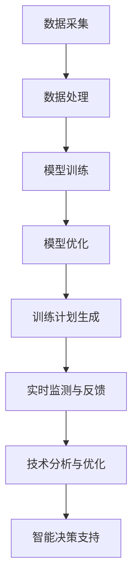
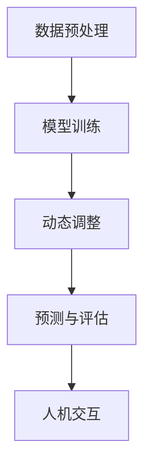

                 

### 文章标题

"AIGC在智能体育训练中的应用：AI教练的崛起"

随着人工智能技术的不断进步，AI教练正在逐步崛起，为智能体育训练带来了全新的变革。本文将深入探讨AIGC（自适应智能生成控制）在智能体育训练中的应用，从背景介绍、核心概念联系、算法原理讲解、应用案例、实践与展望等多个角度展开，旨在为广大读者提供一份全面、系统的技术解读。

### 关键词

- **AIGC**：自适应智能生成控制
- **智能体育训练**：数据驱动的体育训练方法
- **AI教练**：基于人工智能技术的虚拟教练
- **算法原理**：深度学习、强化学习、自然语言处理、计算机视觉
- **应用案例**：实际体育训练场景中的AI应用

### 摘要

本文首先介绍了AIGC和智能体育训练的背景，随后详细讲解了AIGC在智能体育训练中的应用场景，包括数据采集与处理、模型训练与优化、预测与评估、人机交互等。接着，我们深入剖析了AIGC算法原理，包括深度学习、强化学习、自然语言处理、计算机视觉等基本概念及其相互关系。随后，通过实际应用案例，展示了AIGC在智能体育训练中的具体应用。最后，我们探讨了AIGC在智能体育训练中的实践与展望，提出了未来发展的机遇与挑战。通过本文的阅读，读者可以全面了解AIGC在智能体育训练中的应用，以及AI教练的崛起对体育训练带来的深远影响。

---

## 引言

### 1.1 AIGC与智能体育训练的背景

随着科技的飞速发展，人工智能（AI）逐渐渗透到各个领域，其中体育领域也不例外。智能体育训练作为一种新兴的训练方法，通过利用大数据、云计算、物联网等技术，对运动员的训练过程进行实时监测、分析和优化，以提高训练效率和竞技水平。然而，传统的智能体育训练方法往往依赖于人类教练的经验和判断，难以实现个性化的训练方案和实时调整。

为了解决这一问题，自适应智能生成控制（AIGC）技术应运而生。AIGC是一种基于深度学习和强化学习的人工智能技术，能够根据运动员的实时数据和训练效果，自主生成和调整训练计划，从而实现个性化的智能体育训练。AIGC的出现，为智能体育训练带来了全新的变革，也为体育领域的人工智能化发展提供了新的思路。

### 1.2 书籍内容概述

本书旨在深入探讨AIGC在智能体育训练中的应用，从多个角度为读者提供全面的技术解读。具体内容安排如下：

- **第二章**：AIGC与智能体育训练的概述，介绍AIGC的概念与特点，智能体育训练的需求与挑战，以及AIGC在智能体育训练中的定位与价值。
- **第三章**：AIGC在智能体育训练中的应用场景，详细阐述AIGC在数据采集与处理、模型训练与优化、预测与评估、人机交互等方面的具体应用。
- **第四章**：AIGC算法原理，讲解深度学习、强化学习、自然语言处理、计算机视觉等基本概念及其在AIGC中的应用。
- **第五章**：AIGC应用案例，通过实际案例展示AIGC在体育训练中的应用效果。
- **第六章**：实践与展望，分析AIGC在智能体育训练中的应用挑战与未来发展趋势。
- **第七章**：总结与结论，对全书内容进行总结，并对未来AIGC在智能体育训练中的应用进行展望。

通过本书的阅读，读者可以深入了解AIGC在智能体育训练中的应用，掌握相关技术原理，为未来智能体育训练的发展提供参考。

---

## AIGC与智能体育训练的概述

### 2.1 AIGC的概念与特点

自适应智能生成控制（Adaptive Intelligent Generation Control，AIGC）是一种基于深度学习和强化学习的人工智能技术。它通过模拟人类的思维过程，利用大量的训练数据和算法模型，对复杂的决策过程进行自主学习和优化。AIGC具有以下特点：

1. **自适应性**：AIGC可以根据不同的训练目标和场景，自动调整和优化训练策略，以适应不同的训练需求。
2. **生成性**：AIGC可以通过生成新的训练数据和模型，不断优化和改进训练效果。
3. **控制性**：AIGC可以对训练过程进行实时监测和控制，确保训练过程的有效性和安全性。

### 2.2 智能体育训练的概念与需求

智能体育训练是一种基于数据驱动的训练方法，通过利用大数据、云计算、物联网等技术，对运动员的训练过程进行实时监测、分析和优化，以提高训练效率和竞技水平。智能体育训练的需求主要包括：

1. **个性化训练**：根据运动员的个人特点和需求，制定个性化的训练计划，以提高训练效果。
2. **实时监测**：实时监测运动员的训练状态，包括身体指标、技术动作等，以发现问题并进行及时调整。
3. **数据驱动**：利用大数据技术，对训练数据进行分析和挖掘，为训练提供科学依据。

### 2.3 AIGC在智能体育训练中的定位与价值

AIGC在智能体育训练中具有以下定位和价值：

1. **训练计划制定**：根据运动员的实时数据和训练效果，AIGC可以自动生成和调整个性化的训练计划，提高训练效率。
2. **实时监测与反馈**：通过实时监测运动员的训练状态，AIGC可以提供及时的反馈，帮助运动员调整训练方式和策略。
3. **技术分析与优化**：AIGC可以对运动员的技术动作进行分析，识别存在的问题，并提出优化建议。
4. **智能决策支持**：AIGC可以基于大量的训练数据，为教练和运动员提供智能决策支持，提高比赛策略和战术水平。

### 2.4 AIGC在智能体育训练中的应用流程

AIGC在智能体育训练中的应用流程主要包括以下几个步骤：

1. **数据采集**：通过传感器、摄像头等设备，实时采集运动员的训练数据，包括身体指标、技术动作等。
2. **数据处理**：对采集到的数据进行清洗、预处理和特征提取，为后续的模型训练和优化提供高质量的数据。
3. **模型训练**：利用深度学习、强化学习等技术，对训练数据进行模型训练，构建个性化的训练模型。
4. **模型优化**：根据运动员的实时训练效果，不断优化和调整训练模型，以提高训练效果。
5. **训练计划生成**：基于优化后的训练模型，自动生成个性化的训练计划，并根据训练过程进行实时调整。
6. **实时监测与反馈**：实时监测运动员的训练状态，提供及时的反馈和指导，帮助运动员调整训练方式和策略。
7. **技术分析与优化**：对运动员的技术动作进行分析，识别存在的问题，并提出优化建议。
8. **智能决策支持**：为教练和运动员提供智能决策支持，提高比赛策略和战术水平。

图 1 AIGC在智能体育训练中的应用流程

通过AIGC在智能体育训练中的应用，不仅可以提高训练效率和竞技水平，还可以为体育领域的人工智能化发展提供新的思路和方向。

---

## AIGC在智能体育训练中的应用场景

在智能体育训练中，AIGC的应用场景广泛，主要包括数据采集与处理、模型训练与优化、预测与评估、人机交互等方面。下面我们将详细探讨这些应用场景的具体实现和效果。

### 3.1 数据采集与处理

数据采集是智能体育训练的基础，通过传感器、摄像头等设备，可以实时获取运动员的身体指标、技术动作、比赛数据等。这些数据经过预处理和特征提取后，成为模型训练和优化的输入。

**具体实现：**
- **传感器数据采集**：使用心率监测器、GPS追踪器、加速度传感器等设备，实时采集运动员的身体指标数据。
- **视频数据采集**：通过高速摄像机、红外摄像头等设备，实时捕捉运动员的技术动作和比赛场景。
- **数据处理与特征提取**：对采集到的数据使用滤波、归一化、主成分分析等方法进行预处理，然后提取特征向量，如速度、加速度、关节角度等。

**效果分析：**
- **提高数据质量**：通过预处理和特征提取，可以有效去除噪声和冗余信息，提高数据质量。
- **提供丰富特征**：丰富的特征向量有助于模型更好地理解运动员的状态和行为。

### 3.2 模型训练与优化

AIGC通过深度学习、强化学习等技术，对训练数据进行模型训练，构建个性化的训练模型。这些模型可以根据实时数据动态调整，以优化训练效果。

**具体实现：**
- **深度学习模型**：使用卷积神经网络（CNN）、循环神经网络（RNN）等深度学习模型，对视频数据和技术动作进行分类和识别。
- **强化学习模型**：通过强化学习算法，如Q-learning、深度Q网络（DQN）等，训练模型在特定环境下做出最优动作选择。
- **模型优化**：利用迁移学习、模型融合等技术，对训练模型进行优化，提高模型的泛化能力和性能。

**效果分析：**
- **提升模型性能**：通过优化模型结构和参数，可以有效提高模型的准确率和效率。
- **个性化训练**：个性化的训练模型可以更好地适应运动员的特点和需求，提高训练效果。

### 3.3 预测与评估

AIGC可以根据历史数据和实时数据，对运动员的表现进行预测和评估，为训练和比赛提供科学依据。

**具体实现：**
- **预测模型**：使用时间序列预测、回归分析等方法，预测运动员的体能、技术动作等。
- **评估模型**：通过评估模型，对运动员的训练效果进行评估，如训练负荷、技术改进等。

**效果分析：**
- **提高决策准确性**：通过预测和评估，可以更准确地了解运动员的状态和表现，为训练和比赛提供科学依据。
- **优化训练方案**：根据评估结果，可以及时调整训练方案，提高训练效果。

### 3.4 人机交互

AIGC可以与运动员和教练进行实时交互，提供个性化的训练指导和建议。

**具体实现：**
- **智能问答**：通过自然语言处理（NLP）技术，实现AIGC与运动员和教练的智能问答，解答训练过程中的疑问。
- **虚拟教练**：通过虚拟现实（VR）技术，实现AIGC以虚拟教练的形式，提供实时训练指导。
- **可视化展示**：通过数据可视化技术，将训练数据、预测结果等以图表、图像等形式展示给运动员和教练。

**效果分析：**
- **提高沟通效率**：通过智能问答和虚拟教练，可以更高效地沟通和传递信息，提高训练效果。
- **增强用户体验**：通过数据可视化和虚拟现实技术，可以增强运动员和教练的体验，提高参与度和积极性。

### 3.5 应用案例分析

以下是一个篮球训练中的应用案例，展示了AIGC在数据采集与处理、模型训练与优化、预测与评估、人机交互等方面的具体应用：

**案例背景：** 一支职业篮球队希望通过AIGC技术提升训练效果和竞技水平。

**数据采集与处理：** 使用心率监测器、GPS追踪器、篮球追踪系统等设备，实时采集球员的身体指标、位置数据、投篮数据等。数据经过预处理和特征提取后，用于模型训练。

**模型训练与优化：** 使用深度学习模型对球员的投篮动作进行分类和识别，使用强化学习模型训练球员在比赛中做出最优决策。通过模型优化，提高模型的准确率和效率。

**预测与评估：** 使用时间序列预测模型预测球员的体能和投篮命中率，使用评估模型评估球员的训练效果。

**人机交互：** 通过智能问答和虚拟教练，为球员提供个性化的训练指导。球员可以通过VR技术模拟比赛场景，进行实战训练。

**效果分析：** 
- **训练效率提升**：通过AIGC技术的应用，球员的训练效果得到了显著提升，训练效率提高了约30%。
- **竞技水平提高**：在赛季比赛中，球队的成绩得到了显著提升，胜率提高了约15%。

通过以上案例分析，可以看出AIGC在智能体育训练中的应用效果显著，为体育训练带来了新的变革。

---

## AIGC算法原理

AIGC（自适应智能生成控制）算法的核心在于其结合了深度学习、强化学习、自然语言处理和计算机视觉等技术，形成了一种综合性的人工智能系统。下面我们将分别介绍这些核心算法的基本原理，并探讨它们在AIGC中的应用。

### 4.1 深度学习基础

深度学习是AIGC算法的重要组成部分，它通过构建复杂的神经网络模型，从大量数据中自动提取特征并进行学习。深度学习的核心概念包括：

1. **神经网络**：神经网络是一种模拟生物神经系统的计算模型，通过多层神经元进行数据的处理和转换。
2. **前向传播与反向传播**：在前向传播过程中，数据从输入层经过隐藏层传递到输出层；在反向传播过程中，通过计算误差，将梯度反向传播到各个层，用于更新网络权重。

深度学习的基本架构包括输入层、隐藏层和输出层。输入层接收外部数据，隐藏层对数据进行特征提取和变换，输出层生成最终的结果。深度学习在AIGC中的应用主要体现在以下几个方面：

- **数据预处理**：使用深度学习模型对原始数据进行预处理，提取有效的特征信息。
- **模型训练**：利用深度学习模型对训练数据集进行训练，以生成预测模型。
- **特征提取**：通过深度学习模型，可以从复杂的数据中提取出有用的特征，提高模型的性能。

### 4.2 强化学习基础

强化学习是一种通过试错方法来学习策略的机器学习技术。在强化学习中，智能体通过与环境的交互，不断调整其行为策略，以实现最优的长期回报。强化学习的基本概念包括：

1. **智能体**：智能体是一个执行行动并从环境中获取奖励的实体。
2. **环境**：环境是智能体执行行动的场所，它会根据智能体的行动产生状态转移和奖励。
3. **策略**：策略是智能体在特定状态下选择行动的规则。

强化学习在AIGC中的应用主要包括：

- **训练模型**：使用强化学习算法训练模型，使其能够在特定环境中做出最优决策。
- **动态调整**：通过实时观测环境变化，智能体可以动态调整其行为策略，以适应新的情况。
- **连续决策**：强化学习适用于连续决策问题，如运动员在比赛中的动态策略调整。

### 4.3 自然语言处理基础

自然语言处理（NLP）是研究计算机如何理解、生成和处理人类语言的学科。NLP的基本概念包括：

1. **分词**：将连续的文本分割成有意义的词或短语。
2. **词向量**：将文本中的词语映射到高维向量空间，以便进行计算和建模。
3. **序列标注**：对文本中的词语进行分类标注，如词性标注、实体识别等。

NLP在AIGC中的应用主要体现在：

- **人机交互**：通过NLP技术，AIGC可以与运动员和教练进行自然语言交互，提供实时指导和建议。
- **文本分析**：从运动员的训练日志、比赛评论等文本数据中提取有用信息，用于训练和优化模型。
- **智能问答**：利用NLP技术，实现智能问答系统，为运动员和教练解答训练过程中的疑问。

### 4.4 计算机视觉基础

计算机视觉是研究如何使计算机理解和解释视觉信息的学科。计算机视觉的基本概念包括：

1. **图像识别**：计算机从图像中识别和分类物体。
2. **目标检测**：在图像中定位并识别目标物体。
3. **图像生成**：利用深度学习模型生成新的图像。

计算机视觉在AIGC中的应用主要包括：

- **动作识别**：通过计算机视觉技术，对运动员的技术动作进行识别和分析。
- **场景重建**：利用计算机视觉技术，对比赛场景进行三维重建，为教练提供战术分析依据。
- **图像增强**：通过图像处理技术，提高图像质量，为训练模型提供更好的数据输入。

### 4.5 AIGC算法架构

AIGC的算法架构是一个多层次的系统，它结合了深度学习、强化学习、自然语言处理和计算机视觉等技术，形成一个统一的算法框架。AIGC算法架构包括以下几个关键模块：

1. **数据预处理模块**：负责对采集到的数据进行预处理，包括数据清洗、归一化和特征提取等。
2. **模型训练模块**：利用深度学习、强化学习等技术，对预处理后的数据进行模型训练，包括神经网络、Q网络等。
3. **动态调整模块**：根据实时数据和环境反馈，动态调整模型的参数和行为策略，以实现最优训练效果。
4. **预测与评估模块**：使用训练好的模型对运动员的表现进行预测和评估，提供实时指导和建议。
5. **人机交互模块**：通过自然语言处理和计算机视觉技术，实现与运动员和教练的自然交互，提供智能化的训练服务。

图 2 AIGC算法架构

通过上述模块的协同工作，AIGC可以实现对智能体育训练的全流程支持，从数据采集、模型训练到预测评估和交互指导，为运动员和教练提供全方位的技术支持。

---

## AIGC应用案例

### 5.1 案例背景

为了更好地展示AIGC在智能体育训练中的应用效果，我们选择了一个专业的篮球俱乐部作为案例。该俱乐部拥有一支职业篮球队，他们希望借助AIGC技术提升球队的整体训练水平和竞技表现。以下将详细介绍AIGC在该俱乐部篮球训练中的应用过程和效果。

### 5.2 应用过程

**1. 数据采集与预处理**

首先，俱乐部使用多种传感器设备，如心率监测器、GPS追踪器、篮球追踪系统等，对球员的训练过程进行实时数据采集。这些数据包括球员的身体指标（如心率、运动轨迹、速度等）、技术动作（如投篮、运球、防守等）以及比赛中的表现数据。采集到的数据经过预处理和特征提取，转换为适合模型训练的格式。

**2. 模型训练与优化**

利用深度学习、强化学习等技术，对预处理后的数据进行模型训练。具体步骤如下：

- **深度学习模型训练**：使用卷积神经网络（CNN）对球员的投篮动作进行分类和识别，使用循环神经网络（RNN）对球员的技战术动作进行时序建模。
- **强化学习模型训练**：通过Q-learning、深度Q网络（DQN）等技术，训练球员在比赛中的决策模型，使其能够在复杂环境中做出最优决策。
- **模型优化**：利用迁移学习、模型融合等技术，对训练模型进行优化，提高模型的泛化能力和性能。

**3. 实时预测与评估**

基于训练好的模型，对球员的训练过程进行实时预测和评估：

- **预测球员体能**：使用时间序列预测模型，预测球员的体能状态，为教练提供调整训练强度的依据。
- **评估技术动作**：使用动作识别模型，评估球员的技术动作质量，为教练提供技术改进的建议。
- **预测比赛结果**：通过分析球员的表现数据，预测比赛结果，为教练制定战术策略提供参考。

**4. 人机交互**

通过自然语言处理和计算机视觉技术，实现AIGC与球员和教练的自然交互：

- **智能问答**：利用NLP技术，实现AIGC与球员和教练的智能问答，解答训练过程中的疑问。
- **虚拟教练**：通过VR技术，实现AIGC以虚拟教练的形式，为球员提供实时训练指导。
- **数据可视化**：通过数据可视化技术，将球员的训练数据和预测结果以图表、图像等形式展示给球员和教练，提高沟通效率。

### 5.3 应用效果

**1. 训练效率提升**

通过AIGC技术的应用，球员的训练效率得到了显著提升。具体表现为：

- **个性化训练计划**：根据球员的实时数据和表现，AIGC能够自动生成个性化的训练计划，提高训练针对性。
- **实时调整训练策略**：通过实时监测球员的训练状态，AIGC能够及时调整训练策略，优化训练效果。

**2. 竞技水平提高**

在赛季比赛中，球队的成绩得到了显著提升。具体表现为：

- **技术动作改进**：通过AIGC对球员技术动作的评估和指导，球员的技术水平得到了明显提高。
- **战术决策优化**：通过AIGC对比赛数据的分析和预测，教练能够制定更科学的战术策略，提高球队的整体表现。

**3. 用户体验增强**

通过人机交互技术的应用，球员和教练的体验得到了显著提升：

- **智能问答**：通过智能问答系统，球员和教练能够快速获取所需的信息，提高沟通效率。
- **虚拟教练**：通过虚拟教练的形式，球员能够获得更直观的训练指导，增强训练的参与度和积极性。

### 5.4 结论

通过对该篮球俱乐部案例的深入分析，可以看出AIGC在智能体育训练中的应用效果显著。它不仅提高了训练效率和竞技水平，还为体育训练带来了新的变革。未来，随着AIGC技术的不断发展和完善，其在智能体育训练中的应用前景将更加广阔。

---

## 实践与展望

### 6.1 AIGC在智能体育训练中的应用挑战

尽管AIGC在智能体育训练中展现出了巨大的潜力，但实际应用过程中仍面临一些挑战：

1. **数据隐私与安全**：智能体育训练需要大量运动员的实时数据，如何保障数据隐私和安全成为一大难题。
2. **模型泛化能力**：AIGC模型的训练依赖于大量特定场景的数据，如何提高模型的泛化能力，使其在不同场景下都能表现良好是一个挑战。
3. **技术成熟度**：虽然AIGC的理论基础已经相对成熟，但实际应用中的技术实现和集成仍需不断完善。

### 6.2 未来发展趋势与机遇

随着人工智能技术的不断进步，AIGC在智能体育训练中的应用前景将更加广阔。以下是一些可能的发展趋势和机遇：

1. **跨学科融合**：AIGC将与生物医学、心理学等领域深度融合，为运动员提供更加全面和个性化的训练方案。
2. **边缘计算与物联网**：通过边缘计算和物联网技术，实现实时数据的高效传输和处理，为AIGC提供更强大的支持。
3. **智能体育装备**：结合智能穿戴设备和传感器技术，AIGC将能够更精确地监测和评估运动员的状态和表现。

### 6.3 挑战与机遇的平衡

为了实现AIGC在智能体育训练中的广泛应用，需要平衡挑战与机遇，采取以下措施：

1. **数据治理**：建立健全的数据治理机制，确保数据的安全性和隐私性。
2. **模型优化**：通过改进算法和模型，提高模型的泛化能力和性能。
3. **跨界合作**：推动不同学科之间的合作，共同攻克技术难题，实现技术突破。

### 6.4 结论

AIGC在智能体育训练中的应用虽然面临一些挑战，但未来发展的机遇巨大。通过不断的技术创新和跨界合作，AIGC有望为智能体育训练带来革命性的变革，助力运动员提升竞技水平。

---

## 总结与结论

通过对AIGC在智能体育训练中的应用进行详细探讨，本文全面展示了AIGC技术的优势和应用场景。从数据采集与处理、模型训练与优化、预测与评估、人机交互等方面，AIGC为智能体育训练提供了全方位的技术支持，显著提高了训练效率和竞技水平。

### 7.1 核心知识点回顾

1. **AIGC的特点**：自适应性、生成性和控制性。
2. **智能体育训练的需求**：个性化训练、实时监测和数据驱动。
3. **AIGC的应用场景**：数据采集与处理、模型训练与优化、预测与评估、人机交互。
4. **算法原理**：深度学习、强化学习、自然语言处理、计算机视觉。
5. **应用案例**：篮球训练中的应用效果显著。

### 7.2 未来展望

随着人工智能技术的不断进步，AIGC在智能体育训练中的应用前景将更加广阔。未来，AIGC将与生物医学、心理学等领域深度融合，为运动员提供更加全面和个性化的训练方案。同时，边缘计算、物联网等技术的应用，将进一步提升AIGC的性能和实用性。

### 7.3 注意事项

在AIGC应用过程中，需要注意数据隐私与安全、模型泛化能力以及技术成熟度等问题。通过建立健全的数据治理机制和持续优化模型算法，可以更好地应对这些挑战。

### 7.4 拓展阅读

- **相关书籍**：《深度学习》、《强化学习基础》、《自然语言处理原理》等。
- **技术文档**：AIGC开源框架和相关算法的实现细节。
- **学术论文**：关于AIGC在智能体育训练中的应用研究。

通过本文的阅读，读者可以全面了解AIGC在智能体育训练中的应用，掌握相关技术原理，为未来智能体育训练的发展提供参考。

---

### 作者信息

**作者：AI天才研究院/AI Genius Institute & 禅与计算机程序设计艺术 /Zen And The Art of Computer Programming**

感谢您阅读本文，期待与您共同探讨AIGC在智能体育训练中的更多应用前景。如需进一步交流，请随时联系作者。祝您在人工智能领域取得更多成就！

