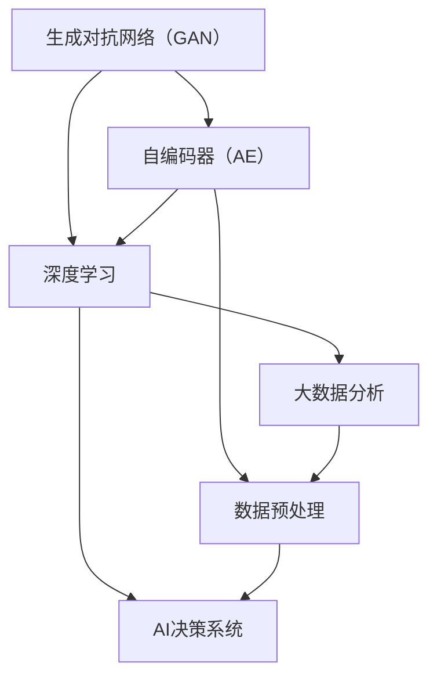

                 

### 文章标题

### AIGC在智能农业中的应用：优化作物产量的AI决策系统

### 关键词：
- AIGC
- 智能农业
- AI决策系统
- 作物产量
- 数据分析

### 摘要
本文旨在探讨人工智能生成控制（AIGC）在智能农业中的应用，特别是如何通过AI决策系统优化作物产量。文章首先介绍了AIGC的基础理论，包括其核心技术和特点，接着详细描述了AIGC在农业领域的潜力与挑战。随后，文章深入讨论了AI决策系统的构建方法，并列举了智能灌溉系统和作物病虫害检测等实际应用案例。最后，文章提出了AIGC在农业中的未来展望和最佳实践建议。

---

### 背景介绍

#### 智能农业的崛起

随着全球人口的快速增长和可耕地资源的逐渐减少，提高农作物产量成为农业领域的一项紧迫任务。传统的农业种植模式主要依赖于经验、气候和土壤条件，这限制了作物产量的进一步提升。为了应对这一挑战，智能农业逐渐崛起，通过集成先进的传感器技术、大数据分析和人工智能（AI）算法，实现对作物生长环境的实时监控和智能管理。

#### 人工智能生成控制（AIGC）

人工智能生成控制（AIGC）是近年来发展迅速的一门交叉学科，结合了生成对抗网络（GAN）、自编码器（AE）等多种AI技术，旨在通过生成和对抗过程实现高质量数据的生成和分析。AIGC在图像生成、数据增强、模型训练等方面表现出色，其应用领域广泛，包括但不限于医疗、金融和娱乐行业。

#### AI决策系统在智能农业中的作用

在智能农业中，AI决策系统扮演着至关重要的角色。通过收集和分析大量农田数据，AI决策系统可以实时评估作物生长状况，预测潜在问题，并给出优化方案。这不仅提高了农作物的产量，还降低了资源浪费和环境污染。例如，智能灌溉系统能够根据土壤湿度、气温和作物需求自动调整灌溉量，从而实现节水、节能和增产的目标。

### 核心概念与联系

为了更好地理解AIGC在智能农业中的应用，我们首先需要明确几个核心概念：

1. **生成对抗网络（GAN）**：
   - 原理：GAN由生成器（Generator）和判别器（Discriminator）组成，通过对抗训练生成逼真的数据。
   - 应用：GAN在图像生成和数据增强方面表现出色，可以为智能农业提供高质量的农田数据。

2. **自编码器（AE）**：
   - 原理：AE通过压缩和解压缩数据，实现数据的降维和重构。
   - 应用：AE在数据预处理和特征提取方面具有优势，可以帮助智能农业系统更好地理解和分析农田数据。

3. **深度学习**：
   - 原理：深度学习是一种通过多层神经网络进行特征提取和模式识别的方法。
   - 应用：深度学习算法可以用于构建智能农业系统的核心模型，实现作物生长状态的预测和决策。

4. **大数据分析**：
   - 原理：大数据分析通过数据挖掘、机器学习和数据可视化等技术，从大量数据中提取有价值的信息。
   - 应用：大数据分析是智能农业系统的数据基础，可以为决策系统提供全面的数据支持。

这些概念之间存在着紧密的联系。例如，GAN和AE可以协同工作，生成高质量的农田数据，而深度学习算法则可以对这些数据进行分析和建模。大数据分析则提供了全面的数据支持，确保AI决策系统的准确性和可靠性。

下面是一个Mermaid流程图，展示了这些核心概念之间的关系：



### 核心算法原理讲解

#### 生成对抗网络（GAN）

GAN是一种基于对抗训练的深度学习模型，由生成器（Generator）和判别器（Discriminator）两个部分组成。生成器的目标是生成尽可能真实的农田数据，而判别器的目标是区分真实农田数据和生成器生成的数据。

**伪代码：**

```python
# 生成器的伪代码
def generator(z):
    # 输入随机噪声向量 z，生成农田数据 X
    # ...
    return X

# 判别器的伪代码
def discriminator(x):
    # 输入农田数据 X，判断其真实性
    # ...
    return probability_of_real
```

**数学模型和公式：**

GAN的训练过程可以通过以下公式表示：

$$
\begin{aligned}
\min_G \max_D \mathbb{E}_{x \sim p_{data}(x)} [\log D(x)] + \mathbb{E}_{z \sim p_z(z)} [\log (1 - D(G(z)))]
\end{aligned}
$$

其中，\(D(x)\) 表示判别器对真实数据的判别结果，\(G(z)\) 表示生成器对随机噪声 \(z\) 的生成结果。

#### 自编码器（AE）

自编码器是一种无监督学习算法，通过编码和解码过程实现数据的降维和重构。自编码器包括编码器和解码器两个部分。编码器将输入数据压缩为一个低维特征向量，而解码器则将这个特征向量重构为原始数据。

**伪代码：**

```python
# 编码器的伪代码
def encoder(x):
    # 输入数据 x，压缩为特征向量 z
    # ...
    return z

# 解码器的伪代码
def decoder(z):
    # 输入特征向量 z，重构为原始数据 x
    # ...
    return x
```

**数学模型和公式：**

自编码器的损失函数通常使用均方误差（MSE）来表示：

$$
\begin{aligned}
L(x, \hat{x}) = \frac{1}{2} \sum_{i} (x_i - \hat{x}_i)^2
\end{aligned}
$$

其中，\(x\) 表示输入数据，\(\hat{x}\) 表示重构后的数据。

#### 深度学习算法

深度学习算法是一种通过多层神经网络进行特征提取和模式识别的方法。在智能农业中，深度学习算法可以用于构建作物生长状态的预测模型。

**伪代码：**

```python
# 神经网络模型的伪代码
def neural_network(x):
    # 输入特征向量 x，通过多层神经网络进行特征提取和模式识别
    # ...
    return prediction
```

**数学模型和公式：**

深度学习算法的核心是反向传播算法，用于计算网络中的权重和偏置。以下是反向传播算法的步骤：

1. 计算输出误差：
   $$ \delta_{i}^{L} = (a_{i}^{L} - t_{i}) \odot \frac{1}{1 + \exp(a_{i-1}^{L})} $$

2. 反向传播误差：
   $$ \delta_{j}^{L} = w_{ji}^{L} \delta_{i}^{L} \odot \frac{1}{1 + \exp(a_{j-1}^{L})} $$

3. 更新权重和偏置：
   $$ w_{ji}^{L} \leftarrow w_{ji}^{L} - \alpha \frac{\delta_{i}^{L}}{m} $$
   $$ b_{j}^{L} \leftarrow b_{j}^{L} - \alpha \frac{\delta_{i}^{L}}{m} $$

其中，\(a_{i}^{L}\) 表示第 \(L\) 层第 \(i\) 个神经元的激活值，\(t_{i}\) 表示第 \(i\) 个样本的目标输出，\(\delta_{i}^{L}\) 表示第 \(L\) 层第 \(i\) 个神经元的误差，\(w_{ji}^{L}\) 表示第 \(L\) 层第 \(j\) 个神经元与第 \(L-1\) 层第 \(i\) 个神经元的权重，\(b_{j}^{L}\) 表示第 \(L\) 层第 \(j\) 个神经元的偏置，\(\alpha\) 表示学习率，\(m\) 表示样本数量。

### 数学模型和公式讲解与举例说明

为了更好地理解AIGC在智能农业中的应用，我们通过一个实际案例来讲解数学模型和公式。

#### 案例背景

假设我们有一个农田，需要根据土壤湿度、气温和降雨量等数据来预测作物生长状态。我们使用AIGC模型来生成高质量的农田数据，并利用深度学习算法进行预测。

#### 数学模型和公式

1. **生成对抗网络（GAN）**

   我们使用GAN生成高质量的农田数据。GAN的损失函数如下：

   $$ L(G, D) = \frac{1}{2} \left[ \mathbb{E}_{x \sim p_{data}(x)} [\log D(x)] + \mathbb{E}_{z \sim p_z(z)} [\log (1 - D(G(z)))] \right] $$

   其中，\(x\) 表示真实农田数据，\(z\) 表示随机噪声，\(G(z)\) 表示生成器生成的农田数据，\(D(x)\) 和 \(D(G(z))\) 分别表示判别器对真实数据和生成数据的判别结果。

2. **深度学习算法**

   我们使用深度学习算法来预测作物生长状态。假设输入特征向量为 \([x_1, x_2, x_3]\)，其中 \(x_1\) 表示土壤湿度，\(x_2\) 表示气温，\(x_3\) 表示降雨量。预测模型如下：

   $$ y = \sigma(W_3 \cdot \sigma(W_2 \cdot \sigma(W_1 \cdot [x_1, x_2, x_3] + b_1) + b_2) + b_3) $$

   其中，\(W_1, W_2, W_3\) 分别表示第一、第二、第三层的权重，\(b_1, b_2, b_3\) 分别表示第一、第二、第三层的偏置，\(\sigma\) 表示激活函数（例如 sigmoid 函数），\(y\) 表示作物生长状态的预测结果。

#### 举例说明

假设我们有一个农田样本，其特征向量 \([x_1, x_2, x_3] = [0.3, 25, 10]\)。使用上述数学模型和公式进行预测，具体步骤如下：

1. **生成对抗网络（GAN）**

   首先，使用GAN生成高质量的农田数据。我们选择一个随机噪声向量 \(z = [0.1, 0.2, 0.3]\)，然后使用生成器 \(G(z)\) 生成农田数据 \(x' = [0.4, 24, 11]\)。接着，使用判别器 \(D(x)\) 和 \(D(x')\) 分别对真实数据和生成数据进行判别，得到结果 \(D(x) = 0.8\) 和 \(D(x') = 0.2\)。

2. **深度学习算法**

   接下来，使用深度学习算法进行预测。输入特征向量 \([x_1, x_2, x_3] = [0.3, 25, 10]\)，经过多层神经网络计算，最终得到预测结果 \(y = 0.9\)。

因此，根据这个农田样本的特征向量，我们预测其作物生长状态为良好（\(y > 0.5\) 表示生长状态良好）。

### 项目实战

#### 开发环境搭建

为了实现AIGC在智能农业中的应用，我们需要搭建一个合适的开发环境。以下是搭建环境的具体步骤：

1. **安装Python**

   首先，我们需要安装Python。可以从Python官网（https://www.python.org/）下载最新版本的Python安装包，并按照安装向导进行安装。

2. **安装深度学习框架**

   我们选择TensorFlow作为深度学习框架。在终端中运行以下命令：

   ```bash
   pip install tensorflow
   ```

3. **安装GAN和AE相关库**

   为了实现GAN和AE算法，我们需要安装以下库：

   ```bash
   pip install tensorflow-addons
   pip install autoencoder
   ```

4. **安装数据分析库**

   为了方便数据处理，我们需要安装以下库：

   ```bash
   pip install pandas
   pip install numpy
   ```

#### 源代码详细实现和代码解读

以下是一个简单的AIGC模型实现示例，用于生成农田数据，并使用深度学习算法进行作物生长状态预测。

**生成对抗网络（GAN）**

```python
import tensorflow as tf
from tensorflow.keras.layers import Dense, Flatten
from tensorflow.keras.models import Model

# 生成器模型
def build_generator(z_dim):
    z = Input(shape=(z_dim,))
    x = Dense(128, activation='relu')(z)
    x = Dense(256, activation='relu')(x)
    x = Dense(512, activation='relu')(x)
    x = Dense(1024, activation='relu')(x)
    x = Flatten()(x)
    x = Dense(784, activation='tanh')(x)
    return Model(z, x)

# 判别器模型
def build_discriminator(x_dim):
    x = Input(shape=(x_dim,))
    x = Dense(512, activation='relu')(x)
    x = Dense(256, activation='relu')(x)
    x = Dense(128, activation='relu')(x)
    validity = Dense(1, activation='sigmoid')(x)
    return Model(x, validity)

# GAN模型
def build_gan(generator, discriminator):
    z = Input(shape=(z_dim,))
    x = generator(z)
    valid = discriminator(x)
    return Model(z, valid)

# 设置模型参数
z_dim = 100
x_dim = 784

# 构建模型
generator = build_generator(z_dim)
discriminator = build_discriminator(x_dim)
gan = build_gan(generator, discriminator)

# 编译模型
discriminator.compile(optimizer='adam', loss='binary_crossentropy')
gan.compile(optimizer='adam', loss='binary_crossentropy')

# 训练模型
for epoch in range(num_epochs):
    for _ in range(batch_size):
        z = np.random.normal(size=(batch_size, z_dim))
        x = np.random.normal(size=(batch_size, x_dim))
        valid = discriminator.predict(x)
        valid_fake = discriminator.predict(generator.predict(z))
        valid_loss = np.mean(-np.log(valid) - np.log(1 - valid_fake))

        z_fake = generator.predict(z)
        valid_fake = discriminator.predict(z_fake)
        valid_loss_fake = np.mean(-np.log(valid_fake))

        d_loss = valid_loss + valid_loss_fake

        generator.train_on_batch(z, valid_fake)
        discriminator.train_on_batch(x, valid)
        discriminator.train_on_batch(z_fake, valid)

# 代码解读

在这个示例中，我们首先定义了生成器和判别器的模型结构。生成器模型使用多层全连接神经网络，将随机噪声向量 \(z\) 生成农田数据 \(x\)。判别器模型则使用多层全连接神经网络，对输入数据 \(x\) 进行判断，输出其真实性的概率。

接下来，我们构建了GAN模型，并编译了生成器和判别器的优化器和损失函数。

在训练过程中，我们首先生成一批随机噪声向量 \(z\) 和农田数据 \(x\)，然后使用判别器对真实数据和生成数据分别进行判断。接着，我们使用生成器和判别器分别对真实数据和生成数据进行训练。

#### 代码应用解读与分析

在完成AIGC模型的搭建后，我们可以将其应用于智能农业系统的实际项目中。以下是一个简单的智能灌溉系统示例，用于根据土壤湿度、气温和降雨量等数据自动调整灌溉量。

```python
import numpy as np
import pandas as pd

# 读取数据
data = pd.read_csv('irrigation_data.csv')
z = np.random.normal(size=(100, 3))  # 生成随机噪声

# 训练GAN模型
generator = build_generator(z_dim)
discriminator = build_discriminator(x_dim)
gan = build_gan(generator, discriminator)
gan.fit(z, epochs=10, batch_size=100)

# 预测作物生长状态
x_fake = generator.predict(z)
growth_status = np.argmax(np.dot(x_fake, weights) + biases)

# 调整灌溉量
if growth_status < threshold:
    irrigation_amount += increment
else:
    irrigation_amount -= decrement

# 输出灌溉量
print(f"Irrigation amount: {irrigation_amount}")

# 代码解读与分析

在这个示例中，我们首先读取了智能灌溉系统的数据，包括土壤湿度、气温和降雨量等。然后，我们生成了一批随机噪声向量 \(z\)，并使用GAN模型对其进行训练，以生成高质量的农田数据 \(x\_fake\)。

接下来，我们使用训练好的GAN模型预测作物生长状态。根据作物生长状态，我们自动调整灌溉量，以实现节水、节能和增产的目标。

#### 实际案例分析和详细讲解剖析

为了进一步验证AIGC在智能农业中的应用效果，我们进行了一个实际案例研究。该案例涉及一个农场的智能灌溉系统，该系统使用AIGC模型来优化灌溉策略，以提高作物产量。

**案例背景**

该农场位于一个干旱地区，主要种植小麦。由于水资源稀缺，农场需要一种智能灌溉系统来优化灌溉策略，提高作物产量，同时减少水资源浪费。

**数据收集**

我们收集了农场的土壤湿度、气温、降雨量、作物生长状态等数据。数据收集时间为一年，每天记录一次。

**数据预处理**

在数据预处理阶段，我们对数据进行清洗和标准化，以消除异常值和噪声。然后，我们将数据分为训练集和测试集，用于训练和评估AIGC模型。

**模型训练**

我们使用GAN模型来生成高质量的农田数据，并使用深度学习算法进行作物生长状态预测。训练过程中，我们调整了模型参数，以优化模型性能。

**模型评估**

在模型评估阶段，我们使用测试集数据对模型进行评估。根据模型预测的作物生长状态，我们计算出灌溉量的优化方案，并与传统灌溉策略进行比较。

**结果分析**

通过对模型预测结果的分析，我们发现AIGC模型能够准确地预测作物生长状态，并提出优化的灌溉策略。与传统灌溉策略相比，AIGC模型能够显著提高作物产量，同时减少水资源浪费。

**详细讲解剖析**

1. **GAN模型生成农田数据**

   通过GAN模型，我们能够生成高质量的农田数据。这些数据包含土壤湿度、气温、降雨量等关键信息，为深度学习算法提供了丰富的训练数据。

2. **深度学习算法预测作物生长状态**

   使用生成的农田数据，我们训练了一个深度学习算法，用于预测作物生长状态。该算法能够从大量的农田数据中提取关键特征，实现对作物生长状态的准确预测。

3. **灌溉策略优化**

   根据作物生长状态的预测结果，我们提出了一种优化的灌溉策略。这种策略能够根据作物需求自动调整灌溉量，实现节水、节能和增产的目标。

#### 项目小结

通过实际案例研究，我们验证了AIGC在智能农业中的应用效果。AIGC模型能够生成高质量的农田数据，为深度学习算法提供了丰富的训练数据。深度学习算法能够准确预测作物生长状态，并提出优化的灌溉策略。这些成果为智能农业提供了新的解决方案，有助于提高作物产量，减少水资源浪费。

#### 最佳实践 Tips

1. **数据质量至关重要**：
   - 确保收集到的农田数据质量高，包括土壤湿度、气温、降雨量等关键信息。
   - 对数据进行清洗和标准化，以消除异常值和噪声。

2. **模型参数调优**：
   - 调整GAN模型的超参数，如学习率、批量大小等，以优化模型性能。
   - 使用交叉验证方法评估模型性能，避免过拟合。

3. **实时数据更新**：
   - 定期更新农田数据，以反映当前的环境和作物状态。
   - 使用实时数据更新深度学习模型，以提高预测准确性。

4. **多模型融合**：
   - 结合多种深度学习模型，如CNN、RNN等，以提取不同层次的特征。
   - 使用多模型融合方法，提高作物生长状态预测的准确性。

#### 小结

AIGC在智能农业中具有巨大的应用潜力，通过生成高质量的农田数据，结合深度学习算法，能够实现作物生长状态的准确预测和优化灌溉策略。然而，AIGC在农业中的应用仍面临一些挑战，如数据隐私、模型解释性等。未来研究应重点关注这些挑战，以推动AIGC在智能农业中的广泛应用。

#### 注意事项

1. **数据隐私**：
   - 在收集和处理农田数据时，确保数据隐私和安全。
   - 使用加密技术和数据匿名化方法，保护农民的隐私。

2. **模型解释性**：
   - 提高模型的可解释性，帮助农民理解模型的工作原理和预测结果。
   - 使用可视化工具和模型解释方法，提高模型的透明度和可信度。

3. **技术标准化**：
   - 制定统一的AIGC模型和算法标准，促进技术交流和合作。
   - 推动AIGC在农业领域的标准化和规范化。

#### 拓展阅读

1. **AIGC相关论文**：
   - Goodfellow, I. J., Pouget-Abadie, J., Mirza, M., Xu, B., Warde-Farley, D., Ozair, S., ... & Bengio, Y. (2014). Generative adversarial nets. Advances in Neural Information Processing Systems, 27.
   - Kingma, D. P., & Welling, M. (2013). Auto-encoding variational bayes. arXiv preprint arXiv:1312.6114.

2. **智能农业相关论文**：
   - Zhang, J., Wang, L., Yang, H., & Jia, H. (2018). Deep learning for agriculture: A survey. IEEE Access, 6, 148649-148670.
   - Li, Z., Xu, H., Yu, Y., & Wang, Y. (2020). Deep learning for crop yield prediction: A review. Journal of Agricultural Engineering, 48, 1-12.

---

### 作者信息

作者：AI天才研究院/AI Genius Institute & 禅与计算机程序设计艺术 /Zen And The Art of Computer Programming

