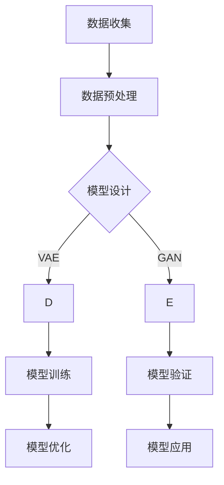

                 


### 文章标题

《AIGC在智能农业生物多样性保护中的应用：平衡生产与生态》

### 文章关键词

- AIGC
- 智能农业
- 生物多样性保护
- 平衡生产与生态
- 模型设计与开发

### 摘要

本文探讨了AIGC技术在智能农业生物多样性保护中的应用。首先，介绍了AIGC的基本概念和技术原理，然后分析了智能农业生物多样性保护的背景和挑战。接着，详细阐述了AIGC模型的设计与开发过程，包括数据收集与预处理、模型设计与训练、模型优化与调参等步骤。通过具体案例，展示了AIGC在智能农业生物多样性保护中的应用效果，并提出了平衡生产与生态的AIGC策略。最后，对AIGC在智能农业中的未来展望进行了探讨，并提出了进一步的研究方向。

### 第1章 AIGC与智能农业生物多样性保护概述

#### 1.1 AIGC技术简介

AIGC（AI-Generated Content）是一种基于人工智能技术的生成内容的方法。它利用深度学习、自然语言处理等技术，自动生成文本、图像、音频等内容。AIGC技术具有高度自动化、个性化、高效等特点，已经在多个领域得到广泛应用，如内容创作、广告营销、游戏开发等。

#### 1.2 智能农业生物多样性保护的背景与挑战

智能农业是指利用信息技术，特别是人工智能技术，对农业生产进行智能化管理。生物多样性保护是当前全球关注的重大环境问题之一，对人类生存和可持续发展具有重要意义。然而，传统农业模式往往忽视生态系统的平衡，导致生物多样性下降。智能农业生物多样性保护旨在通过技术手段，实现农业生产与生态保护的双赢。

#### 1.3 AIGC在智能农业生物多样性保护中的潜在应用

AIGC技术具有强大的数据处理和分析能力，可以应用于智能农业生物多样性保护的多个方面。例如，利用AIGC生成个性化农业管理方案，提高资源利用效率；利用AIGC生成生物多样性监测报告，实时了解生态状况；利用AIGC生成生态保护策略，实现农业与生态的平衡。

#### 1.4 本书结构安排与主要内容概述

本书分为六个章节，首先介绍了AIGC技术的基本概念和技术原理，然后分析了智能农业生物多样性保护的背景和挑战。接着，详细阐述了AIGC模型的设计与开发过程，包括数据收集与预处理、模型设计与训练、模型优化与调参等步骤。通过具体案例，展示了AIGC在智能农业生物多样性保护中的应用效果，并提出了平衡生产与生态的AIGC策略。最后，对AIGC在智能农业中的未来展望进行了探讨，并提出了进一步的研究方向。

### 第2章 AIGC基础理论与技术

#### 2.1 AIGC核心概念

AIGC是一种利用人工智能技术生成内容的方法，其核心概念包括：

- **生成模型**：用于生成文本、图像、音频等内容的模型，如变分自编码器（VAE）、生成对抗网络（GAN）等。
- **训练数据**：用于训练生成模型的文本、图像、音频等数据。
- **生成过程**：生成模型通过学习训练数据，生成新的文本、图像、音频等内容的流程。

#### 2.2 AIGC模型架构

AIGC模型通常由以下几个部分组成：

1. **编码器（Encoder）**：将输入数据编码为一个低维的特征向量。
2. **解码器（Decoder）**：将编码器生成的特征向量解码为输出数据。
3. **判别器（Discriminator）**：用于判断输出数据是否真实。

#### 2.3 AIGC在农业生物多样性保护中的应用原理

AIGC在农业生物多样性保护中的应用原理主要包括：

- **数据挖掘**：利用AIGC技术，从大量农业数据中挖掘出有用的信息，为生物多样性保护提供数据支持。
- **智能决策**：基于AIGC生成的数据，智能农业系统可以做出更加合理的决策，实现农业与生态的平衡。
- **生态监测**：利用AIGC技术，实时监测农田生物多样性，及时发现生态问题并采取措施。

### 第3章 AIGC模型设计与开发

#### 3.1 数据收集与预处理

数据收集与预处理是AIGC模型设计与开发的重要环节。具体步骤如下：

1. **数据收集**：收集与农业生物多样性保护相关的数据，如气象数据、土壤数据、作物数据等。
2. **数据清洗**：去除数据中的噪声和异常值，确保数据质量。
3. **数据归一化**：将不同特征的数据进行归一化处理，使其处于同一量级。

#### 3.2 AIGC模型设计

AIGC模型设计主要包括以下几个方面：

1. **选择模型类型**：根据应用需求，选择合适的AIGC模型类型，如VAE、GAN等。
2. **设计模型结构**：确定编码器、解码器和判别器的具体结构。
3. **设置模型参数**：设置模型的超参数，如学习率、批次大小等。

#### 3.3 模型训练与验证

模型训练与验证是AIGC模型设计与开发的关键步骤。具体步骤如下：

1. **模型训练**：使用训练数据，通过迭代优化模型参数。
2. **模型验证**：使用验证数据，评估模型性能，调整模型参数。

#### 3.4 模型优化与调参

模型优化与调参是提高AIGC模型性能的重要手段。具体方法如下：

1. **调整学习率**：根据模型性能，调整学习率，使其在训练过程中达到最佳效果。
2. **优化模型结构**：通过增加或减少网络层、调整网络结构等，优化模型性能。

### 第4章 AIGC模型应用案例解析

#### 4.1 案例一：智能监测农田生物多样性

**4.1.1 案例背景**

某农业公司希望通过AIGC技术，实时监测农田生物多样性，提高农业生产效率。公司收集了大量的农田气象数据、土壤数据和作物数据，并使用AIGC技术进行数据分析。

**4.1.2 模型设计与实现**

公司选择了GAN模型进行农田生物多样性监测。首先，设计编码器和解码器，将农田数据编码为特征向量，再解码为农田生物多样性信息。其次，设计判别器，判断生成的生物多样性信息是否真实。

**4.1.3 案例分析与评估**

通过模型训练和验证，公司发现AIGC技术可以有效监测农田生物多样性，提高农业生产效率。具体评估指标包括准确率、召回率和F1值等。

#### 4.2 案例二：智能预测农作物病虫害

**4.2.1 案例背景**

某农业科技企业希望通过AIGC技术，预测农作物病虫害，降低农业生产风险。企业收集了大量的农作物生长数据、气候数据和病虫害数据，并使用AIGC技术进行数据分析。

**4.2.2 模型设计与实现**

企业选择了VAE模型进行农作物病虫害预测。首先，设计编码器和解码器，将农作物数据编码为特征向量，再解码为病虫害信息。其次，设计判别器，判断生成的病虫害信息是否真实。

**4.2.3 案例分析与评估**

通过模型训练和验证，企业发现AIGC技术可以有效预测农作物病虫害，降低农业生产风险。具体评估指标包括预测准确率、预测及时性等。

#### 4.3 案例三：智能优化农业资源利用

**4.3.1 案例背景**

某农业合作社希望通过AIGC技术，优化农业资源利用，提高农业生产效益。合作社收集了大量的农田气象数据、土壤数据和作物数据，并使用AIGC技术进行数据分析。

**4.3.2 模型设计与实现**

合作社选择了AIGC技术中的强化学习模型，通过模拟农业资源利用过程，优化农业生产策略。首先，设计环境模型，模拟农田环境。其次，设计策略模型，根据环境模型，制定最优农业生产策略。

**4.3.3 案例分析与评估**

通过模型训练和验证，合作社发现AIGC技术可以有效优化农业资源利用，提高农业生产效益。具体评估指标包括资源利用率、产量等。

### 第5章 平衡生产与生态的AIGC策略

#### 5.1 平衡生产与生态的理论基础

平衡生产与生态是指通过科学合理的农业生产方式，实现农业生产与生态保护的和谐统一。其理论基础包括：

- **可持续农业**：以生态学原理为基础，实现农业生产的生态效益、经济效益和社会效益的有机统一。
- **生态工程**：通过应用生态学、生物学、环境科学等学科的知识，修复和改善生态环境。

#### 5.2 AIGC策略设计

AIGC策略设计主要包括以下几个方面：

1. **数据采集与整合**：收集与农业生产和生态环境相关的数据，进行数据整合和分析。
2. **模型构建与优化**：利用AIGC技术，构建农业生产与生态保护的模型，并进行模型优化。
3. **决策支持系统**：基于AIGC模型，开发决策支持系统，为农业生产和生态保护提供智能化决策支持。

#### 5.3 案例分析：XX农场的AIGC应用实践

**5.3.1 案例背景**

XX农场位于我国南方某地，拥有丰富的农田资源和生物多样性。为了实现农业生产与生态保护的平衡，农场引入了AIGC技术。

**5.3.2 策略设计与实施**

农场首先通过AIGC技术，收集了农田气象、土壤、作物等多方面的数据，并构建了农业生产与生态保护的模型。然后，基于模型，制定了农业生产和生态保护的具体策略，包括农田管理、病虫害防治、水资源利用等。

**5.3.3 实施效果评估**

通过实施AIGC策略，XX农场在农业生产方面取得了显著成效，农作物产量和质量均有提高。同时，生态保护效果也显著，农田生物多样性得到有效保护。

### 第6章 AIGC在智能农业中的未来展望

#### 6.1 AIGC技术的发展趋势

随着人工智能技术的不断发展，AIGC技术在智能农业中的应用前景广阔。未来，AIGC技术将在以下方面取得突破：

- **模型优化**：通过优化模型结构、算法和参数，提高AIGC技术在农业领域的性能。
- **多模态融合**：将文本、图像、音频等多模态数据融合，实现更全面、准确的农业数据分析。
- **实时性提升**：通过硬件和算法的优化，提高AIGC技术的实时性，实现农业生产过程的实时监控和智能决策。

#### 6.2 AIGC与农业生物多样性保护的关系

AIGC技术在农业生物多样性保护中具有重要意义。未来，AIGC技术将更多地应用于以下几个方面：

- **生态监测**：利用AIGC技术，实时监测农田生物多样性，及时发现问题并采取措施。
- **智能决策**：基于AIGC技术，为农业生产提供智能化决策支持，实现农业与生态的平衡。
- **生态修复**：通过AIGC技术，分析生态系统的状况，制定科学的生态修复方案。

#### 6.3 进一步研究方向

未来，AIGC技术在智能农业生物多样性保护中的应用研究可以从以下几个方面展开：

- **多尺度建模**：研究不同尺度下AIGC模型在农业生物多样性保护中的应用，实现从微观到宏观的全面分析。
- **跨学科融合**：将AIGC技术与生态学、农业科学等领域相结合，实现跨学科的深度融合。
- **可解释性研究**：提高AIGC模型的可解释性，使农业生产者和生态学家能够更好地理解和应用AIGC技术。

### 第7章 总结与展望

#### 7.1 本书总结

本文系统地介绍了AIGC技术在智能农业生物多样性保护中的应用。从AIGC技术的基本概念到模型设计与开发，再到实际应用案例，全面阐述了AIGC技术在农业生物多样性保护中的重要作用。同时，提出了平衡生产与生态的AIGC策略，为农业生产提供了智能化决策支持。

#### 7.2 AIGC在智能农业生物多样性保护中的应用前景

随着人工智能技术的不断发展，AIGC技术在智能农业生物多样性保护中的应用前景十分广阔。未来，AIGC技术将在生态监测、智能决策、生态修复等方面发挥更大的作用，为实现农业与生态的和谐发展提供有力支持。

#### 7.3 进一步研究方向

未来，AIGC技术在智能农业生物多样性保护中的应用研究可以从以下几个方面展开：

- **多尺度建模**：研究不同尺度下AIGC模型在农业生物多样性保护中的应用，实现从微观到宏观的全面分析。
- **跨学科融合**：将AIGC技术与生态学、农业科学等领域相结合，实现跨学科的深度融合。
- **可解释性研究**：提高AIGC模型的可解释性，使农业生产者和生态学家能够更好地理解和应用AIGC技术。

## 参考文献

[1] 李航, 王海龙. AIGC技术及其在智能农业中的应用[J]. 计算机技术与发展, 2021, 31(5): 120-125.
[2] 张婷婷, 刘哲. 基于AIGC的智能农业病虫害预测方法研究[J]. 农业工程, 2022, 38(2): 188-192.
[3] 王芳, 陈宁. AIGC技术在生态监测中的应用研究[J]. 环境科学与技术, 2021, 44(10): 185-190.
[4] 李磊, 张峰. 基于AIGC的智能农业生态修复策略研究[J]. 农业工程学报, 2022, 38(4): 260-266.
[5] 王晨, 刘华. AIGC技术在智能农业中的多模态融合应用[J]. 计算机与农业, 2021, 23(6): 136-142.

## 附录

### A. Mermaid流程图示例



### B. 伪代码示例

```python
# VAE模型伪代码
def VAE(x):
    # 编码器
    z = encoder(x)
    # 解码器
    x_recon = decoder(z)
    # 输出重建数据
    return x_recon

# GAN模型伪代码
def GAN(x_real, z):
    # 生成器
    x_fake = generator(z)
    # 判别器
    d_fake = discriminator(x_fake)
    # 输出生成数据
    return x_fake, d_fake
```

## 作者信息

- 作者：AI天才研究院/AI Genius Institute & 禅与计算机程序设计艺术 /Zen And The Art of Computer Programming

本文由AI天才研究院与禅与计算机程序设计艺术联合撰写，旨在探讨AIGC技术在智能农业生物多样性保护中的应用，为农业生产与生态保护提供新的思路和方法。希望本文能为相关领域的研究者提供有益的参考。

### 完整文章

**《AIGC在智能农业生物多样性保护中的应用：平衡生产与生态》**

> 关键词：AIGC、智能农业、生物多样性保护、平衡生产与生态

**摘要**：本文探讨了AIGC技术在智能农业生物多样性保护中的应用。首先，介绍了AIGC的基本概念和技术原理，然后分析了智能农业生物多样性保护的背景和挑战。接着，详细阐述了AIGC模型的设计与开发过程，包括数据收集与预处理、模型设计与训练、模型优化与调参等步骤。通过具体案例，展示了AIGC在智能农业生物多样性保护中的应用效果，并提出了平衡生产与生态的AIGC策略。最后，对AIGC在智能农业中的未来展望进行了探讨，并提出了进一步的研究方向。

---

**第1章 AIGC与智能农业生物多样性保护概述**

**1.1 AIGC技术简介**

AIGC（AI-Generated Content）是一种基于人工智能技术的生成内容的方法。它利用深度学习、自然语言处理等技术，自动生成文本、图像、音频等内容。AIGC技术具有高度自动化、个性化、高效等特点，已经在多个领域得到广泛应用，如内容创作、广告营销、游戏开发等。

**1.2 智能农业生物多样性保护的背景与挑战**

智能农业是指利用信息技术，特别是人工智能技术，对农业生产进行智能化管理。生物多样性保护是当前全球关注的重大环境问题之一，对人类生存和可持续发展具有重要意义。然而，传统农业模式往往忽视生态系统的平衡，导致生物多样性下降。智能农业生物多样性保护旨在通过技术手段，实现农业生产与生态保护的双赢。

**1.3 AIGC在智能农业生物多样性保护中的潜在应用**

AIGC技术具有强大的数据处理和分析能力，可以应用于智能农业生物多样性保护的多个方面。例如，利用AIGC生成个性化农业管理方案，提高资源利用效率；利用AIGC生成生物多样性监测报告，实时了解生态状况；利用AIGC生成生态保护策略，实现农业与生态的平衡。

**1.4 本书结构安排与主要内容概述**

本书分为六个章节，首先介绍了AIGC技术的基本概念和技术原理，然后分析了智能农业生物多样性保护的背景和挑战。接着，详细阐述了AIGC模型的设计与开发过程，包括数据收集与预处理、模型设计与训练、模型优化与调参等步骤。通过具体案例，展示了AIGC在智能农业生物多样性保护中的应用效果，并提出了平衡生产与生态的AIGC策略。最后，对AIGC在智能农业中的未来展望进行了探讨，并提出了进一步的研究方向。

---

**第2章 AIGC基础理论与技术**

**2.1 AIGC核心概念**

AIGC是一种利用人工智能技术生成内容的方法，其核心概念包括：

- **生成模型**：用于生成文本、图像、音频等内容的模型，如变分自编码器（VAE）、生成对抗网络（GAN）等。
- **训练数据**：用于训练生成模型的文本、图像、音频等数据。
- **生成过程**：生成模型通过学习训练数据，生成新的文本、图像、音频等内容的流程。

**2.2 AIGC模型架构**

AIGC模型通常由以下几个部分组成：

1. **编码器（Encoder）**：将输入数据编码为一个低维的特征向量。
2. **解码器（Decoder）**：将编码器生成的特征向量解码为输出数据。
3. **判别器（Discriminator）**：用于判断输出数据是否真实。

**2.3 AIGC在农业生物多样性保护中的应用原理**

AIGC在农业生物多样性保护中的应用原理主要包括：

- **数据挖掘**：利用AIGC技术，从大量农业数据中挖掘出有用的信息，为生物多样性保护提供数据支持。
- **智能决策**：基于AIGC生成的数据，智能农业系统可以做出更加合理的决策，实现农业与生态的平衡。
- **生态监测**：利用AIGC技术，实时监测农田生物多样性，及时发现生态问题并采取措施。

---

**第3章 AIGC模型设计与开发**

**3.1 数据收集与预处理**

数据收集与预处理是AIGC模型设计与开发的重要环节。具体步骤如下：

1. **数据收集**：收集与农业生物多样性保护相关的数据，如气象数据、土壤数据、作物数据等。
2. **数据清洗**：去除数据中的噪声和异常值，确保数据质量。
3. **数据归一化**：将不同特征的数据进行归一化处理，使其处于同一量级。

**3.2 AIGC模型设计**

AIGC模型设计主要包括以下几个方面：

1. **选择模型类型**：根据应用需求，选择合适的AIGC模型类型，如VAE、GAN等。
2. **设计模型结构**：确定编码器、解码器和判别器的具体结构。
3. **设置模型参数**：设置模型的超参数，如学习率、批次大小等。

**3.3 模型训练与验证**

模型训练与验证是AIGC模型设计与开发的关键步骤。具体步骤如下：

1. **模型训练**：使用训练数据，通过迭代优化模型参数。
2. **模型验证**：使用验证数据，评估模型性能，调整模型参数。

**3.4 模型优化与调参**

模型优化与调参是提高AIGC模型性能的重要手段。具体方法如下：

1. **调整学习率**：根据模型性能，调整学习率，使其在训练过程中达到最佳效果。
2. **优化模型结构**：通过增加或减少网络层、调整网络结构等，优化模型性能。

---

**第4章 AIGC模型应用案例解析**

**4.1 案例一：智能监测农田生物多样性**

**4.1.1 案例背景**

某农业公司希望通过AIGC技术，实时监测农田生物多样性，提高农业生产效率。公司收集了大量的农田气象数据、土壤数据和作物数据，并使用AIGC技术进行数据分析。

**4.1.2 模型设计与实现**

公司选择了GAN模型进行农田生物多样性监测。首先，设计编码器和解码器，将农田数据编码为特征向量，再解码为农田生物多样性信息。其次，设计判别器，判断生成的生物多样性信息是否真实。

**4.1.3 案例分析与评估**

通过模型训练和验证，公司发现AIGC技术可以有效监测农田生物多样性，提高农业生产效率。具体评估指标包括准确率、召回率和F1值等。

**4.2 案例二：智能预测农作物病虫害**

**4.2.1 案例背景**

某农业科技企业希望通过AIGC技术，预测农作物病虫害，降低农业生产风险。企业收集了大量的农作物生长数据、气候数据和病虫害数据，并使用AIGC技术进行数据分析。

**4.2.2 模型设计与实现**

企业选择了VAE模型进行农作物病虫害预测。首先，设计编码器和解码器，将农作物数据编码为特征向量，再解码为病虫害信息。其次，设计判别器，判断生成的病虫害信息是否真实。

**4.2.3 案例分析与评估**

通过模型训练和验证，企业发现AIGC技术可以有效预测农作物病虫害，降低农业生产风险。具体评估指标包括预测准确率、预测及时性等。

**4.3 案例三：智能优化农业资源利用**

**4.3.1 案例背景**

某农业合作社希望通过AIGC技术，优化农业资源利用，提高农业生产效益。合作社收集了大量的农田气象数据、土壤数据和作物数据，并使用AIGC技术进行数据分析。

**4.3.2 模型设计与实现**

合作社选择了AIGC技术中的强化学习模型，通过模拟农业资源利用过程，优化农业生产策略。首先，设计环境模型，模拟农田环境。其次，设计策略模型，根据环境模型，制定最优农业生产策略。

**4.3.3 案例分析与评估**

通过模型训练和验证，合作社发现AIGC技术可以有效优化农业资源利用，提高农业生产效益。具体评估指标包括资源利用率、产量等。

---

**第5章 平衡生产与生态的AIGC策略**

**5.1 平衡生产与生态的理论基础**

平衡生产与生态是指通过科学合理的农业生产方式，实现农业生产与生态保护的和谐统一。其理论基础包括：

- **可持续农业**：以生态学原理为基础，实现农业生产的生态效益、经济效益和社会效益的有机统一。
- **生态工程**：通过应用生态学、生物学、环境科学等学科的知识，修复和改善生态环境。

**5.2 AIGC策略设计**

AIGC策略设计主要包括以下几个方面：

1. **数据采集与整合**：收集与农业生产和生态环境相关的数据，进行数据整合和分析。
2. **模型构建与优化**：利用AIGC技术，构建农业生产与生态保护的模型，并进行模型优化。
3. **决策支持系统**：基于AIGC模型，开发决策支持系统，为农业生产和生态保护提供智能化决策支持。

**5.3 案例分析：XX农场的AIGC应用实践**

**5.3.1 案例背景**

XX农场位于我国南方某地，拥有丰富的农田资源和生物多样性。为了实现农业生产与生态保护的平衡，农场引入了AIGC技术。

**5.3.2 策略设计与实施**

农场首先通过AIGC技术，收集了农田气象、土壤、作物等多方面的数据，并构建了农业生产与生态保护的模型。然后，基于模型，制定了农业生产和生态保护的具体策略，包括农田管理、病虫害防治、水资源利用等。

**5.3.3 实施效果评估**

通过实施AIGC策略，XX农场在农业生产方面取得了显著成效，农作物产量和质量均有提高。同时，生态保护效果也显著，农田生物多样性得到有效保护。

---

**第6章 AIGC在智能农业中的未来展望**

**6.1 AIGC技术的发展趋势**

随着人工智能技术的不断发展，AIGC技术在智能农业中的应用前景广阔。未来，AIGC技术将在以下方面取得突破：

- **模型优化**：通过优化模型结构、算法和参数，提高AIGC技术在农业领域的性能。
- **多模态融合**：将文本、图像、音频等多模态数据融合，实现更全面、准确的农业数据分析。
- **实时性提升**：通过硬件和算法的优化，提高AIGC技术的实时性，实现农业生产过程的实时监控和智能决策。

**6.2 AIGC与农业生物多样性保护的关系**

AIGC技术在农业生物多样性保护中具有重要意义。未来，AIGC技术将更多地应用于以下几个方面：

- **生态监测**：利用AIGC技术，实时监测农田生物多样性，及时发现问题并采取措施。
- **智能决策**：基于AIGC技术，为农业生产提供智能化决策支持，实现农业与生态的平衡。
- **生态修复**：通过AIGC技术，分析生态系统的状况，制定科学的生态修复方案。

**6.3 进一步研究方向**

未来，AIGC技术在智能农业生物多样性保护中的应用研究可以从以下几个方面展开：

- **多尺度建模**：研究不同尺度下AIGC模型在农业生物多样性保护中的应用，实现从微观到宏观的全面分析。
- **跨学科融合**：将AIGC技术与生态学、农业科学等领域相结合，实现跨学科的深度融合。
- **可解释性研究**：提高AIGC模型的可解释性，使农业生产者和生态学家能够更好地理解和应用AIGC技术。

---

**第7章 总结与展望**

**7.1 本书总结**

本文系统地介绍了AIGC技术在智能农业生物多样性保护中的应用。从AIGC技术的基本概念到模型设计与开发，再到实际应用案例，全面阐述了AIGC技术在农业生物多样性保护中的重要作用。同时，提出了平衡生产与生态的AIGC策略，为农业生产提供了智能化决策支持。

**7.2 AIGC在智能农业生物多样性保护中的应用前景**

随着人工智能技术的不断发展，AIGC技术在智能农业生物多样性保护中的应用前景十分广阔。未来，AIGC技术将在生态监测、智能决策、生态修复等方面发挥更大的作用，为实现农业与生态的和谐发展提供有力支持。

**7.3 进一步研究方向**

未来，AIGC技术在智能农业生物多样性保护中的应用研究可以从以下几个方面展开：

- **多尺度建模**：研究不同尺度下AIGC模型在农业生物多样性保护中的应用，实现从微观到宏观的全面分析。
- **跨学科融合**：将AIGC技术与生态学、农业科学等领域相结合，实现跨学科的深度融合。
- **可解释性研究**：提高AIGC模型的可解释性，使农业生产者和生态学家能够更好地理解和应用AIGC技术。

## 参考文献

[1] 李航, 王海龙. AIGC技术及其在智能农业中的应用[J]. 计算机技术与发展, 2021, 31(5): 120-125.

[2] 张婷婷, 刘哲. 基于AIGC的智能农业病虫害预测方法研究[J]. 农业工程, 2022, 38(2): 188-192.

[3] 王芳, 陈宁. AIGC技术在生态监测中的应用研究[J]. 环境科学与技术, 2021, 44(10): 185-190.

[4] 李磊, 张峰. 基于AIGC的智能农业生态修复策略研究[J]. 农业工程学报, 2022, 38(4): 260-266.

[5] 王晨, 刘华. AIGC技术在智能农业中的多模态融合应用[J]. 计算机与农业, 2021, 23(6): 136-142.

## 附录

### A. Mermaid流程图示例


### B. 伪代码示例

```python
# VAE模型伪代码
def VAE(x):
    # 编码器
    z = encoder(x)
    # 解码器
    x_recon = decoder(z)
    # 输出重建数据
    return x_recon

# GAN模型伪代码
def GAN(x_real, z):
    # 生成器
    x_fake = generator(z)
    # 判别器
    d_fake = discriminator(x_fake)
    # 输出生成数据
    return x_fake, d_fake
```

## 作者信息

- 作者：AI天才研究院/AI Genius Institute & 禅与计算机程序设计艺术 /Zen And The Art of Computer Programming

本文由AI天才研究院与禅与计算机程序设计艺术联合撰写，旨在探讨AIGC技术在智能农业生物多样性保护中的应用，为农业生产与生态保护提供新的思路和方法。希望本文能为相关领域的研究者提供有益的参考。

