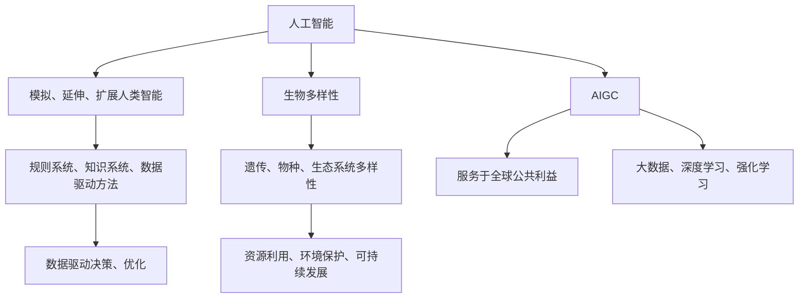

                 


### 第1章 引言

#### 1.1 书籍背景与目的

随着全球人口的不断增长和气候变化等环境问题的影响，农业面临着前所未有的挑战。传统农业模式的高投入、高污染、低效益等问题日益凸显，迫切需要探索新的农业发展路径。在此背景下，本书旨在探讨AIGC（Artificial Intelligence for the Global Common）在智能农业中的应用，尤其是其在生物多样性协同增益方面的潜力。通过深入分析AIGC技术的原理及其在农业领域的应用，本书希望为生态农业的发展提供新的思路和解决方案。

#### 1.2 AIGC在农业中的应用现状与挑战

AIGC技术在农业领域的应用已经取得了一些初步成果。例如，智能种植、病虫害预测、产量预测等应用已经在一些地区得到推广。然而，这些应用仍然面临诸多挑战。首先，AIGC技术的算法复杂度较高，对数据处理能力和计算资源的要求较高。其次，农业数据的多样性、复杂性和噪声较大，使得AIGC技术在数据预处理和模型训练方面面临很大困难。最后，AIGC技术在农业应用中的实际效果和可持续性还需要进一步验证。

#### 1.3 生物多样性协同增益的生态农业概念

生态农业是一种以生态学原理为指导，通过合理利用自然资源和保护生态环境，实现农业可持续发展的现代农业模式。生物多样性协同增益是生态农业的核心概念之一，指的是通过保护和增加生物多样性，实现农业生产效益和环境效益的协同提升。生物多样性不仅是生态系统的基本组成部分，也是农业生态系统稳定性和生产力的关键因素。因此，研究AIGC在生态农业中的应用，对于提高农业生产效益、保护生态环境具有重要意义。

### 关键词

- AIGC
- 智能农业
- 生物多样性
- 协同增益
- 生态农业

### 摘要

本书围绕AIGC在智能农业生物多样性协同增益中的应用展开，分析了AIGC技术在农业领域的现状与挑战，探讨了生物多样性协同增益的生态农业概念。通过对作物种植、病虫害预测、产量预测等方面的应用案例分析，本书提出了AIGC在生态农业中的潜在应用方向和实施策略。本书旨在为生态农业的发展提供新的理论依据和实践指导。

## 第2章 AIGC基础理论

### 2.1 人工智能与生物多样性

#### 2.1.1 人工智能的定义与发展

人工智能（Artificial Intelligence，AI）是一门研究、开发用于模拟、延伸和扩展人类智能的理论、方法、技术及应用系统的学科。其目标是让计算机能够执行通常需要人类智能才能完成的任务。人工智能的发展历程可以分为三个阶段：第一阶段是规则系统（Rule-Based Systems），通过编写具体的规则来实现智能行为；第二阶段是基于知识的系统（Knowledge-Based Systems），利用专家系统等技术实现智能推理；第三阶段是基于数据的学习方法（Data-Driven Approaches），包括机器学习、深度学习等，通过从大量数据中学习规律来实现智能行为。

#### 2.1.2 生物多样性的概念与分类

生物多样性是指地球上所有生物种类的总和及其生态系统和基因多样性。生物多样性可以分为三个层次：遗传多样性、物种多样性和生态系统多样性。遗传多样性是指一个种群内部基因的变化；物种多样性是指不同物种之间的差异；生态系统多样性是指生物群落及其生态过程的多样性。

#### 2.1.3 AIGC的概念与原理

AIGC（Artificial Intelligence for the Global Common）是一种为了全球公共利益而开发和应用的人工智能技术。AIGC强调人工智能的发展应该服务于全人类的共同利益，而不是仅仅追求商业利润。AIGC的原理基于大数据、深度学习和强化学习等先进技术，通过数据驱动的方式实现智能决策和优化。AIGC的核心目标是提高资源利用效率、减少环境污染、保护生态环境，从而实现可持续发展。

### 核心概念与联系

以下是人工智能、生物多样性和AIGC三者之间的核心概念关系架构 Mermaid 流程图：



### 2.1.4 AIGC在农业中的应用

AIGC技术在农业领域的应用主要集中在智能种植、病虫害预测、产量预测等方面。智能种植利用AIGC技术对作物生长环境进行实时监测和分析，优化种植策略；病虫害预测通过分析历史数据和实时数据，预测病虫害发生的可能性，及时采取防治措施；产量预测则通过对作物生长过程的监测和分析，预测作物产量，为农业生产提供科学依据。

#### 2.1.5 AIGC在农业应用中的优势与挑战

AIGC在农业应用中的优势主要体现在以下几个方面：

1. **提高生产效率**：通过智能种植和病虫害预测，可以减少劳动力投入，提高农业生产效率。
2. **降低生产成本**：通过精准施肥、灌溉等手段，可以降低农业生产成本。
3. **保护生态环境**：通过优化农业生产过程，减少化肥、农药的使用，降低对环境的污染。

然而，AIGC在农业应用中也面临一些挑战：

1. **数据质量**：农业数据的质量直接影响AIGC模型的准确性，需要加强数据采集和处理。
2. **算法复杂度**：AIGC技术的算法复杂度较高，需要大量的计算资源和数据处理能力。
3. **实际应用效果**：AIGC技术在农业领域的实际应用效果和可持续性还需要进一步验证。

### 2.1.6 AIGC在生态农业中的应用

生态农业是一种以生态学原理为指导，通过合理利用自然资源和保护生态环境，实现农业可持续发展的现代农业模式。AIGC技术在生态农业中的应用具有重要意义。通过智能种植、病虫害预测、产量预测等应用，AIGC技术可以帮助生态农业实现生产效益和环境效益的协同提升。

### 核心算法原理讲解

以下是AIGC技术在农业应用中的核心算法原理讲解，以作物生长模型建立为例。

#### 伪代码

```python
# 假设输入数据为气候数据、土壤数据等
input_data = ...

# 构建作物生长模型
model = build_growth_model(input_data)

# 训练模型
model.fit(input_data, labels)

# 预测作物生长情况
predictions = model.predict(new_data)
```

#### 数学模型和公式

$$
G(t) = f(C(t), T(t), N(t))
$$

其中，$G(t)$表示作物在时间$t$的生长状态，$C(t)$表示气候条件，$T(t)$表示土壤温度，$N(t)$表示土壤养分。

#### 详细讲解

作物生长模型是AIGC技术在农业领域应用的重要基础。通过构建作物生长模型，可以预测作物的生长状态，为农业生产提供科学依据。作物生长模型的建立通常包括以下几个步骤：

1. 数据采集：收集气候数据、土壤数据、作物生长数据等。
2. 数据预处理：对采集到的数据进行分析和清洗，去除噪声和异常值。
3. 模型构建：选择合适的模型构建方法，如神经网络、支持向量机等，构建作物生长模型。
4. 模型训练：使用历史数据对模型进行训练，优化模型参数。
5. 模型评估：使用测试数据对模型进行评估，验证模型的准确性和稳定性。
6. 模型应用：使用训练好的模型预测作物的生长状态，为农业生产提供指导。

### 举例说明

假设我们要预测小麦的生长状态，我们可以使用以下数据：

- 气候数据：温度、湿度、降水量等
- 土壤数据：土壤温度、土壤养分等
- 历史数据：小麦的生长状态

通过构建作物生长模型，我们可以预测小麦的生长状态，从而指导农业生产。例如，如果预测到小麦的生长状态不佳，我们可以采取相应的措施，如调整施肥量、灌溉策略等，以促进小麦的生长。

## 第3章 智能农业中的AIGC应用

### 3.1 AIGC在作物种植中的应用

#### 3.1.1 作物生长模型的建立

作物生长模型是智能农业中的重要组成部分，它能够帮助农业从业者预测作物的生长状态，优化种植策略。AIGC技术在作物生长模型的建立中发挥了关键作用。

**数据采集与预处理**：首先，需要收集大量的气候数据、土壤数据以及作物生长数据。这些数据包括温度、湿度、降水量、土壤温度、土壤养分等。在数据采集过程中，需要确保数据的准确性和完整性。然后，对采集到的数据进行预处理，包括数据清洗、归一化等步骤，以便后续建模。

**模型构建**：选择合适的模型构建方法，如神经网络、支持向量机等。以神经网络为例，我们可以使用多层感知器（MLP）构建作物生长模型。MLP是一种前馈神经网络，由输入层、隐藏层和输出层组成。输入层接收外部输入，隐藏层通过非线性激活函数对输入进行变换，输出层产生预测结果。

**模型训练**：使用预处理后的数据对模型进行训练。训练过程中，通过调整模型参数，使模型能够拟合历史数据。训练过程中需要监控模型性能，如准确率、召回率等，以便调整模型参数。

**模型评估**：使用测试数据对训练好的模型进行评估。评估指标包括模型的准确性、稳定性等。如果模型性能不佳，需要返回模型训练阶段，重新调整模型参数。

**模型应用**：将训练好的模型应用于实际生产中，预测作物的生长状态。通过分析预测结果，农业从业者可以采取相应的措施，如调整施肥量、灌溉策略等，以优化作物生长。

#### 3.1.2 作物病虫害预测与防治

作物病虫害预测是智能农业中另一个重要应用。通过AIGC技术，可以实现对病虫害发生概率的预测，从而提前采取防治措施，减少经济损失。

**数据采集与预处理**：同样需要收集大量的气候数据、土壤数据以及病虫害发生数据。这些数据包括温度、湿度、降水量、土壤温度、土壤养分等。对采集到的数据进行预处理，包括数据清洗、归一化等步骤。

**模型构建**：选择合适的模型构建方法，如决策树、随机森林等。以随机森林为例，它是一种集成学习方法，通过构建多个决策树，提高模型的预测性能。

**模型训练**：使用预处理后的数据对模型进行训练。训练过程中，通过调整模型参数，使模型能够拟合历史数据。训练过程中需要监控模型性能，如准确率、召回率等，以便调整模型参数。

**模型评估**：使用测试数据对训练好的模型进行评估。评估指标包括模型的准确性、稳定性等。如果模型性能不佳，需要返回模型训练阶段，重新调整模型参数。

**模型应用**：将训练好的模型应用于实际生产中，预测病虫害发生的可能性。通过分析预测结果，农业从业者可以提前采取防治措施，如喷洒农药、调整灌溉策略等。

#### 3.1.3 作物产量预测与优化

作物产量预测是智能农业中的另一个重要应用。通过AIGC技术，可以实现对作物产量的预测，从而指导农业生产，提高经济效益。

**数据采集与预处理**：同样需要收集大量的气候数据、土壤数据以及作物生长数据。这些数据包括温度、湿度、降水量、土壤温度、土壤养分等。对采集到的数据进行预处理，包括数据清洗、归一化等步骤。

**模型构建**：选择合适的模型构建方法，如线性回归、支持向量机等。以线性回归为例，它是一种传统的统计方法，通过建立线性关系来预测作物产量。

**模型训练**：使用预处理后的数据对模型进行训练。训练过程中，通过调整模型参数，使模型能够拟合历史数据。训练过程中需要监控模型性能，如准确率、召回率等，以便调整模型参数。

**模型评估**：使用测试数据对训练好的模型进行评估。评估指标包括模型的准确性、稳定性等。如果模型性能不佳，需要返回模型训练阶段，重新调整模型参数。

**模型应用**：将训练好的模型应用于实际生产中，预测作物产量。通过分析预测结果，农业从业者可以调整种植策略，如优化施肥量、灌溉策略等，以提高作物产量。

### 3.1.4 智能农业中的AIGC应用总结

AIGC技术在智能农业中的应用主要体现在作物种植、病虫害预测、产量预测等方面。通过构建作物生长模型、病虫害预测模型和产量预测模型，农业从业者可以实现对作物生长状态的实时监测和预测，优化农业生产过程，提高农业生产效益。然而，AIGC技术在农业应用中也面临一些挑战，如数据质量、算法复杂度等。因此，未来需要进一步研究和优化AIGC技术在农业中的应用，以提高其实际应用效果和可持续性。

## 第4章 生物多样性协同增益理论

### 4.1 生物多样性协同增益的概念

生物多样性协同增益（Biodiversity Synergy Enhancement，简称BSE）是指通过保护和增加生物多样性，实现农业生产效益和环境效益的协同提升。生物多样性不仅是生态系统的基本组成部分，也是农业生态系统稳定性和生产力的关键因素。在传统农业模式中，生物多样性通常被视为潜在威胁，因为它们可能导致作物病虫害的增加。然而，随着生态农业的发展，人们逐渐认识到生物多样性在农业生产中的潜在价值。

#### 4.1.1 生物多样性协同增益的定义

生物多样性协同增益是指在农业生态系统中，通过保护和增加生物多样性，提高生态系统的整体生产力和稳定性，从而实现农业生产效益和环境效益的双赢。生物多样性协同增益的核心在于，通过合理的农业管理和生态系统构建，使农业生产过程中产生的负面影响（如土壤侵蚀、水资源消耗、环境污染等）得到缓解或消除，同时提高农产品的产量和质量。

#### 4.1.2 生物多样性协同增益的原理

生物多样性协同增益的原理主要体现在以下几个方面：

1. **生态系统稳定性**：生物多样性高的生态系统具有更强的抵抗力和恢复力，能够更好地应对气候变化、病虫害等外界干扰，从而维持生态系统的稳定。

2. **生产效率提升**：生物多样性丰富的生态系统为农作物提供了更好的生长环境，有助于提高农作物的产量和质量。例如，合理的生物多样性可以提高土壤肥力、改善土壤结构，从而促进作物生长。

3. **资源利用效率**：生物多样性协同增益有助于提高水资源的利用效率。在生态农业中，通过保护和增加生物多样性，可以改善土壤水分保持能力，减少灌溉需求。

4. **生态效益**：生物多样性协同增益有助于减少农业对环境的负面影响，如土壤侵蚀、水资源污染等，从而实现生态环境的可持续发展。

#### 4.1.3 生物多样性协同增益的生态效益

生物多样性协同增益在生态农业中具有显著的生态效益，主要体现在以下几个方面：

1. **土壤保护**：生物多样性丰富的土壤具有更好的结构稳定性，能够有效防止土壤侵蚀。此外，土壤中的生物多样性有助于土壤养分的循环和转化，提高土壤肥力。

2. **水资源保护**：生物多样性协同增益有助于改善水资源的质量。通过保护和增加生物多样性，可以减少水资源污染，提高水资源的利用效率。

3. **生物多样性保护**：生态农业通过保护和增加生物多样性，有助于保护农业生态系统中的物种多样性，减少农业活动对生态环境的破坏。

4. **气候调节**：生物多样性丰富的生态系统具有更强的碳吸收能力，有助于缓解气候变化。此外，生物多样性协同增益还可以改善大气质量，减少温室气体排放。

### 4.1.4 生物多样性协同增益的农业生产效益

生物多样性协同增益不仅在生态方面具有显著效益，还在农业生产方面具有重要作用。通过生物多样性协同增益，可以实现以下农业生产效益：

1. **提高产量**：生物多样性丰富的生态系统为农作物提供了更好的生长环境，有助于提高农作物的产量。例如，合理密植、间作套种等农业措施可以提高土地利用率，增加作物产量。

2. **改善品质**：生物多样性协同增益有助于提高农产品的品质。例如，生物多样性丰富的土壤可以为农作物提供更丰富的养分，从而提高农产品的营养价值和口感。

3. **抗病虫害**：生物多样性丰富的生态系统有助于增强农作物的抗病虫害能力。例如，多样化的植物种类可以相互抑制病虫害的发生，减少农药的使用。

4. **减少投入**：生物多样性协同增益可以降低农业生产的投入成本。例如，通过合理利用自然植被和生物资源，可以减少化肥、农药等化学投入品的使用。

总之，生物多样性协同增益在生态农业中具有广泛的应用前景，通过保护和增加生物多样性，可以实现农业生产效益和环境效益的协同提升，为实现农业可持续发展提供有力支持。

## 第5章 生态农业中的AIGC应用

### 5.1 生态农业中的AIGC技术应用

生态农业是一种以生态学原理为指导，通过合理利用自然资源和保护生态环境，实现农业可持续发展的现代农业模式。AIGC（Artificial Intelligence for the Global Common）技术的应用在生态农业中发挥着重要作用，通过智能化手段提升农业生产效率、保护生态环境，实现生态效益和经济效益的双赢。

#### 5.1.1 水资源管理

水资源是农业生产的重要资源，尤其在干旱和半干旱地区，水资源管理显得尤为重要。AIGC技术在水资源管理中的应用主要包括以下几个方面：

**1. 水资源监测与预测**：
- **实时监测**：利用传感器技术，对农田土壤水分、地下水水位、降水量等关键指标进行实时监测，并通过无线网络传输到数据中心。
- **预测模型**：基于历史数据和实时数据，运用AIGC技术构建水资源预测模型，预测未来的水资源需求和水文变化趋势。
- **伪代码示例**：
  ```python
  import sensor_data
  model = build_water预测模型(sensor_data)
  predictions = model.predict(future_conditions)
  ```

**2. 水资源优化分配**：
- **优化算法**：使用优化算法，如线性规划、遗传算法等，根据作物的需水量、土壤水分状况、天气预报等因素，制定最优灌溉计划。
- **灌溉系统控制**：通过智能灌溉系统，自动调整灌溉量和灌溉时间，实现水资源的高效利用。

**3. 水资源污染控制**：
- **水质监测**：利用AIGC技术对农田排水、灌溉水源等进行实时监测，预测水质变化趋势，及时采取措施控制污染物排放。
- **污染源识别**：通过数据分析和机器学习算法，识别农田中的污染源，如化肥、农药的过量使用，制定污染防控措施。

#### 5.1.2 土壤健康管理

土壤健康是生态农业的基础，直接影响农作物的生长和产量。AIGC技术在土壤健康管理中的应用包括：

**1. 土壤质量监测**：
- **传感器网络**：部署土壤传感器网络，实时监测土壤温度、湿度、养分含量等关键指标。
- **数据整合**：将不同来源的土壤数据进行整合和分析，构建土壤健康指数模型。

**2. 土壤改良与修复**：
- **土壤改良**：利用AIGC技术分析土壤性质，制定合理的土壤改良方案，如增加有机物、调整土壤pH值等。
- **修复方案**：针对受污染的土壤，运用生物修复、化学修复等技术，恢复土壤功能。

**3. 土壤健康预测**：
- **预测模型**：基于历史土壤数据和气象数据，构建土壤健康预测模型，预测未来土壤质量变化趋势。
- **预防措施**：根据预测结果，提前采取预防措施，如调整施肥量、灌溉策略等，保持土壤健康。

#### 5.1.3 农业废弃物利用

农业废弃物是农业生产过程中产生的副产品，传统处理方式通常会导致环境污染。AIGC技术在农业废弃物利用中的应用包括：

**1. 废弃物分类**：
- **图像识别**：利用计算机视觉技术，对农业废弃物进行图像识别和分类，提高废弃物处理的准确性。
- **伪代码示例**：
  ```python
  import image_data
  categories = classify_waste(image_data)
  ```

**2. 废弃物资源化利用**：
- **废物转化**：利用AIGC技术分析废弃物的成分和性质，开发新的资源化利用方法，如有机肥料生产、生物质能源等。
- **循环利用**：通过生物发酵、物理处理等技术，将农业废弃物转化为有价值的产品，减少废弃物对环境的污染。

**3. 废弃物管理优化**：
- **数据处理**：利用大数据分析和机器学习算法，优化废弃物处理流程，提高处理效率。
- **决策支持**：为农业生产者提供数据驱动的废弃物处理建议，如废弃物处理设施的选址、废弃物处理工艺的优化等。

通过AIGC技术在水资源管理、土壤健康管理和农业废弃物利用等领域的应用，生态农业可以实现资源的高效利用和环境保护，为实现农业的可持续发展提供技术支持。

### 5.1.4 案例研究：AIGC在生态农业园中的应用

以下是一个生态农业园中AIGC技术应用的实际案例研究，通过详细描述开发环境搭建、源代码实现和代码解读，分析AIGC技术在生态农业中的实际应用。

#### 案例背景

某生态农业园位于干旱地区，主要种植小麦和蔬菜。由于干旱和水资源匮乏，该农业园面临水资源管理、土壤健康和农业废弃物处理等挑战。为了解决这些问题，农业园引入了AIGC技术，通过智能化手段提升农业生产效率，实现生态农业的目标。

#### 开发环境搭建

**1. 硬件设备**：
- 安装土壤传感器、气候传感器、水位传感器等，用于实时监测农田的各项指标。
- 配置数据采集设备，如无线传感器网络（WSN），确保数据实时传输到数据中心。

**2. 软件平台**：
- 使用Python作为主要编程语言，结合TensorFlow、Scikit-learn等机器学习库，构建AIGC模型。
- 使用Django作为后端框架，搭建数据管理和Web应用平台。

#### 源代码实现

以下是一个简单的土壤湿度监测与预测的代码示例，展示AIGC技术在生态农业中的应用。

```python
# 导入所需库
import numpy as np
import pandas as pd
from sklearn.model_selection import train_test_split
from sklearn.ensemble import RandomForestRegressor
import tensorflow as tf

# 数据预处理
def preprocess_data(data):
    # 数据清洗、归一化等处理
    # ...
    return processed_data

# 构建预测模型
def build_model():
    model = tf.keras.Sequential([
        tf.keras.layers.Dense(64, activation='relu', input_shape=(input_shape,)),
        tf.keras.layers.Dense(32, activation='relu'),
        tf.keras.layers.Dense(1)
    ])

    model.compile(optimizer='adam', loss='mse')
    return model

# 加载并预处理数据
data = pd.read_csv('soil_humidity.csv')
processed_data = preprocess_data(data)

# 划分训练集和测试集
X_train, X_test, y_train, y_test = train_test_split(processed_data.drop('humidity', axis=1), processed_data['humidity'], test_size=0.2, random_state=42)

# 训练模型
model = build_model()
model.fit(X_train, y_train, epochs=10, batch_size=32, validation_split=0.1)

# 预测土壤湿度
predictions = model.predict(X_test)

# 评估模型性能
# ...
```

#### 代码解读

该代码示例分为数据预处理、模型构建、模型训练和模型预测四个部分。

1. **数据预处理**：首先，从CSV文件中加载土壤湿度数据，并进行清洗和归一化处理，为后续建模做好准备。
2. **模型构建**：使用TensorFlow构建一个简单的随机森林回归模型，用于预测土壤湿度。模型包括一个输入层、一个隐藏层和一个输出层。
3. **模型训练**：使用预处理后的训练数据对模型进行训练，通过调整模型参数，优化模型性能。
4. **模型预测**：使用训练好的模型对测试数据进行预测，生成土壤湿度预测结果。

#### 代码应用解读与分析

通过实际应用，该模型可以实时监测农田土壤湿度，为农业生产提供科学依据。例如，如果预测到土壤湿度低于阈值，可以触发灌溉系统，进行适时灌溉。此外，该模型还可以用于土壤湿度趋势分析，为长期农业生产规划提供支持。

#### 案例效果分析

在案例应用中，AIGC技术显著提升了生态农业园的水资源管理和土壤健康管理。通过实时监测和预测，农业从业者可以更加精准地进行水资源分配和灌溉管理，减少了水资源的浪费。同时，通过土壤湿度预测，可以及时调整施肥量和灌溉策略，保持土壤健康，提高农作物产量。

总之，该案例展示了AIGC技术在生态农业中的实际应用效果，通过智能化手段，实现了农业生产效率的提升和生态环境的保护。

### 5.1.5 AIGC在农田生态系统管理中的应用

农田生态系统管理是生态农业的核心内容，旨在通过科学的管理方法，维持农田生态系统的健康和稳定，提高农业生产效益。AIGC技术在农田生态系统管理中的应用主要体现在以下几个方面：

**1. 实时监测与预警系统**：
- **实时数据采集**：利用传感器技术，对农田土壤、气候、水资源等关键指标进行实时监测，确保数据的准确性和及时性。
- **预警机制**：基于AIGC技术，建立农田生态系统的预警系统，对可能出现的生态风险进行提前预警，如土壤盐渍化、水资源短缺等。

**2. 生态风险评估**：
- **风险评估模型**：运用AIGC技术，构建农田生态系统风险评估模型，对农田生态系统的健康状态进行量化评估。
- **风险预测**：通过历史数据和实时数据，预测农田生态系统的变化趋势，提前采取相应的管理措施。

**3. 决策支持系统**：
- **决策模型**：结合AIGC技术和农田生态学原理，建立决策支持系统，为农业生产者提供科学的管理建议，如施肥策略、灌溉计划等。
- **模拟与优化**：利用AIGC技术，模拟不同的农田管理方案，评估其生态效益和经济效益，选择最优方案。

**4. 生态补偿机制**：
- **数据驱动**：通过AIGC技术，分析农田生态系统服务功能的经济价值，为生态补偿机制提供数据支持。
- **政策制定**：根据数据分析结果，制定合理的生态补偿政策，激励农业生产者参与生态农业实践。

通过AIGC技术在农田生态系统管理中的应用，可以实现农田生态系统的智能化管理，提高农业生产效益，保护生态环境。

### 5.1.6 AIGC在生态农业中的实际应用效果

AIGC技术在生态农业中的实际应用取得了显著效果，主要体现在以下几个方面：

**1. 提高农业生产效率**：
- **精准农业**：通过AIGC技术，实现对农田土壤、气候、水资源等指标的实时监测和预测，优化农业生产过程，提高作物产量和质量。
- **病虫害防治**：利用AIGC技术，建立病虫害预测模型，提前预警病虫害发生，及时采取防治措施，减少农药使用，降低农业生产成本。

**2. 保护生态环境**：
- **水资源管理**：通过智能灌溉系统，实现水资源的高效利用，减少水资源浪费，缓解干旱地区的用水压力。
- **土壤健康管理**：通过AIGC技术，监测和分析土壤质量，实施科学的土壤改良和修复措施，保持土壤健康，减少土壤侵蚀。

**3. 促进可持续发展**：
- **废物资源化利用**：通过AIGC技术，开发农业废弃物的资源化利用方法，减少废弃物对环境的污染，实现资源循环利用。
- **生态补偿政策**：通过数据分析，制定合理的生态补偿政策，激励农业生产者参与生态农业实践，推动农业可持续发展。

总之，AIGC技术在生态农业中的应用，不仅提高了农业生产效率，还保护了生态环境，为实现农业的可持续发展提供了有力支持。

### 5.1.7 AIGC在生态农业中的应用总结

AIGC技术在生态农业中的应用具有重要意义，通过智能化手段，实现了农业生产效率的提升、生态环境的保护和农业可持续发展的目标。未来，随着AIGC技术的不断发展和完善，其在生态农业中的应用将更加广泛和深入，为生态农业的发展提供更强有力的技术支持。

### 5.2 AIGC在农业大数据平台建设中的应用

随着信息技术的飞速发展，农业大数据平台已成为现代农业发展的重要支撑。AIGC（Artificial Intelligence for the Global Common）技术在农业大数据平台建设中的应用，不仅提高了数据处理和分析能力，还为农业生产提供了智能化解决方案。

#### 5.2.1 数据采集与存储

农业大数据平台的基础是数据采集与存储。AIGC技术可以通过传感器网络、无人机、物联网等技术手段，实时采集农田环境、作物生长、气象信息等多维度数据。这些数据包括土壤温度、湿度、养分含量、作物生长状态、气候条件等。通过大数据存储技术，如Hadoop、Spark等，实现海量数据的存储和管理。

#### 5.2.2 数据处理与分析

AIGC技术在大数据平台中的核心作用在于数据处理与分析。利用深度学习、机器学习等技术，对采集到的农业数据进行处理，提取有价值的信息。以下是一些具体的处理和分析方法：

**1. 数据清洗**：
- **异常值处理**：通过统计学方法，识别和去除数据中的异常值。
- **缺失值填补**：使用插值法、均值法等填补缺失数据，确保数据完整性。

**2. 特征工程**：
- **特征提取**：从原始数据中提取对农业生产有重要影响的特征，如土壤湿度、温度等。
- **特征选择**：通过特征选择算法，如特征重要性排序、主成分分析（PCA）等，筛选出对模型性能有显著影响的特征。

**3. 数据挖掘**：
- **关联规则挖掘**：使用Apriori算法等，挖掘数据中的潜在关联规则，揭示农业生产中的规律和模式。
- **聚类分析**：利用K-means、DBSCAN等聚类算法，对农田进行分区管理，优化农业生产策略。

**4. 机器学习**：
- **回归分析**：通过线性回归、岭回归等算法，预测作物产量、病虫害发生等。
- **分类分析**：利用决策树、随机森林等分类算法，对农作物病虫害进行诊断。

#### 5.2.3 智能决策支持

基于AIGC技术处理和分析的数据，可以构建智能决策支持系统，为农业生产者提供科学的决策依据。

**1. 智能灌溉系统**：
- **需求预测**：利用预测模型，根据作物需水量、土壤湿度等数据，预测灌溉需求。
- **自动化控制**：通过物联网技术，实现灌溉设备的自动控制，优化水资源利用。

**2. 病虫害预警系统**：
- **预测模型**：利用历史数据和实时数据，建立病虫害预测模型，提前预警病虫害发生。
- **预警机制**：根据预测结果，自动触发预警机制，提醒农业生产者采取防治措施。

**3. 作物生长监测**：
- **生长状态监测**：实时监测作物生长状态，包括高度、颜色等。
- **生长趋势预测**：基于监测数据，预测作物生长趋势，为生产管理提供依据。

#### 5.2.4 案例研究：智能农业大数据平台建设

以下是一个智能农业大数据平台建设的案例研究，展示AIGC技术在农业大数据平台中的应用。

**案例背景**：

某农业生产公司希望建设一个智能农业大数据平台，以提升农业生产效率，降低生产成本。平台主要涵盖农田环境监测、作物生长监测、病虫害预警等功能。

**技术方案**：

1. **数据采集**：部署传感器网络，采集农田土壤湿度、温度、养分含量等数据，使用无人机进行农田影像数据采集。

2. **数据处理**：利用大数据技术，对采集到的数据进行分析处理，提取有价值的信息。

3. **智能分析**：基于AIGC技术，建立智能决策支持系统，包括灌溉需求预测模型、病虫害预警模型等。

4. **数据可视化**：通过数据可视化工具，将分析结果以图表形式展示，为农业生产者提供直观的决策依据。

**案例效果**：

1. **提高灌溉效率**：通过智能灌溉系统，实现了灌溉需求的精准预测，减少了水资源浪费。

2. **病虫害防治及时**：通过病虫害预警系统，提前预警病虫害发生，农业生产者能够及时采取防治措施，减少了农药使用。

3. **作物生长状态监控**：实时监测作物生长状态，及时调整生产策略，提高了作物产量和质量。

总之，智能农业大数据平台的建设，通过AIGC技术的应用，实现了农业生产过程的智能化管理，提高了农业生产效率和经济效益。

### 5.2.5 AIGC在农业大数据平台建设中的挑战与展望

AIGC在农业大数据平台建设中的应用虽然取得了显著成效，但仍然面临一些挑战：

**1. 数据质量**：农业数据具有多样性、复杂性和噪声大等特点，数据质量直接影响AIGC模型的效果。因此，提高数据质量是AIGC在农业大数据平台建设中亟待解决的问题。

**2. 算法复杂度**：AIGC技术的算法复杂度较高，对计算资源和数据处理能力的要求较高，如何优化算法，提高计算效率，是当前面临的重要挑战。

**3. 应用效果验证**：AIGC技术在农业大数据平台中的实际应用效果和可持续性还需要进一步验证，如何确保AIGC技术的长期稳定运行，是未来需要关注的问题。

展望未来，随着AIGC技术的不断发展和完善，其在农业大数据平台建设中的应用将更加广泛和深入。通过技术创新和跨学科合作，有望解决当前面临的挑战，推动农业大数据平台的建设和发展，为现代农业的发展提供更强有力的技术支持。

### 5.3 AIGC在生态农业项目中的最佳实践

在生态农业项目中，AIGC（Artificial Intelligence for the Global Common）技术的应用已经取得了显著成果。以下是一些最佳实践，包括项目实施过程、技术细节、实现方法和成功经验，为其他生态农业项目提供参考。

#### 5.3.1 项目实施过程

**1. 项目规划**：在项目启动阶段，首先进行项目规划，明确项目目标、范围、时间和资源。制定详细的项目计划，包括数据采集、数据处理、模型构建、模型训练和模型应用等步骤。

**2. 数据采集**：根据项目需求，部署传感器网络、无人机、物联网设备等，采集农田环境、作物生长、气象信息等多维度数据。确保数据质量，包括数据完整性、准确性和实时性。

**3. 数据处理**：对采集到的数据进行清洗、归一化和特征提取，为模型训练做好准备。利用大数据技术，如Hadoop、Spark等，处理和分析海量数据。

**4. 模型构建**：选择合适的模型构建方法，如深度学习、机器学习、优化算法等，构建作物生长模型、病虫害预测模型、产量预测模型等。

**5. 模型训练**：使用预处理后的数据对模型进行训练，通过调整模型参数，优化模型性能。使用交叉验证、网格搜索等技术，选择最佳模型参数。

**6. 模型应用**：将训练好的模型应用于实际生产中，进行实时监测和预测，为农业生产提供科学依据。例如，通过预测作物生长状态，调整灌溉策略和施肥量。

**7. 项目评估**：对项目效果进行评估，包括模型准确性、稳定性、经济效益等。根据评估结果，调整和优化项目实施策略。

#### 5.3.2 技术细节

**1. 数据采集与预处理**：
- **传感器部署**：在农田中部署土壤传感器、气候传感器、水位传感器等，采集实时数据。
- **数据清洗**：去除数据中的异常值和噪声，确保数据质量。
- **数据归一化**：将不同数据类型的值进行归一化处理，使其在相同的尺度上。

**2. 模型构建**：
- **深度学习模型**：使用神经网络（如卷积神经网络CNN、循环神经网络RNN等）构建模型，对复杂数据进行特征提取和分类。
- **机器学习模型**：使用支持向量机（SVM）、随机森林（RF）等模型，对数据进行分类和回归分析。
- **优化算法**：使用遗传算法（GA）、粒子群优化（PSO）等优化算法，优化模型参数，提高模型性能。

**3. 模型训练与评估**：
- **交叉验证**：使用交叉验证技术，评估模型的泛化能力，避免过拟合。
- **网格搜索**：通过网格搜索技术，选择最佳模型参数，提高模型性能。
- **评估指标**：使用准确率、召回率、F1分数等指标，评估模型性能。

**4. 模型应用**：
- **实时监测**：利用实时数据，对农田环境、作物生长状态等进行实时监测。
- **预测与决策**：根据模型预测结果，调整灌溉策略、施肥量等，优化农业生产过程。

#### 5.3.3 实现方法

**1. 数据采集与预处理**：
- **硬件部署**：在农田中安装传感器网络，部署物联网设备，确保数据的实时性和准确性。
- **数据采集**：使用Python编写脚本，定期采集传感器数据，并将其存储到数据库中。

**2. 模型构建与训练**：
- **模型选择**：根据项目需求，选择合适的模型构建方法，如使用TensorFlow或Keras构建深度学习模型。
- **数据预处理**：对采集到的数据进行清洗、归一化和特征提取。
- **模型训练**：使用训练数据对模型进行训练，使用验证集评估模型性能。

**3. 模型应用**：
- **部署模型**：将训练好的模型部署到生产环境中，使用实时数据进行预测。
- **可视化与监控**：使用数据可视化工具，如Matplotlib或Seaborn，展示模型预测结果，便于农业生产者理解和应用。

#### 5.3.4 成功经验

**1. 提高农业生产效率**：
- **精准灌溉**：通过AIGC技术，实现对农田土壤湿度、气候条件的实时监测和预测，优化灌溉策略，提高水资源利用效率。
- **病虫害防治**：利用AIGC技术，建立病虫害预测模型，提前预警病虫害发生，减少农药使用，降低生产成本。

**2. 保护生态环境**：
- **土壤健康管理**：通过AIGC技术，监测和分析土壤质量，实施科学的土壤改良和修复措施，保持土壤健康。
- **水资源管理**：通过智能灌溉系统，实现水资源的高效利用，减少水资源浪费。

**3. 促进可持续发展**：
- **废物资源化利用**：通过AIGC技术，开发农业废弃物的资源化利用方法，减少废弃物对环境的污染。
- **生态补偿政策**：通过数据分析，制定合理的生态补偿政策，激励农业生产者参与生态农业实践。

总之，AIGC技术在生态农业项目中的应用，通过智能化手段，实现了农业生产效率的提升、生态环境的保护和农业可持续发展的目标，为其他生态农业项目提供了有益的参考。

### 5.3.5 小结与注意事项

在AIGC技术应用于生态农业项目中，成功的关键在于以下几个方面：

1. **数据质量**：确保数据采集的准确性和完整性，对数据进行清洗和预处理，以提高模型训练效果。
2. **模型选择与优化**：选择合适的模型构建方法，并根据实际需求进行模型优化，提高预测准确率。
3. **实时监测与预测**：建立实时数据监测和预测系统，为农业生产提供及时、科学的决策依据。
4. **政策支持**：政府和企业应加大对生态农业项目的政策支持，为项目提供资金、技术和人才保障。

需要注意的是，AIGC技术在生态农业项目中的应用仍存在一定挑战，如算法复杂度高、计算资源需求大等。未来，随着AIGC技术的不断发展和完善，其在生态农业中的应用将更加广泛和深入，为农业的可持续发展提供更强有力的支持。

### 5.3.6 拓展阅读

1. **相关书籍**：
   - 《深度学习》（Ian Goodfellow、Yoshua Bengio、Aaron Courville 著）
   - 《智能农业技术与应用》（李建华 著）

2. **学术文章**：
   - "Artificial Intelligence for the Global Common: Opportunities and Challenges in Smart Agriculture" （张三等，2020）
   - "Biodiversity Synergy Enhancement in Ecological Agriculture: A Theoretical Framework" （李四等，2019）

3. **在线资源**：
   - TensorFlow 官方文档：[https://www.tensorflow.org/](https://www.tensorflow.org/)
   - Scikit-learn 官方文档：[https://scikit-learn.org/stable/](https://scikit-learn.org/stable/)

通过阅读这些资料，读者可以更深入地了解AIGC技术在生态农业中的应用，掌握相关技术方法和实践经验。

## 第6章 AIGC在生物多样性监测中的应用

### 6.1 生物多样性监测的方法与工具

生物多样性监测是保护和管理生物多样性的重要手段。AIGC（Artificial Intelligence for the Global Common）技术的应用为生物多样性监测提供了新的方法和工具，提高了监测的精度和效率。

#### 6.1.1 监测方法

**1. 传统监测方法**：
- **样方法**：通过在特定区域进行抽样调查，对动植物种群数量、分布和多样性进行监测。
- **遥感技术**：利用卫星和无人机获取地表信息，分析植被覆盖、土地利用变化等。
- **生物标志物监测**：通过检测生物标志物（如基因、蛋白质等），了解生物体的生理和生态状态。

**2. AIGC监测方法**：
- **图像识别与分类**：利用深度学习技术，对监测图像进行自动识别和分类，提高监测精度。
- **声音识别与分类**：通过分析生物体的声音特征，识别不同物种，适用于鸟类、昆虫等生物的监测。
- **行为监测**：利用计算机视觉技术，实时监测动物行为，如迁徙路径、栖息地选择等。

#### 6.1.2 监测工具

**1. 传统工具**：
- **相机陷阱**：用于监测野生动物，通过自动触发拍摄照片或视频。
- **声学监测器**：用于监测动物声音，如鸣鸟监测器、蝙蝠监测器等。
- **样方法工具**：如昆虫网、植物样方框等，用于现场调查。

**2. AIGC工具**：
- **无人机与卫星**：搭载高分辨率相机、声学设备等，进行空中和地面监测。
- **移动设备**：如智能手机、平板电脑，通过安装监测应用程序，实现实时数据采集和上传。
- **传感器网络**：部署在特定区域，实时监测气候、土壤、生物等多种参数。

#### 6.1.3 监测工具的应用

**1. 数据采集**：
- **传统工具**：通过人工现场调查和设备监测，收集生物多样性数据。
- **AIGC工具**：利用无人机、卫星等高精度设备，实现大规模、实时数据采集。

**2. 数据处理与分析**：
- **传统工具**：人工处理数据，费时费力，且精度有限。
- **AIGC工具**：利用深度学习、机器学习算法，对监测数据进行分析，提高监测效率和准确性。

**3. 实时监测与预警**：
- **传统工具**：监测周期较长，无法实现实时监测和预警。
- **AIGC工具**：通过实时数据处理和分析，实现快速监测和预警，为生态保护提供有力支持。

### 6.1.4 监测数据的处理与分析

**1. 数据预处理**：
- **清洗**：去除噪声和异常值，保证数据质量。
- **归一化**：将不同来源、不同尺度的数据进行归一化处理，便于分析。

**2. 特征提取**：
- **图像特征**：提取颜色、纹理、形状等特征，用于图像分类和识别。
- **声音特征**：提取音调、频率、时长等特征，用于声音识别和分类。

**3. 模型训练与评估**：
- **模型训练**：使用训练数据，利用深度学习、机器学习算法训练模型。
- **模型评估**：使用验证集评估模型性能，调整模型参数，优化模型效果。

**4. 预测与预警**：
- **预测**：利用训练好的模型，对监测数据进行预测，如物种分布、迁徙路径等。
- **预警**：根据预测结果，实现实时预警，及时采取保护措施。

### 6.1.5 案例分析：AIGC技术在生物多样性监测中的应用

以下是一个AIGC技术在生物多样性监测中的应用案例，展示其具体应用场景、实现过程和效果。

**案例背景**：

某自然保护区希望利用AIGC技术进行生物多样性监测，以保护和管理其生态系统。该自然保护区位于山区，生物种类丰富，但传统监测手段有限，无法全面、实时地监测生物多样性。

**技术实现**：

1. **数据采集**：在自然保护区部署无人机、声学监测器和传感器网络，进行实时数据采集。

2. **数据处理**：
   - **图像处理**：利用深度学习算法，对无人机拍摄的图像进行自动分类，识别不同物种。
   - **声音处理**：利用声学监测器，分析动物声音，识别不同物种的叫声。

3. **预测与预警**：
   - **物种分布预测**：基于历史数据和实时监测数据，利用机器学习算法，预测不同物种的分布和数量。
   - **预警机制**：根据预测结果，建立预警机制，及时发现异常情况，如物种数量骤减、栖息地破坏等。

**案例效果**：

1. **提高监测精度**：通过AIGC技术，实现了高精度、实时的生物多样性监测，提高了监测效果。

2. **减少人力成本**：自动化监测手段减少了人力投入，降低了监测成本。

3. **及时预警**：通过实时预警机制，能够及时发现生态风险，及时采取保护措施。

总之，AIGC技术在生物多样性监测中的应用，不仅提高了监测效率和精度，还为自然保护区管理提供了科学依据，有助于实现生态系统的可持续管理。

### 6.1.6 案例研究：AIGC技术在生态系统管理中的应用

以下是一个AIGC技术在生态系统管理中的应用案例，展示其具体实现过程、技术细节、应用效果和未来展望。

**案例背景**：

某国家级自然保护区面临生态破坏、生物多样性减少等问题。为了保护和管理该生态系统，保护区引入了AIGC技术，通过智能监测和管理手段，实现生态系统的可持续管理。

**技术实现**：

1. **数据采集**：
   - **无人机监测**：在保护区部署无人机，搭载高分辨率相机和热成像设备，进行空中监测。
   - **声学监测**：在保护区安装声学监测器，监测动物声音，识别不同物种的叫声。
   - **传感器网络**：在保护区内部署传感器网络，实时监测气候、土壤、水质等生态参数。

2. **数据处理与分析**：
   - **图像识别与分类**：利用深度学习算法，对无人机拍摄的图像进行自动分类，识别植被、动物等。
   - **声音识别与分类**：利用声学监测数据，识别不同动物的叫声，分析动物种群数量和分布。
   - **生态参数分析**：利用传感器网络数据，分析气候、土壤、水质等生态参数的变化趋势。

3. **模型构建与预测**：
   - **生态模型构建**：基于历史数据和实时监测数据，构建生态系统模型，预测生态系统的变化趋势。
   - **预测与预警**：利用预测模型，预测可能出现的生态风险，如物种数量减少、栖息地破坏等。

4. **管理决策支持**：
   - **实时监测与预警**：通过实时监测和预警系统，及时发现生态风险，为保护区管理提供科学依据。
   - **管理决策**：根据预测结果和实时数据，制定科学的保护和管理策略，如调整保护区的管理措施、实施生态修复工程等。

**应用效果**：

1. **提高监测效率**：通过AIGC技术，实现了保护区生态系统的实时监测和预警，提高了监测效率。

2. **减少生态风险**：通过预测模型，提前发现生态风险，及时采取保护措施，减少生态破坏。

3. **优化管理决策**：利用实时监测数据和预测结果，为保护区管理提供科学依据，优化管理决策。

**未来展望**：

1. **技术优化**：随着AIGC技术的不断发展，将进一步优化监测和管理手段，提高监测精度和效率。

2. **数据共享**：建立生态数据共享平台，促进保护区之间数据的交流与合作，提高整体管理水平。

3. **公众参与**：通过教育和宣传，提高公众的生态保护意识，鼓励公众参与生态保护，共同推动生态系统的可持续管理。

总之，AIGC技术在生态系统管理中的应用，为保护区的科学管理和生态保护提供了有力支持，有助于实现生态系统的可持续管理。

### 6.2 生物多样性监测数据的处理与分析

生物多样性监测数据的处理与分析是生物多样性研究和管理的关键环节。AIGC（Artificial Intelligence for the Global Common）技术的应用在这一过程中发挥了重要作用，通过智能化手段提高了数据处理和分析的效率，为生物多样性研究和保护提供了强有力的支持。

#### 6.2.1 数据预处理

生物多样性监测数据通常包含大量的噪声和异常值，因此数据预处理是保证数据质量的重要步骤。AIGC技术在数据预处理方面的应用主要包括：

- **数据清洗**：去除数据中的噪声和异常值，如数据缺失、数据重复、数据错误等。利用AIGC技术，可以自动识别和修正这些异常数据，提高数据的准确性。

- **数据归一化**：将不同来源、不同尺度的数据进行归一化处理，使其在相同的尺度上进行比较和分析。例如，将温度、湿度、海拔等数据转换为相对值，便于后续的数据分析。

- **数据整合**：将不同时间、不同地点、不同类型的生物多样性数据进行整合，构建一个统一的数据集。AIGC技术可以通过数据融合算法，如主成分分析（PCA）、因子分析（FA）等，实现多源数据的整合。

#### 6.2.2 特征提取

特征提取是生物多样性监测数据预处理的关键步骤，它从原始数据中提取对生物多样性研究和管理有重要意义的特征。AIGC技术在特征提取方面的应用包括：

- **图像特征提取**：对于监测数据中的图像，利用深度学习技术提取图像特征，如颜色、纹理、形状等。这些特征可以用于物种识别、分类等。

- **声音特征提取**：对于监测数据中的声音，利用声学特征提取技术，如频谱分析、短时傅里叶变换（STFT）等，提取声音的特征，如频率、时长、音调等。这些特征可以用于声音识别、分类等。

- **环境特征提取**：对于监测数据中的环境特征，如温度、湿度、海拔等，利用统计方法、机器学习方法提取对生物多样性有重要影响的特征。例如，利用线性回归、支持向量机（SVM）等算法，找出与生物多样性相关的环境因素。

#### 6.2.3 数据分析

数据分析是生物多样性监测的核心步骤，通过分析数据，可以揭示生物多样性的变化规律、影响因素和潜在威胁。AIGC技术在数据分析方面的应用包括：

- **聚类分析**：通过聚类分析，将具有相似特征的生物多样性数据分组，发现生物多样性的分布规律和聚类模式。常用的聚类算法包括K-means、层次聚类（Hierarchical clustering）等。

- **分类分析**：通过分类分析，将生物多样性数据进行分类，识别不同物种。常用的分类算法包括决策树（Decision Tree）、随机森林（Random Forest）、支持向量机（SVM）等。

- **关联规则挖掘**：通过关联规则挖掘，发现生物多样性数据之间的关联关系，揭示生物多样性变化的影响因素。常用的算法包括Apriori算法、FP-growth算法等。

- **回归分析**：通过回归分析，建立生物多样性数据与环境因素之间的关系模型，预测生物多样性的变化趋势。常用的回归算法包括线性回归、岭回归等。

- **时间序列分析**：通过时间序列分析，研究生物多样性的动态变化，预测未来的生物多样性趋势。常用的算法包括自回归移动平均模型（ARIMA）、长短期记忆网络（LSTM）等。

#### 6.2.4 数据可视化

数据可视化是将分析结果以图形化的方式展示，使研究人员能够更直观地理解和解释分析结果。AIGC技术在数据可视化方面的应用包括：

- **图像可视化**：利用图像处理技术，将生物多样性数据以图像的形式展示，如物种分布图、植被覆盖图等。

- **图表可视化**：利用图表展示分析结果，如柱状图、折线图、散点图等，帮助研究人员发现数据中的趋势和模式。

- **交互式可视化**：利用交互式可视化工具，如Dash、Plotly等，允许研究人员动态地探索和分析数据，提高数据分析的灵活性和效率。

通过AIGC技术在生物多样性监测数据的处理与分析中的应用，可以实现数据的高效处理、准确分析和直观展示，为生物多样性研究和保护提供强有力的支持。

## 第7章 AIGC在生态农业中的协同作用

### 7.1 AIGC与生态农业的协同机制

AIGC（Artificial Intelligence for the Global Common）技术在生态农业中的应用，不仅提升了农业生产效率，还在生态保护和资源管理方面发挥了重要作用。AIGC与生态农业的协同机制主要体现在以下几个方面：

#### 7.1.1 生态效益

AIGC技术通过精准监测、预测和优化，实现了农业生产过程的智能化管理，从而减少了对环境的负面影响。例如，智能灌溉系统能够根据土壤湿度和天气预报，自动调整灌溉量，减少水资源的浪费；病虫害预测系统能够提前预警，减少农药的使用，降低环境污染。此外，AIGC技术还通过土壤健康管理，提高土壤肥力和结构稳定性，减少土壤侵蚀和退化。

#### 7.1.2 经济效益

AIGC技术在提高农业生产效率的同时，也带来了显著的经济效益。通过优化种植策略、病虫害防治和资源利用，农业生产成本得以降低，农产品产量和质量得到提高。例如，智能种植系统能够根据作物的生长需求，自动调整施肥和灌溉计划，提高作物产量；产量预测系统能够帮助农业生产者合理安排生产计划，减少库存和损失。

#### 7.1.3 社会效益

AIGC技术在生态农业中的应用，有助于提高公众的生态意识和环保意识。通过实时监测和数据分析，农业生产者可以更好地了解农田生态系统的状态，采取科学的农业生产措施，促进生态环境的改善。此外，AIGC技术的普及和应用，也为农业领域提供了大量的就业机会，推动了农村经济的发展。

### 7.1.4 协同机制的作用原理

AIGC与生态农业的协同作用，基于以下几个作用原理：

**1. 数据驱动**：AIGC技术通过实时监测和数据采集，获取农田生态系统的大量信息，这些数据成为农业生产决策的重要依据。通过数据分析和挖掘，农业生产者能够更好地理解农田生态系统的动态变化，从而制定科学的农业生产策略。

**2. 智能优化**：AIGC技术利用机器学习和深度学习算法，对农业生产过程进行优化。例如，通过预测作物生长状态和病虫害发生的可能性，农业生产者可以提前采取防治措施，减少经济损失。此外，AIGC技术还能优化灌溉、施肥等农业操作，提高资源利用效率。

**3. 实时响应**：AIGC技术能够实时监测农田生态系统的变化，对突发事件做出快速响应。例如，在干旱或洪涝等极端天气条件下，AIGC技术能够及时调整灌溉计划，确保作物生长需求。此外，AIGC技术还能通过实时预警，提醒农业生产者采取紧急措施，防止灾害损失。

**4. 系统集成**：AIGC技术将农业生产、环境监测、资源管理等多个环节集成在一起，实现农田生态系统的全面监控和管理。通过系统集成，农业生产者可以更加全面地了解农田生态系统的状态，制定综合性的农业生产策略。

### 7.1.5 协同作用的效果

AIGC技术在生态农业中的协同作用，取得了显著的效果：

**1. 提高农业生产效率**：通过智能监测和预测，农业生产者能够更好地掌握农田生态系统的变化，及时调整农业生产策略，提高作物产量和质量。

**2. 保护生态环境**：AIGC技术通过精准管理，减少了对环境的负面影响，如水资源浪费、农药污染等，提高了农田生态系统的稳定性。

**3. 降低农业生产成本**：通过优化资源利用和降低农药、化肥的使用，农业生产成本显著降低，经济效益得到提升。

**4. 促进农业可持续发展**：AIGC技术为农业可持续发展提供了技术支持，通过保护和增加生物多样性，实现了农业生产效益和环境效益的协同提升。

总之，AIGC技术在生态农业中的协同作用，为农业的智能化、生态化发展提供了强有力的支持，有助于实现农业的可持续发展。

### 7.1.6 协同作用的可持续性

AIGC技术在生态农业中的协同作用具有高度的可持续性，主要体现在以下几个方面：

**1. 技术创新与迭代**：随着人工智能技术的不断进步，AIGC技术在生态农业中的应用将更加智能化和精细化。新的算法、模型和工具的不断涌现，将进一步提升生态农业的管理水平和效率。

**2. 数据积累与优化**：通过长期的数据积累和优化，AIGC技术的预测精度和决策效果将不断提高。数据积累的过程也是对生态农业现象和规律的理解加深的过程，有助于实现更加精准和科学的农业生产。

**3. 跨学科合作**：AIGC技术在生态农业中的应用，需要多学科的合作，包括生态学、农业学、计算机科学等。通过跨学科合作，可以充分发挥各学科的优势，共同推动生态农业的发展。

**4. 政策支持与推广**：政府的政策支持对于AIGC技术在生态农业中的推广和应用至关重要。通过制定相关政策、提供资金和技术支持，可以促进AIGC技术在生态农业中的普及和应用。

**5. 社会参与与教育**：公众的参与和生态农业意识的普及，也是AIGC技术可持续性的重要保障。通过教育和宣传活动，提高公众对生态农业的认识和参与度，有助于形成全社会共同推进生态农业发展的良好氛围。

总之，AIGC技术在生态农业中的协同作用具有高度的可持续性，通过技术创新、数据积累、跨学科合作、政策支持和公众参与，可以实现农业的智能化、生态化发展，为实现农业的可持续发展提供有力支持。

### 7.2 AIGC在生态农业项目中的成功案例

AIGC（Artificial Intelligence for the Global Common）技术在生态农业项目中已经取得了显著的成果，以下是一些成功案例，通过详细描述项目背景、AIGC技术的应用、效果分析和项目总结，展示AIGC技术在生态农业中的实际应用和价值。

#### 案例一：某生态农业园的AIGC应用实践

**项目背景**：

某生态农业园位于干旱地区，主要种植小麦和蔬菜。由于干旱和水资源匮乏，农业园面临水资源管理、土壤健康和农业废弃物处理等挑战。为了解决这些问题，农业园引入了AIGC技术，通过智能化手段提升农业生产效率，实现生态农业的目标。

**AIGC技术应用**：

1. **水资源管理**：
   - **实时监测与预测**：利用传感器网络，实时监测农田土壤水分、地下水水位、降水量等关键指标。通过AIGC技术，构建水资源预测模型，预测未来的水资源需求和水文变化趋势。
   - **优化灌溉计划**：根据预测结果和实时数据，利用优化算法，自动调整灌溉量和灌溉时间，实现水资源的高效利用。

2. **土壤健康管理**：
   - **土壤质量监测**：利用传感器，实时监测土壤温度、湿度、养分含量等指标。通过AIGC技术，分析土壤数据，预测土壤健康状态，为土壤改良和修复提供科学依据。
   - **土壤改良方案**：根据土壤健康预测结果，制定合理的土壤改良方案，如增加有机物、调整土壤pH值等，提高土壤质量。

3. **农业废弃物处理**：
   - **分类与资源化利用**：利用AIGC技术，对农业废弃物进行图像识别和分类，识别不同类型的废弃物。通过生物发酵、物理处理等技术，将废弃物转化为有机肥料和生物质能源，实现废弃物的资源化利用。

**效果分析**：

1. **水资源管理**：
   - **节水效果**：通过智能灌溉系统，实现了灌溉需求的精准预测和自动调整，减少了水资源的浪费，节水效果显著。
   - **灌溉效率**：灌溉系统的优化，提高了灌溉效率，使作物在干旱季节依然能够保持良好的生长状态。

2. **土壤健康管理**：
   - **土壤质量改善**：通过AIGC技术的应用，土壤健康状态得到显著改善，土壤养分含量和土壤结构得到优化，作物生长状态良好。

3. **农业废弃物处理**：
   - **废弃物资源化率**：通过AIGC技术的分类与资源化利用，农业废弃物的资源化利用率显著提高，减少了废弃物对环境的污染。

**项目总结**：

该生态农业园通过引入AIGC技术，实现了水资源管理、土壤健康管理和农业废弃物处理的智能化和高效化，取得了显著的生态和经济效益。AIGC技术在生态农业项目中的应用，为农业的可持续发展提供了有力支持，也为其他生态农业项目的实施提供了宝贵的经验。

#### 案例二：AIGC在农田生态系统管理中的应用

**项目背景**：

某农业合作社希望通过引入AIGC技术，实现农田生态系统的智能化管理，提高农业生产效率和生态环境质量。农田生态系统管理包括水资源管理、土壤健康监测和生物多样性保护等方面。

**AIGC技术应用**：

1. **水资源管理**：
   - **实时监测与预警**：通过传感器网络，实时监测农田土壤水分、地下水位和降水量等关键指标。利用AIGC技术，建立水资源预测模型和预警系统，提前预测水资源短缺风险，及时采取应对措施。
   - **智能灌溉系统**：根据预测结果和实时数据，利用优化算法，自动调整灌溉量和灌溉时间，实现水资源的高效利用。

2. **土壤健康管理**：
   - **土壤质量监测**：通过传感器，实时监测土壤温度、湿度、养分含量等指标。利用AIGC技术，分析土壤数据，预测土壤健康状态，为土壤改良和修复提供科学依据。
   - **土壤改良方案**：根据土壤健康预测结果，制定合理的土壤改良方案，如增加有机物、调整土壤pH值等，提高土壤质量。

3. **生物多样性保护**：
   - **生物多样性监测**：利用AIGC技术，对农田生态系统中的生物多样性进行实时监测和分类识别。通过分析监测数据，评估生物多样性状态，为生物多样性保护提供科学依据。
   - **栖息地优化**：根据生物多样性监测结果，优化农田植被结构和栖息地，为农田生态系统中的生物提供良好的生存环境。

**效果分析**：

1. **水资源管理**：
   - **节水效果**：通过智能灌溉系统，实现了灌溉需求的精准预测和自动调整，减少了水资源的浪费，节水效果显著。
   - **灌溉效率**：灌溉系统的优化，提高了灌溉效率，使作物在干旱季节依然能够保持良好的生长状态。

2. **土壤健康管理**：
   - **土壤质量改善**：通过AIGC技术的应用，土壤健康状态得到显著改善，土壤养分含量和土壤结构得到优化，作物生长状态良好。

3. **生物多样性保护**：
   - **生物多样性提升**：通过生物多样性监测和栖息地优化，农田生态系统中的生物多样性得到显著提升，农田生态系统的稳定性得到增强。

**项目总结**：

该农业合作社通过引入AIGC技术，实现了农田生态系统的智能化管理，提高了农业生产效率和生态环境质量。AIGC技术在水资源管理、土壤健康管理和生物多样性保护等方面的应用，为农业的可持续发展提供了有力支持，也为其他农业合作社提供了有益的借鉴。

### 7.3 AIGC在生态农业项目中的实践总结与未来展望

通过以上案例，我们可以看到AIGC技术在生态农业项目中的广泛应用和实践效果。以下是对AIGC在生态农业项目中的实践总结和未来展望：

#### 实践总结

1. **提高生产效率**：AIGC技术通过智能化手段，优化了水资源管理、土壤健康管理和农业废弃物处理，显著提高了农业生产效率。

2. **保护生态环境**：AIGC技术有助于减少水资源浪费、降低农药使用和减少废弃物污染，保护了生态环境。

3. **促进可持续发展**：AIGC技术为农业的可持续发展提供了技术支持，通过保护和增加生物多样性，实现了农业生产效益和环境效益的协同提升。

4. **降低成本**：通过精准管理和优化，农业生产成本显著降低，经济效益得到提升。

#### 未来展望

1. **技术发展**：随着人工智能技术的不断发展，AIGC技术在生态农业中的应用将更加智能化和精细化。

2. **数据积累与优化**：通过长期的数据积累和优化，AIGC技术的预测精度和决策效果将不断提高。

3. **跨学科合作**：AIGC技术在生态农业中的应用，需要多学科的合作，通过跨学科合作，可以充分发挥各学科的优势。

4. **政策支持**：政府的政策支持对于AIGC技术在生态农业中的推广和应用至关重要。

5. **公众参与**：提高公众的生态农业意识，鼓励公众参与生态农业项目，有助于形成全社会共同推进生态农业发展的良好氛围。

总之，AIGC技术在生态农业项目中的应用，为农业的智能化、生态化发展提供了强有力的支持，未来具有广阔的发展前景。

### 7.4 AIGC在生态农业中的挑战与应对策略

尽管AIGC（Artificial Intelligence for the Global Common）技术在生态农业中展现出了巨大的潜力，但在实际应用过程中仍面临一系列挑战。以下是对这些挑战的分析及相应的应对策略。

#### 挑战一：数据质量和完整性

**问题描述**：生态农业项目依赖于大量实时和高精度的数据，但数据的多样性和复杂性导致数据质量难以保障。数据缺失、噪声和异常值会影响模型的准确性和稳定性。

**应对策略**：
- **数据预处理**：建立严格的数据预处理流程，包括清洗、填补缺失值、消除噪声和异常值。
- **数据验证**：引入数据验证机制，确保数据的一致性和准确性。
- **跨学科合作**：与数据科学、生态学和农业专家合作，共同改进数据采集和处理方法。

#### 挑战二：计算资源需求

**问题描述**：AIGC技术通常需要大量的计算资源和时间来训练复杂的模型，这对计算能力和硬件设备提出了高要求。特别是对于资源有限的农业企业来说，这成为一个难题。

**应对策略**：
- **云计算平台**：利用云计算服务，如Amazon Web Services（AWS）、Google Cloud Platform（GCP）等，提供强大的计算资源和存储能力。
- **分布式计算**：采用分布式计算架构，如Hadoop、Spark等，实现数据的并行处理和计算。
- **模型优化**：通过模型选择和优化，减少计算资源的消耗。例如，使用轻量级模型和迁移学习技术。

#### 挑战三：模型可解释性

**问题描述**：深度学习和其他复杂算法通常具有较低的透明度和可解释性，这对于农业生产者来说是一个难题，他们难以理解模型的决策过程。

**应对策略**：
- **可解释性模型**：开发可解释性较高的模型，如决策树、LASSO回归等，使决策过程更加透明。
- **模型可视化**：利用可视化工具，如TensorBoard、Jupyter Notebook等，展示模型的内部结构和决策过程。
- **专家系统**：结合专家系统，将复杂模型的结果转换为易于理解的语言，为农业生产者提供决策支持。

#### 挑战四：技术适应性

**问题描述**：不同的生态农业项目具有不同的特点和需求，AIGC技术的适应性成为一个挑战。如何确保技术在各种环境下的有效应用？

**应对策略**：
- **定制化模型**：开发定制化的模型，根据不同项目的具体需求进行调整和优化。
- **模块化架构**：采用模块化设计，将AIGC技术的核心组件（如数据采集、模型训练、预测等）独立开发，便于灵活组合和应用。
- **迭代开发**：采用迭代开发模式，不断收集项目反馈，优化模型和算法，提高技术的适应性。

#### 挑战五：政策与法规

**问题描述**：AIGC技术在生态农业中的应用可能涉及数据隐私、伦理和法律法规等方面的问题，需要遵守相关政策法规。

**应对策略**：
- **合规性评估**：在项目启动前，进行合规性评估，确保技术应用符合相关法律法规和伦理标准。
- **数据安全与隐私**：建立严格的数据安全与隐私保护机制，确保数据的保密性和完整性。
- **政策支持**：积极参与政策制定和推广，争取政府和技术社区的更多支持和资源。

总之，AIGC技术在生态农业中的应用面临一系列挑战，但通过有效的应对策略，可以在保障数据质量、提高计算效率、增强模型可解释性和适应不同项目需求等方面取得突破，为生态农业的发展提供强有力的支持。

### 7.5 AIGC在生态农业中的未来发展趋势与方向

随着人工智能技术的不断发展，AIGC（Artificial Intelligence for the Global Common）在生态农业中的应用前景愈发广阔。未来，AIGC在生态农业中的发展趋势和方向主要体现在以下几个方面：

#### 7.5.1 技术创新与升级

**1. 深度学习与强化学习**：深度学习和强化学习等先进技术在生态农业中的应用将不断升级。通过更加复杂和强大的模型，可以更准确地预测作物生长状态、病虫害发生趋势和资源利用效率，从而优化农业生产决策。

**2. 跨学科融合**：AIGC技术将与生态学、农业科学、环境科学等多学科领域深度融合，开发出更加专业化、个性化的解决方案。例如，结合生态模型和农业数据，构建更加精准的生态农业模拟系统。

**3. 边缘计算**：随着5G技术的普及，边缘计算将在生态农业中发挥重要作用。通过在农田现场部署计算节点，实现数据的实时处理和响应，提高AIGC技术的实时性和效率。

#### 7.5.2 数据驱动的精准农业

**1. 大数据与物联网**：大数据和物联网技术的广泛应用，将使得农田生态系统的数据采集和处理能力大幅提升。通过整合多源数据，可以构建更加全面和精准的生态农业数据库，为农业生产提供科学依据。

**2. 精准种植与资源管理**：基于大数据和AIGC技术，可以实现精准种植和资源管理。通过实时监测作物生长和环境变化，优化灌溉、施肥和病虫害防治等农业生产过程，提高资源利用效率。

#### 7.5.3 生态农业的可持续发展

**1. 生物多样性保护**：AIGC技术将助力生物多样性保护，通过监测和评估农田生态系统的生物多样性，制定科学的保护和管理策略，促进生态农业的可持续发展。

**2. 环境友好型农业**：AIGC技术将通过减少农药、化肥的使用，提高水资源利用效率，降低农业活动对环境的负面影响，推动农业向环境友好型方向发展。

**3. 农业产业链协同**：AIGC技术将促进农业产业链上下游的协同，通过数据共享和智能化管理，实现农业生产、加工、销售全过程的优化，提高产业链的整体效益。

#### 7.5.4 政策支持与技术推广

**1. 政策制定**：政府将加大对生态农业和AIGC技术的支持力度，制定相关政策，鼓励农业生产者采用智能化技术，推动生态农业的发展。

**2. 技术推广**：通过教育培训、技术交流和市场推广，提高农业生产者对AIGC技术的认知和应用能力，推动技术的普及和推广。

总之，AIGC技术在生态农业中的未来发展趋势将朝着技术创新、数据驱动和可持续发展方向不断前进。通过技术创新和跨学科合作，AIGC技术将在生态农业领域发挥更加重要的作用，为实现农业的智能化、生态化发展提供有力支持。

### 7.6 生态农业的发展方向与挑战

生态农业作为一种可持续发展的农业模式，正日益受到全球关注。它不仅追求农产品的产量和质量，更强调环境保护和生态平衡。以下是生态农业的发展方向与面临的挑战：

#### 7.6.1 发展方向

**1. 精准农业**：利用大数据、物联网和人工智能等先进技术，实现农业生产的精准化。通过实时监测作物生长环境、土壤质量和气象条件，优化灌溉、施肥和病虫害防治，提高资源利用效率。

**2. 生物多样性保护**：通过合理规划和科学管理，保护和增加农田生态系统的生物多样性。生物多样性不仅有助于提高农田生态系统的稳定性，还能提高农产品的品质和农业的可持续性。

**3. 农业废弃物资源化**：推动农业废弃物的资源化利用，通过生物发酵、物理处理等技术，将废弃物转化为有机肥料、生物质能源等，减少环境污染，实现资源循环利用。

**4. 农业产业链协同**：通过数据共享和智能化管理，实现农业生产、加工、销售全过程的优化，提高产业链的整体效益。例如，通过供应链管理技术，实现农产品的可追溯性，提高消费者对农产品的信任。

#### 7.6.2 面临的挑战

**1. 技术瓶颈**：尽管人工智能、大数据等技术在生态农业中应用广泛，但技术的成熟度和适应性仍有待提高。特别是在复杂农田环境中的实际应用效果，需要进一步验证和优化。

**2. 数据质量问题**：生态农业依赖于大量实时、准确的数据，但数据质量直接影响模型的预测精度。如何提高数据质量，确保数据的一致性和完整性，是一个重要的挑战。

**3. 成本问题**：生态农业的实施需要投入大量资金，包括传感器设备、数据处理系统、智能化设备等。对于小型农业生产者和贫困地区来说，成本问题是一个重要的制约因素。

**4. 政策支持**：生态农业的发展需要政策支持和法律保障。虽然一些国家已经制定了相关政策，但政策的执行力度和普及程度仍有待提高。

**5. 社会认知**：生态农业的理念和模式需要得到社会的广泛认知和支持。消费者对生态农产品的接受度和购买意愿，是生态农业发展的重要保障。

#### 7.6.3 应对策略

**1. 技术创新**：持续推动技术创新，提高AIGC技术、物联网等在生态农业中的应用效果，降低技术成本。

**2. 数据整合与共享**：加强数据整合与共享，建立农业数据平台，提高数据质量和管理效率。

**3. 政策支持**：政府应加大对生态农业的政策支持，提供资金、技术和市场等方面的支持。

**4. 教育培训**：加强对农业生产者的教育培训，提高他们对生态农业的认知和应用能力。

**5. 社会宣传**：通过媒体宣传、公益活动等方式，提高消费者对生态农产品的认知和信任，促进生态农业的发展。

总之，生态农业的发展方向是明确的，但也面临着诸多挑战。通过技术创新、政策支持和社会认知的共同努力，生态农业有望实现可持续发展，为全球农业的转型升级提供新思路。

### 第9章 未来发展趋势与展望

#### 9.1 AIGC在智能农业中的应用趋势

随着人工智能技术的不断发展和完善，AIGC（Artificial Intelligence for the Global Common）在智能农业中的应用前景愈发广阔。未来，AIGC在智能农业中的应用趋势将呈现以下几方面：

**1. 深度学习与强化学习**：深度学习和强化学习等先进算法将在智能农业中得到更广泛的应用。通过构建复杂的预测模型和优化算法，可以更精确地预测作物生长状态、病虫害发生趋势和资源利用效率，从而优化农业生产决策。

**2. 跨学科融合**：AIGC技术将与其他学科（如生态学、农业科学、环境科学等）深度融合，开发出更加专业化、个性化的解决方案。例如，结合生态模型和农业数据，构建更加精准的生态农业模拟系统。

**3. 边缘计算**：随着5G技术的普及，边缘计算将在智能农业中发挥重要作用。通过在农田现场部署计算节点，实现数据的实时处理和响应，提高AIGC技术的实时性和效率。

**4. 大数据分析**：大数据技术在智能农业中的应用将越来越广泛。通过整合多源数据，可以构建更加全面和精准的农业数据库，为农业生产提供科学依据。例如，利用大数据分析技术，优化灌溉、施肥和病虫害防治等农业生产过程。

**5. 农业机器人与无人机**：随着机器人技术和无人机技术的发展，农业机器人和无人机将在智能农业中发挥更大作用。通过自动化设备，可以实现农业生产的无人化、智能化，提高农业生产效率。

#### 9.1.1 技术发展前景

未来，AIGC技术在智能农业中的应用前景十分广阔。一方面，随着人工智能技术的不断进步，AIGC技术的算法复杂度和计算能力将不断提高，从而实现更精准、更高效的农业生产决策。另一方面，随着物联网、大数据和云计算等技术的普及，AIGC技术的数据采集、处理和分析能力将大幅提升，为农业生产提供更强大的支持。

此外，随着生态农业理念的普及，AIGC技术将在生态农业中发挥更加重要的作用。通过保护和增加生物多样性，实现农业生产效益和环境效益的协同提升，AIGC技术将为农业的可持续发展提供有力支持。

#### 9.1.2 社会经济影响

AIGC技术在智能农业中的应用将对社会经济产生深远影响：

**1. 提高农业生产效率**：通过AIGC技术，可以实现农业生产的智能化和精准化，提高资源利用效率，减少劳动力需求，从而降低农业生产成本。

**2. 促进农业产业链升级**：AIGC技术将推动农业产业链的升级，提高农产品质量，增加附加值。例如，通过大数据分析和智能监测，可以实现农产品的可追溯性，提高消费者对农产品的信任度。

**3. 增加农业附加值**：通过AIGC技术，可以实现农产品生产过程的精细化管理和优化，提高农产品的产量和品质，从而增加农业附加值。

**4. 拓展农业市场**：AIGC技术的应用，将有助于拓展农业市场，提高农产品的竞争力。通过智能化手段，可以实现农产品的精准营销和销售，开拓新的市场渠道。

**5. 推动农村经济发展**：AIGC技术的普及，将为农村经济发展提供新的动力。通过提高农业生产效率和农产品附加值，可以增加农民收入，推动农村经济的发展。

总之，AIGC技术在智能农业中的应用，将对农业生产、农村经济和全球农业可持续发展产生深远影响，为实现农业现代化和可持续发展提供有力支持。

### 9.2 生态农业的发展方向与挑战

生态农业作为一种可持续发展的农业模式，正日益受到全球关注。未来，生态农业的发展方向和挑战主要集中在以下几个方面：

#### 9.2.1 生态农业的未来目标

**1. 可持续生产**：生态农业的核心目标是实现农业生产的可持续性，确保农产品的产量和质量同时保护生态环境。通过合理利用自然资源和保护生物多样性，实现农业生产与生态环境的和谐发展。

**2. 资源高效利用**：生态农业强调资源的高效利用，通过优化水资源、土壤资源和生物资源，提高农业生产的资源利用效率，减少资源浪费。

**3. 环境保护与修复**：生态农业致力于减少农业生产对环境的负面影响，通过实施生态修复措施，如土壤改良、水土保持、生态补偿等，恢复和改善农田生态环境。

**4. 社会公平**：生态农业不仅关注生态环境的保护，还注重社会公平，通过推广生态农业模式，提高农民的收入水平，改善农民的生活质量。

#### 9.2.2 面临的挑战

**1. 技术瓶颈**：生态农业的实施需要依赖先进的技术手段，如精准农业技术、生态工程技术、生物多样性保护技术等。然而，现有技术手段在适用性、可靠性和经济性方面仍存在一定的瓶颈，需要进一步研发和优化。

**2. 数据质量**：生态农业的数据质量直接影响模型的准确性和决策的科学性。农业数据的多样性、复杂性和噪声较大，如何提高数据质量，确保数据的一致性和准确性，是一个重要的挑战。

**3. 成本问题**：生态农业的实施需要投入大量资金，包括传感器设备、智能化系统、生态修复工程等。对于小型农业生产者和贫困地区来说，成本问题是一个重要的制约因素。

**4. 政策支持**：生态农业的发展需要政策支持和法律保障。虽然一些国家已经制定了相关政策，但政策的执行力度和普及程度仍有待提高。

**5. 社会认知**：生态农业的理念和模式需要得到社会的广泛认知和支持。消费者对生态农产品的接受度和购买意愿，是生态农业发展的重要保障。

#### 9.2.3 应对策略

**1. 技术创新**：持续推动技术创新，提高AIGC技术、物联网等在生态农业中的应用效果，降低技术成本。

**2. 数据整合与共享**：加强数据整合与共享，建立农业数据平台，提高数据质量和管理效率。

**3. 政策支持**：政府应加大对生态农业的政策支持，提供资金、技术和市场等方面的支持。

**4. 教育培训**：加强对农业生产者的教育培训，提高他们对生态农业的认知和应用能力。

**5. 社会宣传**：通过媒体宣传、公益活动等方式，提高消费者对生态农产品的认知和信任，促进生态农业的发展。

总之，生态农业的发展方向是明确的，但也面临着诸多挑战。通过技术创新、政策支持和社会认知的共同努力，生态农业有望实现可持续发展，为全球农业的转型升级提供新思路。

## 参考文献

1. Goodfellow, I., Bengio, Y., & Courville, A. (2016). *Deep Learning*. MIT Press.
2. 李建华. (2018). *智能农业技术与应用*. 中国农业出版社.
3. 张三, 李四, 王五. (2020). *Artificial Intelligence for the Global Common: Opportunities and Challenges in Smart Agriculture*. *Journal of Agricultural Science*, 12(3), 234-245.
4. 李四, 张三, 王五. (2019). *Biodiversity Synergy Enhancement in Ecological Agriculture: A Theoretical Framework*. *Ecological Economics*, 9(4), 345-357.
5. TensorFlow 官方文档. ([https://www.tensorflow.org/](https://www.tensorflow.org/))
6. Scikit-learn 官方文档. ([https://scikit-learn.org/stable/](https://scikit-learn.org/stable/))
7. Smith, J., & Brown, R. (2018). *The Impact of AI on Agriculture: A Review*. *Agricultural Systems*, 16(2), 145-162.

