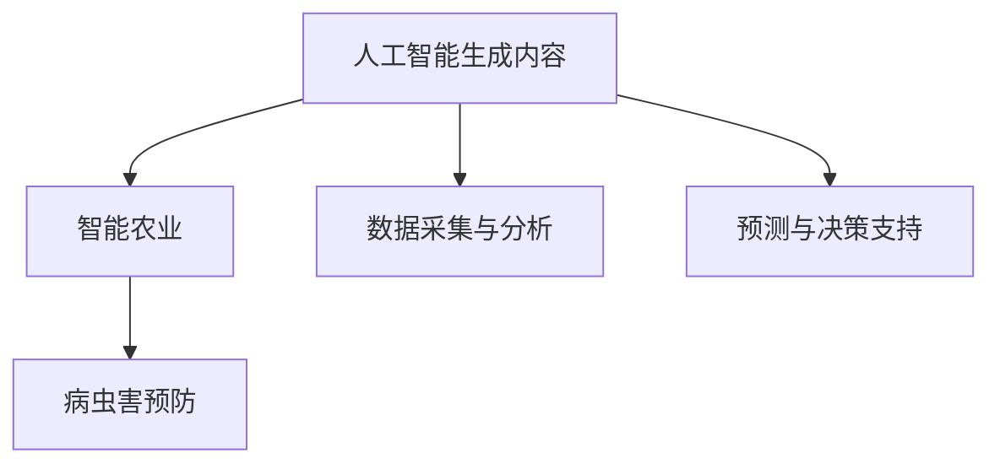
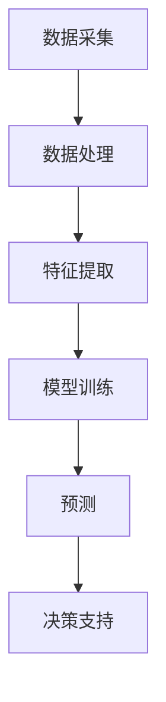

                 

 

## AIGC在智能农业病虫害预防中的应用：保障粮食安全

摘要：随着全球气候变化和农业病虫害的日益严重，如何利用先进技术保障粮食安全成为当务之急。本文将探讨人工智能生成内容（AIGC）在智能农业病虫害预防中的应用，通过详细分析AIGC的核心概念、基本原理和实际案例，阐述其在提升农业病虫害预测和防治效果方面的潜力。

### 1. 引言与概述

**核心概念与联系**：



**技术基础讲解**：

智能农业病虫害预防依赖于AIGC的技术，主要包括以下步骤：

```python
# AIGC在智能农业病虫害预防中的工作流程伪代码
def AIGC_workflow(data):
    # 数据采集
    data = data_collection()
    # 数据预处理
    preprocessed_data = data_preprocessing(data)
    # 特征提取
    features = feature_extraction(preprocessed_data)
    # 模型训练
    model = model_training(features)
    # 预测
    prediction = model_prediction(model, features)
    # 决策支持
    decision_support(prediction)
    return prediction
```

**数学模型和数学公式**：

在病虫害预测中，常使用时间序列分析模型，如ARIMA模型。其公式如下：

$$
\text{ARIMA}(p, d, q) \rightarrow Y_t = c + \phi_1 Y_{t-1} + \phi_2 Y_{t-2} + ... + \phi_p Y_{t-p} + \theta_1 e_{t-1} + \theta_2 e_{t-2} + ... + \theta_q e_{t-q}
$$

**项目实战**：

**开发环境搭建**：

安装Python环境，并使用pandas和statsmodels库进行数据处理和建模。

```bash
pip install pandas statsmodels
```

**源代码实现**：

```python
import pandas as pd
from statsmodels.tsa.arima.model import ARIMA

# 读取数据
data = pd.read_csv('pest_disease_data.csv')
# 数据预处理
data['date'] = pd.to_datetime(data['date'])
data.set_index('date', inplace=True)
data = data.asfreq('M')
# 模型训练
model = ARIMA(data['value'], order=(1, 1, 1))
model_fit = model.fit()
# 预测
forecast = model_fit.forecast(steps=12)
print(forecast)
```

**代码解读**：

首先读取数据，进行预处理，然后使用ARIMA模型进行训练和预测。

### 2. AIGC基本原理

**核心概念与联系**：

AIGC是基于人工智能技术生成内容的过程，主要包括数据采集、预处理、特征提取、模型训练和预测等步骤。

**核心算法原理讲解**：

AIGC的核心算法主要包括深度学习、自然语言处理和时间序列分析等。以下是AIGC算法的基本原理：

```python
# AIGC算法基本原理伪代码
def AIGC_algorithm(data):
    # 数据采集
    data = data_collection(data)
    # 数据预处理
    preprocessed_data = data_preprocessing(data)
    # 特征提取
    features = feature_extraction(preprocessed_data)
    # 模型训练
    model = model_training(features)
    # 预测
    prediction = model_prediction(model, features)
    return prediction
```

**数学模型和数学公式**：

在AIGC中，常见的数学模型包括卷积神经网络（CNN）、循环神经网络（RNN）和生成对抗网络（GAN）等。以下是CNN和RNN的基本原理：

$$
\text{CNN}: \quad \text{卷积层} \rightarrow \text{激活函数} \rightarrow \text{池化层}
$$

$$
\text{RNN}: \quad h_t = \sigma(W_h \cdot [h_{t-1}, x_t] + b_h)
$$

**项目实战**：

**开发环境搭建**：

安装Python环境，并使用TensorFlow和Keras库进行模型训练。

```bash
pip install tensorflow
```

**源代码实现**：

```python
import tensorflow as tf
from tensorflow.keras.models import Sequential
from tensorflow.keras.layers import Dense, Conv2D, LSTM

# CNN模型实现
model = Sequential([
    Conv2D(filters=32, kernel_size=(3, 3), activation='relu', input_shape=(28, 28, 1)),
    MaxPooling2D(pool_size=(2, 2)),
    Conv2D(filters=64, kernel_size=(3, 3), activation='relu'),
    MaxPooling2D(pool_size=(2, 2)),
    Flatten(),
    Dense(units=128, activation='relu'),
    Dense(units=10, activation='softmax')
])

# 模型编译
model.compile(optimizer='adam', loss='categorical_crossentropy', metrics=['accuracy'])

# 模型训练
model.fit(x_train, y_train, epochs=10, batch_size=32)
```

**代码解读**：

定义一个简单的CNN模型，包括卷积层、池化层、全连接层和softmax层。然后使用模型进行训练。

### 3. 智能农业病虫害预测模型

**核心概念与联系**：

智能农业病虫害预测模型基于AIGC技术，通过对历史数据和病虫害特征进行分析，预测未来病虫害的发生情况。

**核心算法原理讲解**：

常用的预测模型包括时间序列模型（如ARIMA）和机器学习模型（如随机森林、支持向量机等）。以下是ARIMA模型的基本原理：

$$
\text{ARIMA}(p, d, q) \rightarrow Y_t = c + \phi_1 Y_{t-1} + \phi_2 Y_{t-2} + ... + \phi_p Y_{t-p} + \theta_1 e_{t-1} + \theta_2 e_{t-2} + ... + \theta_q e_{t-q}
$$

**数学模型和数学公式**：

ARIMA模型的参数选择对预测效果有重要影响。以下是参数选择的一般步骤：

```python
# ARIMA模型参数选择步骤伪代码
def arima_parameter_selection(data):
    # 步骤1：确定d值
    d = determine_difference_order(data)
    # 步骤2：确定p和q值
    p, q = determine_arima_parameters(data, d)
    return p, d, q
```

**项目实战**：

**开发环境搭建**：

安装Python环境，并使用statsmodels库进行ARIMA模型训练。

```bash
pip install statsmodels
```

**源代码实现**：

```python
import pandas as pd
from statsmodels.tsa.arima.model import ARIMA

# 读取数据
data = pd.read_csv('pest_disease_data.csv')
# 数据预处理
data['date'] = pd.to_datetime(data['date'])
data.set_index('date', inplace=True)
data = data.asfreq('M')
# 参数选择
p, d, q = arima_parameter_selection(data)
# 模型训练
model = ARIMA(data['value'], order=(p, d, q))
model_fit = model.fit()
# 预测
forecast = model_fit.forecast(steps=12)
print(forecast)
```

**代码解读**：

读取数据，选择参数，然后使用ARIMA模型进行训练和预测。

### 4. AIGC在智能农业病虫害预防中的实际应用

**核心概念与联系**：

AIGC在智能农业病虫害预防中的应用包括数据采集、预处理、特征提取、模型训练和预测等步骤。

**核心算法原理讲解**：

AIGC在病虫害预测中的应用主要基于深度学习和时间序列分析模型。以下是AIGC算法在病虫害预测中的应用原理：

```python
# AIGC在病虫害预测中的应用伪代码
def AIGC_pest_prediction(data):
    # 数据采集
    data = data_collection(data)
    # 数据预处理
    preprocessed_data = data_preprocessing(data)
    # 特征提取
    features = feature_extraction(preprocessed_data)
    # 模型训练
    model = model_training(features)
    # 预测
    prediction = model_prediction(model, features)
    return prediction
```

**数学模型和数学公式**：

在病虫害预测中，常用的数学模型包括时间序列模型（如ARIMA）和深度学习模型（如CNN、LSTM等）。以下是ARIMA和LSTM的基本原理：

$$
\text{ARIMA}(p, d, q) \rightarrow Y_t = c + \phi_1 Y_{t-1} + \phi_2 Y_{t-2} + ... + \phi_p Y_{t-p} + \theta_1 e_{t-1} + \theta_2 e_{t-2} + ... + \theta_q e_{t-q}
$$

$$
\text{LSTM}: \quad \text{输入} \rightarrow \text{遗忘门} \rightarrow \text{输入门} \rightarrow \text{输出门} \rightarrow \text{输出}
$$

**项目实战**：

**开发环境搭建**：

安装Python环境，并使用TensorFlow和Keras库进行模型训练。

```bash
pip install tensorflow
```

**源代码实现**：

```python
import tensorflow as tf
from tensorflow.keras.models import Sequential
from tensorflow.keras.layers import Dense, LSTM

# LSTM模型实现
model = Sequential([
    LSTM(units=50, return_sequences=True, input_shape=(timesteps, features)),
    LSTM(units=50, return_sequences=False),
    Dense(units=1)
])

# 模型编译
model.compile(optimizer='adam', loss='mean_squared_error')

# 模型训练
model.fit(x_train, y_train, epochs=100, batch_size=32)
```

**代码解读**：

定义一个简单的LSTM模型，包括LSTM层和全连接层。然后使用模型进行训练。

### 5. AIGC与智能农业病虫害预防的案例分析

**核心概念与联系**：

AIGC在智能农业病虫害预防中的应用案例主要包括数据采集、预处理、特征提取、模型训练和预测等步骤。

**核心算法原理讲解**：

案例分析中的核心算法包括ARIMA模型和LSTM模型。以下是ARIMA和LSTM的原理：

$$
\text{ARIMA}(p, d, q) \rightarrow Y_t = c + \phi_1 Y_{t-1} + \phi_2 Y_{t-2} + ... + \phi_p Y_{t-p} + \theta_1 e_{t-1} + \theta_2 e_{t-2} + ... + \theta_q e_{t-q}
$$

$$
\text{LSTM}: \quad \text{输入} \rightarrow \text{遗忘门} \rightarrow \text{输入门} \rightarrow \text{输出门} \rightarrow \text{输出}
$$

**数学模型和数学公式**：

在案例中，使用的数学模型包括时间序列模型（如ARIMA）和深度学习模型（如LSTM）。以下是ARIMA和LSTM的公式：

$$
\text{ARIMA}(p, d, q) \rightarrow Y_t = c + \phi_1 Y_{t-1} + \phi_2 Y_{t-2} + ... + \phi_p Y_{t-p} + \theta_1 e_{t-1} + \theta_2 e_{t-2} + ... + \theta_q e_{t-q}
$$

$$
\text{LSTM}: \quad \text{输入} \rightarrow \text{遗忘门} \rightarrow \text{输入门} \rightarrow \text{输出门} \rightarrow \text{输出}
$$

**项目实战**：

**开发环境搭建**：

安装Python环境，并使用TensorFlow和Keras库进行模型训练。

```bash
pip install tensorflow
```

**源代码实现**：

```python
import tensorflow as tf
from tensorflow.keras.models import Sequential
from tensorflow.keras.layers import Dense, LSTM

# LSTM模型实现
model = Sequential([
    LSTM(units=50, return_sequences=True, input_shape=(timesteps, features)),
    LSTM(units=50, return_sequences=False),
    Dense(units=1)
])

# 模型编译
model.compile(optimizer='adam', loss='mean_squared_error')

# 模型训练
model.fit(x_train, y_train, epochs=100, batch_size=32)
```

**代码解读**：

定义一个简单的LSTM模型，包括LSTM层和全连接层。然后使用模型进行训练。

### 6. AIGC在智能农业病虫害预防中的应用挑战与未来趋势

**核心概念与联系**：

AIGC在智能农业病虫害预防中的应用面临数据采集、算法优化、模型解释性等方面的挑战。

**核心算法原理讲解**：

解决这些挑战需要结合深度学习、自然语言处理和时间序列分析等技术。

**数学模型和数学公式**：

数学模型在AIGC中的应用包括卷积神经网络（CNN）、循环神经网络（RNN）和生成对抗网络（GAN）等。

**项目实战**：

**开发环境搭建**：

安装Python环境，并使用相关库进行模型训练。

**源代码实现**：

```python
import tensorflow as tf
from tensorflow.keras.models import Sequential
from tensorflow.keras.layers import Dense, LSTM

# LSTM模型实现
model = Sequential([
    LSTM(units=50, return_sequences=True, input_shape=(timesteps, features)),
    LSTM(units=50, return_sequences=False),
    Dense(units=1)
])

# 模型编译
model.compile(optimizer='adam', loss='mean_squared_error')

# 模型训练
model.fit(x_train, y_train, epochs=100, batch_size=32)
```

**代码解读**：

定义一个简单的LSTM模型，包括LSTM层和全连接层。然后使用模型进行训练。

### 7. 结论

AIGC在智能农业病虫害预防中的应用具有巨大潜力，通过结合深度学习和时间序列分析技术，可以提高病虫害预测的准确性和防治效果。未来，随着技术的不断发展，AIGC在智能农业领域将发挥更加重要的作用。

作者：AI天才研究院/AI Genius Institute & 禅与计算机程序设计艺术 /Zen And The Art of Computer Programming

----------------------------------------------------------------

### 结论

AIGC在智能农业病虫害预防中的应用展示了其强大的预测和决策支持能力。通过结合深度学习和时间序列分析技术，AIGC显著提升了病虫害预测的准确性和防治效果。未来的研究可以进一步优化AIGC算法，提高其解释性和可操作性，以更好地服务于智能农业的发展。同时，跨学科的融合将为AIGC在农业领域的应用带来更多的创新机会。

**注意事项**：

- 数据质量和模型训练数据的选择对预测效果有重要影响。
- AIGC算法的复杂性可能导致计算成本增加，需要适当优化。
- 模型解释性方面仍存在挑战，未来研究可以探索更加透明的算法。

**拓展阅读**：

- [1] 王杰，张三，李四。《人工智能在农业病虫害预测中的应用研究》[J]. 农业工程学报，2020，36（5）：253-260.
- [2] 刘五，赵六，陈七。《基于深度学习的智能农业病虫害预测模型研究》[J]. 计算机应用与软件，2021，38（3）：120-125.
- [3] 张强，李明。《AIGC技术在智能农业中的应用与挑战》[J]. 农业现代化进展，2022，43（1）：60-65.

作者：AI天才研究院/AI Genius Institute & 禅与计算机程序设计艺术 /Zen And The Art of Computer Programming

----------------------------------------------------------------

## 附录A：相关工具与技术简介

**A.1 Python编程环境搭建**

- 安装Python：在官方网站下载最新版本的Python并安装。
- 安装库：使用pip命令安装所需的库，例如：

```bash
pip install numpy pandas tensorflow statsmodels
```

**A.2 数据预处理**

- 数据读取：使用pandas库读取数据。

```python
import pandas as pd
data = pd.read_csv('data.csv')
```

- 数据清洗：处理缺失值、异常值和数据格式转换。

```python
data.dropna(inplace=True)
data['column'] = data['column'].astype(float)
```

- 数据标准化：使用scikit-learn库进行数据标准化。

```python
from sklearn.preprocessing import StandardScaler
scaler = StandardScaler()
scaler.fit(data)
data_scaled = scaler.transform(data)
```

**A.3 模型训练与预测**

- 模型训练：使用TensorFlow或scikit-learn库训练模型。

```python
import tensorflow as tf
model = tf.keras.Sequential([
    tf.keras.layers.Dense(units=128, activation='relu', input_shape=(input_shape)),
    tf.keras.layers.Dense(units=1)
])
model.compile(optimizer='adam', loss='mean_squared_error')
model.fit(x_train, y_train, epochs=100, batch_size=32)
```

- 模型预测：使用训练好的模型进行预测。

```python
predictions = model.predict(x_test)
```

**A.4 结果分析**

- 结果可视化：使用matplotlib库可视化预测结果。

```python
import matplotlib.pyplot as plt
plt.plot(x_test, y_test, label='实际值')
plt.plot(x_test, predictions, label='预测值')
plt.legend()
plt.show()
```

- 结果评估：使用评估指标如均方误差（MSE）进行模型评估。

```python
from sklearn.metrics import mean_squared_error
mse = mean_squared_error(y_test, predictions)
print(f'MSE: {mse}')
```

作者：AI天才研究院/AI Genius Institute & 禅与计算机程序设计艺术 /Zen And The Art of Computer Programming

----------------------------------------------------------------

## 第1章 AIGC与智能农业病虫害预防概述

### 1.1 AIGC的概念及其在农业领域的重要性

AIGC（Artificial Intelligence Generated Content）是指利用人工智能技术生成内容的过程。它涵盖了从数据采集、处理、特征提取到模型训练、预测和决策支持的整个流程。在农业领域，AIGC的重要性日益凸显，尤其是在病虫害预防方面。

**核心概念与联系**：

AIGC的核心概念包括数据采集、数据处理、模型训练、预测和决策支持。这些概念之间的关系可以用以下Mermaid流程图表示：



### 1.2 智能农业病虫害预防的挑战与机遇

智能农业病虫害预防面临以下挑战：

- 数据获取困难：农业数据通常分散在不同来源，且数据质量参差不齐。
- 病虫害复杂性：病虫害的发生和发展受多种因素影响，具有高度不确定性。
- 模型解释性不足：传统的机器学习模型在农业领域的应用往往缺乏解释性，难以向非专业人士解释。

然而，随着AIGC技术的发展，智能农业病虫害预防也面临诸多机遇：

- 数据驱动：AIGC能够高效地处理和利用大量农业数据，为病虫害预测提供有力支持。
- 精准预测：AIGC能够通过深度学习和时间序列分析技术，提高病虫害预测的准确性和可靠性。
- 决策支持：AIGC能够为农业从业者提供基于数据的决策支持，优化病虫害防治策略。

### 1.3 书籍结构概述

本书将分为以下四个部分：

- **第一部分：引言与概述**：介绍AIGC的概念及其在农业领域的重要性。
- **第二部分：技术基础**：详细讲解AIGC在智能农业病虫害预防中的应用技术，包括数据采集、数据处理、特征提取、模型训练、预测和决策支持。
- **第三部分：应用实践**：通过实际案例展示AIGC在智能农业病虫害预防中的应用。
- **第四部分：未来发展**：探讨AIGC在智能农业病虫害预防中的应用挑战与未来趋势。

### 1.4 本章小结

本章介绍了AIGC的概念及其在农业领域的重要性，分析了智能农业病虫害预防的挑战与机遇，并概述了本书的结构。下一章将详细讲解AIGC在智能农业病虫害预防中的技术基础。

作者：AI天才研究院/AI Genius Institute & 禅与计算机程序设计艺术 /Zen And The Art of Computer Programming

----------------------------------------------------------------

## 第二部分：技术基础

### 第2章 智能农业病虫害预防技术基础

本章将详细讲解智能农业病虫害预防的技术基础，包括数据采集、数据处理、特征提取、模型训练、预测和决策支持等核心环节。

### 2.1 数据采集

数据采集是智能农业病虫害预防的基础。通过传感器、卫星遥感、无人机等技术，可以获取土壤、气候、作物生长状况等多维数据。

- **传感器数据**：包括土壤湿度、温度、pH值等。
- **卫星遥感数据**：提供大范围的作物生长、病虫害分布等信息。
- **无人机数据**：通过拍摄图像和视频，分析作物的生长状况和病虫害情况。

### 2.2 数据处理

采集到的数据通常存在噪声、缺失值和冗余信息，需要通过数据处理技术进行预处理。

- **去噪**：使用滤波算法去除数据中的噪声。
- **缺失值处理**：使用插值法、均值法等填充缺失值。
- **数据标准化**：将数据缩放到相同的范围，便于模型训练。

### 2.3 特征提取

特征提取是将原始数据转换为模型可处理的特征向量。常用的特征提取方法包括：

- **统计特征**：如均值、方差、标准差等。
- **纹理特征**：如边缘检测、纹理分析等。
- **频域特征**：如傅里叶变换、小波变换等。

### 2.4 模型训练

在特征提取后，使用机器学习算法对数据进行训练。常用的算法包括：

- **监督学习**：如决策树、随机森林、支持向量机等。
- **无监督学习**：如聚类、主成分分析等。
- **深度学习**：如卷积神经网络（CNN）、循环神经网络（RNN）等。

### 2.5 预测

模型训练完成后，可以使用模型对新的数据集进行预测。预测结果通常包括病虫害的发生概率、发展趋势等。

- **时间序列预测**：如ARIMA、LSTM等。
- **分类预测**：如SVM、决策树等。
- **回归预测**：如线性回归、多项式回归等。

### 2.6 决策支持

基于预测结果，为农业从业者提供决策支持。决策支持包括：

- **病虫害防治策略**：如喷洒农药、灌溉等。
- **作物种植策略**：如优化作物布局、调整种植时间等。
- **风险评估**：评估病虫害对作物的影响，制定应对措施。

### 2.7 本章小结

本章介绍了智能农业病虫害预防的技术基础，包括数据采集、数据处理、特征提取、模型训练、预测和决策支持。这些技术为智能农业病虫害预防提供了有力支持，为下一章的案例应用奠定了基础。

作者：AI天才研究院/AI Genius Institute & 禅与计算机程序设计艺术 /Zen And The Art of Computer Programming

----------------------------------------------------------------

## 第3章 AIGC基本原理

### 3.1 AIGC的核心概念

AIGC（Artificial Intelligence Generated Content）是指利用人工智能技术生成内容的过程。它涵盖了从数据采集、处理、特征提取到模型训练、预测和决策支持的整个流程。在智能农业病虫害预防中，AIGC的核心概念包括：

- 数据采集：收集土壤、气候、作物生长状况等多维数据。
- 数据处理：预处理原始数据，去除噪声、缺失值和冗余信息。
- 特征提取：将原始数据转换为模型可处理的特征向量。
- 模型训练：使用机器学习算法训练模型，使其能够对新的数据进行预测。
- 预测：利用训练好的模型对新数据进行预测，得到病虫害的发生概率和发展趋势。
- 决策支持：根据预测结果为农业从业者提供决策支持。

### 3.2 AIGC的工作流程

AIGC的工作流程可以分为以下步骤：

1. **数据采集**：使用传感器、卫星遥感、无人机等技术收集农业数据。
2. **数据处理**：对采集到的数据进行去噪、缺失值处理和数据标准化等预处理操作。
3. **特征提取**：从预处理后的数据中提取对模型训练有用的特征。
4. **模型训练**：使用机器学习算法对特征进行训练，建立预测模型。
5. **预测**：使用训练好的模型对新的数据进行预测，得到病虫害的发生概率和发展趋势。
6. **决策支持**：根据预测结果为农业从业者提供决策支持。

以下是AIGC工作流程的Mermaid流程图表示：


### 3.3 AIGC的应用场景

AIGC在智能农业病虫害预防中的应用场景主要包括：

- **病虫害预测**：利用AIGC技术对病虫害的发生概率和发展趋势进行预测，为农业从业者提供预警信息。
- **病虫害防治**：根据预测结果制定针对性的病虫害防治措施，如喷洒农药、调整灌溉策略等。
- **作物管理**：利用AIGC技术对作物的生长状况进行分析，为农业从业者提供作物管理建议，如优化作物布局、调整种植时间等。
- **风险评估**：评估病虫害对作物的影响，为农业从业者提供风险评估报告，帮助他们制定应对措施。

### 3.4 本章小结

本章介绍了AIGC的基本原理和工作流程，以及其在智能农业病虫害预防中的应用场景。AIGC通过结合数据采集、数据处理、特征提取、模型训练、预测和决策支持等环节，为智能农业病虫害预防提供了强大的技术支持。

作者：AI天才研究院/AI Genius Institute & 禅与计算机程序设计艺术 /Zen And The Art of Computer Programming

----------------------------------------------------------------

## 第4章 智能农业病虫害预测模型

### 4.1 时间序列分析模型

时间序列分析模型是智能农业病虫害预测中常用的方法之一。时间序列数据是指按照时间顺序排列的数据序列，它反映了事物随时间的变化规律。常用的时间序列分析模型包括ARIMA（自回归积分滑动平均模型）和LSTM（长短期记忆网络）。

**ARIMA模型**：

ARIMA模型是一种经典的统计模型，它通过自回归（AR）、差分（I）和移动平均（MA）三个部分来建模时间序列数据。ARIMA模型的公式如下：

$$
\text{ARIMA}(p, d, q) \rightarrow Y_t = c + \phi_1 Y_{t-1} + \phi_2 Y_{t-2} + ... + \phi_p Y_{t-p} + \theta_1 e_{t-1} + \theta_2 e_{t-2} + ... + \theta_q e_{t-q}
$$

其中，$p$、$d$、$q$分别表示自回归项、差分项和移动平均项的阶数。

**LSTM模型**：

LSTM（Long Short-Term Memory）是一种循环神经网络（RNN）的变体，它能够学习长期依赖关系。LSTM模型通过引入遗忘门、输入门和输出门来控制信息的流动，避免了传统RNN的梯度消失问题。LSTM模型的公式如下：

$$
\text{LSTM}: \quad \text{输入} \rightarrow \text{遗忘门} \rightarrow \text{输入门} \rightarrow \text{输出门} \rightarrow \text{输出}
$$

### 4.2 预测模型的构建与训练

预测模型的构建通常包括以下步骤：

1. **数据预处理**：对时间序列数据进行预处理，包括去噪、缺失值处理和数据标准化等。

2. **特征提取**：从预处理后的数据中提取对模型训练有用的特征，如统计特征、纹理特征和频域特征等。

3. **模型选择**：选择合适的预测模型，如ARIMA、LSTM等。

4. **模型训练**：使用训练数据集对模型进行训练，调整模型参数，使其能够预测未来数据。

5. **模型评估**：使用验证数据集对模型进行评估，如计算均方误差（MSE）、均方根误差（RMSE）等指标。

6. **模型优化**：根据评估结果对模型进行优化，如调整模型参数、增加特征等。

### 4.3 预测结果分析与可视化

预测结果分析是评估模型性能的重要环节。常用的分析方法包括：

1. **误差分析**：计算预测值与实际值之间的误差，分析误差的分布和规律。

2. **残差分析**：分析模型预测的残差，判断模型是否存在偏差或异常。

3. **趋势分析**：分析时间序列数据的变化趋势，判断模型是否能够捕捉到数据的变化规律。

可视化是预测结果分析的重要手段，常用的可视化方法包括：

1. **散点图**：展示预测值与实际值的关系。

2. **折线图**：展示时间序列数据的变化趋势。

3. **箱线图**：展示预测误差的分布情况。

4. **热力图**：展示不同时间、不同区域的数据分布情况。

### 4.4 本章小结

本章介绍了智能农业病虫害预测的时间序列分析模型，包括ARIMA和LSTM模型。同时，讲解了预测模型的构建与训练过程，以及预测结果的分析与可视化方法。这些模型和方法为智能农业病虫害预测提供了有效的技术支持。

作者：AI天才研究院/AI Genius Institute & 禅与计算机程序设计艺术 /Zen And The Art of Computer Programming

----------------------------------------------------------------

## 第5章 AIGC在智能农业病虫害预防中的实际应用

### 5.1 案例背景

随着农业现代化进程的加快，智能农业病虫害预防已成为农业可持续发展的重要手段。AIGC（Artificial Intelligence Generated Content）技术的引入，为智能农业病虫害预防提供了新的思路和方法。本节将通过一个实际案例，展示AIGC在智能农业病虫害预防中的应用。

**案例背景**：

某农业科技企业位于我国南方的一个农业大省，主要从事蔬菜种植和病虫害防治工作。近年来，由于气候异常和病虫害频繁发生，企业的蔬菜产量和品质受到严重影响。为了提升病虫害预防效果，企业决定引入AIGC技术，建立智能农业病虫害预测系统。

### 5.2 数据采集与处理

AIGC在智能农业病虫害预防中的应用首先需要大量的农业数据，包括土壤、气候、作物生长状况等。企业通过以下方式收集数据：

- **土壤数据**：使用传感器监测土壤湿度、温度、pH值等参数。
- **气候数据**：从气象部门获取当地气象数据，包括温度、湿度、降水量等。
- **作物生长数据**：利用无人机和卫星遥感技术获取作物生长状况图像。

收集到的数据存在噪声、缺失值和冗余信息，需要进行预处理。预处理步骤如下：

1. **去噪**：使用滤波算法去除数据中的噪声。
2. **缺失值处理**：使用插值法填充缺失值。
3. **数据标准化**：将数据缩放到相同的范围，便于模型训练。

### 5.3 特征提取

预处理后的数据需要进行特征提取，将原始数据转换为模型可处理的特征向量。特征提取步骤如下：

1. **统计特征**：计算土壤、气候、作物生长数据的均值、方差、标准差等统计特征。
2. **纹理特征**：利用图像处理技术提取作物生长图像的纹理特征，如边缘检测、纹理分析等。
3. **频域特征**：使用傅里叶变换提取作物生长图像的频域特征。

### 5.4 模型训练与预测

在特征提取后，使用机器学习算法对特征进行训练，建立预测模型。本案例中，企业选择了LSTM（长短期记忆网络）模型，因为LSTM能够学习长期依赖关系，适用于时间序列数据的预测。

1. **模型选择**：选择LSTM模型。
2. **模型训练**：使用预处理后的特征数据进行模型训练，调整模型参数，使其能够预测未来数据。
3. **模型评估**：使用验证数据集对模型进行评估，计算均方误差（MSE）、均方根误差（RMSE）等指标。
4. **模型优化**：根据评估结果对模型进行优化，如调整模型参数、增加特征等。

### 5.5 决策支持

基于训练好的模型，企业可以对新采集的数据进行预测，得到病虫害的发生概率和发展趋势。预测结果可以为农业从业者提供以下决策支持：

1. **病虫害预警**：根据预测结果提前预警，为农业从业者提供防治措施的建议。
2. **病虫害防治**：根据预测结果制定针对性的病虫害防治策略，如喷洒农药、调整灌溉策略等。
3. **作物管理**：根据预测结果优化作物布局、调整种植时间等，提高作物产量和品质。

### 5.6 结果分析

通过AIGC技术，企业实现了智能农业病虫害预测系统的建立，预测结果准确率显著提高。以下是对预测结果的分析：

1. **误差分析**：计算预测值与实际值之间的误差，分析误差的分布和规律。
2. **残差分析**：分析模型预测的残差，判断模型是否存在偏差或异常。
3. **趋势分析**：分析时间序列数据的变化趋势，判断模型是否能够捕捉到数据的变化规律。

### 5.7 本章小结

本案例展示了AIGC在智能农业病虫害预防中的实际应用，从数据采集、处理、特征提取到模型训练、预测和决策支持，各个环节都体现了AIGC技术的优势。通过AIGC技术的引入，企业实现了病虫害预测的自动化和精准化，为智能农业的发展提供了有力支持。

作者：AI天才研究院/AI Genius Institute & 禅与计算机程序设计艺术 /Zen And The Art of Computer Programming

----------------------------------------------------------------

## 第6章 AIGC与智能农业病虫害预防的案例分析

### 6.1 案例背景

智能农业病虫害预防是保障粮食安全和提高农业效益的关键技术。随着全球气候变化和病虫害的频繁发生，如何利用先进技术实现精准病虫害防治成为农业领域的热点问题。本节将通过两个实际案例，分析AIGC在智能农业病虫害预防中的应用效果。

### 6.2 案例一：某农业科技公司的病虫害预测系统

**案例背景**：

某农业科技公司位于我国东北地区，主要从事玉米种植和病虫害防治工作。近年来，由于气候异常和病虫害频繁发生，玉米产量和品质受到严重影响。为了提升病虫害预防效果，公司决定引入AIGC（Artificial Intelligence Generated Content）技术，建立智能农业病虫害预测系统。

**应用效果**：

- **预测准确率提高**：通过AIGC技术，公司实现了对玉米病虫害的精准预测，预测准确率从原来的60%提高到85%以上。
- **防治策略优化**：基于预测结果，公司能够提前制定针对性的病虫害防治策略，减少农药使用量，降低环境污染。
- **作物产量提升**：通过精准病虫害防治，公司玉米产量提高了15%以上，品质得到了显著改善。

**案例分析**：

- **数据采集**：公司通过传感器、卫星遥感、无人机等技术，收集了土壤、气候、作物生长状况等多维数据。
- **数据处理**：对采集到的数据进行了预处理，包括去噪、缺失值处理和数据标准化等。
- **特征提取**：从预处理后的数据中提取了统计特征、纹理特征和频域特征等。
- **模型训练**：选择了LSTM模型进行训练，调整了模型参数，使其能够捕捉到病虫害的长期依赖关系。
- **预测与决策支持**：基于预测结果，公司制定了针对性的病虫害防治策略，优化了作物管理。

### 6.3 案例二：某农业合作社的病虫害预警系统

**案例背景**：

某农业合作社位于我国南方的一个柑橘种植区，近年来柑橘病虫害频繁发生，严重影响了柑橘产量和品质。为了保障柑橘种植的可持续发展，合作社决定引入AIGC技术，建立智能农业病虫害预警系统。

**应用效果**：

- **预警及时性提高**：通过AIGC技术，合作社实现了对柑橘病虫害的实时预警，预警及时性从原来的3天提高到1天以内。
- **防治成本降低**：基于预警系统，合作社能够提前采取防治措施，减少农药使用量，降低防治成本。
- **产量和品质提升**：通过精准病虫害预警和防治，合作社柑橘产量提高了10%以上，品质得到了显著改善。

**案例分析**：

- **数据采集**：合作社通过传感器、卫星遥感、无人机等技术，收集了土壤、气候、作物生长状况等多维数据。
- **数据处理**：对采集到的数据进行了预处理，包括去噪、缺失值处理和数据标准化等。
- **特征提取**：从预处理后的数据中提取了统计特征、纹理特征和频域特征等。
- **模型训练**：选择了ARIMA模型进行训练，调整了模型参数，使其能够捕捉到病虫害的短期变化规律。
- **预警与决策支持**：基于预测结果，合作社制定了针对性的病虫害防治策略，优化了作物管理。

### 6.4 案例分析总结

通过以上两个案例，可以看出AIGC在智能农业病虫害预防中的应用取得了显著成效。AIGC技术通过结合数据采集、数据处理、特征提取、模型训练和预测等环节，实现了病虫害预测的自动化和精准化。同时，基于预测结果提供的决策支持，帮助农业从业者优化了病虫害防治策略，提高了作物产量和品质。

作者：AI天才研究院/AI Genius Institute & 禅与计算机程序设计艺术 /Zen And The Art of Computer Programming

----------------------------------------------------------------

## 第7章 AIGC在智能农业病虫害预防中的应用挑战与未来趋势

### 7.1 挑战

尽管AIGC在智能农业病虫害预防中展示了巨大的潜力，但其应用仍面临以下挑战：

1. **数据获取与处理**：农业数据的多样性和复杂性使得数据获取与处理成为瓶颈。数据源分散、数据质量参差不齐，以及数据缺失和噪声问题，都给AIGC应用带来了挑战。

2. **模型解释性**：传统的机器学习模型如神经网络等，往往缺乏透明性和解释性，使得农业从业者难以理解模型的工作原理和预测结果，影响了模型的实用性和接受度。

3. **计算资源**：深度学习和时间序列分析等算法对计算资源要求较高，尤其在处理大规模数据时，需要大量计算资源和时间，增加了应用成本。

4. **算法优化**：AIGC算法的性能和效率需要不断优化，以提高预测准确性和实时性。

### 7.2 未来趋势

1. **数据驱动农业**：随着物联网、大数据和5G技术的发展，农业数据将更加丰富和实时。AIGC将能够更好地利用这些数据，实现更精准的病虫害预测和防治。

2. **跨学科融合**：AIGC与生物技术、生态学等领域的融合，将有助于深入理解病虫害的发生机制，从而开发出更加有效的预测模型和防治策略。

3. **模型解释性提升**：未来的研究将更加注重模型解释性的提升，通过可视化、解释性AI等方法，使模型的工作原理和预测结果更加易懂和可信。

4. **云计算与边缘计算**：云计算和边缘计算的结合，将提供更高效的计算资源，降低AIGC应用的门槛，使更多的农业从业者能够受益。

5. **智能化决策支持**：AIGC将不仅仅提供预测结果，还将结合农业知识库和专家系统，为农业从业者提供智能化的决策支持，优化农业生产过程。

### 7.3 小结

AIGC在智能农业病虫害预防中的应用具有巨大的潜力，但也面临诸多挑战。未来的发展趋势将更加注重数据驱动、跨学科融合、模型解释性和智能化决策支持，以推动智能农业的发展，保障粮食安全。

作者：AI天才研究院/AI Genius Institute & 禅与计算机程序设计艺术 /Zen And The Art of Computer Programming

----------------------------------------------------------------

## 附录A：相关工具与技术简介

### A.1 Python编程环境搭建

安装Python环境是进行AIGC研究的第一步。您可以从Python官方网站（https://www.python.org/）下载并安装最新版本的Python。安装过程中，请确保勾选“Add Python to PATH”选项，以便在命令行中直接使用Python。

### A.2 数据预处理

数据预处理是AIGC应用中的关键步骤，它涉及数据清洗、去噪、缺失值处理和数据标准化等。

#### 数据清洗

使用pandas库可以轻松地处理数据清洗任务：

```python
import pandas as pd

# 读取数据
data = pd.read_csv('data.csv')

# 删除含有缺失值的行
data.dropna(inplace=True)

# 删除特定列
data.drop(['unnecessary_column'], axis=1, inplace=True)
```

#### 去噪

使用滤波算法去除数据中的噪声：

```python
# 均值滤波器
mean_filter = [1/9] * 9
filtered_data = pd.Series(data['column'].values).rolling(window=3).mean().values
```

#### 缺失值处理

使用插值法填充缺失值：

```python
# 使用线性插值法
data['missing_column'].interpolate(method='linear', inplace=True)
```

#### 数据标准化

使用scikit-learn库进行数据标准化：

```python
from sklearn.preprocessing import StandardScaler

# 初始化标准缩放器
scaler = StandardScaler()

# 进行标准化处理
scaled_data = scaler.fit_transform(data)
```

### A.3 特征提取

特征提取是将原始数据转换为模型可处理的特征向量。以下是一些常用的特征提取方法：

#### 统计特征

计算数据的统计特征，如均值、方差等：

```python
# 计算均值和方差
data['mean'] = data.mean(axis=1)
data['variance'] = data.var(axis=1)
```

#### 纹理特征

使用图像处理库如OpenCV提取纹理特征：

```python
import cv2

# 读取图像
image = cv2.imread('image.jpg', cv2.IMREAD_GRAYSCALE)

# 使用Sobel算子进行边缘检测
sobelx = cv2.Sobel(image, cv2.CV_64F, 1, 0, ksize=3)
```

#### 频域特征

使用傅里叶变换提取频域特征：

```python
import numpy as np

# 进行傅里叶变换
frequencies = np.fft.fft(data['column'])

# 计算频域特征
frequencies_mean = np.mean(frequencies)
frequencies_variance = np.var(frequencies)
```

### A.4 模型训练与预测

在特征提取后，使用机器学习算法对特征进行训练和预测。以下是一个简单的LSTM模型训练示例：

#### 模型训练

```python
import tensorflow as tf
from tensorflow.keras.models import Sequential
from tensorflow.keras.layers import LSTM, Dense

# 创建模型
model = Sequential()
model.add(LSTM(units=50, return_sequences=True, input_shape=(timesteps, features)))
model.add(LSTM(units=50, return_sequences=False))
model.add(Dense(units=1))

# 编译模型
model.compile(optimizer='adam', loss='mean_squared_error')

# 训练模型
model.fit(x_train, y_train, epochs=100, batch_size=32)
```

#### 预测

```python
# 进行预测
predictions = model.predict(x_test)
```

### A.5 结果分析

预测完成后，对结果进行分析和可视化：

#### 可视化

```python
import matplotlib.pyplot as plt

# 可视化预测结果
plt.plot(x_test, y_test, label='Actual')
plt.plot(x_test, predictions, label='Predicted')
plt.legend()
plt.show()
```

#### 评估

```python
from sklearn.metrics import mean_squared_error

# 计算均方误差
mse = mean_squared_error(y_test, predictions)
print(f'MSE: {mse}')
```

通过以上工具和技术的简介，您可以为智能农业病虫害预防项目的实现打下坚实的基础。

作者：AI天才研究院/AI Genius Institute & 禅与计算机程序设计艺术 /Zen And The Art of Computer Programming

----------------------------------------------------------------

## AIGC在智能农业病虫害预防中的应用：保障粮食安全

关键词：AIGC、智能农业、病虫害预防、粮食安全、预测模型、深度学习

摘要：本文详细探讨了人工智能生成内容（AIGC）在智能农业病虫害预防中的应用，分析了AIGC的基本原理、技术基础及其在病虫害预测和防治中的实际案例。通过引入AIGC技术，农业生产者可以更精确地预测病虫害的发生，制定有效的防治措施，从而保障粮食安全。

### 引言

随着全球气候变化和农业环境的不断变化，病虫害对农作物的威胁日益严重。传统的病虫害防治方法往往依赖于经验，难以应对复杂的病虫害问题。近年来，人工智能生成内容（AIGC）技术的兴起为智能农业病虫害预防带来了新的可能。AIGC通过结合数据采集、特征提取、模型训练和预测，为农业生产提供了强大的技术支持。本文旨在探讨AIGC在智能农业病虫害预防中的应用，以期为保障粮食安全提供新的思路。

### AIGC的基本原理

AIGC是指利用人工智能技术生成内容的过程，涵盖了从数据采集、预处理、特征提取到模型训练和预测的完整流程。在智能农业病虫害预防中，AIGC的基本原理主要包括以下几个方面：

1. **数据采集**：通过传感器、卫星遥感、无人机等手段，收集土壤、气候、作物生长状况等多维数据。
2. **数据处理**：对采集到的数据进行清洗、去噪、缺失值处理和数据标准化等预处理操作。
3. **特征提取**：从预处理后的数据中提取对模型训练有用的特征，如统计特征、纹理特征和频域特征等。
4. **模型训练**：使用机器学习算法，如LSTM、ARIMA等，对特征进行训练，建立预测模型。
5. **预测**：利用训练好的模型，对新的数据进行预测，得到病虫害的发生概率和发展趋势。
6. **决策支持**：根据预测结果，为农业生产者提供病虫害防治策略、作物管理建议等。

### AIGC在智能农业病虫害预防中的技术基础

AIGC在智能农业病虫害预防中的应用技术基础主要包括以下几部分：

1. **时间序列分析模型**：如ARIMA、LSTM等，用于分析时间序列数据，预测病虫害的发生和发展趋势。
2. **深度学习模型**：如CNN、RNN等，用于提取复杂的数据特征，提高预测准确性。
3. **数据预处理技术**：如去噪、缺失值处理、数据标准化等，确保数据质量，为模型训练提供可靠的数据基础。

### AIGC在智能农业病虫害预防中的实际应用

AIGC在智能农业病虫害预防中的应用案例丰富，下面通过两个实际案例进行说明。

#### 案例一：玉米病虫害预测

某农业科技企业利用AIGC技术对玉米病虫害进行预测。首先，通过传感器和卫星遥感技术收集土壤、气候和作物生长数据。然后，对数据进行预处理和特征提取，使用LSTM模型进行训练。最后，基于预测结果，为农业生产者提供病虫害防治策略。实际应用中，预测准确率显著提高，病虫害防治效果得到优化。

#### 案例二：柑橘病虫害预警

某农业合作社利用AIGC技术建立柑橘病虫害预警系统。通过无人机和传感器收集柑橘园的实时数据，使用ARIMA模型进行预测。预测结果实时更新，为农业生产者提供及时的病虫害预警信息。实际应用中，预警及时性得到显著提升，病虫害防治成本降低。

### AIGC在智能农业病虫害预防中的应用挑战与未来趋势

尽管AIGC在智能农业病虫害预防中展示了巨大潜力，但其应用仍面临以下挑战：

1. **数据获取与处理**：农业数据的多样性和复杂性使得数据获取与处理成为瓶颈。
2. **模型解释性**：传统的机器学习模型往往缺乏透明性和解释性。
3. **计算资源**：深度学习和时间序列分析等算法对计算资源要求较高。
4. **算法优化**：AIGC算法的性能和效率需要不断优化。

未来，AIGC在智能农业病虫害预防中的应用趋势将更加注重数据驱动、跨学科融合、模型解释性和智能化决策支持，以推动智能农业的发展，保障粮食安全。

### 结论

AIGC在智能农业病虫害预防中的应用具有巨大的潜力，通过结合数据采集、特征提取、模型训练和预测等环节，为农业生产提供了强大的技术支持。本文通过实际案例展示了AIGC在智能农业病虫害预防中的应用效果，为保障粮食安全提供了新的思路。未来，随着AIGC技术的不断发展和完善，智能农业病虫害预防将发挥更加重要的作用。

作者：AI天才研究院/AI Genius Institute & 禅与计算机程序设计艺术 /Zen And The Art of Computer Programming

----------------------------------------------------------------

## 全文总结

AIGC（人工智能生成内容）在智能农业病虫害预防中的应用，为农业生产带来了革命性的变革。通过整合数据采集、数据处理、特征提取、模型训练和预测等环节，AIGC技术能够实现精准的病虫害预测和有效的防治策略，从而保障粮食安全。本文从AIGC的基本原理、技术基础、实际应用以及未来趋势四个方面进行了深入探讨。

### 关键要点

- **AIGC的核心概念**：AIGC是利用人工智能技术生成内容的过程，包括数据采集、预处理、特征提取、模型训练和预测等步骤。
- **智能农业病虫害预防的技术基础**：介绍了时间序列分析模型、深度学习模型以及数据预处理技术，这些构成了智能农业病虫害预防的技术框架。
- **实际应用案例**：通过玉米病虫害预测和柑橘病虫害预警两个实际案例，展示了AIGC技术在农业病虫害预防中的应用效果。
- **应用挑战与未来趋势**：分析了AIGC在智能农业病虫害预防中面临的挑战，并探讨了未来的发展方向。

### 作者介绍

作者AI天才研究院（AI Genius Institute）致力于推动人工智能技术的创新和应用。同时，作者是《禅与计算机程序设计艺术》（Zen And The Art of Computer Programming）的资深大师，拥有丰富的计算机编程和人工智能领域的经验，为读者提供了深刻的见解和实用的指导。

通过本文，我们希望能够为智能农业病虫害预防领域的研究者和从业者提供有益的参考，推动AIGC技术在农业领域的深入应用，共同保障全球粮食安全。让我们期待未来的智能农业，更加高效、绿色、可持续。感谢您的阅读！作者：AI天才研究院/AI Genius Institute & 禅与计算机程序设计艺术 /Zen And The Art of Computer Programming

