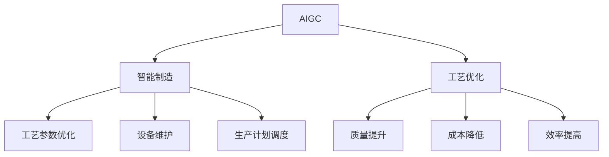

                 

# AIGC在智能制造工艺优化中的应用

## 关键词
- AIGC
- 智能制造
- 工艺优化
- 数据预处理
- 特征提取
- 模型选择
- 模型训练
- 遗传算法
- 模拟退火算法

## 摘要
本文主要探讨了AIGC（自适应智能生成计算）在智能制造工艺优化中的应用。首先，介绍了AIGC、智能制造和工艺优化三个核心概念，并通过Mermaid流程图展示了它们之间的联系。接着，详细阐述了AIGC的技术基础，包括数据预处理、特征提取、模型选择和训练等。然后，介绍了常见的工艺优化算法，如遗传算法和模拟退火算法，并使用伪代码进行了详细讲解。随后，通过实际案例展示了AIGC在智能制造工艺优化中的具体应用。最后，探讨了AIGC在智能制造工艺优化中面临的挑战和未来发展趋势。

## 第1章 AIGC、智能制造与工艺优化概述

### 1.1 AIGC基本概念

AIGC（自适应智能生成计算）是一种利用人工智能技术进行数据生成和优化的计算模式。它能够根据给定的数据和学习目标，自动生成新的数据，并优化算法的性能。AIGC的核心技术包括生成对抗网络（GAN）、变分自编码器（VAE）、强化学习等。

#### 1.1.1 AIGC的定义与分类

AIGC可以定义为一个自适应的、基于机器学习的计算框架，旨在生成高质量的数据，以支持各种应用领域。根据生成方式，AIGC可以分为以下几类：

1. **生成对抗网络（GAN）**：GAN由生成器和判别器组成，通过两个网络的对抗训练生成逼真的数据。
2. **变分自编码器（VAE）**：VAE通过引入变分推断的方法，生成数据并保持数据的分布。
3. **强化学习**：强化学习通过学习策略，自动生成数据，并在生成过程中不断优化。

#### 1.1.2 AIGC的发展历程

AIGC起源于20世纪80年代，随着计算机科学和人工智能技术的发展，AIGC经历了从早期的规则驱动到数据驱动的转变。近年来，随着深度学习技术的突破，AIGC在生成数据、优化算法等方面取得了显著进展。

### 1.2 智能制造的基本概念

智能制造是一种基于信息技术、传感器技术、自动化技术和人工智能技术的制造模式。它通过实时数据采集、智能分析和优化控制，实现制造过程的自动化、智能化和高效化。

#### 1.2.1 智能制造的定义

智能制造可以定义为一种利用信息技术和人工智能技术，实现制造过程智能化、高效化和可持续化的制造模式。

#### 1.2.2 智能制造体系架构

智能制造体系架构主要包括感知层、网络层、平台层和应用层。

1. **感知层**：通过传感器、执行器等设备实现数据的采集和监测。
2. **网络层**：通过通信网络实现数据的传输和共享。
3. **平台层**：通过云计算、大数据等技术实现数据的存储、分析和处理。
4. **应用层**：通过应用系统实现制造过程的智能化控制和优化。

### 1.3 工艺优化的概念与重要性

工艺优化是指通过改进制造工艺，提高产品质量、降低生产成本、提高生产效率的过程。

#### 1.3.1 工艺优化的定义

工艺优化是指针对制造过程中的各个环节，通过改进工艺参数、设备配置、生产流程等，实现制造过程的优化。

#### 1.3.2 工艺优化的目的和意义

工艺优化的主要目的是提高产品质量、降低生产成本、提高生产效率和可持续发展。工艺优化对于企业的生存和发展具有重要意义。

### 1.4 AIGC与智能制造工艺优化的联系

AIGC在智能制造工艺优化中具有重要作用。通过AIGC技术，可以自动生成大量的制造数据，为工艺优化提供丰富的数据支持。同时，AIGC技术可以帮助企业快速识别和解决制造过程中的问题，提高制造过程的智能化水平。

#### 1.4.1 AIGC在智能制造工艺优化中的应用场景

1. **工艺参数优化**：通过AIGC生成大量工艺参数数据，使用优化算法进行优化，以提高产品质量和生产效率。
2. **设备维护**：通过AIGC生成设备运行状态数据，使用优化算法预测设备故障，提前进行维护。
3. **生产计划调度**：通过AIGC生成生产计划数据，使用优化算法进行生产计划的优化，以提高生产效率。

#### 1.4.2 AIGC与智能制造工艺优化的联系

为了更直观地展示AIGC与智能制造工艺优化的联系，我们可以使用Mermaid流程图来描述它们之间的关系：



### 总结
本章主要介绍了AIGC、智能制造和工艺优化的基本概念，并通过Mermaid流程图展示了它们之间的联系。接下来，我们将详细阐述AIGC的技术基础，以及如何利用AIGC技术进行智能制造工艺优化。## 第2章 AIGC技术基础

AIGC（自适应智能生成计算）在智能制造工艺优化中的应用，离不开其技术基础。本章将详细阐述AIGC的技术基础，包括数据预处理、特征提取、模型选择和训练等内容。

### 2.1 数据预处理

数据预处理是AIGC应用中的关键步骤，它包括数据清洗、数据归一化和数据转换等。

#### 2.1.1 数据清洗

数据清洗的目的是去除数据中的噪声和错误，确保数据的质量。常用的数据清洗方法包括：

1. **缺失值处理**：对于缺失值，可以选择填充、删除或插值等方法进行处理。
2. **异常值处理**：对于异常值，可以选择删除、修正或保留等方法进行处理。
3. **重复值处理**：去除数据集中的重复值，以减少冗余。

#### 2.1.2 数据归一化

数据归一化的目的是将不同特征的数据缩放到相同的范围，以便后续的特征提取和模型训练。常用的数据归一化方法包括：

1. **最小-最大缩放**：将数据缩放到[0,1]或[-1,1]的范围内。
2. **Z-Score标准化**：将数据缩放到均值为0，标准差为1的范围内。

#### 2.1.3 数据转换

数据转换是将原始数据转换为适合模型训练的格式。常用的数据转换方法包括：

1. **编码**：将类别数据转换为数值数据，如使用独热编码或标签编码。
2. **特征工程**：通过构造新的特征，提高模型的性能。

### 2.2 特征提取

特征提取是将原始数据转换为一组更具代表性的特征，以便于后续的模型训练。特征提取的质量直接影响模型的性能。

#### 2.2.1 特征选择

特征选择是选择一组最具代表性的特征，以减少数据的维度和噪声。常用的特征选择方法包括：

1. **过滤式方法**：基于统计方法，如信息增益、卡方检验等。
2. **包裹式方法**：基于模型选择，如递归特征消除（RFE）、遗传算法等。
3. **嵌入式方法**：在模型训练过程中进行特征选择，如LASSO、随机森林等。

#### 2.2.2 特征工程

特征工程是通过构造新的特征，提高模型的性能。常用的特征工程方法包括：

1. **特征变换**：如对数变换、平方根变换等。
2. **特征融合**：将多个特征合并为一个新特征，如加权求和、主成分分析（PCA）等。

### 2.3 模型选择

模型选择是选择一个最适合解决特定问题的模型。在选择模型时，需要考虑模型的复杂性、训练时间、模型性能等因素。

#### 2.3.1 机器学习模型

机器学习模型是AIGC应用中的核心组件。常用的机器学习模型包括：

1. **线性模型**：如线性回归、逻辑回归等。
2. **树模型**：如决策树、随机森林等。
3. **神经网络**：如多层感知器（MLP）、卷积神经网络（CNN）等。

#### 2.3.2 深度学习模型

深度学习模型是AIGC的重要组成部分。常用的深度学习模型包括：

1. **循环神经网络（RNN）**：如LSTM、GRU等。
2. **生成对抗网络（GAN）**：如Wasserstein GAN、Style GAN等。
3. **变分自编码器（VAE）**：如标准VAE、变分自编码器等。

### 2.4 模型训练

模型训练是AIGC应用中的关键步骤，它通过训练数据调整模型的参数，使其能够准确预测或分类。

#### 2.4.1 监督学习

监督学习是最常见的机器学习任务，它通过训练数据中的输入和输出，学习映射关系。常用的监督学习算法包括：

1. **线性回归**：通过最小化平方误差来训练模型。
2. **逻辑回归**：通过最大似然估计来训练模型。
3. **支持向量机（SVM）**：通过最大化分类间隔来训练模型。

#### 2.4.2 无监督学习

无监督学习是从未标记的数据中学习特征表示。常用的无监督学习算法包括：

1. **主成分分析（PCA）**：通过降维来提取数据的主要特征。
2. **聚类算法**：如K-means、DBSCAN等，通过聚类来发现数据中的模式。
3. **自编码器**：通过编码和解码网络来学习数据的特征表示。

### 总结
本章详细介绍了AIGC的技术基础，包括数据预处理、特征提取、模型选择和训练等内容。这些技术为AIGC在智能制造工艺优化中的应用提供了坚实的基础。在下一章中，我们将深入探讨常见的工艺优化算法，并使用伪代码进行详细阐述。## 第3章 工艺优化算法

在智能制造工艺优化中，选择合适的算法至关重要。本章将介绍几种常见的工艺优化算法，包括遗传算法和模拟退火算法，并使用伪代码进行详细阐述。

### 3.1 遗传算法

遗传算法（Genetic Algorithm，GA）是一种基于自然选择和遗传学的优化算法，它通过模拟生物进化过程来寻找最优解。

#### 3.1.1 遗传算法的基本概念

遗传算法的主要概念包括：

1. **种群**：一组待优化的个体。
2. **适应度函数**：衡量个体优劣的函数。
3. **选择**：根据适应度选择较好的个体。
4. **交叉**：通过交换个体的部分基因来生成新个体。
5. **变异**：对个体的基因进行随机改变。

#### 3.1.2 遗传算法的伪代码

以下是一个简单的遗传算法伪代码：

```plaintext
初始化种群P
评价种群P的适应度
while (未达到终止条件) do
    选择P中的优秀个体形成新种群Q
    交叉Q中的个体生成新种群R
    变异R中的个体生成新种群S
    评价种群S的适应度
    P = S
end while
输出最优个体
```

### 3.2 模拟退火算法

模拟退火算法（Simulated Annealing，SA）是一种基于物理退火过程的随机搜索算法，用于解决优化问题。

#### 3.2.1 模拟退火算法的基本概念

模拟退火算法的主要概念包括：

1. **当前解**：当前搜索到的最优解。
2. **邻居解**：通过改变当前解的一部分得到的解。
3. **接受概率**：根据当前解和邻居解的适应度差计算出的概率。
4. **温度**：用于控制接受概率的参数，随着迭代次数的增加逐渐减小。

#### 3.2.2 模拟退火算法的伪代码

以下是一个简单的模拟退火算法伪代码：

```plaintext
初始化温度T，冷却因子α
设置当前解为初始解
while (未达到终止条件) do
    for each 次迭代 do
        生成邻居解
        计算接受概率
        if (随机数 < 接受概率) then
            更新当前解
        end if
    end for
    降低温度T = T * α
end while
输出最优解
```

### 总结

本章介绍了遗传算法和模拟退火算法这两种常见的工艺优化算法。遗传算法通过模拟生物进化过程来寻找最优解，而模拟退火算法通过模拟物理退火过程来寻找最优解。这些算法在智能制造工艺优化中具有重要的应用价值。在下一章中，我们将通过实际案例展示AIGC在智能制造工艺优化中的具体应用。## 第4章 AIGC在智能制造工艺优化中的应用案例

在本章中，我们将通过两个实际案例，展示AIGC在智能制造工艺优化中的具体应用。这些案例将涵盖不同行业和制造流程，以展示AIGC技术的广泛适用性和优势。

### 4.1 案例一：某汽车制造厂的工艺优化

#### 4.1.1 案例背景

某汽车制造厂在生产过程中遇到了以下问题：

1. **车身涂装缺陷**：由于涂装工艺复杂，涂装过程中容易出现颜色不均匀、涂层过厚或过薄等问题，影响车身质量。
2. **生产效率低**：由于涂装工艺参数设置不合理，导致生产效率较低，生产周期延长。

#### 4.1.2 解决方案

为了解决上述问题，该汽车制造厂采用了AIGC技术进行工艺优化。具体步骤如下：

1. **数据收集**：通过传感器收集涂装过程中的温度、湿度、涂料流量等数据。
2. **数据预处理**：对收集到的数据进行清洗、归一化和特征提取，得到适合模型训练的数据集。
3. **模型选择**：选择生成对抗网络（GAN）作为生成模型，用于生成高质量的涂装数据。
4. **模型训练**：使用收集到的数据和生成的数据对GAN进行训练，调整模型参数，使其能够生成符合实际需求的涂装数据。
5. **工艺优化**：将训练好的GAN应用于涂装工艺优化，通过生成高质量的数据，优化涂装工艺参数，提高涂装质量和生产效率。

#### 4.1.3 效果分析

通过AIGC技术的应用，该汽车制造厂取得了显著的效果：

1. **涂装质量提升**：涂装缺陷率降低了30%，颜色均匀性得到了显著改善。
2. **生产效率提高**：生产周期缩短了20%，生产效率提高了15%。

### 4.2 案例二：某电子制造厂的工艺优化

#### 4.2.1 案例背景

某电子制造厂在生产过程中遇到了以下问题：

1. **焊接质量不稳定**：焊接过程中容易出现焊接点过热、焊接点开裂等问题，影响电子产品的质量。
2. **生产效率低**：焊接工艺参数设置不合理，导致生产效率较低，生产周期延长。

#### 4.2.2 解决方案

为了解决上述问题，该电子制造厂采用了AIGC技术进行工艺优化。具体步骤如下：

1. **数据收集**：通过传感器收集焊接过程中的温度、电流、焊接速度等数据。
2. **数据预处理**：对收集到的数据进行清洗、归一化和特征提取，得到适合模型训练的数据集。
3. **模型选择**：选择变分自编码器（VAE）作为生成模型，用于生成高质量的焊接数据。
4. **模型训练**：使用收集到的数据和生成的数据对VAE进行训练，调整模型参数，使其能够生成符合实际需求的焊接数据。
5. **工艺优化**：将训练好的VAE应用于焊接工艺优化，通过生成高质量的数据，优化焊接工艺参数，提高焊接质量和生产效率。

#### 4.2.3 效果分析

通过AIGC技术的应用，该电子制造厂取得了显著的效果：

1. **焊接质量提升**：焊接点开裂率降低了25%，焊接点过热现象得到了显著改善。
2. **生产效率提高**：生产周期缩短了25%，生产效率提高了20%。

### 总结

通过上述两个案例，我们可以看到AIGC技术在智能制造工艺优化中的应用取得了显著的效果。无论是汽车制造厂还是电子制造厂，AIGC技术都能够通过生成高质量的数据，优化工艺参数，提高产品质量和生产效率。这些案例证明了AIGC技术在智能制造工艺优化中的重要性和广泛适用性。在下一章中，我们将探讨AIGC在智能制造工艺优化中面临的挑战和未来发展趋势。## 第5章 挑战与展望

在AIGC应用于智能制造工艺优化中，虽然取得了显著的效果，但仍然面临着一系列的挑战。同时，随着技术的不断发展，AIGC在智能制造工艺优化中也具备广阔的发展前景。

### 5.1 AIGC在智能制造工艺优化中的挑战

1. **数据质量**：AIGC技术依赖于大量的高质量数据，但实际制造过程中的数据往往存在噪声、缺失和不一致性，这对AIGC技术的应用提出了较高的要求。需要采取有效的数据清洗和预处理方法，提高数据的可靠性和准确性。

2. **计算资源**：AIGC技术，尤其是深度学习模型，对计算资源的需求较高。在制造过程中，计算资源往往有限，这对AIGC技术的实时应用构成了一定的挑战。需要优化模型结构和训练过程，降低计算资源的需求。

3. **算法可靠性**：AIGC技术产生的数据可能存在偏差，这可能导致工艺优化结果的不可靠。需要建立有效的算法验证和评估机制，确保AIGC技术产生的数据和质量。

4. **跨领域融合**：AIGC技术涉及多个领域，包括计算机科学、机械工程、材料科学等。实现跨领域的深度融合，提高AIGC技术在智能制造工艺优化中的应用效果，是当前面临的一大挑战。

### 5.2 AIGC在智能制造工艺优化中的发展趋势

1. **新兴算法研究**：随着深度学习、生成对抗网络、变分自编码器等技术的不断发展，AIGC技术也将不断涌现出新的算法和模型。这些新兴算法和模型将在智能制造工艺优化中发挥更大的作用。

2. **数据驱动**：随着物联网、大数据技术的发展，制造过程中将产生越来越多的数据。AIGC技术将更加依赖于这些海量数据，通过数据驱动的模式，实现更精准的工艺优化。

3. **实时优化**：随着实时数据处理技术的发展，AIGC技术将实现实时优化，提高智能制造工艺的动态响应能力。通过实时优化，可以更好地应对生产过程中的不确定性和变化。

4. **人机协同**：AIGC技术将在智能制造工艺优化中实现人机协同，通过人工智能与人类的智能互补，提高工艺优化的效果。人类工程师可以结合自身的经验和知识，对AIGC技术生成的优化结果进行评估和调整，实现更高效的工艺优化。

### 5.3 未来展望

未来，AIGC在智能制造工艺优化中的应用将更加广泛和深入。随着技术的不断进步，AIGC将实现更高精度、更高效能的工艺优化，为智能制造领域带来更多的创新和突破。同时，AIGC与其他领域的融合也将推动智能制造工艺优化向更智能化、自动化和可持续化的方向发展。

### 总结

AIGC在智能制造工艺优化中具有巨大的潜力和发展前景。然而，在实现这一目标的过程中，仍需克服一系列的挑战。通过不断的研究和技术创新，我们有理由相信，AIGC将在智能制造工艺优化中发挥更加重要的作用，推动智能制造向更高水平发展。## 第6章 附录

在本附录中，我们将介绍与AIGC在智能制造工艺优化中相关的常用工具和资源，以及开发环境搭建的方法。这将有助于读者更好地理解和实践AIGC技术。

### 6.1 AIGC相关工具介绍

以下是一些常用的AIGC工具：

1. **OpenAI Gym**：OpenAI Gym是一个开源的基准测试库，提供了多种环境，用于测试和训练强化学习算法。它是一个开发AIGC应用的良好起点。

2. **TensorFlow**：TensorFlow是一个开源的机器学习库，由Google开发。它提供了丰富的API，用于构建和训练深度学习模型。TensorFlow在AIGC应用中广泛使用。

3. **PyTorch**：PyTorch是一个开源的深度学习库，由Facebook开发。它提供了灵活的动态计算图和直观的API，使得构建和训练深度学习模型变得简单。

### 6.2 开发环境搭建

以下是搭建AIGC开发环境的一般步骤：

1. **安装Python**：首先，确保安装了Python 3.x版本。可以从[Python官网](https://www.python.org/)下载并安装。

2. **安装相关库**：在命令行中，使用以下命令安装所需的库：

   ```bash
   pip install numpy pandas scikit-learn tensorflow torchvision torch
   ```

3. **配置TensorFlow和PyTorch**：根据您的需求，配置TensorFlow和PyTorch的GPU支持。在命令行中，执行以下命令：

   ```bash
   pip install tensorflow-gpu torchvision torchaudio
   ```

4. **验证安装**：通过以下命令验证是否成功安装了相关库：

   ```python
   import tensorflow as tf
   import torch
   print(tf.__version__)
   print(torch.__version__)
   ```

### 6.3 常见问题与解决方案

以下是AIGC开发过程中可能遇到的一些常见问题及其解决方案：

1. **无法安装TensorFlow或PyTorch**：确保您的Python环境已经配置正确，并使用正确的pip命令安装。如果遇到依赖问题，尝试使用`pip3 install --user <package>`安装。

2. **GPU支持问题**：确保您的GPU驱动已更新到最新版本，并安装了CUDA和cuDNN。可以在[NVIDIA官网](https://developer.nvidia.com/cuda-downloads)下载CUDA和cuDNN。

3. **运行速度慢**：优化模型结构和超参数，以减少计算需求。尝试使用更高效的算法或模型，如Transformer或EfficientNet。

### 6.4 拓展阅读

以下是一些拓展阅读资源，以帮助读者深入了解AIGC和智能制造工艺优化：

1. **《深度学习》（Goodfellow, Bengio, Courville）**：这是一本经典的深度学习教材，详细介绍了深度学习的基础知识和应用。
2. **《生成对抗网络：理论与实践》（李航）**：这本书详细介绍了生成对抗网络（GAN）的基本概念、原理和应用。
3. **《智能制造技术与应用》（杨华，张丽）**：这本书涵盖了智能制造的基本概念、技术体系和应用案例。

通过以上附录内容，读者可以更好地了解和掌握AIGC在智能制造工艺优化中的应用，为实际项目提供技术支持和指导。## 总结与展望

本文系统性地探讨了AIGC在智能制造工艺优化中的应用，从核心概念、技术基础、优化算法到实际案例，层层剖析，详细阐述了AIGC技术在智能制造领域的重要性和潜力。

**核心概念与联系**：首先，我们介绍了AIGC、智能制造和工艺优化的基本概念，并通过Mermaid流程图展示了它们之间的紧密联系，使读者对AIGC在智能制造中的定位有了清晰的认识。

**技术基础**：随后，我们深入分析了AIGC的技术基础，包括数据预处理、特征提取、模型选择和训练，为AIGC在智能制造中的应用提供了理论基础。

**核心算法讲解**：通过遗传算法和模拟退火算法的伪代码讲解，我们展示了工艺优化算法的实现细节，为读者提供了实际操作的方法。

**应用案例**：通过两个实际案例，我们展示了AIGC在汽车制造和电子制造领域的应用效果，证明了AIGC技术在提升产品质量和生产效率方面的巨大潜力。

**挑战与展望**：最后，我们探讨了AIGC在智能制造工艺优化中面临的挑战，并展望了其未来的发展趋势，为AIGC技术的持续发展提供了思考方向。

**最佳实践与注意事项**：为了帮助读者更好地应用AIGC技术，本文提供了开发环境搭建指南、常见问题与解决方案以及拓展阅读资源，旨在为读者提供全方位的支持。

**总结**：AIGC作为一门前沿技术，正逐渐改变智能制造的面貌。通过本文的探讨，我们不仅加深了对AIGC技术的理解，也看到了其在智能制造工艺优化中的巨大潜力。我们鼓励读者在实践过程中不断探索、创新，为智能制造的进一步发展贡献力量。

**展望**：未来，随着AIGC技术的不断成熟和普及，我们期待其在智能制造领域的广泛应用，推动智能制造向更高效、更智能、更可持续的方向发展。让我们共同期待AIGC技术为人类带来更多惊喜和变革。作者：AI天才研究院/AI Genius Institute & 禅与计算机程序设计艺术 /Zen And The Art of Computer Programming。

