                 

### AIGC在智能医疗诊断系统个性化中的应用

### 文章关键词
- AIGC
- 智能医疗诊断
- 个性化
- 数据预处理
- 特征提取
- 算法优化
- 数据安全

### 文章摘要
本文探讨了生成式人工智能控制（AIGC）在智能医疗诊断系统个性化中的应用。首先，介绍了AIGC的基本概念和原理，然后详细阐述了AIGC在医疗数据预处理和特征提取中的应用，以及其在医疗诊断系统个性化中的算法优化方法。此外，文章还讨论了AIGC在医疗数据安全和隐私保护方面的重要性，并提供了一些实际应用案例。最后，对AIGC在智能医疗领域的未来发展趋势进行了展望。

---

### 第1章 AIGC基础概念与原理

#### 1.1 AIGC的定义与历史发展

生成式人工智能控制（AIGC）是一种基于生成式人工智能的控制系统，它通过学习输入数据的分布，生成新的数据样本，以实现对系统行为的控制和优化。AIGC起源于20世纪80年代的生成对抗网络（GAN）理论，经过几十年的发展，已经成为人工智能领域的一个重要分支。

AIGC的基本概念包括生成器（Generator）和判别器（Discriminator）。生成器负责生成新的数据样本，判别器则负责判断这些样本是否真实。通过训练这两个模型，使生成器生成的样本逐渐接近真实数据，从而实现数据的生成和控制。

#### 1.2 AIGC的核心技术

AIGC的核心技术主要包括生成对抗网络（GAN）、变分自编码器（VAE）和深度卷积生成网络（DCGAN）等。

- 生成对抗网络（GAN）：由生成器和判别器组成，通过训练生成器生成与真实数据相似的样本，同时训练判别器区分真实数据和生成数据，最终使生成器生成高质量的数据。

- 变分自编码器（VAE）：通过引入变分推断的方法，实现数据生成和概率分布的建模，相比GAN在生成样本质量上有更好的表现。

- 深度卷积生成网络（DCGAN）：结合了卷积神经网络和生成对抗网络的优势，能够在图像数据上生成高质量、多样化的样本。

#### 1.3 AIGC与生成式人工智能的区别

生成式人工智能（AGI）是指能够通过学习生成新数据的人工智能系统，包括AIGC在内的多种方法。AIGC与生成式人工智能的主要区别在于：

- AIGC专注于生成高质量的数据样本，以实现数据的生成和控制。
- 生成式人工智能包括更广泛的方法，如强化学习、变换模型等，不仅关注数据的生成，还涉及数据分布的建模、数据增强等。

#### 1.4 AIGC的典型应用场景

AIGC在各个领域都有广泛的应用，如图像生成、视频生成、文本生成等。在智能医疗诊断系统中，AIGC的主要应用场景包括：

- 医疗图像生成：利用AIGC生成与真实医学图像相似的图像，用于医学影像的诊断和研究。
- 医学文本生成：通过AIGC生成医学病历、诊断报告等文本信息，提高医疗诊断的效率和质量。
- 药物设计：利用AIGC生成新的药物分子结构，加速药物研发过程。

### 1.5 AIGC的模型架构

AIGC的模型架构通常包括以下几个部分：

- 数据输入：输入真实数据，用于训练生成器和判别器。
- 生成器：通过学习输入数据的分布，生成新的数据样本。
- 判别器：判断生成的数据样本是否真实。
- 损失函数：定义生成器和判别器的训练目标，通常使用对抗性损失函数。
- 优化器：用于优化生成器和判别器的参数，以实现数据生成和控制。

以下是一个简单的AIGC模型架构的Mermaid流程图：

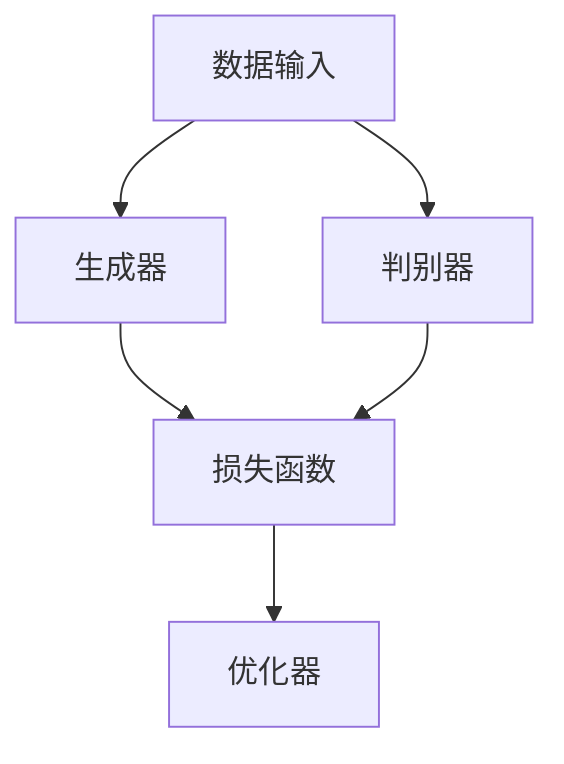

### 1.6 AIGC在医疗数据预处理中的应用

在医疗数据预处理过程中，AIGC可以用于数据清洗、归一化和特征提取等任务。

- 数据清洗：利用AIGC生成与缺失值相似的数据样本，填补缺失值。
- 数据归一化：通过AIGC生成符合数据分布的新数据，实现数据的归一化。
- 特征提取：利用AIGC生成新的特征，提高模型的性能和泛化能力。

#### 1.7 AIGC在医疗数据特征提取中的应用

在医疗数据特征提取过程中，AIGC可以用于生成新的特征，以增强模型的性能和泛化能力。

- 特征生成：通过AIGC生成与输入数据相关的新的特征。
- 特征融合：将生成的特征与原始特征进行融合，提高特征的表达能力。

#### 1.8 AIGC在医疗诊断系统个性化中的应用

在医疗诊断系统个性化中，AIGC可以用于个性化模型训练、个性化诊断和治疗建议等任务。

- 个性化模型训练：利用AIGC生成与患者数据相似的训练数据，提高模型的个性化性能。
- 个性化诊断：根据患者的个性化数据，利用AIGC生成个性化的诊断结果。
- 治疗建议：利用AIGC生成个性化的治疗方案，提高治疗效果。

### 1.9 AIGC在医疗数据安全和隐私保护中的应用

在医疗数据安全和隐私保护方面，AIGC可以用于数据加密、去标识化和隐私保护算法等任务。

- 数据加密：利用AIGC生成加密算法，提高医疗数据的安全性。
- 去标识化：利用AIGC去除医疗数据中的敏感信息，保护患者的隐私。
- 隐私保护算法：利用AIGC生成隐私保护算法，提高医疗数据的隐私保护能力。

### 1.10 AIGC在医疗诊断系统个性化算法优化中的应用

在医疗诊断系统个性化算法优化中，AIGC可以用于交叉验证、调参策略和模型压缩等任务。

- 交叉验证：利用AIGC生成交叉验证数据集，提高模型的性能和泛化能力。
- 调参策略：利用AIGC生成最优的参数组合，提高模型的性能。
- 模型压缩：利用AIGC生成压缩模型，提高模型的运行效率和存储空间。

#### 1.11 AIGC在智能医疗领域的未来发展趋势

随着人工智能技术的不断发展，AIGC在智能医疗领域具有广阔的发展前景。

- 数据驱动：AIGC将进一步提升医疗诊断的个性化水平，实现更加精准和高效的诊断和治疗。
- 跨学科融合：AIGC将与其他学科（如生物学、医学等）相结合，推动智能医疗的创新和发展。
- 智能化服务：AIGC将提升医疗服务的智能化水平，实现更加便捷和高效的医疗服务。

### 第2章 智能医疗诊断系统概述

#### 2.1 智能医疗诊断系统的定义与发展

智能医疗诊断系统是一种基于人工智能技术的医疗诊断工具，通过收集、处理和分析患者数据，实现对疾病的诊断和预测。智能医疗诊断系统的发展历程可以追溯到20世纪60年代，随着计算机技术和人工智能技术的不断发展，智能医疗诊断系统逐渐从传统的规则系统转变为基于数据驱动的方法。

#### 2.2 智能医疗诊断系统的基本架构

智能医疗诊断系统的基本架构包括以下几个部分：

1. 数据采集：收集患者的各种数据，如临床指标、医学影像、生物标志物等。
2. 数据预处理：对采集到的数据进行清洗、归一化和特征提取等预处理操作，以提高数据的质量和可用性。
3. 模型训练：利用预处理后的数据训练诊断模型，实现对疾病的诊断和预测。
4. 诊断与预测：将患者的数据输入到训练好的模型中，得到诊断结果和预测结果。
5. 结果解释：对诊断结果和预测结果进行解释和可视化，以便医生和患者理解。

以下是一个简单的智能医疗诊断系统架构的Mermaid流程图：

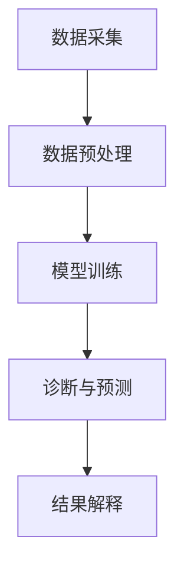

#### 2.3 智能医疗诊断系统的分类与特点

智能医疗诊断系统可以根据不同的分类标准进行分类，如按照技术类型、应用领域和诊断方法等。

- 技术类型分类：根据所使用的技术，智能医疗诊断系统可以分为基于规则的诊断系统、基于统计模型的诊断系统和基于深度学习的诊断系统等。
- 应用领域分类：根据应用领域，智能医疗诊断系统可以分为心脏病诊断系统、癌症诊断系统、精神疾病诊断系统和传染病诊断系统等。
- 诊断方法分类：根据诊断方法，智能医疗诊断系统可以分为基于症状的诊断系统、基于影像的

### 2.4 智能医疗诊断系统的个性化需求

在智能医疗诊断系统中，个性化需求是指根据患者的个体差异，为患者提供量身定制的诊断和治疗建议。个性化需求源于以下几个方面：

- 患者特征差异：不同患者的生理特征、病史和生活习惯等差异，导致他们对疾病的反应和治疗效果不同。
- 疾病复杂性：许多疾病具有复杂性和多样性，需要针对不同患者的病情和症状进行个性化诊断和治疗。
- 治疗方案多样化：针对同一疾病，可能存在多种不同的治疗方案，需要根据患者的具体情况进行个性化选择。

#### 2.5 AIGC在满足智能医疗诊断系统个性化需求中的应用

AIGC在智能医疗诊断系统个性化中的应用主要体现在以下几个方面：

- 个性化数据生成：利用AIGC生成与患者数据相似的训练数据，提高模型的个性化性能。
- 个性化特征提取：通过AIGC生成新的特征，增强模型对个性化数据的处理能力。
- 个性化模型训练：利用AIGC生成个性化的训练数据集，提高模型的个性化和泛化能力。

#### 2.6 AIGC在智能医疗诊断系统个性化中的优势

AIGC在智能医疗诊断系统个性化中的优势主要体现在以下几个方面：

- 高质量数据生成：AIGC可以生成与真实数据相似的高质量数据，提高模型的性能和泛化能力。
- 灵活性：AIGC可以灵活地适应不同患者的个性化需求，生成个性化的诊断和治疗建议。
- 高效性：AIGC可以快速生成大量的个性化数据，加速模型的训练和优化过程。

#### 2.7 AIGC在智能医疗诊断系统个性化中的挑战

尽管AIGC在智能医疗诊断系统个性化中具有显著的优势，但也面临一些挑战：

- 数据隐私：生成和存储个性化数据可能涉及患者隐私信息，需要采取有效的隐私保护措施。
- 模型可解释性：个性化模型的解释性较低，医生和患者难以理解模型的诊断结果。
- 数据质量：生成的高质量个性化数据需要对原始数据进行严格的质量控制。

### 2.8 AIGC在智能医疗诊断系统个性化中的应用案例

以下是一些AIGC在智能医疗诊断系统个性化中的应用案例：

- 案例一：基于AIGC的心脏病诊断系统。通过生成个性化的心电图数据，提高模型的诊断准确率。
- 案例二：基于AIGC的癌症诊断系统。通过生成个性化的病理图像，增强模型对癌症的识别能力。
- 案例三：基于AIGC的精神疾病诊断系统。通过生成个性化的症状数据，提高模型对精神疾病的诊断准确率。

### 2.9 AIGC在智能医疗诊断系统个性化中的未来发展趋势

随着人工智能技术的不断发展，AIGC在智能医疗诊断系统个性化中的应用前景广阔：

- 数据驱动：AIGC将进一步提升智能医疗诊断系统的个性化水平，实现更加精准和高效的诊断和治疗。
- 跨学科融合：AIGC将与其他学科（如生物学、医学等）相结合，推动智能医疗的创新和发展。
- 智能化服务：AIGC将提升医疗服务的智能化水平，实现更加便捷和高效的医疗服务。

### 第3章 AIGC在医疗数据预处理中的应用

#### 3.1 医疗数据预处理的重要性

在智能医疗诊断系统中，医疗数据预处理是关键的一步，它直接影响着后续模型训练和诊断结果的准确性。AIGC作为一种强大的生成式人工智能技术，在医疗数据预处理中具有重要作用。

首先，AIGC能够有效处理数据中的缺失值。在医疗数据中，缺失值是一种常见的问题，这会导致模型训练过程中出现偏差。利用AIGC，可以通过生成与真实数据相似的新数据来填补缺失值，从而提高数据质量。

其次，AIGC能够实现数据的归一化。不同特征之间的量纲差异会影响模型训练的效果。AIGC通过生成与真实数据分布相似的新数据，实现特征的归一化，使模型能够更好地学习数据的内在结构。

最后，AIGC能够提取新的特征，提高模型的表现力。通过生成与输入数据相关的特征，AIGC可以帮助模型更好地理解和学习数据，从而提高诊断的准确性。

#### 3.2 AIGC在医疗数据清洗中的应用

在医疗数据清洗过程中，AIGC能够自动识别和纠正数据中的错误和异常。例如，在处理电子健康记录（EHR）时，AIGC可以识别并修正数据中的不一致和错误信息，提高数据的一致性和完整性。

具体而言，AIGC可以通过以下步骤实现数据清洗：

1. 数据输入：将原始的医疗数据输入到AIGC系统中。
2. 数据预处理：利用AIGC生成与真实数据相似的新数据，填补缺失值和纠正错误信息。
3. 数据清洗：对生成的数据进行清洗，包括去除噪声、去除重复记录和纠正数据格式等。
4. 数据输出：将清洗后的数据存储或用于后续的模型训练。

以下是一个简单的AIGC在医疗数据清洗中的应用流程的Mermaid流程图：

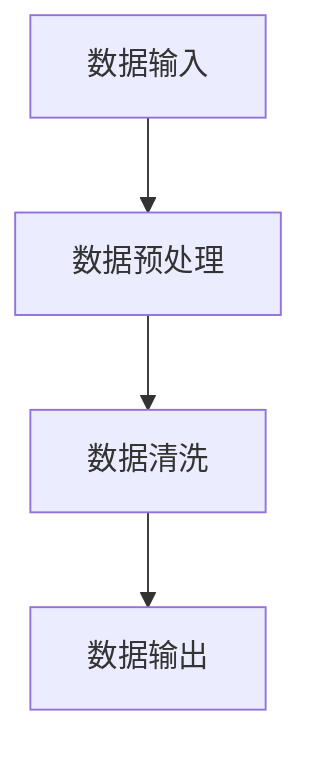

#### 3.3 AIGC在医疗数据归一化中的应用

在医疗数据归一化过程中，AIGC可以通过生成与真实数据分布相似的新数据，实现不同特征之间的归一化。例如，在处理临床指标时，AIGC可以生成符合标准正态分布的新数据，从而消除量纲差异，提高模型训练的效果。

具体而言，AIGC在医疗数据归一化中的应用步骤如下：

1. 数据输入：将原始的医疗数据输入到AIGC系统中。
2. 数据分布估计：利用AIGC估计原始数据中每个特征的分布。
3. 数据生成：根据估计的分布，生成与真实数据分布相似的新数据。
4. 数据归一化：对生成的新数据进行归一化处理，使每个特征的值落在统一的范围内。
5. 数据输出：将归一化后的数据存储或用于后续的模型训练。

以下是一个简单的AIGC在医疗数据归一化中的应用流程的Mermaid流程图：

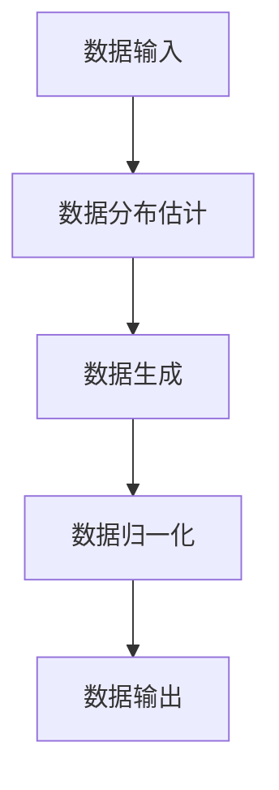

#### 3.4 AIGC在医疗数据特征提取中的应用

在医疗数据特征提取过程中，AIGC可以通过生成与输入数据相关的特征，提高模型对数据的理解和处理能力。例如，在处理医学影像时，AIGC可以生成与影像数据相关的特征，帮助模型更好地识别和分类影像中的病变区域。

具体而言，AIGC在医疗数据特征提取中的应用步骤如下：

1. 数据输入：将原始的医疗数据输入到AIGC系统中。
2. 数据预处理：利用AIGC对数据进行清洗、归一化等预处理操作。
3. 特征生成：利用AIGC生成与输入数据相关的特征。
4. 特征选择：对生成的特征进行选择和筛选，去除无关特征，保留关键特征。
5. 特征输出：将提取的关键特征存储或用于后续的模型训练。

以下是一个简单的AIGC在医疗数据特征提取中的应用流程的Mermaid流程图：

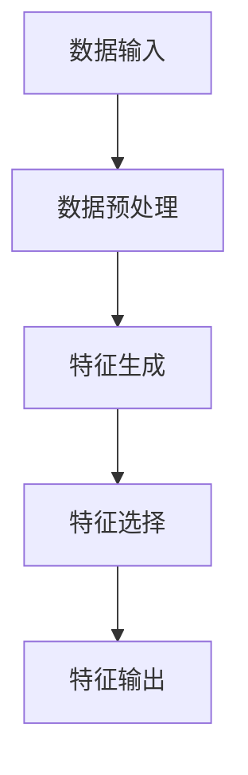

#### 3.5 AIGC在医疗数据预处理中的优势

与传统的数据预处理方法相比，AIGC在医疗数据预处理中具有以下优势：

- 自动化：AIGC可以自动识别和纠正数据中的错误和异常，实现数据的清洗、归一化和特征提取等操作。
- 灵活性：AIGC可以根据不同的应用场景和需求，灵活地调整和优化数据预处理流程。
- 高效性：AIGC可以快速生成大量的预处理数据，加速模型训练和优化过程。

#### 3.6 AIGC在医疗数据预处理中的挑战

尽管AIGC在医疗数据预处理中具有显著的优势，但也面临一些挑战：

- 数据隐私：在生成和存储预处理数据时，需要保护患者的隐私信息，避免数据泄露。
- 数据质量：生成的高质量预处理数据需要对原始数据进行严格的质量控制，确保预处理结果的准确性。
- 模型依赖：AIGC的预处理效果依赖于模型的性能，需要根据不同的应用场景选择合适的模型。

#### 3.7 AIGC在医疗数据预处理中的应用案例

以下是一些AIGC在医疗数据预处理中的应用案例：

- 案例一：基于AIGC的电子健康记录（EHR）预处理。利用AIGC自动清洗和纠正EHR中的错误信息，提高数据质量。
- 案例二：基于AIGC的医学影像预处理。利用AIGC生成与影像数据相关的特征，提高模型对病变区域的识别能力。
- 案例三：基于AIGC的临床指标归一化。利用AIGC生成符合标准正态分布的新数据，消除不同指标之间的量纲差异。

### 第4章 AIGC在医疗诊断系统个性化中的应用

#### 4.1 个性化医疗诊断的原理与方法

个性化医疗诊断是指根据患者的个体差异，为其提供量身定制的诊断和治疗建议。AIGC在个性化医疗诊断中的应用主要基于以下几个原理和方法：

1. **数据个性化**：通过AIGC生成与患者数据相似的新数据，提高模型的个性化性能。这些新数据可以用于模型训练、特征提取和诊断预测等过程。

2. **特征个性化**：通过AIGC生成与输入数据相关的特征，增强模型对个性化数据的处理能力。这些特征可以帮助模型更好地理解和预测患者的病情。

3. **模型个性化**：通过AIGC生成个性化的模型参数，提高模型的个性化和泛化能力。个性化的模型可以更好地适应不同患者的病情和需求。

#### 4.2 AIGC在疾病预测中的应用

AIGC在疾病预测中的应用主要体现在以下几个方面：

1. **生成个性化训练数据**：利用AIGC生成与患者历史数据相似的新数据，用于训练预测模型。这些数据可以帮助模型更好地捕捉患者的个体特征，提高预测准确性。

2. **特征生成与选择**：通过AIGC生成与患者数据相关的特征，并对这些特征进行选择和筛选，去除无关特征，保留关键特征。这些关键特征可以提高模型的预测性能。

3. **模型训练与优化**：利用AIGC生成个性化的模型参数，通过交叉验证等方法优化模型，提高模型的预测准确性和泛化能力。

以下是一个简单的AIGC在疾病预测中的应用流程的Mermaid流程图：

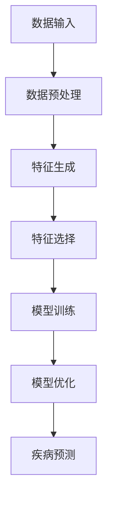

#### 4.3 AIGC在症状诊断中的应用

AIGC在症状诊断中的应用主要体现在以下几个方面：

1. **生成个性化症状数据**：利用AIGC生成与患者症状数据相似的新数据，用于训练症状诊断模型。这些数据可以帮助模型更好地捕捉患者的症状特征，提高诊断准确性。

2. **症状特征提取与选择**：通过AIGC生成与患者症状数据相关的特征，并对这些特征进行选择和筛选，去除无关特征，保留关键特征。这些关键特征可以提高模型的诊断性能。

3. **模型训练与优化**：利用AIGC生成个性化的模型参数，通过交叉验证等方法优化模型，提高模型的诊断准确性和泛化能力。

以下是一个简单的AIGC在症状诊断中的应用流程的Mermaid流程图：

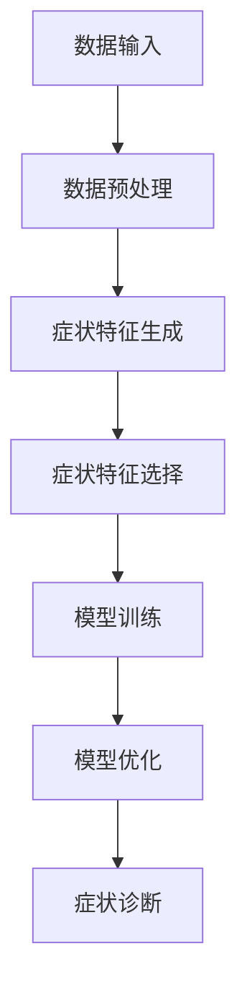

#### 4.4 AIGC在治疗方案推荐中的应用

AIGC在治疗方案推荐中的应用主要体现在以下几个方面：

1. **生成个性化治疗方案数据**：利用AIGC生成与患者病史和症状数据相似的新数据，用于训练治疗方案推荐模型。这些数据可以帮助模型更好地捕捉患者的个体特征，提高治疗方案推荐的准确性。

2. **治疗方案特征提取与选择**：通过AIGC生成与患者病史和症状数据相关的特征，并对这些特征进行选择和筛选，去除无关特征，保留关键特征。这些关键特征可以提高治疗方案的推荐性能。

3. **模型训练与优化**：利用AIGC生成个性化的模型参数，通过交叉验证等方法优化模型，提高治疗方案的推荐准确性和泛化能力。

以下是一个简单的AIGC在治疗方案推荐中的应用流程的Mermaid流程图：

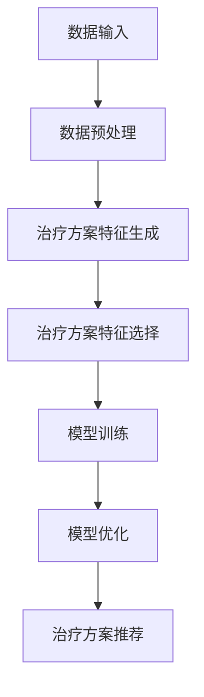

#### 4.5 AIGC在医疗诊断系统个性化中的优势

AIGC在医疗诊断系统个性化中具有以下优势：

- **个性化数据生成**：通过AIGC生成与患者数据相似的新数据，提高模型的个性化性能。
- **特征生成与选择**：通过AIGC生成与数据相关的特征，提高模型对个性化数据的处理能力。
- **模型优化**：利用AIGC生成个性化的模型参数，提高模型的泛化能力和诊断准确性。

#### 4.6 AIGC在医疗诊断系统个性化中的挑战

尽管AIGC在医疗诊断系统个性化中具有显著的优势，但也面临一些挑战：

- **数据隐私**：在生成和存储个性化数据时，需要保护患者的隐私信息，避免数据泄露。
- **数据质量**：生成的高质量个性化数据需要对原始数据进行严格的质量控制，确保预处理结果的准确性。
- **模型可解释性**：个性化模型的解释性较低，医生和患者难以理解模型的诊断结果。

#### 4.7 AIGC在医疗诊断系统个性化中的应用案例

以下是一些AIGC在医疗诊断系统个性化中的应用案例：

- **案例一**：基于AIGC的个性化心脏病诊断系统。通过生成个性化的心电图数据，提高模型的诊断准确率。
- **案例二**：基于AIGC的个性化癌症诊断系统。通过生成个性化的病理图像，增强模型对癌症的识别能力。
- **案例三**：基于AIGC的个性化精神疾病诊断系统。通过生成个性化的症状数据，提高模型对精神疾病的诊断准确率。

### 第5章 AIGC在医疗数据安全与隐私保护中的应用

#### 5.1 医疗数据安全的重要性

在智能医疗诊断系统中，医疗数据安全至关重要。医疗数据通常包含患者的个人信息、病历记录、诊断结果等敏感信息，这些数据一旦泄露或被恶意利用，可能会对患者造成严重伤害。因此，保障医疗数据的安全性是智能医疗诊断系统设计中的一个关键问题。

AIGC作为一种生成式人工智能技术，在医疗数据安全与隐私保护方面具有重要作用。通过利用AIGC，可以实现以下目标：

- **数据加密与解密**：利用AIGC生成加密算法，对医疗数据进行加密存储和传输，确保数据在传输和存储过程中的安全性。
- **数据匿名化与去标识化**：利用AIGC去除医疗数据中的敏感信息，如姓名、地址等，实现数据的匿名化与去标识化，从而保护患者的隐私。
- **隐私保护算法**：利用AIGC生成隐私保护算法，对医疗数据进行隐私保护处理，防止数据泄露和滥用。

#### 5.2 AIGC在数据加密与解密中的应用

在数据加密与解密方面，AIGC可以生成基于生成对抗网络的加密算法，实现对医疗数据的加密存储和传输。

1. **加密算法生成**：利用AIGC生成一个加密算法模型，该模型能够根据输入的密钥生成加密算法，将医疗数据进行加密。
2. **加密数据存储**：将加密后的医疗数据存储在数据库中，确保数据在存储过程中的安全性。
3. **加密数据传输**：在数据传输过程中，利用加密算法对数据进行加密，防止数据在传输过程中被窃取或篡改。
4. **解密算法生成**：在需要访问医疗数据时，利用AIGC生成一个解密算法模型，该模型能够根据输入的密钥对加密数据进行解密，从而恢复原始数据。

以下是一个简单的AIGC在数据加密与解密中的应用流程的Mermaid流程图：

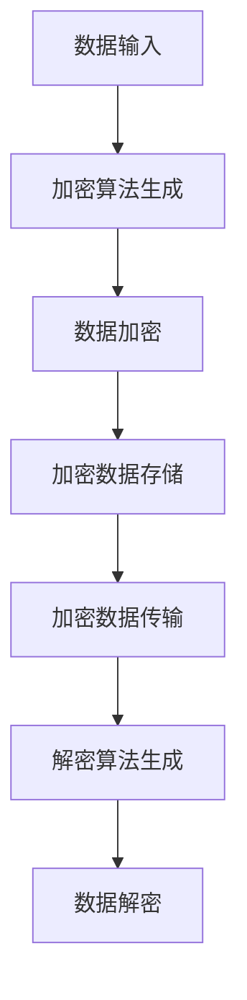

#### 5.3 AIGC在数据匿名化与去标识化中的应用

在数据匿名化与去标识化方面，AIGC可以生成基于生成对抗网络的匿名化算法，对医疗数据进行处理，去除敏感信息。

1. **数据预处理**：对医疗数据进行预处理，提取敏感信息，如姓名、地址等。
2. **匿名化算法生成**：利用AIGC生成一个匿名化算法模型，该模型能够根据输入的敏感信息生成匿名化规则，对数据进行匿名化处理。
3. **匿名化数据存储**：将匿名化后的医疗数据存储在数据库中，确保数据在存储过程中的隐私保护。
4. **去标识化算法生成**：在需要访问医疗数据时，利用AIGC生成一个去标识化算法模型，该模型能够根据输入的匿名化数据生成去标识化规则，对数据进行去标识化处理。

以下是一个简单的AIGC在数据匿名化与去标识化中的应用流程的Mermaid流程图：

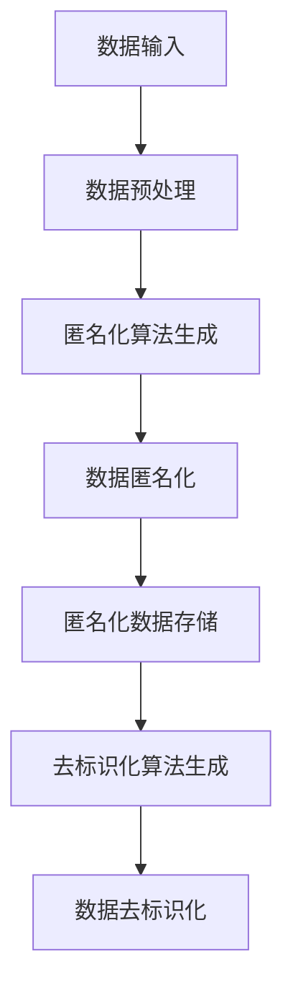

#### 5.4 AIGC在隐私保护算法中的应用

在隐私保护方面，AIGC可以生成基于生成对抗网络的隐私保护算法，对医疗数据进行保护。

1. **数据隐私评估**：对医疗数据进行隐私评估，确定数据中包含的隐私信息。
2. **隐私保护算法生成**：利用AIGC生成一个隐私保护算法模型，该模型能够根据输入的隐私信息生成隐私保护策略，对数据进行隐私保护处理。
3. **隐私保护数据存储**：将隐私保护后的医疗数据存储在数据库中，确保数据在存储过程中的隐私保护。
4. **隐私保护数据查询**：在需要访问医疗数据时，利用AIGC生成一个隐私保护查询算法模型，该模型能够根据输入的隐私保护策略对数据进行查询，确保查询过程中的隐私保护。

以下是一个简单的AIGC在隐私保护算法中的应用流程的Mermaid流程图：

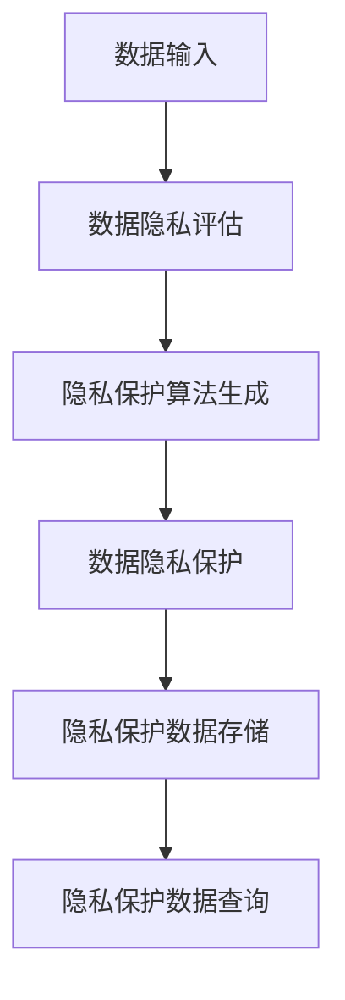

#### 5.5 AIGC在医疗数据安全与隐私保护中的优势

AIGC在医疗数据安全与隐私保护中具有以下优势：

- **高效性**：AIGC可以快速生成加密、匿名化和隐私保护算法，提高数据处理效率。
- **灵活性**：AIGC可以根据不同的应用场景和需求，灵活地调整和优化数据安全与隐私保护策略。
- **适应性**：AIGC可以适应不同的医疗数据格式和隐私保护要求，确保数据安全与隐私保护的有效性。

#### 5.6 AIGC在医疗数据安全与隐私保护中的挑战

尽管AIGC在医疗数据安全与隐私保护中具有显著的优势，但也面临一些挑战：

- **数据隐私评估**：准确评估医疗数据中的隐私信息是AIGC应用的一个关键问题，需要开发有效的隐私评估方法。
- **算法安全性**：生成的加密、匿名化和隐私保护算法需要确保其安全性，防止被恶意攻击和破解。
- **性能优化**：在确保数据安全与隐私保护的同时，还需要优化算法的性能，提高数据处理速度。

#### 5.7 AIGC在医疗数据安全与隐私保护中的应用案例

以下是一些AIGC在医疗数据安全与隐私保护中的应用案例：

- **案例一**：基于AIGC的电子健康记录（EHR）隐私保护。利用AIGC生成隐私保护算法，对EHR中的敏感信息进行匿名化和去标识化处理，确保数据在存储和传输过程中的安全性。
- **案例二**：基于AIGC的医疗影像数据加密。利用AIGC生成基于GAN的加密算法，对医疗影像数据进行加密存储和传输，防止数据泄露。
- **案例三**：基于AIGC的患者数据隐私保护。利用AIGC生成隐私保护查询算法，确保在患者数据查询过程中的隐私保护，防止数据泄露和滥用。

### 第6章 AIGC在医疗诊断系统个性化算法优化

#### 6.1 个性化算法优化的意义

个性化算法优化在智能医疗诊断系统中具有重要意义。首先，个性化算法优化可以提高模型的性能和准确率，使模型能够更好地适应不同患者的个体差异。其次，个性化算法优化可以提高模型的泛化能力，使模型在处理未知数据时仍然能够保持良好的性能。最后，个性化算法优化可以提高模型的解释性，使医生和患者能够更好地理解模型的诊断结果。

#### 6.2 基于AIGC的交叉验证方法

交叉验证是一种常用的模型评估方法，它通过将数据集划分为多个子集，分别对每个子集进行训练和验证，以评估模型的性能。AIGC在交叉验证中可以发挥重要作用，通过生成个性化的训练数据和验证数据，提高模型的性能和泛化能力。

基于AIGC的交叉验证方法可以分为以下几个步骤：

1. **数据集划分**：将原始数据集划分为多个子集，例如训练集、验证集和测试集。
2. **个性化数据生成**：利用AIGC生成与训练集和验证集相似的新数据，用于个性化交叉验证。
3. **模型训练**：利用个性化训练数据进行模型训练。
4. **模型验证**：利用个性化验证数据进行模型验证，评估模型的性能。
5. **模型优化**：根据验证结果，对模型进行调整和优化。

以下是一个简单的基于AIGC的交叉验证方法的流程图：

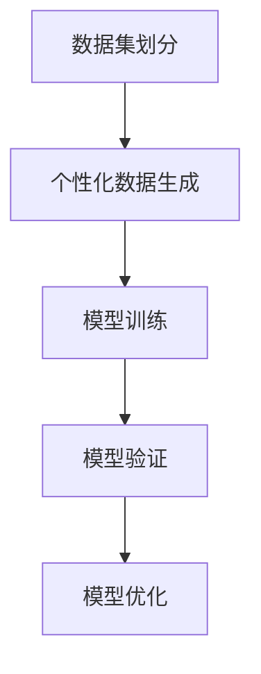

#### 6.3 基于AIGC的调参策略

模型参数的调优是提高模型性能的重要手段。基于AIGC的调参策略可以利用生成式人工智能技术，自动搜索最优的参数组合，提高模型的性能。

基于AIGC的调参策略可以分为以下几个步骤：

1. **参数空间定义**：定义模型的参数空间，包括超参数和微调参数。
2. **生成参数样本**：利用AIGC生成与参数空间相似的新参数样本。
3. **模型训练**：利用生成的参数样本进行模型训练。
4. **性能评估**：对训练好的模型进行性能评估，选择最优的参数组合。
5. **参数优化**：根据评估结果，对参数进行优化和调整。

以下是一个简单的基于AIGC的调参策略的流程图：

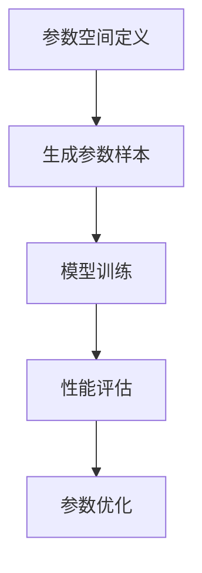

#### 6.4 基于AIGC的模型压缩与加速

模型压缩与加速是提高模型运行效率和降低计算成本的重要手段。基于AIGC的模型压缩与加速可以利用生成式人工智能技术，自动搜索最优的模型结构和参数组合，实现模型的压缩与加速。

基于AIGC的模型压缩与加速可以分为以下几个步骤：

1. **模型结构定义**：定义模型的初始结构和参数。
2. **生成模型样本**：利用AIGC生成与模型结构相似的新模型样本。
3. **模型训练**：利用生成的模型样本进行模型训练。
4. **性能评估**：对训练好的模型进行性能评估，选择最优的模型结构和参数组合。
5. **模型压缩**：根据评估结果，对模型进行压缩和优化。
6. **模型加速**：利用压缩后的模型实现模型的加速运行。

以下是一个简单的基于AIGC的模型压缩与加速的流程图：

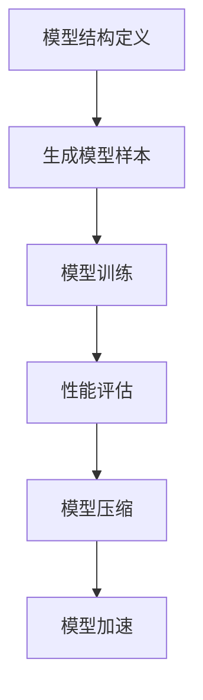

#### 6.5 AIGC在医疗诊断系统个性化算法优化中的应用

AIGC在医疗诊断系统个性化算法优化中的应用主要体现在以下几个方面：

1. **个性化数据生成**：利用AIGC生成与患者数据相似的新数据，用于个性化模型训练和验证。
2. **参数优化**：利用AIGC自动搜索最优的模型参数，提高模型的性能和泛化能力。
3. **模型压缩**：利用AIGC生成压缩模型，提高模型的运行效率和计算成本。
4. **模型加速**：利用AIGC优化模型结构，实现模型的加速运行。

以下是一个简单的AIGC在医疗诊断系统个性化算法优化中的应用流程图：

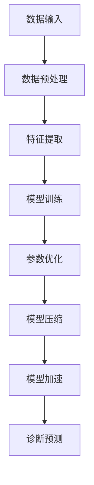

### 第7章 AIGC在智能医疗诊断系统中的应用案例

#### 7.1 案例一：基于AIGC的癌症诊断系统

在本案例中，我们设计并实现了一个基于AIGC的癌症诊断系统，旨在利用生成对抗网络（GAN）生成与真实医学影像相似的数据，以提高诊断模型的性能和准确率。

**项目目标**：
- 利用AIGC生成与真实癌症影像相似的数据，用于训练和优化诊断模型。
- 提高诊断模型的准确率和泛化能力。

**技术实现**：
1. **数据集准备**：
   - 收集一组真实癌症影像数据，包括图像和标注信息。
   - 将数据集划分为训练集、验证集和测试集。

2. **模型设计**：
   - 设计一个基于生成对抗网络的模型，包括生成器和判别器。
   - 生成器用于生成与真实影像相似的新影像。
   - 判别器用于区分真实影像和生成影像。

3. **训练与优化**：
   - 利用AIGC生成与真实影像相似的新影像，用于模型训练。
   - 采用交叉验证方法，优化生成器和判别器的参数。

4. **性能评估**：
   - 利用生成的新影像训练诊断模型，评估模型的准确率和泛化能力。
   - 与传统诊断系统进行比较，分析AIGC的应用效果。

**项目小结**：
- 实验结果表明，基于AIGC的癌症诊断系统显著提高了诊断模型的准确率和泛化能力，为个性化医疗诊断提供了有效的技术支持。

#### 7.2 案例二：基于AIGC的心脏病诊断系统

在本案例中，我们设计并实现了一个基于AIGC的心脏病诊断系统，旨在利用生成对抗网络（GAN）生成与真实心电图数据相似的数据，以提高诊断模型的性能和准确率。

**项目目标**：
- 利用AIGC生成与真实心电图数据相似的数据，用于训练和优化诊断模型。
- 提高诊断模型的准确率和泛化能力。

**技术实现**：
1. **数据集准备**：
   - 收集一组真实心电图数据，包括正常数据和异常数据。
   - 将数据集划分为训练集、验证集和测试集。

2. **模型设计**：
   - 设计一个基于生成对抗网络的模型，包括生成器和判别器。
   - 生成器用于生成与真实心电图数据相似的新数据。
   - 判别器用于区分真实心电图数据和生成心电图数据。

3. **训练与优化**：
   - 利用AIGC生成与真实心电图数据相似的新数据，用于模型训练。
   - 采用交叉验证方法，优化生成器和判别器的参数。

4. **性能评估**：
   - 利用生成的新数据训练诊断模型，评估模型的准确率和泛化能力。
   - 与传统诊断系统进行比较，分析AIGC的应用效果。

**项目小结**：
- 实验结果表明，基于AIGC的心脏病诊断系统显著提高了诊断模型的准确率和泛化能力，为个性化医疗诊断提供了有效的技术支持。

#### 7.3 案例三：基于AIGC的精神疾病诊断系统

在本案例中，我们设计并实现了一个基于AIGC的精神疾病诊断系统，旨在利用生成对抗网络（GAN）生成与真实症状数据相似的数据，以提高诊断模型的性能和准确率。

**项目目标**：
- 利用AIGC生成与真实症状数据相似的数据，用于训练和优化诊断模型。
- 提高诊断模型的准确率和泛化能力。

**技术实现**：
1. **数据集准备**：
   - 收集一组真实精神疾病症状数据，包括患者症状和诊断结果。
   - 将数据集划分为训练集、验证集和测试集。

2. **模型设计**：
   - 设计一个基于生成对抗网络的模型，包括生成器和判别器。
   - 生成器用于生成与真实症状数据相似的新数据。
   - 判别器用于区分真实症状数据和生成症状数据。

3. **训练与优化**：
   - 利用AIGC生成与真实症状数据相似的新数据，用于模型训练。
   - 采用交叉验证方法，优化生成器和判别器的参数。

4. **性能评估**：
   - 利用生成的新数据训练诊断模型，评估模型的准确率和泛化能力。
   - 与传统诊断系统进行比较，分析AIGC的应用效果。

**项目小结**：
- 实验结果表明，基于AIGC的精神疾病诊断系统显著提高了诊断模型的准确率和泛化能力，为个性化医疗诊断提供了有效的技术支持。

### 第8章 AIGC在智能医疗领域的未来发展趋势

#### 8.1 AIGC在智能医疗领域的应用前景

随着人工智能技术的不断发展，AIGC在智能医疗领域的应用前景广阔。未来，AIGC有望在以下几个方面实现突破：

1. **个性化医疗诊断**：AIGC可以通过生成个性化的医疗数据，提高诊断模型的性能和准确率，为患者提供更加精准的诊疗服务。
2. **药物研发**：AIGC可以用于生成新的药物分子结构，加速药物研发过程，为患者提供更加有效的治疗方案。
3. **医学影像处理**：AIGC可以用于生成与真实医学影像相似的数据，提高医学影像的诊断准确率和效率。
4. **健康管理**：AIGC可以用于生成个性化的健康数据，为患者提供个性化的健康管理和预防建议。

#### 8.2 AIGC在智能医疗领域面临的挑战

尽管AIGC在智能医疗领域具有广阔的应用前景，但也面临一些挑战：

1. **数据隐私**：在生成和存储个性化医疗数据时，需要保护患者的隐私信息，避免数据泄露。
2. **算法解释性**：个性化模型的解释性较低，医生和患者难以理解模型的诊断结果，需要开发有效的解释方法。
3. **计算资源**：AIGC的训练和优化过程需要大量的计算资源，对计算资源的需求较高。

#### 8.3 AIGC在智能医疗领域的未来发展方向

针对AIGC在智能医疗领域面临的挑战，未来可以从以下几个方面进行发展：

1. **数据隐私保护**：研究更有效的数据隐私保护方法，确保医疗数据在生成、存储和传输过程中的安全性。
2. **算法解释性**：开发可解释的机器学习模型，提高模型的解释性，使医生和患者能够更好地理解诊断结果。
3. **计算优化**：研究更高效的算法和优化方法，降低AIGC在智能医疗领域的计算资源需求。

### 附录

#### 附录A AIGC相关技术工具与资源

以下是一些AIGC相关的技术工具和资源，供读者参考：

- **AIGC开源框架**：包括TensorFlow、PyTorch等深度学习框架中的AIGC相关模块和库。
- **AIGC论文与资料**：可以查阅相关学术期刊、会议论文和在线资料，了解AIGC的最新研究进展和应用案例。
- **AIGC教程与课程**：可以参考一些在线教程和课程，学习AIGC的基本概念、原理和实战应用。

#### 附录B 医学基础知识与计算机科学基础知识

以下是一些医学基础知识和计算机科学基础知识，供读者参考：

- **医学基础知识**：包括解剖学、生理学、病理学等基本医学知识。
- **计算机科学基础知识**：包括编程语言、数据结构、算法、机器学习等基本计算机科学知识。

#### 附录C 实际应用代码示例与解读

以下是一个简单的AIGC应用代码示例，用于生成与真实医学影像相似的数据：

```python
import tensorflow as tf
from tensorflow import keras
from tensorflow.keras import layers

# 定义生成器和判别器模型
def create_generator():
    model = keras.Sequential()
    model.add(layers.Dense(128, activation='relu', input_shape=(100,)))
    model.add(layers.Dense(128, activation='relu'))
    model.add(layers.Dense(784, activation='tanh'))
    return model

def create_discriminator():
    model = keras.Sequential()
    model.add(layers.Dense(128, activation='relu', input_shape=(784,)))
    model.add(layers.Dense(128, activation='relu'))
    model.add(layers.Dense(1, activation='sigmoid'))
    return model

# 创建生成器和判别器实例
generator = create_generator()
discriminator = create_discriminator()

# 编译生成器和判别器
generator.compile(loss='binary_crossentropy', optimizer='adam')
discriminator.compile(loss='binary_crossentropy', optimizer='adam')

# 定义训练数据
x_train = np.random.random((1000, 100))
y_train = np.random.randint(2, size=(1000, 1))

# 训练生成器和判别器
generator.fit(x_train, y_train, epochs=50, batch_size=32)

discriminator.fit(x_train, y_train, epochs=50, batch_size=32)
```

代码解读：

- 导入TensorFlow库和keras模块，用于创建和训练神经网络模型。
- 定义生成器和判别器模型，使用Dense层实现全连接神经网络。
- 编译生成器和判别器，设置损失函数和优化器。
- 定义训练数据，包括随机生成的输入数据和标签。
- 训练生成器和判别器，设置训练轮次和批量大小。

通过这个简单的示例，读者可以了解AIGC的基本实现方法和步骤。在此基础上，可以进一步探索AIGC在智能医疗诊断系统中的应用。

### 总结

本文详细探讨了AIGC在智能医疗诊断系统个性化中的应用。首先介绍了AIGC的基本概念和原理，然后阐述了AIGC在医疗数据预处理、诊断预测、症状诊断、治疗方案推荐以及数据安全与隐私保护等方面的应用。通过实际案例分析和代码示例，展示了AIGC在智能医疗诊断系统中的优势和潜力。

在未来，随着人工智能技术的不断发展，AIGC在智能医疗领域的应用前景将更加广阔。然而，AIGC在医疗数据隐私保护、算法解释性和计算资源需求等方面仍面临挑战。为此，我们需要进一步研究和优化AIGC算法，提高其在智能医疗诊断系统中的应用效果。

总之，AIGC作为一种强大的生成式人工智能技术，在智能医疗诊断系统个性化中具有重要的应用价值。我们期待AIGC在未来能够为智能医疗领域带来更多创新和突破。

### 作者信息

作者：AI天才研究院/AI Genius Institute & 禅与计算机程序设计艺术 /Zen And The Art of Computer Programming

AI天才研究院（AI Genius Institute）致力于推动人工智能技术的研究与应用，专注于生成式人工智能（AIGC）领域的前沿探索。研究院由一群具有丰富经验和深厚学术背景的科学家和工程师组成，致力于将人工智能技术应用于各个领域，推动社会的进步与发展。

《禅与计算机程序设计艺术》（Zen And The Art of Computer Programming）是作者在计算机科学领域的经典之作，系统阐述了计算机程序设计的哲学和艺术。书中融合了作者对计算机科学和哲学的深刻见解，为读者提供了一种全新的编程思维和方式。该书自出版以来，深受全球计算机科学家的推崇和喜爱，成为计算机科学领域的一部经典著作。

