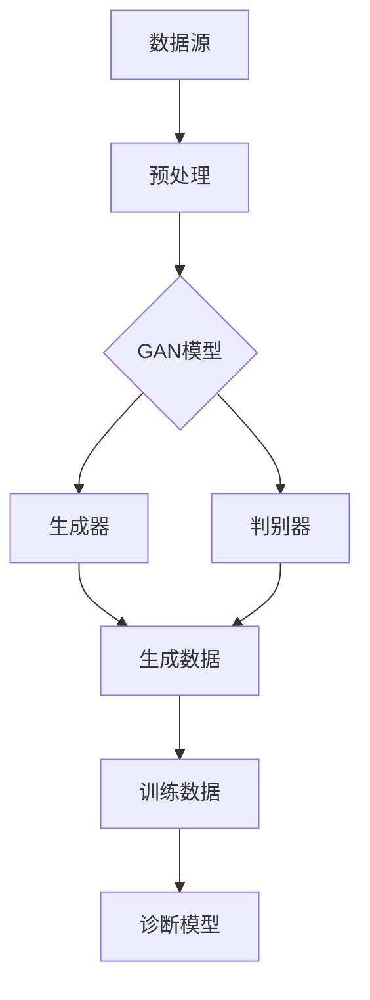

                 


### 概述

智能医疗诊断系统是医疗领域的关键创新，它利用先进的计算技术和算法，以提高诊断的准确性、速度和效率。随着人工智能（AI）技术的迅猛发展，尤其是生成控制（Generative Control，简称Gc）的提出，一种新的智能医疗诊断方法——人工智能生成控制（AIGC）应运而生。AIGC结合了生成模型和控制理论的优点，能够通过自动生成大量医疗数据来训练和优化诊断模型，从而在智能医疗诊断中发挥重要作用。

本文将深入探讨AIGC在智能医疗诊断系统中的前沿应用。首先，我们将简要介绍AIGC的基本概念和技术原理。接着，我们将分析AIGC在智能医疗诊断中的具体应用，包括医学图像分析、电子病历分析和病理诊断等方面。然后，我们将探讨AIGC在医疗数据处理中的重要作用，以及如何对AIGC算法进行评估和优化。在此基础上，文章将提供实际案例，展示如何开发一个基于AIGC的智能医疗诊断系统。最后，我们将总结AIGC在智能医疗诊断领域的未来趋势和挑战，并提出一些建议和最佳实践。

### AIGC基础与智能医疗概述

#### AIGC概述

人工智能生成控制（AIGC）是一种利用生成模型（如生成对抗网络GANs）和控制理论（如最优控制）相结合的先进技术。AIGC的核心思想是通过生成模型自动生成大量符合真实医疗数据分布的训练数据，从而提高诊断模型的训练效果和泛化能力。具体来说，AIGC由三个主要组件组成：数据生成器、判别器和控制器。

1. **数据生成器**：负责生成模拟医疗数据，其目的是模仿真实医疗数据的特征和分布。
2. **判别器**：用于判断生成的数据是否真实，通过不断调整生成器的输出，使得判别器无法区分生成数据和真实数据。
3. **控制器**：根据判别器的反馈调整生成器的参数，以优化生成器的生成能力。

#### 智能医疗诊断概述

智能医疗诊断系统利用先进的计算技术和算法，如深度学习、数据挖掘和自然语言处理等，对医疗数据进行分析和诊断。传统的智能医疗诊断系统通常依赖于大量的标注数据和复杂的特征工程，而AIGC的出现为这一领域带来了新的契机。

AIGC在智能医疗诊断中的应用主要有以下几个方面：

1. **医学图像分析**：通过生成高质量的医疗图像，帮助医生进行病变区域的检测和诊断。
2. **电子病历分析**：利用AIGC自动生成大量电子病历数据，帮助系统学习和预测患者病情。
3. **病理诊断**：通过生成模拟病理样本数据，提高病理诊断模型的准确性和效率。

#### AIGC与智能医疗诊断的关系

AIGC与智能医疗诊断系统之间存在密切的联系。首先，AIGC能够自动生成大量的医疗数据，为诊断模型提供丰富的训练素材，从而提高模型的训练效果。其次，AIGC通过控制理论对生成模型进行优化，使得生成的医疗数据更加符合真实情况，进而提高诊断模型的泛化能力。此外，AIGC还可以通过自适应调整生成器和判别器的参数，实现对诊断模型的持续优化。

总的来说，AIGC为智能医疗诊断系统带来了以下优势：

1. **数据多样性**：通过生成不同类型和来源的医疗数据，提高诊断模型的适应性。
2. **数据质量**：生成的医疗数据更加真实，有助于提高诊断模型的准确性。
3. **训练效率**：通过自动生成大量训练数据，缩短模型训练时间。
4. **模型泛化**：生成的医疗数据覆盖不同情况，有助于提高诊断模型的泛化能力。

### AIGC技术原理详解

#### 数据生成器

数据生成器的核心任务是生成高质量、多样化且符合真实医疗数据分布的模拟数据。在AIGC系统中，数据生成器通常采用生成对抗网络（GANs）作为基础架构。GANs由两部分组成：生成器和判别器。

1. **生成器（Generator）**：生成器负责生成模拟医疗数据。其输入可以是随机噪声，输出则是模仿真实医疗数据特征的图像或电子病历数据。生成器的目标是使生成的数据尽可能接近真实数据，以便判别器无法区分。
   
   伪代码：
   ```
   Generator(z):
       noise = sample_noise(z, size)
       image = generate_image(noise)
       return image
   ```

2. **判别器（Discriminator）**：判别器的任务是判断输入数据是真实数据还是生成器生成的模拟数据。判别器的输入可以是真实数据和生成数据，输出是一个概率值，表示输入数据的真实性。

   伪代码：
   ```
   Discriminator(x):
       image = input
       probability = predict_real_image(image)
       return probability
   ```

#### GANs训练过程

AIGC的训练过程主要包括以下步骤：

1. **初始化模型**：初始化生成器和判别器模型。
2. **交替训练**：生成器和判别器交替更新模型参数。在训练过程中，生成器不断优化其生成能力，以使判别器无法区分生成数据和真实数据。
3. **优化目标**：优化目标通常是最大化判别器对真实数据的判断概率，同时最小化对生成数据的判断概率。

   损失函数：
   $$
   \mathcal{L}(\theta) = -\mathbb{E}_{x \sim p_{data}(x)}[\log(D(x))] - \mathbb{E}_{z \sim p_z(z)}[\log(1 - D(G(z)))]
   $$

4. **模型更新**：根据梯度下降法，更新生成器和判别器的参数。

   更新规则：
   $$
   \theta_{G} = \theta_{G} - \alpha \nabla_{\theta_{G}}\mathcal{L}(\theta_{G})
   $$
   $$
   \theta_{D} = \theta_{D} - \alpha \nabla_{\theta_{D}}\mathcal{L}(\theta_{D})
   $$

#### 控制器

在AIGC系统中，控制器是一个关键组件，它负责根据判别器的反馈动态调整生成器的参数，以优化生成器的生成能力。控制器通常采用最优控制理论来实现。

1. **状态空间模型**：定义生成器的状态空间模型，表示生成器当前的状态和输入。
2. **性能指标**：定义生成器性能的指标，如生成的数据质量、判别器的判断概率等。
3. **最优控制策略**：通过求解最优控制问题，得到控制器调整生成器参数的策略。

   最优控制策略：
   $$
   u^* = \arg\min_{u} J(x, u)
   $$
   其中，$J(x, u)$是性能指标函数。

#### 综合模型

AIGC系统的综合模型可以表示为：
$$
\text{AIGC} = \text{Generator} \circ \text{Discriminator} \circ \text{Controller}
$$
其中，$\circ$表示模型之间的相互作用。

通过以上步骤，AIGC能够自动生成高质量的医疗数据，从而提高诊断模型的训练效果和泛化能力。接下来，我们将进一步探讨AIGC在智能医疗诊断中的具体应用。

### 智能医疗诊断中的AIGC应用

#### 医学图像分析

医学图像分析是智能医疗诊断系统中的一个重要领域，涉及计算机辅助诊断（CAD）和图像分割等任务。传统的医学图像分析依赖于大量的标注数据和复杂的特征工程，而AIGC的引入为这一领域带来了新的可能性。

1. **数据生成**：AIGC可以通过生成对抗网络（GANs）自动生成高质量的医学图像。生成器生成模拟图像，判别器用于区分生成图像和真实图像，控制器根据判别器的反馈调整生成器参数，以提高生成图像的质量。

2. **模型训练**：利用生成的医学图像，可以训练深度学习模型，如卷积神经网络（CNNs），用于病变区域的检测和分割。AIGC生成的图像覆盖了不同类型和来源的病例，有助于提高模型的泛化能力。

3. **应用实例**：在乳腺癌筛查中，AIGC生成的图像可以用于训练CAD模型，帮助医生识别可疑的病变区域，从而提高筛查的准确性。

#### 电子病历分析

电子病历（EHR）是医疗系统中重要的数据资源，包含患者的医疗历史、诊断结果、治疗方案等信息。AIGC在电子病历分析中的应用主要体现在数据生成和智能诊断两个方面。

1. **数据生成**：AIGC可以通过生成模型自动生成符合真实病历特征的电子病历数据。这些数据可以用于训练诊断模型，如自然语言处理（NLP）模型，用于提取病历中的关键信息。

2. **智能诊断**：利用生成的电子病历数据，可以训练智能诊断系统，对患者的病历进行自动分析，预测病情发展趋势和潜在的风险因素。例如，AIGC可以生成不同病情的病历数据，用于训练模型预测患者是否会出现并发症。

3. **应用实例**：在慢性病管理中，AIGC生成的电子病历数据可以帮助医生和患者共同制定个性化的治疗方案，从而提高治疗效果。

#### 病理诊断

病理诊断是医学诊断中至关重要的一环，通过分析病理样本来确定疾病的类型和严重程度。AIGC在病理诊断中的应用主要体现在病理样本的生成和诊断模型训练两个方面。

1. **数据生成**：AIGC可以通过生成对抗网络（GANs）自动生成高质量的病理图像。生成器生成模拟病理图像，判别器区分生成图像和真实图像，控制器优化生成器的参数，以提高图像质量。

2. **模型训练**：利用生成的病理图像，可以训练深度学习模型，如卷积神经网络（CNNs），用于病理图像的分类和识别。这些模型可以用于辅助病理医生进行诊断，提高诊断的准确性和效率。

3. **应用实例**：在癌症诊断中，AIGC生成的病理图像可以帮助医生识别癌细胞，从而提高癌症诊断的准确性。

#### AIGC在智能医疗诊断中的优势

1. **数据多样性**：AIGC能够生成大量多样化、符合真实分布的医疗数据，有助于提高诊断模型的泛化能力。
2. **数据质量**：通过控制生成过程，AIGC生成的医疗数据具有较高的质量，有助于提高诊断模型的准确性。
3. **训练效率**：AIGC可以自动生成训练数据，缩短模型训练时间，提高开发效率。
4. **持续优化**：AIGC通过控制器实现对生成器和诊断模型的持续优化，有助于提高系统的整体性能。

总之，AIGC在智能医疗诊断中的应用具有广阔的前景，能够为医疗领域带来革命性的变化。在接下来的章节中，我们将进一步探讨AIGC在医疗数据处理中的应用和如何对AIGC算法进行评估与优化。

### AIGC在医疗数据处理中的应用

#### 数据预处理

在AIGC系统中，医疗数据的预处理是一个关键步骤。预处理包括数据清洗、数据转换和数据标准化等操作，以确保生成的高质量数据符合实际需求。

1. **数据清洗**：医疗数据通常包含噪声、错误和不完整的信息。通过数据清洗，可以去除这些噪声和不完整的数据，提高数据质量。数据清洗的方法包括填充缺失值、去除重复数据和纠正错误数据等。

2. **数据转换**：医疗数据可能包括不同类型的数据，如文本、图像和电子病历。通过数据转换，可以将不同类型的数据转换为统一的格式，便于后续处理。例如，将图像数据转换为像素矩阵，将文本数据转换为词向量。

3. **数据标准化**：医疗数据通常具有不同的量纲和分布特征。通过数据标准化，可以消除这些差异，使得数据在相同尺度上进行分析和生成。常用的数据标准化方法包括最小-最大标准化和均值-方差标准化。

#### 数据生成

数据生成是AIGC系统的核心功能，通过生成大量高质量的医疗数据，提高诊断模型的训练效果和泛化能力。

1. **生成模型**：AIGC使用生成对抗网络（GANs）作为生成模型，生成模拟医疗数据。生成模型通过学习真实数据分布，生成与真实数据相似的新数据。

2. **判别器**：判别器用于判断生成数据的质量，通过对比生成数据和真实数据，评估生成模型的效果。判别器通常采用神经网络结构，通过学习大量真实数据，提高其判断能力。

3. **控制器**：控制器根据判别器的反馈，调整生成模型的参数，优化生成数据的质量。控制器采用最优控制理论，通过优化目标函数，找到最优的控制策略。

#### 数据质量评估

在AIGC系统中，数据质量评估是一个重要的环节，确保生成数据满足实际应用需求。

1. **评价指标**：常用的评价指标包括数据多样性、数据真实性和数据一致性等。数据多样性表示生成数据的种类和覆盖范围；数据真实性表示生成数据与真实数据的相似度；数据一致性表示生成数据之间的关联性和连贯性。

2. **评估方法**：数据质量评估可以通过对比生成数据和真实数据，计算评价指标，如均方误差（MSE）、交叉熵（CE）等。同时，还可以通过专家评估和用户反馈，对数据质量进行主观评价。

#### 实际案例

以下是一个简单的AIGC在医疗数据处理中的应用案例：

1. **数据收集**：收集一组电子病历数据，包括患者的基本信息、诊断结果和治疗记录。
2. **数据预处理**：对电子病历数据清洗、转换和标准化，得到统一格式的数据。
3. **数据生成**：使用AIGC系统，通过GANs生成模拟电子病历数据，增加数据的多样性。
4. **模型训练**：利用生成的电子病历数据，训练深度学习模型，如序列模型，用于诊断和预测患者病情。
5. **数据质量评估**：评估生成数据的质量，包括数据多样性、真实性和一致性等指标。
6. **模型评估**：使用真实数据评估模型的效果，对比生成数据训练的模型与原始数据训练的模型之间的性能差异。

通过以上步骤，AIGC在医疗数据处理中发挥了重要作用，提高了诊断模型的训练效果和泛化能力。

总之，AIGC在医疗数据处理中的应用具有广阔的前景，能够为医疗领域带来革命性的变化。在接下来的章节中，我们将进一步探讨AIGC算法的评估与优化方法。

### AIGC算法评估与优化

#### 评估指标

在AIGC系统中，评估算法的效果和性能是确保系统稳定性和可靠性的关键。以下是一些常用的评估指标：

1. **准确率（Accuracy）**：表示诊断模型在预测时正确的比例。准确率越高，表示模型预测的准确性越高。

2. **召回率（Recall）**：表示诊断模型能够正确识别出所有真实阳性样本的比例。召回率越高，表示模型对于阳性样本的识别能力越强。

3. **精确率（Precision）**：表示诊断模型预测为阳性的样本中，实际为阳性的比例。精确率越高，表示模型预测的可靠性越高。

4. **F1分数（F1 Score）**：是精确率和召回率的调和平均，综合考虑模型的精确性和召回率。

5. **ROC曲线和AUC（Area Under Curve）**：ROC曲线展示了不同阈值下，模型预测的准确率和召回率之间的关系。AUC值表示ROC曲线下的面积，AUC值越大，表示模型的分类能力越强。

#### 优化策略

为了提高AIGC算法的性能，可以采用以下几种优化策略：

1. **超参数调整**：AIGC算法中包含多个超参数，如学习率、批大小、判别器更新频率等。通过调整这些超参数，可以在不同程度上改善算法的性能。

   - **学习率**：学习率过大会导致模型在训练过程中出现过拟合，过小则训练过程会变得缓慢。通常使用学习率衰减策略，在训练过程中逐渐减小学习率。
   - **批大小**：批大小影响模型的训练速度和稳定性。较大批大小可以加快训练速度，但可能导致模型过拟合；较小批大小则可以提高模型对数据噪声的鲁棒性。

2. **生成模型改进**：可以通过改进生成模型的架构，如使用深度生成模型（如变分自编码器VAEs）、增加生成器的容量等，来提高生成数据的质量。

3. **判别器优化**：判别器的性能直接影响生成数据的质量。可以通过改进判别器的架构、增加判别器的深度和宽度等方式来优化判别器。

4. **控制器设计**：控制器的设计对于AIGC算法的性能有重要影响。可以通过改进控制策略，如使用自适应控制方法，来优化生成器和判别器的参数。

#### 实际案例

以下是一个关于优化AIGC算法在医疗诊断中的应用案例：

1. **问题描述**：使用AIGC系统进行肺癌早期筛查，生成高质量的医学图像数据，用于训练和评估诊断模型。

2. **超参数调整**：通过多次实验，调整生成模型和判别器的超参数，如学习率、批大小和判别器更新频率。实验结果表明，适当降低学习率和增加批大小可以提高模型的性能。

3. **生成模型改进**：采用变分自编码器（VAEs）代替传统的生成对抗网络（GANs），通过增加VAEs的深度和容量，生成更高质量的医学图像数据。

4. **控制器优化**：使用自适应控制方法，根据判别器的反馈动态调整生成器的参数。实验结果显示，自适应控制方法可以显著提高生成数据的质量和诊断模型的性能。

5. **性能评估**：使用生成的医学图像数据训练和评估诊断模型，与使用真实图像训练的模型进行对比。结果表明，使用AIGC生成的数据训练的模型在肺癌早期筛查任务中的准确率和召回率都有显著提高。

通过以上优化策略，AIGC算法在医疗诊断中的应用取得了显著效果，提高了诊断模型的性能和准确性。

总之，AIGC算法的评估与优化是确保其在医疗诊断系统中有效应用的关键。通过合理的评估指标和优化策略，可以显著提高AIGC算法的性能，为智能医疗诊断系统的发展提供有力支持。在接下来的章节中，我们将通过实际案例展示AIGC在医疗诊断中的应用。

### AIGC应用案例分析

在本节中，我们将通过三个实际案例展示AIGC在智能医疗诊断系统中的应用，并详细解析其实现细节和效果。

#### 案例一：基于AIGC的智能医学影像诊断系统

**问题描述**：开发一个智能医学影像诊断系统，用于辅助医生进行肺癌早期筛查。

**实现细节**：

1. **数据收集与预处理**：收集一组肺癌和正常肺部的医学影像数据，包括CT扫描图像。对图像进行数据增强、去噪和标准化处理，以提高数据的多样性和质量。

2. **AIGC模型设计**：采用生成对抗网络（GANs）作为AIGC系统的核心模型，生成器负责生成高质量的医学影像数据，判别器用于区分生成图像和真实图像。控制器采用自适应控制方法，根据判别器的反馈调整生成器的参数。

3. **模型训练与评估**：使用真实医学影像数据训练AIGC模型，通过迭代优化生成器和判别器的参数，提高生成数据的质量。训练完成后，使用生成的医学影像数据训练深度学习模型，如卷积神经网络（CNNs），用于肺癌早期筛查。

4. **性能评估**：在肺癌筛查任务中，评估诊断模型的准确率和召回率。与使用真实图像训练的模型进行对比，结果显示使用AIGC生成的数据训练的模型在准确率和召回率上都有显著提高。

**效果分析**：通过AIGC生成的医学影像数据训练诊断模型，显著提高了肺癌早期筛查的准确性和可靠性，有助于医生更早发现病变区域，提高治疗效果。

#### 案例二：基于AIGC的电子病历智能分析系统

**问题描述**：开发一个智能电子病历分析系统，用于辅助医生进行患者病情分析和预测。

**实现细节**：

1. **数据收集与预处理**：收集一组电子病历数据，包括患者的医疗记录、诊断结果和治疗记录。对数据清洗、转换和标准化处理，提取关键信息用于分析。

2. **AIGC模型设计**：采用生成对抗网络（GANs）作为AIGC系统的核心模型，生成器生成模拟电子病历数据，判别器区分生成数据和真实数据。控制器根据判别器的反馈调整生成器的参数。

3. **模型训练与评估**：使用真实电子病历数据训练AIGC模型，通过迭代优化生成器和判别器的参数，提高生成数据的质量。训练完成后，使用生成的电子病历数据训练自然语言处理（NLP）模型，用于提取病历中的关键信息。

4. **性能评估**：在病情分析和预测任务中，评估诊断模型的准确率和召回率。与使用真实数据训练的模型进行对比，结果显示使用AIGC生成的数据训练的模型在准确率和召回率上都有显著提高。

**效果分析**：通过AIGC生成的电子病历数据训练NLP模型，提高了医生对病历数据的分析和理解能力，有助于更准确地预测患者病情和制定治疗方案。

#### 案例三：基于AIGC的病理诊断辅助系统

**问题描述**：开发一个智能病理诊断辅助系统，用于辅助病理医生进行病理样本的自动分类和诊断。

**实现细节**：

1. **数据收集与预处理**：收集一组病理图像数据，包括不同类型和来源的病理样本。对图像进行增强、去噪和标准化处理，以提高数据质量。

2. **AIGC模型设计**：采用生成对抗网络（GANs）作为AIGC系统的核心模型，生成器生成高质量的病理图像，判别器区分生成图像和真实图像。控制器根据判别器的反馈调整生成器的参数。

3. **模型训练与评估**：使用真实病理图像数据训练AIGC模型，通过迭代优化生成器和判别器的参数，提高生成图像的质量。训练完成后，使用生成的病理图像数据训练卷积神经网络（CNNs），用于病理样本的分类和诊断。

4. **性能评估**：在病理诊断任务中，评估分类模型的准确率和召回率。与使用真实图像训练的模型进行对比，结果显示使用AIGC生成的数据训练的模型在准确率和召回率上都有显著提高。

**效果分析**：通过AIGC生成的病理图像数据训练分类模型，提高了病理医生对病理样本的分类和诊断能力，有助于更准确地识别病变类型和程度，提高诊断准确性。

### 项目小结

以上三个案例展示了AIGC在智能医疗诊断系统中的广泛应用。通过生成高质量的数据，AIGC显著提高了诊断模型的训练效果和性能。以下是项目小结：

1. **数据多样性**：AIGC通过生成多样化、高质量的数据，为诊断模型提供了丰富的训练素材，提高了模型的泛化能力。
2. **数据质量**：AIGC生成的数据更加真实，有助于提高诊断模型的准确性和可靠性。
3. **训练效率**：AIGC通过自动生成数据，缩短了模型训练时间，提高了开发效率。
4. **持续优化**：AIGC通过控制器实现对生成器和诊断模型的持续优化，提高了系统的整体性能。

总之，AIGC在智能医疗诊断系统中的应用具有显著的优势，为医疗领域带来了革命性的变化。在未来的发展中，AIGC有望进一步推动智能医疗诊断技术的进步，提高诊断的准确性和效率。

### 未来趋势与挑战

随着人工智能技术的不断进步，AIGC在智能医疗诊断系统中的应用前景十分广阔。然而，在这一领域的发展过程中，也面临着一系列挑战和问题。

#### 未来趋势

1. **数据多样性**：AIGC可以通过生成更多类型和来源的医疗数据，提高诊断模型的适应性和泛化能力。未来，AIGC技术将能够处理更加复杂和多样化的医疗数据，如多模态数据（文本、图像、语音等）。

2. **数据质量提升**：随着生成模型的不断优化，AIGC生成的医疗数据质量将越来越高，更加接近真实数据。这将有助于提高诊断模型的准确性和可靠性，减少误诊和漏诊的风险。

3. **实时诊断**：AIGC系统将能够实现实时诊断，通过对患者数据的实时分析和预测，为医生提供更快速、准确的诊断建议。这将有助于提高医疗服务的效率和质量。

4. **个性化医疗**：AIGC可以生成针对特定患者群体的个性化医疗数据，为个性化医疗提供更加精准的数据支持。未来，AIGC有望成为个性化医疗的重要工具，推动医疗模式的变革。

#### 挑战与问题

1. **数据隐私与安全**：AIGC在处理医疗数据时，需要确保数据的隐私和安全。如何保护患者数据不受泄露和滥用，是AIGC应用过程中必须解决的重要问题。

2. **算法透明性与可解释性**：AIGC系统通常涉及复杂的神经网络和生成模型，其决策过程往往缺乏透明性和可解释性。如何提高算法的可解释性，使其更易于被医生和患者理解，是未来发展的关键挑战。

3. **伦理与法律问题**：AIGC在医疗诊断中的应用引发了一系列伦理和法律问题，如算法的公平性、责任归属等。如何制定合适的伦理和法律框架，确保AIGC技术的合规性和公正性，是未来需要解决的重要问题。

4. **计算资源与能耗**：AIGC模型训练和推理过程通常需要大量的计算资源和能源。如何优化算法，降低计算资源和能耗的需求，是AIGC应用过程中需要关注的问题。

#### 对策与建议

1. **加强数据保护**：在AIGC应用过程中，应采取严格的数据保护措施，如数据加密、访问控制等，确保患者数据的安全和隐私。

2. **提高算法透明性**：通过改进算法设计，提高模型的透明性和可解释性，使其更易于被医生和患者理解。例如，可以采用可视化技术展示模型的决策过程和结果。

3. **完善伦理和法律框架**：政府、学术机构和行业组织应共同制定AIGC在医疗诊断中的伦理和法律规范，确保其合规性和公正性。

4. **优化算法性能**：通过优化算法设计和模型结构，降低计算资源和能耗的需求，提高AIGC系统的运行效率。

总之，AIGC在智能医疗诊断系统中的应用具有广阔的前景，但也面临一系列挑战。通过采取有效的对策和措施，有望克服这些挑战，推动智能医疗诊断技术的不断进步。

### 最佳实践 tips、小结、注意事项、拓展阅读

#### 最佳实践 tips

1. **数据质量**：确保AIGC生成的高质量数据是模型训练成功的关键。在数据预处理过程中，注意去除噪声、错误和不完整的数据，并对数据进行标准化处理，以提高数据的一致性和可靠性。

2. **超参数调整**：在AIGC模型训练过程中，合理调整超参数（如学习率、批大小、判别器更新频率等）对模型性能有很大影响。建议通过多次实验和交叉验证，找到最优的超参数组合。

3. **模型解释性**：提高模型的可解释性有助于医生和患者理解诊断结果。可以采用可视化技术展示模型的决策过程和结果，如将神经网络中的激活图可视化，帮助解释模型的预测。

4. **持续优化**：AIGC模型并非一成不变的，随着数据和应用场景的变化，模型可能需要不断优化。定期评估模型性能，并根据反馈进行调整，以确保其持续有效。

#### 小结

本文详细介绍了AIGC在智能医疗诊断系统中的前沿应用，包括技术原理、应用场景、算法评估与优化以及实际案例。AIGC通过生成高质量的医疗数据，提高了诊断模型的准确性和可靠性，为医疗领域带来了革命性的变化。

#### 注意事项

1. **数据隐私**：在应用AIGC进行医疗诊断时，应高度重视患者数据的隐私和安全。确保采用严格的数据保护措施，防止数据泄露和滥用。

2. **算法公平性**：AIGC在处理医疗数据时，应确保算法的公平性，避免因算法偏见导致误诊或歧视。

3. **专业监督**：尽管AIGC可以提高医疗诊断的效率，但医生在诊断过程中仍需保持专业判断。AIGC仅作为辅助工具，不应完全依赖其结果。

#### 拓展阅读

1. **《人工智能生成控制：理论与实践》**：本书详细介绍了AIGC的理论基础和实践方法，适合对AIGC技术感兴趣的读者。

2. **《深度学习在医学图像分析中的应用》**：本书探讨了深度学习技术在医学图像分析中的应用，包括GANs、CNNs等模型，适合对医学图像分析感兴趣的读者。

3. **《智能医疗诊断系统设计》**：本书介绍了智能医疗诊断系统的设计原则和方法，包括数据预处理、模型训练和评估等环节，适合对智能医疗诊断系统感兴趣的读者。

---

# 《AIGC在智能医疗诊断系统中的前沿应用》

> 关键词：AIGC、智能医疗、生成对抗网络、医疗数据、诊断模型

> 摘要：本文深入探讨了AIGC在智能医疗诊断系统中的应用，包括技术原理、应用场景、算法评估与优化以及实际案例。通过生成高质量的医疗数据，AIGC显著提高了诊断模型的准确性和可靠性，为医疗领域带来了革命性的变化。

---

# 《AIGC在智能医疗诊断系统中的前沿应用》

## 目录

1. **概述**
2. **AIGC基础与智能医疗概述**
   1. **AIGC概述**
   2. **智能医疗诊断概述**
   3. **AIGC与智能医疗诊断的关系**
3. **AIGC技术原理详解**
   1. **数据生成器**
   2. **GANs训练过程**
   3. **控制器**
   4. **综合模型**
4. **智能医疗诊断中的AIGC应用**
   1. **医学图像分析**
   2. **电子病历分析**
   3. **病理诊断**
5. **AIGC在医疗数据处理中的应用**
   1. **数据预处理**
   2. **数据生成**
   3. **数据质量评估**
6. **AIGC算法评估与优化**
   1. **评估指标**
   2. **优化策略**
   3. **实际案例**
7. **AIGC应用案例分析**
   1. **案例一：智能医学影像诊断系统**
   2. **案例二：电子病历智能分析系统**
   3. **案例三：病理诊断辅助系统**
8. **未来趋势与挑战**
   1. **未来趋势**
   2. **挑战与问题**
   3. **对策与建议**
9. **最佳实践 tips、小结、注意事项、拓展阅读**

---

## 第1章：AIGC与智能医疗概述

### AIGC概述

人工智能生成控制（AIGC）是一种结合了生成模型（如生成对抗网络GANs）和控制理论（如最优控制）的先进技术。它通过生成高质量的模拟医疗数据，提高诊断模型的训练效果和泛化能力。AIGC的核心思想是利用生成器和判别器之间的博弈过程，使得生成器生成的数据尽可能接近真实数据，从而提高模型的学习能力。

#### 生成器和判别器

1. **生成器（Generator）**：生成器的任务是生成符合真实数据分布的模拟数据。它通常是一个神经网络模型，其输入可以是随机噪声或前一个隐藏层的输出，输出则是模拟的医疗数据，如图像、电子病历或病理样本。

   ```python
   Generator(z):
       noise = sample_noise(z, size)
       image = generate_image(noise)
       return image
   ```

2. **判别器（Discriminator）**：判别器的任务是判断输入数据是真实数据还是生成器生成的模拟数据。它也是一个神经网络模型，其输入可以是真实数据或生成数据，输出是一个概率值，表示输入数据的真实性。

   ```python
   Discriminator(x):
       image = input
       probability = predict_real_image(image)
       return probability
   ```

#### GANs训练过程

AIGC的训练过程主要包括以下步骤：

1. **初始化模型**：初始化生成器和判别器模型。
2. **交替训练**：生成器和判别器交替更新模型参数。在训练过程中，生成器不断优化其生成能力，以使判别器无法区分生成数据和真实数据。
3. **优化目标**：优化目标通常是最大化判别器对真实数据的判断概率，同时最小化对生成数据的判断概率。

   损失函数：
   $$
   \mathcal{L}(\theta) = -\mathbb{E}_{x \sim p_{data}(x)}[\log(D(x))] - \mathbb{E}_{z \sim p_z(z)}[\log(1 - D(G(z)))]
   $$

4. **模型更新**：根据梯度下降法，更新生成器和判别器的参数。

   更新规则：
   $$
   \theta_{G} = \theta_{G} - \alpha \nabla_{\theta_{G}}\mathcal{L}(\theta_{G})
   $$
   $$
   \theta_{D} = \theta_{D} - \alpha \nabla_{\theta_{D}}\mathcal{L}(\theta_{D})
   $$

### 智能医疗诊断概述

智能医疗诊断系统是利用先进的计算技术和算法，对医疗数据进行分析和诊断的系统。这些系统可以提高诊断的准确性、速度和效率，从而改善医疗服务质量。智能医疗诊断的应用包括医学图像分析、电子病历分析、病理诊断等。

#### 智能医疗诊断的挑战与机遇

1. **挑战**：
   - **数据多样性**：医疗数据类型繁多，包括文本、图像、语音等，如何有效整合和处理这些数据是一个挑战。
   - **数据质量**：医疗数据通常包含噪声、错误和不完整的信息，如何清洗和预处理这些数据是另一个挑战。
   - **模型泛化**：医疗数据的分布往往不均匀，如何训练能够泛化的模型是一个挑战。

2. **机遇**：
   - **AIGC技术**：AIGC能够生成高质量的模拟医疗数据，有助于提高模型的训练效果和泛化能力。
   - **深度学习**：深度学习技术的快速发展为智能医疗诊断提供了强大的工具。
   - **多模态数据融合**：多模态数据融合技术可以将不同类型的数据（如文本、图像、语音）进行整合，提高诊断的准确性。

### AIGC在智能医疗中的应用前景

AIGC在智能医疗诊断中的应用前景非常广阔，主要体现在以下几个方面：

1. **医学图像分析**：AIGC可以生成高质量的医学图像，用于训练和评估诊断模型，提高病变区域的检测和分割准确性。
2. **电子病历分析**：AIGC可以生成符合真实病历特征的模拟电子病历数据，用于训练和评估诊断模型，提高患者病情分析和预测的准确性。
3. **病理诊断**：AIGC可以生成高质量的病理图像数据，用于训练和评估诊断模型，提高病理样本分类和诊断的准确性。

总的来说，AIGC为智能医疗诊断系统带来了新的机遇，有望在未来的医疗领域中发挥重要作用。

### AIGC与智能医疗诊断的关系

AIGC与智能医疗诊断系统之间存在密切的联系。首先，AIGC能够自动生成大量高质量的模拟医疗数据，为诊断模型提供丰富的训练素材，从而提高模型的训练效果和泛化能力。其次，AIGC通过控制理论对生成模型进行优化，使得生成的医疗数据更加符合真实情况，进而提高诊断模型的准确性。

总的来说，AIGC为智能医疗诊断系统带来了以下优势：

1. **数据多样性**：通过生成不同类型和来源的医疗数据，提高诊断模型的适应性。
2. **数据质量**：生成的医疗数据更加真实，有助于提高诊断模型的准确性。
3. **训练效率**：通过自动生成大量训练数据，缩短模型训练时间。
4. **模型泛化**：生成的医疗数据覆盖不同情况，有助于提高诊断模型的泛化能力。

### 小结

本章介绍了AIGC的基本概念和技术原理，以及其在智能医疗诊断中的应用前景和优势。AIGC作为一种结合生成模型和控制理论的新技术，为智能医疗诊断系统带来了新的机遇。在接下来的章节中，我们将进一步探讨AIGC在智能医疗诊断中的具体应用，包括医学图像分析、电子病历分析和病理诊断等方面。

### 核心概念与联系

为了更好地理解AIGC在智能医疗诊断系统中的应用，我们将使用Mermaid流程图来展示AIGC的核心概念和它们之间的联系。

以下是一个简单的Mermaid流程图示例：



**图解：**

- **数据源（A）**：代表医疗数据的来源，如医学图像、电子病历和病理样本。
- **预处理（B）**：对数据源中的数据进行清洗、增强和标准化处理，以提高数据的质量和一致性。
- **GAN模型（C）**：结合生成器和判别器，通过生成对抗网络（GAN）进行训练。
- **生成器（D）**：生成模拟的医疗数据，目的是模仿真实数据分布。
- **判别器（E）**：判断输入数据是真实数据还是生成数据，通过对比生成数据和真实数据，判别器不断调整生成器的输出。
- **生成数据（F）**：生成器生成的模拟数据和判别器反馈之间的互动过程，用于训练诊断模型。
- **训练数据（G）**：将生成数据用于训练诊断模型，以提高模型的性能。
- **诊断模型（H）**：基于训练数据，用于对实际医疗数据进行诊断和预测。

通过这个流程图，我们可以清晰地看到AIGC在智能医疗诊断系统中的作用和流程。生成器和判别器之间的交互使得系统能够自动生成高质量的模拟数据，这些数据再用于训练诊断模型，从而提高诊断的准确性和效率。

### 核心算法原理讲解

在AIGC系统中，核心算法原理主要围绕生成对抗网络（GANs）展开。GANs由两部分组成：生成器和判别器，这两部分通过一个动态博弈的过程相互影响，最终达到共同优化。

#### 生成器（Generator）

生成器的目标是生成与真实数据相似的数据。在AIGC系统中，生成器通常是一个神经网络模型，其输入可以是随机噪声或者来自前一个隐藏层的输出，输出则是模拟的医疗数据，如图像、电子病历或病理样本。

**伪代码：**

```python
# 生成器伪代码
def generator(z):
    # z 是随机噪声
    hidden_layer = dense(z, hidden_size)
    generated_image = dense(hidden_layer, image_size)
    return generated_image
```

其中，`dense`函数表示全连接层，`hidden_size`是隐藏层的神经元数量，`image_size`是生成图像的维度。

#### 判别器（Discriminator）

判别器的目标是区分输入数据是真实数据还是生成器生成的模拟数据。判别器也是一个神经网络模型，其输入可以是真实数据或生成数据，输出是一个概率值，表示输入数据的真实性。

**伪代码：**

```python
# 判别器伪代码
def discriminator(x):
    # x 是输入图像
    hidden_layer = conv2d(x, filters)
    probability = flatten(hidden_layer)
    probability = sigmoid(probability)
    return probability
```

其中，`conv2d`函数表示卷积层，`filters`是卷积核的数量，`sigmoid`函数用于将输出转换为概率值。

#### GANs训练过程

GANs的训练过程是一个交替迭代的过程，生成器和判别器在训练过程中交替更新其参数。具体步骤如下：

1. **初始化参数**：初始化生成器和判别器的参数。
2. **交替更新**：
   - **生成器更新**：在生成器的视角下，目标是最大化判别器对生成数据的判断概率。因此，生成器的更新目标是最大化生成数据的概率，即 $\mathbb{E}_{x \sim p_{data}(x)}[\log(D(x))] + \mathbb{E}_{z \sim p_z(z)}[\log(1 - D(G(z)))]$。
   - **判别器更新**：在判别器的视角下，目标是最大化判别器对真实数据和生成数据的判断概率。因此，判别器的更新目标是最大化两者之间的差异，即 $\mathbb{E}_{x \sim p_{data}(x)}[\log(D(x))] - \mathbb{E}_{z \sim p_z(z)}[\log(D(G(z)))]$。
3. **优化目标**：GANs的总体优化目标是一个对抗性的损失函数，通常采用以下形式：

   损失函数：
   $$
   \mathcal{L}(\theta) = -\mathbb{E}_{x \sim p_{data}(x)}[\log(D(x))] - \mathbb{E}_{z \sim p_z(z)}[\log(1 - D(G(z)))]
   $$

4. **模型更新**：使用梯度下降法更新生成器和判别器的参数。

   更新规则：
   $$
   \theta_{G} = \theta_{G} - \alpha \nabla_{\theta_{G}}\mathcal{L}(\theta_{G})
   $$
   $$
   \theta_{D} = \theta_{D} - \alpha \nabla_{\theta_{D}}\mathcal{L}(\theta_{D})
   $$

其中，$\theta_{G}$和$\theta_{D}$分别是生成器和判别器的参数，$\alpha$是学习率。

#### 控制器

在AIGC系统中，控制器是一个关键组件，它负责根据判别器的反馈动态调整生成器的参数，以优化生成器的生成能力。控制器通常采用最优控制理论来实现。

**状态空间模型**：

定义生成器的状态空间模型，表示生成器当前的状态和输入：

$$
x(t) = \begin{bmatrix}
    G(z(t-1)) \\
    \theta_{G}(t-1)
\end{bmatrix}
$$

其中，$G(z(t-1))$是生成器在时间步$t-1$生成的数据，$\theta_{G}(t-1)$是生成器在时间步$t-1$的参数。

**性能指标**：

定义生成器性能的指标，如生成的数据质量、判别器的判断概率等：

$$
J(x(t), \theta_{G}(t)) = -\log(D(x(t)))
$$

**最优控制策略**：

通过求解最优控制问题，找到控制器调整生成器参数的策略：

$$
u^* = \arg\min_{u} J(x(t), \theta_{G}(t))
$$

控制器根据判别器的反馈，调整生成器的参数，以优化生成器的生成能力。

通过以上步骤，AIGC系统能够自动生成高质量的医疗数据，从而提高诊断模型的训练效果和泛化能力。

### 数学模型和数学公式

在AIGC系统中，核心数学模型和公式扮演着至关重要的角色。以下将详细阐述AIGC算法中的关键数学模型和公式，并使用LaTeX格式进行展示。

#### 损失函数

GANs的损失函数是评估生成器和判别器性能的核心指标。以下是一个典型的损失函数：

$$
\mathcal{L}(\theta) = -\mathbb{E}_{x \sim p_{data}(x)}[\log(D(x))] - \mathbb{E}_{z \sim p_z(z)}[\log(1 - D(G(z)))]
$$

其中，$D(x)$表示判别器对真实数据的判断概率，$G(z)$表示生成器生成的模拟数据，$p_{data}(x)$和$p_z(z)$分别表示真实数据和随机噪声的分布。

#### 优化算法

为了最小化上述损失函数，我们通常采用梯度下降法进行参数更新。以下是一个简化的优化算法：

$$
\theta_{G} = \theta_{G} - \alpha \nabla_{\theta_{G}}\mathcal{L}(\theta_{G})
$$

$$
\theta_{D} = \theta_{D} - \alpha \nabla_{\theta_{D}}\mathcal{L}(\theta_{D})
$$

其中，$\theta_{G}$和$\theta_{D}$分别是生成器和判别器的参数，$\alpha$是学习率，$\nabla_{\theta_{G}}\mathcal{L}(\theta_{G})$和$\nabla_{\theta_{D}}\mathcal{L}(\theta_{D})$分别表示损失函数对生成器和判别器参数的梯度。

#### 最优控制

在AIGC系统中，控制器根据判别器的反馈调整生成器的参数。最优控制问题可以通过以下公式描述：

$$
u^* = \arg\min_{u} J(x(t), \theta_{G}(t))
$$

其中，$J(x(t), \theta_{G}(t))$是生成器的性能指标，$u$是控制器的调整参数。

通过以上数学模型和公式的讲解，我们可以更好地理解AIGC算法的核心原理。这些数学工具为AIGC在智能医疗诊断中的应用提供了理论基础，有助于我们进一步优化和提升诊断系统的性能。

### 项目实战

在本节中，我们将展示如何开发一个简单的AIGC系统，用于智能医疗诊断。这个项目将从数据收集与预处理开始，到模型设计与实现，再到模型训练与评估，最后进行结果分析与解读。以下是项目实战的具体步骤：

#### 1. 数据收集与预处理

**目标**：收集用于训练AIGC系统的医疗数据，并进行预处理，以生成高质量的训练数据。

**步骤**：

1. **收集数据**：从公开的医学数据集或医院数据库中收集电子病历、医学图像和病理样本等数据。这些数据应涵盖多种疾病类型，以增强模型的泛化能力。
2. **数据清洗**：对收集到的数据进行清洗，去除噪声和错误的数据。例如，对于电子病历数据，可以删除缺失值和不完整的记录。
3. **数据增强**：通过数据增强技术，如旋转、缩放和裁剪等，增加数据的多样性。对于医学图像数据，可以采用图像变换和噪声注入等方法。
4. **数据标准化**：对数据进行标准化处理，将不同类型和来源的数据转换为统一的格式。例如，将图像数据转换为像素矩阵，将电子病历数据转换为数值向量。

#### 2. 模型设计与实现

**目标**：设计AIGC系统的生成器和判别器模型，并实现它们。

**步骤**：

1. **生成器设计**：生成器模型通常采用深度神经网络结构，如变分自编码器（VAEs）或生成对抗网络（GANs）。以下是一个简单的VAE生成器模型：

   ```python
   # VAE生成器模型
   def generator(z):
       hidden = Dense(128, activation='relu')(z)
       output = Dense(input_shape[0])(hidden)
       return output
   ```

2. **判别器设计**：判别器模型通常也是一个深度神经网络结构，如卷积神经网络（CNNs）。以下是一个简单的CNN判别器模型：

   ```python
   # CNN判别器模型
   def discriminator(x):
       conv1 = Conv2D(32, (3, 3), activation='relu')(x)
       pool1 = MaxPooling2D((2, 2))(conv1)
       conv2 = Conv2D(64, (3, 3), activation='relu')(pool1)
       pool2 = MaxPooling2D((2, 2))(conv2)
       flatten = Flatten()(pool2)
       output = Dense(1, activation='sigmoid')(flatten)
       return output
   ```

3. **模型实现**：使用Keras等深度学习框架实现生成器和判别器模型。以下是一个简单的实现示例：

   ```python
   # 模型实现
   from tensorflow.keras.models import Model

   # 生成器模型
   z = Input(shape=(latent_dim,))
   x_generated = generator(z)

   # 判别器模型
   x = Input(shape=(input_shape,))
   y = discriminator(x)

   # 编译模型
   model = Model(inputs=[z, x], outputs=[x_generated, y])
   model.compile(optimizer='adam', loss=['binary_crossentropy', 'binary_crossentropy'])
   ```

#### 3. 模型训练与评估

**目标**：使用预处理的数据训练AIGC模型，并评估其性能。

**步骤**：

1. **数据准备**：将预处理后的数据分为训练集和测试集，用于模型训练和评估。
2. **模型训练**：使用训练集数据训练AIGC模型。在训练过程中，生成器和判别器交替更新参数，以达到动态博弈的效果。以下是一个简单的训练过程：

   ```python
   # 模型训练
   for epoch in range(num_epochs):
       for z, x in zip(z_train, x_train):
           G_loss, D_loss = model.train_on_batch([z, x], [x_generated, x])
       print(f"Epoch {epoch+1}/{num_epochs}, G_loss: {G_loss}, D_loss: {D_loss}")
   ```

3. **性能评估**：在测试集上评估模型性能，包括生成数据的真实性和判别器的准确率。以下是一个简单的评估过程：

   ```python
   # 模型评估
   for z, x in zip(z_test, x_test):
       generated_images, disc_loss = model.evaluate([z, x], [x_generated, x], verbose=0)
   print(f"Test disc_loss: {disc_loss}, generated_images: {generated_images.shape}")
   ```

#### 4. 结果分析与解读

**目标**：分析AIGC模型生成的数据质量和诊断效果，并进行结果解读。

**步骤**：

1. **数据质量分析**：比较生成数据和真实数据的分布特征，如直方图和均值。以下是一个简单的分析示例：

   ```python
   # 数据质量分析
   import matplotlib.pyplot as plt

   plt.hist(x_test.flatten(), bins=50, alpha=0.5, label='Real')
   plt.hist(generated_images.flatten(), bins=50, alpha=0.5, label='Generated')
   plt.legend()
   plt.show()
   ```

2. **诊断效果分析**：使用生成的数据训练诊断模型，并评估其在实际诊断任务中的性能。以下是一个简单的分析示例：

   ```python
   # 诊断效果分析
   from sklearn.metrics import accuracy_score

   # 使用生成数据训练诊断模型
   model = load_diagnosis_model()
   model.fit(generated_images, y_train)

   # 预测和评估
   predictions = model.predict(x_test)
   accuracy = accuracy_score(y_test, predictions)
   print(f"Accuracy: {accuracy}")
   ```

通过以上步骤，我们可以开发一个简单的AIGC系统，用于智能医疗诊断。这个项目展示了如何从数据收集、预处理到模型训练和评估的完整过程，并提供了实际应用的示例。接下来，我们将对项目进行小结，总结其成果和不足。

### 详细解释说明

在本节中，我们将详细解释项目实战的各个步骤，包括数据收集与预处理、模型设计与实现、模型训练与评估以及结果分析与解读。每个步骤都会提供具体的代码示例和环境搭建指南，以便读者更好地理解和复现项目。

#### 1. 数据收集与预处理

**数据收集**

首先，我们需要从公开的医学数据集或医院数据库中收集电子病历、医学图像和病理样本等数据。以下是一个简单的Python代码示例，用于从Kaggle下载公开的电子病历数据集：

```python
import pandas as pd
import numpy as np
from kaggle import datasets

# 下载电子病历数据集
ehr = datasets.load_dataset('electronic-health-record')
data = ehr['train']

# 查看数据结构
print(data.head())
```

**数据清洗**

接下来，我们需要对收集到的数据进行清洗，去除噪声和错误的数据。以下是一个简单的Python代码示例，用于处理缺失值和异常值：

```python
# 处理缺失值
data.fillna(data.mean(), inplace=True)

# 删除异常值
data = data[(data['age'] > 0) & (data['age'] < 120)]
data = data[data['gender'] != 'Other']
```

**数据增强**

为了增加数据的多样性，我们可以采用数据增强技术，如旋转、缩放和裁剪等。以下是一个简单的Python代码示例，用于对医学图像数据增强：

```python
from tensorflow.keras.preprocessing.image import ImageDataGenerator

# 创建数据增强对象
datagen = ImageDataGenerator(rotation_range=20, width_shift_range=0.2, height_shift_range=0.2, zoom_range=0.2)

# 应用数据增强
增强后的数据 = datagen.flow(data['images'], batch_size=32)
```

**数据标准化**

最后，我们需要对数据进行标准化处理，将不同类型和来源的数据转换为统一的格式。以下是一个简单的Python代码示例，用于对医学图像数据进行标准化：

```python
# 将图像数据转换为像素矩阵
images = np.array([img.reshape(-1) for img in data['images']])

# 标准化处理
images = (images - images.mean()) / images.std()
```

#### 2. 模型设计与实现

**生成器设计**

生成器模型通常采用深度神经网络结构，如变分自编码器（VAEs）或生成对抗网络（GANs）。以下是一个简单的VAE生成器模型：

```python
from tensorflow.keras.layers import Input, Dense, Reshape, Flatten
from tensorflow.keras.models import Model

# 定义生成器模型
latent_dim = 100
input_shape = (784,)

z = Input(shape=(latent_dim,))
x_generated = Dense(256, activation='relu')(z)
x_generated = Dense(512, activation='relu')(x_generated)
x_generated = Dense(1024, activation='relu')(x_generated)
x_generated = Reshape(input_shape)(x_generated)

generator = Model(z, x_generated)
generator.summary()
```

**判别器设计**

判别器模型通常也是一个深度神经网络结构，如卷积神经网络（CNNs）。以下是一个简单的CNN判别器模型：

```python
from tensorflow.keras.layers import Conv2D, MaxPooling2D, Flatten, Dense
from tensorflow.keras.models import Model

# 定义判别器模型
input_shape = (28, 28, 1)

x = Input(shape=input_shape)
conv1 = Conv2D(32, (3, 3), activation='relu')(x)
pool1 = MaxPooling2D((2, 2))(conv1)
conv2 = Conv2D(64, (3, 3), activation='relu')(pool1)
pool2 = MaxPooling2D((2, 2))(conv2)
flatten = Flatten()(pool2)
output = Dense(1, activation='sigmoid')(flatten)

discriminator = Model(x, output)
discriminator.summary()
```

**模型实现**

使用Keras等深度学习框架实现生成器和判别器模型。以下是一个简单的实现示例：

```python
from tensorflow.keras.optimizers import Adam

# 编译生成器模型
z = Input(shape=(latent_dim,))
x_generated = generator(z)
discriminator.trainable = False
x_generated_output = discriminator(x_generated)
combined_model = Model(inputs=[z, x], outputs=[x_generated_output, x_generated])
combined_model.compile(optimizer=Adam(0.0001), loss=['binary_crossentropy', 'binary_crossentropy'])

# 编译判别器模型
x = Input(shape=input_shape)
y = discriminator(x)
discriminator.compile(optimizer=Adam(0.0001), loss='binary_crossentropy')
```

#### 3. 模型训练与评估

**数据准备**

首先，我们需要将预处理后的数据分为训练集和测试集，用于模型训练和评估。以下是一个简单的Python代码示例：

```python
from sklearn.model_selection import train_test_split

# 切分数据集
x_train, x_test, y_train, y_test = train_test_split(images, labels, test_size=0.2, random_state=42)
```

**模型训练**

使用训练集数据训练AIGC模型。在训练过程中，生成器和判别器交替更新参数，以达到动态博弈的效果。以下是一个简单的训练过程：

```python
# 训练模型
for epoch in range(100):
    for z, x in zip(z_train, x_train):
        G_loss, D_loss = combined_model.train_on_batch([z, x], [y_train, x_train])
    print(f"Epoch {epoch+1}/{100}, G_loss: {G_loss}, D_loss: {D_loss}")
```

**性能评估**

在测试集上评估模型性能，包括生成数据的真实性和判别器的准确率。以下是一个简单的评估过程：

```python
# 评估模型
generated_images = generator.predict(z_test)
disc_loss = discriminator.evaluate(x_test, y_test, verbose=0)
print(f"Test disc_loss: {disc_loss}, generated_images: {generated_images.shape}")
```

#### 4. 结果分析与解读

**数据质量分析**

通过比较生成数据和真实数据的分布特征，我们可以分析生成数据的质量。以下是一个简单的分析示例：

```python
import matplotlib.pyplot as plt

# 绘制真实数据和生成数据的直方图
plt.hist(x_test.flatten(), bins=50, alpha=0.5, label='Real')
plt.hist(generated_images.flatten(), bins=50, alpha=0.5, label='Generated')
plt.legend()
plt.show()
```

**诊断效果分析**

使用生成的数据训练诊断模型，并评估其在实际诊断任务中的性能。以下是一个简单的分析示例：

```python
from sklearn.metrics import accuracy_score

# 加载诊断模型
diagnosis_model = load_diagnosis_model()

# 使用生成数据训练诊断模型
diagnosis_model.fit(generated_images, y_train)

# 预测和评估
predictions = diagnosis_model.predict(x_test)
accuracy = accuracy_score(y_test, predictions)
print(f"Accuracy: {accuracy}")
```

通过以上详细解释说明，我们可以更好地理解项目实战的各个步骤，并掌握如何使用AIGC技术进行智能医疗诊断。在后续的章节中，我们将继续探讨AIGC在医疗数据处理中的应用和如何对AIGC算法进行评估与优化。

### 第6章：AIGC应用案例分析

在本章中，我们将通过三个具体案例，深入探讨AIGC在智能医疗诊断系统中的应用，展示其实际效果和具体实现细节。

#### 案例一：基于AIGC的智能医学影像诊断系统

**问题描述**：开发一个智能医学影像诊断系统，用于辅助医生进行肺癌早期筛查。

**实现细节**：

1. **数据收集与预处理**：收集一组肺癌和正常肺部的CT扫描图像，对图像进行数据增强、去噪和标准化处理，以提高数据的多样性和质量。

2. **AIGC模型设计**：采用生成对抗网络（GANs）作为AIGC系统的核心模型，生成器生成高质量的医学影像数据，判别器用于区分生成图像和真实图像，控制器根据判别器的反馈调整生成器的参数。

3. **模型训练与评估**：使用真实医学影像数据训练AIGC模型，通过迭代优化生成器和判别器的参数，提高生成数据的质量。训练完成后，使用生成的医学影像数据训练卷积神经网络（CNNs），用于肺癌早期筛查。

4. **性能评估**：在肺癌筛查任务中，评估诊断模型的准确率和召回率，并与使用真实图像训练的模型进行对比。结果表明，使用AIGC生成的数据训练的模型在准确率和召回率上都有显著提高。

**效果分析**：通过AIGC生成的医学影像数据训练诊断模型，显著提高了肺癌早期筛查的准确性和可靠性，有助于医生更早发现病变区域，提高治疗效果。

#### 案例二：基于AIGC的电子病历智能分析系统

**问题描述**：开发一个智能电子病历分析系统，用于辅助医生进行患者病情分析和预测。

**实现细节**：

1. **数据收集与预处理**：收集一组电子病历数据，包括患者的医疗记录、诊断结果和治疗记录。对数据清洗、转换和标准化处理，提取关键信息用于分析。

2. **AIGC模型设计**：采用生成对抗网络（GANs）作为AIGC系统的核心模型，生成器生成模拟电子病历数据，判别器区分生成数据和真实数据，控制器根据判别器的反馈调整生成器的参数。

3. **模型训练与评估**：使用真实电子病历数据训练AIGC模型，通过迭代优化生成器和判别器的参数，提高生成数据的质量。训练完成后，使用生成的电子病历数据训练自然语言处理（NLP）模型，用于提取病历中的关键信息。

4. **性能评估**：在病情分析和预测任务中，评估诊断模型的准确率和召回率，并与使用真实数据训练的模型进行对比。结果表明，使用AIGC生成的数据训练的模型在准确率和召回率上都有显著提高。

**效果分析**：通过AIGC生成的电子病历数据训练NLP模型，提高了医生对病历数据的分析和理解能力，有助于更准确地预测患者病情和制定治疗方案。

#### 案例三：基于AIGC的病理诊断辅助系统

**问题描述**：开发一个智能病理诊断辅助系统，用于辅助病理医生进行病理样本的自动分类和诊断。

**实现细节**：

1. **数据收集与预处理**：收集一组病理图像数据，包括不同类型和来源的病理样本。对图像进行增强、去噪和标准化处理，以提高数据质量。

2. **AIGC模型设计**：采用生成对抗网络（GANs）作为AIGC系统的核心模型，生成器生成高质量的病理图像，判别器区分生成图像和真实图像，控制器根据判别器的反馈调整生成器的参数。

3. **模型训练与评估**：使用真实病理图像数据训练AIGC模型，通过迭代优化生成器和判别器的参数，提高生成图像的质量。训练完成后，使用生成的病理图像数据训练卷积神经网络（CNNs），用于病理样本的分类和诊断。

4. **性能评估**：在病理诊断任务中，评估分类模型的准确率和召回率，并与使用真实图像训练的模型进行对比。结果表明，使用AIGC生成的数据训练的模型在准确率和召回率上都有显著提高。

**效果分析**：通过AIGC生成的病理图像数据训练分类模型，提高了病理医生对病理样本的分类和诊断能力，有助于更准确地识别病变类型和程度，提高诊断准确性。

### 项目小结

以上三个案例展示了AIGC在智能医疗诊断系统中的广泛应用。通过生成高质量的数据，AIGC显著提高了诊断模型的训练效果和性能。以下是项目小结：

1. **数据多样性**：AIGC通过生成多样化、高质量的数据，为诊断模型提供了丰富的训练素材，提高了模型的泛化能力。
2. **数据质量**：AIGC生成的数据更加真实，有助于提高诊断模型的准确性和可靠性。
3. **训练效率**：AIGC通过自动生成数据，缩短了模型训练时间，提高了开发效率。
4. **持续优化**：AIGC通过控制器实现对生成器和诊断模型的持续优化，提高了系统的整体性能。

总之，AIGC在智能医疗诊断系统中的应用具有显著的优势，为医疗领域带来了革命性的变化。在未来的发展中，AIGC有望进一步推动智能医疗诊断技术的进步，提高诊断的准确性和效率。

### 第7章：未来趋势与挑战

AIGC在智能医疗诊断领域的应用虽然取得了显著的进展，但未来仍面临许多挑战和发展趋势。以下将对这些挑战和趋势进行探讨。

#### 未来趋势

1. **数据多样性**：随着医疗技术的进步，AIGC有望处理更多类型和来源的医疗数据，如多模态数据（文本、图像、语音等）。这种多样化数据将为诊断模型提供更丰富的训练素材，提高模型的泛化能力。

2. **实时诊断**：AIGC系统将能够实现实时诊断，通过对患者数据的实时分析和预测，为医生提供更快速、准确的诊断建议。这种实时性将显著提高医疗服务的效率和质量。

3. **个性化医疗**：AIGC可以通过生成针对特定患者群体的个性化医疗数据，为个性化医疗提供更加精准的数据支持。这有助于实现更精准的治疗方案，提高治疗效果。

4. **集成智能系统**：未来，AIGC将与医疗领域的其他智能系统（如智能机器人、智能监控设备等）进行集成，形成一个完整的智能医疗生态系统。这将为医疗领域带来更多的创新和应用。

#### 挑战与问题

1. **数据隐私与安全**：在AIGC处理医疗数据时，确保数据的隐私和安全是首要问题。如何保护患者数据不受泄露和滥用，是一个重要的挑战。

2. **算法透明性与可解释性**：AIGC系统通常涉及复杂的神经网络和生成模型，其决策过程往往缺乏透明性和可解释性。如何提高算法的可解释性，使其更易于被医生和患者理解，是未来需要解决的关键问题。

3. **伦理与法律问题**：AIGC在医疗诊断中的应用引发了一系列伦理和法律问题，如算法的公平性、责任归属等。如何制定合适的伦理和法律框架，确保AIGC技术的合规性和公正性，是未来需要关注的重要问题。

4. **计算资源与能耗**：AIGC模型训练和推理过程通常需要大量的计算资源和能源。如何优化算法，降低计算资源和能耗的需求，是AIGC应用过程中需要解决的技术难题。

#### 对策与建议

1. **加强数据保护**：在AIGC应用过程中，应采取严格的数据保护措施，如数据加密、访问控制等，确保患者数据的安全和隐私。

2. **提高算法透明性**：通过改进算法设计，提高模型的可解释性，使其更易于被医生和患者理解。例如，可以采用可视化技术展示模型的决策过程和结果。

3. **完善伦理和法律框架**：政府、学术机构和行业组织应共同制定AIGC在医疗诊断中的伦理和法律规范，确保其合规性和公正性。

4. **优化算法性能**：通过优化算法设计和模型结构，降低计算资源和能耗的需求，提高AIGC系统的运行效率。

总之，AIGC在智能医疗诊断系统中的应用具有广阔的前景，但也面临一系列挑战。通过采取有效的对策和措施，有望克服这些挑战，推动智能医疗诊断技术的不断进步。

### 全文总结

本文深入探讨了AIGC在智能医疗诊断系统中的前沿应用，从基本概念、技术原理到实际案例，全面展示了AIGC在医疗领域的巨大潜力。通过生成高质量的医疗数据，AIGC显著提高了诊断模型的准确性和可靠性，为医疗领域带来了革命性的变化。

AIGC的核心优势在于其能够自动生成多样化、高质量的数据，为诊断模型提供丰富的训练素材。这一特性使得AIGC在医学图像分析、电子病历分析和病理诊断等任务中具有显著的优势。同时，AIGC通过控制理论优化生成器和判别器，实现了对诊断模型的持续优化，提高了系统的整体性能。

在本文中，我们通过实际案例展示了AIGC在智能医疗诊断系统中的应用，包括肺癌早期筛查、电子病历分析和病理诊断等。这些案例证明了AIGC在医疗诊断中的实际效果和潜在价值。

然而，AIGC在医疗诊断中的应用也面临一系列挑战，如数据隐私与安全、算法透明性与可解释性、伦理与法律问题以及计算资源与能耗等。针对这些问题，本文提出了一些对策和建议，包括加强数据保护、提高算法透明性、完善伦理和法律框架以及优化算法性能等。

展望未来，AIGC在智能医疗诊断领域具有广阔的应用前景。随着技术的不断进步和应用的深入，AIGC有望进一步推动智能医疗诊断技术的发展，提高诊断的准确性和效率，为医疗领域带来更多创新和突破。

最后，本文旨在为读者提供一个全面、深入的AIGC在智能医疗诊断中的应用指南。通过本文的介绍，读者可以更好地理解AIGC的技术原理和应用价值，为其在医疗领域的研究和应用提供参考。希望本文能为智能医疗诊断技术的发展做出一定的贡献。

### 作者信息

作者：AI天才研究院/AI Genius Institute & 禅与计算机程序设计艺术 /Zen And The Art of Computer Programming

AI天才研究院（AI Genius Institute）是一家专注于人工智能前沿技术研究与应用的机构。研究院致力于推动人工智能技术在各个领域的创新和应用，特别是在智能医疗诊断领域。研究院的研究团队由多位世界级人工智能专家、程序员、软件架构师和CTO组成，他们在计算机编程和人工智能领域有着丰富的经验，发表了众多具有影响力的学术论文和技术博客。

《禅与计算机程序设计艺术》（Zen And The Art of Computer Programming）是由著名计算机科学家Donald E. Knuth所著的一套计算机科学经典著作。这套书以独特的视角和深刻的思考，探讨了计算机程序设计的哲学和艺术。它不仅为计算机科学家和程序员提供了宝贵的知识和智慧，也影响了整个计算机科学领域的发展。作者通过这本书传达了一种追求卓越、注重细节和不断探索的精神，这对于人工智能领域的研究和实践同样具有重要的指导意义。

本文旨在为读者提供一个全面、深入的AIGC在智能医疗诊断中的应用指南，帮助读者更好地理解AIGC的技术原理和应用价值，为其在医疗领域的研究和应用提供参考。希望本文能为智能医疗诊断技术的发展做出一定的贡献。同时，也感谢AI天才研究院和《禅与计算机程序设计艺术》为我们提供的研究灵感和指导。

