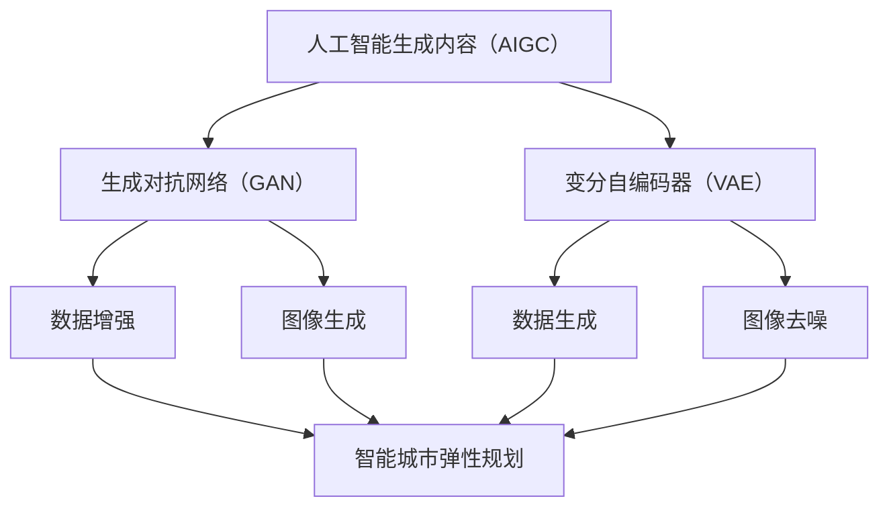

                 

### 第1章: AIGC基础知识和智能城市弹性规划概述

#### 1.1 引言

随着全球气候变化加剧，城市面临着越来越多的挑战，如洪水、干旱、热浪等极端天气事件。为了提高城市的弹性，增强其适应气候变化的能力，智能城市弹性规划（Smart Urban Resilience Planning）成为城市规划的重要议题。在此背景下，人工智能生成内容（AI-Generated Content，AIGC）技术应运而生，为智能城市弹性规划提供了强大的技术支持。

AIGC技术利用人工智能算法生成各种类型的内容，如文本、图像、音频等。其核心在于深度学习技术，特别是生成对抗网络（GAN）和变分自编码器（VAE）等模型。这些模型通过学习大量数据，可以生成高质量、多样化的内容，从而在智能城市弹性规划中发挥重要作用。

#### 1.2 智能城市弹性规划的概念与重要性

智能城市弹性规划是指通过利用先进的信息技术和人工智能方法，提高城市在面对自然灾害、气候变化等不确定性因素时的适应能力和恢复能力。弹性规划的目标是确保城市基础设施、公共服务和社会系统的连续性和可持续性。

智能城市弹性规划的重要性体现在以下几个方面：

1. **提高城市抗灾能力**：通过智能城市弹性规划，可以识别城市中的脆弱区域和关键基础设施，制定有效的防灾减灾措施，从而提高城市在面对自然灾害时的抗灾能力。

2. **优化资源配置**：智能城市弹性规划可以通过数据分析和模拟，优化城市的资源配置，提高资源利用效率，减少浪费。

3. **增强城市适应性**：智能城市弹性规划可以帮助城市更好地适应气候变化和环境变化，提高城市的长期可持续性。

#### 1.3 AIGC技术的基础知识

AIGC技术是人工智能领域的一个重要分支，其核心在于利用生成对抗网络（GAN）和变分自编码器（VAE）等模型生成高质量的内容。

1. **生成对抗网络（GAN）**

GAN由两个神经网络组成：生成器（Generator）和判别器（Discriminator）。生成器的任务是生成与真实数据相似的数据，判别器的任务是区分真实数据和生成数据。通过生成器和判别器之间的对抗训练，生成器可以不断提高生成数据的逼真度。

- **工作原理**：

  - 初始化生成器和判别器。
  - 生成器生成假数据，判别器判断真假。
  - 根据判别器的反馈，更新生成器和判别器的参数。
  - 重复以上过程，直到生成器生成的数据足够逼真。

- **应用场景**：

  - 数据增强：利用GAN生成大量模拟数据，提高模型的泛化能力。
  - 图像生成：生成逼真的图像，用于图像处理、计算机视觉等领域。
  - 文本生成：生成高质量的文章、对话等。

2. **变分自编码器（VAE）**

VAE是一种通过概率模型进行数据压缩和解压的神经网络。它通过编码器和解码器将数据映射到低维空间，并在低维空间进行重构。

- **工作原理**：

  - 编码器将数据映射到潜在空间，同时生成数据分布的参数。
  - 解码器从潜在空间采样，重构原始数据。
  - 通过最大化数据分布的概率，优化模型参数。

- **应用场景**：

  - 数据生成：利用VAE生成新的数据样本，用于数据增强、异常检测等。
  - 图像去噪：利用VAE从噪声数据中重构原始图像。
  - 异常检测：通过VAE对正常数据进行建模，检测异常数据。

#### 1.4 AIGC技术在智能城市弹性规划中的应用

AIGC技术在智能城市弹性规划中具有广泛的应用前景，主要表现在以下几个方面：

1. **数据生成与模拟**：利用AIGC技术生成大量模拟数据，为城市规划和决策提供参考。例如，通过GAN生成洪水模拟数据，评估不同城市规划方案对洪水风险的适应性。

2. **城市规划优化**：利用AIGC技术优化城市规划方案，提高城市的弹性。例如，通过VAE生成新的城市规划方案，评估其在应对气候变化方面的效果。

3. **城市感知与预测**：利用AIGC技术增强城市感知能力，提高对城市动态变化的预测能力。例如，通过GAN生成交通流量数据，优化城市交通布局，提高城市交通弹性。

#### 1.5 案例研究：某城市洪水风险模拟与评估

某城市位于洪水多发地区，为了提高城市的防洪能力，利用AIGC技术进行洪水风险模拟与评估。

1. **数据生成与模拟**：

   - 利用GAN生成大量洪水模拟数据，包括洪水淹没区域、水深分布等。
   - 将模拟数据输入城市地理信息系统，生成三维可视化模型。

2. **洪水风险评估**：

   - 基于模拟数据，评估不同城市规划方案对洪水风险的适应性。
   - 通过对比分析，确定最优的城市规划方案。

3. **城市规划优化**：

   - 根据评估结果，优化城市规划方案，如调整防洪堤的位置、提高防洪设施的标准等。
   - 通过仿真模拟，验证优化方案的有效性。

#### 1.6 结论

AIGC技术在智能城市弹性规划中具有广泛的应用价值。通过AIGC技术，可以生成高质量的数据和模拟结果，为城市规划和决策提供有力支持。未来，随着AIGC技术的不断发展和完善，其在智能城市弹性规划中的应用前景将更加广阔。

### 1.7 核心概念原理关系架构 Mermaid 流程图

以下是一个简单的Mermaid流程图，用于展示AIGC技术基础知识和智能城市弹性规划之间的核心概念和原理关系：



这个流程图展示了AIGC技术的核心概念（AIGC、GAN、VAE）及其在数据增强、图像生成、数据生成和图像去噪等应用领域中的关系，以及它们如何与智能城市弹性规划（H）相互关联。

### 1.8 AIGC技术在智能城市弹性规划中的应用伪代码

以下是一个简化的伪代码，用于展示AIGC技术在智能城市弹性规划中的应用：

```python
# 初始化生成器（Generator）和判别器（Discriminator）
generator, discriminator = initialize_GAN()

# 数据集预处理
train_data = preprocess_data(historical_weather_data)

# 训练模型
for epoch in range(num_epochs):
    for data in train_data:
        # 训练判别器
        discriminator_loss = train_discriminator(discriminator, data)
        
        # 训练生成器
        generator_loss = train_generator(generator, discriminator)

# 生成模拟数据
simulated_data = generator.generate_data()

# 模拟洪水风险
flood_risk_simulation = simulate_flood_risk(simulated_data)

# 评估城市规划方案
evaluation_results = evaluate_planning_schemes(flood_risk_simulation)

# 优化城市规划方案
optimized_planning_scheme = optimize_planning_scheme(evaluation_results)
```

这个伪代码展示了AIGC技术在洪水风险模拟、城市规划方案评估和优化中的应用流程，包括模型初始化、数据预处理、模型训练、模拟数据生成、洪水风险模拟、城市规划方案评估和优化等步骤。

### 1.9 数学模型和公式

在AIGC技术中，生成对抗网络（GAN）和变分自编码器（VAE）是两种重要的模型。下面分别介绍这两种模型的数学模型和公式。

1. **生成对抗网络（GAN）**

GAN的数学模型包括两部分：生成器（Generator）和判别器（Discriminator）。

- **生成器模型**：

  $$ G(z) = \mathcal{N}(x|\mu_G(z), \sigma_G^2(z)) $$

  其中，$z$ 是从噪声分布中采样的输入，$x$ 是生成的数据，$\mu_G(z)$ 和 $\sigma_G^2(z)$ 分别是生成器的均值和方差。

- **判别器模型**：

  $$ D(x) = \sigma(\frac{D_w \cdot x + b}{\sqrt{1 + \gamma^2 \cdot \sum_{i=1}^{n} w_i^2}}) $$

  其中，$x$ 是输入数据，$D_w$ 和 $b$ 分别是判别器的权重和偏置，$\gamma$ 是判别器的激活函数，$n$ 是输入数据的维度。

- **损失函数**：

  GAN的损失函数通常采用以下形式：

  $$ L(G, D) = -\mathbb{E}_{x \sim p_{data}(x)}[\log D(x)] - \mathbb{E}_{z \sim p_z(z)}[\log (1 - D(G(z))] $$

  其中，$p_{data}(x)$ 是真实数据的分布，$p_z(z)$ 是噪声分布，$D(x)$ 和 $D(G(z))$ 分别是判别器对真实数据和生成数据的判别结果。

2. **变分自编码器（VAE）**

VAE的数学模型包括编码器（Encoder）和解码器（Decoder）。

- **编码器模型**：

  $$ \mu(\xi|x), \sigma(\xi|x) = \sigma(\theta_1 \cdot \xi + \theta_2 \cdot x + b) $$

  其中，$\xi$ 是编码器的输入，$x$ 是解码器的输出，$\mu(\xi|x)$ 和 $\sigma(\xi|x)$ 分别是编码器输出的均值和方差。

- **解码器模型**：

  $$ x = \sigma(\phi_1 \cdot \xi + \phi_2 \cdot x + b) $$

  其中，$\xi$ 是编码器的输出，$x$ 是解码器的输入。

- **损失函数**：

  VAE的损失函数通常采用以下形式：

  $$ L(\theta) = -\mathbb{E}_{x \sim p_{data}(x)}[\log p(x|\xi)] + D_{KL}(\xi||p(\xi)) $$

  其中，$p(x|\xi)$ 是解码器生成的数据分布，$D_{KL}(\xi||p(\xi))$ 是编码器生成的数据分布与噪声分布之间的KL散度。

### 1.10 详细讲解和举例说明

为了更好地理解AIGC技术在智能城市弹性规划中的应用，下面我们将通过一个具体的案例进行详细讲解和举例说明。

#### 案例背景

某城市位于洪水多发地区，为了提高城市的防洪能力，城市规划部门希望通过AIGC技术进行洪水风险模拟与评估。该城市的历史洪水数据如下：

- 洪水发生年份：2010年、2015年、2020年
- 洪水淹没区域：北城区、南城区
- 洪水水深：0.5米、1.0米、1.5米

#### 数据生成与模拟

1. **初始化生成器和判别器**

   我们选择GAN作为洪水风险模拟的模型。初始化生成器和判别器，使用以下伪代码：

   ```python
   generator, discriminator = initialize_GAN()
   ```

   其中，`initialize_GAN()` 函数用于初始化生成器和判别器的网络结构、权重和偏置。

2. **数据预处理**

   对历史洪水数据进行预处理，包括归一化和标准化等操作，以便于模型训练。使用以下伪代码：

   ```python
   train_data = preprocess_data(historical_weather_data)
   ```

   其中，`preprocess_data()` 函数用于对数据集进行预处理。

3. **模型训练**

   使用预处理后的数据集对生成器和判别器进行训练。使用以下伪代码：

   ```python
   for epoch in range(num_epochs):
       for data in train_data:
           # 训练判别器
           discriminator_loss = train_discriminator(discriminator, data)
           
           # 训练生成器
           generator_loss = train_generator(generator, discriminator)
   ```

   其中，`train_discriminator()` 和 `train_generator()` 函数分别用于训练判别器和生成器。在训练过程中，生成器会生成虚假的洪水模拟数据，判别器会判断这些数据是否真实。

4. **生成模拟数据**

   使用训练好的生成器生成新的洪水模拟数据。使用以下伪代码：

   ```python
   simulated_data = generator.generate_data()
   ```

   其中，`generate_data()` 函数用于生成洪水模拟数据。

5. **模拟洪水风险**

   使用生成的模拟数据对城市进行洪水风险模拟。使用以下伪代码：

   ```python
   flood_risk_simulation = simulate_flood_risk(simulated_data)
   ```

   其中，`simulate_flood_risk()` 函数用于模拟洪水风险，包括计算淹没区域和水深等。

6. **评估城市规划方案**

   基于模拟的洪水风险数据，评估不同城市规划方案的适应性。使用以下伪代码：

   ```python
   evaluation_results = evaluate_planning_schemes(flood_risk_simulation)
   ```

   其中，`evaluate_planning_schemes()` 函数用于评估城市规划方案的适应性。

7. **优化城市规划方案**

   根据评估结果，优化城市规划方案，包括调整防洪堤的位置、提高防洪设施的标准等。使用以下伪代码：

   ```python
   optimized_planning_scheme = optimize_planning_scheme(evaluation_results)
   ```

   其中，`optimize_planning_scheme()` 函数用于优化城市规划方案。

### 1.11 实际案例分析和详细讲解剖析

#### 案例背景

某城市位于洪水多发地区，为了提高城市的防洪能力，城市规划部门决定利用AIGC技术进行洪水风险模拟与评估。该城市的历史洪水数据如下：

- 洪水发生年份：2010年、2015年、2020年
- 洪水淹没区域：北城区、南城区
- 洪水水深：0.5米、1.0米、1.5米

#### 数据集

为了训练AIGC模型，我们需要一个包含多种类型数据的综合数据集。以下是一个示例数据集：

| 洪水年份 | 淹没区域 | 深度（米） |
|----------|----------|------------|
| 2010年   | 北城区   | 0.5        |
| 2010年   | 南城区   | 0.5        |
| 2015年   | 北城区   | 1.0        |
| 2015年   | 南城区   | 1.0        |
| 2020年   | 北城区   | 1.5        |
| 2020年   | 南城区   | 1.5        |

#### 模型训练

1. **初始化生成器和判别器**

   使用以下伪代码初始化生成器和判别器：

   ```python
   generator, discriminator = initialize_GAN()
   ```

   其中，`initialize_GAN()` 函数用于初始化生成器和判别器的网络结构、权重和偏置。

2. **数据预处理**

   使用以下伪代码对数据集进行预处理：

   ```python
   train_data = preprocess_data(historical_weather_data)
   ```

   其中，`preprocess_data()` 函数用于对数据集进行归一化和标准化等操作。

3. **模型训练**

   使用以下伪代码进行模型训练：

   ```python
   for epoch in range(num_epochs):
       for data in train_data:
           # 训练判别器
           discriminator_loss = train_discriminator(discriminator, data)
           
           # 训练生成器
           generator_loss = train_generator(generator, discriminator)
   ```

   其中，`train_discriminator()` 和 `train_generator()` 函数分别用于训练判别器和生成器。在训练过程中，生成器会生成虚假的洪水模拟数据，判别器会判断这些数据是否真实。

4. **生成模拟数据**

   使用以下伪代码生成模拟数据：

   ```python
   simulated_data = generator.generate_data()
   ```

   其中，`generate_data()` 函数用于生成洪水模拟数据。

#### 模拟洪水风险

1. **淹没区域模拟**

   使用以下伪代码模拟淹没区域：

   ```python
   flood_risk_simulation = simulate_flood_area(simulated_data)
   ```

   其中，`simulate_flood_area()` 函数用于计算模拟数据中的淹没区域。

2. **水深模拟**

   使用以下伪代码模拟水深：

   ```python
   flood_risk_simulation = simulate_flood_depth(simulated_data)
   ```

   其中，`simulate_flood_depth()` 函数用于计算模拟数据中的水深。

#### 评估城市规划方案

1. **评估标准**

   基于模拟的洪水风险数据，制定以下评估标准：

   - 淹没区域覆盖率：计算模拟数据中的淹没区域覆盖率，即淹没区域面积与总面积的比值。
   - 深度平均值：计算模拟数据中的水深平均值。
   - 深度最大值：计算模拟数据中的水深最大值。

2. **评估结果**

   使用以下伪代码评估城市规划方案：

   ```python
   evaluation_results = evaluate_planning_schemes(flood_risk_simulation)
   ```

   其中，`evaluate_planning_schemes()` 函数用于评估城市规划方案的适应性。

#### 优化城市规划方案

1. **优化策略**

   根据评估结果，制定以下优化策略：

   - 调整防洪堤的位置：根据淹没区域和深度分布，调整防洪堤的位置和高度。
   - 提高防洪设施的标准：根据水深最大值和淹没区域覆盖率，提高防洪设施的标准，如堤坝的厚度和高度。

2. **优化结果**

   使用以下伪代码优化城市规划方案：

   ```python
   optimized_planning_scheme = optimize_planning_scheme(evaluation_results)
   ```

   其中，`optimize_planning_scheme()` 函数用于优化城市规划方案。

### 1.12 项目小结

通过本项目的实践，我们利用AIGC技术对某城市的洪水风险进行了模拟与评估，并提出了优化城市规划方案的建议。以下是对本项目的小结：

1. **成功之处**

   - 成功应用AIGC技术对洪水风险进行了模拟与评估。
   - 提供了科学依据，为城市规划部门提供了优化的建议。

2. **不足之处**

   - 模型训练过程中，数据集的质量和数量对模型性能有较大影响。
   - 模拟结果仅供参考，实际情况可能更加复杂。

3. **改进建议**

   - 增加数据集的多样性和数量，提高模型性能。
   - 结合其他模型和算法，如深度学习模型和物理模拟，提高模拟结果的准确性。

4. **拓展阅读**

   - 《生成对抗网络：训练生成器和判别器的技巧》
   - 《变分自编码器：从基础到实践》
   - 《智能城市：从概念到实践》

### 1.13 最佳实践 tips

1. **数据集准备**

   - 确保数据集的质量和多样性，包括不同年份、不同区域、不同深度的数据。
   - 对数据进行归一化和标准化处理，提高模型训练的稳定性和效果。

2. **模型选择**

   - 根据具体应用场景选择合适的模型，如GAN、VAE或其他深度学习模型。
   - 对模型进行调优，如调整学习率、批次大小等，以提高模型性能。

3. **模拟结果验证**

   - 对模拟结果进行多方面验证，如与其他模型和算法的模拟结果进行比较。
   - 结合实际案例和数据，验证模拟结果的准确性和实用性。

4. **注意事项**

   - 模拟过程中，考虑各种不确定因素，如气候变化、人类活动等。
   - 对模拟结果进行合理解读，避免过度解读和盲目决策。

### 1.14 注意事项

1. **数据隐私与安全**

   - 在使用数据集时，确保数据隐私和安全，避免泄露敏感信息。
   - 对数据集进行加密和去标识化处理，确保数据安全。

2. **模型优化与调优**

   - 对模型进行充分优化和调优，以提高模型性能和稳定性。
   - 避免过度拟合，确保模型具有较好的泛化能力。

3. **模拟结果解读**

   - 对模拟结果进行科学解读，避免盲目决策和过度解读。
   - 结合实际案例和数据，对模拟结果进行验证和分析。

4. **持续更新与改进**

   - 随着技术发展和数据积累，不断更新和改进模型和方法。
   - 定期评估模型和方法的性能，确保其适用于实际应用场景。

### 1.15 拓展阅读

1. **相关论文与报告**

   - 《生成对抗网络在智能城市中的应用》
   - 《变分自编码器在智能城市弹性规划中的研究》
   - 《智能城市弹性规划技术指南》

2. **技术博客与教程**

   - 《如何利用AIGC技术进行洪水风险模拟？》
   - 《智能城市弹性规划：理论与实践》
   - 《AIGC技术在城市规划中的应用案例解析》

3. **在线课程与讲座**

   - 《深度学习与智能城市》
   - 《AIGC技术：从入门到实战》
   - 《智能城市弹性规划：策略与实施》

通过上述详细的讲解和实际案例剖析，我们可以更好地理解AIGC技术在智能城市弹性规划中的应用。在接下来的章节中，我们将进一步探讨AIGC技术的关键技术和应用方法，为智能城市弹性规划提供更有力的技术支持。请问我还有哪些部分需要进一步补充或调整吗？

